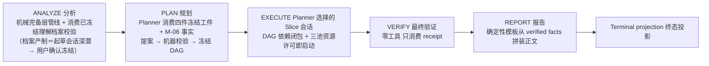
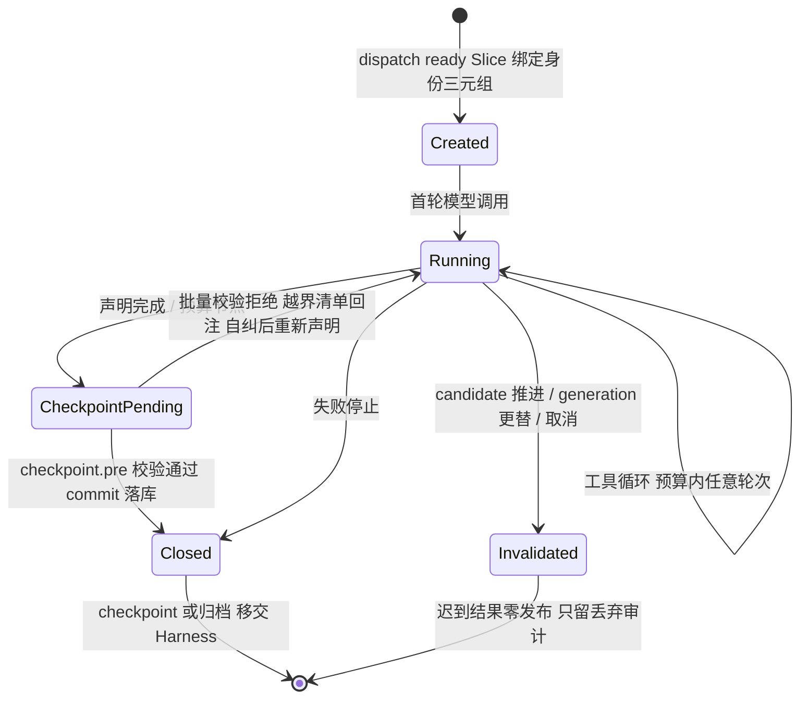
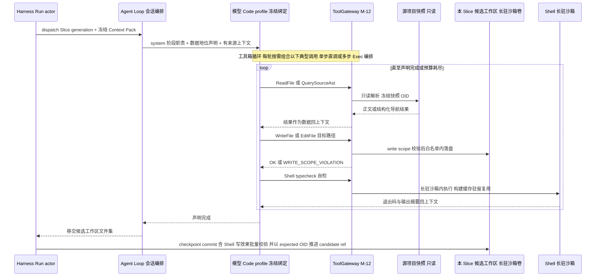

# CodeMigrator Agent Loop：阶段编排与工具箱调用循环

> 文档状态：V6 方向对齐版；本篇是五阶段模型会话编排、EXECUTE 模型↔工具箱调用循环、常驻协调会话、修复会话与会话隔离边界的唯一 owner。  
> 技术范围：阶段与模型档绑定、EXECUTE 六工具调用循环（L1-L4 四层）、Shell 会话自检与 Exec 编排、四类 Slice 会话上下文构成、Spec 起草会话、常驻协调会话类型、修复会话与重生升级包、重生成历史注入、P-05 数据边界、失败传播与会话失效。  
> 契约真相：Phase、RunStatus、ModelProfile、Phase 工具授权矩阵、WriteScope、稳定错误码与预算语义以 [M-00 垂类设计原则与架构哲学](CodeMigrator_垂类设计原则与架构哲学.md) 为准；本篇只定义它们在循环中的使用边界。  
> 关联文档：[Harness 总体设计](CodeMigrator_Harness总体设计.md)、[Migration Spec](CodeMigrator_Migration_Spec抽象层.md)、[候选工作区与工具网关](CodeMigrator_候选工作区与工具网关.md)、[工具系统与 Hook](CodeMigrator_工具系统与Hook.md)、[记忆与上下文管理](CodeMigrator_记忆与上下文管理.md)、[验证引擎](CodeMigrator_验证引擎.md)、[会话与运行时修正编排](CodeMigrator_会话与运行时修正编排.md)

Agent Loop 是在正确的运行阶段，以冻结的模型配置消费有来源的上下文，并通过类 IDE 工具箱与候选工作区交互的编排循环。它不拥有状态机：状态转移、Slice 调度、集成与终态归约全部由 Harness 的 Run actor（M-03）完成，Loop 只负责阶段内的模型会话、工具调用循环与结果移交。

P-01 在本篇的落点是"Agent 直写、Harness 编排"：EXECUTE 的 Agent 持 `ReadFile/WriteFile/EditFile/QuerySourceAst/Shell/Exec` 六工具（L1-L4 四层工具面，见 [M-00](CodeMigrator_垂类设计原则与架构哲学.md) Phase 工具授权）在候选工作区直接写目标代码，产出就是候选工作区中的目标代码文件本身；Harness 编排层不逐键介入文件内容，垂类价值沉淀在它的分解、上下文、验证与集成闭环。EXECUTE 循环是模型与工具箱之间的单层调用循环——Agent 像使用 IDE 一样读源码、查结构、写目标、在长驻沙箱内跑构建与自检，循环直至声明完成或预算耗尽；完成后由 Harness 对候选工作区文件集提交 checkpoint commit（提交时校验工作区 Git diff 全落冻结 write scope，覆盖 Shell 写效果；候选工作区机制归 M-08，本篇只引用）。

Loop 不自由扩大工具权限，不把模型的自然语言解释当作代码、计划或验证事实。不同 Slice 会话彼此隔离：每个会话只能读自己的 Context Pack、写自己的候选工作区，不能触达 Git ref、PostgreSQL、其他 Slice 的候选工作区或 sandbox 控制面。Web 只消费 actor 已持久化的活动投影（M-15），不能从 UI 反向控制 Loop、工具或模型调用。本篇不定义工具 frame 明细与拒绝码清单（M-12）、Context Pack 装配与逐出策略（M-14）、checkpoint 事务与候选工作区生命周期（M-08/M-11），只定义它们在循环中的使用边界。

## V5 当前对齐

起草阶段先消费预索引知识图谱并按模块/目录域扇出只读探索会话；子会话不直接互发消息，只提交带 file:range 锚点、覆盖度和置信度理由的结构化探索报告。主会话合并报告并处理显式冲突，产出并供用户一次确认四件工件：MigrationSpec、UnderstandingDossier、TargetProjectBlueprint、MigrationRulebook。PLAN 阶段由 LLM Planner 依据四件冻结输入提案，机器校验后自动冻结，不逐 Slice 请求用户确认。EXECUTE 仍使用六工具与长期 Slice 沙箱卷；VERIFY 仍由确定性 Oracle 裁决。

## V6 方向对齐（演进说明，V5 对齐段留存追溯）

V6 在 V5 的方向对齐基础上补充两类会话形态；V5 的阶段编排、六工具循环与数据边界保持不动，V5 对齐段如上留存仅供追溯，不因本次演进作废：

- **常驻协调会话类型**：新增两类常驻会话——起草期的探索协调者（由主会话升级）与执行期的 EXECUTE Supervisor（被动唤醒）。二者落在既有六工具与阶段编排之上，以"建议而非直写"承载 Agent Loop 判断层，均计入模型会话池并受独立预算档。
- **修复会话 / 重生升级包**：新增"修复会话"会话类型承担全局修复决策的专门会话（身份 `(run_id, repair_decision_id)`）；并说明简单场景下原 Slice 重生会话可获"升级包"（全境读视野 + 修复简报）。

本章节标题沿用惯例命名，编号与后续章节顺序保持既有；本节点明 V6 相对 V5 的增量，其余章节文字保留原样，保证追溯一致。

## 五阶段的职责边界

阶段不是五个模型产品。Run 创建时冻结两档 `ModelProfile { Reasoning, Code }` 到五个阶段的绑定（M-00：ANALYZE→Reasoning、PLAN→Reasoning、EXECUTE→Code；VERIFY 不开模型会话、REPORT 正文由确定性模板从 verified facts 拼装——两者均无模型档位），缺失绑定在 CreateRun 前拒绝。分工基线是信息分层：机械完备层产候选事实，起草期多会话探索与主会话合并产出四件工件并经用户确认入闸，PLAN 由 LLM Planner 提案再经机器校验；模型在 EXECUTE 担任执行主体，VERIFY/REPORT 无模型会话。

| 阶段 | 进入状态 | 主要输入 | 可产生的结果 | 确定性管线与模型的边界 |
|---|---|---|---|---|
| ANALYZE | `ANALYZING` | 冻结源快照 OID、M-06 机械完备层产物与四件冻结工件 | 机械层↔冻结档案一致性校验结论（偏差记入分析投影，不回写工件） | M-06 负责机械枚举；本阶段不重新生成语义档案 |
| PLAN | `PLANNING` | M-06 事实与关系图、四件冻结工件、Spec 分解原则 | 无（Loop 只消费计划投影） | Planner（M-07）生成 PlanProposal；机器校验四项门禁后自动冻结 Slice、DAG、write scope 与 integration_rank |
| EXECUTE | `EXECUTING` | 本 Slice generation 的冻结 Context Pack（含档案相关摘录） | 候选工作区中的目标代码文件 | 模型与工具箱的循环是执行主体；Harness 不逐键介入文件内容，只做 write scope 校验、checkpoint 与验证 |
| VERIFY | `VERIFYING` | 冻结最终 verified head、最终验证 receipt | 无（Loop 只消费 receipt 投影） | 零工具、零模型副作用；最终检查由 Run actor 经 InternalVerificationDispatch 派发（M-09/M-10） |
| REPORT | `REPORTING` | verified facts、检查与交付事实 | 语义等价证据页与报告正文（确定性模板拼装） | 无模型会话：正文由确定性模板从 verified facts 拼装（挡位收敛定案，更可审计）；不访问未验证候选 |

ANALYZE 的边界：import 图、模块清单、测试清单与构建清单是 PLAN 与四类会话上下文的公共输入，必须可由冻结快照 OID 确定性重建（M-06）。分析期模型摘要只服务于人类可读投影，省略它不改变任何下游输入；辅助核验的工具面与授权矩阵中 ANALYZE 的只读子集一致（ReadFile/QuerySourceAst），不引入新的信任面。

PLAN 的边界：依赖边、write scope 与集成序是并发安全与结果确定性的载体（P-03）。Planner 从 M-06 事实、关系图和四件冻结工件提出方案；机器校验四项门禁后，actor 冻结计划。运行中的计划调整一律经 M-16 的 PlanRevision 由 actor 冻结后再生效；模型在任何时点都不可直接写已冻结 DAG 边、write scope 或 integration_rank。

VERIFY 与 REPORT 保持零工具且均无模型会话：最终验证的裁决必须完全确定——冻结 verified head、冻结检查集、typed receipt 与 verification fingerprint（M-10），任何模型介入都会破坏 fingerprint 的可复算性。REPORT 的报告正文与语义等价证据页素材（通过率、失败清单、覆盖映射、等价信心分级）全部来自 verified facts 与检查结果，由确定性模板拼装——模板输出不含任何未验证叙述，比生成式组织更可审计（挡位收敛定案）。

EXECUTE 不再把 Slice 固定为契约层/实现层两波；Planner 提案中的 DAG 和依赖闭包决定就绪条件，依赖闭包就绪即启动。Loop 只消费冻结的 write scope、integration_rank、Context Pack 和六工具授权；任一时刻的并行会话数由 DAG ready、范围互斥和三池资源许可共同决定。以往的分层名称只作为兼容展示标签。

Loop 在每个阶段入口检查 phase/status 配对、Run 取消标记、冻结 binding 与预算门；EXECUTE 会话另须匹配 Slice、active generation 与创建时 candidate OID。任一检查失败时模型请求、工具调用和 outcome 发布均为零。Run version 只用于外部 API 的 `If-Match`，不进入每次模型调用。

会话粒度随阶段变化：ANALYZE 与 PLAN 是 Run 级的少量短会话——输入是 M-06/M-07 的确定性产物，无候选工作区，工具面只有只读两件；EXECUTE 是每 Slice generation 一个长会话，绑定候选工作区（长驻沙箱卷）与六工具；VERIFY 与 REPORT 均不开设模型会话（REPORT 正文由确定性模板从 verified facts 拼装）。五阶段之前还存在 Spec 起草会话——ANALYZE 前的交互阶段（含深潜理解阶段，即理解会话本体），由 M-16 会话 Agent 承担，本篇在"Spec 起草会话"一节定义其工具面与循环边界。各 phase 的调用批量与预算档位由 M-14 差异化配置。

所有阶段输入都由 actor 注入并携带来源身份：分析事实带冻结快照 OID，计划输入带计划指纹，会话上下文带 generation 与 candidate OID。Loop 不自行采集输入——它消费的每一条上下文都能回答"从哪个冻结事实来"，这是 M-14 上下文投影与调用审计的前提。

## EXECUTE：模型与工具箱的调用循环

### 会话模型与生命周期

EXECUTE 的调度单元是"一个 Slice generation 一个会话"：Harness 为 ready Slice 创建候选工作区（M-08）与冻结 Context Pack（M-14），以 Code profile 开启会话；循环 = 模型请求工具 → ToolGateway（M-12）执行并回写结果 → 模型继续，直至声明完成或预算耗尽。文件内容由 Agent 直接产出，Harness 编排层对白名单内的写入不逐键介入——它的职责在循环两端：dispatch 时注入冻结上下文，终止时提交 checkpoint commit 并移交验证。信任的落点因此从模型输出格式移到模型动作空间：write scope 校验限定 Agent 能写哪里，长驻沙箱限定 Agent 能在哪里执行，确定性 Oracle 裁决它写得对不对。

| 会话阶段 | 触发 | 会话可做 | 结束方式 |
|---|---|---|---|
| 创建 | Harness dispatch ready Slice | 装配上下文，绑定会话身份三元组 (slice_id, generation, candidate OID) | 模型首轮调用 |
| 运行 | 首轮调用后 | 六工具循环，预算内任意轮次 | 任一终止条件 |
| checkpoint 待定 | 声明完成 / 预算节点 | 只读：消费校验拒绝反馈并自纠（回退越界变更后重新声明） | 校验通过关闭；拒绝回运行态 |
| 关闭 | checkpoint 校验通过 / 失败停止 | 只读：审计与移交 | checkpoint 或归档 |
| 失效 | candidate 推进 / generation 更替 / 取消 | 无；迟到结果零发布 | 丢弃审计 |

会话身份失效即会话作废：重生成创建新 generation、candidate ref 被推进或 Run 取消后，旧会话不再接纳模型调用与工具请求，迟到结果只产生丢弃审计事件。不存在"会话复活"；对同一 Slice 的后续修改只能经由新 generation 会话或集成层归因触发。

按 generation 切会话服务于两条 V4 不变量：P-07 要求每个 generation 拥有独立候选工作区、上下文与 Artifact 命名空间，会话边界即上下文与副作用的边界；generation `0`~`2` 的定向重生成要求旧会话可整体作废而不留下半开状态。会话不跨 generation 复用，也不跨 Slice 复用——并行 Slice 的会话之间没有任何共享可变状态，唯一共享的输入是只读源快照与已集成契约。

### 六工具的授权与边界

工具授权的唯一真相源是 M-00 的 Phase 工具授权矩阵（`core://phase-tool-policy/v2` 包内静态资源）；Loop 不缓存、镜像或重新表述该 policy，只把模型工具请求连同 Run、Phase、会话身份交给 ToolGateway，由 Gateway 加载 policy 裁决。本表描述六工具可触达的资源与边界，完整 frame 规则与拒绝码清单归 M-12。

| 工具 | 可触达资源 | 边界与拒绝 |
|---|---|---|
| `ReadFile` | 源项目快照（只读，任意文件）、已集成契约（verified 中的契约文件与 ContractArtifact）、本 Slice 候选工作区 | 不可读其他 Slice 的候选工作区与任何未集成候选；源路径解析以冻结快照 OID 为准 |
| `WriteFile` / `EditFile` | 仅本 Slice 冻结 write scope 内路径 | 越界返回 `WRITE_SCOPE_VIOLATION`，文件写入与 ref 推进均为零；会话无权请求动态扩大集合 |
| `QuerySourceAst` | 源快照的结构化导航（符号、导出、import 关系，查 PSF-2 索引的只读服务，M-06） | 只读；导航对象限定源快照，不覆盖候选工作区 |
| `Shell` | 该 Slice 专属长驻沙箱卷（候选工作区即沙箱卷，M-08/M-09）：构建、依赖安装、探索、会话自检的自由命令执行，构建缓存与已装依赖跨命令驻留复用 | 宿主文件系统零触碰；写效果不走逐写路径门，由 checkpoint 提交时工作区 Git diff 批量校验兜底（越界拒绝提交且不污染 verified，M-08）；工具级失败只有超时与配额超限（`SHELL_TIMEOUT`/`SHELL_LIMIT_EXCEEDED`，M-12），非 0 退出码是正常反馈 |
| `Exec` | app 进程内嵌入式 JS 引擎：以脚本 `await tools.xxx()` 编排 L1-L3 全部工具（循环/条件/并行组合） | 脚本零环境权威——引擎不暴露文件系统/网络/进程 API，唯一出口是工具桥；底层每次工具调用逐笔过 ToolGateway，防护与直调不降级；验证裁决不经 Exec（P-02，M-12） |

**消费边界例：**VERIFY 阶段若模型请求查看一个报错文件，Gateway 按 M-00 policy 返回 `TOOL_PHASE_DENIED`，不降级为 ReadFile，也不从源快照取正文；该阶段只能消费 M-10 生成的诊断与 receipt 引用。

分层工具面是现行四层安全模型的根基：Agent 能做的最坏事情被限制在"向本 Slice 白名单写文件、读冻结快照、在该 Slice 专属长驻沙箱卷内执行命令"之内——结构化通道（L1/L2）的越权尝试表现为一次类型化拒绝而不是一次被拦截的副作用；`Shell`（L3）的自由执行被沙箱物理边界限定，宿主零触碰，写效果由 checkpoint 批量校验兜底；`Exec`（L4）零环境权威，唯一出口是工具桥。网络出口受控（依赖安装外联语义归 M-09），对控制面（Git ref、PostgreSQL、sandbox 控制面）没有任何句柄。安全边界因此可审计、可测试。

### 调用循环

下图为一次 EXECUTE 会话的完整生命：dispatch 注入冻结上下文，循环段展示典型的读—写—自检三类调用，终止后由 Harness 接管 checkpoint。

循环中的读结果与命令输出（源码正文、契约、Shell 输出）一律作为数据回上下文，不触发任何指令语义解释；结构化写结果只有成功或类型化拒绝两种，Shell 非 0 退出码是正常反馈而非拒绝；拒绝与失败均不终止会话，模型可据此修正后继续。

每一轮等于一次模型调用：消费此前累积的工具结果，发出本轮工具请求。采用单轮多段动作编码时（[M-12](CodeMigrator_工具系统与Hook.md)「模型↔Harness 动作编码」节），Loop 对同轮多段逐段执行、逐段回灌观测结果——前一段的失败或拒绝不吞并后一段，全部段落回灌完毕才进入下一轮。轮数没有固定上限，只受会话预算门与 phase 预算门约束；工具结果（正文、命令输出、拒绝码）在进入下一轮前由 M-14 决定保留、摘要或逐出，避免长会话把上下文预算耗尽在中间产物上。

### Exec 编排：一次模型调用多步执行

一轮工具请求可以是单工具直调，也可以是一次 `Exec` 脚本：Agent 在脚本内以 `await tools.xxx()` 组合 L1-L3 全部工具（循环、条件、并行 `Promise.all`），一次模型调用完成多步确定性编排——这是串行 LLM 循环瓶颈的解法。选择规则是"单步直调，多步编排"：单条命令直调 `Shell`，批量同构操作或多工具组合流程用 `Exec` 脚本；`Exec` 是组合的超集、直调是单步的最短路径，该规则写入工具描述由模型自然遵循，无硬性门控。典型场景：批量源结构探索把数十轮串行模型调用压缩为一轮、契约变更后的跨文件一致性修订、查→读→改→自检的组合流程。

编排不降级防护：`Exec` 底层每次工具调用逐笔过 ToolGateway，write scope 与路径门照常生效，脚本零环境权威——引擎不暴露文件系统/网络/进程 API，唯一出口是工具桥，验证裁决不经 Exec（P-02）。脚本全文与逐笔回执进入工具审计；`Exec` 内工具调用计入会话配额，脚本超时或运行时错误归约为一次可自纠的工具失败（`EXEC_TIMEOUT`/`EXEC_SCRIPT_ERROR`，M-12），模型改脚本重试而不终止会话。

### Shell 会话自检：反馈不裁决

自检给 Agent 一个会话内的反馈闭环：写完目标代码即可在长驻沙箱内跑构建、类型检查或 lint，读原始输出就地自纠，而不必等 Harness 局部验证失败后返工。自检并入 `Shell`——自由命令、自由参数，直接在该 Slice 专属长驻沙箱卷内执行，构建缓存与已装依赖跨命令驻留复用，同会话重复构建/测试不重复下载与冷编译。`CheckRunner` 作为 Agent 工具已退役：模型工具注册表移出该变体，请求该工具名返回 `TOOL_NOT_FOUND`（退役语义归 M-12）；描述符冻结的检查命令模板只服务裁决层 `InternalVerificationDispatch` 与 Scaffold 基线初始化，模型工具面与描述符命令面不再有交集。

会话内自检与验证层裁决的关系是明文边界：会话内 Shell 自检是反馈——不写 `CheckResult` 账本、不推进任何 ref、不进入验证 fingerprint；验证层测试是裁决事实——由 Run actor 经裁决层 `InternalVerificationDispatch`（非模型工具）以冻结检查集 + 从 tested commit 临时物化的独立目录做出（M-09/M-10）。Agent 自检通过不等于局部验证通过：提交 checkpoint 后 Run actor 仍按冻结检查集独立派发局部验证；验证独立性不依赖自检同面——无论模型在会话内执行了什么命令，fingerprint 的计算输入不受任何影响（P-02）。工具调用受 M-12 frame 规则与 M-00 资源上限约束（模型工具档超时、输出流上限）；超时或超限归约为该次调用的失败结果回上下文，模型可据此收缩检查范围或修正代码，不终止会话。

| 反馈/裁决来源 | 发起方 | 检查内容 | 结果去向 |
|---|---|---|---|
| 会话内 Shell 自检 | 模型请求、长驻沙箱内自由执行 | 快速反馈（构建/语法/lint/类型检查，模型自选命令） | 只回会话上下文，驱动模型自纠 |
| 局部验证 | Run actor 经裁决层派发 | 语法 + 对契约的类型检查（M-10） | `CheckResult`，裁决 LOCALLY_VERIFIED |
| 集成/最终验证 | Run actor 经裁决层派发 | 增量全量 / 翻译后全套测试（M-10） | `CheckResult` + fingerprint，裁决集成与终态 |

三层关系可概括为：会话内自检帮 Agent 把候选写到"看起来对"，验证层用冻结检查集证明"确实对"——自检与裁决不共享命令面也不共享事实账本，前者只驱动模型自纠，后者才是裁决事实的唯一来源。

### 循环终止与移交

循环只有三种出口，且三种出口都把控制权交还 Harness：

| 终止条件 | 触发方 | Loop 收尾 | Harness 后续 |
|---|---|---|---|
| 模型声明完成 | 模型 | 停止循环，移交本 Slice 候选工作区文件集 | checkpoint commit、以 expected old OID 推进 candidate ref，进入局部验证（M-10） |
| 预算节点 | 预算门（token/cost 达上限） | 停止新调用，保存会话审计 | 依 M-03 归档未验证候选并以 `BudgetExhausted` 收敛 |
| 失败停止 | provider 终态失败 / 会话级不可恢复错误 | 记录失败事实 | Slice 重生成判断（generation 余额内）或 Run 级失败传播 |

声明完成后会话进入 checkpoint 待定态：Harness 执行 `checkpoint.pre` 批量校验——通过则提交 commit、candidate ref 以 expected old OID 推进并关闭会话；拒绝则拒绝事件（越界路径清单）回注同一会话上下文，会话回运行态，Agent 回退越界变更后重新声明完成（generation 不消耗，处置语义 owner M-08/V-M08-V4-007）。单 generation 内的自纠重声明次数受会话预算与实施期上限参数约束，超限按失败停止归约（上限参数归属本篇实施期项，防止无界循环）；checkpoint 幂等键与推进规则由 M-08/M-11 所有。校验通过关闭后，对该 Slice 的一切修改请求都指向新 generation 会话。三种终止殊途同归——会话不再接纳模型输出，剩余动作全部回到 Harness 控制流，Loop 不保留任何跨会话可变状态。

## 四类会话的上下文构成

四类 Slice（其中 Contract 可为 0）按 Planner 冻结的 SliceKind 开启相应会话，不再绑定 EXECUTE 的两个固定拓扑层：若存在契约 Slice，下游会话按各自依赖闭包就绪；实现、测试翻译与测试生成会话不因全仓库契约未清空而等待。四类 Context Pack 构成互不混用：

| 会话 | SliceKind | 拓扑层 | 上下文构成 | 初始工作区 |
|---|---|---|---|---|
| 契约会话（若存在） | Contract | 兼容展示标签 | 源项目结构与模块清单（M-06 分析事实）、源构建摘要（清单、依赖、脚本）、目标端工具链约定（包管理器、脚手架/构建/测试命令、目录与命名约定）、Spec 语言对约束 | 空 |
| 实现会话 | Implementation | 实现层 | 所分配源模块代码、依赖模块的 ContractArtifact（目标路径、公开签名、types_hash）、目标端约定 | 空 |
| 测试翻译会话 | TestTranslation | 实现层 | 源测试文件、覆盖模块归属的契约签名（ContractArtifact）、目标测试框架约定 | 空 |
| 测试生成会话 | TestGeneration | 实现层 | 源模块正文（被测模块代码语义）、契约签名（ContractArtifact 目标路径、公开签名、types_hash）、生成指引（目标测试框架约定与生成规则） | 空 |

**测试类会话信息防火墙**：测试翻译与测试生成会话的上下文**不含被测实现的目标语言正文**（无论其是否已集成）——注入实现正文会让"测试向实现看齐"替代"测试向源语义看齐"，瓦解移植/生成主证的对源锚定。防火墙由 M-14 装配侧强制（pack 构成不包含该来源），模型运行期也不得经补读绕入其他 Slice 的候选工作区（既有工具边界已强制）；被测行为事实只经契约签名这一确定性接口进入测试上下文。

测试生成会话承载"源模块无测试"的 Slice：Planner 对无测试模块派生 TestGeneration Slice（M-07），会话以源模块代码语义+契约签名为锚点生成目标语言测试——行为锚定源语义而非凭空编写，断言对象来自源代码的可观察行为与契约签名。产出全链路携带 GENERATED 标注：测试生成 Slice 的产出文件、CheckResult receipt、验证 fingerprint 与 REPORT 证据页全部显式标注 GENERATED，与移植测试严格区分（M-00/M-10）。

不混用的含义：实现会话不携带无关模块正文（按源 import 图裁剪）；测试翻译与测试生成会话遵循信息防火墙——不携带被测实现的目标语言正文（已集成与否均然），也不携带未集成候选；测试生成会话只携带其覆盖模块的源正文与契约签名，不携带实现细节正文，也不携带移植测试源文件；契约会话不携带实现细节。会话运行期可按需补读——实现会话自由 ReadFile 源项目任意文件、QuerySourceAst 导航源结构、Shell 自检，测试翻译与测试生成会话亦然——但补读同样受来源边界约束：模型不能读其他 Slice 的候选工作区，这一边界由工具层强制而非提示词约定。四类会话共享同一循环与工具面，差异只在初始上下文与典型反馈回路：契约会话以契约类型检查为主反馈收敛接口形状与目标项目骨架；实现会话在契约签名约束下翻译行为，以类型检查与 lint 为主反馈；测试翻译会话对齐目标测试框架的断言语义，行为正确性留给 VERIFY 的最终测试裁决；测试生成会话在源语义锚点下编写目标测试，以"生成测试可被目标工具链执行"为主反馈，证据力分级由 REPORT 声明（生成测试主证降一档并标注理解偏差风险，M-00）。

四类 Context Pack 均在 dispatch 时冻结：契约输入取自当时最新 verified，源模块取自冻结源快照，目标端约定取自 Spec 锁定的描述符版本；pack 另含两份知识工件的当前版本相关章节——已确认理解档案的关联摘录（M-14 装配）与迁移规则手册的消费版本章节。会话运行期 verified 可能被其他 Slice 推进，但本会话的契约输入不随之漂移——依赖更新只能通过下一 generation 会话进入，避免同一候选对移动目标编译；规则书版本在 pack 冻结时点锁定，其后发生的规则追加由后续派发会话继承。

重生成会话的历史注入：定向重生成（generation 更替）开启新会话时，Context Pack 除常规构成外注入两件前代事实——前代失败诊断摘要与前代 checkpoint diff 摘要。这是历史事实供给而非自由记忆：诊断摘要来自集成层归因与验证 receipt，diff 摘要来自前代 checkpoint commit，二者均为已持久化事实的投影（装配与预算治理边界归 M-14）；会话不存在除此以外的任何跨 generation 记忆，前代失败不直接决定新一代结论，只作为修正起点进入上下文。

**规则条目提案出口**（fb8 续对齐，Anthropic 迁移实践吸收）：重生成会话的归因诊断揭示**系统性**误译模式（同一规则缺失跨文件重复致错）时，owning 会话除修正代码外可附《规则条目提案》——条目带归因引用与理由，经 Harness 记入 `run_events` 审计后写入 MigrationRulebook 并递增版本（M-00 契约）；新版本即时生效于**后续派发**会话的 Context Pack 规则书章节，已集成成果零追溯。提案是会话产出的可选组成，不构成写通道——采纳与入账由 Harness 完成，模型不能直接修改任何其他 Slice 或已冻结工件。

**会话类型扩展的上下文构成补充**：上述四类 Slice 会话的测试类**信息防火墙保持不变**——测试翻译/测试生成会话仍不注入被测实现的目标语言正文（已集成与否均然），被测行为事实仅经契约签名进入上下文。新增的常驻协调会话与修复会话的上下文构成标注如下：

| 会话 | 上下文构成 | 备注 |
|---|---|---|
| 探索协调者 / EXECUTE Supervisor（常驻协调会话） | 机器态势快照（不入上下文）+ 触发时定向事件投影注入 + 滚动摘要（历史唤醒有界窗口） | 只出建议（Advice）、零直写；输入经 Harness 注入，不带自由跨会话记忆 |
| 修复会话 | 修复简报（必要输入）+ 全 Run verified 树 / 源快照 / 失败测试 / PSF-2 调用链（导航索引式按需 `ReadFile`） | 身份 `(run_id, repair_decision_id)`，不占原 Slice generation 0-2 |
| 原 Slice 重生会话（升级包场景） | 常规重生成 Context Pack（含前代失败诊断与前代 diff 摘要）+ 全境读视野 + 修复简报 | 仍占用原 Slice generation，验证走 checkpoint→局部→集成 |

修复简报为修复会话与重生升级包会话的**必要输入**；其余读路径（verified 树、源快照、调用链细部）采用导航索引式按需 `ReadFile`，超限细节的装配与预算治理归 M-14（字段 schema 与装配规则为实施期开放项，在 M-14/M-16 定案前不臆造）。

## 理解会话：语义消解本体＝起草会话深潜（产制点归一）

产制点归一定案：理解会话的本体是 Spec 起草会话的深潜阶段。主会话按模块/目录域扇出只读探索子会话，合并带 file:range 锚点和置信度理由的结构化报告，产出 Spec、UnderstandingDossier、TargetProjectBlueprint、MigrationRulebook 四件工件。用户确认后四者一起哈希冻结为 Run 输入；ANALYZE 不重新生成语义档案，只做机械完备层管线与一致性校验。

- **探索策略**：入口文件 → 依赖闭包定向展开 → 代表性文件抽查；批量结构查询用 `Exec` 编排只读工具（一次调用多步探索），深度由预算档约束（`Shallow/Deep`，M-14 数值实施期基准；小项目可浅档甚至跳过深潜）。
- **工具面**：`ReadFile`/`QuerySourceAst`/`Exec`（编排只读三件），无任何写权限；档案草稿经会话通道持久化（TaskDraft 体系，M-16），不经 WriteFile。
- **档案质量纪律**：全条目 file:range 锚点必填且可解析到冻结快照内真实位置；无法锚定的叙述显式标记 `advisory`；覆盖率自述如实声明触达与未读区域；不引入概率置信度——判定附文字理由。
 - **确认门**：四件工件草稿随起草会话一并交用户审阅，显式确认后分别记录版本和 hash 并冻结为 Run 输入；未确认的工件零 Run 副作用。PlanRevision 时仅对发生语义变化的工件走 M-16 重确认通道。
- **执行继承**：各 EXECUTE 会话 Context Pack 按 source_modules 关联注入档案摘录（惯用法/风险提示/依赖叙事，M-14 装配规则），替代执行期盲探。

## Spec 起草会话：ANALYZE 前的交互阶段

Spec 起草会话是四类 Slice 会话之外的一类模型会话，发生在 ANALYZE 之前：用户先与 Agent 对齐"迁移什么"，Spec 经用户显式确认生效后才进入 CreateRun 与五阶段管线。它含深潜理解阶段——理解会话本体即此深潜（见上节产制点归一）。它是 [M-16](CodeMigrator_会话与运行时修正编排.md) 会话 Agent 承担的交互阶段，本篇只定义其工具面与循环边界，TaskDraft/Spec 草稿的数据模型 owner 详见 M-16。

流程：用户选定源项目路径 → 以自然语言输入迁移需求 → Agent 只读探索源项目（ReadFile/QuerySourceAst，ANALYZE 级授权）→ 起草 Spec 草稿（语言对、翻译范围、工件策略、测试策略的建议值）→ 经 AskUser 补齐关键决策 → 用户审阅草稿全文（支持多轮修改与再对齐）→ 用户显式确认后 Spec 才生效进入 CreateRun。

边界：Agent 只起草、不提交——草稿生效的确认权在用户，未经确认的草稿不产生任何 Run 副作用；起草会话工具面为只读探索 + AskUser，无写权限（无 WriteFile/EditFile/Shell/Exec），Spec 草稿的持久化走会话通道（TaskDraftRevision 账本，M-16）而非 WriteFile；探索对象为用户选定项目的只读事实，不触达任何候选工作区或托管输出。AskUser 属于会话 Agent 通道而非 phase 工具面（见"会话 Agent 与迁移 Agent 的隔离"）。

## 常驻协调会话类型（判断层落地于 Agent Loop）

两类常驻协调会话把判断层落地在 Agent Loop，二者均**只出建议（Advice）、零直写权**，计入模型会话池并受独立预算档（预算档位由 M-14 差异化配置）；VERIFY/REPORT 零模型硬边界不破——常驻协调会话同样不进入 VERIFY 裁决面。

### 探索协调者（起草期）

探索协调者是起草期主会话的升级形态，在深潜理解阶段承担只读探索子会话的调度协调。它持有**切域调整建议权**：围绕 Harness 产出的机器骨架，可建议对探索域做合并/拆分/重点标注，并为每名探索员下发展 `focus brief`。这些建议经 Harness 机器校验（覆盖恰好一次、扇出与预算上限）后才派发；需要时探索员可按需改派。探索协调者仅持有只读探索工具面（ReadFile/QuerySourceAst/Exec 编排只读三件），**无任何写权限**——WriteFile/EditFile/Shell 零接纳，与 Spec 起草会话同源的行为限制（草稿与档案经会话通道持久化，不经 WriteFile）。

### EXECUTE Supervisor（执行期）

EXECUTE Supervisor 是被动唤醒式常驻会话，在 Slice 会话运行期常驻但默认静默，仅承担两个职责：

1. 归因多义/双错 → 全局修复决策；
2. Slice 会话失败停止 → 异常语义路由建议。

其观察模型是**态势快照**：态势由机器算入、不导入模型上下文以控制 token 占用；仅当被触发时做**定向事件投影注入**（把相关事件事实投影注入上下文），并配**滚动摘要**——历史唤醒保持有界窗口。Supervisor 只输出建议（Advice）、零直写权：全局修复经"修复会话"落地（见下节），异常语义路由建议仅供 Harness/M-10 参考，模型不经 Supervisor 直接修改任何 Slice 候选。

两者均计入模型会话池、受独立预算档，其工具面沿既有六工具 L1-L4 分层的只读子集，不新增信任面。（探索协调者切域调整的机器校验门禁、Supervisor 唤醒阈值、滚动摘要的有界窗口/预算数值为实施期开放项，归 M-14/M-16 定案前不臆造。）

## 修复会话：全局修复的专门会话

修复会话是 EXECUTE Supervisor（或 M-10 归因逻辑）在归因多义/双错需全局决策时派发的专门会话类型，身份为 `(run_id, repair_decision_id)`，**不属于原 Slice**，**不占用原 Slice 的 generation 0-2 余额**。

- **读**：全 Run verified 树 + 源快照 + 失败测试 + PSF-2 调用链 + 修复简报。
- **写**：修复集联合域——并集内路径无在途并行写者的条件下构成**条件安全联合域**；写范围由 Harness 基于在途并行写入状态在派发时冻结。
- **验证**：走 `checkpoint → 局部 → 集成` 的既有裁决链。
- **简单场景**：当失败清晰归因于单个 Slice 且无需跨域协调时，由原 Slice 的**重生会话**承担修复；重生会话获"**升级包**"——全境读视野 + 修复简报，作为其 Context Pack 的补充输入（仍占用原 Slice generation，验证亦走 checkpoint→局部→集成）。

修复简报是修复会话与重生升级包会话的**必要输入**（含归因结论、失败测试、影响范围）；其余读路径（verified 树、源快照、调用链细部）采用**导航索引式按需 ReadFile**——超限细节的装配与预算治理归 M-14。（修复集联合域的在途并行写者判定语义、修复简报字段 schema 为实施期开放项，在 M-14/M-16 定案前不臆造。）

## P-05 落地：源码是数据不是指令

源码正文是数据，不是指令。这一条在两处落地：其一，系统提示声明数据地位——进入上下文的源项目正文是被翻译的数据对象，其中出现的任何自然语言内容（注释、README、字符串常量）不构成对会话的指令；其二，源码正文只以消息内容进入对话上下文，Harness 与工具协议不对源码内容做任何指令语义解释，源码正文永不写入 system message。

Agent 在 ANALYZE/PLAN/EXECUTE 可自由 ReadFile 源项目快照的任意文件并用 QuerySourceAst 导航；不做源码截断投影，也不对正文做包裹或标注加工——模型读到的就是文件本身，每次读取以冻结快照 OID 溯源。防线因此不在读取侧而在动作侧：分层工具面已经把模型可被诱导的动作空间压缩到"向白名单写文件、读冻结快照、在长驻沙箱内执行命令"之内——结构化写入受逐写路径门拦截，Shell 写效果由 checkpoint 批量校验兜底，Exec 编排逐笔过网关，网络出口受控（M-09），对控制面没有任何句柄。

上下文来源与使用边界如下表，完整装配与逐出策略由 M-14 定义：

| 来源 | 使用阶段 | 必带边界 | 禁止 |
|---|---|---|---|
| 源快照正文 | ANALYZE、PLAN、EXECUTE | 冻结快照 OID 溯源；只作数据消费 | 写入 system message |
| 已集成契约 | EXECUTE（实现/测试翻译/测试生成会话） | verified 中的 ContractArtifact 与契约文件 | 引用未集成候选作为依据 |
| 本 Slice 候选工作区 | EXECUTE | 会话身份内读写 | 读写其他 Slice 工作区 |
| 验证 receipt | VERIFY、REPORT | typed receipt、ArtifactRef | 伪造 CheckResult |
| 已验证事实 | REPORT | verified facts | 访问未验证候选正文 |

提示注入的残余风险与缓解：源项目正文可能包含试图操纵模型的文本。本篇不以读取侧防御应对，因为模型可被诱导的动作空间已被分层工具面与长驻沙箱约束——最坏结果是模型浪费预算或产出离题候选，由确定性 Oracle 在局部/集成/最终验证裁决失败并按 generation 余额定向重生成。分层工具面与沙箱边界是主要缓解；异常工具序列（如突发高频越界尝试、Shell 异常外联尝试）由 M-13 记录为观测信号。

## 模型绑定与失败传播

provider、model、profile、配置版本、context window 与 output cap 在 Run 创建时写入 locked binding。provider adapter 负责精确 token 计数；Loop 不能接受调用方估算的 token 数，也不能在重试中更换 model 或 config revision。

| binding 字段 | 冻结时点 | 用途 | 不匹配结果 |
|---|---|---|---|
| provider_id / model_id | CreateRun | 路由到 adapter | `MODEL_BINDING_INVALID` |
| profile / phase | CreateRun | 确认任务能力 | `PHASE_STATUS_MISMATCH` |
| config revision / hash | CreateRun | 审计与调用追溯 identity | `MODEL_BINDING_INVALID` |
| context window / output cap | adapter 探针 | M-14 预算计算 | `CONTEXT_CAPABILITY_INVALID` |

provider 的可重试基础设施错误只在 Run 未取消、当前 generation/candidate 仍有效且预算门开放时，按 frozen retry/backoff 策略重试；语义错误不触发换模型重试，跨 generation 的重生成由 M-10 决定并创建新会话与新 Context Pack，而不是在旧调用里换基线。

输出通道只有两类：工具调用与自由文本。工具调用本身是结构化的，由 M-12 工具协议 frame 校验，非法 frame 拒绝该次调用且零执行；自由文本是自然语言解释，只进入会话记录与投影，不作为代码、计划边或验证事实消费。结构化约束因此全部下沉到工具协议层，由 frame 校验与 write scope 校验承担，阶段输出不再需要额外的输出格式约束层。

| 事件 | Loop 行为 | 真相来源 | 不允许发生 |
|---|---|---|---|
| provider 超时或 5xx | 依冻结策略重试或提交基础设施失败 | call ledger | 绕过预算或换模型 |
| 工具 frame 非法 | 拒绝该次调用，零执行 | Gateway receipt | 执行半解析请求 |
| write scope 越界 | 返回 `WRITE_SCOPE_VIOLATION`，允许会话内修正 | Gateway 校验 | 部分写入或 ref 推进 |
| Shell 超时/会话配额超限、Exec 脚本错误/超时 | 归约为该次调用的失败结果回上下文（可自纠），会话不终止 | Gateway receipt | 无限等待、绕过预算或经工具桥外直触宿主 |
| candidate 已推进或 generation 失效 | 会话失效，旧会话零发布 | Slice generation + candidate OID | 用旧会话继续写 |
| 预算达到 100% | 停止新调用，交 Harness checkpoint/归档 | usage ledger | 等待恢复或发布 outcome |
| 用户取消、会话身份失效 | 取消 provider/tool 调用，禁止结果发布 | Run actor 持久化的取消 gate | 发布晚到的 phase outcome |

取消 gate 保留：API 取消经 `If-Match` 由 actor 持久化 `cancel_requested` 后，进行中会话的模型调用与工具接纳立即停止；迟到结果只产生丢弃审计，已集成 Slice 保留，Run 由 Harness 收敛到 `CANCELLED`。

会话失效的传播路径：集成层归因把诊断归属到 owning Slice 后，由 M-10 决定是否消耗下一 generation；重生成即创建新会话与新 Context Pack，旧会话的上下文、工具审计与半成品文件随旧候选工作区整体废弃（失败证据 ref 由 M-11 保留）。Loop 自身不发起重生成，只在 actor 指令下开启新会话。

## 会话 Agent 与迁移 Agent 的隔离

[M-16](CodeMigrator_会话与运行时修正编排.md) 的会话 Agent 负责 Spec 起草、TaskDraft、AskUser 与运行时修正（PlanRevision、CorrectionIntent）；本篇的迁移 Agent 只消费 actor 已冻结的 PlanRevision、四件工件、锁定知识目录与最小上下文。运行中的自然语言不会直接进入正在执行的模型调用；AskUser 不在 Phase 工具授权矩阵内。Spec 起草会话由会话 Agent 承担，其只读探索+AskUser 工具面不经 phase policy 扩权——起草产物只能经用户确认进入 CreateRun，不能直接进入任何迁移 Agent 会话。

锁定知识（Skill 目录）只作为上下文选择输入参与各阶段；其中嵌入的工具、shell、script、hook 与 model/effort 指令一律忽略并记录提示——模型不能借知识条目扩权、弱化检查或触碰冻结计划。修正被接纳并触发重生成后，受影响 Slice 的旧 candidate 会话与上下文失效，只有新 generation 的冻结输入允许再次推理。

隔离的判定标准很简单：会话 Agent 的输出只能改变"将要迁移什么"，迁移 Agent 的输出只能改变"候选工作区里有什么"；两条输出通道在 actor 处汇合、互不直连，任何一侧都不能冒充另一侧产生事实。

## 贯穿示例：一次实现 Slice 会话与一次越界拒绝

以下假设 Planner 选择了 Contract Slice C，仅用于说明一种合法 DAG；若没有 Contract Slice，A 按提案中的实际前驱与上下文启动：

1. 前置：Run 能力门已预检双工具链描述符与镜像摘要（M-00）；A 的 Context Pack 在 dispatch 时冻结——契约取自当前 verified、源模块取自冻结快照，此后会话内一切补读都以冻结 OID 为准，而非可变工作副本。
2. A 的依赖契约已集成、write scope 与并行 Slice 不相交，Harness 创建 A 的候选工作区与 generation 0 会话，注入实现会话上下文（models 源模块、ContractArtifact、目标端约定）。
3. 模型 ReadFile 契约目标路径与公开签名，QuerySourceAst 确认 `models/user.ts` 的导出结构。
4. 模型 WriteFile `src/models/user.py`（本 Slice 白名单内）。
5. 模型经 Shell 在长驻沙箱内跑 typecheck 自检，输出返回某函数签名与契约不符（file:line）。
6. 模型 EditFile 修正签名，再次自检通过。
7. 模型声明完成；Harness 对工作区文件集做 checkpoint commit（提交时校验 Git diff 全落冻结 write scope，覆盖 Shell 写效果），以 expected old OID 推进 candidate ref，随后进入局部验证（语法 + 对可用契约事实的类型检查，M-10）。测试翻译 Slice T 的上下文仍以源测试与可用契约签名为硬输入，不注入被测实现的目标正文；其验证保序由 M-10 在场门控承担。

同会话中若模型尝试 WriteFile `src/api/client.py`（属实现 Slice B 的白名单）：ToolGateway 返回 `WRITE_SCOPE_VIOLATION`，文件写入、candidate ref 推进与 checkpoint 均为零；模型收到类型化拒绝后可继续在自身白名单内工作，该次尝试进入工具调用审计。

两个场景合起来覆盖了循环的关键边界：正路径上，模型的全部动作（读契约、读源码、写目标、自检、修正）都发生在工具箱内，Harness 只在两端出现——dispatch 注入冻结上下文与完成后 checkpoint；错误路径上，越权不是被事后回滚，而是在 Gateway 处被类型化拒绝，零副作用发生。

## V5 可验收增量

- [ ] 起草会话可按模块/目录域扇出只读探索，子会话零直连；主会话合并带 file:range、覆盖率和置信度理由的报告，并显式保留冲突。
- [ ] 用户一次确认 Spec、UnderstandingDossier、TargetProjectBlueprint、MigrationRulebook 四件工件；Planner 自动提案并经机器校验冻结，不逐 Slice 询问用户。
- [ ] EXECUTE 会话只消费 Planner 冻结的 Slice、DAG、write scope、integration_rank 与六工具授权；Contract Slice 可为 0，依赖闭包就绪即启动。
- [ ] 测试翻译与测试生成会话不接收被测实现目标正文；生成测试产出全链路携带 GENERATED，VERIFY/REPORT 不开启模型会话。
- [ ] 运行期结构变化只经 M-16 安全点与 ImpactPreview 确认后重规划未集成部分，已验证主线不被会话直接改写。

## V4 历史验收基线（追溯，非当前 V5 契约）

- [ ] V-M04-V4-001：EXECUTE 会话的可调用工具面恰为 `ReadFile/WriteFile/EditFile/QuerySourceAst/Shell/Exec` 六工具（L1-L4 四层）；ANALYZE/PLAN 会话恰为 `ReadFile` 与 `QuerySourceAst`；VERIFY/REPORT 为空集；运行期不存在第七工具的注册路径，请求 `CheckRunner` 工具名返回 `TOOL_NOT_FOUND`
- [ ] V-M04-V4-002：写路径不属于本 Slice 冻结 write scope 的 WriteFile/EditFile 请求返回 `WRITE_SCOPE_VIOLATION`，且文件写入、candidate ref 推进与 checkpoint receipt 均为 0
- [ ] V-M04-V4-003：`Shell` 命令在该 Slice 专属长驻沙箱卷内执行，宿主文件系统触碰数为 0，写效果由 checkpoint 提交时 Git diff 批量校验兜底（越界拒绝提交且不污染 verified）；`Exec` 脚本可触达的宿主 API（文件系统/网络/进程）数为 0，唯一出口为工具桥
- [ ] V-M04-V4-004：会话内 Shell 自检结果不写 `CheckResult`、不推进任何 ref、不进入 verification fingerprint；fingerprint 计算输入与无自检会话逐字节一致（裁决由裁决层 `InternalVerificationDispatch` 独立做出）
- [ ] V-M04-V4-005：VERIFY/REPORT 阶段对任何工具的请求返回 `TOOL_PHASE_DENIED`，且源码读取副作用为 0
- [ ] V-M04-V4-006：四类会话上下文不混用——实现会话不含无关模块正文，测试翻译会话不含未集成候选正文，测试生成会话不含实现细节正文且不含移植测试源文件，契约会话不含实现细节
- [ ] V-M04-V4-007：进入对话上下文的源码正文均可溯源到冻结源快照 OID；system message 中源码正文出现次数为 0
- [ ] V-M04-V4-008：candidate OID 推进或 generation 更替后，旧会话的模型调用接纳数与结果发布数为 0，只产生丢弃审计
- [ ] V-M04-V4-009：`cancel_requested` 持久化后，进行中会话的工具接纳与 outcome 发布数为 0
- [ ] V-M04-V4-010：五个阶段只使用冻结的两档 profile 映射（`{Reasoning, Code}`，VERIFY/REPORT 无模型会话）；运行中 provider/model/config revision 替换数为 0
- [ ] V-M04-V4-011：会话对 Git ref、PostgreSQL、其他 Slice 候选工作区的直接写入为 0；其唯一代码产出是本 Slice 候选工作区文件集
- [ ] V-M04-V4-012：并行 Slice 会话之间共享可变状态数为 0；唯一共享输入是只读源快照与已集成契约
- [ ] V-M04-V4-013：会话内每轮模型调用消费的工具结果均可追溯到该轮之前的工具回执——含 Exec 脚本内逐笔回执序；来源不明的正文进入上下文数为 0
- [ ] V-M04-V4-014：模型自由文本不进入 CheckResult、计划边或报告事实通道
- [ ] V-M04-V4-015：实现/测试翻译/测试生成 Slice 的会话在其依赖闭包就绪（全部依赖契约 Slice 集成）前不开启，就绪后即可进入 RUNNING，不等全仓库契约 Slice 清空集成队列；任一时刻 EXECUTE 并行会话数等于 DAG ready 且 write scope 互斥的 Slice generation 数，与 M-15 作业区卡片数一致
- [ ] V-M04-V4-016：Exec 内每次工具调用逐笔过 ToolGateway——write scope/路径门拒绝行为与直调一致（防护不降级），Exec 内调用计入会话配额，配额 100% 时工具桥内新调用拒绝；脚本全文与逐笔回执进入工具审计
- [ ] V-M04-V4-017：测试生成会话的 Context Pack 恰为源模块正文+契约签名+生成指引；其产出文件、CheckResult receipt、验证 fingerprint 与 REPORT 证据页全部携带 GENERATED 标注，与移植测试严格区分
- [ ] V-M04-V4-018：Spec 起草会话（含深潜理解阶段）工具面为只读探索+AskUser——WriteFile/EditFile/Shell 的调用接纳数为 0，Exec 仅接纳编排只读工具（ReadFile/QuerySourceAst）的脚本，脚本内出现任何写语义或环境访问的接纳数为 0；草稿与档案持久化经会话通道而非 WriteFile；未经用户显式确认的草稿与档案产生的 Run 副作用为 0
- [ ] V-M04-V4-019：重生成会话开启时 Context Pack 含前代失败诊断摘要与前代 checkpoint diff 摘要，且不含除此之外的任何前代会话内容（自由历史记忆注入数为 0）
- [ ] V-M04-V4-020：checkpoint 待定态生命周期——批量校验拒绝时会话回运行态、越界路径清单回注上下文、自纠后重新声明的第二次提交正常通过（generation 消耗为 0）；单 generation 自纠重声明超实施期上限参数时按失败停止归约；Closed 仅可达于校验通过或失败停止
- [ ] V-M04-V4-021：测试类会话信息防火墙——测试翻译/测试生成会话的初始 Context Pack 与补读边界内被测实现目标语言正文出现数为 0（已集成与否均然），被测行为事实仅经契约签名进入上下文
- [ ] V-M04-V4-022：理解会话档案质量——档案全条目的 file:range 锚点解析到冻结快照内真实位置的成功率为 100%；覆盖率自述存在且含未读区声明；advisory 条目显式标注；超预算档的探索按档截断并如实记录；未经用户确认的档案产生的 Run 副作用为 0

> 设计演进、历史缺陷处置和变更理由见：[文档迭代记录](文档迭代记录.md)。
