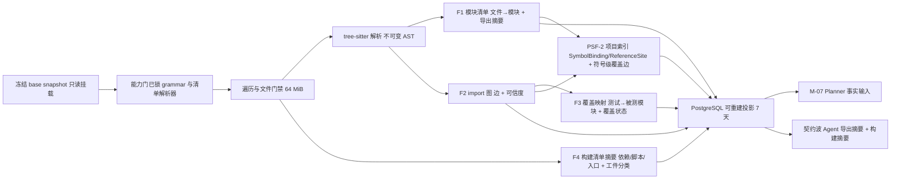

# CodeMigrator 代码分析与 AST 引擎：源端结构事实的唯一产地

> 文档状态：V4 当前架构基线。  
> 技术范围：冻结源快照上的 tree-sitter 只读解析、源构建清单解析与工件识别、PSF 三层结构（语法森林/项目索引/关系图）、PostgreSQL 可重建投影、进程内 `QuerySourceAst` 导航服务。  
> 契约真相：`ProjectModuleId`、`SourceToolchain`、`TreeSitterGrammarRef`、`ManifestParserRef`、`SliceKind`/`ArtifactKind`、phase 工具授权与"7 天可重建投影"留存规则由 [M-00：设计原则、系统地图与公共契约](CodeMigrator_垂类设计原则与架构哲学.md) 唯一定义；本篇拥有 PSF（Project Structure Foundation）三层模型的详细设计、四类分析事实（F1-F4）的语义、import 图可信度模型与 `QuerySourceAst` 行为定义。  
> 关联文档：[公共契约](CodeMigrator_垂类设计原则与架构哲学.md)、[目录架构](CodeMigrator_核心目录架构设计.md)、[Agent Loop](CodeMigrator_Agent_Loop设计.md)、[Migration Spec](CodeMigrator_Migration_Spec抽象层.md)、[迁移计划生成器](CodeMigrator_迁移计划生成器.md)、[工具系统](CodeMigrator_工具系统与Hook.md)、[记忆与上下文](CodeMigrator_记忆与上下文管理.md)。

分析引擎回答一个问题：冻结快照里的源项目由什么构成、谁依赖谁、哪些文件是测试、构建入口是什么。答案以 PSF（Project Structure Foundation）三层结构——语法森林、符号级项目索引、模块级关系图——落入 PostgreSQL。**本篇产出的定位是「机械完备层」**（fb8 对齐，M-00 信息分层原则）：以确定性代码路径保证候选集的枚举完备性（文件不漏、import 候选不全漏、位置身份精确），供理解会话（起草会话深潜阶段，产制点归一起草期）在其上做语义消解——模块边界与依赖关系的最终权威是用户确认后的理解档案，不是本篇的机械产物。V4 职能相对 V3 大幅收缩：目标代码生成完全交给 EXECUTE 阶段持类 IDE 工具箱的 Agent（P-01）；V3 中服务于同语言受控编辑的节点定位器类型、候选代码重定位链与快照事实中的补丁语义随 P-01 重写全部废除。分析因此变纯：输入是一个只读快照，输出是一组完备候选事实，全程零写入；机械层零模型裁量。

### AST/CST 选型边界（fb8 议题二回应）

- **tree-sitter CST：只采用其"读"的能力**——多语言统一接口（新语言=grammar+查询模板纯数据）、容错解析（面向任意质量的个人项目）、进程内轻量、位置身份精确。用于事实提取、锚点定位、守恒计数。
- **CST 不用于改写**：任何代码改写都是 EXECUTE Agent 对文本的直写（P-01）；对语法树做改写变换的路线属 V3 定位器/EmitPatch 体系，已废除且不得复活。
- **原生单语言语义 AST 引擎（tsc/rust-analyzer/pyright 类）不引入**：语言绑定税（每语言一套服务集成，违背描述符"语言差异=数据"哲学）、构建前提（要求项目可构建/依赖可解析，迁移源项目常不满足）、职责错位（安全重构是其强项但本系统改写者是 Agent 文本直写；目标侧语义正确性权威已是裁决层 TypeCheck 真实工具链）。若未来某语言需要更深静态语义，描述符演进面可留 `semantic_service` 可选档设想，本期不承诺。

## 完备性对抗审计：机械层的运行时质量闭环

金标准 fixture（V-M06-V4-019）验证**提取规则**的正确性；对抗审计验证**每一次运行**的产出质量。ANALYZE 机械层完成、CreateRun 签核前执行一轮（Anthropic 迁移 kit 同款流程实证——"地图与缺口清单的发现来自对抗评审，而非初稿"）：

1. **双怀疑派评审**并行、独立上下文、不相交抽样：各取样本文件——一半从模块清单随机抽取，一半对抗指派（最大/import 最重的文件归一方，生成文件/平台变体/text-fallback 文件归另一方，验证排除逻辑生效）。
2. 每个样本文件从源码出发列出其仓内依赖与符号事实，返回 **file:line 证据行——不是结论**。
3. **双向 diff** 机械层产物：漏判的边 + 多判/误判的条目；每条差异回源码行核实后才成立。
4. 确认的差异是**提取规则/查询模板的 bug**——修规则处理该模式（不是修被抓获的那几个文件），重新生成受影响产物后换新评审、新样本重抽。
5. 一轮干净 = 双向皆空；三轮失败或同类问题复发 → 升级用户决策：通常意味着该依赖不可静态发现，处置由人定夺（进入理解会话消解范围或调整策略），不是继续打补丁。
6. 审计记录（样本清单、差异行、规则修订、轮次结论）随计划证据归档。

本节是**运营流程而非新机制**——消费既有工具（QuerySourceAst 抽样核验）与既有验收结构，产出为审计记录而非新工件类型。它同时是「机械枚举 × 双向抽样审计 × 下游裁判链」导航兜底哲学的载体（议题二定案）：不追求导航完美——漏网之鱼由下游裁判链（编译/测试/集成检查）必然枚举，预算花在评审拓扑而非导航基础设施；与 Anthropic 迁移实践互证。

## 职能边界：只理解源项目

| 职能 | V4 归属 | 本篇角色 |
|---|---|---|
| 源项目结构化理解（PSF 三层模型：四类事实 + 符号级项目索引） | 本篇 | 唯一 owner |
| 目标代码生成 | EXECUTE Agent（M-04/M-12 工具箱） | 不参与，也不产出任何目标语义 |
| 面向候选代码的分析与定位 | 已废除（V3 机制随 P-01 移除） | 不存在此职能 |
| 源码导航查询 | 本篇定义行为，M-12 注册为 Agent 工具 | `QuerySourceAst` 唯一行为 owner |
| Slice（kind、write scope、依赖边）派生 | M-07 | 仅提供事实输入，不消费计划 |
| 语言/清单解析能力声明 | 源端工具链描述符（M-00/M-05） | 只消费，不内置语言分支 |

## ANALYZE 产出四类事实

四类事实保持 F1-F4 事实编号不变；PSF（Project Structure Foundation）三层模型是其上的组织命名体系（详见后文专节）：F1-F4 是 PSF 各层的派生输入与组成内容，PSF-2 项目索引为由 F1+F2 派生的新增一等结构。

| # | 事实 | 内容 | 粒度 | 直接消费者 |
|---|---|---|---|---|
| F1 | 模块清单 | 文件→`ProjectModuleId` 映射、模块角色（源/测试）、导出符号摘要（源语言语义）、解析质量标注 | 模块 | M-07（Slice 派生）；契约波 Agent（导出摘要） |
| F2 | import 图 | 模块间依赖边，含测试文件对被测模块的边；每边携带可信度与证据位置 | 边 | M-07（Requires 边派生） |
| F3 | 测试清单与覆盖映射 | 测试文件识别 + 测试→被测模块集合（覆盖图）+ 每模块守恒基线 | 测试文件 | M-07（测试翻译 Slice 派生）；M-10（失败归因、结构守恒基线） |
| F4 | 构建清单摘要与工件识别 | package.json 等源构建文件→直接依赖、脚本、入口摘要；快照工件文件→`ArtifactKind` 三类分类（生成代码含源头识别） | 清单文件 / 工件文件 | 契约波 Agent（目标构建文件参考）；M-07（工件 Slice 派生）；M-05（能力门工件声明消费） |

```rust
pub struct ModuleFact {
    pub module_id: ProjectModuleId,
    pub file_paths: Vec<RepoRelativePath>,
    pub role: ModuleRole,                 // Source | Test
    pub boundary: ModuleBoundary,         // Manifest | Directory | File
    pub exported_symbols: Vec<ExportSummary>,
    pub capability: AnalysisCapability,   // Full | TextFallback
    pub degraded_files: Vec<RepoRelativePath>, // 含 ERROR/MISSING 节点仍尽力提取的文件
}

pub struct ExportSummary {
    pub symbol: String,
    pub kind: SymbolKind,                 // Function | Class | Type | Interface | Constant
    pub signature_text: String,           // 源语言原文签名，截断至 4 KiB
}

pub struct ImportEdge {
    pub from_module: ProjectModuleId,
    pub to: ImportTarget,                 // Module(ProjectModuleId) | External(包名)
    pub confidence: EdgeConfidence,       // Static | Unknown
    pub reason: Option<UnknownReason>,    // DynamicImport | Reflection | UnresolvedPath
    pub evidence: SourceRange,            // import 语句的 file:range
}

pub struct CoverageEntry {
    pub test_file: RepoRelativePath,
    pub tested_modules: Vec<ProjectModuleId>,
    pub derivation: CoverageDerivation,   // ImportGraph | DirectoryConvention | Uncovered
}

pub struct ModuleCoverageStatus {
    pub module: ProjectModuleId,
    pub status: ModuleCoverage,           // Covered | EmptyTestSuite | Undetermined
}

pub struct TestConservationBaseline {
    pub module: ProjectModuleId,
    pub source_tests: u32,                // 测试函数数（源端 tree-sitter 确定性计数）
    pub source_assertions: u32,           // 断言语句数
    pub source_loc: u32,                  // 模块 LOC
}

pub struct ManifestSummary {
    pub manifest_path: RepoRelativePath,
    pub manifest_kind: String,
    pub dependencies: Vec<DependencyEntry>, // 名称 + 版本约束
    pub scripts: Vec<ScriptEntry>,          // 脚本名 + 命令摘要
    pub entry_points: Vec<String>,
}

pub struct ArtifactFact {
    pub path: RepoRelativePath,                // 工件文件（快照内规范路径）
    pub artifact_kind: ArtifactKind,           // GeneratedCode | DeclarativeConfig | ResourceFile（M-00 契约）
    pub source_path: Option<RepoRelativePath>, // 仅生成代码：源头文件（如 .proto），按描述符 source_pattern 识别
}
```

**F1 模块清单**：模块边界由目录结构与源构建清单（如 package.json 的入口与 workspace 声明）按描述符规则划定；每个源文件恰属一个模块，测试文件同样入清单但 `role=Test`。`exported_symbols` 是源语言语义的导出摘要——契约波 Agent 起草 `ContractArtifact.public_signatures` 的参考输入，不是目标契约本身；摘要只含符号名、种类与签名原文，不复制实现正文。

**F2 import 图**：静态字面量 import 经路径解析落到模块 id，解析到快照外包名的记为 `External`。动态 import（`import(表达式)`）、反射式加载与路径解析失败一律不猜测目标：边仍记录（`from` + 证据位置），但 `confidence=Unknown` 并携带原因。可信度语义与 Planner 消费策略见下节。

import 路径解析按固定顺序三分派，无任何启发式回退：

| 解析输入 | 规则 | 结果 |
|---|---|---|
| 相对/绝对路径字面量 | 按快照根解析，扩展名与目录索引补全 | `Module(模块 id)`，`Static` |
| 描述符声明别名（如 tsconfig paths） | 先查描述符别名映射，再按上行规则 | `Module(模块 id)`，`Static` |
| 包名 | 与 F4 依赖清单匹配 | `External(包名)`，不入模块间边 |
| 动态表达式、反射、两条规则未命中 | 不猜测目标 | `Unknown` + 原因 |

**F3 测试清单与覆盖映射**：测试文件识别只来自源端描述符声明的测试目录与命名约定（如 `tests/**`、`*.test.ts`、`*_test.py`），描述符未声明约定的语言测试清单为空且显式标注，不做猜测。覆盖映射优先由测试文件的 F2 静态边派生（`ImportGraph`）；无静态边时按目录约定降级（`DirectoryConvention`）；两者皆不可得标注 `Uncovered`。覆盖图同时产出模块级覆盖状态 `ModuleCoverageStatus`：覆盖分析可判定（`capability=Full` 且描述符已声明测试约定）但无任何测试关联的源模块显式标注 `EmptyTestSuite`——这是"已分析且确认无测试"的确定结论，与"未分析/不可判定"的 `Undetermined`（text-fallback 语言或测试约定未声明导致测试存在性无法判定，不猜测）严格区分；`EmptyTestSuite` 是 M-07 派生测试生成 Slice（`SliceKind::TestGeneration`，[M-00](CodeMigrator_垂类设计原则与架构哲学.md)：以源模块代码语义 + 契约签名为锚点生成目标语言测试）的触发事实。上述派生分级保持不变。覆盖图是测试翻译 Slice 的派生输入，也是 P-09 测试失败归因（测试文件 write scope + 被测模块依赖）的图基础。F3 同时产出每模块守恒基线 `TestConservationBaseline`（`source_tests`/`source_assertions`/`source_loc`），为跨语言翻译的结构守恒辅证提供源侧基线（D-033；行为主证/守恒辅证定位）：计数全部由源端 tree-sitter 确定性代码路径产出——测试函数按描述符测试命名约定识别，断言计数为确定性 AST 节点计数——不经模型；最终验证时由 M-10 与目标侧统计比对产出守恒事实，进入等价信心分级。

**F4 构建清单摘要**：由描述符锁定的清单解析器（M-00 `ManifestParserRef`）解析源构建文件，产出依赖名与版本约束、脚本命令摘要、入口声明。它供契约波 Agent 生成目标构建文件时参考（翻译依赖选择、映射脚本意图）；目标构建命令本身由目标端描述符模板承担，本篇不产出任何目标命令。F4 同时承担工件识别：按描述符 `artifact_rules` 声明的模式规则（[M-01](CodeMigrator_核心目录架构设计.md)）对快照文件分类，产出 `ArtifactFact` 工件分类事实——三类 `ArtifactKind`（M-00 契约）：生成代码（`.pb.go` 类，按 `source_pattern` 识别源头文件如 `.proto`，不翻译、由目标侧从源头重新生成）、声明式基础设施配置（docker-compose/Makefile/config.yaml）、资源文件（SQL schema/静态资源）。识别规则完全来自描述符声明，零内建语言分支；工件分类事实随 F4 投影输出，供 M-07 派生三类工件的对应处理（生成代码重新生成、声明式配置入契约波翻译、资源文件复制）与 M-05 能力门消费工件声明。

### 模块边界划定与降级

模块边界由源端描述符声明的 `module_boundary_strategy`（M-00 三档枚举）划定，语言差异=数据、核心零语言分支：**ManifestPerModule**（npm workspace 型）每清单一个模块，入口声明聚合同包文件；**SingleManifestDirectoryConvention**（go.mod 型单清单仓库）以唯一清单锚定项目根，模块按描述符目录约定划分（如 Go 以目录为模块粒度）——这是显式策略档位而非"降级"；**DirectoryConvention**（无清单）一目录一模块；目录结构仍不可判定时降级为文件级清单，M-07 以文件级 Slice 承接。降级不伪造模块边界：`ModuleFact.boundary` 始终记录划分来源（策略档位/目录/文件），Planner 与报告据此说明划分依据。

### import 边可信度与 Planner 保守策略

| 可信度 | 判定 | Planner（M-07）消费策略 |
|---|---|---|
| `Static` | 字面量 import 且路径解析唯一命中 | 派生 Requires 边：实现 Slice requires 其依赖模块的契约 Slice；测试翻译/测试生成 Slice requires 其覆盖模块归属的契约 Slice（V-M07-V4-007，测试执行保序由 M-10 在场门控承担，不加测试→实现边） |
| `Unknown` | 动态 import、反射、路径解析失败 | 不派生 Requires（目标不可确定）；对边两端可能涉及的 Slice 组追加 `OrderedBefore` 边保守串行，禁止并行赌运气；边清单进入计划证据 |

`Unknown` 不削弱 Run：它把"静态不可知"变成显式事实，Planner 以顺序换确定性，语义等价裁决仍由翻译后测试承担。`Uncovered` 测试文件同理保守化：其测试翻译/测试生成 Slice 对全部契约 Slice 声明依赖（V-M07-V4-007），避免在信息缺失时并行错序。

## 分析流水线



| 阶段 | 输入 | 输出 | 失败语义 |
|---|---|---|---|
| 门禁断言 | Spec 锁定的 grammar/清单解析器摘要 | 就绪 | 摘要不匹配在 CreateRun 前已拒（M-00 能力门），此处仅断言 |
| 遍历与文件门禁 | 快照文件清单 | 待解析文件集 | 单文件 `>64 MiB` 跳过解析，标注 `FILE_SKIPPED_TOO_LARGE`，不阻断 Run |
| 解析 | 文件字节 + 锁定 grammar | 进程内不可变语法树 | 含 ERROR/MISSING 节点仍容错提取，文件记入 `degraded_files` |
| 事实提取 | 语法树 + 描述符内建查询模板 | F1/F2/F4 | 确定性代码路径，不经模型 |
| 图构建 | F1 + F2 | F3 覆盖映射 + 模块覆盖状态 | — |
| 索引派生 | F1 + F2 + 描述符内建查询模板 | PSF-2 项目索引（SymbolBinding/ReferenceSite + 符号级覆盖边） | 确定性代码路径，零模型裁量 |
| 投影写入 | 四类事实 + PSF-2 索引 | PostgreSQL | 失败重试 1 次，仍失败整体失败，不保存部分事实 |

四类事实与 PSF-2 索引全部由确定性 Rust 代码路径产出（机械完备层，M-00 信息分层原则）。理解会话（起草会话深潜阶段，M-04/M-16；产制点归一起草期）持 `ReadFile`/`QuerySourceAst`/`Exec` 只读编排在其上做语义消解并产出《项目理解档案》——档案经用户确认后冻结为 Run 输入，ANALYZE 阶段只消费该已冻结档案做机械层一致性校验，不再承担语义消解产出，且不回写本篇机械事实库；两层数据边界保持。快照读取不可用、门禁断言失败或投影最终写入失败时 Run 以 `AnalysisFailed` 进入 `FAILED`（M-00）；单文件级损伤永不放大为整仓失败，这是 P-10 在分析侧的体现。

## PSF（Project Structure Foundation）三层模型

四类事实（F1-F4）保持事实编号不变；PSF 是其上的组织命名体系——把四类事实及其解析产物组织为三层递进结构，替代此前"四类事实散装投影"的扁平表述。M-00 已将 PSF 定位为源侧结构事实的三层公共契约，详细设计 owner 为本篇。三层全部由确定性代码路径派生，零模型裁量（P-02 不破坏）。

| 层 | 内容 | 与既有机制的关系 |
|---|---|---|
| PSF-1 语法森林 | 逐文件不可变 AST | 现状保持：grammar 描述符锁定、进程内 LRU |
| PSF-2 项目索引 | SymbolBinding/ReferenceSite 符号级双向索引 + 符号级覆盖边 | 新增一等结构：由 F1+F2 确定性派生 |
| PSF-3 关系图 | 模块级复合图（import 边/覆盖边/包含边） | 现有 F2/F3 的整合命名 |

### PSF-1 语法森林：逐文件不可变 AST

现状保持：grammar 唯一来源是描述符锁定的 `TreeSitterGrammarRef`，解析产物为逐文件不可变 AST，进程内 LRU 缓存（键 = snapshot OID + 文件路径 + grammar 摘要），不落盘、不序列化。子树节点在此层获得位置身份（`file:range`）——PSF-2 的符号绑定与引用点、`QuerySourceAst` 的子树文本提取均以该位置身份为基础。

### PSF-2 项目索引：符号级双向索引（新增一等结构）

PSF-2 是新增的一等投影结构，由 F1 模块清单 + F2 import 图确定性派生：符号定义与引用点经语法森林（PSF-1）的 tree-sitter 查询模板提取，引用归属经 import 边解析落到定义符号——纯代码路径，零模型裁量。

| 索引表 | 每条目 | 说明 |
|---|---|---|
| SymbolBinding（符号绑定） | 定义点 `file:range` + 符号类别（`SymbolKind`：函数/类型/常量等）+ 签名摘要 | 每个定义符号一条目 |
| ReferenceSite（引用点） | 引用点 `file:range`，经 import 边解析归属到定义符号 | 每处引用一条目 |

两表构成双向索引：定义→引用与引用→定义两个方向均可直接查表，无需运行时图解析。text-fallback 语言无语法树支撑，不产出 PSF-2 条目（符号级操作返回 `TEXT_FALLBACK_UNSUPPORTED`，见 QuerySourceAst 一节）。

**引用归属消解语义**（确定性规则的显式化，防误归属静默传播）：
- **唯一绑定**：引用点经 import 边可达恰一个同签名定义符号 → 归属该符号。
- **同名多绑定**：import 边下游存在多个同名候选定义（跨模块同名导出、重导出链）→ 该 ReferenceSite 标记 `ambiguous=true`，**不猜测归属**；其覆盖边/影响面/归因参与自动降级到模块级粒度，并在下游消费处显式携带降级标注（M-07 涟漪按模块级闭包计算并标注、M-10 归因走文件级降级路径、测试生成锚点退回模块级导出摘要）。`SymbolBinding` 增可选布尔字段 `ambiguous`（多绑定的定义点集合标记），不引入概率置信度——保持确定性口径。
- **别名导入**：`import X as Y` 经 import 边绑定到被引模块的定义符号，别名仅是本地命名，不影响归属。
- **通配导入与成员表达式**：`from m import *`、`obj.method()` 等不可静态判定的引用不产出 ReferenceSite 符号级条目——按既有 Unknown 边保守化框架处理，宁可缺失不可误挂。

确定性不等于完备性：上述规则保证"同一快照两次派生逐字节相等"（自洽性），漏检与歧义由 `ambiguous`/Unknown 显式标注暴露而非静默吞没；正确性由金标准验收条款锚定（见 V-M06-V4-019：click-video 冻结快照的期望模块集/import 边集/覆盖图 fixture 逐项一致）。

覆盖边在此层升级为符号级：F3 的模块级覆盖图细化出"测试用例→被测符号"的符号级覆盖边——测试文件中的引用点归属到哪个被测模块的导出符号，即覆盖该符号；无法符号级解析的关联（text-fallback 语言、`Unknown` import 边下游、引用归属不可判定）降级保持模块级语义，升级不丢失任何模块级事实，模块级覆盖图始终完整。**白盒测试**（直调非公开函数）不破坏该映射：非公开符号的定义点照常入 SymbolBinding，测试对它的引用照常建立符号级覆盖边——"测试只测公开接口"是契约签名锚点的设计假设而非覆盖映射的前提；仅当引用归属 `ambiguous` 或不可判定时按既有规则降级模块级并在证据页标注。

PSF-2 的 PostgreSQL 投影表结构（列布局、索引与物理 DDL）为实施期细化项：本篇锁定表语义、双向可查性与确定性派生等价要求，不锁定物理 schema。

### PSF-3 关系图：模块级复合图

PSF-3 是现有 F2 import 图与 F3 覆盖图的整合命名：模块级复合图，边类型为 import 边（F2）、覆盖边（F3）、包含边（F1 的文件→模块归属）。消费方：Planner（M-07，Requires 边派生与集成序冻结）、漂移计算（依赖闭包）。PSF-2 是 PSF-3 的细化层而非替代——模块级服务（Slice 规划、依赖闭包、集成序）走 PSF-3，符号级服务（归因、影响面、生成锚点）走 PSF-2。

### 设计约束与收益

| 约束 | 内容 |
|---|---|
| 确定性派生 | 三层全部由确定性代码路径产出，零模型裁量（P-02 不破坏） |
| 投影语义不变 | PSF-2 与四类事实同入 PostgreSQL 可重建投影：7 天留存；同 snapshot OID + 同描述符摘要重建后 canonical 化逐字节等价 |
| 接口不变 | `QuerySourceAst` 四操作接口不变；符号级操作从"运行时按需计算（经 import 图解析）"改为"查 PSF-2 索引"——更快且结果一致 |
| 分层不替代 | PSF-2 是 PSF-3 的细化层：符号级服务（归因/影响面/生成锚点）走 PSF-2，模块级服务（规划/漂移闭包）走 PSF-3 |

收益：P-09 测试失败归因升级符号级（测试用例→被测符号，减少 Run 级兜底）；契约漂移的下游受影响集合精确到"引用该契约符号的模块"；测试生成 Slice（`SliceKind::TestGeneration`）的锚点获得符号级事实（源模块导出符号 + 签名摘要）。成本：tree-sitter 查询模板的符号定义/引用提取扩展，纯工程量，无新机制类别。

## 快照与只读语义

| 约束 | 规则 |
|---|---|
| 分析对象 | 唯一：Run 创建时冻结的 base snapshot（`ProjectSnapshotId` + commit OID）。不读宿主工作树，不读任何候选工作区 |
| 写入 | 源项目快照只读挂载，分析全程写句柄数为 0；全部输出进 PostgreSQL 投影 |
| 留存 | 投影属 M-00"可重建投影"类：7 天保留，超期清理后可按冻结 commit + 描述符摘要重建 |
| 重建确定性 | 同 snapshot OID + 同 grammar/解析器摘要 → canonical 化后逐字节等价的事实；重建不依赖任何运行期状态 |
| 与候选隔离 | 候选工作区、integration scratch、verified 均不是分析输入；分析事实在 Run 生命周期内不因执行进展改变 |

## 投影、留存与观测

| 事实 | 保存位置 | 留存 | 恢复方式 |
|---|---|---|---|
| PSF 投影：F1~F4 四类事实 + PSF-2 项目索引 | PostgreSQL 可重建投影 | 7 天 | 按冻结 commit + 描述符摘要整批重建 |
| 源快照内容 | Git 对象（M-11 边界） | 仓库策略 | 重建的输入，本篇不复制正文 |
| 解析树缓存 | app 进程内 LRU | 进程生命周期 | 重新解析，无正确性影响 |
| 分析指标 | M-13 指标面 | M-13 规则 | — |

投影写入失败重试 1 次后仍失败即整体失败，不保存部分事实；重建期间消费方等待重建完成，不读半成品。分析指标族收缩定案：仅保留两个低基数指标——`Unknown` 边率与 `degraded_files` 计数；其余观测（解析吞吐/耗时分布、text-fallback 占比、`QuerySourceAst` 调用频次/超时率/截断率）由 `run_events` 即席查询承载，不设独立指标。标签只使用低基数语言 id 与能力档位。

## tree-sitter 使用边界与 text-fallback

tree-sitter 在本篇中只有一种用法：解析为不可变 AST 后执行只读查询。不存在节点改写、pretty-printer、AST 序列化落盘或任何代码生成接口；grammar 唯一来源是源端描述符锁定的 `TreeSitterGrammarRef`（grammar id + SHA-256），能力门在 Run 创建前预检，分析中途不换 grammar。

| 场景 | 行为 | 能力标注 |
|---|---|---|
| 描述符锁定 grammar 存在 | 完整四类事实 + PSF-2 项目索引 + 符号级 `QuerySourceAst`（查索引） | `capability=Full` |
| 描述符声明 text-fallback（无 grammar 语言） | 仅正则级 import 提取（描述符内建提取模板）+ 路径级模块清单 + 构建清单摘要；无导出符号摘要，无 PSF-2 条目，覆盖映射退化为 `DirectoryConvention` | `capability=TextFallback`，事实与报告显式标注 |

text-fallback 的正则 import 边仍可为 `Static`（字面量匹配），但符号级操作不可用（见下节错误码）。降级是声明式事实而非静默行为：Planner 与契约波 Agent 依据 `TextFallback` 标注收窄对事实的依赖，报告证据页呈现各语言能力档位。

## QuerySourceAst：面向 Agent 的只读导航服务

`QuerySourceAst` 是 app 进程内的只读导航服务，经 M-12 注册为 Agent 工具，phase 授权为 ANALYZE/PLAN/EXECUTE（M-00 表）。它面向"Agent 在翻译时需要看源代码结构"的场景，输入是源快照路径 + 结构化查询，输出是结构化命中（`file:range` + 文本），不接受自由查询正文，不暴露任何写语义。符号级操作（符号查找/定义跳转/引用查找）查询 PSF-2 项目索引：索引由 F1+F2 确定性派生并入投影，查询不再运行时按需计算——更快且结果一致（同 snapshot OID 逐字节等价，P-02 不破坏）；子树文本提取仍按需解析语法森林（PSF-1，进程内 LRU）。

| 操作 | 输入 | 输出 | 语义 |
|---|---|---|---|
| 符号查找 | 符号名（可选模块过滤） | 定义处命中列表 | 查 PSF-2 SymbolBinding 表，全快照符号级 |
| 定义跳转 | 使用处 `file:range` | 定义处 `file:range` + 签名文本 | 查 PSF-2 索引（引用点→符号绑定），跨文件定义直接命中 |
| 引用查找 | 符号名 | 引用处命中列表 | 查 PSF-2 索引（符号绑定→引用点），含测试文件中的引用 |
| 子树文本提取 | `file:range` | 规范化源码文本 | 按需解析语法森林（PSF-1），受输出上限约束 |

```rust
pub enum SourceAstQuery {
    FindSymbol { symbol: String, module: Option<ProjectModuleId> },
    GotoDefinition { use_site: SourceRange },
    FindReferences { symbol: String },
    ExtractSubtree { range: SourceRange },
}

pub struct SourceRange {
    pub file_path: RepoRelativePath,
    pub start: SourcePos,
    pub end: SourcePos,
}

pub struct QueryResult {
    pub hits: Vec<QueryHit>,   // 上限 200 条，超出置 truncated
    pub truncated: bool,
}

pub struct QueryHit {
    pub range: SourceRange,    // file:range
    pub symbol_kind: Option<SymbolKind>,
    pub text: Option<String>,  // 子树文本或签名，单次合计上限 256 KiB
}
```

查询枚举即 closed-schema 全集：工具调用只接受上述四个变体与既定参数，未知字段、自由查询正文或任何修改语义在反序列化时拒绝。

| 边界 | 规则 | 越界结果 |
|---|---|---|
| 只读 | 操作集合为 closed-schema（`deny_unknown_fields`），不存在任何修改类字段 | schema 拒绝 |
| 路径 | 仅接受源快照内规范路径 | `PATH_OUTSIDE_SNAPSHOT` |
| 超时 | 单次调用 60 秒（M-00 模型工具档） | `QUERY_TIMEOUT`，不返回部分结果 |
| 输出上限 | 命中上限 200 条、单次文本上限 256 KiB | 截断标记 + `TRUNCATED`，可收窄查询续查 |
| text-fallback 语言 | 无语法树支撑符号级操作 | `TEXT_FALLBACK_UNSUPPORTED` |
| 缓存 | 进程内解析树 LRU，键 = snapshot OID + 文件路径 + grammar 摘要；只读、崩溃丢失无正确性影响 | — |

服务与快照事实库的关系：`QuerySourceAst` 的符号级操作查询 PSF-2 项目索引——索引与四类事实同源，均由分析流水线确定性产出并入 PostgreSQL 投影，工具调用不回写任何投影；子树文本提取按需解析语法森林（进程内 LRU），是导航便利而非事实来源。索引查询消除了符号级操作的重复图解析开销，且结果与既有按需计算路径一致。

## 贯穿场景：TS 项目快照的一次完整分析

### 场景 A：PSF 投影的完整产出

快照含 `package.json`、`src/models/user.ts`、`src/api/client.ts`、`src/index.ts`、`tests/user.test.ts`、`tests/api.test.ts`，描述符声明 npm 清单解析与 `*.test.ts` 测试约定。

1. F1：`models`/`api`/`index` 三个源模块与 `user.test`/`api.test` 两个测试模块入清单；`models` 的导出摘要含 `User`（interface）、`toUser`（function）及源签名原文。
2. F2：`index→models`、`index→api`、`api→models` 均为 `Static`（字面量 import 解析命中）；`user.test→models`、`api.test→api` 两条测试边入图。
3. F3：覆盖映射由测试边派生——`user.test.ts→{models}`、`api.test.ts→{api}`，`derivation=ImportGraph`；三个源模块均有测试关联，`ModuleCoverageStatus` 均为 `Covered`（若某源模块无任何测试关联，则标注 `EmptyTestSuite`，M-07 据此为其派生测试生成 Slice）。
4. F4：package.json 摘要产出依赖（typescript、zod 及版本约束）、脚本（build/test 命令摘要）与入口声明；快照内无文件命中描述符 `artifact_rules` 模式，工件分类事实为空集。
5. PSF-2：项目索引由 F1+F2 派生——`models` 的 `User`/`toUser` 等符号绑定与全快照引用点入双向索引；测试文件中的引用点经 import 边解析归属后产出符号级覆盖边（如 `user.test.ts` 的测试用例→`models.toUser`）。
6. 四类事实与 PSF-2 索引入 PostgreSQL 投影；M-07 据此冻结契约 Slice C、实现 Slice A（models）、B（api）与测试翻译 Slice T1、T2 的 kind、write scope、Requires 边与集成序；契约波 Agent 的上下文含 `models`/`api` 导出摘要与构建摘要。

### 场景 B：动态 import 标注 Unknown 后的保守规划

`client.ts` 中存在 `await import(pluginPath)`，`pluginPath` 为运行时拼接。分析不解析其目标：F2 记录 `from=api, confidence=Unknown, reason=DynamicImport` 及证据 `client.ts` 行列。Planner 不为该边派生 Requires（目标模块不可确定），改为在 A 与 B 的 Slice 之间追加 `OrderedBefore` 边——两者仍各自对齐契约，但集成串行而非并行；`Unknown` 边进入计划证据与报告。最终验证仍由翻译后测试裁决语义，`OrderedBefore` 只消除并行错序这一类不确定性来源。

## 修订输入与重分析

分析事实的生命周期与冻结快照绑定：Run 内快照不变则事实不变，EXECUTE 进展、会话消息与候选迭代都不触发重分析。仅两类输入变化触发重跑：M-16 的 PlanRevision 改变了描述符锁、测试约定等分析输入，或用户修正更换源基线。重跑以新输入对冻结 commit 完整重建四类事实与 PSF-2 索引并整体替换投影，新旧投影按修订标识并存供对比；不存在对单类事实的增量修补，"一个快照 + 一份输入 = 一组事实"的可重建等式不被破坏。

## 与其他模块的边界

| 交付物 | 接收方 | 用途 |
|---|---|---|
| import 图 + 覆盖图 + 模块清单（PSF-3 关系图） | M-07 | 各 Slice、Requires/OrderedBefore 边与 write scope 派生的唯一事实输入 |
| PSF-2 项目索引（符号绑定/引用点/符号级覆盖边） | M-07 / M-10 / 契约波 Agent | 测试生成 Slice 的符号级锚点；P-09 符号级失败归因；契约漂移影响面计算（引用该契约符号的模块集合） |
| `QuerySourceAst` 服务行为定义 | M-04 / M-12 | Agent 工具注册与调用协议；本篇不定义 frame 与 hook |
| 模块导出摘要 + 构建清单摘要 | 契约波 Agent（M-07 派生契约 Slice 的上下文，M-14 组包） | 目标接口契约起草与目标构建文件生成的参考输入 |
| 工件分类事实（F4 投影字段） | M-07 / M-05 | 三类工件的 Slice 派生（生成代码重新生成、声明式配置入契约波、资源文件复制）与能力门工件声明消费 |
| 覆盖图（含 `EmptyTestSuite` 标注） | M-10 / M-07 | 最终验证测试失败归因（P-09）的图基础；`EmptyTestSuite` 触发测试生成 Slice（`SliceKind::TestGeneration`）派生 |
| 守恒基线（F3 投影字段） | M-10 | 结构守恒计算：最终验证时与目标侧统计比对，产出守恒事实进等价信心分级（D-033） |
| 分析指标（解析耗时、Unknown 率、降级率） | M-13 | 运行观测 |

[M-05](CodeMigrator_Migration_Spec抽象层.md) 锁定描述符与语言对；[M-09](CodeMigrator_沙箱与执行环境.md) 不参与分析（分析在 app 进程内完成，无沙箱副作用）；[M-14](CodeMigrator_记忆与上下文管理.md) 消费事实摘要组包上下文，不得自行重新解析源码生成结构事实。

## 可验收的结果

- [ ] V-M06-V4-001：分析全程对源项目快照的写句柄数为 0；四类事实与 PSF-2 索引全部位于 PostgreSQL 投影，快照目录零变更。
- [ ] V-M06-V4-002：删除投影后按冻结 commit OID + 描述符摘要重建，canonical 化事实（含 PSF-2 索引）与原投影逐字节相等；重建不依赖运行期状态。
- [ ] V-M06-V4-003：动态 import、反射与路径解析失败的边全部携带 `confidence=Unknown` 与原因；任何 `Unknown` 边不出现在 Requires 派生中，Planner 对其生成 `OrderedBefore`。
- [ ] V-M06-V4-004：每个被识别的测试文件均有覆盖映射条目（含 `Uncovered` 标注），覆盖图无遗漏；测试识别仅来自描述符约定，未声明约定的语言测试清单为空且显式标注；守恒基线字段随 F3 投影一并产出。
- [ ] V-M06-V4-005：`QuerySourceAst` 操作集合为 closed-schema，含写语义字段或自由查询正文的请求被 schema 拒绝；调用对源快照与投影写入数为 0。
- [ ] V-M06-V4-006：单次 `QuerySourceAst` 调用超过 60 秒返回 `QUERY_TIMEOUT` 且无部分结果；命中超过 200 条或文本超过 256 KiB 返回截断标记，收窄查询可续查。
- [ ] V-M06-V4-007：快照外路径的查询返回 `PATH_OUTSIDE_SNAPSHOT`；候选工作区与 verified 路径不接受分析或查询输入。
- [ ] V-M06-V4-008：text-fallback 语言完成正则级 import 提取与路径级模块清单，事实与报告携带 `TextFallback` 降级标注；符号级操作返回 `TEXT_FALLBACK_UNSUPPORTED`。
- [ ] V-M06-V4-009：含 ERROR/MISSING 节点的文件仍产出事实并记入 `degraded_files`；单文件超过 64 MiB 标注 `FILE_SKIPPED_TOO_LARGE` 跳过，二者均不阻断 Run。
- [ ] V-M06-V4-010：四类事实与 PSF-2 索引由确定性代码产出：同 snapshot + 同 grammar 摘要执行两次分析，投影 canonical 化后逐字节相等，与模型调用无关。
- [ ] V-M06-V4-011：扫描本篇实现不存在 AST 节点改写、pretty-printer、AST 落盘序列化或面向候选代码的分析路径；V3 定位器相关类型零残留。
- [ ] V-M06-V4-012：投影在 7 天留存期满后清理，清理后 Run 的计划与报告仍可凭冻结 commit 重建分析证据。
- [ ] V-M06-V4-013：PSF-2 项目索引由 F1+F2 经 tree-sitter 查询模板确定性派生，零模型裁量；同 snapshot OID + 同描述符摘要重建的 SymbolBinding/ReferenceSite 表 canonical 化后与原投影逐字节相等；定义→引用与引用→定义双向查询结果一致。
- [ ] V-M06-V4-014：`QuerySourceAst` 符号级操作（符号查找/定义跳转/引用查找）经 PSF-2 索引执行，命中结果与既有按需计算路径（经 import 图解析）一致；四操作接口与 closed-schema 不因索引化改变。
- [ ] V-M06-V4-015：覆盖边符号级升级：可符号级解析的测试关联产出"测试用例→被测符号"符号级覆盖边；无法符号级解析的关联降级保持模块级语义，模块级覆盖图零丢失。
- [ ] V-M06-V4-016：覆盖分析可判定（`capability=Full` 且测试约定已声明）但无任何测试关联的源模块显式标注 `EmptyTestSuite`；不可判定情形（text-fallback、测试约定未声明）标注 `Undetermined` 而非 `EmptyTestSuite`，两种状态可区分；`EmptyTestSuite` 模块进入 M-07 测试生成 Slice（`SliceKind::TestGeneration`）派生输入。
- [ ] V-M06-V4-017：工件识别仅按描述符 `artifact_rules` 声明的模式执行，零内建语言分支：生成代码（含 `source_pattern` 源头识别）、声明式基础设施配置、资源文件三类 `ArtifactKind` 分类正确，工件分类事实随 F4 投影产出。
- [ ] V-M06-V4-018：引用归属消解语义——同名多绑定的 ReferenceSite 全部标记 `ambiguous=true` 且不猜测归属，其下游消费（M-07 涟漪/M-10 归因/测试生成锚点）收到模块级降级与显式降级标注；通配导入与成员表达式不产出符号级条目；`ambiguous` 标记随投影持久化且重建逐字节一致。
- [ ] V-M06-V4-019：金标准双层验收（click-video 冻结快照，fixture 存放 `test_fixtures/clickvideo-analysis/` 并纳入描述符摘要变更回归范围）——①机械完备层：相对人工审定 import 边集的候选集召回率为 100%（枚举不漏是机械层的存在理由），Static 判定误报数为 0（误报交由档案消解而非静默错误）；②语义层改为档案条目抽查：从已确认理解档案抽取样本条目，核验其 file:range 锚点可解析性与判定合理性，抽查记录随计划证据归档——不再做全档案召回率对比（原阈值定标项随之取消；产制点归一起草期后语义质量主责在用户确认门）。本条款是正确性断言，与既有自洽性条款（重建逐字节相等）互补，二者缺一不可。

---

> 设计演进、历史缺陷处置和变更理由见：[文档迭代记录](文档迭代记录.md)。
