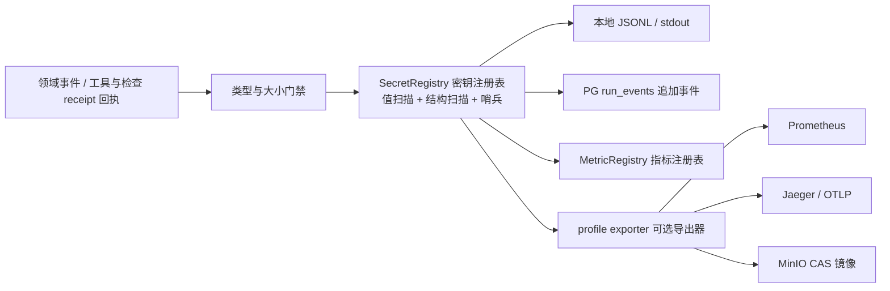

# CodeMigrator 运行证据、脱敏出口与稳定性信号

> 文档状态：V4 当前架构基线；本篇拥有观测事件、核心指标 descriptor、SecretRegistry 和可选 exporter。  
> 技术范围：观测事件输入源（`run_events` 同事务投影：`tool.call.pre/post`、`checkpoint.pre`、`TEST_FAILURE_ATTRIBUTED`、`FLAKY_TEST_OBSERVED`、拓扑层/测试翻译边界事件、Shell 命令与 Exec 脚本审计事件、契约漂移修正观测事件）、核心八指标 descriptor 的跨语言翻译适配、脱敏出口与可选 exporter；默认仅 `app + sandbox-worker + PostgreSQL`，Prometheus、Grafana、Jaeger 与 MinIO 镜像均为显式 Compose profile。  
> 契约真相：Run 状态、SliceKind、CheckStatus、预算终态与保留策略由 [M-00 公共契约](CodeMigrator_垂类设计原则与架构哲学.md) 拥有；观测事件由 [M-12 工具系统与 Hook](CodeMigrator_工具系统与Hook.md)、[M-10 验证引擎](CodeMigrator_验证引擎.md) 等运行模块产生；本篇定义它们如何被脱敏记录和稳定观测。  
> 关联文档：[Harness 总体设计](CodeMigrator_Harness总体设计.md)、[候选工作区与工具网关](CodeMigrator_候选工作区与工具网关.md)、[沙箱与执行环境](CodeMigrator_沙箱与执行环境.md)、[验证引擎](CodeMigrator_验证引擎.md)、[工具系统与 Hook](CodeMigrator_工具系统与Hook.md)、[Web 体验与迁移可视化工作台](CodeMigrator_Web体验与可视化工作台.md)。

观测的第一目标不是采集尽可能多的数据，而是让一次跨语言翻译 Run 的关键事实可重建，同时保证源码正文、Agent 文件操作内容、prompt 和凭据不成为日志泄漏面。默认部署不依赖任何外部观测服务：JSON tracing 和八个核心指标在进程内工作，所有 exporter 都是可丢弃的已脱敏投影，不能阻塞领域事务或改变迁移终态。

## 运行证据从一个事件进入多个安全出口

每个 Run 创建 root span；ANALYZE、PLAN、EXECUTE、VERIFY、REPORT 各创建直接子 span，EXECUTE 内部的拓扑层（契约层/实现层）会话、Slice 定向重生成与 Shell/Exec 沙箱执行再挂在对应 Phase 下。span 名固定为 `migration.run/phase/slice`，不得把 ID、路径或错误文本拼入 name。事件 ID、Run ID 与 Slice ID 使用 UUIDv7；trace/span ID 遵循 W3C Trace Context；所有时间使用 UTC RFC 3339。

| 证据层 | 持久内容 | 失败时的行为 | 是否影响 Run |
|---|---|---|---:|
| JSON tracing | 已脱敏 JSONL、trace 关系、固定错误码 | 本地不可写时退到 stdout；两者失败增加 dropped 计数 | 否 |
| `run_events` | 追加序号、摘要、Artifact locator、fields hash | 事务失败则状态与事件一并不提交；`NOTIFY` 丢失只影响唤醒 | 是 |
| 核心指标 | 八个固定 descriptor 与 60 秒 JSON 快照 | exporter 失败只丢投影 | 否 |
| 模块诊断指标 | 经 registry 接纳的低基数 series | 拒绝非法或超限 series | 否 |
| profile exporter | 已脱敏副本 | 队列满时丢弃最旧投影 | 否 |

事件序列化上限是 64 KiB；超出时正文转 ArtifactRef，仅保留固定字段、payload SHA-256 和引用。JSONL segment 在 64 MiB 封闭并写 SHA-256，新 segment 从 offset 0 开始。`run_events` 的唯一分页顺序为 `(run_id, sequence)`，单页最多 200，单次导出最多 10 MiB；状态投影与事件在同一 PostgreSQL 事务写入。SSE 以 `Last-Event-ID` 读取该序列，`LISTEN/NOTIFY` 仅唤醒已等待的连接；通知缺失从不意味着事件缺失。索引不保存源码、prompt、文件操作正文或 secret 正文。

## `SEC-LOG-01`：所有出口共享同一个脱敏边界

`SecretRegistry` 是 write-only 注册表，不能枚举或读回 secret。它对 raw、JSON-escaped、base64 与 percent-encoded 的值执行扫描，并对 `content/old_text/new_text/prompt/messages/api_key/authorization/cookie/password/private_key/database_url` 等字段类执行结构过滤。错误链只保留稳定 error code、模块、阶段与 cause class。

| 阶段 | 输入 | 通过结果 | fail-closed 结果 |
|---|---|---|---|
| Validate | 类型化事件、UUID、UTC 时间、大小 | admitted event | 常量拒绝 receipt |
| Redact | 注册 secret、禁止字段类、内存哨兵 | redacted object | payload 丢弃，所有 sink 接收数为 0 |
| Serialize | 已过滤对象 | UTF-8 JSON tracing record | 未过滤对象不得进入 serializer |
| Project | record、descriptor 或 exporter health | 本地、索引、指标或投影 | 增加既有 dropped 计数，不回滚领域调用 |

启动前，stdout、本地 JSONL、PostgreSQL `run_events`、SSE、Problem Details、tool output、sandbox stdout/stderr、report、delivery、metric exemplar、CLI 的 TTY/append-only/JSON/JSONL renderer 以及每个已启用 profile 都运行四种编码的哨兵套件。任一明文命中使 server 不进入 ready。运行期每 10,000 个事件插入一个内存哨兵，并在每个启用出口前复验；任何 exporter 或 CLI verbosity 都不得绕过 SecretRegistry 自行序列化或扩大可见正文。

## 八个核心指标是稳定接口

核心指标名、label key/value allowlist、直方图 bucket 边界和 logical labelset ceiling 组成编译期 descriptor 集合，恰有八项。它们不随 profile、语言对描述符、Run 数量或模块诊断指标变化。V3 的补丁应用、意图归约与重放一致类指标随受控编辑链与插件事件源一并废除，本基线不存在对应 descriptor。74 是八个核心 descriptor 合计的最大 logical labelset 数，不是 Prometheus exporter 的 series 上限。

| 指标 | 类型 | 标签与上限 |
|---|---|---|
| `codemigrator_run_total` | Counter | `terminal_status`：4 |
| `codemigrator_run_duration_seconds` | Histogram | `terminal_status`：4；bucket edges：`0.1, 1, 5, 15, 30, 60, 120, 300, 600, 1800` |
| `codemigrator_phase_duration_seconds` | Histogram | `phase,result`：5 × 3 = 15；bucket edges：`0.1, 1, 5, 15, 30, 60, 120, 300, 600` |
| `codemigrator_slice_first_pass_total` | Counter | `kind,result`：4 × 2 = 8（`kind` = Contract/Implementation/TestTranslation/TestGeneration） |
| `codemigrator_check_total` | Counter | `action,result`：5 × 5 = 25（`action` = M-00 `CheckAction` 含 Scaffold；`result` = `CheckStatus`） |
| `codemigrator_sandbox_termination_total` | Counter | `reason`：6 |
| `codemigrator_budget_ratio` | Gauge | `kind`：3 |
| `codemigrator_observation_dropped_total` | Counter | `sink`：9 |

核心指标只从 PostgreSQL `run_events` 同事务投影的领域事实与进程内确定投影派生，不引入第二事件通道：`codemigrator_slice_first_pass_total` 来自 Slice 集成终态事实——generation `0` 一次集成记 `first_pass`，经 P-09 归因定向重生成后集成记 `after_regeneration`，按 SliceKind 观察翻译首过率；`codemigrator_check_total` 来自三层验证与 Scaffold 初始化的 check 执行回执。`tool.call.pre/post`、`checkpoint.pre`、`TEST_FAILURE_ATTRIBUTED`、`FLAKY_TEST_OBSERVED`、拓扑层/测试翻译边界事件、Shell/Exec 审计事件与契约漂移观测事件属于模块诊断指标与 SSE 投影的输入源，不进入核心 descriptor。

指标命名规范（一句话）：全部指标使用静态 `codemigrator_*` 命名，`run_id/slice_id/path/error_message/URL/OID` 绝不进入 label 或动态指标名。实现注记（原 MetricRegistry exact-match 准入机关降格）：如实现保留注册期一致性校验，属实现细节而非独立机制；违规指标拒绝注册并只递增既有 dropped 计数，不新增 fallback 核心指标。新增指标的 review 清单一句话：声明静态 name、有限 label key/value allowlist 与 ceiling，并核对不与核心八项重名。

Prometheus exporter 的最大 series 数按 descriptor 计算：Counter 与 Gauge 各产生一个 series；Histogram 的每个 logical labelset 产生 `bucket_count + 3` 个 series，即每个有限 `le` bucket、一个 `+Inf` bucket、`_sum` 和 `_count`。按上表固定 bucket edges，本集合的 exporter 上限为 `4 + 4×13 + 15×12 + 8 + 25 + 6 + 3 + 9 = 287` 条 series；该数字独立于 profile，并随 descriptor 或 bucket 修改而必须重新计算和评审。

模块诊断指标可注册到独立 scope，但仍须遵守上述命名规范与 review 清单；不能与八项核心重名、不能挤占核心集合，也不能改变核心 descriptor hash。默认不启用模块诊断 scope。

## 模块诊断描述并行与翻译细节，而不改变核心八项

核心 descriptor 是稳定性验收接口，不能因并行翻译调度而增加第九项。集成队列、worker 断连、事件回放延迟、checkpoint 提交、Agent 自检调用、翻译后测试逐用例结果、归因定向重生成、generation 消耗与拓扑层时长属于排障与质量信号，只能注册为低基数模块诊断指标；它们不参与核心 descriptor hash、74 个 logical labelset 上限或 287 条 exporter series 上限。

| 模块诊断指标 | 类型 | 固定标签 | 用途与禁止行为 |
|---|---|---|---|
| `codemigrator_integration_queue_depth` | Gauge | `state`：`ready`、`blocked_by_predecessor`、`regenerating` | 观察冻结集成队列；不得以数值重排 Slice |
| `codemigrator_checkpoint_commit_total` | Counter | `result`：`committed`、`subset_violation` | 观察 `checkpoint.pre` 提交与子集复核结果；不得在子集校验失败时推进 ref（M-08/M-12） |
| `codemigrator_test_outcome_total` | Counter | `result`：`passed`、`failed`、`flaky` | 观察翻译后测试逐用例结果、测试翻译通过率与 flaky 率（含 `FLAKY_TEST_OBSERVED` 投影）；不得替代 M-10 flaky 归一与归因判定 |
| `codemigrator_attribution_regen_total` | Counter | `outcome`：`repaired`、`exhausted` | 观察 `TEST_FAILURE_ATTRIBUTED` 归因后定向重生成的修复成功率（归因准确率代理）；不得改变 generation 语义 |
| `codemigrator_contract_drift_total` | Counter | `stage`：`preview`、`confirmed`、`downstream_invalidated`、`downstream_rebuilt` | 观察契约漂移修正协议的涟漪预览、确认门与下游作废/重建计数（协议 owner M-16，本篇观测）；不得改变 PlanRevision 或确认门语义 |

诊断指标族收缩定案：仅保留上述五个高价值项；其余历史诊断信号（dispatch 中断计数、event lag、Shell 自检分布、generation 分布、拓扑层时长、理解会话 token 分布）不再设独立指标，其事实改由 `run_events` 即席查询承载——其中理解会话 token 消耗按**起草期归属**记录（X1 产制点归一，ANALYZE 阶段只承担机械层与档案校验）。它们与其他模块诊断一样遵守命名规范与 review 清单；不能使用 `run_id`、`slice_id`、path、OID、URL 或错误正文作标签。查询和 SSE 回放直接消费 PostgreSQL `run_events`，投影由进程内有界队列处理，队列故障只递增既有 `codemigrator_observation_dropped_total`。

## 工具面审计与漂移观测事件

工具面六件四层（[M-12](CodeMigrator_工具系统与Hook.md)）的审计事实全部经 `run_events` 同事务投影与同一脱敏出口进入观测，按工具分层各有记录粒度：

| 事件源 | 审计内容 | 记录粒度 |
|---|---|---|
| `Shell` 命令（L3） | 命令文本、退出码与输出摘要 | 命令级全量记录：粒度粗于结构化工具（无逐写路径拦截），但每条命令完整可查 |
| `Exec` 脚本（L4） | 脚本全文与逐笔回执（含 Exec 内回执序） | 脚本级 + 调用级：脚本内每次工具桥调用各产生 `tool.call.pre/post`，并以 Exec 内回执序关联脚本级事件 |
| 结构化工具（L1/L2） | 参数摘要与结果状态、副作用摘要 | 调用级 |

Shell 命令审计事件随 `tool.call.post` 逐命令全量记录：命令文本、退出码与输出摘要（stdout/stderr 摘要而非全文）；完整输出正文按 [M-14](CodeMigrator_记忆与上下文管理.md) 的数据块边界外置为 ArtifactRef，不进入事件正文。Exec 审计事件记录脚本全文与逐笔回执，回执溯源语义与 V-M04-V4-013 联动：会话每轮模型调用消费的工具结果可追溯到"该轮之前的回执"——含 Exec 内回执序，来源不明正文进入上下文数为 `0`。CheckRunner 不再产生独立审计事件（工具已退役，M-12）；其原自检事实由 Shell 命令审计事件承接。

**审计写入放大的容量边界**：Shell 命令级全量与 Exec 逐笔回执显著放大 `run_events` 事件量，其上界由既有约束收敛——单会话工具调用受会话配额封顶（M-12/M-00），Exec 逐笔回执聚合于脚本级事件的回执数组内（一次编排一个脚本级事件 + 逐笔关联），单事件序列化仍受 64KiB 上限、导出受 10MiB 上限，留存沿用全库统一策略；不为本篇新增分区或独立留存档。实测事件量分布（Exec 编排占比、命令频次分布）列为批次 2 可观测项，超限再议分档降采样，默认不预设。`ReadFile` 的 `cas://` 数据块取回（M-12 大输出取回通道）同样逐笔产生 `tool.call.pre/post`——参数摘要含 digest 与 range，取回调用计入会话配额，审计侧可按 digest 关联对应 ArtifactRef 的完整轨迹。

契约漂移修正（协议 owner [M-16](CodeMigrator_会话与运行时修正编排.md)，本篇只观测）产生三类观测事件，全部经同一脱敏出口追加进 `run_events`：

| 漂移事件 | 记录事实 | 触发时点 |
|---|---|---|
| 涟漪预览产出 | 作废范围、重建范围与预计 Slice 数 | 结构修正触发 `ImpactPreview` 生成 |
| 用户确认门触发 | preview hash 与用户确认动作 | 确认门等待与通过 |
| 下游作废/重建 | 被作废与重建的 Slice 集合及 lineage | PlanRevision 生效 |

漂移执行一律经 ImpactPreview 确认门（无自动执行支路，M-16 丙-14 定案），故无自动执行类观测事件。漂移事件不携带路径原文、用户文本或错误正文；它们是模块诊断指标（`codemigrator_contract_drift_total`）与 SSE 投影的输入源，不参与核心 descriptor hash，也不改变任何 Run 终态。

## 预算和告警只观察终态协议

BudgetGate 每次结算后写入 `budget_usage` 事件并更新 `codemigrator_budget_ratio`。对每个 Run 的 input、output、cost 分别计数：首次达到 80% 发出一次 Warning；达到 100% 发出一次 Critical。观测层随后只记录 M-00、M-03 与 M-14 定义的“关闭新 provider/tool 调用 → checkpoint → candidate terminal cleanup → `BudgetExhausted` 失败归约”过程，不自行关闭 gate、写 checkpoint、修改 `RunStatus` 或提供恢复预算入口。

| 告警条件 | 级别 | 频率限制 | 领域副作用 |
|---|---|---|---|
| 任一预算 ratio ≥ 0.80 | Warning | 每 Run、每 kind 一次 | 无 |
| 任一预算 ratio ≥ 1.00 | Critical | 每 Run、每 kind 一次 | 无 |
| redaction fail-closed ≥ 1 | Critical | 每事件一次 | server readiness 受影响 |

告警族精简定案：仅保留上述三条必需项；其余运行健康信号（dropped 增量、event lag、本地磁盘水位等）不设具名告警条款，交由部署侧默认监控规则按需配置。

### 贯穿场景：没有任何可选 profile 的预算耗尽 Run

默认 Compose 只启动 app、sandbox-worker 与 PostgreSQL。一个 TS→Python 翻译 Run 写入 root span 与五个 Phase span；输入预算从 0.79 到 0.80，事件流记录一次 Warning；随后达到 1.00，记录一次 Critical。Harness 编排层关闭新的 provider/tool 调用，写 checkpoint，Git 层归档 candidate 并将 Run 以 `BudgetExhausted` 进入 FAILED。观测系统只接收 receipt：它不发起这些副作用，也不改变 Run 的终态。

本地 JSONL 在此期间保持可读，PostgreSQL 事务提交后的 `run_events` 仍可由 SSE 按 sequence 回放。Prometheus、Grafana、Jaeger 与 MinIO 全部缺席时，核心八指标的 60 秒快照和 Run 的终态仍完整存在。这验证可选观测能力不会成为迁移正确性的隐形依赖。

## profile 是投影开关，而不是数据真相

| profile | 服务 | 打开后的职责 | 关闭或故障后的确定行为 |
|---|---|---|---|
| `metrics` | Prometheus | 抓取已接纳的 metrics | 进程内指标与 JSON 快照继续 |
| `dashboards` | Grafana | 展示 Prometheus 数据 | 无 UI，Run 继续；依赖 `metrics` |
| `tracing` | Jaeger | 接收已脱敏 OTLP span | span 继续写 JSONL |
| `object-store` | MinIO | 镜像日志和报告 Artifact | 本地内容寻址目录继续作为正文源 |

Exporter 使用容量 4096 的有界内存队列；满时丢弃最旧投影并增加 `codemigrator_observation_dropped_total`。可选 exporter 只消费已提交且再次通过哨兵的 `run_events` 投影；profile 关闭、积压或损坏均不回滚领域 PostgreSQL 事务，也不改变事件回放来源。

## 留存与恢复遵从同一份事实表

本篇不重定义留存期限。Run/checkpoint ledger、源端 AST 派生索引、LLM/tool 日志、执行 Artifact、Spec、最终报告、failed/abandoned refs 一律引用 M-00 的保留策略表。与观测直接相关的执行 Artifact 遵循同一策略：Run 非终态时禁止 GC；终态后 30 天可清理；无引用 CAS 对象另有 24 小时孤儿宽限。清理器每日 UTC 02:00 执行，每批删除最多 1000 行或对象，单批事务 deadline 为 5 秒。

| 故障 | 恢复或降级 | 禁止结果 |
|---|---|---|
| 本地日志目录只读 | stdout 与 `run_events` 继续 | 修改 RunStatus |
| PostgreSQL 事务不可用 | 拒绝新的状态转换；恢复后从 `run_events` 与 Git intent 重建 | 以 JSONL 替代控制面事实 |
| stdout 不可用 | 本地与 PG 继续，记录常量码 | 重新序列化未脱敏 payload |
| exporter/profile 不可用 | 丢投影，保留核心快照 | 把 profile 错误传成迁移失败 |
| SecretRegistry 初始化失败 | server 不 ready | 启动未过滤出口 |
| JSONL 尾行损坏 | 截断到上一 newline；领域恢复仍只读 `run_events` 与 Git receipt | 重放 LLM、tool、文件操作、check 或 Git 副作用 |

可施工验收要求：

- [ ] V-M13-V4-001：默认 profile 全关的 TS→Python 翻译 Run 仍到达合法终态；核心八指标 60 秒 JSON 快照与 Run 终态在 Prometheus、Grafana、Jaeger、MinIO 全部缺席时完整存在
- [ ] V-M13-V4-002：八项核心 descriptor 的名称集合与 hash、74 个 logical labelset 上限、两组固定 histogram bucket edges 与 287 条 exporter series 上限在所有 profile 组合中不变
- [ ] V-M13-V4-003：`codemigrator_slice_first_pass_total` 只从 Slice 集成终态事实派生，`kind` 恰为 Contract/Implementation/TestTranslation/TestGeneration 四值、`result` 恰为 first_pass/after_regeneration 两值；`run_id/slice_id/path/OID` 不进入任何 label
- [ ] V-M13-V4-004：模块诊断指标（checkpoint 提交、Shell 自检、测试逐用例结果、归因重生成、generation 分布、拓扑层时长、漂移修正计数等）均经 `MetricRegistry` 静态名称与 allowlist 验证，不参与核心 descriptor hash，也不进入验证与归因判定
- [ ] V-M13-V4-005：四种编码哨兵在每个出口的明文命中数为零；任一命中使 server 不进入 ready
- [ ] V-M13-V4-006：指标命名规范成立——`run_id/slice_id/path/OID/URL` 不进入任何 label 或动态指标名；违规注册被拒绝且仅递增既有 `codemigrator_observation_dropped_total`
- [ ] V-M13-V4-007：本地日志、PostgreSQL 或 exporter 故障只产生 dropped 计数或降级投影，RunStatus 变更数为 0，且不重新序列化未脱敏 payload
- [ ] V-M13-V4-008：30 天执行 Artifact、7 天源端 AST 派生索引与长期 Spec/报告的策略边界均能在时间推进测试中复现
- [ ] V-M13-V4-009：全文档与 descriptor 扫描零残留——不存在 `codemigrator_patch_total` 等补丁/意图/重放类指标、插件事件源或 V3 wire 方法名
- [ ] V-M13-V4-010：Shell 命令审计事件在 `run_events` 中逐命令全量记录命令文本、退出码与输出摘要；Exec 审计事件记录脚本全文与逐笔回执且 Exec 内回执序可关联脚本级事件（V-M04-V4-013 联动）；三类漂移观测事件（涟漪预览、确认门、下游作废/重建）全部经同一脱敏出口追加，事件正文不含路径原文与用户文本，漂移执行无未经确认的自动支路

## 会话和模块账本也经过同一脱敏出口

`migration.session.event`、Question、CorrectionIntent、ImpactPreview、Skill selection 与 ModuleChangeRecord 都是追加事实，进入 JSON tracing、SSE、CLI human/JSON/JSONL 与 Web 前必须通过 SecretRegistry。`assistant.delta` 不持久化、不推进 session sequence；完整 message 落账后才可投影 `assistant.message.completed`。路径只允许授权本地用户在受限 display projection 中读取，真实宿主路径、源码、prompt、凭据、完整日志和 CAS 正文不进入公共事件、指标或分享链接。

会话与修正不扩容核心八指标 descriptor。它们仅以低基数模块诊断观察，例如交互等待、修正分类、输出物化和 module-change 追加的成功/拒绝计数；标签不包含 RunId、path、SliceId、QuestionId、用户文本或错误正文。

> 设计演进、历史缺陷处置和变更理由见：[文档迭代记录](文档迭代记录.md)。
