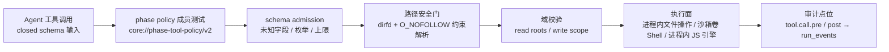
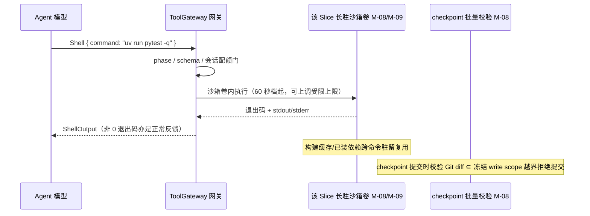

# CodeMigrator 工具系统与 Hook：六工具 IDE 工具箱、Phase 授权与路径安全门

> 文档状态：V6 方向对齐版；ToolGateway 是模型工具调用的唯一入口，只加载 [M-00](CodeMigrator_垂类设计原则与架构哲学.md) 的 phase policy。CheckRunner 已作为 Agent 工具退役：会话自检并入 Shell，裁决层是唯一冻结通道。  
> V6 收敛（fb11）：phase 授权矩阵的非 phase 会话级授权行更新——探索协调者 / EXECUTE Supervisor 均为**事件触发式新会话（只读，零写权）**；登记 Harness **静态会话模板库**（角色系统提示为版本化受信资源，与 phase policy 同类管理；不是模型工具、不经 ToolGateway 工具面；每种会话类型一个模板）。为修复场景扩展 ReadFile 读视野（全境读+域内写）、修复会话授权行与判断层 advice 产生/收养审计点位保留；V5 六工具、路径安全门与 write scope 双轨防护机制保持，V5 对齐段留存追溯（见"V5 当前对齐（V6 追溯留存）"一节）。  
> 技术范围：六工具（ReadFile/WriteFile/EditFile/QuerySourceAst/Shell/Exec）四层工具面调用规范、closed-schema 输入与返回、路径安全门与 write scope 双轨防护、执行面分工、最小 Hook 审计点位与拒绝传播。  
> 契约真相：phase 授权矩阵、WriteScope、CheckCommandTemplate（模型侧消费者已清零，仅服务裁决层 InternalVerificationDispatch 与 Scaffold 基线初始化）与稳定错误码由 [M-00](CodeMigrator_垂类设计原则与架构哲学.md) 唯一拥有；QuerySourceAst 行为与 PSF-2/PSF-3 图导航由 [M-06](CodeMigrator_代码分析与AST引擎.md) 拥有；候选工作区即沙箱卷的生命周期、checkpoint commit 与批量校验由 [M-08](CodeMigrator_候选工作区与工具网关.md) 拥有；app 直接管理 bwrap、长期卷与验证临时物化由 [M-09](CodeMigrator_沙箱与执行环境.md) 拥有。  
> 关联文档：[Agent Loop](CodeMigrator_Agent_Loop设计.md)、[验证引擎](CodeMigrator_验证引擎.md)、[记忆与上下文](CodeMigrator_记忆与上下文管理.md)、[可观测性](CodeMigrator_可观测性系统.md)、[会话与修正](CodeMigrator_会话与运行时修正编排.md)。

工具系统的职责是授权投影与副作用约束：把冻结 phase 允许的最小能力集合变成可审计的类型化调用，并保证任一门禁失败时下游执行与副作用为零。V5 的 EXECUTE Agent 持类 IDE 工具箱在候选工作区自由迭代；工具集合、授权和路径域仍冻结。六工具按四层分工：L1 结构化文件工具，L2 图导航，L3 长驻沙箱 Shell，L4 app 内 Exec 编排。验证裁决不属于任何一层、不经任何模型工具，只走冻结检查集 + tested commit 临时物化目录 → fingerprint 的内部通道；源码与工具输出进入对话上下文时遵循 M-14 的数据块边界。

## V5 当前对齐（V6 追溯留存）

六工具 closed schema、四层工具面、phase 授权、ReadFile 的 cas 数据块、结构化逐写路径门、Shell checkpoint 整体校验、Exec 编排和最小 Hook 审计全部保留。执行面改为 app 直接管理 bwrap；M-09 的长期 Slice 卷与验证临时物化目录分别承载 Agent 迭代和 Oracle 裁决。工具系统不提供 pi 风格开放扩展生态，QuerySourceAst 的图导航能力由 M-06 冻结。V5 对齐段在此留存以供追溯，V6 在上面的基础上追加修复场景的读视野扩展、会话级授权行与 advice 审计点位（见后续各节）。

## V6 方向对齐

V6 在 V5 冻结工具系统之上补齐修复会话与协调会话的工具授权投影：ReadFile 读视野按会话类型条件化扩展、phase 授权矩阵补入非 phase 的会话级授权行、判断层 Advice 的产生/收养纳入 Hook 审计。协调级会话（探索协调者 / EXECUTE Supervisor）为**事件触发式新会话（只读，零写权）**，不作为常驻会话存在。V6 六工具、路径安全门与 write scope 双轨防护不变；VERIFY/REPORT 零模型硬边界仍适用。读视野条件化扩展的精确判定与 schema 标注为实施期开放项，不以本篇冻结为设备契约。

## 授权唯一来自 M-00 phase policy

工具矩阵不是本篇的第二份配置：授权成员、拒绝默认值与策略资源语义的唯一 owner 是 [M-00 的"Phase 工具授权"](CodeMigrator_垂类设计原则与架构哲学.md)，下表仅为引用快照。

| Phase | 唯一授权工具集合 |
|---|---|
| `ANALYZE` | `ReadFile`、`QuerySourceAst` |
| `PLAN` | `ReadFile`、`QuerySourceAst` |
| `EXECUTE` | `ReadFile`、`QuerySourceAst`、`WriteFile`、`EditFile`、`Shell`、`Exec` |
| `VERIFY` | 空集合 |
| `REPORT` | 空集合 |

V6 在 phase 授权之上补入非 phase 的会话级授权行（下表为引用快照，共同组成会话的最终工具集合）：

| 会话类型 | 唯一授权工具集合 |
|---|---|
| 协调会话（探索协调者，事件触发式新会话） | `ReadFile`、`QuerySourceAst`（ANALYZE 级只读集，零写权） |
| 协调会话（EXECUTE Supervisor，事件触发式新会话） | 只读：基线态势快照、定向事件投影、只读查询（零写权） |
| 修复会话 | EXECUTE 六工具 + 升级读视野（见 ReadFile 节）+ 联合域写 |

> VERIFY/REPORT 零模型硬边界仍适用于全部会话：任何会话在 VERIFY/REPORT 阶段请求任何工具（含 `ReadFile`、`Shell` 与 `Exec`）均固定返回 `TOOL_PHASE_DENIED`。

策略由 `codemigrator.core` 以包内静态资源 `core://phase-tool-policy/v2` 发布。网关启动时读取受信 descriptor 的 `payload_sha256`，核验 `SHA-256(JCS(payload))` 后将 Registry descriptor 与 payload exact-compare；哈希不匹配时 app 不进入 ready。Run 创建时冻结该资源版本与哈希，运行期不存在第二次加载。允许性由 `tool ∈ phase.tools` 派生，叠加 V6 会话级授权行（见上表）：`VERIFY`/`REPORT` 对任何会话请求任何工具（含 `ReadFile`、`Shell` 与 `Exec`）固定返回 `TOOL_PHASE_DENIED`；非 `EXECUTE` phase 请求 `WriteFile`/`EditFile`/`Shell`/`Exec` 在同一步拒绝。不存在本地 fallback、通配符或降级读取的分支；修复会话的读视野扩展开的是读视野维度（见下节），不改变 phase 层"零写入/零 Shell"硬边界。

**静态会话模板库登记**：Harness 维护**静态会话模板库**——角色系统提示为版本化受信资源，与 phase policy 同类管理（启动核验、Run 创建冻结、运行期零变更）。模板库**不是模型工具、不经 ToolGateway 工具面**，只是装配侧的角色/系统提示来源；上下文内容段由 M-14 装配器确定性装配（角色系统提示 + 确定性内容段，Supervisor 修复简报按需注入）。**每种会话类型一个模板**；会话差异体现在模板与预算档，不分类型各搞一套实现。

phase 授权只回答"能不能调"；文件类工具的可读根随 phase 进一步收窄（V6 修复会话的可读根为条件化扩展，见下）：

| Phase / 会话类型 | 绑定的可读根 | 说明 |
|---|---|---|
| `ANALYZE`/`PLAN` | 源项目快照根 | 契约引用与候选工作区此时尚不存在；普通并行会话读视野保持 V5 口径 |
| `EXECUTE` | 源项目快照根 + 本 Slice 契约引用集合 + 本 Slice 候选工作区根 | 后两者随 Slice 派发冻结，运行期不可扩大；普通并行 Slice 会话可读根保持 V5 口径（源快照 + 契约引用 + 本工作区）不变 |
| 修复会话 | 源项目快照根 + 契约引用集合 + 本域候选工作区根 + **修复集相关 verified 内容（全境读）** | 读视野条件化扩展（见 ReadFile 节）；**写权限仍限本域/联合域 write scope**，读写分离落地 |
| `VERIFY`/`REPORT` | 无（无授权工具） | 一切读取请求在成员测试处终止（对任何会话均成立） |



## 六工具规范

六工具按四层分工（L1 结构化文件工具 / L2 结构化导航 / L3 能力通道 / L4 编排通道），分层论证见"为什么是分层工具面"一节。所有工具输入均为 closed schema：required 字段固定，unknown field、重复 key、非有限数与超限长度在 schema admission 处拒绝（`TOOL_SCHEMA_INVALID`）；工具名不在六工具注册表返回 `TOOL_NOT_FOUND`。

| 层 | 工具 | 一句话语义 | 执行面 | 专属拒绝码 |
|---|---|---|---|---|
| L1 | `ReadFile` | 三个可读根内读带行号文本 | Harness 编排层进程内 | `READ_OUT_OF_SCOPE`、`READ_LIMIT_EXCEEDED` |
| L1 | `WriteFile` | 冻结 write scope 内整文件原子写入 | Harness 编排层进程内 | `WRITE_SCOPE_VIOLATION`、`WRITE_LIMIT_EXCEEDED` |
| L1 | `EditFile` | 冻结 write scope 内精确匹配替换 | Harness 编排层进程内 | `EDIT_TARGET_NOT_FOUND`、`EDIT_AMBIGUOUS` |
| L2 | `QuerySourceAst` | 源快照符号级只读导航（查 PSF-2 索引） | app 进程内（M-06 服务） | 由 M-06 拥有 |
| L3 | `Shell` | 长驻沙箱内自由命令执行：构建/依赖/探索/会话自检 | 该 Slice 专属长驻沙箱卷（M-08/M-09） | `SHELL_TIMEOUT`、`SHELL_LIMIT_EXCEEDED` |
| L4 | `Exec` | 嵌入式 JS 引擎编排 L1-L3，一次模型调用多步执行 | app 进程内嵌入式 JS 引擎（M-08/M-09） | `EXEC_TIMEOUT`、`EXEC_SCRIPT_ERROR` |

调用协议是单一判别联合，各变体 `model_config = ConfigDict(extra="forbid")` 使 schema 拒绝发生在解析校验时刻：

```python
class ReadFileCall(BaseModel):
    model_config = ConfigDict(extra="forbid")

    tool: Literal["READ_FILE"]
    path: RepoRelativePath
    range: LineRange | None = None


class WriteFileCall(BaseModel):
    model_config = ConfigDict(extra="forbid")

    tool: Literal["WRITE_FILE"]
    path: RepoRelativePath
    content: str


class EditFileCall(BaseModel):
    model_config = ConfigDict(extra="forbid")

    tool: Literal["EDIT_FILE"]
    path: RepoRelativePath
    old_text: str
    new_text: str
    occur: int | None = None        # 1 起始；多命中时必填


class QuerySourceAstCall(SourceAstQuery):   # 载荷与四操作枚举由 M-06 拥有
    tool: Literal["QUERY_SOURCE_AST"]


class ShellCall(BaseModel):
    model_config = ConfigDict(extra="forbid")

    tool: Literal["SHELL"]
    command: str                             # 自由命令文本（含参数），无命令面白名单
    workdir: RepoRelativePath | None = None  # 缺省 = 候选工作区根
    timeout_secs: int | None = None          # 缺省 60 秒模型工具档，可上调受限上限


class ExecCall(BaseModel):
    model_config = ConfigDict(extra="forbid")

    tool: Literal["EXEC"]
    script: str                              # JS 源码字符串，经工具桥编排 L1-L3
    timeout_secs: int | None = None          # 缺省按模型工具档


ToolCall: TypeAlias = Annotated[
    ReadFileCall | WriteFileCall | EditFileCall | QuerySourceAstCall | ShellCall | ExecCall,
    Field(discriminator="tool"),
]
```

返回侧同为 closed schema 的判别联合；`QuerySourceAst` 的返回结构由 M-06 拥有，此处仅登记变体占位：

```python
class ReadFileOutput(BaseModel):
    model_config = ConfigDict(extra="forbid")

    tool: Literal["READ_FILE"]
    path: RepoRelativePath
    body: str                # 带行号正文，行号 1 起始
    total_lines: int
    truncated: bool          # 超出单次上限时 True，附总行数与分段续读建议


class WriteDisposition(str, Enum):
    Created = "CREATED"
    Overwritten = "OVERWRITTEN"


class WriteReceipt(BaseModel):
    model_config = ConfigDict(extra="forbid")

    tool: Literal["WRITE_FILE"]
    path: RepoRelativePath
    bytes_written: int
    disposition: WriteDisposition


class EditReceipt(BaseModel):
    model_config = ConfigDict(extra="forbid")

    tool: Literal["EDIT_FILE"]
    path: RepoRelativePath
    replaced_line: int       # 替换处行号
    bytes_before: int
    bytes_after: int


class ShellOutput(BaseModel):
    model_config = ConfigDict(extra="forbid")

    tool: Literal["SHELL"]
    exit_code: int           # 命令退出码；非 0 是正常反馈而非工具拒绝
    stdout: str              # 按 M-14 数据块边界进上下文的输出正文，超限截断
    stderr: str              # 同上；完整原文落 host CAS，不整段进工具 frame
    truncated: bool          # 任一流超出单次上限时 True


class ExecOutput(BaseModel):
    model_config = ConfigDict(extra="forbid")

    tool: Literal["EXEC"]
    result: str              # 脚本返回值的 JSON 序列化，按 M-14 数据块边界治理
    step_count: int          # 工具桥完成的调用笔数；逐笔回执进 run_events


# QuerySourceAst 的返回结构由 M-06 拥有，此处仅登记变体占位：
class QuerySourceAstOutput(SourceAstResult):
    tool: Literal["QUERY_SOURCE_AST"]


ToolOutput: TypeAlias = Annotated[
    ReadFileOutput | WriteReceipt | EditReceipt | QuerySourceAstOutput | ShellOutput | ExecOutput,
    Field(discriminator="tool"),
]
```

### 模型↔Harness 动作编码

模型输出到工具调用的编码层是工具协议的最外层，其口径在本节显式冻结（此前"单轮单动作、纯 JSON"只是隐含假设）：

- **默认编码：`[cm:*]` 标记分段协议**——模型以行首 `[cm:action]` / `[cm:/action]` 定界标记包裹每段动作正文，段内为该工具 closed-schema 的参数正文。标记分段对多行文本逐字安全（无 JSON 字符串转义）、天然支持单轮多段、且解析器可逐段定位错误位置。
- **单轮多段**：一轮模型输出可包含多个动作段；Loop 对同轮多段逐段执行、逐段回灌观测结果，前段失败或拒绝不吞并后段（执行侧语义见 [M-04](CodeMigrator_Agent_Loop设计.md) 调用循环）。
- **解析失败必须回灌纠偏**：任一段无法解析时该段零执行，解析失败事实作为纠偏 OBSERVATION 回灌同一会话上下文（附错误位置与期望格式），模型据此修正后重发；禁止静默丢弃、部分猜测执行或带病续跑。
- **兼容回退：严格 JSON**——单一 JSON 动作对象仍是合法的兼容回退形态；两种形态收敛到同一 schema admission 与路径门校验，防护不因编码形态降级。

定案依据：纯 JSON 动作协议在代码正文转义密集场景结构性脆弱——实测中一次转义失配即报废整个 Run，而分段标记协议一次通过并全程稳定（A-03 实证收编）。

### ReadFile

| 维度 | 规范 |
|---|---|
| 输入 | 路径形态：`{ path: RepoRelativePath, range?: { start_line, end_line } }`；数据块形态：`{ cas: "cas://<sha256>", range?: { start_line, end_line } }`（closed-schema 二选一） |
| 可读域 | 路径形态：路径必须解析进当前 phase 绑定的可读根集合——源项目快照根（全 phase）；本 Slice 依赖的已集成契约工件引用集合（EXECUTE，M-07 冻结的上下文引用）；本 Slice 候选工作区根（EXECUTE）。契约引用与候选工作区根在 Slice 派发时绑定，ANALYZE/PLAN 只有源快照根；修复会话的可读根为条件化扩展（全境读，见下）。数据块形态：仅限本 Run 产生的 ArtifactRef 数据块（宿主 CAS 中以 Run 归属账本校验），只读、零写入语义 |
| 执行语义 | 路径形态：在归属根 dirfd 下打开并读取；数据块形态：按 digest 从 host CAS 流式读取。输出均为带行号文本（行号 1 起始、右对齐 + 制表符 + 原文） |
| 返回 | `ReadFileOutput`：行号正文 + 总行数 + 截断标记；超出单次上限时 `truncated=true`，Agent 以 `range` 分段续读 |
| 上限 | 单文件/单数据块 64 MiB；单次返回正文 256 KiB；每 agent 会话调用 2 000 次 |
| 拒绝 | 域外/未知或越权 digest `READ_OUT_OF_SCOPE`；超限 `READ_LIMIT_EXCEEDED`；结构性路径问题 `PATH_DENIED` |

`cas://` 数据块形态是超限大输出的模型侧取回通道：Shell/检查完整输出外置 CAS 为 ArtifactRef 后（M-14 头尾双窗摘要），关键信号落在摘要窗口之外（如长输出头部的首错与栈顶帧）时，模型以 `cas://<digest>` 精确取回对应数据块分段，替代"用 Shell 重跑过滤"的预算消耗路径；每次取回逐笔过网关并进入 `tool.call.pre/post` 审计与脱敏出口（M-13）。六工具冻结不变——这是 ReadFile 的第二输入形态，不是第七工具。

**读视野条件化扩展（V6 方向）**：ReadFile 的读视野不再恒等于写权限域，二者解绑。修复会话（含全局修复会话与原 Slice 重生的升级包）读视野扩至修复集相关 verified 内容——即全境读（源快照根 + 契约引用集合 + 本域候选工作区根之外的 verified 内容），而**写权限仍限本域/联合域 write scope**。这是"读写分离（Global Read, Scoped Write）"在工具层的落地——读视野与写权限解绑，解决 V5"读视野被写权限绑架"的问题（修复一个横切缺陷时不得不借 Shell 偷读，读视野受写权限域约束导致自纠盲目）。普通并行 Slice 会话可读根保持 V5 口径（源快照 + 契约引用 + 本工作区）不变。读视野条件化扩展的精确定义（如"修复集相关 verified"的判定边界与 ReadFile 输入 schema）标注为实施期开放项，不以本篇冻结为设备契约；运行时仍统一过路径安全门与域校验，全境读只扩读、不扩写。

### WriteFile

| 维度 | 规范 |
|---|---|
| 输入 | `{ path, content }`；`content` 是完整文件正文（UTF-8），不存在追加、部分写或补丁语义 |
| 写域 | 规范路径必须命中本 Slice 冻结 `WriteScope.out.write_paths`，或位于某 `create_root` 之下且不命中任何其他 Slice 的冻结集合（M-00/M-07 全计划冻结 scope 表判定）；仍受路径安全门约束 |
| 执行语义 | 在候选工作区目标目录内创建固定前缀临时文件 → 写入 + `os.fsync` → 原子 `os.replace` 覆盖目标；任一步失败即清理临时文件，目标保持旧内容 |
| 返回 | `WriteReceipt`：路径、字节数、新建或覆盖 |
| 上限 | 单文件 64 MiB；每 Slice 会话写入总量受 Harness 预算（M-03）约束 |
| 拒绝 | 域外 `WRITE_SCOPE_VIOLATION`（文件写入、candidate ref 推进、checkpoint receipt 均为 0，M-00）；超限 `WRITE_LIMIT_EXCEEDED` |

写入只作用于候选工作区文件集，不触碰任何 Git ref：checkpoint commit 由 Harness 在 Agent 自检完成后统一提交（M-00/M-08）。

### EditFile

| 维度 | 规范 |
|---|---|
| 输入 | `{ path, old_text, new_text, occur? }`；`old_text` 非空，`occur` 为 1 起始的命中序号 |
| 写域 | 同 WriteFile：本 Slice 冻结 write scope，且目标必须是候选工作区内已存在的文件 |
| 执行语义 | 读全文 → 按 UTF-8 字节精确匹配 `old_text`：恰一次命中直接替换；多次命中且未标注 `occur` 拒绝；标注 `occur` 替换第 `occur` 处；替换后整文件经临时文件 + 原子 `os.replace` 写回（同 WriteFile） |
| 返回 | `EditReceipt`：替换处行号、前后字节数 |
| 上限 | 单文件 64 MiB；`old_text`/`new_text` 单项 1 MiB |
| 拒绝 | 零命中或 `occur` 越界 `EDIT_TARGET_NOT_FOUND`；多命中无 `occur` `EDIT_AMBIGUOUS`（附全部命中行号）；域外 `WRITE_SCOPE_VIOLATION` |

### QuerySourceAst

行为唯一 owner 是 [M-06](CodeMigrator_代码分析与AST引擎.md)，本节只登记注册与网关侧约束。执行方式为查 PSF-2 项目索引（PSF=Project Structure Foundation，M-06 拥有：PSF-2 项目索引含 SymbolBinding/ReferenceSite 双向索引）——`definition`/`references` 等符号级操作从按需计算改为索引应答，更快且结果一致；PSF-2 由 F1+F2 确定性派生、纯代码路径，零模型裁量（P-02 不破坏）。

| 维度 | 规范 |
|---|---|
| 输入 | closed-schema 四操作（M-06 `SourceAstQuery` 枚举）：`find_symbol`（符号名 + 可选模块过滤）、`definition`（使用处 `file:range`）、`references`（符号名）、`extract`（`file:range` 子树文本）；自由查询正文与任何修改语义在解析校验时拒绝 |
| 数据面 | 只读冻结源快照（符号级操作应答自 PSF-2 索引，M-06）；不读候选工作区、不读宿主工作树 |
| 返回 | `SourceAstResult`（M-06 拥有）：命中列表或子树文本，含截断标记 |
| 上限 | 单次调用 60 秒（M-00 模型工具档）；命中 200 条、单次文本合计 256 KiB——与 M-06 完全一致 |
| 拒绝 | M-06 拥有：`PATH_OUTSIDE_SNAPSHOT`、`QUERY_TIMEOUT`、`TRUNCATED`、`TEXT_FALLBACK_UNSUPPORTED`；本网关在其前先执行结构性路径门（`PATH_DENIED`） |

### Shell

| 维度 | 规范 |
|---|---|
| 输入 | `{ command, workdir?, timeout_secs? }`；`command` 是自由命令文本（含参数），无命令面、无白名单——能力差异不再经描述符预声明；`workdir` 缺省为候选工作区根；`timeout_secs` 缺省 60 秒（M-00 模型工具档），可上调至受限上限 |
| 执行面 | 该 Slice 专属长驻沙箱卷内直接执行——工作区即沙箱卷（M-08/M-09）；构建缓存与已装依赖跨命令驻留复用，同会话重复构建/测试不重复下载与冷编译 |
| 用途 | 构建、依赖安装、探索、会话自检。自检=反馈不裁决：结果不写 `CheckResult` 账本、不推进 Slice 状态、不进入 verification fingerprint（P-02/M-10）；Agent 自检通过不等于局部验证通过，提交 checkpoint 后 Run actor 仍按冻结检查集独立派发局部验证 |
| 写效果防护 | 不走逐写路径门（命令重定向无法逐笔拦截）；防护由 checkpoint 批量校验承担——checkpoint 提交时校验工作区 Git diff 全部落在冻结 write scope 内，越界拒绝提交且工作区不污染 verified（M-08）。防线从逐笔拦截变为事前（结构化工具）+事后（Shell 批量校验）双轨 |
| 失败语义 | 非 0 退出码是正常返回的反馈而非工具拒绝，进模型上下文驱动修正；工具级失败只有超时（`SHELL_TIMEOUT`，进程组终止）与会话配额超限（`SHELL_LIMIT_EXCEEDED`，预算 100% 时停止新调用，M-03） |
| 网络策略 | 依赖安装需外联：受控网络出口语义，与 default-deny seccomp 的关系在 M-09 细化 |
| 输出治理 | stdout/stderr 按 M-14 数据块边界进上下文，超限截断置 `truncated=true`；完整原文落 host CAS，不整段进工具 frame |
| 审计 | 命令全量记录进 run_events：命令文本 + 退出码 + 输出摘要；粒度粗于结构化工具（无逐写路径回执）但完整可查（M-13） |

### Exec

| 维度 | 规范 |
|---|---|
| 输入 | `{ script, timeout_secs? }`；`script` 是 JS 源码字符串——脚本是 LLM 运行时生成的输出数据，宿主保持 100% Python；`timeout_secs` 缺省按模型工具档（60 秒） |
| 执行形态 | app 进程内嵌入式 JS 引擎（QuickJS 类成熟引擎的 Python 绑定，实施期选型）解释执行；脚本经工具桥 `await tools.xxx()` 编排 L1-L3 工具（循环/条件/并行 `Promise.all` 组合），一次模型调用完成多步确定性编排——串行 LLM 循环瓶颈的解法 |
| 选择规则 | "单步直调，多步编排"：单条命令直调 Shell，批量同构操作/多工具组合流程用 Exec 脚本；写入工具描述由模型自然遵循，无硬性门控。典型场景：批量源结构探索（20 轮模型调用变 1 轮）、契约变更后跨文件一致性修订、查→读→改→shell 验证组合流程、测试生成批量产出 |
| 防护 | 底层每次工具调用逐笔过 ToolGateway（write scope/路径门照常，防护与直调不降级）；脚本零环境权威——引擎不暴露文件系统/网络/进程 API，唯一出口=工具桥；验证裁决不经 Exec（P-02 不破坏） |
| 审计 | 脚本全文 + 逐笔回执入工具审计/run_events；回执溯源语义（V-M04-V4-013 联动）："该轮之前的回执"含 Exec 内回执序 |
| 预算 | Exec 内工具调用计入会话配额；Exec 单次超时按模型工具档；脚本错误=一次可自纠的工具失败（`EXEC_SCRIPT_ERROR`：错误回上下文，模型改脚本重试） |
| 并发语义 | 脚本内 Shell 调用每 Slice 沙箱单会话串行为主（实施期细化，M-09） |
| 资源开销 | app 进程内引擎实例内存/CPU 上限（实施期基准，M-09 资源公式联动） |

### CheckRunner 退役

CheckRunner 不再是 Agent 工具：模型工具注册表移出该变体，全部 phase 的授权集合不含它，请求该工具名返回 `TOOL_NOT_FOUND`。fb7 续轮对齐（议题 E）确认其"双路径尴尬"——工作区即沙箱卷后，Agent 已能在长驻沙箱内自由构建，一次性 overlay 隔离的自检价值大幅弱化（污染本就发生在沙箱内，由 checkpoint 批量校验兜底）；自检并入 Shell，裁决层成为唯一冻结通道。

退役语义四条：

- **会话自检并入 Shell**：自由命令自由参数，长驻沙箱内执行，构建缓存/依赖驻留复用（见 Shell 节）；自检仍是反馈不裁决——不写 `CheckResult` 账本、不推进 Slice 状态、不进 verification fingerprint。
- **app 直接管理裁决与 Scaffold**：`InternalVerificationDispatch` 与 Scaffold 仍不是模型工具，但由 app 直接启动受控 bwrap；不存在 UDS 派发链或由模型工具触发的隐藏执行。
- **能力路线取代关系（D-034 记录）**：CheckRunner 原结构化诊断（`DiagnosticMapping` file:line）与 Test action+test_filter 有界参数路线被 Shell 自由命令取代——模型读原始输出自纠，放弃结构化诊断；验证独立性本就不依赖自检同面（裁决永远由冻结检查集独立做出，P-02）。
- **描述符命令模板的模型侧消费者清零**：`CheckCommandTemplate`（M-00/M-01）只服务裁决层与 Scaffold，模型工具面与描述符命令面不再有交集。

`Scaffold` 维持不开放给 Agent：脚手架是带文件写入副作用的一次性项目初始化动作，由 Harness 在输出基线初始化时执行（M-08/M-11）；它由 app 直接放入受控临时目录并受信吸收声明产物，不经 UDS。

## 为什么是分层工具面

D-034 原以"为什么没有自由 shell"立论，其四条理由中的信任模型与确定性两条，在 fb7 对齐（工作区即沙箱卷）后改述为分层通道论证——问题不再是"要不要自由执行"，而是"每类副作用走哪条通道"：

- **结构化通道（L1/L2）保确定性**：原子写、逐写路径门、精细审计——每次写入与导航都是类型化、可逐笔拦截、可逐笔回执的，候选工作区的受信演进由这条通道承担主责。
- **Shell 通道（L3）保能力**：语言无关的自由执行——构建、依赖安装、探索、临场操作不再要求描述符预声明每个命令；长驻沙箱卷提供物理边界，写效果由 checkpoint 批量校验兜底。
- **验证只走裁决层冻结通道**：`InternalVerificationDispatch` 以冻结检查集 + tested commit 临时物化目录计算 fingerprint，与 Agent 工具面零共享——模型无论在 L3/L4 执行了什么，fingerprint 的计算输入不受任何影响。
- **write scope 防护双轨**：结构化工具事前逐写拦截 + Shell 写效果事后 checkpoint 批量校验——防线从单轨逐笔拦截扩展为事前+事后双轨，完整性不降。
- **Exec（L4）为编排通道**：一次模型调用编排多步确定性执行，解决串行 LLM 循环瓶颈；底层每次工具调用逐笔过 ToolGateway，防护不因编排降级。

工具面从"禁绝自由执行"演进为"分层各司其职"：确定性归结构化通道，能力归 Shell，验证独立性归裁决层，编排效率归 Exec。

## 执行面与副作用边界

| 工具 | 执行面 | 信任级别 | 副作用落点 |
|---|---|---|---|
| `ReadFile`/`WriteFile`/`EditFile` | Harness 编排层进程内，经共享挂载操作候选工作区（即沙箱卷）文件系统 | 受信面：app 进程内确定性代码，无第三方代码执行 | 候选工作区文件集；源快照与 Git refs 零触碰 |
| `QuerySourceAst` | app 进程内 PSF-2 索引只读查询（M-06） | 受信面、零写入 | 进程内解析树 LRU 与索引缓存；快照零变更 |
| `Shell` | 该 Slice 专属长驻沙箱卷内直接执行，bubblewrap 隔离（M-08/M-09） | 不可信执行面 | 沙箱卷内文件系统（含构建缓存/依赖驻留）；越界写由 checkpoint 批量校验兜底，宿主零触碰 |
| `Exec` | app 进程内嵌入式 JS 引擎解释执行（M-08/M-09） | 受信面：脚本零环境权威，唯一出口=工具桥 | 引擎实例内存/CPU 上限内；副作用经工具桥逐笔落底层工具的既定副作用面 |

文件工具与 Exec 不进沙箱：文件操作由 app 进程内的确定性 Python 代码执行，Exec 脚本在 app 进程内嵌入式引擎解释执行；候选工作区物理上是该 Slice 专属长驻沙箱卷，宿主 app 经共享挂载对其读写，越权风险由路径安全门与冻结域承担。Shell 是唯一的不可信执行面：命令在长驻沙箱卷内直接执行，构建缓存与已装依赖跨命令驻留复用；其写效果不走逐写路径门，由 checkpoint 提交时的批量校验兜底。裁决层检查由 app 直接在 tested commit 临时物化目录启动，受 active-attempt 约束，与 Agent 工具面不共享任何通道。



## 路径安全门

文件类工具的路径只接受 M-00 的 `RepoRelativePath`，并按下列顺序执行；1～3 是字符串准入归约，4～6 由内核解析约束承担——字符串检查不构成安全边界，symlink、magic link、挂载越界与文件替换竞争由内核阻止。

| # | 规则 | 拒绝码 |
|---:|---|---|
| 1 | 形态规范化：UTF-8、正斜杠分隔、无 NUL、无反斜杠、无空段、长度 ≤ 4 096 字节；`..` 段在归一化后复检拒绝 | `PATH_DENIED` |
| 2 | 绝对路径与 `~` 前缀拒绝 | `PATH_DENIED` |
| 3 | 路径遍历拒绝：`.`、`..` 段在任何位置；百分号或 Unicode 编码变体在规范化后复检 | `PATH_DENIED` |
| 4 | `.git` 拒绝：首段或任一段等于 `.git`（按字节精确匹配，不做大小写折叠） | `PATH_DENIED` |
| 5 | 符号链接 no-follow：逐段 `os.open` 携带 `O_NOFOLLOW` 解析（等价 `RESOLVE_NO_SYMLINKS`/`RESOLVE_NO_MAGICLINKS` 的内核约束），路径含任何链接段即拒绝，不跟随 | `PATH_DENIED` |
| 6 | 根绑定与挂载点校验：每个可读根/可写根在创建时预打开独立 dirfd；一次调用只绑定一个根，在该根 dirfd 下逐段相对解析（不越出根，等价 `RESOLVE_BENEATH`），并逐段校验 `st_dev` 阻止越出根的挂载边界（等价 `RESOLVE_NO_XDEV`）。源快照根与候选工作区根是互不相同的目录树（不同挂载点），不存在从一根拼接进另一根的合法路径 | `PATH_DENIED` |
| 7 | 打开后替换竞争：句柄绑定旧 inode，回执标记实际 inode 与长度，不重新按路径打开 | —（正确性标注，非拒绝） |

该门同样约束 WriteFile/EditFile 的临时文件物化（临时文件必须落在目标目录所属根内）、验证临时目录的受信物化与审计 Artifact 写入，不允许任何辅助文件绕开所属根。Shell 的写效果不经此门（命令重定向无法逐笔拦截），由 checkpoint 提交时的 Git diff 批量校验承担（M-08）；Exec 内经工具桥发起的每次结构化调用照常过门。

## 拒绝码与失败传播

| 类别 | 错误码 | 触发条件 | 必须为零的副作用 |
|---|---|---|---|
| 授权 | `TOOL_PHASE_DENIED` | phase 未授权该工具（VERIFY/REPORT 请求任何工具；非 EXECUTE 请求写、Shell 与 Exec） | 全部执行 |
| 授权 | `TOOL_NOT_FOUND` | 工具名不在六工具注册表（含请求已退役的 CheckRunner） | 全部执行 |
| schema | `TOOL_SCHEMA_INVALID` | closed schema 拒绝：未知字段、枚举外值（如 QuerySourceAst 操作集外值）、超限长度、空 `old_text`、空 `command`/`script` | 全部执行 |
| 路径 | `PATH_DENIED` | 安全门规则 1～6 | 目标不被打开 |
| 读域 | `READ_OUT_OF_SCOPE` | 路径合法但不在当前绑定的可读根/契约引用集合 | 文件不被读取 |
| 写域 | `WRITE_SCOPE_VIOLATION` | 规范路径不属于本 Slice 冻结 write scope（含新建命中他 Slice 冻结路径） | 文件写入、ref 推进、checkpoint receipt |
| 匹配 | `EDIT_TARGET_NOT_FOUND` / `EDIT_AMBIGUOUS` | 零命中或 `occur` 越界 / 多命中无 `occur` | 文件保持旧内容 |
| 上限 | `READ_LIMIT_EXCEEDED` / `WRITE_LIMIT_EXCEEDED` | 次数、单文件、单次正文或会话配额超限 | 超限那次执行 |
| 查询 | `QUERY_TIMEOUT`、`TRUNCATED`、`PATH_OUTSIDE_SNAPSHOT`、`TEXT_FALLBACK_UNSUPPORTED` | M-06 边界（超时不返回部分结果；TRUNCATED 为显式截断标记） | 部分结果 |
| Shell | `SHELL_TIMEOUT` / `SHELL_LIMIT_EXCEEDED` | 命令超时（进程组终止）/ 会话 Shell 配额超限 | 进程组清理完毕，沙箱卷内无残留运行进程 |
| Exec | `EXEC_TIMEOUT` / `EXEC_SCRIPT_ERROR` | 脚本超时 / 脚本语法或运行时错误（可自纠失败） | 引擎实例销毁；在途底层调用按其自身语义终结 |

失败不隐藏：每次拒绝都以结构化错误对象返回模型对话上下文，模型据此在同 phase 内自纠；网关不重试、不代改、不降级。

```python
class ToolError(BaseModel):
    code: ToolErrorCode
    retryable_in_phase: bool      # 几乎全部为 True；TOOL_PHASE_DENIED 恒为 False
    facts: list[ErrorFact]        # 机器可读上下文：命中行号、截断建议、域边界提示
```

| 错误码 | facts 携带的自纠事实 |
|---|---|
| `EDIT_AMBIGUOUS` | 全部命中行号与总数 |
| `EDIT_TARGET_NOT_FOUND` | 文件实际行数（提示先 ReadFile 核对） |
| `WRITE_SCOPE_VIOLATION` | 本 Slice 冻结输出路径集合摘要 |
| `READ_OUT_OF_SCOPE` | 当前 phase 绑定的可读根说明 |
| `TRUNCATED` / `READ_LIMIT_EXCEEDED` | 总行数/总字节与分段续读建议 |
| `SHELL_TIMEOUT` | 命令文本摘要与已运行时长（提示收窄命令或拆步重试） |
| `EXEC_SCRIPT_ERROR` | JS 错误类别、脚本行号与消息摘要（提示模型改脚本重试） |

对外投影（run_events）只保留错误码与类别，不保留被拒路径原文、正文与匹配内容；完整拒绝细节只存在于模型会话与受信审计面。

## Hook 体系：最小审计点位

V3 的七步 Hook 链在 V4 下按"安全判断内化为门禁、审计保留为点位"简化；V3 中服务于插件体系的 Hook（能力协商、插件进程注册、edit intent 持久化回调）随插件进程体系一并废除，无对应场景、零残留。

| V3 Hook 步骤 | V4 归宿 |
|---|---|
| Resolve（成员/phase 核对） | 网关成员测试（M-00 policy） |
| Schema | 网关 schema admission |
| Path | 路径安全门 |
| Security（数据边界） | 域校验 + M-14 上下文数据块边界 |
| Persist intent | 取消独立 intent 持久化，由 `tool.call.pre` 审计点位承担 |
| Execute | 执行面（进程内文件操作 / 沙箱卷 Shell / 进程内 JS 引擎） |
| Redact & record | `tool.call.post` 审计点位 + M-13 脱敏 |

保留的最小集是两个工具审计点位、一个 checkpoint 前钩子，外加 V6 新增的判断层 advice 产生/收养审计点位。

| 点位 | 触发 | 记录内容 | 不记录 |
|---|---|---|---|
| `tool.call.pre` | 每次调用进入网关（含将被拒绝的调用） | run/slice/generation/phase、工具名、参数摘要（canonical 哈希 + 路径类别/命令文本摘要/脚本哈希）、时间戳 | 输入正文、匹配内容 |
| `tool.call.post` | 调用终结（成功、拒绝或超时） | 终态、错误码、时长、结果状态与副作用摘要（成功写入的目标路径、字节数；Shell 的退出码与输出摘要；Exec 的脚本哈希与逐笔步数） | 正文、stdout/stderr |
| `checkpoint.pre` | Harness 将候选工作区文件集提交为 checkpoint commit 前（生命周期归 M-08） | 工作区 Git diff ⊆ 冻结 write scope 的批量校验结论（覆盖 Shell 写效果）、文件数与字节摘要 | 文件内容 |
| `advice.proposed` | 判断层产生一条 Advice 时 | **Advice 全量进 run_events**：实体/phase/触发源、上下文摘要、`proposal_hash`（供收养核验） | 工具正文、被拒路径原文 |
| `advice.adopted` | 判断层收养一条 Advice 时 | 收养判定与落点摘要、`proposal_hash` 关联回溯源 | 正文、匹配内容 |

> **Advice 不是模型工具**：判断层 advice 的产生/收养属判断层内部动作，不从模型工具面发起，不经 ToolGateway 工具面，也不进入 six-tool 授权集合；经 `advice.proposed` / `advice.adopted` 审计点位全量投影进 run_events（M-13/M-02），`proposal_hash` 建立产生—收养的核验关联。

`checkpoint.pre` 承担 write scope 双轨防护的事后批量校验：结构化工具（含 Exec 工具桥发起的底层调用）已在事前逐笔拦截越界写；Shell 的写效果不经逐写路径门（命令重定向无法逐笔拦截），此处在整体提交前校验工作区 Git diff 全部落在冻结 write scope 内，越界拒绝提交且工作区不污染 verified（M-08）。越界来源分两类处置（owner：M-08/V-M08-V4-007）：纯 Shell 越界写属可预期失败面——中止提交、零 ref 推进、产生告警事件，越界路径清单回 Agent 上下文自纠，Agent 回退越界变更后重新声明完成，generation 不消耗、工作区保留；若结构化工具审计存在越界记录，则意味着网关被绕过或实现缺陷，属基础设施事故——工作区整体丢弃，原 generation 物理重派从最近合法 checkpoint 重建（不消耗 generation，M-00/M-08）。

点位是网关与 Harness 内的固定代码路径，不是可注入脚本：不设用户自定义 Hook 扩展点，工具面封闭——六工具 + M-00 policy，不存在第三方注册入口、Hook 配置文件或动态加载。审计事件与 M-02 的 `run_events` 同事务投影：每次工具调用的工具名、参数摘要与结果状态进入事件流（Shell 命令附退出码与输出摘要，Exec 附脚本全文与逐笔回执），供 M-13 可观测性指标与 M-15 工作台（卡片实时动作展示）消费。AskUser、Skill 与判断层 Advice 均不登记为模型工具（M-16）：聊天输入、知识正文与判断层建议不能经任何点位获得源码、路径或编辑权限。

## 贯穿场景

### 场景一：EditFile 匹配失败与自纠

EXECUTE 实现 Slice B 的 Agent 要把 `src/api/client.py` 中一处 `dict[str, Any]` 换成强类型模型。`EditFile` 到达网关：EXECUTE 授权、schema 合法、路径在 B 的冻结 write scope 内、安全门通过；但全文扫描命中 3 处，返回 `EDIT_AMBIGUOUS`，错误对象附 3 处命中行号（L42/L87/L121）。Agent 核对行号后以 `occur=2` 重发，恰替换第 2 处，整文件经临时文件 + 原子 `os.replace` 写回，返回 `EditReceipt`（替换行号 L87、前后字节数）。全程零 ref 推进——checkpoint 由 Harness 在自检完成后统一提交。

### 场景二：Shell 自检反馈驱动修正

Agent 完成测试翻译 Slice T 的初稿后调用 `Shell(command="uv run pytest -q")`。网关确认 EXECUTE 授权、schema 合法、会话配额未满；命令在该 Slice 专属长驻沙箱卷内直接执行——依赖已由先前命令安装驻留，无重复下载。命令以退出码 1 终止，输出含 2 处失败测试的 `file:line`（其一指向对 A 模块契约签名的误用）——非 0 退出码是正常反馈而非工具失败。输出按 M-14 数据块边界进入模型上下文，Agent 修正签名后再次执行得到退出码 0。构建缓存与 `.venv` 跨命令驻留复用；该结果不写验证账本、不进 fingerprint，最终验证仍由 Run actor 在冻结 verified head 上独立执行翻译后全套测试（P-02/M-10）。run_events 记录两次命令的命令文本、退出码与输出摘要；若 Agent 曾以重定向写出冻结 write scope 外文件，将在 checkpoint 提交时被批量校验拒绝（M-08）。

### 场景三：Exec 批量编排替代串行循环

Agent 需要为 20 个模块逐一核对契约符号的引用位置。串行直调需 20 轮模型调用（每轮一次 `QuerySourceAst` 加一轮对话往返），Agent 改为提交一次 `Exec`：脚本内循环 `await tools.query_source_ast(...)`（查 PSF-2 索引应答）聚合各模块引用命中，最终返回汇总 JSON。脚本在 app 进程内嵌入式 JS 引擎执行，工具桥内的每次调用逐笔过 ToolGateway（phase/schema/路径门照常）并各自产生 `tool.call.pre/post` 审计事件——一次模型调用完成全部 20 次查询。脚本全文与逐笔回执序进入 run_events，"该轮之前的回执"含 Exec 内回执序（V-M04-V4-013）。若脚本笔误抛出 JS 错误，返回 `EXEC_SCRIPT_ERROR`（facts 含行号与消息摘要），Agent 改脚本重试——一次可自纠的工具失败。

### 场景四：VERIFY 请求 ReadFile 被拒

最终验证阶段某测试失败，模型想读取该测试文件解释原因。请求在网关成员测试处即得 `TOOL_PHASE_DENIED`（M-00：VERIFY 授权集合为空）：零文件打开、零工具执行，仅一条拒绝审计事件。模型只能消费 M-10 归因后的诊断与验证 receipt 投影；失败归因（测试文件 write scope + 被测模块依赖 → owning Slice 定向重生成）是 Harness 职责，验证阶段不会演化为不受控的修复循环。

## V5 可验收增量

- [ ] 运行期工具面恰为 ReadFile、WriteFile、EditFile、QuerySourceAst、Shell、Exec 六工具；CheckRunner 不再是 Agent 工具，VERIFY/REPORT 不能通过工具面执行。
- [ ] QuerySourceAst 使用 PSF-2 图谱导航（符号、caller/callee、impact、context、FTS），ReadFile 支持受控 `cas://` 数据块读取；两者均只读且带来源审计。
- [ ] app 直接管理 bwrap；Shell 使用 Slice 长期沙箱卷，裁决验证使用独立临时物化目录；不存在 UDS 派发链或 overlay 授权路径。
- [ ] WriteFile/EditFile 逐写拦截越界，Shell 越界写由 checkpoint.pre 批量拒绝；拒绝不推进 candidate、verified 或 checkpoint receipt。
- [ ] Exec 内工具桥调用逐笔经过同一 ToolGateway，脚本不能触达宿主文件系统、网络或进程 API。

## V4 历史验收基线（追溯，非当前 V5 契约）

- [ ] V-M12-V4-001：VERIFY/REPORT 请求任一工具（含 ReadFile、QuerySourceAst、Shell、Exec）返回 `TOOL_PHASE_DENIED`，文件打开与沙箱命令执行数为 0
- [ ] V-M12-V4-002：`core://phase-tool-policy/v2` payload 哈希不匹配时 app 不进入 ready；运行期不存在第二次策略加载
- [ ] V-M12-V4-003：WriteFile/EditFile 写域外路径（不命中 `write_paths` 且不位于合法 `create_root` 之下，含新建命中他 Slice 冻结路径）返回 `WRITE_SCOPE_VIOLATION`，文件写入、candidate ref 推进与 checkpoint receipt 均为 0
- [ ] V-M12-V4-004：WriteFile/EditFile 写入过程注入崩溃，候选工作区不出现半写文件或残留临时文件（原子 `os.replace` 验证）
- [ ] V-M12-V4-005：EditFile 零命中返回 `EDIT_TARGET_NOT_FOUND`；多命中无 `occur` 返回 `EDIT_AMBIGUOUS` 且错误对象含全部命中行号；标注 `occur` 后恰替换指定一处
- [ ] V-M12-V4-006：ReadFile 读取可读根外路径返回 `READ_OUT_OF_SCOPE`；ANALYZE/PLAN 请求候选工作区路径同样拒绝
- [ ] V-M12-V4-007：QuerySourceAst 的操作集、60 秒超时、200 条命中与 256 KiB 截断行为与 M-06 定义逐项一致；`definition`/`references` 应答来自 PSF-2 项目索引查询而非按需计算
- [ ] V-M12-V4-008（V4 历史协议部分已退役）：模型工具注册表无 CheckRunner（请求该工具名返回 `TOOL_NOT_FOUND`，全部 phase 授权集合不含它）；V5 不存在 UDS 派发链，裁决层 `InternalVerificationDispatch` 与 Scaffold 基线初始化均由 app 直接管理 bwrap，且不存在由模型工具触发的验证执行
- [ ] V-M12-V4-009：Shell 命令在该 Slice 专属长驻沙箱卷内执行，宿主文件系统零触碰；同会话第二次构建/测试复用驻留的构建缓存与已装依赖（无重复下载与冷编译）
- [ ] V-M12-V4-010：Shell 越界写（重定向至冻结 write scope 外路径）在 checkpoint 提交时被批量校验拒绝：commit 不创建、零 ref 推进、verified 不被污染，拒绝事件含越界路径清单
- [ ] V-M12-V4-011：绝对路径、`..`、`.git`、symlink、跨根/跨挂载样本注入全部返回 `PATH_DENIED`，目标不被打开
- [ ] V-M12-V4-012：每次工具调用在 run_events 恰有一条 `tool.call.pre` 与一条 `tool.call.post`，含工具名、参数摘要与结果状态；Shell 调用记录命令文本、退出码与输出摘要；Exec 调用记录脚本全文与逐笔回执；每次 checkpoint 提交恰有一条 `checkpoint.pre`；拒绝事件不含路径原文与正文
- [ ] V-M12-V4-013：`checkpoint.pre` 批量校验发现纯 Shell 越界写时中止提交、零 ref 推进、拒绝事件含越界路径清单回 Agent 上下文，Agent 回退越界变更后重新声明完成的第二次提交正常通过，generation 消耗为 0；仅当结构化通道审计存在越界记录（网关被绕过的基础设施事故）时才工作区整体丢弃并原 generation 物理重派；verified 分支不出现任何越界文件
- [ ] V-M12-V4-014：运行时扫描不存在用户 Hook 注册入口、Hook 配置文件、六工具之外的工具名（含已退役的 CheckRunner）或 V3 wire 方法（ResolveLocator/EmitPatch/Query 等）残留
- [ ] V-M12-V4-015：Exec 脚本在 app 进程内嵌入式 JS 引擎执行，脚本可触达的宿主 API（文件系统/网络/进程）数为 0，唯一出口为工具桥
- [ ] V-M12-V4-016：Exec 内每次工具桥调用逐笔过 ToolGateway 并产生 `tool.call.pre`/`tool.call.post` 审计事件（write scope/路径门拒绝行为与直调一致，防护不降级）；"该轮之前的回执"溯源含 Exec 内回执序（V-M04-V4-013 联动）
- [ ] V-M12-V4-017：Exec 超时返回 `EXEC_TIMEOUT`、脚本错误返回 `EXEC_SCRIPT_ERROR`（facts 含错误行号与消息摘要），两者均为可自纠失败且引擎状态销毁；Exec 内工具调用计入会话配额，配额 100% 时工具桥内新调用拒绝
- [ ] V-M12-V4-018：Shell 自检结果不写 `CheckResult` 账本、不推进 `SliceAttemptStatus`、不进入 verification fingerprint；fingerprint 计算输入与无 Shell 会话逐字节一致（P-02）

> 设计演进、历史缺陷处置和变更理由见：[文档迭代记录](文档迭代记录.md)。
