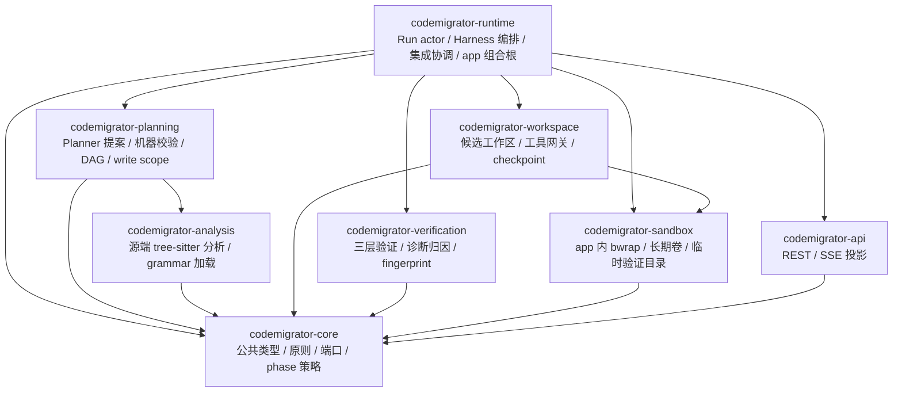
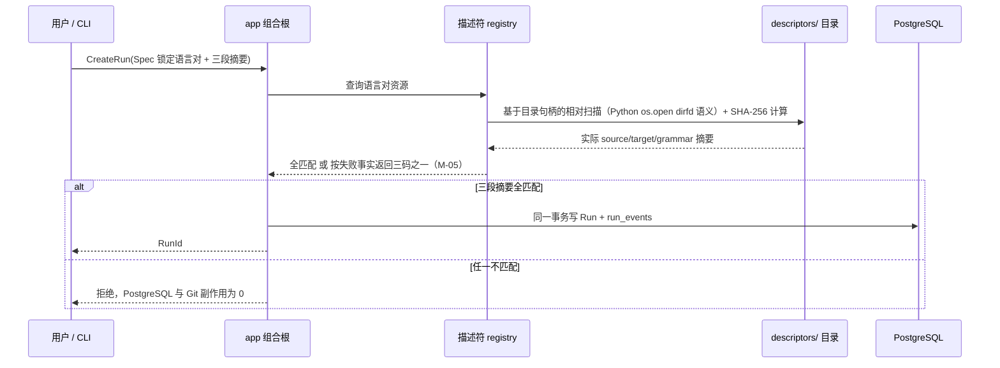
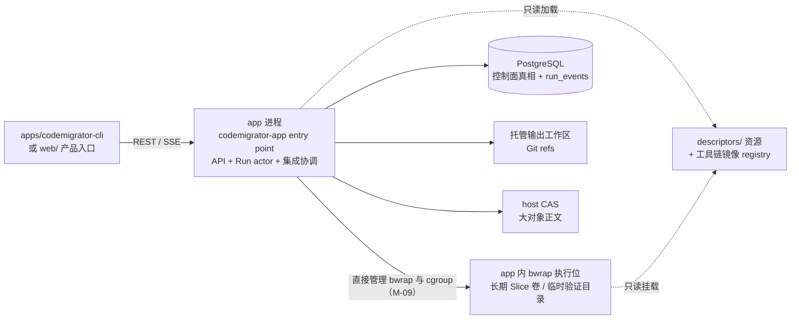

# CodeMigrator 核心目录与描述符资源架构

> 文档状态：V6 方向对齐版；本篇是子包物理清单、依赖方向、描述符资源目录与进程部署拓扑的唯一 owner。
> 技术范围：Python 3.12+ 单包 src-layout（uv 管理）、8 个核心子包、双工具链描述符资源、`app + PostgreSQL` Compose 基线；app 直接管理 bwrap。
> 契约真相：公共领域类型、运行语义与验证契约以 [M-00 垂类设计原则与架构哲学](CodeMigrator_垂类设计原则与架构哲学.md) 为准；本篇冻结单包组成、子包依赖图、描述符目录规则与 app 内执行适配归属。
> 关联文档：[系统后端架构](CodeMigrator_系统后端架构.md)、[Harness 总体设计](CodeMigrator_Harness总体设计.md)、[代码分析与 AST 引擎](CodeMigrator_代码分析与AST引擎.md)、[候选工作区与工具网关](CodeMigrator_候选工作区与工具网关.md)、[沙箱与执行环境](CodeMigrator_沙箱与执行环境.md)、[验证引擎](CodeMigrator_验证引擎.md)、[工具系统与 Hook](CodeMigrator_工具系统与Hook.md)、[Web 体验与迁移可视化工作台](CodeMigrator_Web体验与可视化工作台.md)。
> V6 方向对齐：常驻协调会话与修复会话的编排语义由既有子包承载——探索协调者/Supervisor/全局修复会话属于模型会话与判断层协调，由 runtime（actor 邮箱吸收 Advice）与 analysis（只供 PSF 投影）承载；supervisor 判断层不新增独立子包。V5 的 8 子包依赖契约保持，协调归属细述见"八个子包"一节。

V4 的历史设计把语言能力从进程级扩展改为声明式资源；该原则在 V5 保留，但执行物理面改为 app 内 bwrap。新增一个语言对不引入新的可执行服务、RPC 方法集合或能力协商，而是新增两份描述符目录与对应 grammar、工具链镜像。目录设计因此只剩两个必须防住的失控点：把每个概念拆成独立库导致依赖网膨胀，或把某种语言的 grammar、命令行细节留在核心层导致任何新语言对都要修改核心。本篇把稳定 Python 内核冻结为 8 个子包，把会变化的语言事实全部压入 `descriptors/` 资源目录。

## V5 当前对齐

V5 保留八个核心子包和 Python 单包底座，但删除独立 sandbox-worker、UDS/Protobuf 六方法协议及 overlay 授权链。sandbox 子包改为由 app 直接管理 bwrap（设置 PDEATHSIG 与 cgroup）；每个 Slice 仍使用跨命令保留的长期沙箱卷，验证从被测提交临时物化到独立目录。描述符只提供语言事实、工具链和命令模板，目标目录结构与 Slice 写域由 TargetProjectBlueprint、LLM Planner 和机器校验共同决定，不再由描述符目录约定授权。

## 语言基线与映射决策

本篇由 Rust 实现设计改写为 Python 实现设计：设计思想、架构、模块边界与验证契约完全不变，仅替换实现语言词汇。**本篇是下述 Rust→Python 映射决策表的全局唯一 owner**，其余文档涉及语言映射一律引用本表，不得另立第二份定义：

| Rust 实现设计 | Python 实现设计 |
|---|---|
| Rust 2024 Cargo workspace、8 个 crate | 单包分层 src-layout：`src/codemigrator/` 下 8 个子包（core/analysis/planning/workspace/verification/sandbox/runtime/api），uv 管理，import-linter 契约约束层间依赖 |
| `cargo metadata` 依赖图 CI 静态审查 | import-linter（layer/forbidden/independence 契约）+ CI 检查 |
| bin target `codemigrator-app`/sandbox 执行入口 | `pyproject.toml` `[project.scripts]` 只保留 app 组合根；sandbox 是 app 内部执行适配，不是独立服务 |
| tokio | asyncio |
| axum | FastAPI |
| sqlx | SQLAlchemy 2.0(async)+asyncpg |
| serde | Pydantic v2 |
| trait | typing.Protocol/ABC |
| enum+match | enum.Enum+match/case |
| Result 错误体系 | 异常层次+冻结错误码 |
| tree-sitter Rust 绑定 | py-tree-sitter |
| 独立 UDS SOCK_SEQPACKET+Protobuf v1 | 退役；Python app 直接调用 bwrap 子进程 |
| bubblewrap/cgroup | bubblewrap/cgroup 不变（subprocess 调 bwrap） |
| tracing | structlog+OpenTelemetry |
| Cargo.toml | pyproject.toml |
| migrations | migrations 不变 |

## 八个子包：依赖无环，副作用归位



`codemigrator-runtime` 是唯一组合根：只有它的 `codemigrator-app` entry point（`pyproject.toml` `[project.scripts]` 声明的 console script）读取环境、装配依赖、获取 PostgreSQL session advisory lock 启动门并启动 Run actor。`codemigrator-sandbox` 提供 app 内 bwrap、cgroup 和临时物化适配，不拥有独立服务 entry point。其余子包不读取环境变量、不自行创建后台任务。`apps/codemigrator-cli` 与 `web/` 是产品入口，不计入核心子包，也不出现在任何核心子包的依赖图中。

| 子包 | 唯一职责 | 禁止事项 | 允许依赖 |
|---|---|---|---|
| `codemigrator-core` | M-00 冻结的公共 ID、状态、`ToolchainDescriptor`/`CheckCommandTemplate`、`WriteScope`、稳定错误码、服务端口与 `core://phase-tool-policy/v2` 工具授权资源 | HTTP、SQL、Git、进程、文件 I/O、具体语言 grammar 与命令行细节 | 无 |
| `codemigrator-analysis` | 源项目进程内 tree-sitter 解析、grammar 隔离加载、import 图、模块清单、测试覆盖图（M-06） | 写源项目、生成目标代码、网络与数据库访问、执行检查命令 | `core` |
| `codemigrator-planning` | LLM Planner 提案适配、PlanValidation、Slice/DAG/write scope/integration_rank 规则（M-07） | 未经 runtime 授权的模型调用、文件系统与 Git 写、数据库访问 | `core`、`analysis` |
| `codemigrator-workspace` | 候选工作区生命周期、Git refs 与 expected-OID CAS、checkpoint commit、Agent 工具网关执行面（M-08/M-11/M-12） | 命令面外构造 program/argv、越 write scope 写入、验证通过判定 | `core`、`sandbox` |
| `codemigrator-verification` | 三层验证编排归约、`verification_fingerprint`（证据防替换由完整 outcome 落库承载）、诊断→owning Slice 归因（M-10）；分析产物作为不可变数据输入，不构成导入期依赖 | 直接启动进程、推进 Git ref、连接数据库 | `core` |
| `codemigrator-sandbox` | app 内 bubblewrap/cgroup/配额、命令模板实例化、Slice 长期卷与验证临时物化（M-09） | PostgreSQL 连接、Run/Slice 状态归约、命令面外裁决、独立沙箱服务 | `core` |
| `codemigrator-runtime` | Run actor 邮箱与状态机、判断层 Advice 收养、单写者启动门、active dispatch gate、Integration Coordinator、PostgreSQL ledger 与 `run_events`、恢复协调、观测装配；拥有 `codemigrator-app` 组合根 entry point | HTTP DTO 形状、沙箱进程实现细节、语言 grammar 内容 | 上述全部子包 |
| `codemigrator-api` | HTTP DTO、SSE 断点回放、`If-Match`、RFC 9457 错误投影（M-02） | SQL、Git、进程启动、领域归约 | `core` |

这组依赖把"谁能做哪种副作用"表达成可检查的 import 依赖图：`analysis` 不碰网络与进程执行；`planning` 不碰文件系统；`verification` 只归约不执行；`workspace` 的全部执行都经 `sandbox` 的冻结命令面；`api` 只消费 `core` 端口，实现由组合根绑定。PostgreSQL repository、`run_events` 与 schema 演进（`migrations/`）归 `runtime`，因为状态与事件在同一 actor 事务写入；观测指标契约在 `core` 发布、structlog/OpenTelemetry 装配在 `runtime`。CI 对 import-linter 契约（依赖图与禁止依赖清单）与 `runtime` 之外的环境读取执行静态审查。

整张图收敛为四层，层内禁止互相依赖：

| 层 | 子包 | 层规则 |
|---|---|---|
| 契约层 | `core` | 零内部依赖；唯一允许被所有层引用的层 |
| 领域层 | `analysis`、`planning`、`verification` | 纯逻辑与归约，不启动进程、不碰 Git、不连数据库 |
| 执行层 | `workspace`、`sandbox` | 唯一能触碰文件系统写、Git refs 与 app 内子进程的层 |
| 编排投影层 | `runtime`、`api` | `runtime` 组合全部执行层并持有控制面事务；`api` 只做外部投影 |

V6 方向协调归属：常驻主 Agent 的协调语义——探索协调者、Supervisor 判断层与全局修复会话——属于模型会话与判断层的协调，不新增独立子包。supervisor 判断层是模型会话的编排角色，不是新服务，不持有自己的控制面；其承载落在两类既有语义上：`runtime` 的 Run actor 邮箱负责吸收判断层投递的 Advice（含 `advice.adopted` 收养语义），`analysis` 仅向判断层提供只读代码视角（只用 PSF 投影），自身不参与协调状态归约。V5 冻结的 8 子包依赖契约与四层依赖规则保持，本篇依赖图不新增子包、不改依赖边。

## 描述符资源目录：语言差异的唯一载体

语言对 = 一份源端描述符 + 一份目标端描述符。目录按 `<language-role>/<language-id>` 组织，每份 `descriptor.json` 覆盖 M-00 对应端（`SourceToolchain` 或 `TargetToolchain`）的全部字段，并附加 `descriptor_version` 与 `language_role` 两个目录元数据字段；目标端描述符另声明 `allowed_domains`，供 Shell 沙箱的受控出口代理注入域名白名单。

### 描述符定位

描述符是**确定性差异声明载体**：语言对的差异事实全部以纯数据声明，服务两个结构性不可替代的位置——

| 位置 | 描述符承载物 | 不可替代性 |
|---|---|---|
| 分析确定性 | grammar、清单解析器、测试约定、import 提取模板 | F1~F4 确定性事实的唯一来源（M-06） |
| 裁决冻结 | 五类命令模板 `CheckCommandTemplate` → `InternalVerificationDispatch` | 冻结检查集的唯一来源，P-02 验证可复算的前提 |

消费者清单：ANALYZE 分析管线（消费源端描述符全量）、裁决层 `InternalVerificationDispatch`（消费目标端检查模板，冻结检查集唯一来源）、Scaffold 基线初始化、能力门 CreateRun 预检、会话上下文约定注入。`CheckRunner` 已退役，模型侧消费者清零——描述符的消费者全部是确定性组件。

三层能力阶梯：

| 层 | 内容 |
|---|---|
| 裁决面 | 描述符最小声明集 |
| 能力面 | Shell+Exec 语言无关承载，能力差异不再由描述符承担 |
| 演进面 | schema 版本化（`descriptor_version`）+ text-fallback 兜底 |

动态边界三档：

| 档位 | 覆盖 | 成本 |
|---|---|---|
| 纯数据动态 | grammar、命令模板、约定 | 新语言对零代码，仅新增描述符目录 |
| 注册表扩展 | 新清单格式需 `ManifestParserRef` 解析器注册表扩展 | Python 代码，少见路径 |
| text-fallback 兜底 | 任何语言可回退文本声明 | 零增量 |

"数据不回退为代码插件"边界不变（D-032 哲学保持）。

```
descriptors/
├── source/
│   └── typescript/
│       ├── descriptor.json          # SourceToolchain：语言 id、扩展名、grammar 引用、清单解析器
│       └── grammar/
│           ├── tree-sitter-typescript.so
│           └── grammar.sha256
└── target/
    └── python/
        └── descriptor.json          # TargetToolchain：包管理器、五类命令模板、工件策略、工具链镜像摘要
```

源端示例（字段与 M-00 `SourceToolchain` 一致）：

```json
{
  "descriptor_version": "1.0.0",
  "language_role": "source",
  "language_id": "typescript",
  "extensions": [".ts", ".tsx"],
  "parser": {
    "grammar_id": "tree-sitter-typescript",
    "grammar_carrier": "shared-library",
    "grammar_path": "grammar/tree-sitter-typescript.so",
    "grammar_sha256": "…"
  },
  "manifest_parsers": [{ "manifest_kind": "npm-package", "parser_id": "npm-manifest" }]
}
```

目标端示例（字段与 M-00 `TargetToolchain` 一致，命令模板显式携带 program/argv/timeout；`artifact_rules` 为工件策略字段，见示例后说明）：

```json
{
  "descriptor_version": "1.0.0",
  "language_role": "target",
  "language_id": "python",
  "package_manager": "uv",
  "scaffold": [
    { "action": "SCAFFOLD", "program": "uv", "argv": ["init", "--lib"], "timeout_secs": 300 }
  ],
  "build": [],
  "test": [
    { "action": "TEST", "program": "uv", "argv": ["run", "pytest", "-q"], "timeout_secs": 120 }
  ],
  "lint": [
    { "action": "LINT", "program": "uv", "argv": ["run", "ruff", "check", "."], "timeout_secs": 300 }
  ],
  "typecheck": [
    { "action": "TYPECHECK", "program": "uv", "argv": ["run", "mypy", "."], "timeout_secs": 300 }
  ],
  "artifact_rules": [
    { "pattern": "**/*_pb2.py", "artifact_kind": "GeneratedCode", "source_pattern": "**/*.proto" },
    { "pattern": "{docker-compose.yml,Makefile,config.yaml}", "artifact_kind": "DeclarativeConfig" },
    { "pattern": "db/**/*.sql", "artifact_kind": "ResourceFile", "mapping": "copy" }
  ],
  "allowed_domains": ["files.pythonhosted.org", "pypi.org"],
  "toolchain_image_digest": "sha256:…"
}
```

工件策略字段 `artifact_rules` 以 `ArtifactKind` 声明工件分类规则（枚举三类），各类处理策略：

| ArtifactKind | 典型工件 | 处理策略 |
|---|---|---|
| `GeneratedCode` 生成代码 | `.pb.go`、`*_pb2.py` 等 | 不翻译：由目标侧从源头（如 `.proto`）用目标工具链重新生成，grpcio-tools 类重新生成命令入目标端描述符 scaffold 档；`.proto` 源文件作为接口事实源被 Planner 选择的 Slice 消费。**通用降级阶梯**：目标生态无等价 codegen 时（如 go-zero `.api` DSL），该源 DSL 工件按 `DeclarativeConfig` 类处理——作为接口事实源归 Planner 选择的 Slice，由其翻译为目标语言惯用等价物，不适用 GENERATED 标注 |
| `DeclarativeConfig` 声明式基础设施配置 | docker-compose、Makefile、config.yaml、无 codegen 等价物的源 DSL | 作为声明式工件由 Planner 选择的 Slice 翻译出目标侧等价物，目标路径与 write scope 经 Blueprint/PlanValidation 校验 |
| `ResourceFile` 资源文件 | SQL schema、静态资源 | 按描述符 mapping 的资源映射复制/轻转换，不入翻译 Slice |

依赖副产物规范排除集 `build_excludes` 是目标端描述符的声明字段（M-00 `TargetToolchain`）：声明依赖安装/构建过程的副产物路径模式（如 `.venv/`、`__pycache__/`、`node_modules/`、Go 的构建缓存目录）。排除集内的写入不计入 checkpoint diff 校验、不进入 candidate commit——依赖在长驻沙箱卷内驻留复用（M-09），但构建垃圾不污染代码事实。

命令模板是目标端检查命令的唯一来源：`codemigrator-sandbox` 只做冻结参数代入与实例化，不接受模板外的 program、argv 或 shell 片段；这一命令面的消费方是 Harness 内部验证（裁决层 `InternalVerificationDispatch`）——`CheckRunner` 已退役，模型侧不再共用这一命令面。grammar 制品为 tree-sitter 动态库或 wasm 模块，由 `grammar_carrier` 声明，摘要规则相同。

安全 linter 用法提示：lint 档可声明安全 linter（Python 侧 `bandit`、Go 侧 `gosec` 类）作为可选辅助检查——这是现有命令模板机制的自然用法（向 lint 档追加一条命令模板即可），零机制新增；其定位是语义鸿沟（性能、安全、生态习惯不在测试主证覆盖内）的辅助缓解手段，与 [M-10 验证引擎](CodeMigrator_验证引擎.md)的验证边界声明、[M-15 Web 体验与可视化工作台](CodeMigrator_Web体验与可视化工作台.md)的证据页边界区块联动。

| 规则 | 内容 |
|---|---|
| 发现 | 启动时以基于目录句柄的相对寻址（Python `os.open` dirfd 语义）扫描 `descriptors/`；symlink、`..`、目录外 inode 不进入 registry |
| 摘要校验 | 每份 `descriptor.json` 计算正文 SHA-256；grammar 制品计算 SHA-256 并与 `parser.grammar_sha256` 核对，不符则该描述符整体不进入可用集 |
| 语言对摘要 | `ToolchainDescriptor.descriptor_sha256 = SHA-256(canonical(source_sha256 ‖ target_sha256))`，对应 M-00 语言对锁 |
| CreateRun 预检 | Spec 锁定的语言对、`descriptor_version` 与三段摘要全部命中才允许创建 Run；拒绝码统一沿用 owner（M-05/M-02）三码制——资源/语言对缺失或不可加载返回 `DESCRIPTOR_NOT_FOUND`，摘要不匹配返回 `DESCRIPTOR_DIGEST_MISMATCH`，镜像摘要不可验证返回 `TOOLCHAIN_IMAGE_UNAVAILABLE`，零副作用拒绝 |
| 版本化 | `descriptor_version` 为 semver；内容任何字节变化必须递增版本，旧摘要锁定的 Run 不受影响——资源文件不可变，替换内容即发布新版本。结构/字段破坏性变更为 MAJOR，新增模板或可选字段为 MINOR，不改语义的修正为 PATCH。内置镜像构建清单为每个语言对登记 `version → digest` 映射，启动时同一 version 对应不同 digest 即拒绝该描述符 |
| 分发 | 内置描述符随 app 镜像分发，摘要写入镜像构建清单；扩展方式为向 `descriptors/` 新增目录（内置卷挂载或镜像重建），核心子包零改动 |

CreateRun 预检发生在任何控制面写入之前：



## 废除声明：进程级语言扩展全面退场

V4 明确废除 V3 的进程级语言扩展体系，以下对象在仓库、依赖图与协议面中不得残留：

| 废除对象 | V3 形态 | V4 替代 |
|---|---|---|
| `plugins/<plugin-name>/` 目录与插件进程 | 语言能力以外部可执行进程封装 | `descriptors/` 声明式资源 + 进程内调用 |
| 八方法进程 RPC：`Parse`/`Query`/`DependencyFacts`/`ResolveLocator`/`EmitPatch`/`BuildArgv`/`ParseDiagnostics`/`ReleaseParsedUnit` | host 与外部语言进程的双向调用 | 源端解析内化 `codemigrator-analysis`；命令构造内化 `codemigrator-sandbox` 模板实例化；诊断解析内化 `codemigrator-verification` 归因器 |
| 4-byte 长度前缀帧协议与 1 MiB JSON envelope | 上述 RPC 的传输层 | 退役；V5 不保留独立本地执行协议，app 直接管理 bwrap |
| `CapabilityManifest` 能力协商与 `api_version` 握手 | 启动期能力匹配 | 描述符静态声明 + CreateRun 预检摘要匹配 |
| 进程身份 `PluginId`/`PluginName` | 目录、manifest 与握手的身份一致性校验 | `language_id` + 目录名 + SHA-256 摘要一致性校验 |

源端解析内化后的关键风险是 grammar 动态库缺陷拖垮 app。`codemigrator-analysis` 的 grammar registry 因此独立于业务状态：按 `grammar_sha256` 缓存已加载句柄；单文件解析前置 64 MiB 上限；解析调用包裹崩溃捕获并挂每 grammar 熔断器——同一 grammar 连续两次崩溃后熔断，当次分析以 `ANALYSIS_INFRA_ERROR` 失败，app 进程与其他 Run 不受影响。实现可以选择把 tree-sitter 调用放进一次性子进程获得硬隔离，这只是 `codemigrator-analysis` 的内部部署选择，不是对外协议、不是扩展点，也不改变依赖图。

## 进程与部署拓扑：app + PostgreSQL

默认 Compose 是两个服务：`app`（来自 `codemigrator-app` entry point）与 PostgreSQL；MinIO 镜像与观测组件为可选 profile。bwrap 执行位由 app 内的 sandbox 适配直接管理。



V5 不再存在 app 与 worker 之间的外部协议。`codemigrator-sandbox` 只提供 bwrap/cgroup/物化适配，`DispatchAttemptId`、`CheckSubject`、active-attempt gate 和执行 receipt 仍作为 app 内部事实传递；验证目录从 tested commit 临时物化，长期 Slice 卷不进入 Oracle 验证。

诊断原文的解析（file:line / 测试名提取）由 `codemigrator-verification` 在 app 侧完成。沙箱适配不理解诊断语义，也不决定业务重试；是否重派、是否重生成、是否进入集成队列仍由 `codemigrator-runtime` 的 Run actor 决定。

| 传输对象 | 上限 | 设计理由 |
|---|---|---|
| app 内执行 receipt | 闭合类型化事实，日志正文外置 | 只承载控制事实与 ArtifactRef，大日志、源码和报告不进入控制命令 |
| stdout/stderr | 每进程每流 256 MiB | 超限终止整个进程组并返回 `OUTPUT_LIMIT_EXCEEDED`，不以截断成功掩盖失败 |
| 单源文件解析 | 64 MiB | 与源端 `ReadFile` 共界，超限返回 `SOURCE_FILE_TOO_LARGE` |

| 安全边界 | 规则 |
|---|---|
| 控制事实 | bwrap 不连接 PostgreSQL、不持数据库凭据；app 持有进程组与 active-attempt 表 |
| 传输 | 不开放 UDS/HTTP 控制端口或任意网络回调；Shell 命令只在工具授权后进入长期卷 |
| 沙箱可见性 | bwrap 不挂载 Docker socket、SSH agent 与宿主凭据；源快照与依赖 cache 只读挂载 |
| 进程回收 | PDEATHSIG + cgroup 保证 app 失效时回收活动进程，未清空则 Run 进入基础设施失败 |

## 目录树：仓库根的落点

```
codemigrator/
├── src/
│   └── codemigrator/
│       ├── core/                     # core
│       ├── analysis/                 # analysis
│       ├── planning/                 # planning
│       ├── workspace/                # workspace
│       ├── verification/             # verification
│       ├── sandbox/                  # sandbox；app 内 bwrap/cgroup/物化适配
│       ├── runtime/                  # runtime；含 codemigrator-app 组合根 entry point
│       └── api/                      # api
├── descriptors/
│   ├── source/<language-id>/         # 描述符资源；owner: core（结构契约）+ 各消费子包（语义）
│   └── target/<language-id>/
├── apps/
│   └── codemigrator-cli/             # CLI 应用；只消费 REST/SSE，不计入核心子包
├── web/                              # 前端；只消费 REST/SSE，不计入核心子包
├── migrations/                       # PostgreSQL schema 演进；owner: runtime
├── deploy/                           # Compose、seccomp policy、rootfs/镜像 digest；owner: sandbox + runtime；不含凭据
├── tests/
│   ├── contracts/                    # 跨子包公共契约测试
│   ├── recovery/                     # ledger / Git ref / checkpoint 重建测试
│   └── security/                     # 沙箱、路径、脱敏与协议测试
├── compose.yaml                      # app + PostgreSQL 基线
└── pyproject.toml                    # 单包 src-layout 清单（uv 管理）
```

设计、对齐与迭代文档仅保存在本机 `my_space/` 私有空间，不属于仓库目录树；按 Q-08（D-07）约定，仓库不建立公开 `docs/` 目录。

`src/codemigrator/` 下恰好 8 个固定核心子包，不放任何语言的 grammar、命令模板或镜像定义；语言事实只落在 `descriptors/` 与 `deploy/` 声明的镜像里。每个子包根 README 固定四项：负责、不负责、允许依赖、公共入口——这是防止内部实现被跨模块导入的第一层边界。`runtime` 可以组合全部子包；任何其他子包不能反向依赖 `runtime`，也不能把 `descriptors/*` 当作导入期依赖（描述符只在运行时加载）。

## 贯穿场景

### 新增 Java→Go 语言对

1. 新增 `descriptors/source/java/descriptor.json`：语言 id `java`、扩展名、grammar 引用（`grammar/tree-sitter-java.so` + SHA-256）、清单解析器（`maven-pom`/`gradle`）；放入 grammar 制品。
2. 新增 `descriptors/target/go/descriptor.json`：包管理器 `go-mod`、脚手架/构建/测试/lint（`go vet`）/类型检查命令模板、Go 工具链镜像 digest；构建该镜像并登记 digest。
3. 打包：两份描述符与 grammar 随 app 分发（内置目录或卷挂载），Go 工具链镜像进入镜像仓库。
4. 用户 Spec 引用 `java→go` 语言对并锁定摘要；CreateRun 预检三段摘要命中即可创建 Run。
5. 全程 `src/codemigrator/` 零 diff：`codemigrator-analysis` 按摘要加载 Java grammar，`codemigrator-sandbox` 在 Go 镜像内执行冻结命令模板，其余子包只见 M-00 公共类型。

### 描述符摘要不匹配被预检拒绝

Spec 锁定 `target/python` 描述符摘要 `X`。运维直接修改了部署环境中的 `descriptor.json`（实际摘要 `Y`）。用户提交 CreateRun：能力门重新计算实际 SHA-256，与锁定值不等，返回 `DESCRIPTOR_DIGEST_MISMATCH`（owner 三码制，M-05/M-02）；此时 Run、`run_events`、Git ref 新增数均为 0。修复方式不是放宽校验，而是发布递增 `descriptor_version` 的新描述符并用新摘要创建 Run——被旧 Run 锁定的资源事实不受影响。

## V4 历史构建纪律与验收基线（追溯，非当前 V5 契约）

- [ ] V-M01-V4-001：import-linter 契约（layer/forbidden/independence）与本篇冻结清单 exact-match：恰好 8 个核心子包、无环、无清单外内部依赖边；CI 违例拒绝合并
- [ ] V-M01-V4-002：仓库与依赖图中 `plugins/` 目录、八方法进程 RPC、长度前缀帧、能力协商清单、进程身份类型零残留
- [ ] V-M01-V4-003：UDS 协议方法面、序列化与帧上限与 M-09 V-M09-V4-001 冻结定义逐字一致；本篇不存在第二份方法面定义；解码到方法名之外的 frame 一律 `ProtocolError` 且零执行
- [ ] V-M01-V4-004：grammar 制品 SHA-256 与描述符声明不符时，该描述符不进入可用集，CreateRun 预检失败
- [ ] V-M01-V4-005：Spec 锁定摘要与实际资源不匹配时，CreateRun 按 owner 三码制返回拒绝码（摘要不等为 `DESCRIPTOR_DIGEST_MISMATCH`；缺失/不可加载为 `DESCRIPTOR_NOT_FOUND`；镜像不可验证为 `TOOLCHAIN_IMAGE_UNAVAILABLE`），不存在本篇私有的第四种描述符拒绝码；Run/`run_events`/Git ref 新增数为 0
- [ ] V-M01-V4-006：新增 Java→Go 语言对的全流程中，`src/codemigrator/` 内核心子包源码 diff 为 0
- [ ] V-M01-V4-007：`apps/codemigrator-cli` 与 `web/` 不出现在任何核心子包依赖图中；二者只消费 REST/SSE 投影
- [ ] V-M01-V4-008：`codemigrator-sandbox` 无 SQL 依赖且 worker 无数据库凭据；bubblewrap 挂载表不含 UDS 控制目录、Docker socket 与宿主凭据
- [ ] V-M01-V4-009：注入 grammar 崩溃故障后仅当次分析请求失败（`ANALYSIS_INFRA_ERROR`），app 进程存活、其他 Run 不受影响；同一 grammar 连续两次崩溃后熔断
- [ ] V-M01-V4-010：描述符内容变更而未递增 `descriptor_version` 时，启动校验拒绝该描述符进入可用集
- [ ] V-M01-V4-011：`codemigrator-app` 与 `codemigrator-sandbox-worker` 是仅有的两个服务 entry point（`pyproject.toml` `[project.scripts]` console scripts）；第二个 app 实例无法取得 advisory lock 时 readiness 失败且不接收迁移 API

## V5 可验收增量

- [ ] 默认部署与健康检查只出现 app + PostgreSQL；不存在独立 sandbox-worker entry point、UDS/Protobuf 执行协议或 overlay 授权链。
- [ ] sandbox 子包由 app 直接调用 bwrap，并验证 PDEATHSIG、cgroup、命名空间、Shell 受控代理网络与验证 default-deny 网络档。
- [ ] descriptors 只提供语言事实、工具链和命令模板；目标结构、Slice 切分和 write scope 必须来自四件冻结工件、Planner 提案与机器校验。

## 不以目录解决的问题

本篇不承诺核心天然支持全部语言：目标端工具链镜像的构建质量、grammar 覆盖度与命令模板语义正确性由描述符作者负责，目录边界只保证它们不渗透核心实现。Run 状态推进、持久化真相、Git ref 推进、沙箱隔离与验证完成条件分别由对应模块拥有；Agent 工具箱方法语义与 frame 规则由 M-12 所有，本篇只冻结其执行面（`codemigrator-workspace` 工具网关）与授权矩阵（`codemigrator-core` phase policy）的落点。

> 设计演进、历史缺陷处置和变更理由见：[文档迭代记录](文档迭代记录.md)。
