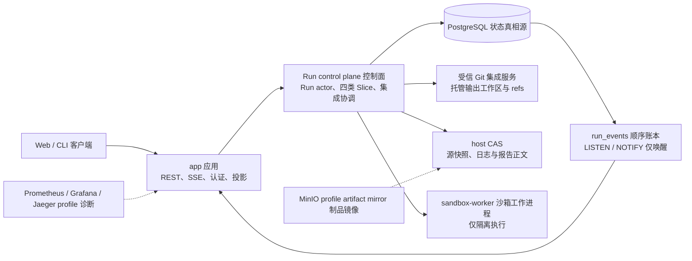
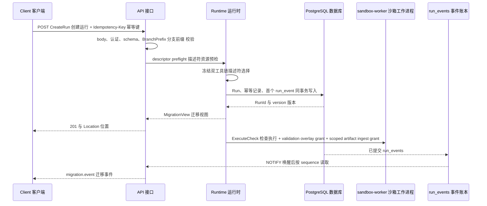

# CodeMigrator 系统后端与交付边界

> 文档状态：V4 当前架构基线；本篇拥有 REST/SSE 投影 DTO、`run_events` 事件集与控制面事务、幂等边界。  
> 技术范围：REST API 与外部安全面、SSE 事件投影与回放、幂等与控制面事务、PostgreSQL 单存储表结构适配、交付状态拆分。  
> 契约真相：Run 与交付状态、`CreateRun`、公共 ID 与限额以 [M-00：设计原则、并行系统地图与公共契约](CodeMigrator_垂类设计原则与架构哲学.md) 为准；Spec v3 语义与拒绝码以 [Migration Spec 抽象层](CodeMigrator_Migration_Spec抽象层.md) 为准；四类 Slice 与集成键以 [迁移计划生成器](CodeMigrator_迁移计划生成器.md) 为准；工具审计点位以 [工具系统与 Hook](CodeMigrator_工具系统与Hook.md) 为准；验证事件语义以 [验证引擎](CodeMigrator_验证引擎.md) 为准；本篇拥有 REST/SSE DTO 形状、`run_events` 事件集归属与投影事务语义。  
> 关联文档：[工程边界与目录架构](CodeMigrator_核心目录架构设计.md)、[Migration Spec 抽象层](CodeMigrator_Migration_Spec抽象层.md)、[Harness 总体设计](CodeMigrator_Harness总体设计.md)、[迁移计划生成器](CodeMigrator_迁移计划生成器.md)、[候选工作区与工具网关](CodeMigrator_候选工作区与工具网关.md)、[验证引擎](CodeMigrator_验证引擎.md)、[工具系统与 Hook](CodeMigrator_工具系统与Hook.md)、[工作空间与 Git 集成](CodeMigrator_工作空间与Git集成.md)、[可观测性系统](CodeMigrator_可观测性系统.md)、[Web 体验与迁移可视化工作台](CodeMigrator_Web体验与可视化工作台.md)、[会话与运行时修正编排](CodeMigrator_会话与运行时修正编排.md)。

后端不把 HTTP 请求直接变成一次迁移执行。它的任务是把外部的跨语言翻译意图——一份 Spec v3 与一个 CreateRun——变成可恢复的 Run 账本，把契约先行分层执行（依赖闭包就绪即启动）的运行事实投影成稳定 API，并把代码交付和报告交付与迁移结果分开。这样 sandbox worker、可选 artifact 镜像、观测 profile 或外部投递失败时，浏览器仍能从 PostgreSQL 获得没有歧义的状态。

CLI 是写操作和自动化的主客户端，也把本篇的已提交事实归约为精简过程流；Web 读取同一投影并提供更完整的工作台。两者均消费同一 `migration.event` v1 envelope 与 `(run_id, sequence)` 回放，不存在 CLI 私有事件或第二份客户端状态。浏览器只能提交会话 message、AskUser answer 与已经生成的 correction confirmation，不拥有 CreateRun、Cancel、交付重试或 Git 写权限；页面、视觉和各客户端展示归约由 [M-15](CodeMigrator_Web体验与可视化工作台.md) 拥有，输入编排由 [M-16](CodeMigrator_会话与运行时修正编排.md) 拥有，本篇只冻结它们消费的数据与事务语义。

本轮 V4 中修先声明三条不变骨架：SSE 投影机制（`migration.event` v1 信封、`next_event_sequence` 分配、`Last-Event-ID` 回放、NOTIFY 仅唤醒）不变；控制面事务边界（可观察投影与对应 `run_events` 在同一 PostgreSQL 事务提交、共同回滚）不变；API 幂等语义（`(principal_id, route, key)` 作用域、24 小时留存、canonical body 匹配规则）不变。调整集中在两处：外部 DTO 升级为跨语言语义（Spec v3、四类 Slice），`run_events` 事件集补充契约波、测试移植、归因与工具审计事件。

## 系统上下文：三项默认服务完成迁移闭环



`app` 是 `codemigrator-server` 的部署单元，内部组装 API、runtime、Run actors、内置工具链描述符资源账本、受信 Git 集成服务、host CAS、事件投影与事实驱动恢复；它拥有托管输出工作区、内部 Git refs 与大对象正文的访问权。`sandbox-worker` 只通过宿主 Unix domain socket 接收类型化检查执行请求（`ExecuteCheck`）：一次性 validation overlay grant、目标端描述符冻结的 `CheckCommandTemplate` 实例化，以及受限日志与 artifact 回传 grant；它不直接连接 PostgreSQL、Git、host CAS 或控制面网络，也不持有候选工作区或托管输出工作区。PostgreSQL 是 Run、Spec、四类 Slice、candidate generation、active dispatch、验证证据、integration intent/receipt、幂等记录、append-only `run_events` 和 artifact 引用的控制面真相源；Git 是代码与 commit 事实，host CAS 保存源快照内容、模型/工具日志、完整 stdout/stderr 与报告正文。可选 profile 只能提供镜像或诊断，关闭它们不能阻断默认迁移闭环。

| Compose 集合 | 服务 | 可用性语义 |
|---|---|---|
| 默认 | `app`、`sandbox-worker`、`postgres` | 三者任一未就绪时拒绝新 Run；已有状态仍从 PostgreSQL 读取 |
| `object-store` | MinIO | artifact 的二级镜像；不可用时 host CAS 继续作为正文源 |
| `observability` | Prometheus、Grafana、Jaeger | 诊断 profile；不可用时 JSON tracing 和迁移控制面继续运行 |

Linux kernel、cgroup v2、bubblewrap 与 user namespace 的启动预检由 sandbox 模块执行。控制面不会因为 profile 未启用而降低安全门槛；它只是不启动对应的可选 adapter。

## 从 CreateRun 到可观察的迁移

CreateRun 的 source 是判别联合：`RemoteRepository` 固定为 `repository_url + base_ref`，`RegisteredProject` 固定为 `project_id + snapshot_id`；二者都与 `branch_prefix` 一起提交，不存在 `target_branch` 或客户端输出路径——跨语言翻译的输出全部落在托管输出工作区，不写回源仓库。`branch_prefix` 是已验证的 ASCII 输入，长度为 1 至 32 字节，只含小写字母、数字、`-` 和 `/`，拒绝空段、`.`、`..` 和 `.git`；交付分支命名形状由 [M-11](CodeMigrator_工作空间与Git集成.md) 拥有，内部 ref 一律以 `run_id` 组织（M-00）。



描述符资源预检发生在 CreateRun 事务之前。Spec 锁定的双工具链描述符版本与资源摘要、源端 tree-sitter grammar 与目标端工具链镜像摘要未全部命中时，服务按 M-05 返回 `DESCRIPTOR_NOT_FOUND`、`DESCRIPTOR_DIGEST_MISMATCH` 或 `TOOLCHAIN_IMAGE_UNAVAILABLE`，响应不含 `run_id`，Run、`run_events` 和 Git 的新增记录均为零。CreateRun 请求同时携带已确认理解档案的 `dossier_ref`（内容 hash，浅档可缺席）：档案正文以 ArtifactRef 先行落 host CAS 并计入 Run 归属账本（M-12/M-16），hash 进入计划证据与 P-03 可复算口径。预检通过后，Run、幂等记录和首个 `run_events` 事件必须在同一 PostgreSQL 事务中提交；worker dispatch 属于事务后的可恢复效果，不影响创建响应的确定性。

| 外部资源 | 写入规则 | 幂等或并发边界 |
|---|---|---|
| `POST /api/v1/specs` | M-05 四道门（字节/Schema/描述符资源/检查集）通过后写入可引用 Spec v3 | 请求必须含 `Idempotency-Key`；Spec 最大 256 KiB |
| `POST /api/v1/migrations` | descriptor preflight 后原子写 Run、idempotency 与首个 `run_events` | key 的作用域是 `(principal_id, route, key)`；保存 24 小时 |
| `DELETE /api/v1/migrations/{run_id}` | API 只解析 `If-Match` 并把 `CancelCommand(expected_version)` 送入 Run actor；actor 持久化后应答 | actor 处理命令时匹配当前 version；冲突为 `STALE_VERSION` |
| `GET /api/v1/migrations/{run_id}` | 读取四类状态投影 | 不触发 worker、模型或 Git 副作用 |
| `GET /api/v1/migrations` | 读取分页 Run 摘要、过滤与游标 | 只读，不泄漏证据正文 |
| `GET /api/v1/migrations/{run_id}/workspace` | 读取四类 Slice DAG（kind、write scope）、generation、集成队列、验证摘要与 `latest_sequence` | 展示聚合，不产生新的运行真相 |
| `GET /api/v1/migrations/{run_id}/events` | 从 `run_events` 按 sequence 投影 SSE | `Last-Event-ID` 只决定回放起点 |
| `GET /api/v1/migrations/{run_id}/report` | 读取报告正文或报告生成进度 | 只读，不重启迁移 |
| `GET /api/v1/migrations/{run_id}/evidence/{receipt_id}` | 读取 receipt/check 所属、授权且脱敏的证据分页 | 不接受任意 ArtifactRef，不读取 host CAS 正文 |
| `GET /api/v1/descriptors` | 读取内置工具链描述符资源摘要（语言对、版本、命令面 action 与模板摘要） | 描述符随 app 分发；不安装、不删除、不修改 |
| `GET /api/v1/system/health` | 读取 app、worker、PostgreSQL 与可选 profile 的安全摘要 | 不暴露 DSN、凭据、socket 或宿主路径 |
| `POST /api/v1/projects/register` | CLI 注册只读项目并创建 snapshot | 浏览器不能提交任意宿主路径；源目录零写入 |
| `GET /api/v1/projects` | 读取已授权 project/snapshot 摘要 | 不枚举服务器目录 |
| `POST /api/v1/sessions` | 创建草稿或附着既有会话 | 不创建 Run，直到指定 draft 被确认 |
| `POST /api/v1/sessions/{session_id}/messages` | 持久化会话或运行中修正消息 | 不直接写 candidate、Git、worker 或数据库领域事实 |
| `POST /api/v1/sessions/{session_id}/answers` | 提交指定 QuestionId 的答案 | revision 不匹配拒绝，不伪造用户选择 |
| `POST /api/v1/sessions/{session_id}/confirm` | 确认指定 TaskDraftRevision | 只在 descriptor preflight 后创建 Run |
| `POST /api/v1/sessions/{session_id}/corrections/{correction_id}/confirm` | 确认指定 ImpactPreview hash | 不能确认未生成的结构修正 |
| `GET /api/v1/sessions/{session_id}/events` | 回放 `migration.session.event` | `assistant.delta` 不在持久事件中 |
| `GET /api/v1/migrations/{run_id}/changes` | 读取 ModuleChangeRecord 的安全投影 | 不返回源码、完整日志或任意 ArtifactRef 正文 |
| `GET /api/v1/migrations/{run_id}/output` | 读取托管输出、物化状态与 export 提示 | 不允许客户端指定输出目录 |
| `GET /api/v1/skills` | 读取锁定 Skill catalog 摘要 | 不安装、不执行、不暴露未锁定 Skill |

相同幂等键和相同 canonical body 返回第一次的响应；同一键但 body 不同返回 `409 IDEMPOTENCY_CONFLICT`。这条规则既防止浏览器重试重复创建 Run，也避免相同 key 被误用于另一个仓库。

## DTO 与表结构：跨语言语义的投影适配

外部 DTO 只投影已冻结事实，不发明第二套领域状态；内部类型一律引用 M-00 公共契约，本篇不复制定义。

**Spec DTO（Schema v3）**。上传与读取的 Spec 携带语言对声明、双工具链描述符锁、检查集与可选分解策略；命令正文只存在于描述符模板中，DTO 任何层级都不出现 `program`/`argv`/`prompt` 或 write scope 字段（M-05 unknown-field deny）。

```rust
/// Spec 外部投影：不展开描述符资源正文
pub struct SpecView {
    pub spec_id: SpecId,
    pub canonical_sha256: Sha256,
    pub source_language_id: LanguageId,
    pub target_language_id: LanguageId,       // 跨语言对：必须与源语言不同
    pub descriptor_lock: DescriptorLockView,
    pub required_checks: Vec<RequiredCheckView>,
    // decomposition 透传 M-05 规范化正文，本篇不另造形状
}

pub struct DescriptorLockView {
    pub descriptor_version: semver::Version,
    pub source_descriptor_sha256: Sha256,
    pub target_descriptor_sha256: Sha256,
    pub toolchain_image_digest: String,
}

pub struct RequiredCheckView {
    pub action: CheckAction,          // Scaffold/Compile/Test/Lint/TypeCheck
    pub template_sha256: Sha256,      // 命令正文唯一存在于目标端描述符模板
}
```

**Slice DTO**。每个 Slice 投影必携 `kind`；write scope 是输出路径集合，不是 V3 的源文件 locator 派生写集合。

```rust
/// Slice 外部投影：GET workspace 聚合成员
pub struct SliceView {
    pub slice_id: SliceId,
    pub kind: SliceKind,              // Contract | Implementation | TestTranslation | TestGeneration
    pub status: SliceAttemptStatus,
    pub generation: CandidateGeneration,
    pub write_scope: WriteScope,      // Out { write_paths, create_roots }
    pub topological_layer: u32,
    pub integration_rank: u32,        // 冻结集成序位次（M-07 集成键的投影）
}
```

**废除的 V3 DTO 与字段（零残留）**：

| V3 机制 | V4 处置 |
|---|---|
| edit intent 提案与批次 DTO | 废除：Agent 直写（P-01），文件操作经 M-12 六工具，checkpoint 由 Harness 提交 |
| `GuardedPatch` 与 precondition/replacement/anchor/content 字节哈希 | 废除：并发保护 = write scope 输出路径互斥 + Git expected-OID CAS |
| 插件字段（plugin id、能力协商、wire 方法引用、`BuildInvocation`） | 废除：由描述符锁与 `CheckCommandTemplate` 实例化替代 |
| `CAPABILITY_INCOMPATIBLE` | 废除：按失败事实细分为 `DESCRIPTOR_NOT_FOUND` / `DESCRIPTOR_DIGEST_MISMATCH` / `TOOLCHAIN_IMAGE_UNAVAILABLE` |
| 同语言迁移场景表述（React 16→19 等） | 替换：贯穿示例全部为跨语言翻译（TS→Python） |

**PostgreSQL 单存储表结构适配**。表结构随 DTO 调整，控制面单存储地位不变：

| 表 | V4 字段适配 | 废除的 V3 列 |
|---|---|---|
| `migration_specs` | v3 canonical JSON、`canonical_sha256`、`source_language_id`/`target_language_id`、`descriptor_lock`（版本 + 双资源 SHA-256 + 镜像摘要）、规范化 scope、canonical 检查集 `(action, template_sha256)`、分解策略 | manifest/规则映射/构建 action 声明列 |
| `runs` | `spec_id` 外键（语言对与描述符锁经关联投影）、`status`/`failure_reason`/`partial_completion_reason`、`version`、`next_event_sequence`、`cancel_requested` | 插件能力快照列 |
| `slices` | 增 `kind` 列（CONTRACT/IMPLEMENTATION/TEST_TRANSLATION/TEST_GENERATION）；`write_scope` 存规范化输出路径集合（`write_paths` + `create_roots` 双集合）；`topological_layer`、`deterministic_plan_order_key`、`source_modules` | 源文件 locator 派生写集合列 |
| `plan_edges` | `from_slice_id`/`to_slice_id`/`edge_kind`/`provenance` | — |
| `required_checks` | `check_id`/`action`/`template_sha256`——命令来源是描述符模板引用 | 插件命令与自由 argv 列 |
| `check_results` | `invocation_hash`（覆盖 canonical(模板 sha256 + program + argv + timeout_secs)）、`status`、`receipt_id`、stdout/stderr ArtifactRef、`diagnostics` | precondition/replacement/anchor/content 字节哈希列 |
| `run_events` | append-only；`(run_id, sequence)` 唯一约束；`type` 扩充 V4 事件集 | — |
| `artifacts` | `sha256`/`size`/`media_type` 引用账本（正文在 host CAS） | — |

## 四种投影不互相篡改

客户端必须同时看到 Run 状态、验证事实、报告交付和代码交付，但它们不是一个枚举的不同文字。Run 的 `REPORTING` 表示报告正文仍在生成；正文生成失败以 `FailureReason::ReportGenerationFailed` 把 Run 置为 `FAILED`。只有 Run 已终态后的发布、镜像或外部投递失败，才能改变报告交付状态；push 或 PR 失败只能改变代码交付状态。两通道共用统一状态枚举 `DeliveryChannelStatus`（`Generating` 仅报告通道使用），交付 ledger 仍分立为 `report_delivery_status` 与 `code_delivery_status` 两列投影、互不影响。

| 投影 | 事实来源 | 允许改变它的动作 | 禁止影响 |
|---|---|---|---|
| `run_status` | Run ledger | 单 Run actor 的串行命令归约；version 只服务外部投影与 `If-Match` | 报告投递、push、PR 重试 |
| `verification_outcome` | required checks 与诊断归约 | 验证 Oracle | 报告、push、PR |
| `report_delivery_status` | 报告交付 ledger | 终态后报告发布、镜像、外部投递及重试 | Run 状态、代码交付 |
| `code_delivery_status` | 代码交付 ledger | push、PR 和其重试 | Run 状态、报告交付 |

这一拆分也限定了前端行为：翻译完成而 PR 失败时，页面显示已验证的 Run 与独立的代码投递失败；不能把它渲染为"迁移失败"。报告正文生成失败时则相反，不能把它压缩成普通 DeliveryFailed，因为该正文从未形成可交付对象。

## SSE 是账本的实时视图

SSE 事件的唯一信封为 `schema`、`version`、`type`、`data`、`sequence`、`timestamp_utc` 六个字段（v1 真相源口径），其中 `schema` 固定为 `migration.event`，`version` 固定为整数 `1`；`sequence` 与 SSE 协议层 `id` 同值（sequence 十进制表示），使分页与回放依赖的 `(run_id, sequence)` 在信封体内自洽。事件集在 V4 扩充不改变信封版本：只有信封结构变化才引入 v2，新增 `type` 不构成版本变更。Run 行拥有 `next_event_sequence`：所有会改变可观察投影的事务先锁定该 Run 行，读取当前值作为新事件 sequence，写入投影与 `run_events` 后将计数递增；任一步失败时投影、事件和计数共同回滚。数据库再以 `(run_id, sequence)` 唯一约束拒绝重复，因此单 Run 的已提交事件从初始值连续且无缺口。

每个 SSE 连接保存内存游标 `last_sent_sequence`，初值来自已验证的 `Last-Event-ID`，未提供时位于该 Run 首个 sequence 之前。连接建立时先循环读取并发送所有 `sequence > last_sent_sequence` 的已提交记录，每成功发送一条才推进游标；收到 NOTIFY 后执行同样的补读循环。每 15 秒 heartbeat 到期时，也必须先补读并排空当前事件，再发送 heartbeat。`LISTEN/NOTIFY` 只负责提前唤醒，通知丢失或合并最多延迟到下一次 heartbeat 前的补读，不会丢失事件。SSE 的 `id` 是 sequence 的十进制表示；重连从客户端最后成功接收的 id 严格向后读取。

| 连接限制 | 行为 |
|---|---|
| heartbeat | 每 15 秒触发一次；发送前必须补读并排空 `last_sent_sequence` 之后的事件 |
| 单进程连接上限 | 可配常数（实施期默认 100）；超限请求返回 `429` |
| 单连接待发送队列 | 有界队列（容量可配常数，实施期默认 64）；队列满时直接关闭该连接，不设背压具名事件 |
| 回放顺序 | `run_id` 内 sequence 严格递增 |
| 终态 | 终态事件投影完成后关闭连接；后续连接仍可读取终态快照 |

SSE 的 `data` 与 REST 错误使用同一 redaction 出口。事件、Problem Details、日志和指标都不得包含 bearer credential、仓库凭据、源码正文、源 AST 查询结果、报告正文或宿主路径。

### run_events 事件集与归属

`type` 按 V4 全集投影。契约 Slice 生命周期即其 `slice.status_changed`（`kind=CONTRACT`）序列，测试翻译 Slice 的派发与完成即其 `slice.status_changed`（`kind=TEST_TRANSLATION`，`RUNNING → LOCALLY_VERIFIED → INTEGRATED/TERMINAL_FAILED`）序列；`test.failure_attributed` 与 `test.flaky_observed` 对应 M-10 定义的 `TEST_FAILURE_ATTRIBUTED` 与 `FLAKY_TEST_OBSERVED` 账本事件。

| 事件类 | `type` | data 关键字段（均已 redaction） | 生产者 | 主要消费方 |
|---|---|---|---|---|
| Run 状态 | `run.status_changed` | run_status、failure_reason | Run actor | CLI/Web 通用 |
| Slice 生命周期 | `slice.status_changed` | slice_id、kind、status、generation | Run actor | M-15 场分区、M-13 指标 |
| 契约层收敛（派生投影） | `execute.contract_wave_completed` | 已集成契约 Slice 摘要 | Integration Coordinator（集成 receipt 汇总派生，非调度事实） | M-15 等待区（观测展示）、M-13 |
| 候选代次 | `candidate.generation_started` / `candidate.generation_invalidated` | slice_id、generation、归因摘要 | Run actor | M-15 重生成位、M-13 |
| 派发 | `dispatch.started` / `dispatch.interrupted` / `dispatch.discarded` | attempt、subject 摘要、check_id | Run actor | M-13 指标 |
| 验证完成 | `verification.completed` | subject 层级、fingerprint、guard 摘要 | 验证引擎（M-10） | M-13、REPORT |
| 测试失败归因 | `test.failure_attributed` | owning slice、generation、归因层、诊断摘要 | 验证引擎（P-09/M-10） | M-15 重生成位、M-13 |
| flaky 观察 | `test.flaky_observed` | 测试身份、三次执行摘要 | 验证引擎（M-10） | REPORT 证据页、M-13 |
| 工具审计 | `tool.call.pre` / `tool.call.post` | 工具名、参数摘要哈希、终态/错误码、时长 | ToolGateway（M-12） | M-13、M-15 卡片动作 |
| checkpoint | `checkpoint.pre` | 子集校验结论、文件数与字节摘要 | Harness（生命周期归 M-08） | M-13 |
| 集成 | `integration.queued` / `integration.started` / `integration.completed` | slice_id、generation、OID 摘要 | Integration Coordinator | M-15 汇流口、M-13 |
| 主线推进 | `verified.advanced` | 新 verified OID 摘要 | Integration Coordinator | M-15 主线 |
| 报告与交付 | `report.completed` / `delivery.status_changed` | 交付通道、状态 | 交付 ledger | CLI/Web 通用 |

`execute.contract_wave_completed` 是集成账本的派生投影——"全部契约 Slice 已正式集成"这一事实由集成 receipt 汇总得出，不是新的波次状态，与 M-07"波次由 DAG 表达，不由状态机表达"一致；该事件仅承载观测语义，不作为任何 Slice 启动、派发或验收的时序依据——Slice 就绪唯一判据是其依赖闭包内全部契约 Slice 已集成（V-M00-V4-001）。工具审计事件与 M-12 的网关点位同事务投影：每次调用的工具名、参数摘要与结果状态进入事件流，正文与路径原文不进入。

未知类型仍按同一 envelope 与 sequence 回放；客户端可以记录兼容性诊断，但不得猜测新的领域状态。CLI 可压缩其人类过程行，Web 可保留完整时间线，但两者必须逐条消费 sequence、对缺口补读，且不能因为展示压缩而跳过事件或改变领域投影。

## 控制面在故障下保持诚实

后端不以进程内 actor 或缓存替代数据库事实。app 重启后从 `run_events` sequence 恢复事件投影并为非终态 Run 重建 actor；worker 失联时 runtime 立即把 active dispatch 标为 `INTERRUPTED`，不等待时间租约。启动恢复或已知 integration intent 缺口会触发 M-03 的 Recovery Coordinator 对照 PG facts 与 Git refs，而不是信任损坏 checkpoint；它不是常驻轮询任务。PostgreSQL 不可用时 readiness 返回 `503`，新的写请求以 `DEPENDENCY_UNAVAILABLE` 失败，系统不接受"先写内存后补库"。

| 场景 | 可观察结果 | 禁止结果 |
|---|---|---|
| NOTIFY 丢失 | SSE 下一次查询仍从 `run_events` 补齐 sequence | 把通知消息当事件正文 |
| MinIO profile 停止 | 继续从 host CAS 读取正文；镜像状态独立重试 | 把镜像失败写为迁移失败 |
| worker 失联 | API 返回 PG 最后状态；active attempt 立即中断并由 actor 决定重派 | API 以 worker 内存状态覆盖 ledger，或接受旧 attempt 结果 |
| 描述符资源不匹配 | 返回 `DESCRIPTOR_NOT_FOUND`/`DESCRIPTOR_DIGEST_MISMATCH`/`TOOLCHAIN_IMAGE_UNAVAILABLE`，没有 run_id | 先创建 `CREATED` 再异步拒绝 |
| 报告正文生成失败 | `REPORTING` 进入 `FAILED` | 写成报告交付失败 |
| push 或 PR 失败 | 仅 `code_delivery_status=DeliveryFailed` | 修改 Run 或报告投影 |

### 为什么不提供 filesystem 控制面 backend

JSONL 与 Git refs 足以支持单用户、前台运行且不要求断线回放的 CLI，这个对照说明 PostgreSQL 不是迁移算法本身的依赖。但当前产品是可重启 REST/SSE 后台服务：它同时需要 API 幂等、Run/Slice 查询投影、严格事件序列、取消版本检查、active dispatch 接管以及 integration intent/receipt 的原子事实。把这些事实写入普通文件会迫使项目自研跨进程文件锁、原子追加、尾部损坏截断、二级索引和事件 sequence 分配。

因此 PostgreSQL 是唯一控制面后端，filesystem/JSONL 不进入 feature flag、repository trait 实现或测试矩阵。Git 继续只保存代码与 ref 事实，host CAS 继续只保存大对象正文；二者不能代替查询与事件账本。

## 贯穿场景：一次可恢复的 TS→Python 翻译

主体先提交一份 1.8 KiB 的 Spec v3（typescript→python 语言对、双描述符锁、Compile/Lint/Test/TypeCheck 四个检查选择），再以 `branch_prefix=team/port-py` 创建 Run。API 在 1 MiB HTTP body 限额内完成认证、schema 与前缀校验；描述符资源预检命中 typescript-source 与 python-target 两份内置描述符及工具链镜像摘要后，PostgreSQL 原子写入 Run、幂等记录与首个 `run.status_changed` 事件。浏览器连上 SSE，收到统一信封的事件。

PLAN 冻结四个 Slice 后，事件流先呈现契约 Slice CT 的 `slice.status_changed`（`kind=CONTRACT`）；CT 集成时依次出现 `integration.started`、`verified.advanced` 与 `integration.completed`，随后恰一条 `execute.contract_wave_completed`。两个输出路径集合不相交的实现 Slice A、B 并行进入 `RUNNING`：Agent 的每次 `ReadFile`/`WriteFile`/`Shell` 调用都产生成对的 `tool.call.pre` 与 `tool.call.post`，自检完成后 Harness 提交 checkpoint 前先落一条 `checkpoint.pre`；源码与日志正文只以 ArtifactRef 出现，事件中只有参数摘要哈希。B 集成时类型检查诊断落在 B 的 write scope 内，归因 B 后事件流出现 `candidate.generation_started`（generation 1）。测试翻译 Slice T 的 Requires 为覆盖模块的契约 Slice CT，在 CT 集成后即与 A、B 并行派发（`kind=TEST_TRANSLATION`）。

全部 Slice 终态后最终验证在冻结 verified head 上执行翻译后全套测试：`test_order` 失败归因 owning Slice A，事件流恰一条 `test.failure_attributed`；`test_format` 三次执行两过一败判为 FLAKY，恰一条 `test.flaky_observed`，语义取多数态、零重生成。Run 通过 `REPORTING` 进入 `COMPLETED`。随后报告镜像上传失败，`report_delivery_status` 变为 `DeliveryFailed`，但 `verification_outcome` 与 Run 终态保持已验证完成；之后 PR 创建失败，只有 `code_delivery_status` 变为 `DeliveryFailed`。两个重试入口分别推进各自 ledger，既不会重新运行翻译，也不会改写另一个交付结果。

worker 短暂重启时，页面继续从 PostgreSQL 获得 `dispatch.interrupted` 与新 attempt 事件，而没有出现假的完成。用户若在 `REPORTING` 前发起取消，API 只把 `If-Match` 解析为 expected version 并投递命令；Run actor 处理时发现 expected version 等于当前值，才在同一事务持久化 `cancel_requested`、新 version 与连续 sequence 事件，然后 API 确认。已验证 Slice 仍在终态投影中可见，但取消终态恒为 `CANCELLED`，不写成 `PARTIALLY_COMPLETED`。

## 外部安全面与容量门

部署边界为单机回环：API 仅绑定 loopback 接口，认证为单一静态令牌（部署配置注入，无反向代理签发凭证），`principal_id` 为固定常量——不存在多主体授权面。令牌缺失或不匹配返回 `401`；资源不存在仍统一 `404` 遮蔽。`repository_url` 只接受 HTTPS，拒绝 userinfo、IP literal 与跨 host 重定向。API 在解析前限制 HTTP body 为 1 MiB；创建 Spec 后再按 UTF-8 字节限制 256 KiB。

| 保护面 | 规则 | 失败响应 |
|---|---|---|
| 请求 body | 解析前不超过 1 MiB | `413` |
| Spec | UTF-8 正文不超过 256 KiB | `422` |
| CreateRun | source 判别联合加 `branch_prefix`；unknown、缺失或两个 source 同时出现均拒绝 | `422` |
| 认证与访问 | 单一静态令牌（loopback 绑定）；缺失/不匹配为 `401`；单主体部署下资源遮蔽仍统一 `404` | RFC 9457 Problem Details |
| 并发更新 | cancel 的 `If-Match` 仅成为 `CancelCommand.expected_version`，由 actor 对当前 version 比较 | `409 STALE_VERSION` |
| 错误输出 | `application/problem+json`，扩展字段仅为 request_id、run_id、retryable | 不泄露内部实现或秘密 |

HTTPS-only 与 body 上限为安全必需保留；若未来开放多主体或非回环部署，必须重新评审认证、授权与幂等键作用域，不得沿用单机回环假设。

本篇的指标只描述控制面观测需求；核心八项 descriptor、低基数标签和 registry 由 [可观测性系统](CodeMigrator_可观测性系统.md) 单独拥有。API 需要报告 HTTP 请求与 SSE 连接数（队列满即断连，无背压具名事件；连接类健康信号交部署侧默认监控），但不在此复制指标定义。

## 可验收的结果

- [ ] V-M02-V4-001：Spec 上传 DTO 为 v3——缺语言对、缺 `descriptor_lock`，或任何层级出现 `program`/`argv`/`prompt`/write scope 字段时按 M-05 拒绝码拒绝，Spec 新增行数为 0；成功投影只含 spec_id、canonical hash、语言对、锁定摘要与检查集引用，不展开描述符正文。
- [ ] V-M02-V4-002：描述符资源预检失败返回 `DESCRIPTOR_NOT_FOUND`/`DESCRIPTOR_DIGEST_MISMATCH`/`TOOLCHAIN_IMAGE_UNAVAILABLE` 之一，响应无 `run_id`，Run、`run_events`、Slice、dispatch 与 Git ref 新增均为 0。
- [ ] V-M02-V4-003：`slices` 投影与 `GET workspace` 聚合为每个 Slice 携带 `kind`（CONTRACT/IMPLEMENTATION/TEST_TRANSLATION/TEST_GENERATION）与输出路径集合 write scope；不存在 V3 源文件 locator 派生写集合字段。
- [ ] V-M02-V4-004：check 命令来源投影为 `(action, template_sha256)` 与 `invocation_hash` 的描述符模板实例化记录；`check_results` 及其投影不存在插件命令、自由 argv 或 `BuildInvocation` 字段。
- [ ] V-M02-V4-005：可观察投影与对应 `run_events` 同事务——注入事务失败时投影、事件与 `next_event_sequence` 共同回滚；单 Run 已提交事件 sequence 连续、无缺口、无重复。
- [ ] V-M02-V4-006：SSE 断线重连后按 `Last-Event-ID` 严格向后补读；杀死 NOTIFY 后事件仍在下一次 heartbeat 补读中送达，零丢失。
- [ ] V-M02-V4-007：全部契约 Slice 正式集成后恰一条 `execute.contract_wave_completed`（派生投影事件，仅观测语义）；实现/测试翻译/测试生成 Slice 进入 `RUNNING` 的必要条件是其依赖闭包内全部契约 Slice 已集成——不存在"全仓库契约清空才可启动"的全局屏障时序约束（对齐 V-M00-V4-001）。
- [ ] V-M02-V4-008：每次工具调用在事件流中恰有一条 `tool.call.pre` 与一条 `tool.call.post`，每次 checkpoint 提交恰有一条 `checkpoint.pre`；这些事件只含工具名、参数摘要哈希与结果状态，不含路径原文、正文与 stdout/stderr。
- [ ] V-M02-V4-009：每次 P-09 归因唯一命中恰有一条 `test.failure_attributed`（data 含 owning slice、generation 与归因层）；每次 flaky 判定恰有一条 `test.flaky_observed` 且重生成数为 0——两者与 M-10 验证账本一一对应。
- [ ] V-M02-V4-010：相同幂等键与相同 canonical body 返回第一次响应；同一键不同 body 返回 `409 IDEMPOTENCY_CONFLICT`；键作用域 `(principal_id, route, key)` 与 24 小时留存保持 V3 行为。
- [ ] V-M02-V4-011：PR/push 失败只改 `code_delivery_status`，报告镜像失败只改 `report_delivery_status`；两者对 `run_status` 与 `verification_outcome` 的写数均为 0。
- [ ] V-M02-V4-012：全文档与路由表扫描零残留——不存在 `/api/v1/plugins`、`CAPABILITY_INCOMPATIBLE`、`BuildInvocation`、edit intent、`GuardedPatch`、precondition/replacement/anchor/content 哈希或同语言迁移场景表述。

---

> 设计演进、历史缺陷处置和变更理由见：[文档迭代记录](文档迭代记录.md)。
