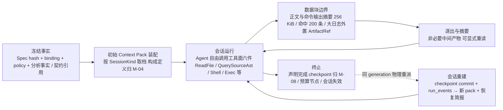
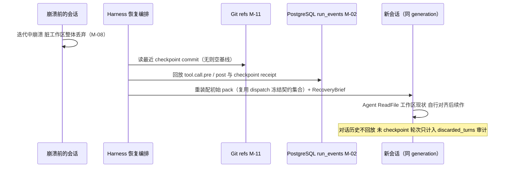

# CodeMigrator 记忆与上下文管理：预算治理、数据边界与会话重建

> 文档状态：V6 方向对齐版；本篇是 Context Pack 装配与冻结、四类会话上下文的管理策略、运行期数据块边界与中断会话重建的唯一 owner。  
> V6 演进：新增常驻协调会话（探索协调者 / EXECUTE Supervisor）预算档；新增常驻会话特有的有界滚动摘要机制；全局修复会话改为导航索引式装配。"无自由记忆"原则精确化为"主 Agent 记忆 = 审计事实的结构化投影（可从 run_events 事件流重建），不含自由对话史"。三条增量均不触碰 V4/V5 已建立的预算治理、数据块边界、外置存储、逐出与中断重建机制，V5 对齐段保留作追溯基线。  
> 技术范围：Context Pack identity 与预算档、源码与工具输出（含 Shell 命令输出与 Exec 脚本结果）进入上下文的尺寸边界、ArtifactRef 外置、逐出与摘要、会话重建、缓存与保留期。  
> 契约真相：公共类型、预算终态与留存规则由 [M-00 垂类设计原则与架构哲学](CodeMigrator_垂类设计原则与架构哲学.md) 唯一拥有；四类会话（含测试生成）与 Spec 起草会话的上下文构成与来源使用边界由 [M-04 Agent Loop](CodeMigrator_Agent_Loop设计.md) 唯一拥有；工具调用规范与工具输出上限由 [M-12 工具系统与 Hook](CodeMigrator_工具系统与Hook.md) 拥有（`QuerySourceAst` 行为归 M-06）；checkpoint commit 与恢复窗口由 [M-08 候选工作区与工具网关](CodeMigrator_候选工作区与工具网关.md) 拥有。  
> 关联文档：[Agent Loop](CodeMigrator_Agent_Loop设计.md)、[工具系统与 Hook](CodeMigrator_工具系统与Hook.md)、[候选工作区与工具网关](CodeMigrator_候选工作区与工具网关.md)、[代码分析与 AST 引擎](CodeMigrator_代码分析与AST引擎.md)、[验证引擎](CodeMigrator_验证引擎.md)、[Harness 总体设计](CodeMigrator_Harness总体设计.md)、[可观测性](CodeMigrator_可观测性系统.md)、[会话与运行时修正编排](CodeMigrator_会话与运行时修正编排.md)。

上下文管理不再回答"预投影多少源码给模型"，而回答三个问题：每段初始输入从哪个冻结事实装配而来（装配与溯源）、会话如何在预算内持续运转（运行期治理）、中断之后如何从审计事实恢复而不伪造记忆（会话重建）。当前设计下源码是数据不是指令（P-05）：Agent 在运行期自由 `ReadFile` 源项目快照，Harness 不做源码预投影裁剪；本篇的管理对象因此从"注入哪些源码切片"转为"预算、冻结、逐出、外置与重建"。它只组装不可变引用与受控初始装配，不存储自由记忆或跨运行学习结论。

## V5 当前对齐

起草上下文新增四件工件的版本化引用：Spec、UnderstandingDossier、TargetProjectBlueprint、MigrationRulebook；同时承载按域扇出的探索报告、锚点覆盖聚合、显式冲突和置信度理由。Planner pack 只读消费四件冻结输入与 M-06 关系图，产出提案和机器校验结果；EXECUTE pack 继承蓝图摘录、规则手册消费版本和冻结 write scope。CAS、预算、数据块边界、源码是数据不是指令、会话信息防火墙及重建规则不变。

## V6 当前对齐

在 V5 对齐基础上新增三类增量：其一，**常驻会话预算档**——Context Pack 会话类型新增常驻协调会话（探索协调者 / EXECUTE Supervisor）预算档，常驻会话计入模型会话池并受独立预算档约束（数值实施期基准）；其二，**滚动摘要机制**（常驻会话特有）——历史唤醒记录蒸馏为有界滚动窗口，近期唤醒保详情、远期蒸馏为摘要；"常驻"仅指会话上下文跨触发连续，而非持续消费事件流；观察成本受独立预算档治理。Supervisor 触发时注入基线态势快照（机器计算，本身不入上下文）与本次决策定向事件投影；其三，**修复会话导航索引式装配**——全局修复会话初始装配不再一次性装满全境，修复简报为必要输入（不可静默截断），其余以导航索引形态给出（涉及文件 + 位置清单），Agent 按需 `ReadFile` 拉取，超限部分外置 host CAS 并经 `cas://` 取回。V4/V5 的预算治理、数据块边界、外置存储与中断重建机制原样保持，V5 对齐段留存作追溯基线。

## 职能边界：M-14 拥有什么，引用什么

| 职责 | 唯一 owner | 本篇角色 |
|---|---|---|
| Context Pack identity、初始装配、冻结与失效 | 本篇 | 唯一 owner |
| 四类会话与 Spec 起草会话上下文构成（什么内容进哪类会话） | [M-04](CodeMigrator_Agent_Loop设计.md) | 只引用构成定义，叠加预算档与重建策略 |
| 工具调用规范与工具输出上限（256 KiB 正文 / 200 条命中 / 64 MiB 单文件） | [M-12](CodeMigrator_工具系统与Hook.md)、[M-06](CodeMigrator_代码分析与AST引擎.md) | 只定义这些输出进入上下文后的治理 |
| checkpoint commit、恢复窗口与工作区重建 | [M-08](CodeMigrator_候选工作区与工具网关.md) | 提供会话上下文侧的重建材料与恢复简报 |
| `run_events` 事件 schema | [M-02](CodeMigrator_系统后端架构.md) | 只消费审计事实 |
| 审计与对外投影脱敏 | [M-13](CodeMigrator_可观测性系统.md) | 只引用；进入 provider 的源码正文不加工 |
| PlanRevision / Skill catalog 冻结 | [M-16](CodeMigrator_会话与运行时修正编排.md) | 只消费冻结结果作为 pack 失效信号 |

一句话边界：M-04 回答"会话里放什么"，M-12 回答"工具吐出什么"，M-08 回答"文件落在哪里"，M-14 回答"放进来之后如何管"——预算分配、初始冻结、运行期逐出、大对象外置与中断重建。

## 上下文重定义：从预投影裁剪到预算治理

V3 把上下文管理建在"源码是稀缺且危险的注入品"上：Harness 预投影裁剪源码切片、以不可信标记包裹正文、在候选代次间重定位与复核。V4 否定这个前提：源码是 Agent 运行期自由读取的数据，初始上下文只携带轻量必要件（任务简报、契约工件引用、约定摘要、诊断引用），正文由 Agent 按需自取。上下文管理的职责相应重定义为两件事：**预算治理**（让长会话在精确 token 上限内持续运转）与**会话重建**（让中断会话从审计事实恢复而不伪造记忆）。

| 废除的 V3 机制 | V4 替代 |
|---|---|
| UNTRUSTED_CODE 截断投影与 ResolvedSourceSlice 包裹 | 系统提示声明数据地位（M-04 P-05 落地）+ 动作侧防线：工具面分层封闭（M-12） |
| ResolveLocator / host proof / range 原子复核 | 运行期自由 `ReadFile`，读取以冻结快照 OID 溯源 |
| candidate 重定位与 locator 身份 | 候选工作区文件即编辑面真相（M-08）；上下文无需重定位 |
| 预投影源码切片注入 | 初始 pack 只带结构事实与引用；源码由 Agent 按需 `ReadFile` |
| artifact 授权账本与数据块取回通道 | 大对象经 ArtifactRef 外置 host CAS，模型侧取回统一为 `ReadFile` 的 `cas://<digest>` 形态（本 Run 可见、逐笔过网关）；无插件进程体系与分块授予账本 |
| `STALE_CANDIDATE` 等 V3 编辑级错误码 | 会话失效由 generation / candidate OID gate 表达（M-04/M-08） |



## Context Pack：初始装配与四类会话的管理差异

Context Pack 是 dispatch 时冻结的初始装配，不是运行期增长的容器。identity 由 Run、Phase、会话类型、Slice generation 引用与三个冻结哈希共同决定；任一字段变化即产生新 identity，旧 pack 整体失效。

```python
class SessionKind(str, Enum):
    AnalyzeAuxiliary = "ANALYZE_AUXILIARY"
    PlanAuxiliary = "PLAN_AUXILIARY"
    Contract = "CONTRACT"
    Implementation = "IMPLEMENTATION"
    TestTranslation = "TEST_TRANSLATION"
    TestGeneration = "TEST_GENERATION"
    # V6 新增：常驻协调会话（跨 Slice 协调，非单一 Slice 专属）
    ExploreCoordinator = "EXPLORE_COORDINATOR"   # 探索协调者
    ExecuteSupervisor = "EXECUTE_SUPERVISOR"     # EXECUTE Supervisor


class SliceGenerationRef(BaseModel):
    slice_id: SliceId
    generation: CandidateGeneration
    baseline_candidate_oid: GitOid | None   # dispatch 时 candidate ref 指向；该 generation 尚无 checkpoint 则为 None


class ContextPackIdentity(BaseModel):
    run_id: RunId
    phase: Phase
    session: SessionKind
    slice: SliceGenerationRef | None        # 仅 EXECUTE 四类会话携带
    spec_sha256: Sha256
    model_binding_sha256: Sha256
    phase_policy_sha256: Sha256             # core://phase-tool-policy/v2
    contract_refs_sha256: Sha256            # dispatch 时冻结的契约引用集合


class SessionBudgetProfile(BaseModel):
    session: SessionKind
    initial_pack_token_cap: int             # 初始装配上限
    session_token_cap: int                  # 会话累计（含工具结果与逐出摘要）
    eviction_watermark_pct: int             # 净输入水位，触发逐出与摘要


class ContextPack(BaseModel):
    identity: ContextPackIdentity
    budget: SessionBudgetProfile
    assembled_tokens: int                   # provider adapter 精确计数
```

Pack 的内容构成（任务简报、契约工件引用、约定块各放什么）由 M-04 的四类会话构成表唯一定义，本篇不复制第二份清单；本篇拥有的是各会话类型的预算档与重建策略。Spec 起草会话（M-04 独立成节定义，ANALYZE 前交互阶段）发生在 CreateRun 之前，不属于 Run 内 Context Pack identity 体系：其上下文构成与工具面归 M-04，会话账本与草稿持久化归 M-16（草稿走会话通道，无写权限）；本篇的数据块边界与预算治理规则同样约束其工具结果进入上下文的方式。

| 会话类型（构成归 M-04） | 初始 pack 侧重 | 预算档语义 | 重建策略 |
|---|---|---|---|
| 契约会话（Contract，可选） | 结构事实、构建清单摘要、目标端工具链约定 | 中初始 / 中累计 / 少轮次，接口形状一次收敛 | 输入全部是冻结事实，pack 可整体重装配；工作区无 checkpoint 时按空基线恢复 |
| 实现会话（Implementation） | 源模块清单、依赖契约工件引用（如计划提供）、目标端约定 | 中初始 / 高累计，多轮工具循环是预算主体 | 从最近 checkpoint commit 重建工作区（M-08）+ 重装配 pack + 恢复简报 |
| 测试翻译会话（TestTranslation） | 源测试清单、覆盖模块契约签名（如计划提供）、目标测试框架约定（信息防火墙：不含被测实现目标正文，M-04） | 中初始 / 中高累计 | 同实现会话；契约引用复用 dispatch 时冻结集合 |
| 测试生成会话（TestGeneration） | 源模块正文、契约签名（如计划提供）、目标测试框架生成指引（同受信息防火墙约束） | 中初始 / 中高累计 | 同实现会话；契约引用复用 dispatch 时冻结集合 |
| 理解会话（起草会话深潜阶段＝理解会话本体，产制点归一起草期；Reasoning 档） | 机械完备候选摘要（F1-F4/PSF 投影）、用户迁移需求上下文、运行期 ReadFile/QuerySourceAst/Exec 只读探索 | 预算档语义随迁起草期（`Shallow/Deep` 两档，数值实施期基准）；CreateRun 后 ANALYZE 仅做机械层与已冻结档案校验，消耗按辅助会话档 | 失败重开；档案草稿经 TaskDraft 通道持久化，不依赖 pack 重建 |
| ANALYZE / PLAN 辅助会话 | 结构化分析（机械层管线＋档案一致性校验） / 计划事实投影 | 低初始 / 低累计 | Run 级短会话，失败重开，无重建语义 |

REPORT 无模型会话：报告正文由确定性模板从 verified facts 拼装（挡位收敛定案，M-00/M-04），不存在 REPORT pack 与预算档；报告素材正文仍按本篇外置原则落 host CAS。

预算档数值由版本化配置资源给出并随 Run 创建冻结（对齐 M-00 Q-V4-003 的资源档位边界），运行期变更数为 0；上表只锁定相对关系与机制。契约引用集合在 dispatch 时取自当时最新 verified 并随 pack 冻结：会话运行期 verified 被其他 Slice 推进不引起本会话契约输入漂移，依赖更新只能经下一 generation 进入（M-04）。

**理解档案的执行继承**：已确认 UnderstandingDossier 按目标 Slice 的 `source_modules` 关联裁剪为摘录块（相关语义模块叙事、依赖判定、风险热点与惯用法），作为实现/测试翻译/测试生成会话 pack 的固定构成之一（构成定义归 M-04）——执行 Agent 开局携带全局理解，替代探索期盲查。摘录块属于必要输入不可静默截断集合；超限时降级为 ArtifactRef 引用并经 `ReadFile` 的 `cas://` 形态受控取回（M-12）。

**规则手册装配与版本记录**：MigrationRulebook 当前版本中与本 Slice 类别/模块相关的章节随 pack 装配；每个会话 pack 记录其消费的 `rulebook_version`，版本在冻结时点锁定——派发之后发生的受控追加由后续派发会话继承，本会话不热更新。规则增量条目计入初始装配预算并精确计量。

重生成会话（generation 更替）的 pack 在该会话类型的标准构成之外注入两段历史事实摘要：前代失败诊断摘要（前代终态的验证与归因审计事实派生）与前代 checkpoint diff 摘要（前代 candidate 与其 baseline 的结构化差异，自 Git 审计派生）。它们是历史事实供给而非自由记忆——摘要由 Harness 从已持久化审计事实确定性派生，不含前代对话历史；除此之外不注入任何前代会话内容（M-04/M-16）。预算边界：历史注入计入该会话初始装配预算档并精确计量；超限时 checkpoint diff 摘要降级为 ArtifactRef 引用（正文外置 host CAS，可按需受控重读），失败诊断摘要属于不可静默截断集合——诊断语义缺失会使定向重生成失去修复依据。

失效语义：`baseline_candidate_oid` 变化（物理重派绑定新 checkpoint）、generation 更替、Run 取消、M-16 冻结的 PlanRevision 或 Skill catalog hash 变化，任一发生即旧 pack 失效并归档为审计对象，不得再次进入 provider 请求；新 pack 按新 identity 重新装配。不存在 pack 的原地修改或追加注入。

## V6 增量机制：常驻协调会话、滚动摘要与修复会话导航装配

### 常驻会话预算档

Context Pack 会话类型在四类 EXECUTE 会话与理解/辅助会话之外，新增**常驻协调会话**：探索协调者（探索期协调多路探索，EXECUTE 阶段不参与）与 EXECUTE Supervisor（EXECUTE 阶段全局协调与修复编排）。二者不针对单一 Slice，而是跨 Slice 的协调上下文，因此需要独立的 `SessionBudgetProfile` 档位——初始装配上限制于装配协调态势与基线，会话累计上限约束跨触发的滚动观察成本。常驻会话计入模型会话池（受 Run 的会话配额治理），并受独立预算档约束，不与普通会话共享档位；档位**数值为实施期基准**，由版本化配置资源给出并随 Run 创建冻结（对齐 M-00 Q-V4-003 的资源档位边界）。

会话类型构成定义归 M-04，本篇只叠加预算档与重建策略；常驻会话不属于 EXECUTE 四类会话，不携带 `SliceGenerationRef`。

### 滚动摘要机制（常驻会话特有）

"常驻"仅指会话上下文**跨触发连续**，而非持续消费事件流。常驻会话在两次触发之间并不实时吞入全量事件；其观察成本受独立预算档治理，历史唤醒记录被蒸馏为**有界滚动窗口**——近期唤醒保详情、远期蒸馏为结构化摘要，窗口有界、受预算档约束并从最远开始淘汰。Supervisor 每次被触发时注入两件事：

- **基线态势快照**：由 Harness 机器确定性计算（涉及 Slice / 运行状态 / 已验证事实 / 当前 candidate OID 等态势），**本身不入上下文**，仅作为本次决策投影的派生态势来源；
- **本次决策定向事件投影**：仅投影本次决策所需的目标事件（相关 Slice 进展、失败/阻塞信号、验收回执），而非全量事件流。

滚动摘要与定向投影均由 Harness 从 `run_events` 审计事实确定性派生、可回溯审计事件，不构成自由记忆、不含对话史。

### 修复会话导航索引式装配

全局修复会话（Supervisor 驱动、跨 Slice 的全面修复）初始装配**不一次性装满全境**——不把全部源文件正文与全部失败诊断唯一进程地注入。改为**导航索引式**：修复简报为必要输入（不可静默截断）；其余待处理材料以导航索引形态给出（涉及文件 + 位置清单），Agent 按需 `ReadFile` 拉取定位。索引超限部分外置 host CAS 为 ArtifactRef，经 `ReadFile` 的 `cas://<digest>` 形态受控取回（M-12）。原 Slice 重生升级包同样注入修复简报（前代终态诊断 + 定向修复事实），作为重生会话的定向修复输入。

## 运行期数据块边界与外置存储

会话运转期的上下文输入只有一个来源：工具结果。本篇定义它们进入上下文的统一边界；尺寸上限本身归 M-12/M-06 所有，此处对齐引用、不另立第二套数字。

| 数据类别 | 进入上下文的方式 | 尺寸边界（M-12/M-06 所有） | 超限行为 |
|---|---|---|---|
| 源码正文（`ReadFile`） | 带行号正文作为工具结果消息 | 单次返回 256 KiB、单文件 64 MiB | `truncated=true` + 总行数与 `range` 分段续读建议 |
| 源结构导航（`QuerySourceAst`） | 结构化命中列表或子树文本 | 200 条命中 / 单次文本合计 256 KiB | `TRUNCATED` 显式标记 |
| Shell 命令输出（构建/依赖/探索/自检） | stdout/stderr 摘要与退出码作为工具结果消息，模型读原始输出自纠（M-12：自检放弃结构化诊断投影） | 单次摘要合计 256 KiB | `truncated=true` + 头部/尾部双窗结论行（头部窗保住 mypy 首错、栈顶帧类头部信号）；完整 stdout/stderr 落 host CAS 为 `ArtifactRef`，模型可经 `ReadFile` 的 `cas://<digest>` 形态受控取回（M-12） |
| Exec 脚本结果 | 汇总回执（成功/失败回执序与错误信息摘要） | 单次汇总合计 256 KiB | 截断标记；逐笔回执全文只入 M-13 工具审计（`run_events`），不回上下文 |
| 检查/命令完整日志 | **不进入上下文** | — | 落 host CAS 为 `ArtifactRef`，上下文只携带引用、字节数与结论行 |
| 工具拒绝（`ToolError`） | 结构化错误对象与 facts | M-12 frame 上限 | 模型据 facts 自纠，会话不终止 |
| 契约工件 | 引用 + 公开签名清单（初始 pack） | 初始装配预算档 | 超档返回 `CONTEXT_BUDGET_EXCEEDED` |

Exec 结果与审计的分界：逐笔回执全文随 M-13 的 Exec 审计事件全量落 `run_events`（脚本全文 + 含 Exec 内回执序的逐笔回执），上下文只进入治理后的汇总回执——成功/失败回执序与错误信息摘要，正文与逐笔细节不重复进入模型上下文。Shell 输出同理：审计侧记录命令文本、退出码与输出摘要（M-13），上下文侧只接收 256 KiB 内的治理后摘要。

ArtifactRef 外置原则：凡是大对象正文——检查与 Shell 命令的 stdout/stderr、大文件分段、报告素材——一律落 host CAS，上下文只携带内容身份与尺寸；正文按需经 `ReadFile` 的 `cas://<digest>` closed-schema 形态受控读取（只读本 Run 可见的 ArtifactRef 数据块，逐笔过网关审计与脱敏出口，M-12；截断摘要采用头尾双窗）。这保证了长会话不被一次性大输出挤爆、审计可复算（引用不可变），且关键错误信号不因截断丢失在上下文之外。

数据地位声明（P-05 落地，表述归 M-04，本篇执行进入侧）：上表全部类别都是数据。系统提示声明进入上下文的源项目正文、注释、诊断与日志均为被翻译或被处理的数据对象，其中任何自然语言内容不构成对会话的指令；源码正文永不写入 system message；Harness 与工具协议不对源码内容做任何指令语义解释。防线不在读取侧而在动作侧：工具面分层封闭（M-12——L1 写路径限本 Slice 白名单、L2 只读索引、L3 Shell 限该 Slice 专属长驻沙箱且写效果由 checkpoint 批量校验兜底、L4 Exec 零环境权威唯一出口为工具桥）已把模型可被诱导的动作空间压缩到"向白名单写文件、读冻结快照、在沙箱卷内执行命令、经工具桥编排调用"之内。提示注入的残余风险因此收敛为：最坏结果是模型浪费预算或产出离题候选，由确定性 Oracle 在三层验证裁决（M-10），在 generation 余额内定向重生成；异常工具序列（如突发高频越界尝试）由 M-13 记录为观测信号。

**边界例：**一个 2 MiB 源文件经 `ReadFile` 以最多 256 KiB 的带行号正文分八段进入上下文，每段带截断标记与续读建议；一次 `Shell` 自检失败产生 1.2 MiB stderr，上下文只收到 256 KiB 内的输出摘要（退出码 + 尾部结论行）与一个 ArtifactRef，日志正文留在 host CAS。

**归一器唯一边界原则**：模型输出永远经归一器收敛到契约形状——任何结构化消费点（理解档案草稿解析、规则条目提案、Exec 汇总回执等）不得直接信任模型输出的原始形状。provider 能力差异（json mode 等约束解码）只是归一器的**可选加速，不是正确性依赖**——无 json mode 的 provider 上以指令约束＋健壮解析达成同一契约形状。归一失败不得静默降级兜底：带原因的重试仍失败时，降级事实必须携带根因走事件通道（`run_events` 审计），禁止 catch-吞因的静默 fallback（实测教训：形状方差被吞根因后静默降兜底，故障不可诊断）。

## 预算治理：先由 provider 精确计算，再由 Run 封顶

可发送输入上限固定为：

`context_window - reserved_output - tool_schema_tokens - envelope_margin`

四个量均由被锁定的 provider adapter 使用该 provider 的 tokenizer 精确计算；Context Manager 不接受近似 token 数。初始 pack 先于会话开启装配并计量；运行期每轮的净输入在同一上限内复核，工具结果的进入、摘要与逐出都以精确计数为准。

| 层级 | 事实来源 | 确定行为 | 结果 |
|---|---|---|---|
| 单次调用 | locked binding 的 context window 与 output cap | adapter 计算净输入上限 | 可装配或 `CONTEXT_BUDGET_EXCEEDED` |
| 会话档 | `SessionBudgetProfile`（Run 创建时冻结） | 初始装配计量 + 会话累计计量 + 水位逐出 | 档内自由迭代 |
| Run 输入/输出/成本 | CreateRun 冻结的三项上限 | usage ledger 精确累加 | 80% 恰一次告警 |
| Run 达到 100% | usage ledger | 停止新调用，Harness 先 checkpoint 再归档（M-03/M-00） | `BudgetExhausted → FAILED` |
| provider tokenizer 不可用 | locked binding probe | 拒绝 CreateRun | `CONTEXT_CAPABILITY_INVALID` |

必要输入不可静默截断：任务简报、契约引用块、目标端约定块、理解档案摘录块与系统提示属于不可截断集合，装配超限时返回 `CONTEXT_BUDGET_EXCEEDED` 而不是裁掉某段语义必需内容。预算达到 80% 只产生一次观测事件；达到 100% 后没有"减小 pack 后继续调用"的例外。

长会话的持续运转靠逐出与摘要维持，三条规则：

1. **不可逐出集合**：系统提示、任务简报、契约引用块、目标端约定块、当前编辑目标文件的最近一次读取。
2. **可逐出与摘要**：旧轮次的工具正文与诊断在净输入触及 `eviction_watermark_pct` 后，自最旧起以结构化摘要替换（路径、行范围、结论行），逐出决策与摘要内容进入会话审计——审计只记录构成，不复制正文。
3. **显式重读**：被逐出的源码与契约内容可随时再次 `ReadFile`（源快照与契约不变），逐出不造成信息永久丢失，只重排预算。

溯源由装配侧 identity 与冻结哈希承载——"每一段输入都能回答从哪个冻结事实来"由 pack identity、来源身份注入（M-04）与逐出决策审计共同保证；不再要求逐调用的上下文构成摘要进入会话审计（逐出决策审计已覆盖治理可见性，溯源链已覆盖可验收性）。

## 会话重建：从审计事实恢复，不伪造记忆

重建的触发是 M-08 恢复窗口中的同 generation 物理重派：迭代中崩溃、bwrap 执行中断、`checkpoint.pre` 终检失败重派，以及同 generation 内可修复问题的续作会话。generation 更替（语义重生成）不是重建——那是从最新 verified 重新分叉、重新装配冻结工件的全新会话（M-00/M-08）。

重建的材料全部是已持久化事实，包括 checkpoint/receipt、事件回放和四件冻结工件的引用：

| 材料 | 来源 | 提供什么 |
|---|---|---|
| 最近 checkpoint commit（或空基线） | Git candidate ref（M-08/M-11） | 工作区文件集现状；`baseline_candidate_oid` |
| `run_events` 审计回放 | PostgreSQL（M-02） | `tool.call.pre/post`、checkpoint receipt、逐出决策审计 |
| dispatch 时冻结的 pack 来源事实 | PostgreSQL | spec / binding / policy 哈希与契约引用集合，供 pack 重装配 |



恢复简报是确定性派生物，由 Harness 从审计事件生成，无任何模型生成叙述：

```python
class CheckpointSummary(BaseModel):
    candidate_commit_oid: GitOid
    file_count: int
    total_bytes: int


class CheckFeedbackSummary(BaseModel):
    action: CheckAction          # M-00：Compile | Test | Lint | TypeCheck（Shell 自检命令的 action 语义投影）
    exit_code: int               # Shell 自检命令退出码；不写 CheckResult、不进 fingerprint（M-12）
    output_digest: Sha256        # 自检输出摘要（完整正文外置 host CAS，M-14）


class RecoveryBrief(BaseModel):
    slice: SliceGenerationRef
    latest_checkpoint: CheckpointSummary | None
    recent_check_feedback: list[CheckFeedbackSummary]   # 最近若干次会话内自检结论
    discarded_turns: int                               # 崩溃前未 checkpoint 的轮次（审计计数）
```

诚实语义三条：其一，对话历史不回放——崩溃前未 checkpoint 的轮次只计入 `discarded_turns`，模型不"记得"它们；其二，恢复简报只含审计事实的结构化摘要，不夹带叙述；其三，重建会话从新 pack 与重建工作区起步，Agent 以 `ReadFile` 自看工作区现状（含 checkpoint 文件集）完成对齐，不依赖对话记忆。重建复用 dispatch 时冻结的契约引用集合，而非恢复时点的最新 verified——保证同 generation 的上下文基线不因其他 Slice 的集成而漂移。

## 存储、缓存与保留期

Context Pack 是冻结事实的派生物，不是真相；缓存只服务装配加速，不承担记忆职能。

| 对象 | 真相源 | 缓存 / 保留规则 | 失效条件 |
|---|---|---|---|
| Context Pack | 冻结事实派生物 | 缓存 key = identity 全部字段 + 契约引用集合哈希 | 任一字段变化即未命中；不跨 Run 复用 |
| RecoveryBrief | `run_events` 审计派生物 | 一次性消费，不缓存 | 重建会话开启后即定型 |
| 源端 AST 派生索引 | 源 blob 可重建（M-06） | 7 天（M-00 可重建投影） | 解析器、query 版本或源 blob 变化 |
| 工具日志与检查 stdout/stderr | host CAS + PostgreSQL 引用账本 | 非终态 Run 禁止 GC；终态后 30 天 | 保留期到期且无受保护引用 |
| 会话审计事件 | `run_events`（M-02） | 与 Run ledger 同期限 | — |

无自由记忆（精确化）：主 Agent 记忆 = 审计事实的结构化投影——任何"记忆"都可由 `run_events` 事件流确定性重建，**不含自由对话史**。不存在跨 Run 学习结论、偏好或历史对话的持久化；会话不跨 Run 学习结论——规则手册的归因驱动追加通道保持不变，结论只能经该受控通道进入规则手册，而非由会话自发生长。pack 与会话审计不包含上一会话的对话历史（RecoveryBrief 的审计摘要除外）。会话重建语义对常驻会话同样成立：常驻会话的观察状态可由 `run_events` 事件流重建（滚动摘要即其审计投影），不依赖对话历史。M-16 的会话消息以脱敏、结构化的目标/禁止项/验收要求进入受限上下文，Skill 目录只作为上下文选择输入参与各阶段——其中嵌入的工具、shell 与 hook 指令一律忽略并记录（M-04/M-16）。

## 贯穿示例：TS→Python 实现会话的预算治理与崩溃重建

以下假设 Planner 选择并已集成 Contract Slice C；没有 C 时，A 使用计划指定的其他接口事实与上下文，预算、冻结和重建纪律不变：

1. **装配**：A 进入 ready，Harness 重装配实现会话 pack——任务简报（把 `models/**` 翻译到 `src/models/**`）、C 的 ContractArtifact 引用（目标路径与公开签名）、目标端约定摘要（uv/pytest/mypy 命令面）；`assembled_tokens` 由 adapter 精确计数，远低于净输入上限，契约引用集合取自当时 verified 并冻结。
2. **运转**：Agent `ReadFile` `models/user.ts`（1.1 MiB，分五段带截断标记）、`QuerySourceAst` 确认导出结构、`WriteFile` `src/models/user.py`、`Shell` 跑 mypy 自检并依退出码与输出摘要定位 3 处类型错误后 `EditFile` 修正；一次自检的 1.2 MiB stderr 外置 CAS，上下文只见 256 KiB 内的输出摘要与 ArtifactRef。
3. **水位逐出**：第 40 轮净输入触及水位，最早十轮的源码正文段被摘要替换（路径 + 行范围 + 结论），契约块与系统提示保留；Agent 此后重读任一段只需再次 `ReadFile`。
4. **声明完成与同 generation 续作**：A 声明完成，Harness 提交 checkpoint（M-08）并移交局部验证；局部验证返回可修复诊断，同 generation 重开会话——工作区从该 checkpoint 重建，新 pack 以此 checkpoint OID 为 `baseline_candidate_oid`，RecoveryBrief 携带最近自检结论。
5. **续作中崩溃**：续修第 5 轮 app 崩溃，脏工作区丢弃；恢复后仍同 generation 物理重派，从同一 checkpoint 重建工作区与 pack，`discarded_turns` 累计 5；契约输入复用 dispatch 冻结集合，不取此刻的最新 verified。
6. **收口**：Agent 修正后再次声明完成，checkpoint 推进 candidate ref，A 进入集成队列。同组的测试翻译 Slice T 走同一机制，差异只在 pack 侧重（源测试文件 + 覆盖模块契约签名 + pytest 约定；信息防火墙——不含 A/B 的目标实现正文，M-04），契约引用同样取自 dispatch 冻结集合。

## V5 可验收增量

- [ ] 起草期四件工件、域探索报告、覆盖聚合与冲突均按版本/hash进入受控上下文；理解档案在用户确认前不进入 Run。
- [ ] Planner pack 只读消费四件冻结工件与 M-06 图谱事实；EXECUTE pack 按 Planner 选择的 Slice 注入蓝图摘录、规则手册版本和可用接口事实。
- [ ] 测试翻译/测试生成 pack 不含被测实现目标正文；日志/大输出正文外置 ArtifactRef，`cas://` 取回仍受工具网关与审计约束。
- [ ] 会话重建只从 checkpoint、Git、PostgreSQL、CAS 与冻结工件引用恢复；物理中断不伪造记忆、不改变 generation。

## V6 可验收增量

- [ ] 常驻协调会话（探索协调者 / EXECUTE Supervisor）具备独立 `SessionBudgetProfile` 档位；常驻会话计入模型会话池且受独立预算档约束；档位数值实施期基准待版本化配置资源定案后随 Run 创建冻结。
- [ ] 常驻会话滚动摘要为有界滚动窗口：近期唤醒保详情、远期蒸馏为结构化摘要，并从最远开始淘汰；观察成本计入独立预算档。
- [ ] "常驻"语义为会话上下文跨触发连续；常驻会话两次触发之间消费事件流条目数为 0。
- [ ] Supervisor 触发时注入的基线态势快照由 Harness 机器确定性计算、本身不入上下文；决策投影为定向事件投影而非全量事件流；两者均可回溯 `run_events`。
- [ ] 全局修复会话初始装配采用导航索引式：修复简报不可静默截断，其余以涉及文件 + 位置清单形态给出、由 Agent 按需 `ReadFile` 拉取；超限索引外置 host CAS 并经 `cas://` 取回。
- [ ] 原 Slice 重生升级包注入修复简报（前代终态诊断 + 定向修复事实），作为重生会话定向修复输入。
- [ ] 主 Agent 记忆为审计事实的结构化投影（可由 `run_events` 事件流重建）；自由对话史持久化条数为 0；跨 Run 学习结论数为 0（规则手册归因驱动追加通道不变）。

## V4 历史验收基线（追溯，非当前 V5 契约）

- [ ] V-M14-V4-001：初始 Context Pack 中源码正文出现数为 0；分析事实以结构化摘要进入，会话内源码获取全部经运行期 `ReadFile` 完成且可溯源冻结快照 OID
- [ ] V-M14-V4-002：各会话类型按 `SessionKind` 取预算档，档位随 Run 创建冻结；运行期档位变更数为 0
- [ ] V-M14-V4-003：净输入上限由锁定 provider adapter 的精确 tokenizer 计算；Context Manager 接受近似 token 数的装配请求数为 0
- [ ] V-M14-V4-004：系统提示、任务简报、契约引用块与目标端约定块被逐出或截断的次数为 0；必要输入超限时返回 `CONTEXT_BUDGET_EXCEEDED`，静默截断数为 0
- [ ] V-M14-V4-005：进入上下文的 `ReadFile` 正文单次不超过 256 KiB、Shell 命令输出摘要与 Exec 脚本汇总回执单次均不超过 256 KiB、`QuerySourceAst` 命中不超过 200 条，且超限均带显式截断标记（续读建议或外置引用）
- [ ] V-M14-V4-006：`Shell` 命令与检查的完整 stdout/stderr 落 host CAS 为 ArtifactRef；对话上下文中日志正文字节数为 0，仅保留治理后摘要与引用；Exec 逐笔回执全文只存在于 `run_events` 审计（M-13），进入上下文的字节数为 0
- [ ] V-M14-V4-007：逐出只作用于非必要工具结果且以结构化摘要替换；逐出决策进入会话审计；被逐出内容可经 `ReadFile` 显式重读
- [ ] V-M14-V4-008：预算 80% 恰产生一次告警事件；100% 后新装配与新模型请求数为 0，由 Harness 按 `BudgetExhausted` 收敛
- [ ] V-M14-V4-009：会话重建后的新 pack 与 RecoveryBrief 全部来自 Git checkpoint、PostgreSQL 审计与冻结来源事实；对话历史回放轮次数为 0
- [ ] V-M14-V4-010：重建复用 dispatch 时冻结的契约引用集合，取恢复时点最新 verified 的条目数为 0；`baseline_candidate_oid` 等于最近 checkpoint（无 checkpoint 时空基线）
- [ ] V-M14-V4-011：RecoveryBrief 中每条摘要可回溯到对应 `run_events` 审计事件；含模型生成叙述的条数为 0
- [ ] V-M14-V4-012：Context Pack 缓存 key 覆盖 identity 全部字段与契约引用集合哈希；任一字段变化导致未命中；跨 Run 复用缓存条目数为 0
- [ ] V-M14-V4-013：跨会话与跨 Run 的记忆写入数为 0；pack 与会话审计不含上一会话对话历史（RecoveryBrief 审计摘要与重生成历史注入摘要除外——两者均为审计事实的结构化派生）
- [ ] V-M14-V4-014：运行时扫描不存在 UNTRUSTED_CODE 投影、ResolvedSourceSlice、ResolveLocator、host proof/range 复核、candidate 重定位、locator 身份或 artifact 授权账本的代码路径与配置残留
- [ ] V-M14-V4-015：重生成会话 pack 的历史注入恰为前代失败诊断摘要与前代 checkpoint diff 摘要两段（V-M04-V4-019 联动），两者均可回溯到审计事件；除此之外前代会话内容注入数为 0；历史注入计入初始装配预算并精确计量，超限时 diff 摘要降级为 ArtifactRef 引用、诊断摘要不被静默截断

> 设计演进、历史缺陷处置和变更理由见：[文档迭代记录](文档迭代记录.md)。
