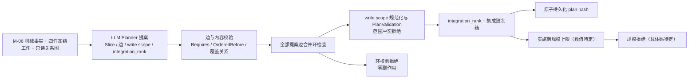
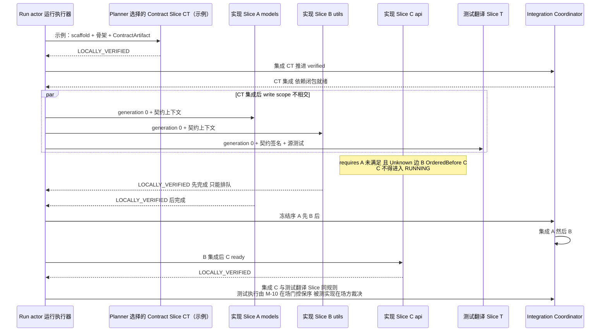
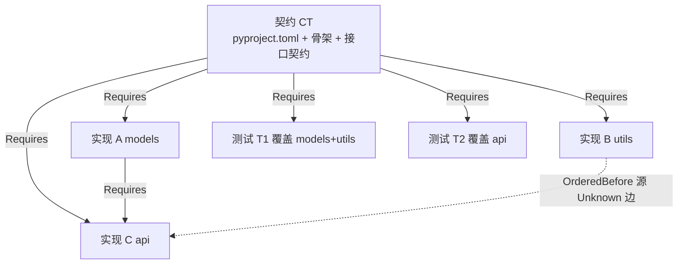

# CodeMigrator 迁移计划生成器：LLM Planner、机器校验与 Slice DAG

> 文档状态：V6 收敛版（fb11，归因→修复集映射确立：候选修复集 + 归因可靠性分类，见下方 V6 方向对齐）。  
> 技术范围：M-06 分析事实、Migration Spec v3、四件冻结工件与只读关系图进入 LLM Planner，产出经机器校验的 Slice 提案、依赖边、write scope、integration_rank、三类工件处理和契约漂移涟漪计算。依赖闭包就绪即启动，计划冻结后不可变。  
> 契约真相：`MigrationSlice`、`SliceKind`（含 `TestGeneration`）、`ArtifactKind` 三类工件处理策略、`WriteScope`、`PlanEdge`、`integration_rank`、`GENERATED` 标注全链路语义与等价信心分级由 [M-00：设计原则、系统地图与公共契约](CodeMigrator_垂类设计原则与架构哲学.md) 唯一定义；四类分析事实、PSF-2 项目索引与 PSF-3 关系图由 [M-06：代码分析与 AST 引擎](CodeMigrator_代码分析与AST引擎.md) 唯一定义；本篇拥有 Planner 提案、机器校验、Slice 派生、依赖边、write scope、涟漪计算与计划冻结语义。  
> 关联文档：[公共契约](CodeMigrator_垂类设计原则与架构哲学.md)、[Migration Spec](CodeMigrator_Migration_Spec抽象层.md)、[代码分析与 AST 引擎](CodeMigrator_代码分析与AST引擎.md)、[Harness 总体设计](CodeMigrator_Harness总体设计.md)、[候选工作区与工具网关](CodeMigrator_候选工作区与工具网关.md)、[验证引擎](CodeMigrator_验证引擎.md)、[Git 集成](CodeMigrator_工作空间与Git集成.md)、[会话与运行时修正](CodeMigrator_会话与运行时修正编排.md)。

规划器回答三个问题：源项目需要哪些目标产物、哪些 Slice 之间存在依赖、如何按冻结的 integration_rank 汇入 verified 主线。输入是四件冻结工件（MigrationSpec、UnderstandingDossier、TargetProjectBlueprint、MigrationRulebook）以及 M-06 的机械事实和只读关系图。LLM Planner 产出 PlanProposal，允许按项目语义选择切分、内容、桩和是否需要 Contract Slice；机器校验产出 PlanValidation，确认范围互斥、蓝图合规、源文件覆盖恰好一次、DAG 无环且规模受限后自动冻结。依赖闭包就绪即启动；完成顺序不能改变已冻结的 integration_rank。

## V6 方向对齐

V5 确立的 Planner 提案 + 机器校验 + 冻结 DAG / integration_rank 主链路保持不变，V6 在此之上做两处方向性精化：

- **write scope 互斥的条件化联合域例外**：write scope 互斥（两两不相交）的唯一目的是**防止并行写冲突**。V6 为修复场景引入条件化例外——**全局修复会话**可持修复集内各 Slice 的 write scope 并集（联合域）写权限。该例外是 write scope 互斥的**条件安全精化**，不是破坏不变量，仅用于归因驱动的全局修复会话（M-00 P-09 / Supervisor 决策）；详见"write scope 派生"章的"条件化联合域例外"小节。
- **归因→修复集映射确立（V6 收敛）**：M-10 的机械归因输出由"唯一命中 Slice"升级为**候选修复集 + 归因可靠性分类**——静态诊断（编译/lint/类型）唯一命中=可靠域直通标记（原 Slice 重生）；静态多命中 / 动态测试失败=Supervisor 证据输入（统一唤醒 Supervisor）。机械归因从路由判据**降级为 Supervisor 输入证据**（候选修复集 + 可靠性分类作决策参考），判定形态由两级路由收敛为「可靠域直通 + 其余统一 Supervisor」；具体判定归 M-10，本篇承接修复集对应的联合域 write scope 语义，详见"归因→修复集映射"节。

V5 对齐段（下节"V5 当前对齐"）与 V5 可验收增量留存作追溯，不随 V6 改动而删减。

## V5 当前对齐

Planner 消费四件冻结输入：MigrationSpec、UnderstandingDossier、TargetProjectBlueprint、MigrationRulebook，并结合 M-06 机械事实与只读关系图提出 PlanProposal。Contract Slice、切片边界、内容、桩、write scope 和 DAG 都是提案能力，Contract Slice 不是必选层。机器校验必须检查：两两 write scope 不相交；目标结构符合 Blueprint；每个 in-scope 源文件恰好归属一个 Slice；DAG 无环且满足规模上限。校验通过后计划自动冻结，采用冻结的 integration_rank 作为集成序，完成先后不能改写它；不得再以同三件输入必得同一计划作为约束。

## 职能边界：Planner 消费什么，产出什么

| 输入 | 来源 | Planner 消费内容 |
|---|---|---|
| F1 模块清单 | M-06 | 文件→`ProjectModuleId` 映射、模块角色（Source/Test）、边界来源（清单/目录/文件）；各 Slice 分组的骨架 |
| F2 import 图 | M-06 | 模块间依赖边及可信度（`Static`/`Unknown`）：Planner 提出 Requires/OrderedBefore 的高可信事实来源；`External` 边不入模块间边 |
| F3 测试清单与覆盖映射 | M-06 | 测试文件→被测模块集合与模块覆盖状态（`Covered`/`EmptyTestSuite`/`Undetermined`）：测试翻译 Slice 的分组与依赖派生；`EmptyTestSuite`（可判定且无测试关联）的 Source 模块驱动测试生成 Slice 派生，`Undetermined` 不驱动任何测试类 Slice |
| F4 构建清单摘要与工件识别 | M-06 | 依赖/脚本/入口摘要：透传目标构建上下文参考，不参与边派生；工件识别事实（`GeneratedCode`/`DeclarativeConfig`/`ResourceFile` 三类 `ArtifactKind`，含生成代码的源头识别）驱动三类工件派生（见"三类工件派生"节） |
| PSF-2 项目索引 | M-06 | SymbolBinding/ReferenceSite 符号级双向索引与符号级覆盖边（测试用例→被测符号）：测试生成 Slice 的符号级锚点、涟漪计算的符号引用闭包查表基础 |
| PSF-3 关系图 | M-06 | 模块级复合图（import 边/覆盖边/包含边）：Requires 派生（import 边投影即 F2，派生仍以 F2 为唯一来源）、涟漪依赖闭包计算与集成序冻结的图基础 |
| Migration Spec v3 | M-05 | 翻译范围（纳入翻译的模块/目录）、冻结 required checks、分解策略三子字段作为 Planner 的原则性提示 |
| 已确认理解档案 | 用户确认冻结（M-16 流程/M-00 契约） | `semantic_modules` 语义模块划分（分组与 write scope 划分的优先依据，覆盖目录约定）；`dependency_resolutions` 中判定为真实依赖/隐式依赖的动态 import 显式生成边；`risk_hotspots` 不参与派生，随 pack 摘录下发 |
| 已确认目标项目蓝图 | 用户确认冻结（M-16 流程/M-00 契约） | 目标模块边界、目标布局原则、并行原则、生成工件处理原则；机器校验据此判断 Planner 提案是否合规 |
| 双端工具链描述符 | Spec 锁定 | 语言事实、命令模板、scaffold 与工件分类声明；不授权目标目录结构或 Slice write scope |

| 产出 | 直接消费方 |
|---|---|
| 四类 Slice（kind、source_modules、write scope、required checks；测试生成 Slice 产出带全链路 `GENERATED` 标注） | M-03 调度、M-08 候选工作区与工具网关、M-10 三层验证与 P-09 诊断归因 |
| 三类工件派生事实（生成 action、声明式配置与资源文件任务的承载 Slice/执行策略） | M-08 执行侧、M-10 验证 |
| 依赖边（Requires/OrderedBefore + provenance） | M-03 ready 判定、M-15 展示 |
| `integration_rank` 与集成键 | Integration Coordinator（M-03/M-11） |
| 涟漪预览（作废范围/重建范围/预计 Slice 数，基于 PSF-2 符号引用闭包与 PSF-3 依赖闭包） | M-16 修正协议（结构修正 `ImpactPreview` 的事实输入） |
| plan hash 与计划证据（Unknown 边清单、分组与边界依据） | M-02 投影、REPORT |

## 四类 Slice：一张表定义
> V5 语义覆盖：下表中的“默认/固定派生”仅保留为 SliceKind 与工件处理的兼容说明；实际 Slice 集合、切分、内容、桩、目标路径、write scope 和是否创建 Contract Slice 均由 Planner 提案，经 PlanValidation 四项门禁通过后冻结。Contract Slice 可以不存在，不能把表中旧的默认数量当作用户确认点。

| SliceKind | 派生输入 | source_modules | 职责与产出 | write scope（概要） | 默认数量 |
|---|---|---|---|---|---|
| Contract（契约） | F1 全部 Source 模块 + F4 + 目标端描述符 | Planner 提案的契约事实覆盖范围 | 产出目标项目骨架：构建文件（由目标端描述符 scaffold 模板初始化，如 `pyproject.toml`）、目录骨架（包占位文件）、每模块 `ContractArtifact`（目标模块路径、公开签名清单、types_hash 类型桩）；作为其余 Slice 的冻结上下文输入，并承接三类工件派生中的生成 action 与声明式配置翻译（见"三类工件派生"节） | 构建文件、骨架、契约文件及相关工件目标路径由 Planner 提案，须通过 Blueprint 与 PlanValidation | 可为 0；需要时按模块域划分且集合可分时可多个 |
| Implementation（实现） | F1 Source 模块按 Spec 分解策略分组 | 组内源模块 | 以 Planner 提案提供的契约或接口事实为对齐基准，把组内源模块翻译为目标实现；组内源 import 关系在组内消化 | 组内源模块映射的目标文件路径集合 | 每组 1 个 |
| TestTranslation（测试翻译） | F1 Test 模块按 F3 覆盖关系分组（源有测试，`Covered`） | 组内测试模块 | 把组内测试文件翻译到目标测试框架；若计划提供相关契约 Slice，则依赖其契约签名——测试的硬输入是可用契约签名+源测试文件（测试测公开接口），"参照已集成实现"是软收益，翻译工作与实现并行 | 组内测试文件映射的目标测试文件路径 | 每组 1 个 |
| TestGeneration（测试生成） | F3 标注 `EmptyTestSuite` 的 Source 模块（可判定且无测试关联），按 Spec 分解策略与实现同规则分组 | 组内无测试覆盖的源模块 | 以源模块代码语义和 Planner 提供的契约/接口事实为锚点生成目标语言测试——行为锚定源语义而非凭空编写；上下文构成遵循 [M-04](CodeMigrator_Agent_Loop设计.md)（源模块正文+可用契约签名+生成指引，信息防火墙：不含被测实现目标正文），符号级锚点取自 PSF-2 项目索引（`ambiguous` 引用退回模块级导出摘要）；产出全链路 `GENERATED` 标注，最低质量门槛=每测试文件至少一个非平凡断言（`LOW_QUALITY` 空断言不支撑主证，M-10）；等价信心分级中生成测试主证较移植测试降一档（M-00）；依赖由 Planner 依据覆盖与接口事实提案 | 目标测试路径由 Planner 提案，须通过 Blueprint 与 PlanValidation；描述符只提供测试命令模板与语言事实 | 可为 0；需要时每组 1 个 |

Spec 分解策略是 Planner 的原则性输入，不再规定固定粒度、固定分组或机械拆分顺序。Planner 可按蓝图和理解档案选择模块、目录或文件粒度，也可在风险与资源约束下调整并行度；机器校验负责范围互斥、源文件覆盖、蓝图合规、无环和规模上限。M-06 的 ModuleBoundary 仍进入计划证据，required checks 仍由 Spec 冻结并由 M-10 实例化。

测试类 Slice 双轨并行：源有测试（`Covered`）的模块走测试翻译轨道——翻译现有测试文件，产出不带 `GENERATED` 标注；无测试（`EmptyTestSuite`，可判定且无测试关联）的模块走测试生成轨道——以源模块代码语义+契约签名为锚点生成目标语言测试，产出带全链路 `GENERATED` 标注，等价信心分级中生成测试主证降一档（M-00）；`Undetermined`（不可判定）不驱动任何测试类 Slice，与 `EmptyTestSuite` 严格区分。两轨互斥：同一 Source 模块要么被测试翻译 Slice 覆盖（经 F3 测试文件关联），要么派生测试生成 Slice，不重叠、不并存；测试生成 Slice 的分组沿用 Spec 分解策略的目标模块粒度（与实现 Slice 同规则），不新增加组参数。

V5 中 Slice 的结构关系由 Planner 提案表达，机器校验只要求 DAG 无环、依赖闭包可解释且规模受限；不再强制 Contract Slice 先行或把 Slice 绑定到固定拓扑层。依赖闭包就绪即启动，执行与集成分别遵守 active-attempt gate 和冻结 integration_rank。

## 三类工件派生：工件不入翻译 Slice，各归其位

工件派生消费 M-06 F4 工件识别事实（`ArtifactKind` 三类分类，含生成代码源头识别）与双端描述符的 `artifact_rules` 声明——工件分类规则由描述符声明，Planner 零内建语言分支，保持"语言差异=数据"不变式（M-00 工件分类公共契约）。识别为工件的文件不进入任何实现/测试 Slice 的 source_modules 与 write scope，按下表各归其位：

| ArtifactKind | 处理策略 | 派生归属 | 执行侧 |
|---|---|---|---|
| GeneratedCode（生成代码，如 `.pb.go`） | 不翻译；目标侧从源头（如 `.proto`）用目标工具链重新生成 | 生成 action 归 Planner 选择的承载 Slice（若创建 Contract Slice，可归其）：生成命令与目标生成路径由 Planner 提案，经 Blueprint 与 PlanValidation 校验；`.proto` 源文件不进翻译范围，作为接口事实源进入相应上下文 | M-08 执行生成命令 |
| DeclarativeConfig（声明式基础设施配置，如 docker-compose/Makefile/config.yaml） | 由 Planner 选择的承载 Slice 翻译目标侧等价物：compose 改 Python 镜像、Makefile 改目标构建命令、config 按键值映射 | 目标侧等价物路径与 write scope 由 Planner 提案并经 Blueprint 与 PlanValidation 校验；翻译语义=配置项到目标工具链的等价改写，不是代码翻译 | 对应 Slice Agent 在候选工作区内完成 |
| ResourceFile（资源文件，如 SQL schema/静态资源） | 按描述符 mapping 复制/轻转换（路径重写、字符集/换行符规范化） | 是否作为独立复制任务或随某个目标 Slice 建立由 Planner 提案，目标路径与 write scope 经 Blueprint 与 PlanValidation 校验；零模型调用 | M-08 执行侧复制 |

三类工件派生的共同不变式：工件分类与处理策略来自描述符 `artifact_rules`，但目标产物路径由 Planner 提案并经 Blueprint 与 PlanValidation 校验，不再由描述符目录约定机械固定；工件处理不产生新的 SliceKind，不新增依赖边（生成 action 与配置翻译随 Planner 选择的承载 Slice 的既有前驱关系走，复制任务无前置依赖）；F4 识别为 `External` 依赖的生成源头（如远程拉取）不进入工件派生。工件识别仅按描述符 `artifact_rules` 声明的模式执行（M-06 V-M06-V4-017），Planner 不重新识别、不二次分类。

## 依赖边提案与校验：结构事实到 typed edge

`A requires B` 规范化为 `from=B, to=A`：B 正式集成后 A 才 ready，B 及其传递闭包进入 A 的交付依赖。`OrderedBefore` 只施加顺序屏障：前驱已集成或以独立终态失败结束后，后继才 ready；前驱的候选不进入后继闭包。Planner 依据 M-06 事实、理解档案、蓝图与风险叙事提出 typed edge；边的端点只能来自同一冻结提案的 Slice 集合，机器校验端点、provenance、边语义与 DAG 无环性，不把固定规则机械扩展为完整边集。具体拒绝码仍属实施期开放项。

| 边 | 派生来源 | 规则 | 语义 |
|---|---|---|---|
| 实现→契约 | 结构性 | 若 Planner 选择 Contract Slice，可按目标结构与风险提出对相关契约 Slice 的 Requires；没有 Contract Slice 时不生成虚构的契约前驱 | 依赖闭包就绪即启动，不等全仓库某类 Slice 清空 |
| 实现↔实现（Static） | F2 `Static` 边 | Planner 可将模块 X 字面量 import 模块 Y 提案为 `from=实现(Y), to=实现(X)`，也可依据切分将其纳入同一 Slice；机器校验端点和 DAG | 翻译 X 可获得提案指定的 Y 实现或其他上下文 |
| 实现↔实现（Unknown） | F2 `Unknown` 边 + 已确认理解档案 | Planner 结合档案判定、风险与目标结构决定是否提出 Requires/OrderedBefore；必须把 `UnknownReason` 与依据写入计划证据，机器校验无环与可解释性 | 不确定性显式进入提案，不由机械兜底规则替 Planner 决策 |
| 测试→契约/实现 | F3 覆盖图 | Planner 结合测试覆盖事实与是否存在 Contract Slice 提出依赖；测试执行保序由 M-10 在场门控承担，不把固定测试→实现或全量契约依赖写成强制边 | 测试翻译与实现可并行；集成时按在场门控保证验证前提 |
| 测试→实现 | 不加边 | 测试类 Slice 不对被测实现 Slice 声明任何边；集成树上跑测试需要被测实现在场，该保序由集成验证的在场门控承担（M-10 执行侧，V-M10-V4-027：集成层 Test 仅执行覆盖实现已全部集成的测试文件，未就绪者顺延），Planner 不加新边 | 集成序天然后置，验证保序而非边保序 |
| 测试↔测试 | 无结构边 | 独立可并行（write scope 不相交时）；不为分组关系加边 | 并行度由 write scope 与 DAG 自然决定 |
| 写冲突校验 | Planner write scope 提案 | `write_paths` 或 `create_roots` 相交时由 PlanValidation 拒绝；不得用 `OrderedBefore` 掩盖范围冲突 | 不冻结该计划 |

Unknown 与 Uncovered 都是 Planner 的不确定性输入：提案可以选择显式顺序/依赖，或依据档案说明不增加边；机器校验只保证提案合法、无环、范围安全，最终语义等价仍由翻译后测试裁决。

每条持久化边携带 provenance（`Structural` / `ImportStatic` / `ImportUnknown` / `Coverage` / `WriteScopeConflict`），用于审计、REPORT 与 M-15 展示；provenance 不改变边语义，ready 判定只看 `PlanEdgeKind`。

## DAG 校验：提案成环即拒绝



机器校验只做提案护栏，不自动改写 Planner 的分组或边：

- Planner 提案中的任意自环或有向环均由机器校验拒绝；机器校验不把循环 import 自动收缩为新的 Slice，也不替 Planner 改写分组、write scope 或集成序。
- Requires 与 `OrderedBefore` 合并后的提案必须保持 DAG；边的 provenance、Unknown 依据和覆盖关系进入 PlanValidation，供失败诊断与后续修正使用。
- 规模边界由实施期配置定稿，超过边界的提案整体拒绝；所有规划拒绝都发生在计划持久化之前，不产生部分冻结计划，Run 进入 `PlanFailed` 的具体投影语义由 M-02/实施期契约定稿。

规划期失败全部发生在持久化之前：边非法、提案成环、范围/蓝图不合规、源覆盖不完整或超过实施期规模边界的提案均零副作用，不存在"部分计划先落库、后续补齐"的路径；具体稳定拒绝码沿统一拒绝码方案定稿。

## write scope 派生：输出路径集合的冻结

write scope 是 Slice 对目标仓库的唯一写权限声明，由 Planner 结合四件冻结工件与 M-06 机械事实提出，再由机器校验器检查；Spec 与模型不能绕过校验直接冻结它。每个 Slice 的 write scope 形如 `Out { write_paths, create_roots }`：`write_paths` 是枚举文件集（既有映射路径），授予修改与新建权；`create_roots` 是目录集合，仅授予新建权——新建路径须位于某 create_root 之下，且不得命中任何其他 Slice 的冻结集合（网关对全计划冻结 scope 表可判定）。

| SliceKind | write_paths（枚举文件集） | create_roots（新建权目录） |
|---|---|---|
| Contract | 目标构建文件、目录骨架、契约文件、生成代码与声明式配置的目标路径由 Planner 提案；目标端描述符只提供 scaffold 命令与语言事实，最终须通过 Blueprint 与 PlanValidation | 由 Planner 按目标结构提案，需通过 Blueprint 与 PlanValidation |
| Implementation | 组内源模块对应的目标文件路径由 Planner 按理解档案与 Blueprint 提案；描述符提供语言事实与工具链约束，不拥有目标目录映射权 | 组内目标文件的提案目录集合，需通过范围互斥校验 |
| TestTranslation | 组内测试文件的目标测试路径由 Planner 提案，并依据 Blueprint 与测试语义校验；与实现路径空间不得相交 | 目标测试目录提案，需通过 PlanValidation |
| TestGeneration | 目标测试文件路径由 Planner 提案；必须与移植测试文件命名空间分离并满足 Blueprint 与范围校验 | 目标测试目录提案，需通过 PlanValidation |
| 固定辅助路径 | 仅描述符明确声明的命令/资源约束可被 Planner 消费；目标写路径仍是提案事实，不得由目录约定自动授予 | — |

`RepositoryExclusive` 变体已废除（D-033）：scaffold 动作归 Harness 基线初始化执行，无 Slice 使用者；不可预先枚举的产出场景由 `create_roots` 新建权覆盖。

四类 Slice 的目标路径空间不再由描述符目录约定自动授予，而由 Planner 结合理解档案、Blueprint 与工件处理策略提出，并由 PlanValidation 检查两两不相交、Blueprint 合规和源覆盖。`ResourceFile` 复制产物仍不入任何 Slice 的 write scope，其目标落点由目标结构提案与资源处理规则共同确定。若提案造成空间相交，PlanValidation 拒绝整份计划；不得追加 `OrderedBefore` 把写冲突降级为串行。

全部路径规范化为仓库相对路径，去重后按 UTF-8 原始字节升序保存。描述符路径含 glob、绝对路径、`.git` 或目录逃逸时拒绝计划，零副作用。

标识函数 owner 声明：组名规范化函数（语义模块/组标识→目标命名成分的确定性规范化，供目标包名、测试文件名 `<module>` 成分等路径派生与 GENERATED 反查使用）是跨阶段公共契约——唯一实现＋导出正门归本篇所有，消费方（M-08 执行侧、M-10 归因反查、M-15 展示）一律引用，禁止私有复制第二实现（双实现漂移会使同名成分不一致、反查失配）。

| 两个 Slice 的 (write_paths, create_roots) 关系 | Planner 处理 | 运行期并行性 |
|---|---|---|
| write_paths 不相交，且任一 create_roots 与对方任何冻结集合（write_paths 或 create_roots）无交集 | 不因写集合加边 | 若 DAG 前驱满足，可同时 `RUNNING` |
| write_paths 相交，或任一 create_roots 与对方 write_paths / create_roots 相交 | PlanValidation 拒绝相交提案；已有 DAG 可达关系不能豁免互斥约束，Planner 必须重新提出不相交范围 | 不冻结该计划 |

写冲突边与 Unknown 保守边使用同一 typed edge，provenance 分别标记 `WriteScopeConflict` 与 `ImportUnknown` 供审计（与上方 provenance 枚举的 PascalCase 风格统一），不新增第三种边语义。运行期 write scope 不可扩大：Agent 的 `WriteFile/EditFile` 规范路径须命中本 Slice 的 write_paths，或位于本 Slice 某 create_root 之下且不命中任何其他 Slice 的冻结集合，否则工具网关在落盘前返回 `WRITE_SCOPE_VIOLATION`，文件写入、candidate ref 推进与 checkpoint receipt 均为零；计划不因越界失败动态扩容。

### 条件化联合域例外（write scope 互斥的条件安全精化）

write scope 互斥（两两不相交）的唯一目的是**防止并行写冲突**，它本身不是独立且绝对的构造不变量，而是构造期对并行安全的条件充分保证。V6 为修复场景引入条件化例外：**全局修复会话**可持修复集内各 Slice 的 write scope 并集（联合域）写权限，即在联合域内对修复集中的 Slice 同时拥有写权。

- **安全条件**：联合域内路径在修复会话执行期间无其他在途并行写者——修复集内 Slice 已全部集成时天然满足（已验证子树不再有在途写者）。由此例外是 write scope 互斥的**条件安全精化**，不是破坏互斥不变量；不参与并行生成的 Slice。联合域安全条件的**精确判定算法**（如何机械验证"无其他在途并行写者"及判定为条件满足）为**实施期开放项**，本篇只定语义，不改写 schema。
- **使用边界**：例外仅用于**归因驱动的全局修复会话**（M-00 P-09 诊断归因 / Supervisor 决策触发的修复场景），**不用于初译并行 Slice**——初译计划内各 Slice 仍须两两 write scope 不相交，不得借联合域例外合并。运行期仍禁止扩大任一 Slice 自身的冻结 write scope：例外授予的是修复会话对联合域的域级写权，不改变每个 Slice 各自的冻结 write_paths / create_roots 边界。

冻结的 Slice→write scope 映射同时是 P-09 诊断归因的查表基础：集成与最终验证的编译器诊断（file:line）按输出路径命中唯一 write scope 即归属 owning Slice，测试失败先按测试文件路径命中测试翻译/测试生成 Slice、再结合覆盖关系判定归属——优先符号级覆盖边（测试用例→被测符号，PSF-2 项目索引），无符号级覆盖条目时降级兼容模块级覆盖图（F3 测试文件→被测模块集合）（归因规则由 M-00 定义、M-10 执行）；Planner 只保证该映射随计划持久化后不变，归因不修改计划事实。

### 归因→修复集映射

M-10 的机械归因输出由"唯一命中 Slice"升级为**候选修复集 + 归因可靠性分类**：write scope 查表输出的是命中归属的集合而非强制要求唯一命中，并附加可靠性分类（可靠性分类的具体数值/枚举为实施期开放项，本篇不臆造 schema）。判定形态收敛为「可靠域直通 + 其余统一 Supervisor」：

- **可靠域直通标记**：静态诊断（编译/lint/类型）在 write scope 查表**唯一命中**单 Slice 且无强耦合信号 → 机械归因标记可靠域直通，映射到该原 Slice 的重生（原 Slice 重生，占其 generation 0-2，零模型判断）。
- **Supervisor 证据输入**：静态诊断**多命中**，或**动态测试失败**（归因不满锐）时，机械归因不直接分流裁决，而是把**候选修复集 + 归因可靠性分类**作为证据输入**统一唤醒 EXECUTE Supervisor**，由其出修复决策（全局修复会话或单 Slice 委派）。

V6 收敛后，机械归因从"两级路由的分流裁决判据"**降级为 Supervisor 的输入证据**——它提供候选修复集与可靠性分类作决策参考，不再承担严格的分流路由。全局修复会话持修复集内各 Slice 的联合域 write scope（见"条件化联合域例外"小节）。

归因仍不修改计划事实：归因仅是查表与证据提供，不改写各自 Slice 的冻结 write scope；`file:line`→write scope 查表映射（P-09）随计划持久化后不变。

## DAG 就绪调度：依赖闭包由 DAG 表达，不由状态机表达

| 层 | 成员 | 进入条件 | 收敛条件 |
|---|---|---|---|
| Planner 选择的 Contract Slice（可选） | 仅计划实际包含的 Contract Slice | 按其 Requires 前驱和互斥 write scope 决定；无相互边且资源许可时可并行 | 某 Contract Slice 失败只阻塞其 DAG 下游依赖闭包；其他无关分支不因全局“契约波”而停止，整体终态由 Run actor 按计划归约 |
| 其他 Slice | Implementation、TestTranslation、TestGeneration 及 Planner 选择的其他 Slice | 所有 Requires/OrderedBefore 前驱已集成或以允许的独立终态结束，且无 write scope 冲突时即可 `RUNNING`；不等待未在自身闭包内的 Contract Slice | 依 DAG ready 逐个推进至全部计划 Slice 终态 |

Requires 边表达依赖闭包，而不是固定拓扑层：若 Planner 选择 Contract Slice，下游实现/测试 Slice 仅等待自身依赖闭包内的契约事实；Contract Slice 也可以不存在。ready 判定是 DAG 的结果而非额外调度状态，`RunStatus` 与 `SliceAttemptStatus` 均不为规划分组扩状态。原 V4 的契约波全局屏障（实现波须待全仓库契约 Slice 清空）已删除，多契约场景按各 Slice 的局部依赖闭包启动；“契约层/实现层”仅可作为兼容展示标签，不表达全局屏障语义。



模型与 Agent 没有改变计划事实的接口：EXECUTE 的 Agent 在本 Slice 候选工作区内自由迭代，但 ready 判定、并行许可以及集成顺序全部由冻结 DAG 与集成键决定；完成时间与 bwrap 返回顺序的变化不能改变 verified commit 序列。

| 调度事实 | owner | 本篇限定 |
|---|---|---|
| DAG ready 判定与 write scope 互斥 | 本篇冻结的 DAG 投影 | 相同计划输入得到相同 eligible 集 |
| 同 Run 并行度与跨 Run 公平轮转 | M-03 runtime scheduler | 只从 ready 且互不冲突的集合领取 |
| 沙箱槽位上限 | M-09 | 沿用固定资源公式 |
| `(ExecutionSubject, CheckId)` active entry | M-03 | 每键一个 active attempt；物理重派只替换本键 attempt |
| 集成顺序 | 本篇冻结集成键，M-03 Coordinator 消费 | 队首重生成期间不得越过队首集成 |

## 冻结与确定性：完成顺序不能改写集成历史

计划持久化时一次性冻结：SliceId、SliceKind、source_modules、write scope、required checks、全部边（含 provenance）、integration_rank、PlanProposal 引用和 PlanValidation 结果。持久化后这些字段不可变；后续修正只能通过 M-16 的 PlanRevision 创建新 Slice，不能就地改写。

Integration Coordinator 严格按冻结的 integration_rank 消费已局部验证的 Slice：`integration_rank ASC → SliceId ASC`。后续 Slice 即使先完成，也只能停在 `INTEGRATION_QUEUED`；队首 Slice 重生成期间，后续 Slice 可继续候选计算与局部验证，但不得越过队首集成。integration_rank 由已通过机器校验的 Planner 提案产生，完成时间不参与排序。

V5 不再定义 deterministic_plan_order_key；以下旧 V4 canonical 规则仅作历史迁移参考，不得用于新计划：

```
# V4 历史字段示意；V5 不定义此字段。
deterministic_plan_order_key = SHA-256(canonical(
    slice_kind,             # SliceKind canonical 序
    source_modules,         # ProjectModuleId 字节序升序去重
    target_paths,           # write_paths 与 create_roots 的规范化路径，UTF-8 字节序升序
    descriptor_digest,      # Spec 锁定的双工具链描述符摘要
    snapshot_oid            # 冻结源快照 commit OID
))
```

覆盖、蓝图、范围和 DAG 检查的结果进入 PlanValidation；同一组输入不要求两次 Planner 得到逐字节相同的计划。`SliceId` 仍是 UUIDv7 身份，作为同一冻结计划内的最终 tie-break。

 plan hash 覆盖四件工件 hash、快照 OID、全部 Slice canonical 内容、全部边及 provenance、write scope、integration_rank、PlanValidation 结果与集成键；任一分量变化即产生新 plan hash。规模边界由实施期机器校验配置决定；超过上限必须整体拒绝且零部分计划行，具体稳定拒绝码仍待定稿。

 计划证据随 plan hash 一并持久化，至少包含：Planner 分组依据与拆分记录、Unknown 边清单（含 `UnknownReason` 与证据位置）、写冲突对清单（含定向依据）及机器校验结果。REPORT 与 M-15 直接消费这些证据解释"为什么这样分组、为什么这两个串行"，不重新推断。

## 计划事实与恢复

| 真相源 | 保存事实 | 崩溃后的恢复 |
|---|---|---|
| plan ledger | Slice、两类边及 provenance、write scope、`integration_rank`、集成键、plan hash、计划证据 | 已提交返回原 receipt；未提交以同一输入整单重建 |
| M-06 分析投影 | F1~F4 四类事实 | 7 天留存；超期后按冻结 commit + 描述符摘要重建，再重派生得到相同计划 |
| Slice projection | `SliceAttemptStatus`、active generation/dispatch | M-03 从 ledger 与 Git refs 重建 |
| Git refs | per-Slice candidate 与唯一 verified | 不从计划文本猜测代码事实 |

计划持久化与对应 `run_events` 由 Run actor 在控制面事务中提交（M-00/M-03）；Planner 不拥有周期续权或轮询恢复职责。取消一旦持久化，pending→ready 迁移、候选工作区创建与新 dispatch 的新增数均为零。

## 贯穿示例：Planner 选择 Contract Slice 的一次 TS→Python 规划

以下只展示一份合法的 Planner 提案，不代表固定的 Slice 数量、Contract Slice 必然存在或 Unknown 边必须采用同一处理。

源快照：`src/models/user.ts`、`src/models/order.ts`（模块 models）、`src/utils/format.ts`（模块 utils）、`src/api/client.ts`、`src/api/plugin.ts`（模块 api）、`tests/user.test.ts`、`tests/format.test.ts`、`tests/api.test.ts`。F2 事实：`api→models` 为 Static（client.ts 字面量 import）；`plugin.ts` 内 `await import(pluginPath)` 为 Unknown（DynamicImport，from=api）；models 与 utils 互不依赖。F3 事实：`user.test→{models}`、`format.test→{utils}`、`api.test→{api}`，均 `ImportGraph` 派生；三个源模块均有测试关联（`Covered`），无 `EmptyTestSuite` 模块，本例不派生测试生成 Slice（反设：若 `utils` 无任何测试文件关联被标注 `EmptyTestSuite`，则会为其派生 TestGeneration Slice，产出带 `GENERATED` 标注的目标测试，且不与任何测试翻译 Slice 的 write scope 重叠）。



箭头 X→Y 即 canonical `from=X, to=Y`：Y 依赖 X，X 先集成。

| Slice | kind | source_modules | write scope（目标路径） | integration_rank | 集成序 |
|---|---|---|---|---|---|
| CT | Contract | models, utils, api | `pyproject.toml`、`src/pkg/__init__.py`、`src/pkg/{models,utils,api}/__init__.py`、对应三份 `.pyi` | 0 | 1 |
| A | Implementation | models | `src/pkg/models/user.py`、`src/pkg/models/order.py` | 1 | 2 |
| B | Implementation | utils | `src/pkg/utils/format.py` | 1 | 3 |
| T1 | TestTranslation | user.test, format.test | `tests/test_user.py`、`tests/test_format.py` | 1 | 4 |
| T2 | TestTranslation | api.test | `tests/test_api.py` | 1 | 5 |
| C | Implementation | api | `src/pkg/api/client.py`、`src/pkg/api/plugin.py` | 2 | 6 |

边提案对照：在这份示例提案中，CT→A/B/C 为实现→契约依赖，CT→T1、CT→T2 为覆盖相关的测试→契约依赖；A→C 依据 `api→models` Static 事实提出，B⇢C 依据 Unknown 事实提出顺序约束。它们都是 Planner 的可审计选择，机器校验负责端点、provenance、范围和 DAG，不把该选择推广为固定派生规则。T1、T2 不对 A/B/C 声明额外边——集成树上跑测试需要被测实现在场，由集成验证保序；T1 与 T2 无结构边，write scope 不相交，生成期可与 A、B 并行。

执行叙述：在这份示例中，CT 生成目标骨架与三份 `ContractArtifact`，局部验证（语法 + 契约类型检查模板）通过后集成，verified 从空输出基线推进。CT 集成后 A、B、T1、T2 按各自依赖闭包与互斥 write scope ready，不等全仓库契约 Slice 清空；C 因 requires A 未满足且示例中的 OrderedBefore 前驱 B 未结束而不得启动。B 先完成局部验证只能进入 `INTEGRATION_QUEUED`，Coordinator 按冻结序先集成 A 再 B——完成顺序变化不改变集成序。B 集成后 C ready。T1 覆盖 models+utils，集成时 A、B 已在场，测试执行即可裁决；T2 覆盖 api，其集成（序 5）先于 C（序 6）——Planner 未为此加边，T2 集成后的测试执行需要 C 在场，由 M-10 在场门控（V-M10-V4-027）顺延至 C 集成后的最近一次 Test 检查主体（C 的 prospective）裁决（验证保序而非边保序）。若 C 集成时类型检查发现其对 models 用法与契约签名不一致，诊断 `file:line` 落在 C 的 write scope 内，归属 C 定向重生成。api 的动态 import 若实际指向 utils，B 先集成已保证语义可参照；若指向不存在目标，顺序无害，最终裁决交给翻译后测试。

并行窗口汇总（本示例）：CT 集成前独占生成；CT 集成后 A、B、T1、T2 并行（依赖闭包就绪即启动，测试翻译与实现并行）；B 集成后 C ready。任意时刻处于 `RUNNING` 的 Slice 其 write scope 两两不相交，集成序恒为 CT→A→B→T1→T2→C，与各 Slice 的完成先后无关；T2 的测试执行裁决后置到 C 集成之后，由 M-10 在场门控保序（V-M10-V4-027）。

## PlanRevision：替换各 Slice，不改写冻结

 会话修正经 [M-16](CodeMigrator_会话与运行时修正编排.md) 分类后才进入 Planner。局部修正创建新的 SliceId 与 `supersedes_slice_id` lineage；结构修正以已确认的 ImpactPreview 生成新 PlanRevision、replacement Slice 与必要的 compensation Slice。四类 Slice 均可被替换：replacement 继承被替换者的 SliceKind 语义（含测试生成的 `GENERATED` 标注义务），write scope 与依赖边按 Planner 重新提案并经机器校验冻结；已集成 Slice 永不失效，对其效果的修正只能从最新 verified 产生 compensation Slice。新计划仍遵守 PlanValidation 的范围/蓝图/环校验、实施期规模边界与集成键规则；用户输入不能动态扩大 write scope，也不能让后到 Slice 越过队首集成。

## 契约漂移涟漪计算：符号引用闭包到 Slice 集

契约 Slice 集成后若触发契约漂移修正（契约签名与实现/测试用法不一致，或会话确认契约变更），受影响集合的计算精确到符号级，而非全量下游模块：

- 符号引用闭包：以漂移的契约符号（一个或多个）为锚，经 PSF-2 项目索引的 ReferenceSite（M-06）查"引用该契约符号的模块集"——双向索引直接查表（符号绑定→引用点→引用文件→归属模块），零运行时图解析；引用归属 `ambiguous`（同名多绑定）或 text-fallback 无 PSF-2 条目时降级为模块级闭包并显式标注降级事实。
- 依赖闭包：受影响模块集在 PSF-3 关系图（M-06 模块级复合图：import 边/覆盖边/包含边）上取传递闭包——受影响模块自身及其全部下游依赖模块。
- Slice 映射：闭包内模块经冻结计划的 source_modules→Slice 映射命中受影响 Slice 集；仅落在已集成 Slice 内的部分不失效，进入 compensation 候选；落在未集成 Slice 内的部分进入重建候选。

 产出涟漪预览供 [M-16](CodeMigrator_会话与运行时修正编排.md) 修正协议消费，作为结构修正 `ImpactPreview` 的事实输入：作废范围（失效的未集成 Slice 及其 candidate）、重建范围（replacement/compensation 候选）、预计 Slice 数与预计涉及符号清单。涟漪计算是冻结计划与 M-06 投影之上的只读投影，不修改计划事实；修正落地仍走 PlanRevision 全部规则（Planner 重新提案、write scope/蓝图/环校验、集成键与实施期规模边界）。与旧粒度（契约漂移作废全部下游模块对应的 Slice）的区别：精确到引用符号的模块闭包，未引用漂移符号的下游模块不受影响、不进入作废范围。

## V4 历史验收基线（追溯，非当前 V5 契约）

- [ ] V-M07-V4-001：实现/测试翻译/测试生成 Slice 在其依赖闭包内的全部契约 Slice 正式集成前不得进入 `RUNNING`；依赖闭包就绪即启动——任一契约 Slice 集成后，依赖闭包仅覆盖该契约 Slice 的 Slice 即可 ready，不等全仓库契约 Slice 清空集成队列（多契约计划逐域验证：某域契约 Slice 集成后，仅依赖该域的实现/测试 Slice 可进入 `RUNNING`，其余域契约 Slice 仍在途不构成启动屏障）。
- [ ] V-M07-V4-002：依赖边与源 import 图一致——F2 每条 Static 模块间边逐一映射为实现 Slice 间 Requires（组内边除外），逐条对照投影无缺漏、无多派生；`External` 边不产生任何 Slice 间边。
- [ ] V-M07-V4-003：任一 `Unknown` 边不出现在 Requires 派生中；其 from 模块的实现 Slice 与无可达关系的其他实现 Slice 之间存在 OrderedBefore，且两者任意时刻不同时 `RUNNING`。
- [ ] V-M07-V4-004：write_paths 相交，或任一 create_roots 与他 Slice 的 write_paths/create_roots 相交的 Slice 对之间必有确定性 OrderedBefore；write_paths 不相交且 create_roots 与任何他 Slice 冻结集合无交集、又无结构前驱冲突的 Slice 可同时 `RUNNING`。
- [ ] V-M07-V4-005：改变各 Slice 完成顺序与 worker 返回顺序 100 次，集成键、集成队列顺序与 verified commit 序列保持不变。
- [ ] V-M07-V4-006：Static 自环、OrderedBefore 环或合并后有向环在持久化前返回 `PLAN_CYCLE`，计划表、Slice、边写入行数为 0。
- [ ] V-M07-V4-007：测试翻译 Slice 的 Requires 前驱恰好是其覆盖模块归属的契约 Slice，不含任何实现 Slice；`Uncovered` 测试组的 Slice requires 全部契约 Slice；覆盖关系变化时边集合同步变化。测试翻译 Slice 与其被测模块的实现 Slice 在 write scope 不相交且无其他边时可同时 `RUNNING`；测试执行裁决由集成验证的在场门控保序（被测实现在场方执行，M-10 / V-M10-V4-027），不由 Requires 边保序。
- [ ] V-M07-V4-008：同一（四类事实 + Spec + 快照 OID）执行两次规划，canonical 化后计划逐字节等价且逐 Slice 的 `deterministic_plan_order_key` 相同；canonical 输入任一分量变化时 key 变化。
- [ ] V-M07-V4-009：计划持久化后 SliceId、边、write scope 与集成键零变化；运行期写冻结集合外路径返回 `WRITE_SCOPE_VIOLATION`，文件写入、candidate ref 推进与 checkpoint receipt 均为 0。
- [ ] V-M07-V4-010：循环 import 的 Static 闭包被 SCC 收缩为单一实现 Slice，继承成员源模块集合与 write scope 并集；不存在把该闭包拆回多个 Slice 的路径。
- [ ] V-M07-V4-011：模型或 Agent 提交的边增删、层位改换或集成序重排请求没有对应接口，计划事实零变化；PLAN 阶段模型输出不回写计划。
- [ ] V-M07-V4-012：F3 标注 `EmptyTestSuite` 的每个 Source 模块恰派生一个测试生成 Slice（分组沿实现分组规则），其 Requires 前驱为该模块归属的契约 Slice；锚点为源模块代码语义+契约签名（上下文=源模块正文+契约签名+生成指引），产出文件、receipt 与 fingerprint 全链路带 `GENERATED` 标注；`Covered` 模块不派生测试生成 Slice（与测试翻译双轨互斥不重叠），`Undetermined` 模块不派生任何测试类 Slice。
- [ ] V-M07-V4-013：三类工件派生——`GeneratedCode` 工件零翻译动作（不入任何实现/测试 Slice 的 source_modules 与 write scope），其生成 action 归契约层 Slice（目标生成路径入契约 Slice write_paths，源文件作为接口事实源被契约层消费）；`DeclarativeConfig` 工件的目标侧等价物路径入契约 Slice write_paths；`ResourceFile` 工件不入任何翻译 Slice write scope，按描述符 mapping 复制/轻转换。工件分类只按描述符 `artifact_rules` 执行，Planner 内建语言分支数为 0。
- [ ] V-M07-V4-014：契约漂移涟漪计算的受影响集合为"引用该漂移契约符号的模块集"（PSF-2 ReferenceSite 查表）在 PSF-3 关系图上的依赖闭包，再经 source_modules→Slice 映射命中——未引用漂移符号的下游模块对应的 Slice 不进入作废范围（区别于全量下游粒度）；涟漪预览含作废范围/重建范围/预计 Slice 数，供 M-16 `ImpactPreview` 消费；涟漪计算本身不修改冻结计划事实。

## V5 可验收增量

- [ ] V-M07-V5-001：Planner 消费 Spec、UnderstandingDossier、TargetProjectBlueprint、MigrationRulebook 四件冻结输入与 M-06 机械事实，产出可审计 PlanProposal；Contract Slice 可以不存在。
- [ ] V-M07-V5-002：机器校验拒绝任意 write scope 相交、Blueprint 外目标结构、in-scope 源文件未覆盖或重复覆盖、DAG 成环、超过规模上限的提案；拒绝时不产生部分冻结计划。
- [ ] V-M07-V5-003：校验通过后自动冻结 Slice、边、write scope、integration_rank 和工件引用；用户不需要逐 Slice 确认，完成顺序不能改变 integration_rank。
- [ ] V-M07-V5-004：运行期结构变化只经 M-16 安全点和 ImpactPreview 确认，对未集成部分产生新 PlanRevision；已验证主线不就地重写。

---

> 设计演进、历史缺陷处置和变更理由见：[文档迭代记录](文档迭代记录.md)。
