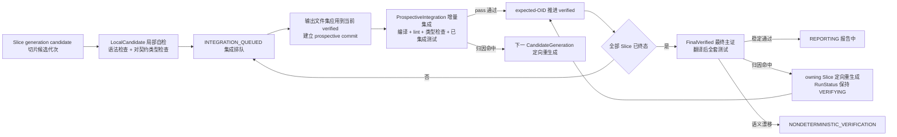
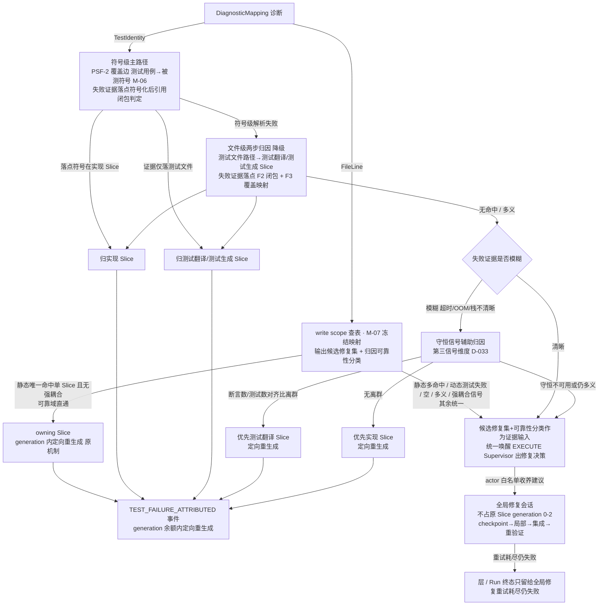
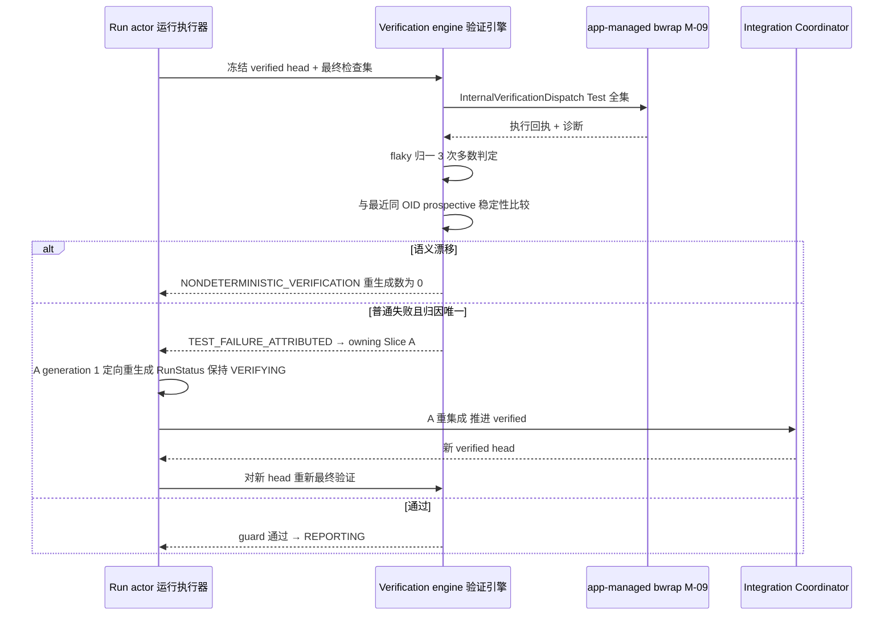

# CodeMigrator 验证引擎：三层验证、测试移植主证与诊断归因

> 文档状态：V6 收敛版（fb11，自 V6 方向对齐版收敛而来，迭代历史见[文档迭代记录](文档迭代记录.md)）。  
> 技术范围：三层检查集实例化、描述符命令面、执行事实归一、P-09 符号级诊断归因与守恒信号辅助归因、测试移植验证侧（flaky 重跑/超时/部分完成）、生成测试验证语义（TestGeneration 同执行面、GENERATED 标注与信心分级双档）、行为 parity 场景对比（无测试模块的黑盒补充取证）、Test 空集预派发跳过、目标侧结构守恒计算、Oracle 派生与反向自检、验证边界声明、语义 fingerprint 与非确定性检测。  
> 契约真相：`CheckResult`、`VerificationSubject`、`VerificationOutcome`、`verification_fingerprint`、`DerivedVerificationGuard`、`CheckCommandTemplate`、`CheckStatus` 与 `DiagnosticMapping` 由 [M-00：设计原则、系统地图与公共契约](CodeMigrator_垂类设计原则与架构哲学.md) 唯一定义；write scope 查表基础与 required checks 冻结由 [M-07：迁移计划生成器](CodeMigrator_迁移计划生成器.md) 拥有；F3 覆盖映射、F2 import 图与 PSF-2 项目索引（符号级覆盖边）由 [M-06：代码分析与 AST 引擎](CodeMigrator_代码分析与AST引擎.md) 拥有；`Shell` 会话自检通道（自检=反馈不裁决）与工具面边界由 [M-12：工具系统与 Hook](CodeMigrator_工具系统与Hook.md) 拥有；本篇拥有三层检查集合实例化、Test 空集预派发跳过语义、生成测试验证语义（同执行面与 GENERATED 标注）、目标侧结构守恒计算、守恒信号辅助归因、验证边界声明、Oracle 派生、失败归因与 generation 失败归约。  
> 关联文档：[公共契约](CodeMigrator_垂类设计原则与架构哲学.md)、[Harness 总体设计](CodeMigrator_Harness总体设计.md)、[代码分析与 AST 引擎](CodeMigrator_代码分析与AST引擎.md)、[迁移计划生成器](CodeMigrator_迁移计划生成器.md)、[候选工作区与工具网关](CodeMigrator_候选工作区与工具网关.md)、[沙箱与执行环境](CodeMigrator_沙箱与执行环境.md)、[Git 集成](CodeMigrator_工作空间与Git集成.md)、[工具系统与 Hook](CodeMigrator_工具系统与Hook.md)、[会话与运行时修正编排](CodeMigrator_会话与运行时修正编排.md)。

跨语言翻译没有"逐文件改完即交付"：源项目（如 TypeScript）被全量翻译为目标语言（如 Python）新项目后，语义等价的唯一确定性主证是**翻译后测试套件在目标项目通过**（P-02；源无测试模块由测试生成 Slice 以源语义+契约签名为锚点承接，主证降一档，见生成测试的验证语义节），辅以描述符声明的编译/lint/类型检查。验证引擎因此围绕三层证据组织：Slice 候选的局部自检、每次集成后的增量全量检查、全部 Slice 终态后完整输出项目的翻译后全套测试。三层名称与确定性 fingerprint 机制沿用，检查内容按当前 V6 契约执行；检查命令的唯一来源是 Run 创建时冻结的目标端工具链描述符 `CheckCommandTemplate`——不存在插件进程、BuildArgv 或 wire 命令面，V3 的受控重放验证、补丁重放语义与前置/替换/锚点/内容字节哈希全部废除，集成验证的对象改为"队首 Slice 输出文件集应用到当前 verified 后的 prospective commit"（不相交文件集应用，M-11）。

`CheckRunner` 已作为 Agent 工具退役（M-12），"Agent 自检与 Harness 验证共用同一命令面"的旧表述随之废除。会话自检走 `Shell`：EXECUTE Agent 在长驻沙箱内自由执行构建/依赖/探索/自检，自检=反馈不裁决，其结果只进模型上下文，不写 `CheckResult`、不推进 SliceAttemptStatus、不参与 fingerprint；裁决层 `InternalVerificationDispatch` 是唯一冻结通道——本篇定义的三层验证全部由 app 直接管理的 bwrap 执行（冻结检查集 + tested commit 临时物化目录 → fingerprint），裁决由冻结检查集独立做出。模型在 VERIFY 阶段无任何工具（含 `ReadFile`），只能消费归因后的诊断与验证 receipt 投影。

## V6 方向对齐

在 V5 稳定机制之上，V6 升级失败处理的**判定深度**，V6 收敛将判定形态统一为「可靠域直通 + 其余统一 Supervisor」：

1. **归因输出升级（含可靠性分类）**：机械归因（P-09，`file:line`→write scope 查表）输出由"唯一命中 Slice"升级为**候选修复集 + 归因可靠性分类**——write scope 查表按命中输出集合，不再要求唯一；可靠性分类区分**静态诊断（编译/lint/类型）唯一命中=可靠域直通标记** 与 **静态多命中 / 动态测试失败=Supervisor 证据输入**。可靠性分类的具体数值/枚举为实施期开放项。
2. **可靠域直通 + 其余统一**：静态诊断唯一命中单 Slice 且无强耦合信号 → **可靠域直通**，owning Slice generation 内定向重生成（原 Slice 重生，占 generation 0-2，带升级包），零模型判断、省调用；静态诊断多命中 / 全部动态测试失败 / 守恒辅助后仍多义 / 跨 generation 复发 / 强耦合信号 → **其余统一**，统一唤醒 EXECUTE Supervisor（事件触发式新会话）出修复决策，派发**全局修复会话**（多 Slice 耦合联合域，不占 generation 0-2）或单 Slice 委派重生。机械归因从两级路由的"分流裁决判据"**降级为 Supervisor 的输入证据**——候选修复集 + 可靠性分类作决策参考，不再作为严格分流路由判据。

对应地，失败处理多义路径由 V5 的"无法唯一归属 → Run/层终态"改为"**仍多义 → 升级 Supervisor → 全局修复先试 → 全局修复重试耗尽才 Run 终态失败**"。**终态仅留给全局修复重试耗尽仍失败**；最终验证失败走同一机制（证据落点 → 候选修复集 + 可靠性分类 → 可靠域直通 / 升级 Supervisor）。

V5 的三层验证、测试移植主证、fingerprint、flaky、结构守恒、行为 parity、Test 空集、Oracle 派生与验收段全部保持，机制不被本次修订弱化；下述章节修订归因输出（含可靠性分类）、将「两级路由」改写为「可靠域直通 + 其余统一」并调整失败处理表与最终验证闭环路径。V5 对齐段（含 V5 可验收增量与 V4 历史验收基线）留存作追溯。

## V5 当前对齐

Oracle 的确定性裁决不变：三层验证、翻译后测试主证、测试生成 GENERATED/LOW_QUALITY 门槛、fingerprint、flaky、P-09 归因、结构守恒、行为 parity、反向自检和测试执行保序均保留。变化仅在执行物理面：app 直接管理 bwrap，验证从被测 commit 临时物化目录启动，默认拒绝网络；验证不读取 Slice 长期卷，也不使用 worker/UDS/overlay。Planner 只负责提出计划，验证引擎不接受其绕过冻结检查集的命令。

## 三层验证回答三个不同问题

| 层级与 subject | 被检查 commit | 检查集合（描述符模板按层实例化） | 通过后的唯一作用 | 失败语义 |
|---|---|---|---|---|
| `LocalCandidate`（局部自检） | 本 Slice 当前 generation 的 candidate checkpoint OID | Compile 模板（语法检查）+ TypeCheck 模板（对契约的类型检查）；项目不完整，不跑全量编译、不跑测试 | `LOCALLY_VERIFIED → INTEGRATION_QUEUED` | 本 Slice write scope 内诊断走同 generation 反馈修复；跨 scope 或反馈耗尽进入重生成 |
| `ProspectiveIntegration`（增量集成） | 队首 Slice 输出文件集应用到当前 verified 后的 prospective OID | required checks 中全部非 Scaffold 模板：目标编译 + 全项目 lint/类型检查 + 树上已集成测试 | 允许创建 `IntegrationIntent` 并以 expected-OID 推进 verified | 接口冲突在此暴露；归因 owning Slice → 下一 generation |
| `FinalVerified`（最终主证） | 全部 Slice 终态后冻结的 verified head OID | Test 模板全集：翻译后全套测试（移植测试与生成测试同冻结检查集、同判据执行） | `VERIFYING → REPORTING` | fingerprint 漂移优先 `NONDETERMINISTIC_VERIFICATION`；普通失败证据落点经机械归因输出候选修复集 + 归因可靠性分类 → 可靠域直通与其余统一：静态唯一命中单 Slice 且无强耦合 → owning Slice 定向重生成；静态多命中 / 动态测试失败 / 守恒辅助后仍多义 / 跨 generation 复发 / 强耦合 → 其余统一升级 Supervisor 全局修复先试；全局修复重试耗尽仍失败才 Run 终态 |

局部成功只证明候选在"基线 verified（已集成的前置 Slice 产物，含可选契约工件）+ 本 Slice 输出"上语法成立、与可用契约类型一致；跨 Slice 接口冲突（如实现 Slice 对他模块契约签名的误用）由集成层类型检查裁决；最终层以全套翻译后测试作为语义等价主证，同时负责暴露测试不稳定与环境漂移。前两层属于 Run 的 `EXECUTING`，只有最终层属于 `VERIFYING`。



## 检查命令与检查集：描述符模板的层实例化

检查命令只有一条来源链：Spec 锁定双工具链描述符 → Run 创建时冻结描述符版本与摘要 → app 从目标端 `CheckCommandTemplate`（action/program/argv/timeout_secs）以冻结参数实例化。模型不能提供 program、argv、shell 片段或环境变量；命令面之外的执行请求零执行。`invocation_hash` 覆盖 canonical(模板 sha256 + program + argv + timeout_secs)，不含临时验证目录路径与宿主环境——这是命令身份的哈希，不是文件内容的字节哈希，不参与任何写入守卫。

三层从 Spec 冻结的 required checks 全集中按 `CheckAction` 筛选并实例化（Planner 不裁剪检查集，M-07；筛选规则由本篇拥有）：

| CheckAction | 局部 | 集成 | 最终 | 说明 |
|---|---|---|---|---|
| Scaffold | — | — | — | 一次性项目初始化，由 Harness 在输出基线初始化时执行（M-08/M-11），不属于任何验证层 |
| Compile | ✓ 语法检查 | ✓ 全量编译 | — | 局部层在 candidate commit 的临时物化目录上以语法与结构完整性语义运行 |
| Lint | — | ✓ | — | 全项目规范检查，项目不完整时无意义 |
| TypeCheck | ✓ 对契约（若有） | ✓ 裁决可用契约一致性 | — | 候选树可含 Planner 选择的 Contract Slice 产出的契约文件（如 `.pyi` 类型桩）；没有契约 Slice 时按目标项目实际类型事实执行 |
| Test | — | ✓ 已集成测试（在场门控过滤） | ✓ 翻译后全套 | 集成层运行 prospective 树上**合格**的测试文件——合格=文件存在于树 ∧ 其覆盖实现 Slice（按 M-07 冻结覆盖映射查表）已全部集成；被测实现在场方执行该测试，未就绪测试顺延至其被测实现集成后的最近一次 Test 检查主体（后续 prospective 或最终层）；合格集为空时按预派发跳过处理（见 Test 空集语义节），产生 Passed/SkippedEmpty 回执 |

执行任何 check 前，Harness 按 `CheckId` 原始字节升序冻结该层 canonical 检查子集并计算 `frozen_required_checks_sha256`。一次 outcome 必须恰好覆盖其冻结集合；结果缺失、重复、额外或 invocation hash 不匹配都不能产生允许推进的 guard。

| 集合问题 | 稳定错误 | `all_required_checks_passed` | 后续 ref 推进 |
|---|---|---|---|
| 缺失 CheckId | `CHECK_MISSING` | false | 0 |
| 同一 CheckId 多个结果 | `CHECK_DUPLICATE` | false | 0 |
| 未冻结的 CheckId | `CHECK_UNEXPECTED` | false | 0 |
| invocation hash 不匹配 | `INVOCATION_HASH_MISMATCH` | false | 0 |
| 恰一覆盖且全 Passed | none | true | 仍需 Error UNKNOWN=0 |
| 恰一覆盖但含任一非 Passed | none | false | 0 |

每个 CheckId 都从 subject 的 `tested_commit_oid` 创建独立临时物化目录（M-09）：检查间不共享可写工作区，候选长期卷、integration scratch 与 verified 树不挂载给不可信进程；一个 check 的生成文件不能使另一个 check 偶然通过。重派同一 check 时也创建新目录，旧进程只能污染旧副本。`CheckStatus` 只有 `Passed/Failed/TimedOut/OutputLimitExceeded/InfrastructureError`；取消不属于检查状态。active DispatchAttempt gate 在进入本模块前完成（M-03/M-09）。

## Test 空集语义：预派发跳过

Test 检查的空集行为不依赖工具对"空收集"的退出行为。Harness 在派发前做一次确定性判定：action 为 Test，且该检查主体上的**合格测试集合为空**——合格=文件存在于检查 subject 树（集成层的 prospective、最终层的 verified）∧（最终层无附加条件；集成层该文件的覆盖实现 Slice 已按 M-07 冻结覆盖映射全部集成，即 M-10 在场门控）。这是 Git tree 与冻结计划上的确定性查表事实，零模型裁量，与工具运行时行为无关。

判定成立时的处置是**不启动 bwrap**（零执行位、零临时验证目录、零沙箱开销），由 Harness 直接产生 `status=Passed` 且携带 `disposition=SkippedEmpty` 的 typed receipt。该回执不经执行事实归一，但正常进入 CheckResult 账本与 verification fingerprint。

该语义对集成与最终两层同构适用：集成层对应"合格测试集合为空（含在场门控过滤后为空——树上已有测试文件但其被测实现尚未集成的情形）"，最终层对应"计划确实不含任何测试产出"——源无测试模块经 `EmptyTestSuite` 标注（M-06）由 M-07 派生测试生成 Slice 承接，常态下最终层树上存在移植或生成测试文件，空集跳过保留为该派生未发生时的机制兜底；局部层不实例化 Test，不涉及。设计动机（D-033）：pytest 等真实工具对空收集返回非零 exit（pytest 为 5，`EXIT_NOTESTSCOLLECTED`），任何"工具空收集 exit code=0"的假设都会让带有契约前置的 Slice 首次集成必然伪失败；预派发跳过把空集处理移出工具行为面，零工具特定 exit code 知识。

**在场门控的失败归因含义**：门控保证集成层 Test 执行时其全部被测实现在场，因此 import/收集失败不再出现"测试先于实现集成"的歧义态——符号级归因（P-09）的落点判定不会要求重生成一个尚未集成的 Slice；未就绪测试顺延执行后，其失败按既有符号级/文件级规则归因于已集成主体，generation 语义不被穿透。

## 执行事实只能归一一次

每个 admitted check 的 stdout/stderr 都是完整独立 ArtifactRef，诊断解析器读取全文而不是 UI 展示截断。M-09 按固定优先级形成唯一 execution 主事实，本模块只做以下确定映射，不从日志文案猜测退出原因。

| execution 主事实 | CheckStatus | 补充约束 |
|---|---|---|
| 用户取消 | 不发布 | 只消费 TerminationReceipt |
| 任一流第 `256 MiB + 1 byte` | `OutputLimitExceeded` | 两流独立计数，保留已接纳 artifact |
| 模板 `timeout_secs` 到期被终止 | `TimedOut` | 描述符冻结值优先；默认档 Scaffold/Compile/Lint/TypeCheck 300 秒、Test 120 秒。TimedOut 与 Failed 严格区分：前者是被 Harness 终止的资源事实，后者是检查器自然退出的语义失败 |
| OOM、quota、launch/profile/cgroup/artifact/cleanup 失败 | `InfrastructureError` | Run 的 ResourceExhausted 另由 Harness 归约 |
| seccomp denial | `Failed` | 即使 exit code 为 0 也不得 Passed |
| exit code 0 | `Passed` | 仅在无更高优先级事实时 |
| exit code 非 0 | `Failed` | 保存稳定 exit receipt |

每个 check 在 launch 前登记 canonical empty stdout/stderr ArtifactRef，因此 launch 失败也能形成结构完整的 InfrastructureError。UI 可展示每流头 `128 KiB`、尾 `384 KiB` 与省略字节数，但该投影不进入 diagnostics、fingerprint 或 Oracle。

## 诊断归因：从 file:line 与测试身份到 owning Slice

`DiagnosticMapping` 由受信诊断解析器从完整日志 ArtifactRef 归一：severity、target（`FileLine{file_path, line}` / `TestIdentity{test_name}` / `Unknown`）、stable diagnostic code、message_hash。编译器/测试运行器的结构化输出按工具类别归一；diagnostics schema 无效或完整性不明时不伪造空集合，check 记为 `InfrastructureError` 阻断；无法定位到 file:line 或测试身份的诊断落 `Unknown`，Error 级计入 guard。V3 的 `NodeLocator` 重定位链随 P-01 重写废除——诊断在哪个文件哪一行成立，由检查器输出直接声明，不再经过源 AST 节点映射。

归因（P-09）是纯查表与图判定，查表基础由 M-07 冻结：Slice→write scope 映射；M-06 提供三重图基础——PSF-2 项目索引（SymbolBinding/ReferenceSite 双向索引与符号级覆盖边：测试用例→被测符号）、F3 覆盖映射（测试文件→被测模块集合，文件级降级基础）与 F2 import 图（被测模块依赖闭包）；守恒信号（结构守恒计算的对齐比离群事实，D-033）作为第三信号维度参与失败证据模糊时的归属排序。

| 诊断类别 | 归因算法 | 结果 |
|---|---|---|
| 编译/lint/类型诊断（FileLine） | `file_path` 匹配各 Slice 冻结 write scope，按命中输出**候选修复集 + 归因可靠性分类**（write scope 两两不相交时该集至多唯一命中，但输出语义是集合而非"要求唯一命中"）；若计划包含 Contract Slice，契约文件（`.pyi`）与构建文件可命中该 Slice；没有契约 Slice 时按实际承载这些路径的 Slice 归属；实现文件对接口签名的误用诊断落在使用处文件，归实现 Slice | 静态唯一命中单元素且无强耦合信号 → 可靠域直通（owning Slice 定向重生成）；集合为空、静态多元素 / 动态测试失败或带强耦合信号 → 其余统一，候选修复集 + 可靠性分类作为**Supervisor 证据输入**统一唤醒 Supervisor（见"可靠域直通与其余统一"节） |
| 测试失败（TestIdentity）符号级主路径 | 失败测试用例经 PSF-2 符号级覆盖边（测试用例→被测符号，M-06）关联到被测符号；失败证据（异常栈、断言差值的 file:line）落点经 ReferenceSite 索引符号化后按引用闭包判定归属：落点符号定义于某实现 Slice 的 write scope → 归该实现 Slice；证据仅落在测试文件自身 → 归测试翻译/测试生成 Slice | 实现语义不等价归实现 Slice，重生成时以契约为对齐基准；翻译错误（断言翻译错、fixture 丢失、import 误写）与生成测试自身缺陷归测试翻译/测试生成 Slice |
| 测试失败文件级两步归因（符号级解析失败时的降级路径） | 符号级解析失败（符号级覆盖边缺失、失败证据落点无法符号化、text-fallback 语言无 PSF-2 条目）时降级兼容既有文件级路径：第一步测试文件路径匹配 write scope → 候选归属为该测试翻译/测试生成 Slice；第二步失败证据落点判定：命中被测模块依赖闭包内某实现 Slice 的 write scope → 归该实现 Slice；仅落在测试文件自身 → 维持测试翻译/测试生成 Slice | 同上；模块级粒度是符号级解析失败时的兜底而非替代，符号级升级不丢失任何模块级事实（M-06） |
| 归因失败 | 符号级与文件级均无命中（候选修复集为空）、多义命中或 target 为 Unknown；失败证据模糊者先经守恒信号辅助归因（见下节） | 不直接触发定向重生成；空集/仍多义属其余统一场景，统一唤醒 Supervisor 全局修复先试，全局修复重试耗尽才进层/ Run 终态（见"可靠域直通与其余统一"与"失败处理"节） |

归属结果以 `TEST_FAILURE_ATTRIBUTED` 类事件记录（M-00），归因诊断进入重生成 Slice 的冻结上下文，驱动 generation 余额内定向重生成。

**归因禁猜硬边界**：定向重生成只允许由可归因证据驱动——仅当候选修复集**唯一命中单 Slice**（静态诊断可靠域直通）且无强耦合信号时才直接在 owning Slice generation 内定向重生成；静态多命中 / 动态测试失败 / 多义命中经守恒信号辅助排序后仍多义的，进入**其余统一的 Supervisor 唤醒路径**——机械归因在此降级为 Supervisor 证据输入（候选修复集 + 可靠性分类作决策参考，不再作为严格分流路由判据，见"可靠域直通与其余统一"节）。升级 Supervisor 是**证据输入到 Supervisor 出修复决策**（在可归因证据支撑下的证据驱动唤醒），不是猜测型 fallback——全局修复仍须以可归因证据（候选修复集、可靠性分类、守恒信号、跨 generation 复发记录、耦合信号）支撑其修复决策，故不违反本硬边界；禁止任何"按顺序默认取第一个候选"式猜测型归属（无证据的猜测型归属会错杀无辜 Slice，实测曾致三代误重生成 ≈35min，教训成文为硬边界）。

### 守恒信号辅助归因：第三信号维度

当失败证据模糊——超时且无法定位在途测试身份、OOM 掩盖语义证据、异常栈不清晰落 Unknown——两步归因退化为 Run 级兜底时，守恒信号（结构守恒计算的对齐比离群事实，D-033）作为第三信号维度提供归属方向排序：

| 失败证据 | 守恒信号 | 辅助归因结果与动作 |
|---|---|---|
| 模糊（超时/OOM/栈不清晰，两步归因退化为 Run 级兜底的场景） | 断言数对齐比或测试数对齐比任一离群 | 优先怀疑测试翻译 Slice——断言数守恒离群是测试翻译丢断言的强信号 → 定向重生成测试翻译 Slice |
| 模糊（超时/OOM/栈不清晰） | 守恒正常（无离群） | 优先怀疑实现 Slice → 结合覆盖映射与依赖闭包选定后定向重生成实现 Slice |
| 模糊但守恒事实不可用（源侧基线为 0 或覆盖状态 Undetermined），或辅助归因后仍多义 | — | 并入其余统一场景，统一唤醒 EXECUTE Supervisor 出修复决策；全局修复重试耗尽仍无法判定才进层 / Run 终态（见"可靠域直通与其余统一"与"失败处理"节） |

这不是新机制，而是既有两块机制的语义升级：守恒计算（D-033，见结构守恒计算节）从"只降低证据分级"扩展为"模糊失败时的归属排序信号"，归因规则（P-09）的输入从诊断证据扩展到守恒事实。守恒事实自身仍不构成 pass/fail 判定输入——离群单独存在时不失败 Run、不触发任何动作，只有与模糊失败证据结合时才驱动定向重生成；辅助归因的归属结果同样以 `TEST_FAILURE_ATTRIBUTED` 类事件记录并进入重生成上下文。守恒计算不依赖检查通过与否（见结构守恒计算节），最终验证失败场景下守恒事实同样可得，供本规则消费。



## 测试移植的验证侧：flaky、超时与部分完成

测试移植是一等设计线程，验证侧承接三组确定性机制。策略常量（重跑次数、判定阈值、反馈修复上限）纳入编译时冻结的验证策略资源并计算 SHA-256；描述符、模型与运行期配置都不能修改。

**flaky 重跑策略**：仅适用于 Test action、`Failed` 状态、集成与最终两层。原始执行失败后，以同一 tested commit、同一冻结模板、全新临时物化目录重跑 2 次，共 3 次执行，per-test 多数判定（≥2/3）。命令面冻结意味着重跑即重执行同一模板，不做单测筛选；判定以 per-test 结果稳定性为单位。

| per-test 三次结果 | 判定 | 语义与动作 |
|---|---|---|
| 3 次失败 | 真失败 | 进入 P-09 归因 → owning Slice 定向重生成 |
| 多数失败 | 真失败 | 同上 |
| 多数通过但曾失败 | FLAKY | 语义取多数态（不产生 Failed 诊断）；`FLAKY_TEST_OBSERVED` 事件 + 证据页 flaky 清单；重生成数为 0 |
| 多数态在层间漂移 | 真不稳定 | 被最终层的稳定性比较捕获 → `NONDETERMINISTIC_VERIFICATION` |

flaky 归一在 CheckResult 发布前完成，check 的 `status` 与 diagnostics 已是归一后语义，fingerprint 天然使用归一结果；三次执行的原始 receipts 全部进入 evidence。归一降低偶发漂移进入语义结果的概率，但多数态自身漂移仍按非确定性处理——flaky 证据同时保留，供报告解释而非掩盖。

**超时处理**：check 级 `TimedOut`（模板 timeout_secs 到期被终止）不进入 flaky 重跑——超时是被终止的资源事实，不是断言语义失败。非 Test action 的 TimedOut 按运行级终态处理；Test action 的 TimedOut 若已收集的部分进度能定位在途测试身份，则按测试归因规则归因并定向重生成（翻译引入的死循环/挂起是真实迁移缺陷），无法定位时转入守恒信号辅助归因（见诊断归因节），仍无法判定则升级 Supervisor 全局修复先试，全局修复仍失败才进入 Run 终态。

**部分完成的测试判定**：per-test 结果账本（通过/失败/flaky 集合）贯穿集成与最终层。集成层要求树上已集成测试全部通过才可推进 verified；最终层部分失败时逐测试归因，在 owning Slice generation 余额内定向重生成；重生成耗尽后 Slice 终态失败，由 `IndependentSliceTerminalFailure` 判定（M-00）：失败 Slice 独立（其余已集成内容依赖闭合）→ Run 投影 `PARTIALLY_COMPLETED`，已集成成果、部分通过率与失败证据全部保留（P-10）；不独立 → 以 `VerificationTerminal` 进入 `FAILED`。语义等价证据页（M-15/REPORT 消费）的验证侧输入由此固定：通过率、失败清单、flaky 清单、覆盖映射（M-06 F3）、测试来源标注（移植/GENERATED）与等价信心分级（双档：移植测试主证/生成测试主证，见生成测试的验证语义节）。

## 生成测试的验证语义：同执行面、GENERATED 标注与信心分级双档

源无测试模块（`EmptyTestSuite` 标注，M-06）由 Planner 派生测试生成 Slice（`SliceKind.TestGeneration`，M-07）——以源模块代码语义与契约签名为锚点生成目标语言测试，行为锚定源语义而非凭空编写（M-00）。其产出的生成测试在验证侧与移植测试同权执行、在证据侧降档区分。

**同执行面，同判据**：生成测试与移植测试走完全相同的执行面——裁决层 `InternalVerificationDispatch` 以冻结检查集启动 app-managed bwrap，从 `tested_commit_oid` 创建临时物化目录，同一 `CheckCommandTemplate` 冻结实例化。不因 GENERATED 降低执行严格性：exact-set 恰一覆盖、invocation hash、执行事实归一、flaky 重跑策略、`CheckStatus` 语义与 Error UNKNOWN=0 门全部同判据适用。

**GENERATED 标注贯通，fingerprint 计算规则不变**：生成测试的 CheckResult receipt 与验证 fingerprint 记录携带 GENERATED 标注，与移植测试严格区分（M-00 全链路语义：产出文件、CheckResult receipt、验证 fingerprint 与 REPORT 证据页四处显式标注）。GENERATED 是标注维度而非 fingerprint 计算输入——`verification_fingerprint` 仍只覆盖 `canonical(tested_commit_oid, frozen_required_checks_sha256, semantic_results)`，同一检查无论产出是否生成测试都按同一规则计算指纹；GENERATED 作为 evidence 呈现维度参与 M-15 投影（REPORT 证据页的 GENERATED 标注与双档分级展示）。

**等价信心分级双档**：源有测试模块按移植测试主证分级；源无测试模块按生成测试主证分级——证据力降一档，并在证据页声明理解偏差风险：生成测试验证的是"翻译后代码自洽且符合源语义的 Agent 理解"，其锚点是 Agent 对源语义的理解而非源测试的行为事实，理解偏差会使主证随偏差同构失真。降档是证据力声明，不是执行面降级：验证严格性与失败归因路径（符号级主路径、文件级降级、守恒辅助归因）对两类测试完全一致。

## Outcome 身份与语义 fingerprint 分离

`VerificationOutcome.subject` 决定证据属于局部、集成还是最终；`tested_commit_oid` 必须等于 subject 中实际被检查的 OID。证据防替换由完整 outcome 落库承载——CheckResult、receipt、ArtifactRef 与 flaky 重跑原始 receipts 全量持久化。fingerprint 机制对三层同构适用：只覆盖 `tested_commit_oid + frozen_required_checks_sha256 + semantic_results`，不含 Run/Slice/generation、subject variant、DispatchAttempt、执行时长、receipt、日志载体、GENERATED 标注或 Shell 自检结果。重新执行同一 commit 与检查集时，日志载体变化不改变 fingerprint，状态或诊断语义变化才改变 fingerprint。

**生成测试最低质量门槛**：每个生成测试文件至少含一个非平凡断言（断言对象非常量、比较两侧不恒等）；空断言与同义反复断言（`assert True` 类）在 CheckResult receipt 层标记 `LOW_QUALITY` 并计入 REPORT 证据页——此类产出不得作为生成测试主证的支撑条目。质量门槛是确定性 AST 计数判定，不经模型评审；变异测试类机制明确不做（对实现注入确定性变异以验证测试杀伤力属重机制，收益不抵复杂度，记录为已考虑并排除）。

| 比较 | 期望 | 不一致处理 |
|---|---|---|
| 同一物理执行的保存/读取 | 完整 outcome 记录一致（防替换由全量落库承载） | 读取与保存不一致属存储完整性事故，阻断并审计，不影响 fingerprint 语义 |
| FinalVerified 与最近同 tested OID 的 ProspectiveIntegration，冻结集相同 | 整体 fingerprint 一致 | `NONDETERMINISTIC_VERIFICATION` |
| 同上，冻结集不同（常态：集成层含编译、最终层为测试全集） | 共有 CheckId 逐项语义等值（共有集天然为 Test） | 任一共有检查语义漂移 → `NONDETERMINISTIC_VERIFICATION` |
| 不同 commit 或无共有检查 | 不进行稳定性等值比较 | 不能据此判非确定性 |

共有 CheckId 的逐项比较是 M-00 稳定性判据的实例化：最终层与最后一次集成曾在完全相同的树上运行相同的 Test 模板，per-test 语义在这两份 outcome 间的漂移正是"测试不稳定"的定义。仅 evidence 载体差异（receipt、stdout/stderr ArtifactRef）不触发任何失败。若从未存在同 OID 的 prospective evidence，最终检查仍决定 Run 是否可继续，但不制造虚假对比基线。

## Oracle 是纯派生门

`DerivedVerificationGuard` 只从 outcome 的 exact-set、invocation hash、CheckStatus 与 diagnostics 派生。提交许可严格等价于 `all_required_checks_passed && error_unknown_count == 0`；Planner、模型、API 与数据库写接口都不能直接提交这两个字段。`Shell` 会话自检的结果不进入本门：自检=反馈不裁决，Agent 自检通过不等于局部验证通过，提交 checkpoint 后 Run actor 仍按冻结检查集由 app-managed bwrap 独立执行局部验证。

| exact set / hash | statuses | Error UNKNOWN | guard 结果 |
|---|---|---:|---|
| 有效 | 全 Passed | 0 | 允许所属验证层继续 |
| 有效 | 全 Passed | ≥1 | 阻断 |
| 无效 | 任意 | 任意 | 阻断 |
| 有效 | 含非 Passed | 任意 | 阻断 |

LocalCandidate guard 只改变 Slice 局部投影（进入集成排队）；ProspectiveIntegration guard 只授权 M-11 创建持久 `IntegrationIntent`，不能直接写 ref；FinalVerified guard 只授权 Run actor 进入 REPORTING。验证引擎没有 RunStatus、candidate ref 或 verified ref 写权限。

### 裁判可信前提（验收义务）

裁判（冻结检查集 + Oracle 门）要可信，两个前提在最终验证采信前显式核验，均为确定性核对、零新机制：

1. **收集完备性交叉核对**：目标侧发现的测试用例数与源侧基线（M-06 F3 每模块 `source_tests`）逐模块比对——目标侧用例数显著低于源侧基线即收集完备性存疑，发**可疑通过披露**进证据页（防"收集到 0 个测试全绿"式假绿：终验假绿 4/21 用例的实测教训）。
2. **源侧基线自身校验待遇**：源侧基线冻结前对源码跑一次测试冒烟——冒烟失败的模块其移植测试主证置信**如实降级**并在证据页披露（源侧 fixture 数学笔误会被忠实翻译放大为主证必然失败，甚至诱使 Agent 自行改数掩盖；"先校验裁判的尺子"与迁移实践 Prerequisites 的 validate-the-judge 同构）。

此两行与 Oracle 反向自检（V-M10-V4-028）互为补充：反向自检证明"坏候选必须 Failed"，本节证明"通过有真实依据"。

## 失败处理：反馈修复、定向重生成与终态归约

失败类别只由 `VerificationSubject` 层级、`CheckAction`、稳定 `CheckStatus`、归因结果与 flaky 判定映射。模型说明、日志自然语言和人工偏好都不是分类输入。V3 的 `MIGRATION_*` 错误码 allowlist、基线对照签发与前置哈希冲突分类随字节哈希体系一并废除——当前 V6 的可重生成判据收敛为**可靠域直通 + 其余统一**：机械归因输出候选修复集 + 归因可靠性分类后，actor 判定静态唯一命中（单 Slice 且无强耦合信号）→ 可靠域直通（owning Slice 定向重生成）；静态多命中 / 动态测试失败 / 多义 / 守恒辅助后仍多义 / 跨 generation 复发 / 强耦合信号 → 其余统一，升级 EXECUTE Supervisor 全局修复先试；Run 终态仅留给全局修复重试耗尽仍失败。

优先级从上到下只命中一次：

| 优先级 | 事实 | 唯一分类 |
|---:|---|---|
| 1 | `TimedOut`、`OutputLimitExceeded`、`InfrastructureError`（Test TimedOut 且可定位在途测试者、或失败证据模糊经守恒辅助归因唯一定向、或无法定位而转向 Supervisor 全局修复者除外） | `RUN_TERMINAL`，Run 失败（FailureReason 由 Harness 归约） |
| 2 | 任一状态伴随安全/资源 receipt（seccomp denial、OOM、quota、launch/artifact 失败；经守恒辅助归因唯一定向的 OOM 失败除外） | `RUN_TERMINAL` |
| 3 | `Passed` 且 Error UNKNOWN 为 0 | `NO_FAILURE`，按所属验证层继续 |
| 4 | `Passed` 但 Error UNKNOWN 大于 0 | 阻断：局部/集成 → 该 Slice 终态归约；最终 → Run 终态（UNKNOWN 不可归因，不触发重生成） |
| 5 | `Failed`（Test 先经 flaky 归一） | 按下列层 × 归因矩阵处理 |

| 层级 | 归因结果 | 确定性动作 |
|---|---|---|
| LocalCandidate | 全部阻断诊断命中本 Slice write scope | 同 generation 反馈修复：诊断作为结构化输入派回本 Slice agent 会话，在候选工作区修正后提交新 checkpoint、重新局部验证；上限 2 次且受预算与取消边界约束，不创建新 generation、不扩大 write scope（会话机制归 M-04/M-08） |
| LocalCandidate | 任一 Error 诊断命中其他 Slice write scope（如契约文件），或反馈修复耗尽 | 本 generation 终止 → 从最新 verified 创建下一 generation（重生成上下文含归因诊断） |
| ProspectiveIntegration | 唯一归属 owning Slice（含已集成的实现/契约 Slice） | owning Slice 从最新 verified 创建下一 generation，按其集成键位置重新排队集成 |
| ProspectiveIntegration | 静态多命中 / 动态测试失败 / 多义 / 强耦合（候选修复集为空、多元素或带强耦合信号） | 其余统一：升级 EXECUTE Supervisor 出修复决策 → 全局修复会话先试（不占原 Slice generation 0-2）；全局修复重试耗尽仍无法唯一归属 → 该 Slice 终态归约（`IndependentSliceTerminalFailure` 判定） |
| FinalVerified | 唯一归属 owning Slice | VERIFYING 内定向重生成（见下节），RunStatus 不变 |
| FinalVerified | 静态多命中 / 动态测试失败 / 守恒辅助归因三分支后仍多义 / 跨 generation 复发 / 强耦合 | 其余统一：升级 EXECUTE Supervisor 出修复决策 → 全局修复会话先试（不占原 Slice generation 0-2）；全局修复重试耗尽仍失败才 Run 终态：`VerificationTerminal` → `FAILED`，不返回 EXECUTING |

generation 语义与 M-00 一致：初始 `0`，语义重生成依次使用 `1`、`2`，每次从最新 verified 重新运行完整候选流程（agent 候选 → checkpoint → 局部验证 → 集成）。**修复循环上限与 Run 终态边界**：全局修复决策层级另设**独立重试上限**（与 generation 0-2 同构，具体数值为实施期开放项），每次修复须由新归因证据驱动，Run 预算断路器兜底；全局修复重试耗尽之前 Run 不进入终态失败（Run 终态仅 `VerificationTerminal` → `FAILED` 或 `IndependentSliceTerminalFailure` → `PARTIALLY_COMPLETED` 两种去向，详见下文"可靠域直通与其余统一"节）。

| 当前 generation | 结果 | 处理 |
|---:|---|---|
| 0 或 1 | 可归因失败 | 归档当前 candidate，下一 generation 从最新 verified 开始 |
| 0、1 或 2 | 不可归因的独立终态失败 | 结束 Slice，由 partial-completion 规则评估 |
| 2 | 仍需语义重生成 | 恰一次 `SLICE_REGENERATION_EXHAUSTED`，failed ref 保留 30 天，进入 Slice 终态归约 |
| 任意 | DispatchAttempt 物理中断 | 新 attempt 重派同 generation，不消耗次数 |

后续 Slice 可以继续候选计算与局部验证，但冻结集成队列不能越过正在重生成的前序 Slice（M-00/M-07）。

### 可靠域直通与其余统一（V6 收敛，替代"两级路由"）

机械归因（`file:line`→write scope 查表）输出**候选修复集 + 归因可靠性分类**后，由 Run actor 判定处置途径，判定形态由"两级路由"收敛为「可靠域直通 + 其余统一」：

- **可靠域直通**：静态诊断（编译/lint/类型）唯一命中单 Slice 且无强耦合信号 → owning Slice 在其 generation 余额 `0..=2` 内**原 Slice 重生**（原机制，带升级包：全境读视野 + 修复简报），零模型判断、省调用。
- **其余统一**：任一命中——①静态诊断多命中（候选修复集含多个 Slice）②**全部动态测试失败**（测试行为类、数值不符预期等），或守恒辅助排序后仍多义 ③同类失败跨 generation 复发 ④强耦合信号（证据同时涉及接口签名定义处与调用处）——统一唤醒 **EXECUTE Supervisor**（事件触发式新会话）出修复决策：多 Slice 耦合联合域 → 派发**全局修复会话**（不占原 Slice generation 0-2；独立核算走 checkpoint → 局部 → 集成闭环，随后对新 head 重新验证）；可唯一归因单 Slice → 单 Slice 委派重生。修复简报 schema 与可靠性分类的具体数值/枚举标注为**实施期开放项**，不在本文档预设。

**机械归因降级为 Supervisor 证据输入**：归因输出的候选修复集 + 归因可靠性分类作为 Supervisor 的**决策参考**（证据输入），不再作为严格分流路由判据；Supervisor 仅在统一唤醒后出修复决策，由 actor 白名单收养。保留既有兜底顺序——**仍多义 → 升级 Supervisor → 全局修复先试 → 全局修复重试耗尽才 Run 终态失败**。修复循环上限与 Run 终态边界：全局修复决策层级设独立重试上限（与 generation 0-2 同构，具体数值为实施期开放项），每次修复由新证据驱动，Run 预算断路器兜底；全局修复重试耗尽前 Run 不进入终态失败。

**与硬边界的关系**：可靠域直通与升级 Supervisor 都是证据驱动的机械判定（候选修复集 + 可靠性分类 + 守恒信号 + 复发记录 + 耦合信号命中），不是猜测型 fallback——因此不违反归因禁猜硬边界（见诊断归因节）；全局修复会话仍须以可归因证据支撑其修复决策方可被 actor 采纳。

## 最终验证闭环：稳定性比较优先，归因驱动定向重生成

全部 Slice 终态后，Run actor 冻结当前 verified OID 与最终检查集，进入 `VERIFYING` 并生成完整 FinalVerified outcome。与 V3"最终失败直接归约"不同，当前 V6 的最终失败有价值路由：翻译后测试的失败大多可以归因到 owning Slice 并在其 generation 余额内定向重生成（可靠域直通）；静态多命中 / 动态测试失败 / 无法唯一归属或复杂场景经"可靠域直通与其余统一"升级 Supervisor 全局修复，终态仅留给全局修复重试耗尽仍失败。

判定顺序固定，不可交换：

1. **先收齐并持久化完整 outcome**，再与最近同 `tested_commit_oid` 的 ProspectiveIntegration 做稳定性比较（冻结集相同时比较整体 fingerprint，不同时对共有 CheckId 逐项比较语义）。此比较优先于解释 Final 的 Passed/Failed、TimedOut 或 Error UNKNOWN。
2. fingerprint 或共有检查语义漂移 → 无论 Final 本身状态如何，优先以 `FailureReason.NondeterministicVerification` 失败，保留两份完整 outcome，代码重生成数为 0——不稳定的检查面不允许靠重生成"修到碰巧通过"。
3. 一致或不存在可比 outcome → 按 Final 的 exact-set、status 与 UNKNOWN 解释普通通过/失败。通过 → REPORTING；普通失败 → 证据落点经 P-09 机械归因输出**候选修复集 + 归因可靠性分类** → 可靠域直通与其余统一（见失败处理节）：静态唯一命中单 Slice 且无强耦合 → 可靠域直通（owning Slice 定向重生成）；静态多命中 / 动态测试失败 / 守恒辅助后仍多义 / 跨 generation 复发 / 强耦合 → 其余统一升级 EXECUTE Supervisor 全局修复先试；全局修复重试耗尽仍失败才 Run 终态。

最终层定向重生成不改变 RunStatus：状态机不存在 `VERIFYING → EXECUTING` 回边（M-00），重生成 Slice 走完整候选 → 局部验证 → 集成闭环（verified 推进到新 head），随后对新 head 重新执行最终验证；细粒度进度由 `SliceAttemptStatus`（`Regenerating` 等）表达。防无限循环由三条硬边界承担：generation 余额 `0..=2`、每次重生成必须由新的归因证据驱动、fingerprint 漂移短路一切重生成。重生成耗尽 → Slice 终态 → `IndependentSliceTerminalFailure` 判定 → `PARTIALLY_COMPLETED` 或 `VerificationTerminal` 的 `FAILED`。全局修复决策层级另设独立重试上限（与 generation 0-2 同构，数值实施期开放项），每次修复由新证据驱动、Run 预算断路器兜底——全局修复重试耗尽前 Run 不进入终态失败（见"可靠域直通与其余统一"节）。



## 结构守恒计算：目标侧确定性辅证

最终验证执行时（与 FinalVerified 检查并行，不依赖检查通过与否），Harness 以确定性代码路径执行目标侧结构守恒计算——不做任何模型判断（P-02）。它与"翻译后测试通过"这一行为主证互补，产出结构性辅证事实：验证通过时进入等价信心分级与证据页素材；验证失败且证据模糊时作为第三信号维度参与辅助归因（见诊断归因节）。

计算：以目标端 tree-sitter grammar（随描述符资源分发，资源目录归 M-01/M-05）统计 verified 树上每模块的 translated_tests（测试函数数）、translated_assertions（断言数）与 translated_loc，与 M-06 F3 的 `TestConservationBaseline`（每模块 source_tests/source_assertions/source_loc）逐模块比对：

```python
class ModuleConservation(BaseModel):
    module: ProjectModuleId
    test_ratio: float        # translated_tests / source_tests
    assertion_ratio: float   # translated_assertions / source_assertions
    loc_ratio: float         # translated_loc / source_loc
    outlier: bool            # 任一比值超出 [0.5, 2.0] 带宽即标记


class StructuralConservationFacts(BaseModel):
    per_module: list[ModuleConservation]
```

阈值从简：三项比例 ∈ [0.5, 2.0] 为正常带宽，超出即标记离群；源侧基线为 0 的模块不计算比值、不标记离群，仅记录目标侧计数。

去向：进入等价信心分级的"结构守恒"维度（M-00 定义）与 REPORT 证据页素材（M-15 投影），并以第三信号维度参与失败证据模糊时的辅助归因（见诊断归因节）。守恒事实不参与任何 pass/fail 判定——守恒离群不失败 Run、不阻断 REPORTING，单独存在时不触发任何动作，只降低证据分级并在证据页呈黄色警示；与模糊失败证据结合时的定向重生成是归属排序（P-09）而非通过判据，不构成第二条通过门槛。辅证定位即此：行为证据是主证，守恒事实回答"证明力有多强"，失败场景下追加回答"优先怀疑谁"。

## 验证边界声明：测试主证的证明范围

测试主证证明的是**行为等价，且限于源测试覆盖范围**：移植测试主证受源测试套件的覆盖边界约束——源测试未覆盖的行为不在证明范围内；生成测试主证另受理解偏差约束（见生成测试的验证语义节）。以下三类语义鸿沟显式不在主证证明范围内，验证引擎不对其做出等价断言：

| 边界外维度 | 语义 |
|---|---|
| 性能等价 | 目标实现的复杂度、时延与资源占用特征 |
| 安全等价 | 目标实现的安全属性（注入面、权限模型、漏洞类别） |
| 生态习惯适配 | 目标生态惯用法（依赖选择、目录习惯、API 风格） |

边界声明是诚实交付语义的一部分，不是缺陷：REPORT 证据页设置边界声明区块呈现上述范围声明，其内容语义（主证证明范围与边界外维度清单）由本篇拥有，呈现归 M-15。安全 linter（描述符 lint 档可选辅助检查，M-01：向 lint 档追加 bandit/gosec 类命令模板即可，零机制新增）是安全维度语义鸿沟的辅助缓解手段——它以普通 Lint 检查身份进入冻结检查集与 fingerprint，但 lint 通过不构成安全等价主证，不改变主证边界；同理，结构守恒辅证回答证明力强弱，也不扩展主证边界。

**归因能力的系统性披露**：守恒辅助归因（V-M10-V4-025）依赖源侧守恒基线——源侧基线为 `0`（全仓 `EmptyTestSuite`，如 click-video 型个人项目）或 `Undetermined` 时，离群信号结构性不可用，模糊失败的归因退化为 Run 级终态兜底（防线仅剩 generation `0..2` 与降档声明）。这是批次 1 靶场的**预期形态而非缺陷**，证据页与报告按此如实呈现，不以机制存在误导归因能力评估。

**通过路径共谋盲区**：全部取证装置（符号级归因、守恒辅证、信心双档）都只在测试失败这一输入上运转。当实现与测试同源产出——同一 Agent 会话链对源语义的同一误解同时传导至实现与测试——二者可能一致通过全部验证，系统对此零信号；该盲区属主证证明范围之外，与性能/安全/生态鸿沟同级披露，现有缓解仅有人工抽检与后续 Run 迭代（M-00 P-02 行同步）。配套条款级防线：移植测试满档依据见 M-00 双档定义；测试会话上下文信息防火墙见 M-04/M-14（不注入被测实现目标正文）；生成测试最低质量门槛见生成测试的验证语义节；**行为 parity 场景对比**（下节）提供不依赖翻译测试的黑盒行为证据。

## 行为 parity 场景对比：无测试模块的黑盒补充取证

源模块无测试（`EmptyTestSuite`）时，生成测试主证仍属"翻译后代码自洽且符合 Agent 理解"的降档证据。行为 parity 场景对比补一条**不依赖任何翻译产测试**的黑盒取证线：对源项目快照副本与目标项目分别运行用户确认的真实场景命令，diff 输出摘要。

- **场景来源**：理解档案（起草会话深潜产出，产制点归一起草期）的 `test_map`/`strategy_advice` 提出候选场景建议，用户在起草会话确认 N 个可运行场景（命令级：输入→输出摘要预期）——场景是用户确认的冻结输入，非模型自由发挥；未确认/未声明则该手段缺席。
- **执行时点与方式**：最终验证（FinalVerified）通过后由 Harness 执行——先在源项目快照副本的隔离环境运行同场景采集基线输出（源侧只读约束不破坏：运行发生在副本环境，环境声明来自描述符/Spec），再对目标项目运行并 diff 摘要。
- **证据地位**：结果进入 REPORT 证据页作为**补充取证维度**（每场景 Passed/Failed/Diff 摘要 + 场景覆盖范围说明）；本期不改变等价信心分级——主证分级仍由移植/生成测试双档承载，parity 结果作为独立参考列并列呈现。可行性前提（源项目可在隔离环境运行、场景可非交互执行）不满足时手段整体缺席并在边界声明如实披露，不静默降级。
- **与守恒/共谋防线的关系**：黑盒行为 diff 不依赖任何翻译产测试，因而是共谋盲区上目前唯一的自动化信号源；其覆盖范围以已确认场景为界，不能宣称穷尽行为空间。

## Run actor 内部派发与迟到结果

`InternalVerificationDispatch` 是 Run actor 到 app-managed bwrap 的受信内部服务，不是模型工具、不在 phase policy 注册（M-00）。actor 可在 `EXECUTING` 对 `LocalCandidate` 与 `ProspectiveIntegration` 发起，在 `VERIFYING` 对 `FinalVerified` 发起，并仅限终层归因驱动重生成的候选—集成子回路内重试。每次派发携带 `ExecutionSubject`、`DispatchAttemptId`、冻结 `RequiredCheck` 及其模板实例化和 tested commit 临时物化目录，并受 `cancel_requested`、active-attempt gate、输出上限与沙箱策略约束。

active key 为 `run_id + canonical(subject identity) + check_id`，每键恰有一个 active attempt；返回必须同时匹配 attempt、subject、check_id 与 `tested_commit_oid`，任一不匹配只追加迟到审计（`STALE_DISPATCH_RESULT`），CheckResult、outcome、candidate 与 verified 写入数均为零。bwrap 执行中断时受影响 entry 标 `INTERRUPTED`，Run 未取消且 subject 仍有效即以新 attempt 重派同 generation——物理重派不消耗 generation。

## 贯穿场景：TS→Python 的三层汇合

沿用 M-07 的规划产物：契约 CT（`pyproject.toml` + 骨架 + 三份 `.pyi` 契约）、实现 A（models）、B（utils）、C（api）、测试翻译 T1（models+utils）、T2（api），冻结集成序 CT→A→B→C→T1→T2（本序中各测试 Slice 的覆盖实现均已先行集成，在场门控不触发顺延；若冻结键产生测试 Slice 先于其覆盖实现的位次，Test 执行按 V-M10-V4-027 门控顺延至被测实现集成后的检查主体，集成位次本身不变）。

1. **CT 局部与集成**：CT 候选树含目标骨架与契约桩，局部验证实例化 Compile（语法）与 TypeCheck（桩自身类型自洽）通过；集成层在 prospective 树上跑全部非 Scaffold 模板——树上尚无测试文件，Test 按 SkippedEmpty 预派发跳过（零派发，typed receipt），verified 从空输出基线首次推进。
2. **A、B 并行集成**：两者局部验证都以契约桩为类型基准；A 先集成（编译 + lint + 类型检查 + Test SkippedEmpty 跳过），B 随后集成，均通过。完成顺序变化不影响集成序。
3. **C 集成暴露接口冲突**：C 集成时 TypeCheck 发现 `client.py` 对 models 契约签名的误用，诊断 `file:line` 落在 C 的 write scope 内，唯一归属 owning Slice C；C 从最新 verified 创建 generation `1`，以契约与归因诊断为上下文定向重生成后通过集成。
4. **T2 集成的测试归因**：T2 集成时 prospective 树上已存在 api 测试，Test 模板运行 2 条失败——失败用例经 PSF-2 符号级覆盖边关联到 api 被测符号，异常栈落点符号化后落在被测 api 实现符号的定义处，符号级归因越过测试翻译 Slice 判定 owning 为 C（实现语义不等价）；C 再次定向重生成并按集成键先于 T2 重新集成，T2 重试通过。T1 同规则集成通过。
5. **最终验证**：全部 Slice 终态后，在冻结 verified head 上执行翻译后全套测试。`test_order_create` 三次执行全部失败 → 真失败 → 栈落点符号化至 `src/pkg/models/user.py` 的被测符号，归 owning A；RunStatus 保持 VERIFYING，A 以 generation `1` 重生成、重集成，对新 head 重新最终验证后全部通过，进入 REPORTING。`test_format` 三次中一败两过 → FLAKY，语义取多数态、不触发重生成，`FLAKY_TEST_OBSERVED` 事件进入证据页。
6. **边界**：若最终与最近 prospective 的 Test 语义漂移 → `NONDETERMINISTIC_VERIFICATION`，A 的重生成数为 0；若 A 重生成至 generation `2` 仍失败且其余内容依赖闭合 → Run 投影 `PARTIALLY_COMPLETED`，证据页呈现部分通过率与失败清单；旧 DispatchAttempt 在 A 重派后返回 Passed → 只形成丢弃审计。
7. **生成测试与守恒辅助归因变体**：若 utils 在源项目中无测试（`EmptyTestSuite`，M-06），Planner 可提出测试生成 Slice G（M-07）——G 以 utils 代码语义与契约签名为锚点生成目标测试，与 T1/T2 同执行面（同冻结检查集、同 tested commit 临时物化目录、同判据）进入三层验证，CheckResult receipt 与 fingerprint 记录标注 GENERATED；最终验证通过后 utils 模块按生成测试主证降一档分级，证据页声明理解偏差风险。若某次最终验证 Test 超时且无法定位在途测试，而守恒计算发现 T1 断言数对齐比 `0.4`，守恒辅助归因优先怀疑 T1 并定向重生成；守恒正常时优先怀疑实现 Slice，守恒不可用或仍多义则升级 Supervisor 全局修复，全局修复仍失败才进入 Run 终态。

## 修正的验证截止点

在 ANALYZE、PLAN 与 EXECUTING 吸收的修正，经 M-16 分类后由 M-07 的 replacement/compensation Slice 再走完整三层验证，旧 receipt 只保留为 Attempt History 证据。最终验证失败的定向重生成是 Harness 归因驱动的内部闭环，不构成接受用户输入回写代码的通道；进入 REPORTING 后本引擎不接受任何修复路径，新输入由 M-16 转为基于当前 verified 的后续 TaskDraft。

任何修正都不能弱化冻结 required checks、Error UNKNOWN 门或 fingerprint 比较。最终报告只把 verified 上的有效事实视为结果，候选、失败与 superseded 尝试只作为审计历史展示；语义等价证据页（通过率、失败清单、flaky 清单、覆盖映射、测试来源标注、等价信心分级双档与验证边界声明）是交付语义等价的正式证据载体。

## V6 可验收增量（fb11 收敛）

- [ ] V6 收敛-001（可靠域直通分界）：静态诊断（编译/lint/类型）经 write scope 查表唯一命中单 Slice 且无强耦合信号时，owning Slice 在其 generation 余额 `0..=2` 内原 Slice 重生（带升级包，零模型判断）；静态多命中 / 全部动态测试失败 / 守恒辅助后仍多义 / 跨 generation 复发 / 强耦合统一唤醒 EXECUTE Supervisor（事件触发式新会话）出修复决策，不再作为严格两级路由分流。
- [ ] V6 收敛-002（机械归因证据化）：归因输出为候选修复集 + 归因可靠性分类，仅作路由与 Supervisor 决策的输入参考而非最终分流裁决；静态唯一命中零推测（错误位置即证据），动态测试失败本质为推测（栈落点 ≠ 错误根源）。
- [ ] V6 收敛-003（修复重试上限与 Run 终态边界）：全局修复决策层级设独立重试上限（与 generation 0-2 同构，数值为实施期开放项），每次修复由新证据驱动、Run 预算断路器兜底；全局修复重试耗尽才进入 Run 终态（`VerificationTerminal` → `FAILED` 或 `IndependentSliceTerminalFailure` → `PARTIALLY_COMPLETED`），此前 Run 不进入终态失败。

## V5 可验收增量

- [ ] 三层 Oracle 验证仍以冻结检查集和 tested commit 为输入；app 直接启动 bwrap，从独立临时物化目录执行，永不读取 Slice 长期卷。
- [ ] Test 空集在派发前确定性跳过；生成测试与移植测试同执行面、同判据，GENERATED/LOW_QUALITY 只影响证据分级与门槛呈现，不降低执行严格性。
- [ ] P-09 归因优先使用 PSF-2 符号级覆盖/引用事实，守恒与行为 parity 作为声明边界内的辅助取证；无法唯一归因时不猜测重生成对象。
- [ ] Oracle 反向自检与行为 parity 作为批次/最终验证补充证据，verification fingerprint 只比较规范化语义结果，不受 receipt 或日志载体差异影响。
- [ ] 集成层 Test 遵守 M-10 在场门控；结构修正与契约漂移不由验证引擎绕过 M-16 ImpactPreview 确认门。

## V4 历史验收基线（追溯，非当前 V5 契约）

 - [ ] V-M10-V4-001：局部层只实例化 Compile 与 TypeCheck 模板，app-managed bwrap 执行记录中不存在局部层的 Test 或全量编译执行
 - [ ] V-M10-V4-002：集成层实例化 required checks 中全部非 Scaffold 模板；prospective 树上合格测试集合为空时，Test 检查零 bwrap 启动、零临时验证目录即产生 Passed/SkippedEmpty typed receipt 并进入 fingerprint
- [ ] V-M10-V4-003：最终层只实例化 Test 模板全集；翻译后全套测试全部通过是进入 REPORTING 的必要条件
- [ ] V-M10-V4-004：三层实例化的 program/argv/timeout 与 Run 冻结描述符逐字节一致；描述符命令面之外的执行请求零执行
- [ ] V-M10-V4-005：缺失、重复、额外 CheckId 或 invocation hash 不匹配的结果使 guard 为 false，ref 推进数为 0
 - [ ] V-M10-V4-006：每个 check 从 tested commit 创建独立临时物化目录，跨 check 可写文件继承数为 0；临时目录路径不进入 invocation_hash 或 fingerprint
- [ ] V-M10-V4-007：模板超时被终止的 check 记为 TimedOut 而非 Failed，且不进入 flaky 重跑；Test 超时能定位在途测试身份时走归因路径，不能定位时走守恒辅助归因三分支（见 V-M10-V4-025）
- [ ] V-M10-V4-008：flaky 策略下 3/3 失败或多数失败判为真失败并归因；多数通过但曾失败判为 FLAKY——语义取多数态、恰一条 `FLAKY_TEST_OBSERVED` 事件、重生成数为 0
- [ ] V-M10-V4-009：编译/lint/类型诊断 file:line 经 write scope 查表唯一命中 owning Slice；命中契约文件或构建文件归契约 Slice
- [ ] V-M10-V4-010：测试失败归因符号级主路径——失败测试用例经 PSF-2 符号级覆盖边（测试用例→被测符号，M-06）关联到被测符号，失败证据落点符号化后按引用闭包判定归属实现或测试翻译/测试生成 Slice；符号级解析失败时降级既有文件级两步归因（测试文件路径→测试翻译/测试生成 Slice，失败证据落点在被测模块依赖闭包内实现文件时归实现 Slice）；每次归属恰一条 `TEST_FAILURE_ATTRIBUTED` 事件
- [ ] V-M10-V4-011：无法唯一归属的失败不触发重生成：局部/集成层进入 Slice 终态归约，最终层进入 Run 终态判断
- [ ] V-M10-V4-012：局部反馈修复在 2 次上限内不创建新 generation、不扩大 write scope；耗尽或诊断跨 scope 时才创建下一 generation
- [ ] V-M10-V4-013：generation 2 仍失败后恰有一次 `SLICE_REGENERATION_EXHAUSTED` 且不存在 generation 3；物理 attempt 重派不消耗 generation
- [ ] V-M10-V4-014：最终验证普通失败经归因定向重生成期间 RunStatus 保持 VERIFYING，状态投影无 `VERIFYING → EXECUTING` 转移；重集成后对新 verified head 重新最终验证
- [ ] V-M10-V4-015：FinalVerified 与最近同 tested OID 的 ProspectiveIntegration 在共有 CheckId 上语义漂移时返回 `NONDETERMINISTIC_VERIFICATION` 且代码重生成数为 0——比较以诊断 semantic hash 规范化（剥离时间戳、绝对路径归一、稳定排序）后的共有 CheckId 语义结果为单位，前提是两层在同一 tested commit 上实例化了同名 action；仅 receipt/stdout/stderr 载体差异时 fingerprint 不变、不触发该错误
- [ ] V-M10-V4-016：`Shell` 会话自检（自检=反馈不裁决）不产生 CheckResult、不推进 SliceAttemptStatus、不进入 guard、不参与 fingerprint，fingerprint 计算输入与无自检会话逐字节一致；Agent 自检通过后 Run actor 仍按冻结检查集独立派发局部验证（裁决层 `InternalVerificationDispatch` 是唯一冻结通道）
 - [ ] V-M10-V4-017：迟到 attempt/subject/check/tested OID 的 bwrap 返回只产生丢弃审计事件，CheckResult、outcome 与 ref 推进均为 0
- [ ] V-M10-V4-018：最终层部分失败且归因重生成耗尽时，`IndependentSliceTerminalFailure` 判定成立则 Run 投影 `PARTIALLY_COMPLETED` 且已集成成果、部分通过率与失败证据保留；不成立则以 `VerificationTerminal` 失败
- [ ] V-M10-V4-019：Error 级 UNKNOWN 数大于 0 时任何层的 guard 均阻断；Warning UNKNOWN 进入报告但不阻断
- [ ] V-M10-V4-020：全文档扫描零残留——不存在插件进程/BuildArgv/wire 命令来源、字节哈希参与验证判定、受控重放或补丁重放语义、`CheckRunner` 作为现存工具或命令面的有效引用（M-12 退役声明与旧表述废除声明除外）
 - [ ] V-M10-V4-021：Test 空集判定成立时，该 CheckId 的 bwrap 启动数、临时验证目录创建数与沙箱启动数均为 0；回执为 Passed/SkippedEmpty typed receipt，被冻结集合 exact-set 覆盖与 fingerprint 正常收录
- [ ] V-M10-V4-022：结构守恒计算对同一 verified 树与同一冻结 grammar 输入重复执行，`StructuralConservationFacts` 逐字节一致；计算全程无模型调用，且不改变任何 guard/pass/fail 判定结果
 - [ ] V-M10-V4-023：生成测试（TestGeneration Slice 产出）与移植测试同执行面同判据——同一冻结检查集、同一 tested_commit 临时物化目录、同一模板实例化，不存在因 GENERATED 降低执行严格性的分支；CheckResult receipt 与验证 fingerprint 记录携带 GENERATED 标注，fingerprint 计算规则保持 `canonical(tested_commit_oid, frozen_required_checks_sha256, semantic_results)` 不变
- [ ] V-M10-V4-024：等价信心分级双档输入固定——源有测试模块按移植测试主证、源无测试模块按生成测试主证（证据力降一档）分级，生成测试主证携带理解偏差风险声明（"翻译后代码自洽且符合源语义的 Agent 理解"）进入 REPORT 证据页（M-15 投影）
- [ ] V-M10-V4-025：守恒信号辅助归因三分支——失败证据模糊（超时/OOM/栈不清晰，两步归因退化为 Run 级兜底的场景）且断言数/测试数对齐比任一离群时定向重生成测试翻译 Slice；模糊且无离群时优先定向重生成实现 Slice；守恒事实不可用（源侧基线为 0 或 Undetermined）或辅助归因后仍多义时维持 Run 级终态兜底；守恒事实自身不构成 pass/fail 判定输入，单独离群不触发任何动作
- [ ] V-M10-V4-026：验证边界声明进入 REPORT 证据页——测试主证证明范围为行为等价（限于源测试覆盖范围），性能等价、安全等价与生态习惯适配显式声明不在主证证明范围；安全 linter（描述符 lint 档可选辅助检查，M-01）以普通 Lint 检查身份进入冻结检查集，其通过不改变主证边界
 - [ ] V-M10-V4-027：集成层 Test 在场门控——实例化执行的每个测试文件均满足"其覆盖实现 Slice（M-07 冻结覆盖映射查表）已全部集成"；不存在对未集成实现的测试执行记录；因门控未入场的测试文件在其被测实现集成后的最近一次 Test 检查主体自然入场，失败归因不指向任何未集成 Slice；合格集为空时零 bwrap 启动产生 Passed/SkippedEmpty receipt
- [ ] V-M10-V4-028：Oracle 反向自检——批次 1 验收时对冻结检查集执行一次变异式反证：向候选注入已知缺陷（翻转条件/删除关键调用），Test 检查必须产生 Failed；注入缺陷下全部 Passed 即裁判失效，冻结检查集返工后方可用于验收。反向自检为一次性验收记录（人工执行并归档证据），不建常驻变异机制
- [ ] V-M10-V4-029：行为 parity 场景对比——用户确认场景清单后，最终验证通过阶段对源快照副本与目标项目运行同场景命令并 diff 输出摘要；每场景恰一条结果记录（Passed/Failed/Diff 摘要）进入 REPORT 证据页补充取证维度并标注场景覆盖范围；场景未确认或源侧不可隔离运行时手段整体缺席且边界声明如实披露；parity 结果不改变等价信心分级

---

> 设计演进、历史缺陷处置和变更理由见：[文档迭代记录](文档迭代记录.md)。
