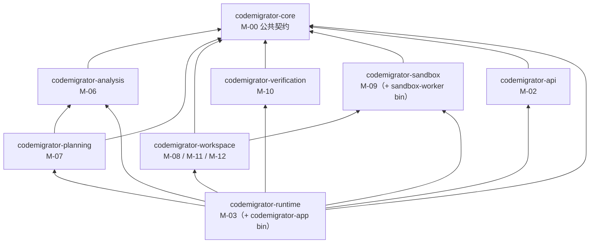
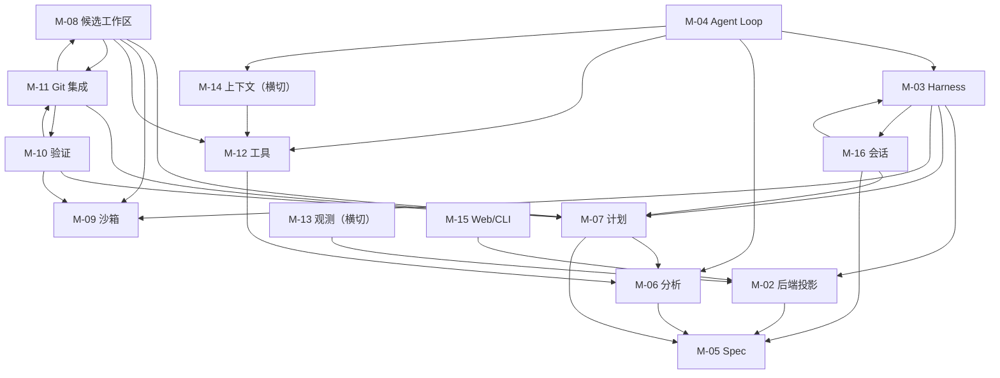
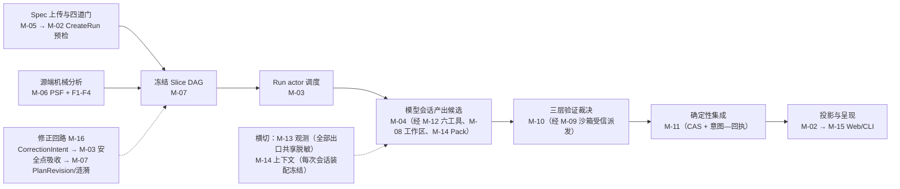
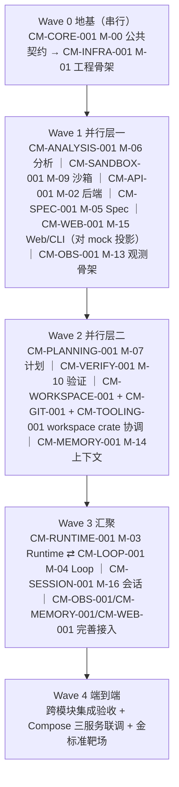

# CodeMigrator 开发任务规划与进度跟踪

> 文档定位：CodeMigrator 代码实现的跨模块任务规划、依赖分析、并行开发路线与总体进度看板（AGENTS.md §1.1 指定的整体任务规划与进度跟踪主表）。
> 代码范围：`crates/`（8 个核心 crate）+ `apps/codemigrator-cli` + `web/` + `descriptors/` + `migrations/` + `deploy/` + `tests/`。
> 当前阶段：设计基线冻结（V4），代码实现未开始（仓库尚无 `crates/`、`apps/`、`web/` 目录）。
> 总体状态：未启动（17 个任务全部"未开始"）。
> 创建日期：2026-08-26。最后更新日期：2026-08-26。
> 维护原则：总体表反映跨模块事实，模块迭代记录保存实现细节；代码、测试和进度记录必须同步更新；每次计划变更必须先与用户对齐（§8）。

---

## 0. Agent 使用与维护规则

### 0.1 开始任务前

1. 阅读本文 §7.3 主任务表确认目标任务行状态与前置依赖完成情况；前置依赖未完成或其接口未冻结时不得开工。
2. 阅读目标模块在 `my_space/codemigrator_dev_progress/<模块缩写>/` 下的迭代记录；不存在时，按 `my_space/codemigrator_dev_progress/CodeMigrator迭代记录模板.md` 创建（命名 `CM-<模块缩写>-<序号>-<描述>_迭代记录.md`，AGENTS.md §1.3）。
3. 阅读目标模块对应的设计文档（见 §2.1 索引），并核对仓库当前源码、测试与分支状态；记录与源码不一致时，以可验证源码与设计文档为准，并在本次更新中修正记录。
4. 任务开始动工时更新本文 §7.3 对应任务行：状态改为"进行中"、填写开始日期。
5. 代码更新只允许在 `feature/*` 或 `fix/*` 分支进行（从 `develop` 切出）；不得主动 commit/push，除非用户明确要求（AGENTS.md §2.3）。

### 0.2 完成任务后

1. 对照 §7.2 通用 Definition of Done 逐项核验：模块验收条款（`V-Mxx-V4-xxx`）通过、`cargo build`/`cargo test` 通过；未执行项必须明确写为"未执行"并说明原因。
2. 在模块迭代记录中按 `CodeMigrator迭代记录模板.md` 更新：变更动机、变更内容（含关键实现决策与所依据的设计文档章节或验收条款编号）、自测与验证结果、影响面与风险、后续行动。
3. 更新本文 §7.3 任务行：状态改"已完成"、填写实际完成日期、备注写证据指针（迭代记录路径与关键验证命令）。
4. 同步 §6 状态统计与 §11 更新记录（CHG 条目置顶追加）。
5. 不在本文或模块记录中写入密码、Token、Cookie、私钥、个人环境值等敏感数据（凭证统一放 `my_space/.env` 与 `my_space/model_api_key.json`）。

### 0.3 总体文档与模块记录的边界

| 记录 | 负责 | 不负责 |
|---|---|---|
| 本文 | 跨模块任务、依赖、波次、里程碑、总体状态和计划变更 | 保存每次代码修改的完整细节 |
| 模块迭代记录 | 单模块实现快照、接口、测试证据、风险和历次变更 | 代替总体依赖和跨模块里程碑 |
| 设计文档（M-00～M-16） | 目标架构、领域语义、契约和验收标准 | 声明当前代码已经实现 |
| 源码与测试 | 可验证的当前实现事实 | 单独解释完整设计背景 |

出现不一致时：以可验证源码和测试判断"当前实现"，以最新有效设计文档判断"目标行为"；必须通过 §8 变更流程消除差异。

---

## 1. 总体任务概述

### 1.1 开发目标

实现 CodeMigrator：跨语言代码迁移 Agent 系统——把源语言项目（首个语言对：TypeScript → Python，由 `descriptors/` 描述符声明）迁移为目标语言项目，产出经过三层验证与确定性集成的高质量目标代码库。

- **实现形态**：Rust 2024 Cargo workspace（8 个核心 crate），单机 Docker Compose 三服务部署：`app`（`codemigrator-app` bin：API + Run actor + 集成协调）、`sandbox-worker`（`codemigrator-sandbox-worker` bin：bubblewrap 沙箱池）、PostgreSQL（唯一控制面真相源）。
- **核心机制**：tree-sitter 源端机械分析（PSF 三层结构 + F1-F4 事实）+ 双工具链描述符（语言差异纯数据声明，`descriptors/` 目录扩展新语言对零核心代码）+ 冻结 Slice DAG 计划（契约先行的四类 Slice）+ 模型会话产出候选（六工具封闭工具面）+ 三层验证裁决（经沙箱受信派发）+ Git 确定性集成交付。
- **铁律**：模型会话只产出候选代码；验证裁决、集成与交付全部走确定性链路（P-02 裁决与自检分离）——验证由冻结检查集独立完成，Agent 无法影响检查集选择。

### 1.2 实现范围

**包含：**

- `crates/` 恰 8 个核心 crate：`codemigrator-core`（公共契约）、`codemigrator-analysis`（源端分析）、`codemigrator-planning`（计划生成）、`codemigrator-workspace`（候选工作区/Git 集成/工具网关，覆盖 M-08/M-11/M-12 三篇）、`codemigrator-verification`（验证引擎）、`codemigrator-sandbox`（沙箱与 worker 协议）、`codemigrator-runtime`（Run actor 组合根，含 `codemigrator-app` bin）、`codemigrator-api`（REST/SSE 投影）。
- 两个服务 bin：`codemigrator-app`、`codemigrator-sandbox-worker`。
- `descriptors/`：source/target 双工具链声明式资源（内置 TypeScript→Python 首对）。
- `apps/codemigrator-cli`：CLI 应用（只消费 REST/SSE 投影，不计入核心 crate 依赖图）。
- `web/`：前端可视化工作台（React + TypeScript + Vite，不计入核心 crate 依赖图）。
- `migrations/`：PostgreSQL schema 演进；`deploy/`：Compose、seccomp policy、工具链镜像 digest。
- `tests/`：contracts（跨 crate 公共契约）、recovery（ledger/Git ref/checkpoint 重建）、security（沙箱/路径/脱敏/协议）。
- 单元测试、契约测试、恢复测试、安全测试与端到端集成测试。

**不包含：**

- 新增语言对的资源建设（属 `descriptors/` 数据目录扩展，`crates/` 零改动，见 M-01 贯穿场景"新增 Java→Go"）。
- 分布式/多机部署、多租户、模型训练。
- V3 已废除体系的一切残留：插件目录与八方法进程 RPC、长度前缀帧协议、`CapabilityManifest` 能力协商、`PluginId` 进程身份、GuardedPatch、edit intent、CheckRunner 等（V-M01-V4-002 等）。

### 1.3 架构硬约束

1. `cargo metadata` 依赖图与 M-01 冻结清单 exact-match：恰好 8 个核心 crate、无环、无清单外内部依赖边；CI 违例拒绝合并（V-M01-V4-001）。
2. PostgreSQL 是唯一控制面后端（Run/Spec/Slice/dispatch/幂等/append-only `run_events` 账本）；filesystem/JSONL 不进入 feature flag、repository trait 或测试矩阵。
3. 单 app 单写者：启动时获取 PG session advisory lock，第二个 app 实例 readiness 失败且控制面写入数为零。
4. 命令面与检查集在 CreateRun 时冻结：Spec 不可变（`migration_specs` 无 UPDATE 路径）、描述符预检三码制拒绝（`DESCRIPTOR_NOT_FOUND` / `DESCRIPTOR_DIGEST_MISMATCH` / `TOOLCHAIN_IMAGE_UNAVAILABLE`）且拒绝零副作用。
5. 源快照全程零写入；输出历史为全新 Git 历史（源项目 commit 不进入交付物）。
6. 交付非 force push：固定分支名、无 `+` refspec、远端移动返回 `REMOTE_REF_MOVED`。
7. 工具面封闭：恰六工具（ReadFile/WriteFile/EditFile/QuerySourceAst/Shell/Exec），phase 授权矩阵（`core://phase-tool-policy/v2`）编译期嵌入，无用户自定义 Hook 扩展点、无第三方注册入口。
8. 验证裁决不经任何模型工具：只走裁决层 `InternalVerificationDispatch` 冻结通道（P-02）；Shell 自检是反馈不裁决。
9. 已集成 Slice 永不失效（P-10）；契约漂移修正是唯一成文受控例外且必须经人工确认门（无阈值分叉、无自动执行支路）。
10. 预算治理：预算 100% 后新模型与工具调用数为零，checkpoint/归档先于 `FAILED` 终态。
11. UDS worker 协议方法面冻结为六条（M-09 唯一定义）：`ExecuteCheck`/`CancelAttempt`/`CheckStarted`/`CheckFinished`/`CleanupComplete`/`ProtocolError`；单帧 ≤256 KiB。
12. 公共契约（状态机、枚举、错误码等）以设计文档为唯一来源，代码只允许引用、禁止复制第二套定义（AGENTS.md §2.1）。

### 1.4 当前事实快照

| 项目 | 当前状态 | 事实依据 |
|---|---|---|
| 设计文档（V4 基线） | 已完成 | `my_space/codemigrator_design_doc/architecture_module_design/` 下 M-00～M-16 共 16 篇模块文档 + 文档迭代记录 |
| 代码实现 | 未开始 | 仓库无 `crates/`、`apps/`、`web/`、`descriptors/`、`migrations/`、`deploy/`、`tests/` 目录 |
| WSL2 开发环境 | 已就绪 | Docker CE 29.7.2 + compose v5.5.0、bubblewrap 0.9.0（`--unshare-all` 冒烟通过）、Rust 1.98.0（rsproxy）、Node v24.19.0 + pnpm 11.24.0；M-09 沙箱四项前提（kernel≥5.15 / cgroup v2 / bubblewrap / userns）全部满足 |
| PostgreSQL 部署 | 待建 | 待 Wave 0 建立 compose.yaml 后部署并回填 `my_space/.env` |
| 模型 API key | 已就绪 | `my_space/model_api_key.json`（真实调用大模型测试时使用） |

> 环境明细见 `my_space/codemigrator_dev_progress/其他更新记录.md`；WSL 磁盘配额约束约 100G（大型依赖安装前预算评估）。

---

## 2. 设计基线与优先级

### 2.1 设计文档索引

17 篇设计文档位于 `my_space/codemigrator_design_doc/architecture_module_design/`（平铺存放，契约真相，V4 当前基线）：

| 编号 | 文档 | 主要约束（一句话） | 验收条款 |
|---|---|---|---|
| M-00 | CodeMigrator_垂类设计原则与架构哲学.md | 跨模块公共契约唯一 owner：状态机、枚举、稳定错误码、公共 ID 与限额、phase 工具授权、预算与保留策略、P-xx 原则 | V-M00-V4-001～017（17 条） |
| M-01 | CodeMigrator_核心目录架构设计.md | crate 物理清单与依赖方向、descriptors 资源目录、app + sandbox-worker + PostgreSQL 进程拓扑 | V-M01-V4-001～011（11 条） |
| M-02 | CodeMigrator_系统后端架构.md | REST/SSE 投影、run_events 同事务控制面、幂等边界、四种交付状态分立 | V-M02-V4-001～012（12 条） |
| M-03 | CodeMigrator_Harness总体设计.md | Run actor 单写者邮箱、DispatchAttempt 接管、崩溃恢复协调 | 无编号条款，以 10 条"可检查的运行性质"为准 |
| M-04 | CodeMigrator_Agent_Loop设计.md | 五阶段编排、EXECUTE 模型↔工具调用循环、四类会话上下文与失效 | V-M04-V4-001～022（22 条） |
| M-05 | CodeMigrator_Migration_Spec抽象层.md | Spec 四道门、canonical 规范化（RFC 8785 JCS + SHA-256）、insert-or-get 不可变留存 | V-M05-V4-001～012（12 条） |
| M-06 | CodeMigrator_代码分析与AST引擎.md | 源端 tree-sitter 只读解析、PSF 三层结构与 F1-F4 事实、机械完备层 | V-M06-V4-001～019（19 条） |
| M-07 | CodeMigrator_迁移计划生成器.md | 四类 Slice DAG 确定性派生、write scope 冻结、集成键、SCC 收缩与环拒绝 | V-M07-V4-001～014（14 条） |
| M-08 | CodeMigrator_候选工作区与工具网关.md | 候选工作区生命周期、checkpoint commit、WorkspaceFileOperation 审计账本 | V-M08-V4-001～016（16 条） |
| M-09 | CodeMigrator_沙箱与执行环境.md | UDS 六方法协议、bubblewrap + default-deny seccomp、资源三池模型、长驻沙箱卷 | V-M09-V4-001～020（20 条） |
| M-10 | CodeMigrator_验证引擎.md | 三层验证、P-09 符号级归因、flaky 重跑、结构守恒、Oracle 反向自检 | V-M10-V4-001～029（29 条） |
| M-11 | CodeMigrator_工作空间与Git集成.md | 内部 refs 体系、expected-OID CAS、集成意图—回执事务、PushGuard 交付 | V-M11-V4-001～013（13 条） |
| M-12 | CodeMigrator_工具系统与Hook.md | 六工具调用规范、路径安全门（7 规则）、write scope 双轨防护、最小审计点位 | V-M12-V4-001～018（18 条） |
| M-13 | CodeMigrator_可观测性系统.md | 核心八指标、SecretRegistry 脱敏出口、profile 是投影开关不参与裁决 | V-M13-V4-001～010（10 条） |
| M-14 | CodeMigrator_记忆与上下文管理.md | Context Pack 预算治理、ArtifactRef 外置、逐出与摘要、会话重建 | V-M14-V4-001～015（15 条） |
| M-15 | CodeMigrator_Web体验与可视化工作台.md | persona 舞台事件归约、证据页只读投影、CLI 渲染器、无障碍与性能预算 | V-M15-V4-001～029（29 条） |
| M-16 | CodeMigrator_会话与运行时修正编排.md | 会话式起草、CorrectionIntent 安全点吸收、PlanRevision、契约漂移修正协议 | V-M16-V4-001～018（18 条） |
| — | 文档迭代记录.md | 设计演进、历史决策与替代关系索引（只读参考） | — |

> 验收基线合计：编号条款 275 条 + M-03 运行性质 10 条。各任务实现完成度以对应条款为准（AGENTS.md §2.6）。

### 2.2 冲突处理顺序

1. 公共契约（状态机、枚举、错误码等）以设计文档当前版本为唯一来源；代码只允许引用，禁止复制第二套定义（AGENTS.md §2.1）。
2. 设计文档之间冲突时：M-00（公共契约）优先于各模块文档；crate 归属以 M-01 为准（已知口径差异：M-02 文中 `codemigrator-server` 与 M-01 的 `codemigrator-app` bin 命名不一，以 M-01 为准）。
3. 设计文档演进时：一切实现与解释以文档当前版本为准；实现与文档不一致须走 §8 变更流程对齐（架构设计文档修改前必须先经用户确认，AGENTS.md §2.2）。
4. 记录与源码不一致时：以可验证源码、测试与正式设计文档为准，并在本次更新中修正记录。

---

## 3. 功能模块与开发任务划分

17 个开发任务与 M-00～M-16 一一对应（**CM-<模块语义缩写>-<序号> ↔ M-0n**，如 `CM-SANDBOX-001` ↔ M-09；ID 固定不随执行顺序变化）。任务 ID 采用与 AGENTS.md §1.3 文档命名一致的语义缩写，使全篇引用自明。任务描述中的"波次"见 §5。

| 任务ID | 模块 | crate / 进程形态 | 职责摘要 | 上游依赖 | 验收基线 |
|---|---|---|---|---|---|
| CM-CORE-001 | M-00 垂类设计原则与架构哲学 | `codemigrator-core` / app | 定义全系统公共契约（唯一 owner）：Run/Slice 状态机、枚举、稳定错误码、公共 ID 与限额、phase 工具授权资源（`core://phase-tool-policy/v2`）、预算与保留策略、描述符结构契约 | 无（源头） | V-M00-V4-001～017 |
| CM-INFRA-001 | M-01 核心目录架构设计 | 工程骨架（workspace + compose + descriptors 目录） | 建立工程骨架：Cargo workspace 与 8 crate 骨架、`descriptors/` 资源目录与摘要校验、`deploy/`、compose.yaml 三服务基线 | CM-CORE-001 | V-M01-V4-001～011 |
| CM-API-001 | M-02 系统后端架构 | `codemigrator-api` + `codemigrator-runtime` 控制面 / app | 实现后端投影：REST/SSE 投影 DTO、`run_events` 同事务控制面、幂等边界、四种交付状态分立 | CM-CORE-001、CM-INFRA-001（语义消费 M-05 拒绝码、M-07 投影） | V-M02-V4-001～012 |
| CM-RUNTIME-001 | M-03 Harness 总体设计 | `codemigrator-runtime` / app | 实现 Run actor 单写者邮箱与状态归约、Slice 调度与集成协调、DispatchAttempt 接管、取消/预算/崩溃恢复 | CM-API-001、CM-PLANNING-001、CM-WORKSPACE-001、CM-SANDBOX-001、CM-VERIFY-001、CM-GIT-001、CM-TOOLING-001 | 10 条运行性质（无编号条款） |
| CM-LOOP-001 | M-04 Agent Loop 设计 | app 进程内（由 runtime Run actor 派发） | 实现五阶段编排、EXECUTE 模型↔工具箱调用循环、四类 Slice 会话上下文与失效、源码是数据不是指令（P-05） | CM-RUNTIME-001、CM-ANALYSIS-001、CM-TOOLING-001、CM-MEMORY-001 | V-M04-V4-001～022 |
| CM-SPEC-001 | M-05 Migration Spec 抽象层 | 类型落 `codemigrator-core`、HTTP 入口落 `codemigrator-api` / app | 实现 Spec 四道门语义、canonical 规范化、insert-or-get 去重与不可变留存、描述符三码制 | CM-CORE-001、CM-INFRA-001 | V-M05-V4-001～012 |
| CM-ANALYSIS-001 | M-06 代码分析与 AST 引擎 | `codemigrator-analysis` / app 进程内 | 实现源端 tree-sitter 只读解析（快照冻结）、PSF 三层结构、F1-F4 事实、`QuerySourceAst` 导航、7 天可重建投影 | CM-CORE-001、CM-SPEC-001（范围与源端描述符输入） | V-M06-V4-001～019 |
| CM-PLANNING-001 | M-07 迁移计划生成器 | `codemigrator-planning` / app（纯确定性库） | 实现四类 Slice DAG 派生、三类工件派生、依赖边与 write scope 冻结、拓扑层与集成键、环拒绝、涟漪计算 | CM-ANALYSIS-001（F1-F4 + PSF 事实）、CM-SPEC-001（Spec） | V-M07-V4-001～014 |
| CM-WORKSPACE-001 | M-08 候选工作区与工具网关 | `codemigrator-workspace` / app + 长驻沙箱卷 | 实现候选工作区生命周期、六工具执行落地、WorkspaceFileOperation 审计账本、checkpoint 提交与批量校验 | CM-PLANNING-001（write scope）、CM-SANDBOX-001（沙箱）、CM-TOOLING-001（工具门禁） | V-M08-V4-001～016 |
| CM-SANDBOX-001 | M-09 沙箱与执行环境 | `codemigrator-sandbox`（+ `codemigrator-sandbox-worker` bin）/ 独立进程 | 实现 UDS 六方法协议（owner）、active-attempt gate、bubblewrap + seccomp 隔离、命令模板实例化、资源三池、长驻沙箱卷 | CM-CORE-001 | V-M09-V4-001～020 |
| CM-VERIFY-001 | M-10 验证引擎 | `codemigrator-verification` / app | 实现三层验证编排与归约、执行事实归一、P-09 符号级归因、flaky 重跑、守恒计算、语义 fingerprint | CM-PLANNING-001（冻结检查集）、CM-SANDBOX-001（受信派发）、CM-ANALYSIS-001（归因图基础） | V-M10-V4-001～029 |
| CM-GIT-001 | M-11 工作空间与 Git 集成 | `codemigrator-workspace` / app | 实现托管输出仓库、源只读快照、内部 refs 体系、expected-OID CAS、集成意图—回执事务、PushGuard 交付 | CM-PLANNING-001（集成键）、CM-SANDBOX-001、CM-WORKSPACE-001（checkpoint 协议） | V-M11-V4-001～013 |
| CM-TOOLING-001 | M-12 工具系统与 Hook | 工具网关落 `codemigrator-workspace`、policy 落 `codemigrator-core` / app | 实现六工具调用规范（L1-L4 四层）、路径安全门（7 规则）、write scope 双轨防护、`tool.call.pre/post` 审计点位 | CM-CORE-001、CM-ANALYSIS-001（QuerySourceAst）、CM-WORKSPACE-001、CM-SANDBOX-001 | V-M12-V4-001～018 |
| CM-OBS-001 | M-13 可观测性系统 | app 进程内横切 | 实现核心八指标 descriptor、SecretRegistry 脱敏出口（全部出口共享）、60 秒 JSON 快照、本地 JSONL、可选 exporter | CM-API-001（run_events 输入源）、CM-WORKSPACE-001（沙箱终止原因） | V-M13-V4-001～010 |
| CM-MEMORY-001 | M-14 记忆与上下文管理 | app 进程内（Context Manager） | 实现 Context Pack identity 与预算档、数据块边界与 ArtifactRef 外置、逐出与摘要、会话重建（RecoveryBrief） | CM-LOOP-001（会话构成）、CM-TOOLING-001（工具输出上限） | V-M14-V4-001～015 |
| CM-WEB-001 | M-15 Web 体验与可视化工作台 | `web/` + `apps/codemigrator-cli`（不计入核心 crate 图） | 实现 persona 舞台（事件→动作归约）、语义等价证据页、报告与系统页面、CLI 多模式渲染器 | CM-API-001（REST/SSE 投影契约） | V-M15-V4-001～029 |
| CM-SESSION-001 | M-16 会话与运行时修正编排 | app 进程内 + CLI 入口 | 实现本地项目注册、MigrationSession 与 Spec 起草会话、CorrectionIntent 安全点吸收、PlanRevision、契约漂移修正协议、薄 Skill | CM-PLANNING-001（涟漪图）、CM-RUNTIME-001（安全点）、CM-SPEC-001（Spec 规则） | V-M16-V4-001～018 |

**落点说明（如实标注）：**

1. **M-08/M-11/M-12 共用 `codemigrator-workspace` 一个 crate**（M-01 明确覆盖三篇）：CM-WORKSPACE-001/CM-GIT-001/CM-TOOLING-001 可并行设计，但实现落点同一 crate，须按 §5.3 纪律 3 接口协调。
2. **M-04/M-05/M-13/M-14/M-16 无专属 crate**：M-05 公共类型落 `codemigrator-core`、上传入口落 `codemigrator-api`；M-04/M-13/M-14/M-16 为 app 进程内编排层/横切层逻辑（M-01 crate 对照表无对应行）。
3. **M-03 无 V-M03-V4-xxx 编号验收条款**：设计文档以 10 条"可检查的运行性质"清单呈现，验收以该清单为准。
4. **M-15（`web/` + CLI）只消费 REST/SSE 投影**，独立于核心 crate 依赖图（V-M01-V4-007），可对 mock 投影并行开发。
5. 任务编号固定对应模块；跨模块基础设施类新增任务（Compose 调整、CI 等）归 `infra` 分类并走 §8 变更流程新增编号。

**模块分类缩写**（同时是迭代记录/实施计划/详细设计三目录的文件夹名，AGENTS.md §1.3）：M-00/M-05→`core`、M-01→`infra`、M-02→`api`、M-03→`runtime`、M-04→`agent-loop`、M-06→`analysis`、M-07→`planning`、M-08/M-11/M-12→`workspace`、M-09→`sandbox`、M-10→`verification`、M-13→`observability`、M-14→`memory`、M-15→`web`、M-16→`session`。

---

## 4. 模块依赖关系分析

### 4.1 主依赖图

**crate 编译依赖图**（M-01 冻结清单；箭头方向 = 依赖方 → 被依赖方；`cargo metadata` 须 exact-match，V-M01-V4-001）：



**模块级依赖图**（运行时协作；箭头方向 = 依赖方 → 被依赖方，仅画主要边；M-00 为全部模块的公共契约源头，图略其到各模块的边；完整上下游见 §3 表与各设计文档）：



> 注：M-10 与 M-11、M-08 与 M-11 之间存在双向协作（验证 guard 授权集成推进 / 集成提供被检对象与 checkpoint 协议），图为运行时协作视角；crate 编译图（上图）保持无环。

### 4.2 关键调用与数据路径

一次迁移 Run 的主链路（数据流方向 = 左 → 右）：



关键路径说明：

- **控制面真相链**：M-05 Spec 冻结输入 + M-06 机械分析事实 → M-07 确定性派生冻结计划（模型不能增删边/扩大 write scope/改层位与集成序）→ M-03 Run actor 单写者调度 → M-04 会话循环消费计划派发 → 候选产出经 M-08 checkpoint 提交 → M-10 三层验证（局部/集成/最终，经 M-09 受信派发）→ M-11 集成推进 verified → M-02 投影 → M-15 呈现。
- **修正回路**：M-16 会话输入先持久化为 CorrectionIntent（可审计事实），M-03 只在安全点吸收；局部/结构修正进 M-07 PlanRevision（新 Slice 替换、永不改写冻结事实）；契约漂移经涟漪预览 + ImpactPreview 用户确认门后作废重建（已集成 Slice 永不失效的唯一受控例外）。
- **横切层**：M-13 观测消费 `run_events` 同事务投影，所有出口（JSONL/stdout/PG/SSE/报告/CLI renderer）共享同一 SecretRegistry 脱敏边界；M-14 Context Pack 在 dispatch 时冻结、预算治理约束全部模型会话。

### 4.3 必须顺序开发的依赖

| 顺序约束 | 原因 |
|---|---|
| CM-CORE-001（M-00）必须最先 | 全部模块消费其公共契约（状态机、枚举、错误码、授权矩阵）；契约未冻结即并行会复制出第二套定义 |
| CM-INFRA-001（M-01）紧随其后 | 工程骨架承载 crate 划分与依赖图 exact-match 验收；后续一切任务在骨架内落位 |
| CM-SPEC-001/CM-ANALYSIS-001/CM-SANDBOX-001/CM-API-001 可在骨架后并行 | 各自编译面仅依赖 core：M-06 crate 仅依赖 core（语义消费 M-05 范围输入）；M-09 协议面已冻结（V-M09-V4-001）且 crate 仅依赖 core；M-02 api crate 仅依赖 core；M-05 语义消费 M-00 类型 |
| CM-PLANNING-001（M-07）必须在 CM-ANALYSIS-001（M-06）之后 | 计划派生以 F1-F4 + PSF-2/PSF-3 为唯一事实输入 |
| CM-VERIFY-001（M-10）必须在 CM-PLANNING-001（M-07）冻结检查集之后 | 验证引擎消费 write scope 查表基础与 required checks 冻结全集（M-07 产物为不可变数据输入） |
| CM-WORKSPACE-001/CM-GIT-001/CM-TOOLING-001 必须在 CM-SANDBOX-001（M-09）之后 | 工作区即沙箱卷（bubblewrap 边界与长驻卷由 M-09 拥有）；工具网关 L3 Shell 落长驻沙箱卷 |
| CM-RUNTIME-001（M-03）必须在第二并行层稳定后 | runtime 是组合根（依赖全部其余 crate）；Run actor 归约消费 M-02 事件规则、M-07 DAG、M-08 工作区、M-09 UDS、M-10 验证、M-11 Git、M-12 工具 |
| CM-LOOP-001（M-04）与 CM-RUNTIME-001（M-03）协同开发 | Loop 由 actor dispatch、完成后向其移交；会话循环消费 M-06 导航与 M-14 Pack |
| CM-SESSION-001（M-16）依赖 CM-PLANNING-001 与 CM-RUNTIME-001 | 涟漪计算依赖 M-07 依赖图三步查表；CorrectionIntent 吸收依赖 M-03 安全点编排 |
| CM-WEB-001（M-15）仅依赖 CM-API-001（M-02）投影契约 | 前端零自行判定，可对 mock/替身投影并行开发；真实联调在 Wave 3/4 |

---

## 5. 并行开发规划

### 5.1 分阶段执行图



### 5.2 波次计划

| 波次 | 任务 | 并行性 | 进入条件 | 出口条件 |
|---|---|---|---|---|
| Wave 0 地基 | CM-CORE-001（M-00）→ CM-INFRA-001（M-01） | 串行为主（CM-INFRA-001 的 Compose/descriptors 资产可在 CM-CORE-001 契约冻结后同步准备） | 设计文档冻结（已完成） | V-M00-V4-001～017 通过；`cargo metadata` 依赖图 exact-match（V-M01-V4-001）与 V-M01-V4-002 零 V3 残留通过 |
| Wave 1 并行层一 | CM-ANALYSIS-001（M-06）、CM-SANDBOX-001（M-09）、CM-API-001（M-02）、CM-SPEC-001（M-05）、CM-WEB-001（M-15，对 mock 投影）、CM-OBS-001（M-13 骨架） | 六条线可并行 | Wave 0 完成 | 各自模块验收条款通过；M-05↔M-02 交叉条款（Spec 拒绝码、预检零副作用）联调通过 |
| Wave 2 并行层二 | CM-PLANNING-001（M-07）、CM-VERIFY-001（M-10）、CM-WORKSPACE-001+CM-GIT-001+CM-TOOLING-001（workspace crate 三模块协调）、CM-MEMORY-001（M-14） | 四条线可并行；workspace crate 内三任务按 §5.3 纪律 3 协调 | CM-ANALYSIS-001/CM-SANDBOX-001/CM-SPEC-001 完成 | 各自模块验收条款通过；交叉条款（V-M07-V4-007 ↔ V-M10-V4-027 在场门控、V-M08-V4-007 ↔ V-M11-V4-004 CAS 越界自纠）联调通过 |
| Wave 3 汇聚 | CM-RUNTIME-001（M-03）⇄ CM-LOOP-001（M-04）、CM-SESSION-001（M-16）、CM-OBS-001/CM-MEMORY-001/CM-WEB-001 完善接入真实链路 | M-03 与 M-04 协同；M-16 在 M-03 稳定后 | Wave 2 完成 | M-03 运行性质 10 条、V-M04-V4-001～022、V-M16-V4-001～018 通过 |
| Wave 4 端到端 | 跨模块集成验收（验收活动，不占新任务 ID） | — | 全部 17 个任务完成 | §10 总体验收场景全部通过（Compose 三服务联调、金标准靶场、Oracle 反向自检） |

### 5.3 并行开发纪律

1. **契约先行**：M-00 公共契约冻结（V-M00 条款通过）后才允许任何并行任务开工；并行任务之间只通过 core 契约类型交互，禁止私下面对面接口。
2. **接口替身须测试冻结**：并行任务消费未完成上游时用替身（stub/fake）开发；替身行为须有测试锁定，上游就绪后替换并对齐行为，防止两套语义。
3. **共享 crate 协调**：CM-WORKSPACE-001/CM-GIT-001/CM-TOOLING-001 落同一 `codemigrator-workspace` crate，须先对齐 crate 内模块边界与公共接口（建议按 M-08 → M-11 → M-12 顺序提交骨架，三任务由同一 agent 或专人协调合并）。
4. **交叉验收条款归属**：跨模块条款（如 V-M07-V4-007 ↔ V-M10-V4-027、V-M08-V4-005/007 ↔ V-M11-V4-004、V-M04-V4-013 ↔ V-M13-V4-010）在双方模块任务中都登记；联调证据放在后完成方的迭代记录，并在双方备注互相引用。
5. **禁止跨任务改表**：任何影响他人任务的变化（接口变更、验收口径变化、次序变化）必须走 §8 变更流程先与用户对齐。
6. **Git 纪律**：每个任务从 `develop` 切 `feature/<模块缩写>-<简述>` 或 `fix/<模块缩写>-<简述>` 分支；合并前编译与本地测试通过；禁止直接 push `main`/`develop` 与任何 force push（AGENTS.md §2.3/§2.4）。

---

## 6. 里程碑与总体状态

### 6.1 里程碑汇总

| 里程碑 | 内容 | 对应任务 | 状态 |
|---|---|---|---|
| MS-0 设计基线 | 17 篇 V4 设计文档冻结 | — | 已完成（2026-08-26 前） |
| MS-1 工程地基 | 公共契约 + 工程骨架（依赖图 exact-match、Compose 基线） | CM-CORE-001、CM-INFRA-001 | 未开始 |
| MS-2 基础能力层 | Spec 门禁、源端分析、沙箱执行、控制面投影可用 | CM-API-001、CM-SPEC-001、CM-ANALYSIS-001、CM-SANDBOX-001 | 未开始 |
| MS-3 计划与验证层 | 冻结计划、三层验证、工作区/Git/工具 crate 完成 | CM-PLANNING-001、CM-WORKSPACE-001、CM-VERIFY-001、CM-GIT-001、CM-TOOLING-001、CM-MEMORY-001 | 未开始 |
| MS-4 运行闭环 | 单 Run 全链路可运行（调度、会话、修正） | CM-RUNTIME-001、CM-LOOP-001、CM-SESSION-001 | 未开始 |
| MS-5 产品交付 | Web/CLI 真实联调 + 端到端验收（Wave 4） | CM-OBS-001、CM-WEB-001 完善 + 验收活动 | 未开始 |

### 6.2 状态统计

按主任务表 17 个任务计：已完成 0 / 进行中 0 / 未开始 17（完成度 0%）。
> 完成度仅为任务数量比例，不替代各任务的质量门（验收条款）；部分完成的任务按"进行中"维护并在备注注明子项完成度。

---

## 7. 总体任务进度跟踪

### 7.1 状态与日期规则

- 状态只取三值：**未开始 / 进行中 / 已完成**；阻塞情况在"备注"注明"阻塞：原因与解除条件"并同步 §9。
- 开始日期 = 任务实际动工日期（首个分支创建或首个代码提交）。
- 实际完成日期 = §7.2 Definition of Done 全部满足的日期。
- 日期格式统一 `YYYY-MM-DD`；未知信息填"—"，不得猜测。

### 7.2 通用 Definition of Done

1. 对应模块 `V-Mxx-V4-xxx` 验收条款全部通过（M-03 以 10 条"可检查的运行性质"清单为准）；在模块迭代记录中逐条勾选（如 `V-M09-V4-003 通过`）并给出证据。
2. `cargo build` 与该模块相关 `cargo test`（含契约/恢复/安全测试归属项）通过；结果摘要写入模块迭代记录。
3. 模块迭代记录已按 `my_space/codemigrator_dev_progress/CodeMigrator迭代记录模板.md` 更新（含关联任务 ID，如 `CM-SANDBOX-001`）。
4. 本表 §7.3 任务行已更新（状态、日期、备注证据指针）。
5. 需要同步的文档已同步：需求对齐结果与原设计文档不同时，必须更新冲突部分及相关文档（AGENTS.md §3.4）。

### 7.3 主任务表

| 任务ID | 任务描述 | 状态 | 开始日期 | 实际完成日期 | 备注 |
|---|---|---|---|---|---|
| CM-CORE-001 | 实现公共契约（codemigrator-core，M-00）：状态机、枚举、稳定错误码、phase 授权矩阵、公共 ID/限额、保留策略 | 未开始 | — | — | Wave 0；全部任务的上游 ；已对齐：my_space/code_alignment_record/core/CM-CORE-001-对齐记录.md |
| CM-INFRA-001 | 建立工程骨架（M-01）：Cargo workspace 8 crate + descriptors/ 资源目录 + compose.yaml 三服务基线 | 未开始 | — | — | Wave 0；依赖 CM-CORE-001 ；已对齐：my_space/code_alignment_record/infra/CM-INFRA-001-对齐记录.md（布局专项：project/CM-PROJECT-001-对齐记录.md） |
| CM-API-001 | 实现系统后端（api + 控制面，M-02）：REST/SSE 投影、run_events 同事务、幂等边界 | 未开始 | — | — | Wave 1 ；已对齐：my_space/code_alignment_record/api/CM-API-001-对齐记录.md |
| CM-RUNTIME-001 | 实现 Harness（runtime，M-03）：Run actor 单写者、调度与集成协调、接管与恢复 | 未开始 | — | — | Wave 3；无编号条款，以 10 条运行性质为验收 |
| CM-LOOP-001 | 实现 Agent Loop（M-04）：五阶段编排、EXECUTE 调用循环、会话失效 | 未开始 | — | — | Wave 3；与 CM-RUNTIME-001 协同 |
| CM-SPEC-001 | 实现 Migration Spec（M-05）：四道门、canonical 规范化、不可变留存 | 未开始 | — | — | Wave 1 |
| CM-ANALYSIS-001 | 实现代码分析与 AST 引擎（M-06）：PSF 三层、F1-F4 事实、QuerySourceAst | 未开始 | — | — | Wave 1；crate 仅依赖 core |
| CM-PLANNING-001 | 实现迁移计划生成器（M-07）：四类 Slice DAG、write scope 冻结、集成键 | 未开始 | — | — | Wave 2；依赖 CM-ANALYSIS-001 事实输入 |
| CM-WORKSPACE-001 | 实现候选工作区与工具网关（M-08）：工作区生命周期、checkpoint、审计账本 | 未开始 | — | — | Wave 2；与 CM-GIT-001/CM-TOOLING-001 共用 workspace crate |
| CM-SANDBOX-001 | 实现沙箱与执行环境（M-09）：UDS 六方法协议、bubblewrap 隔离、资源三池 | 未开始 | — | — | Wave 1；独立进程 sandbox-worker，协议面已冻结 |
| CM-VERIFY-001 | 实现验证引擎（M-10）：三层验证、P-09 归因、flaky 重跑、fingerprint | 未开始 | — | — | Wave 2 |
| CM-GIT-001 | 实现工作空间与 Git 集成（M-11）：refs 体系、CAS、集成意图—回执、交付 | 未开始 | — | — | Wave 2；与 CM-WORKSPACE-001/CM-TOOLING-001 共用 workspace crate |
| CM-TOOLING-001 | 实现工具系统与 Hook（M-12）：六工具、路径安全门、write scope 双轨、审计点位 | 未开始 | — | — | Wave 2；与 CM-WORKSPACE-001/CM-GIT-001 共用 workspace crate |
| CM-OBS-001 | 实现可观测性（M-13）：核心八指标、脱敏出口、快照与留存 | 未开始 | — | — | Wave 1 骨架 → Wave 3 完善接入 |
| CM-MEMORY-001 | 实现记忆与上下文（M-14）：Pack 预算治理、ArtifactRef 外置、逐出、会话重建 | 未开始 | — | — | Wave 2 |
| CM-WEB-001 | 实现 Web 工作台 + CLI（M-15，web/、apps/codemigrator-cli） | 未开始 | — | — | Wave 1 对 mock 投影 → Wave 3 真实联调 |
| CM-SESSION-001 | 实现会话与运行时修正编排（M-16）：起草会话、安全点吸收、契约漂移修正 | 未开始 | — | — | Wave 3 |

---

## 8. 变更管理流程

> agent 因开发实际情况需要动态变更时，**每次变更必须先与用户对齐并记录变更原因、内容和影响范围**，禁止未经对齐自行改表。

### 8.1 需要对齐的变更场景

1. 新增任务、删除任务或调整任务编号映射。
2. 调整任务执行次序或波次归属。
3. 修改模块依赖关系或并行开发规划。
4. 验收标准（验收条款口径、DoD）调整。
5. 实现范围变化（§1.2 包含/不包含调整）。
6. 设计文档演进导致任务重定义。
7. 其他影响任务计划、进度或他人工作的动态变更。

### 8.2 固定流程

1. agent 发现需要变更 → **使用提问工具与用户对齐**（说明变更原因、内容、影响范围与可选方案）。
2. 用户确认后 → 更新本文相关章节（§3 任务表 / §4 依赖图 / §5 波次 / §6 里程碑 / §7.3 任务行）。
3. 在 §8.3 变更记录表登记一条记录（原因 / 内容 / 影响范围 / 对齐确认）。
4. 在 §11 更新记录置顶追加 CHG 条目。
5. 同步受影响的模块迭代记录；涉及设计文档修改的须另行经用户确认后同步（AGENTS.md §2.2：架构模块设计文档修改前必须先与用户对齐）。

### 8.3 变更记录表

| 日期 | 变更原因 | 变更内容 | 影响范围 | 对齐确认 |
|---|---|---|---|---|
| 2026-08-26 | 任务 ID 纯流水号（T-B001～T-B017）无法自明反映内容，被全篇引用时难以辨识 | 将 17 个任务 ID 重命名为语义缩写 CM-<模块缩写>-<序号>（如 CM-SANDBOX-001↔M-09）；任务描述/职责摘要改为动词开头的实现式表述；全篇引用统一同步 | §3 任务表、§4.3 依赖表、§5 波次（含图）、§6 里程碑、§7.3 主任务表、§9 风险表、CHG-01 | 提问工具确认：方案 A 全语义缩写 + 动词开头 + 不新增列（用户答复） |

### 8.4 新变更记录模板

```markdown
### CHG-YYYYMMDD-NN：<简短、可检索的标题>

- 时间：YYYY-MM-DD
- 变更类型：任务新增 / 任务删除 / 次序调整 / 依赖修改 / 范围调整 / 验收口径调整 / 文档修正
- 变更原因：<触发条件与理由>
- 变更内容：<具体变化点，注明涉及的任务 ID 与章节>
- 影响范围：<受影响的任务、章节、文档与里程碑>
- 对齐确认：<与用户对齐的方式与结论>
- 验证：<核验方式与结果>
- 后续行动：<明确的下一步；没有则写"无">
```

---

## 9. 风险、阻塞与外部依赖

| ID | 类型 | 级别 | 描述 | 影响 | 缓解措施 |
|---|---|---|---|---|---|
| R-01 | 外部依赖 | 高 | PostgreSQL 未部署（待 compose.yaml 建立后接入） | CM-API-001/CM-RUNTIME-001 等控制面任务无法联调 | Wave 0 CM-INFRA-001 建立 compose.yaml 后部署并回填 `my_space/.env` |
| R-02 | 外部依赖 | 中 | 模型 API 真实调用（key 已就绪于 `my_space/model_api_key.json`） | CM-LOOP-001/CM-MEMORY-001/CM-SESSION-001 会话类任务需真实 token 计数与行为验证 | 按 AGENTS.md §1.2 使用 key 测试；早期用 provider adapter 替身开发 |
| R-03 | 技术风险 | 中 | tree-sitter grammar 动态库缺陷拖垮 app 进程 | CM-ANALYSIS-001 分析任务稳定性 | 按 M-01/M-06 设计：`grammar_sha256` 缓存句柄、每 grammar 熔断器（连续两次崩溃熔断为 `ANALYSIS_INFRA_ERROR`）、单文件 64 MiB 前置上限 |
| R-04 | 计划风险 | 中 | workspace crate 三模块（M-08/M-11/M-12）共用落点的接口协调 | Wave 2 并行效率与合并冲突 | §5.3 纪律 3：先对齐 crate 内边界，按 M-08 → M-11 → M-12 顺序提交骨架 |
| R-05 | 资源约束 | 低 | WSL 磁盘配额约 100G（VHDX 动态上限，用户已设约束） | 工具链镜像与构建缓存安装 | 大型依赖安装前按 100G 配额预算评估（见 `其他更新记录.md`） |
| R-06 | 口径风险 | 低 | 设计文档间命名口径差异（M-02 `codemigrator-server` vs M-01 `codemigrator-app`） | 任务理解偏差 | §2.2 冲突处理顺序：以 M-01 为准；发现新差异走 §8 变更流程登记 |

> 任务被阻塞时在 §7.3 备注注明"阻塞：原因与解除条件"，解除后更新本表与任务行。

---

## 10. 总体验收场景

1. **全链路冒烟**：TypeScript→Python 语言对，Spec 上传（四道门）→ CreateRun 预检（三码制零副作用）→ 源端分析 → 冻结计划 → 至少一个契约 Slice 与实现 Slice 集成 → 三层验证 → verified 推进 → 报告/交付投影（对应 V-M02/V-M07/V-M10/V-M11 关键条款）。
2. **崩溃恢复**：任一环节终止 app/worker 后重启，控制面账本、Git refs、checkpoint 恢复一致（`tests/recovery/`；M-03 运行性质、V-M11-V4-008）。
3. **安全边界**：路径安全门样本（绝对路径/`..`/`.git`/symlink/跨根跨挂载全部 `PATH_DENIED`）、沙箱逃逸尝试、脱敏四种编码哨兵全零命中（`tests/security/`；V-M12-V4-011、V-M13-V4-005）。
4. **依赖图完整性**：`cargo metadata` 与 M-01 冻结清单 exact-match；全文档与依赖图零 V3 残留扫描（V-M01-V4-001/002）。
5. **金标准靶场**：click-video 冻结快照分析金标准——机械层 import 边集召回率 100%、Static 误报 0（V-M06-V4-019）；Oracle 反向自检注入已知缺陷必须 Failed（V-M10-V4-028）。
6. **观测与体验**：默认 profile 全关的 Run 仍到达合法终态且核心快照完整（V-M13-V4-001）；CLI 可全程无浏览器创建/追踪/取消/查看，Web 无 CreateRun/Cancel/Git 写入口（V-M15-V4-001）。

---

## 11. 更新记录

> 每次完成任务或计划变更后在本标题下方置顶追加 CHG 条目（模板见 §8.4）；最新记录在最上方。

### CHG-20260826-02：任务 ID 语义化重命名与描述动词化

- 时间：2026-08-26
- 变更类型：任务名称调整（编号映射）
- 变更原因：原任务 ID（T-B001～T-B017）为纯流水号，被 §4.3/§5 波次/备注大量引用时无法自明所指内容，需对齐参考表（`ref/harness_dev_progress/Harness开发任务规划与进度跟踪.md` 的 `HC-<模块缩写>-<序号>` 语义化命名）形式，使全篇引用即可辨识。
- 变更内容：17 个任务 ID 由 `T-B00n` 重命名为语义缩写 `CM-<模块缩写>-<序号>`，映射如下：M-00→CM-CORE-001、M-01→CM-INFRA-001、M-02→CM-API-001、M-03→CM-RUNTIME-001、M-04→CM-LOOP-001、M-05→CM-SPEC-001、M-06→CM-ANALYSIS-001、M-07→CM-PLANNING-001、M-08→CM-WORKSPACE-001、M-09→CM-SANDBOX-001、M-10→CM-VERIFY-001、M-11→CM-GIT-001、M-12→CM-TOOLING-001、M-13→CM-OBS-001、M-14→CM-MEMORY-001、M-15→CM-WEB-001、M-16→CM-SESSION-001。同时将 §3 职责摘要与 §7.3 任务描述改为动词开头的实现式表述（如「实现沙箱与执行环境（M-09）…」）。ID 与模块编号的对应关系不变。
- 影响范围：§3 任务表、§4.3 顺序依赖表、§5.1 分阶段图与 §5.2 波次计划、§5.3 纪律、§6 里程碑、§7.2 DoD 措辞、§7.3 主任务表、§9 风险表、§11 CHG 更新记录（旧 ID 全部替换，全篇无 T-B 残留）。
- 对齐确认：与用户通过提问工具对齐——采用方案 A（全语义缩写）+ 动词开头描述 + 不新增「任务名称」列，并要求全篇同步检查。
- 验证：grep 全篇确认无 `T-B0` 残留；新旧映射逐条核对；§3/§4.3/§5/§6/§7.3/§9 全部引用一致。
- 后续行动：无（编号映射与执行顺序均保持不变，押后任务启动不受影响）。

### CHG-20260826-01：建立开发任务规划与进度跟踪主表

- 时间：2026-08-26
- 变更类型：文档新增
- 变更原因：17 篇 V4 设计文档冻结、进入代码实现阶段，需要总控文档指导 agent 依据设计文档有序实现代码、跟踪进度并管理实施期动态变更（用户指令：设计并编写 CodeMigrator 代码实现的任务规划与进度跟踪文档）。
- 变更内容：依据 M-00～M-16 设计文档与 AGENTS.md 建立本主表：总体任务概述（目标/范围/硬约束/事实快照）、17 个任务划分（CM-CORE-001～CM-SESSION-001，编号固定对应 M-00～M-16）、依赖关系分析（crate 编译依赖图 + 模块协作图 + 主链路数据流图 + 顺序依赖表）、Wave 0～4 并行开发规划、六字段进度跟踪主任务表（初始全部"未开始"）、变更管理流程（提问工具对齐 + 原因/内容/影响范围登记）。
- 影响范围：`my_space/codemigrator_dev_progress/CodeMigrator开发任务规划与进度跟踪.md`（由 0 字节占位填充为本内容；原"总体进度.md"已在前次会话更名沿革至此文件名，位置符合 AGENTS.md §1.1 主表指定路径）。
- 对齐确认：用户已通过 spec 审阅批准（`.trae/specs/write-cm-dev-plan/spec.md`，change-id：write-cm-dev-plan）。
- 验证：对照 spec checklist 逐项核验——用户指定六要素齐全（总体任务概述/模块划分/依赖关系分析（图表）/并行开发规划/进度跟踪机制（六字段表）/变更管理流程）；17 个模块全覆盖且验收条款计数（编号 275 条 + M-03 运行性质 10 条）与设计文档逐一致；主任务表字段恰为"任务ID、任务描述、状态、开始日期、实际完成日期、备注"；未修改 architecture_module_design 下任何设计文档。
- 后续行动：从 CM-CORE-001（M-00 公共契约）启动 Wave 0 地基开发。
