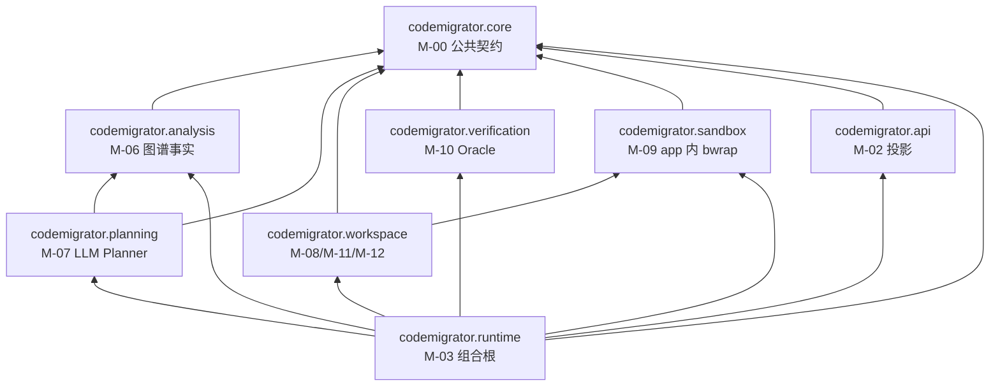
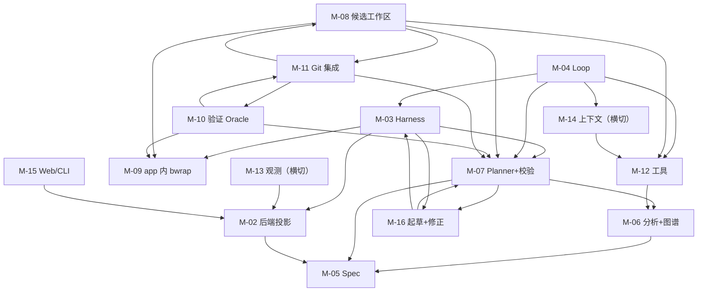
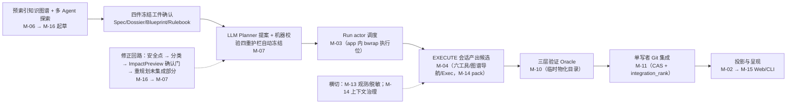
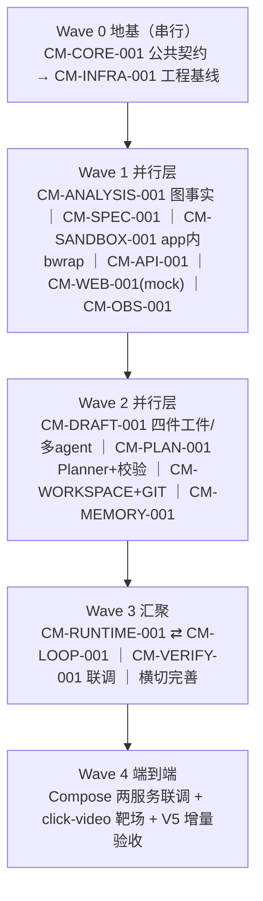

# CodeMigrator 开发任务规划与进度跟踪

> 文档定位：CodeMigrator 代码实现的跨模块任务规划、依赖分析、并行开发路线与总体进度看板（AGENTS.md §1.1 指定的整体任务规划与进度跟踪主表）。
> 架构基线：**V5（Python 版）**。跨语言代码迁移 Agent，确定性当裁判、LLM 当建筑师；单一 app + PostgreSQL 部署拓扑，8 个 Python 子包 src-layout 单包。
> 代码范围：`src/codemigrator/`（8 子包）+ `apps/codemigrator-cli` + `web/` + `descriptors/` + `migrations/` + `deploy/` + `tests/` + `pyproject.toml` + `compose.yaml`。
> 当前阶段：V5 设计文档冻结（align\_records 定稿），代码实现未开始（仓库尚无 `src/`、`apps/`、`web/` 目录）。
> 总体状态：未启动（16 个任务全部"未开始"）。
> 创建日期：2026-08-28（V5 重写版）。最后更新日期：2026-08-28。
> 维护原则：总体表反映跨模块事实，模块迭代记录保存实现细节；代码、测试和进度记录必须同步更新；每次计划变更必须先与用户对齐（§8）；V5 开放实施项标注"待定"不得臆造为事实。

***

## 0. Agent 使用与维护规则

### 0.1 开始任务前

1. 阅读本文 §7.3 主任务表确认目标任务行状态与前置依赖完成情况；前置依赖未完成或其接口未冻结时不得开工。
2. 阅读目标模块在 `my_space/codemigrator_dev_progress/<模块缩写>/` 下的迭代记录；不存在时先依据 `my_space/codemigrator_dev_progress/CodeMigrator迭代记录模板.md` 创建（命名 `CM-<模块缩写>-<序号>-<描述>_迭代记录.md`，AGENTS.md §1.3）。
3. 阅读目标模块对应的 V5 设计文档（见 §2.1 索引）与 `architecture_module_design/align_records.md`，核对仓库当前源码、测试与分支状态；记录与源码/设计不一致时，以可验证源码与当前有效设计文档为准，并在本次更新中修正记录。
4. 任务开始动工时更新本文 §7.3 对应任务行：状态改为"进行中"、填写开始日期。
5. 代码更新只允许在 `feature/*` 或 `fix/*` 分支进行（从 `develop` 切出）；不得主动 commit/push，除非用户明确要求（AGENTS.md §2.3）。

### 0.2 完成任务后

1. 对照 §7.2 通用 Definition of Done 逐项核验：运行对应子包 pytest 测试、import-linter 契约检查与 CI 静态审查；未执行项必须明确写为"未执行"并说明原因。
2. 在模块迭代记录中按 `CodeMigrator迭代记录模板.md` 更新：变更动机、变更内容（含关键实现决策与所依据的 V5 设计文档章节/验收条款编号）、自测与验证结果、影响面与风险、后续行动。
3. 更新本文 §7.3 任务行：状态改"已完成"、填写实际完成日期、备注写证据指针（迭代记录路径与关键验证命令）。
4. 同步 §6 状态统计与 §11 更新记录（CHG 条目置顶追加）。
5. 不在本文或模块记录中写入密码、Token、Cookie、私钥、个人环境值等敏感数据（凭证统一放 `my_space/.env` 与 `my_space/model_api_key.json`）。

### 0.3 总体文档与模块记录的边界

| 记录                                        | 负责                           | 不负责           |
| ----------------------------------------- | ---------------------------- | ------------- |
| 本文                                        | 跨模块任务、依赖、波次、里程碑、总体状态和计划变更    | 保存每次代码修改的完整细节 |
| 模块迭代记录                                    | 单模块实现快照、接口、测试证据、风险和历次变更      | 代替总体依赖和跨模块里程碑 |
| 设计文档（M-00～M-16 + align\_records + 文档迭代记录） | 目标架构、领域语义、契约和验收标准（V5 当前生效口径） | 声明当前代码已经实现    |
| 源码与测试                                     | 可验证的当前实现事实                   | 单独解释完整设计背景    |

出现不一致时：以可验证源码和测试判断"当前实现"，以最新有效设计文档判断"目标行为"；必须通过 §8 变更流程消除差异。V5 开放实施项（Blueprint 字段、机器校验拒绝码、图谱存储等）必须以"待定"处理，不得臆造为实现事实。

***

## 1. 总体任务概述

### 1.1 开发目标

实现 CodeMigrator：跨语言代码迁移 Agent 系统（V5）——把源语言项目（首个语言对由 `descriptors/` 声明）全量翻译为目标语言新项目，产出经过三层验证与确定性集成的目标代码库。

- **实现形态**：Python 3.12+ 单包 src-layout，`src/codemigrator/` 下恰 8 个固定子包（`core/analysis/planning/workspace/verification/sandbox/runtime/api`），uv 管理，import-linter 强制层间依赖；部署拓扑为 **app + PostgreSQL 两服务**（`compose.yaml`）。
- **核心机制（V5）**：
  - **起草期**：预索引知识图谱（符号+调用图+FTS+impact，codegraph 式）支持按模块/目录域的只读多 Agent 探索；主起草会话归并产出**四件冻结工件**（Spec / UnderstandingDossier / TargetProjectBlueprint / MigrationRulebook），用户一次确认后冻结。
  - **规划期**：**LLM Planner** 消费四件冻结工件与 M-06 图事实，提出 Slice/边/write scope/integration\_rank；**机器校验器**四重确定性护栏（互斥性 / Blueprint 符合性 / 源覆盖完备 / 无环+规模）通过即自动冻结，不逐 Slice 询问用户。
  - **执行期**：封闭六工具（ReadFile/WriteFile/EditFile/QuerySourceAst/Shell/Exec，QuerySourceAst 增强为图谱导航），app 直接管理 bwrap（PDEATHSIG/cgroup/命名空间），Slice 长期沙箱卷保留构建缓存；write scope 由 Planner 提案 + 机器校验冻结。
  - **验证期**：三层确定性 Oracle（LocalCandidate/ProspectiveIntegration/FinalVerified）保留为护城河；fingerprint / flaky / P-09 符号级归因 / 结构守恒 / 行为 parity / GENERATED 双档。
  - **修正协议**：运行期结构修正走安全点 → 分类 → ImpactPreview 用户确认 → 重规划未集成部分；已集成 verified 永不回写。
  - **用户介入点收敛为两处**：起草期四件工件确认 + 运行期结构修正/契约漂移 ImpactPreview 确认。规划期全自动。

### 1.2 实现范围

**包含：**

- `src/codemigrator/` 下 8 个子包：core（公共契约）、analysis（源端分析+知识图谱）、planning（LLM Planner+机器校验器）、workspace（候选工作区/Git/工具网关）、verification（验证引擎）、sandbox（app 内 bwrap 适配）、runtime（Run actor 组合根）、api（REST/SSE 投影）。
- `apps/codemigrator-cli`（CLI，只消费 REST/SSE）、`web/`（前端工作台，只消费 REST/SSE 投影）。
- `descriptors/`（source/target 双工具链声明式资源）、`migrations/`（PostgreSQL schema）、`deploy/`（Compose/seccomp/镜像 digest）、`tests/`（contracts/recovery/security）。
- `compose.yaml`（app+PostgreSQL 基线；MinIO/观测组件为可选 profile）、`pyproject.toml`（uv 单包清单、import-linter 配置、`[project.scripts]` 仅 `codemigrator-app`）。
- 单元测试、契约测试、恢复/安全测试、V5 增量验收。

**不包含：**

- 新增语言对的资源建设（属 `descriptors/` 数据扩展，核心子包零 diff）。
- 分布式/多机部署、多租户、模型训练。
- 已退场体系的残留：独立 sandbox-worker 进程、UDS/Protobuf 六方法协议、overlay grant 授权链（V5 退场，warehouse/代码零残留）、V3 插件进程（八方法 RPC/长度前缀帧/CapabilityManifest/PluginId）、CheckRunner 作为 Agent 工具、GuardedPatch、机械 DAG 派生管线。

### 1.3 架构硬约束

1. **公共契约单一定义**：状态机/枚举/错误码/Phase 工具授权矩阵（`core://phase-tool-policy/v2`）以 M-00 为唯一 owner；下游只准引用、禁止复制第二套（AGENTS.md §2.1）。
2. **Python 8 子包+import-linter 契约**：依赖方向 `runtime→全部；analysis/planning/workspace/verification/sandbox/api→core；planning→analysis；workspace→sandbox`；与冻结清单 exact-match，CI 违例拒绝合并（V-M01-V4-001 追溯语义 V5 延续为 import-linter exact-match）；`runtime` 之外任何子包不读环境、不建后台任务。
3. **部署拓扑 app+PostgreSQL 两服务**：独立 sandbox-worker/UDS/overlay 退场；app 直接管理 bwrap（PDEATHSIG + cgroup + 命名空间）。
4. **确定性当裁判、LLM 当建筑师**：规划/探索/结构层可 LLM 化；验证层（三层 Oracle、fingerprint、flaky 归一、P-09 归因）保持确定性且为唯一裁决。
5. **四件冻结工件在起草期一次确认**：CreateRun 预检（描述符/grammar/镜像三段摘要）通过后才创建；Spec 进入 Run 后不可变。
6. **计划自动冻结**：机器校验四重护栏通过即生效，用户不逐 Slice 确认；已完成 Slice 永不失效（P-10），契约漂移修正是唯一受控例外且必须经人工确认门。
7. **源项目严格只读**：源快照全程零写入；输出只进托管输出仓库 new 历史（源 commit 不进交付物）。
8. **工具面封闭**：恰六工具；VERIFY/REPORT 空集合（`TOOL_PHASE_DENIED`）；路径安全门 7 规则（内核约束 O\_NOFOLLOW/RESOLVE\_\*）；无用户自定义 Hook 扩展点。
9. **write scope 双轨防护**：结构化工具事前逐写拦截 + Shell 写效果由 checkpoint 批量校验；拒绝零副作用。
10. **Git CAS 单写者集成**：集成只按冻结 `integration_rank ASC → SliceId ASC` 串行推进，expected-OID CAS 防并发改写；交付 non-force push。
11. **预算治理**：预算 100% 后新模型与工具调用数为零，checkpoint/归档先于 FAILED 终态。
12. **脱敏统一出口**：所有出口共享 SecretRegistry 脱敏边界；观测是投影不是真相，故障只增 dropped 不改 RunStatus。
13. **语言映射口径唯一 owner**：Rust→Python 映射决策表在 M-01「语言基线与映射决策」节，其余文档只引用不复制。

### 1.4 当前事实快照

| 项目            | 当前状态 | 事实依据                                                                                       |
| ------------- | ---- | ------------------------------------------------------------------------------------------ |
| V5 设计文档       | 已冻结  | `architecture_module_design/` 下 M-00～M-16 V5 对齐版 + align\_records.md + 文档迭代记录.md（Python 版） |
| 代码实现          | 未开始  | 仓库尚无 `src/`、`apps/codemigrator-cli`、`web/`、`descriptors/` 等目录                              |
| WSL2 开发环境     | 部分就绪 | Docker CE + compose、Rust 工具链（历史）；**Python 3.12+/uv 环境待建**（V5 切换到 Python，见其他更新记录与 .env）     |
| PostgreSQL 部署 | 未建   | 待 CM-INFRA-001 建 compose.yaml（app+PG）后部署并回填 `my_space/.env`                                |
| 模型 API key    | 已就绪  | `my_space/model_api_key.json`（LLM Planner/多 Agent/Exec 测试用）                                |
| 旧对齐记录         | 待重做  | 此前基于 Rust V4/V5 前设计生成的对齐记录（CM-CORE/INFRA/API/SPEC 等），登记影响、在新主文档定稿后按 V5 重做（押后）              |

> 环境明细见 `my_space/codemigrator_dev_progress/其他更新记录.md`；WSL 磁盘配额约束约 100G。

***

## 2. 设计基线与优先级

### 2.1 设计文档索引

V5 设计文档位于 `my_space/codemigrator_design_doc/architecture_module_design/`（契约真相，V5 当前基线）：

| 编号   | 文档                                  | 主要约束（V5 一句话）                                                                    |
| ---- | ----------------------------------- | ------------------------------------------------------------------------------- |
| M-00 | CodeMigrator\_垂类设计原则与架构哲学.md        | 公共契约唯一 owner：状态机/枚举/稳定错误码/phase 授权矩阵；V5 确定性与 LLM 分工、"裁判保留 建筑师放开"                |
| M-01 | CodeMigrator\_核心目录架构设计.md           | Python 8 子包 + import-linter + descriptors + app+PG 拓扑唯一 owner；语言映射决策表           |
| M-02 | CodeMigrator\_系统后端架构.md             | REST/SSE 投影、run\_events 同事务、幂等边界、四投影分立                                          |
| M-03 | CodeMigrator\_Harness总体设计.md        | Run actor 单写者、内联 bwrap 调度、接管与恢复；10 条"可检查运行性质"                                   |
| M-04 | CodeMigrator\_Agent\_Loop设计.md      | 五阶段编排、EXECUTE 调用循环、六工具授权、Exec 编排、会话隔离                                           |
| M-05 | CodeMigrator\_Migration\_Spec抽象层.md | Spec v3 能力门、canonical 规范化、不可变留存；V5 简化衔接待定                                       |
| M-06 | CodeMigrator\_代码分析与AST引擎.md         | F1-F4/PSF、**预索引知识图谱**、QuerySourceAst 图谱导航、重建投影                                  |
| M-07 | CodeMigrator\_迁移计划生成器.md            | **LLM Planner + 机器校验四重护栏**、PlanProposal/PlanValidation、integration\_rank、契约漂移涟漪 |
| M-08 | CodeMigrator\_候选工作区与工具网关.md         | 候选工作区（沙箱卷）、checkpoint、六工具执行落地、审计账本                                              |
| M-09 | CodeMigrator\_沙箱与执行环境.md            | **app 内 bwrap 适配**、长期 Slice 卷、验证临时物化目录、三池资源；V5 验收基线待补                           |
| M-10 | CodeMigrator\_验证引擎.md               | 三层 Oracle、fingerprint、flaky、P-09 归因、守恒、parity、GENERATED 双档（护城河保留）               |
| M-11 | CodeMigrator\_工作空间与Git集成.md         | Git refs 模型、expected-OID CAS、单写者集成、non-force 交付                                 |
| M-12 | CodeMigrator\_工具系统与Hook.md          | 六工具 closed-schema、路径安全门、write scope 双轨、图谱导航增强、Exec                              |
| M-13 | CodeMigrator\_可观测性系统.md             | 核心八指标、SecretRegistry 脱敏出口、快照/JSONL、可选 exporter                                  |
| M-14 | CodeMigrator\_记忆与上下文管理.md           | Context Pack 预算治理、ArtifactRef 外置、逐出、会话重建；V5 起草上下文                               |
| M-15 | CodeMigrator\_Web体验与可视化工作台.md       | persona 舞台事件归约、证据页只读投影、CLI 多模式；V5 起草确认视图                                        |
| M-16 | CodeMigrator\_会话与运行时修正编排.md         | **起草期多 Agent 探索 + 四件工件确认**、修正协议、ImpactPreview、契约漂移、模块变更账本                       |
| —    | align\_records.md                   | V5 方向定稿记录（fb.txt 批评 → 六个决策点 → V5 骨架/保留·退场·新增清单/开放事项）                            |
| —    | 文档迭代记录.md                           | Python 版演进记录与基线沿革（V4→V5）；语言映射口径以 M-01 为唯一 owner                                 |
| —    | fb.txt                              | 本轮对齐输入（用户对 V4 的五点批评与 V5 重构意向），已沉淀进 align\_records                               |

### 2.2 冲突处理顺序

1. 公共契约（状态机、枚举、错误码等）以当前设计文档为唯一来源；只允许引用，禁止复制第二套定义（AGENTS.md §2.1）。
2. **V5 为当前生效基线**；V4 追溯项（`V-Mxx-V4-xxx` 标注"追溯/历史"）不重新定义当前契约，仅作机制来源参考。V5 增量（各篇"V5 可验收增量"/V-M07-V5-xxx）为当前验收口径。
3. **验收条款口径不一致的处理**：各篇 V5 文档对 V4 条款的标注不完全统一（部分标"追溯/已退役"、部分仍"可施工"）。本文档以各篇**头部"V5 当前对齐"段与 V5 增量块为当前生效依据**；存在歧义（如 M-09 误将仍生效的 bwrap 条款标"已退役"）时，以 M-01/app 内 bwrap 拓扑与 V5 架构方向裁决，并作为开放项在 §9/变更流程登记。
4. 设计文档演进时：一切实现与解释以文档当前版本为准；实现与文档不一致须走 §8 变更流程对齐（架构文档修改前必须先经用户确认，AGENTS.md §2.2）。
5. **V5 开放实施项**（Blueprint 字段、机器校验拒绝码、知识图谱物理存储/增量、探索预算/扇出、Spec-v3 简化映射、Shell 代理细节、Exec 引擎选型等）一律标"待定"，不作为验收依据，不得臆造为事实（align\_records §1.6）。

***

## 3. 功能模块与开发任务划分

16 个开发任务按 V5 阶段聚合，任务 ID 沿用 `CM-<模块缩写>-001` 风格（ID 与模块缩写对应稳定；个别任务覆盖多个 M-xx，见"覆盖 M-xx"列）。任务执行顺序与波次见 §4.3/§5。

| 任务ID             | 名称                   | 覆盖 M-xx                  | 子包/形态                                                     | 职责摘要（V5）                                                                                        | 关键 V5 机制                                                                   | 上游依赖                                         | 验收口径                                                           |
| ---------------- | -------------------- | ------------------------ | --------------------------------------------------------- | ----------------------------------------------------------------------------------------------- | -------------------------------------------------------------------------- | -------------------------------------------- | -------------------------------------------------------------- |
| CM-CORE-001      | Python 公共契约层         | M-00                     | `core` 子包                                                 | 全系统公共契约唯一 owner：ID/状态机/枚举/稳定错误码/Phase 授权矩阵/类型族/派生纯函数                                            | core://phase-tool-policy/v2 资源；Blueprint/PlanValidation 类型幂待定；确定性当裁判       | 无（源头）                                        | V5 增量（起草四件工件/多agent/Planner校验/内联bwrap/ImpactPreview）；M-01 追溯承载 |
| CM-INFRA-001     | 工程基线                 | M-01                     | src-layout + 8 子包 + pyproject/compose/migrations/tests/CI | Python 单包骨架、uv、import-linter 配置、descriptors 首对、compose.yaml(app+PG)、migrations 工具、tests 三子目录、CI | import-linter exact-match；app+PG 两服务；\[project.scripts] 仅 codemigrator-app | CM-CORE-001                                  | import-linter exact-match；V5 可验收增量（两服务拓扑/bwrap 适配/描述符职责）       |
| CM-SPEC-001      | Migration Spec 能力门   | M-05 (+M-02 入口)          | core 类型 + api 入口                                          | Spec v3 四道门、canonical 规范化、insert-or-get 不可变留存、描述符三码拒绝                                           | Spec v3 简化与 Blueprint 职责切分待定；能力门预算                                         | CM-CORE-001、CM-INFRA-001                     | V-M05-V4-001\~012（保留语义）；V5 衔接待定项                               |
| CM-ANALYSIS-001  | 源端分析与知识图谱            | M-06                     | `analysis` 子包                                             | F1-F4 事实、PSF 三层、**预索引知识图谱**（符号+调用图+FTS+impact）、QuerySourceAst 图谱导航、重建投影                         | 图谱物理存储/增量刷新/FTS 待定；PSF-2 符号级索引                                             | CM-CORE-001、CM-SPEC-001                      | V-M06-V4-001\~019（含金标准靶场）；V5 增量（图/QSA 增强）                      |
| CM-DRAFT-001     | 起草期多 Agent 理解与四件工件   | M-16 起草 + M-04 起草 + M-14 | app 内编排                                                   | 知识图谱读多 Agent 域扇出探索、主会话归并、**四件工件**（Spec/Dossier/Blueprint/Rulebook）一次确认冻结                        | 多 Agent 探索（零直连/结构化报告/冲突标记）；Blueprint 字段待定；探索预算待定                           | CM-ANALYSIS-001、CM-CORE-001                  | V-M16-V4-012/013/014（起草零写/未确认零副作用/能力门）；V5 上岗                   |
| CM-PLAN-001      | LLM Planner + 机器校验器  | M-07                     | `planning` 子包                                             | LLM 消费四件冻结输入+图事实 → 提议 Slice/边/write scope/integration\_rank；机器校验四重护栏自动冻结                        | 四重护栏（互斥/蓝图符合/源覆盖/无环+规模）；PlanProposal/PlanValidation；拒绝码待定                  | CM-DRAFT-001、CM-ANALYSIS-001                 | V-M07-V5-001\~004                                              |
| CM-WORKSPACE-001 | 候选工作区与工具网关           | M-08 + M-12 执行面          | `workspace` 子包                                            | 候选工作区（沙箱卷）生命周期、六工具执行落地、checkpoint、审计账本、write scope 双轨                                           | 工作区即沙箱卷；checkpoint.pre 批量校验；WriteScope 域                                   | CM-PLAN-001、CM-SANDBOX-001                   | V5 增量（独立卷/ws 域冻结/checkpoint/CAS）；M-08 V5 增量 5 条                |
| CM-SANDBOX-001   | 内联 bwrap 沙箱适配        | M-09                     | `sandbox` 子包（app 内，无独立 entry）                             | app 内直接管理 bwrap/cgroup/命名空间、Slice 长期卷、验证临时物化目录、三池资源、差异化网络                                       | PDEATHSIG/cgroup/命名空间；长期卷；临时物化；default-deny seccomp；Shell 受控代理（细节待定）       | CM-CORE-001、CM-INFRA-001                     | M-09 验收基线待补（V4 已退役块中 bwrap/资源/网络条款应重编为 V5）；V5 增量建议 6 条         |
| CM-GIT-001       | 工作空间与 Git 集成         | M-11                     | `workspace` 子包                                            | 托管输出仓库、源只读快照、内部 refs、expected-OID CAS 单写者集成、non-force 交付、托管输出 export                            | integration\_rank 唯一集成序；CAS；恢复铰链 IntegrationIntent                         | CM-PLAN-001、CM-WORKSPACE-001、CM-ANALYSIS-001 | V5 增量 4 条（源零写/独立 candidate+CAS/冻结序/PlanRevision）               |
| CM-VERIFY-001    | 验证引擎（三层 Oracle）      | M-10                     | `verification` 子包                                         | 三层验证、fingerprint、flaky 归一二、P-09 符号级归因、守恒、parity、GENERATED 双档、临时物化验证                             | 验证临时物化目录；fingerprint 只看语义结果；Oracle 反向自检                                    | CM-PLAN-001、CM-SANDBOX-001、CM-GIT-001        | V5 增5 条（三层/临时物化/Test空集/P-09/parity）；V4 -001\~029 追溯            |
| CM-RUNTIME-001   | Harness Run actor    | M-03                     | `runtime` 子包                                              | 单写者控制面、Run 命令归约、内联 bwrap 调度、dispatch 接管、取消/预算/崩溃恢复                                              | 单 actor 串行；三池调度；Recovery Coordinator 不常驻；10 条运行性质                          | 全部子包                                         | 10 条"可检查运行性质"（无 V-M03 编号）                                      |
| CM-LOOP-001      | Agent Loop 执行会话与修正协议 | M-04 执行 + M-16 执行        | runtime 编排                                                | 五阶段、EXECUTE 调用循环、六工具授权、Exec 编排、Shell 自检、会话隔离                                                    | V5 两波取消；Contract Slice 可为 0；交叉验证裁决独立                                       | CM-RUNTIME-001、CM-WORKSPACE-001、CM-DRAFT-001 | V-M04-V4-001\~022（追溯）+ V5 增量 6 条                               |
| CM-API-001       | 系统后端控制面              | M-02                     | `api` 子包 + runtime 存储                                     | REST/SSE 投影、run\_events 同事务、幂等边界、REST 9457 错误投影、四投影分立、组合根装配                                     | SSE 补读/队列；事务原语；CreateRun 接收四件工件                                            | CM-CORE-001、CM-SPEC-001、CM-RUNTIME-001       | V-M02-V4-005/006/010（保留语义）+ V5 增量 4 条                          |
| CM-OBS-001       | 可观测性与脱敏              | M-13                     | app 内横切                                                   | 核心八指标、SecretRegistry 脱敏出口、60s JSON 快照、JSONL、可选 exporter（profile）                                | 脱敏四编码哨兵；profile 是投影开关；告警三条                                                 | CM-CORE-001、CM-API-001                       | V-M13-V4-001\~010（保留语义）+ V5 新增（起草/计划/漂移事件）                     |
| CM-MEMORY-001    | 记忆与上下文管理             | M-14                     | app 内横切                                                   | Context Pack identity/预算、数据块边界、ArtifactRef 外置、逐出、会话重建                                           | 起草上下文（Shallow/Deep 待定）；cas\:// 受控取回；RecoveryBrief                          | CM-CORE-001、CM-LOOP-001、CM-WORKSPACE-001     | V-M14-V4-001\~015（追溯）+ V5 增量 4 条                               |
| CM-WEB-001       | Web 工作台 + CLI        | M-15                     | `web/` + `apps/codemigrator-cli`                          | persona 舞台事件归约、证据页只读投影、报告、CLI 多模式、V5 起草确认视图                                                     | 事件→动作归约；证据页零自行计算；CLI 主操作入口                                                 | CM-API-001、CM-OBS-001                        | V-M15-V4-001\~029（含渲染完备性）+ V5 增量 4 条                           |

**落点说明（如实标注）：**

1. **M-08/M-11/M-12 共用** **`workspace`** **子包**（V5 未拆分）：CM-WORKSPACE-001（M-08）、CM-GIT-001（M-11）、CM-WORKSPACE-001 工具面（M-12 执行面）落同一子包，须协调公共接口（§5.3 纪律 3）。
2. **M-04/M-16 拆功能**：起草期（多 Agent 探索/四件工件/确认门）归 CM-DRAFT-001 + CM-LOOP-001（执行会话与修正协议）；同一篇 M-16 承载两类语义，但任务层面分离为两个工作流（先 DRAFT 后 LOOP）。
3. **M-09 由独立进程改 app 内 bwrap 适配**：`sandbox` 子包无独立 entry point，`[project.scripts]` 仅保留 `codemigrator-app`。
4. **M-05 Spec 语义 + M-02 入口**：类型落 core、HTTP 入口落 api（Spec DTO 拒绝规则由 M-05 语义 owner + M-02 路由承载）。
5. **CM-WEB-001 独立于核心子包依赖图**（仅消费 REST/SSE 投影），可对 mock 投影并行开发。
6. **M-07 由机械 DAG 改 LLM Planner**：CM-PLAN-001 消费四件冻结输入 + 图事实，产出 PlanProposal/PlanValidation，经机器校验自动冻结。
7. **验收条款口径**：V5 文档对 `V-Mxx-V4-xxx` 标注不完全统一（部分"追溯"、部分仍"可施工"）。本文以各篇 V5 增量 + 头部"V5 当前对齐"为当前验收基准；V4 编号保留作为追溯来源。M-09 需补 V5 验收基线（见 §9 风险）。

**模块分类缩写**（同时是迭代记录/实施计划/详细设计三目录的文件夹名，AGENTS.md §1.3）：M-00→`core`、M-01→`infra`、M-02→`api`、M-03→`runtime`、M-04→`agent-loop`、M-05→`spec`、M-06→`analysis`、M-07→`planning`、M-08/M-11/M-12→`workspace`、M-09→`sandbox`、M-10→`verification`、M-13→`obs`、M-14→`memory`、M-15→`web`、M-16→`session`。

***

## 4. 模块依赖关系分析

### 4.1 主依赖图

**Python 8 子包 import-linter 依赖图**（V5 冻结方向；箭头 = 依赖方 → 被依赖方；import-linter `layer/forbidden/independence` 契约须与冻结清单 exact-match）：



**模块级协作图（V5 运行时）**（箭头 = 依赖方 → 被依赖方；M-00 为全部公共契约源头，其到各模块边略）：



> 注：M-10 与 M-11、M-08 与 M-11 存在双向协作（验证 guard 授权集成推进 / 集成提供被检对象与 checkpoint 协议），图为运行时协作视角；子包编译图（上图）保持无环。

### 4.2 关键调用与数据路径

一次迁移 Run 的主链路（V5；数据流 = 左 → 右）：



关键路径说明：

- **起草 → 冻结**：知识图谱支撑多 Agent 只读域扇出探索（子会话零直连、结构化报告、主会话归并/冲突标记）→ 主起草会话产出四件冻结工件 → 用户一次确认 → CreateRun 预检（描述符/grammar/镜像三段摘要）通过后冻结为 Run 输入。
- **规划（确定性当裁判、LLM 当建筑师）**：LLM Planner 消费四件冻结工件 + M-06 图事实 → 提议 Slice/边/write scope/integration\_rank → 机器校验器四重护栏（互斥/蓝图符合/源覆盖/无环+规模）→ 通过即自动冻结。
- **执行 → 验证 → 集成**：Run actor 按依赖闭包就绪调度 → EXECUTE 会话经六工具（app 内 bwrap 长期卷）产出候选 → checkpoint 提交（write scope 双轨防护）→ 三层 Oracle 从 tested commit 临时物化目录验证 → 单写者 Git CAS 集成 → 投影呈现。
- **修正回路**：运行期结构修正/契约漂移 → 安全点暂停 → Steering Interpreter 生成脱敏影响摘要 → ImpactPreview 用户确认门（一律确认、无阈值分叉）→ 重规划未集成部分；已集成 verified 永不回写（P-10）。
- **横切**：M-13 观测/脱敏（所有出口共享 SecretRegistry）；M-14 上下文（pack 装配/budget 治理/ArtifactRef 外置）。

### 4.3 必须顺序开发的依赖

| 顺序约束                                                      | 原因                                                              |
| --------------------------------------------------------- | --------------------------------------------------------------- |
| CM-CORE-001（M-00）最先                                       | 全部子包消费其公共契约；契约未冻结即并行会复制出第二套定义                                   |
| CM-INFRA-001（M-01）紧随                                      | 8 子包工程骨架 + import-linter + compose/app+PG 是后续一切落位基础             |
| CM-ANALYSIS-001/CM-SPEC-001/CM-SANDBOX-001/CM-API-001 可并行 | 各自编译面仅依赖 core（analysis→core；sandbox→core；spec 类型→core；api→core） |
| CM-DRAFT-001 / CM-PLAN-001 在 CM-ANALYSIS-001 之后           | 起草依赖知识图谱图事实；Planner 消费四件冻结工件 + M-06 图事实                         |
| CM-WORKSPACE/GIT/VERIFY 在 CM-PLAN-001 + CM-SANDBOX-001 之后 | 消费冻结计划 write scope；执行依赖 app 内 bwrap 适配                          |
| CM-RUNTIME-001 / CM-LOOP-001 在其他子包稳定后                     | runtime 是组合根依赖全部；loop 由 actor dispatch                          |
| CM-API-001/C M-OBS/CM-MEMORY/CM-WEB 完善接入                  | 控制面/横切/呈现层在主体链路稳定后真实联调                                          |

> M-09 不再独立进程，但其 bwrap/cgroup/长期卷/临时物化适配仍是 workspace/verify/runtime 的执行依赖，须在先期就绪（§5 Wave 1）。

***

## 5. 并行开发规划

### 5.1 分阶段执行图



### 5.2 波次计划

| 波次          | 任务                                                                                | 并行性                        | 进入条件                | 出口条件                                                            |
| ----------- | --------------------------------------------------------------------------------- | -------------------------- | ------------------- | --------------------------------------------------------------- |
| Wave 0 地基   | CM-CORE-001 → CM-INFRA-001                                                        | 串行为主（CRM 资产可同步准备）          | V5 设计冻结（已完成）        | CORE 通过 V5 增量契约测试；import-linter exact-match + compose/app+PG 就绪 |
| Wave 1 并行层一 | CM-ANALYSIS-001、CM-SPEC-001、CM-SANDBOX-001、CM-API-001、CM-WEB-001（mock）、CM-OBS-001 | 六线可并行                      | Wave 0 完成           | 各自 V5 增量通过；Spec↔API 交叉联调                                        |
| Wave 2 并行层二 | CM-DRAFT-001、CM-PLAN-001、CM-WORKSPACE-001+CM-GIT-001、CM-MEMORY-001                | 四线可并行；workspace/git 共享子包协调 | ANALYSIS/DRAFT 事实就绪 | V-M07-V5-001\~004、M-16 起草、workspace checkpoint 通过               |
| Wave 3 汇聚   | CM-RUNTIME-001 ⇄ CM-LOOP-001、CM-VERIFY-001 联调、CM-OBS/API/MEMORY 完善                | M-03 与 M-04 协同、M-10 验证接入   | Wave 2 完成           | M-03 运行性质、V-M04 V5 增量、M-10 V5 增量通过                              |
| Wave 4 端到端  | 跨模块集成验收（验收活动）                                                                     | —                          | 全部任务完成              | §10 场景全过（两服务联调/click-video/Oracle 反向自检）                         |

### 5.3 并行开发纪律

1. **契约先行**：CM-CORE-001 V5 契约冻结后才允许并行任务开工；并行任务之间只通过 core 契约类型交互。
2. **接口替身经测试冻结**：并行任务消费未完成上游时用 stub/fake；替身行为须测试锁定，上游就绪后替换并对齐。
3. **共享子包内部协调**：CM-WORKSPACE-001（M-08/M-12 执行面）与 CM-GIT-001（M-11）落同一 `workspace` 子包，先对齐子包内模块边界与公共接口。
4. **交叉验收条款归属**：跨模块条款（Planner 机器校验 ↔ M-06 图事实、checkpoint ↔ Git CAS、验证 ↔ 集成序）在双方任务都登记，联调证据放后完成方迭代记录。
5. **开放项不臆造**：V5 开放实施项（Blueprint 字段、校验拒码、图谱存储、探索预算等）标注"待定"，实现不得替用户决定；细化前先走 §8 变更流程与用户对齐。
6. **Git 纪律**：从 `develop` 切 `feature/<模块缩写>-<简述>` 分支；合并前编译与 pytest/import-linter 通过；禁止 push main/develop 与任何 force push。

***

## 6. 里程碑与总体状态

### 6.1 里程碑汇总

| 里程碑          | 内容                                                           | 对应任务                                                     | 状态                |
| ------------ | ------------------------------------------------------------ | -------------------------------------------------------- | ----------------- |
| MS-0 V5 设计定稿 | 17 篇 V5 对齐 + align\_records + 文档迭代记录冻结                       | —                                                        | 已完成（2026-08-28 前） |
| MS-1 工程地基    | 公共契约 + Python 工程基线（import-linter exact-match、app+PG Compose） | CM-CORE-001、CM-INFRA-001                                 | 未开始               |
| MS-2 基础能力    | 图谱事实、Spec 门、app 内 bwrap、控制面投影、Web/CLI 骨架、观测骨架                | CM-ANALYSIS/CM-SPEC/CM-SANDBOX/CM-API/CM-WEB/CM-OBS      | 未开始               |
| MS-3 计划与验证   | 起草/规划/工作区/Git/验证/上下文（计划自动冻结、断点提交、CAS）                        | CM-DRAFT/CM-PLAN/CM-WORKSPACE/CM-GIT/CM-VERIFY/CM-MEMORY | 未开始               |
| MS-4 运行闭环    | 单 Run 全链路（调度、执行会话、验证、集成）                                     | CM-RUNTIME、CM-LOOP                                       | 未开始               |
| MS-5 交付      | Compose 两服务联调 + click-video 靶场 + V5 增量验收                     | 全部任务完善 + 验收活动                                            | 未开始               |

### 6.2 状态统计

按主任务表 16 个任务计：已完成 0 / 进行中 0 / 未开始 16（完成度 0%）。

> 完成度仅为任务数量比例，不替代各任务的质量门（V5 增量/运行性质）；V5 开放实施项在细化前不计为验收欠账，单独在 §9 跟踪。

***

## 7. 总体任务进度跟踪

### 7.1 状态与日期规则

- 状态只取三值：**未开始 / 进行中 / 已完成**；阻塞情况在"备注"注明"阻塞：原因与解除条件"并同步 §9。
- 开始日期 = 任务实际动工日期（首个分支创建或首个代码提交）。
- 实际完成日期 = §7.2 Definition of Done 全部满足的日期。
- 日期格式统一 `YYYY-MM-DD`；未知信息填"—"，不得猜测。

### 7.2 通用 Definition of Done

1. 对应模块 V5 增量条款（或"可检查运行性质"/保留的 V4 语义条款）全部通过；在模块迭代记录中逐条勾选并给出证据。**V5 开放实施项细化前不作为验收欠账**，但实现不得臆造其字段/拒绝码。
2. 对应子包 pytest 测试通过 + import-linter 契约检查通过（如适用）+ CI 静态审查通过；结果摘要写入模块迭代记录。
3. 模块迭代记录已按 `my_space/codemigrator_dev_progress/CodeMigrator迭代记录模板.md` 更新（含关联任务编号）。
4. 本表 §7.3 任务行已更新（状态、日期、备注证据指针）。
5. 需求对齐结果与原设计文档不同时，必须更新冲突部分及相关文档（AGENTS.md §3.4）；V5 开放项细化若改变契约，走 §8 变更流程与用户对齐。

### 7.3 主任务表

| 任务ID             | 任务描述                                                                                                  | 状态  | 开始日期 | 实际完成日期 | 备注                                    |
| ---------------- | ----------------------------------------------------------------------------------------------------- | --- | ---- | ------ | ------------------------------------- |
| CM-CORE-001      | Python 公共契约层（M-00）：ID/状态机/枚举/稳定错误码/phase 授权矩阵/类型族/派生纯函数，项目骨架文件夹的确定。                                   | 未开始 | —    | —      | Wave 0；全部子包上游；Blueprint/校验拒绝码类型待定     |
| CM-INFRA-001     | 工程基线（M-01）：Python 8 子包 src-layout/uv/import-linter/descriptors 首对/compose(app+PG)/migrations/tests/CI | 未开始 | —    | —      | Wave 0；依赖 CM-CORE-001                 |
| CM-SPEC-001      | Migration Spec 能力门（M-05）：四道门/canonical/不可变留存/描述符三码拒绝                                                  | 未开始 | —    | —      | Wave 1；Spec-v3 简化与 Blueprint 切分待定     |
| CM-ANALYSIS-001  | 源端分析与知识图谱（M-06）：F1-F4/PSF/图谱导航/重建投影                                                                   | 未开始 | —    | —      | Wave 1；图谱存储/FTS 待定                    |
| CM-DRAFT-001     | 起草期多 Agent 理解与四件工件（M-16 起草+M-04+M-14）：图谱域扇出探索/主会话归并/一次确认冻结                                            | 未开始 | —    | —      | Wave 2；Blueprint 字段/探索预算待定            |
| CM-PLAN-001      | LLM Planner+机器校验器（M-07）：PlanProposal/PlanValidation/四重护栏/integration\_rank/涟漪                         | 未开始 | —    | —      | Wave 2；校验拒绝码/规模上限待定                   |
| CM-WORKSPACE-001 | 候选工作区与工具网关（M-08+M-12执行面）：沙箱卷生命周期/六工具落地/checkpoint/审计账本                                                | 未开始 | —    | —      | Wave 2；与 CM-GIT 共用 workspace 子包       |
| CM-SANDBOX-001   | 内联 bwrap 沙箱适配（M-09）：app 直管 bwrap/cgroup/命名空间/长期卷/临时物化/三池                                              | 未开始 | —    | —      | Wave 1；无独立 entry；M-09 V5 验收基线待补       |
| CM-GIT-001       | 工作空间与 Git 集成（M-11）：refs 模型/CAS 单写者集成/non-force 交付/托管输出                                                | 未开始 | —    | —      | Wave 2；与 CM-WORKSPACE 共用 workspace 子包 |
| CM-VERIFY-001    | 验证引擎（M-10）：三层 Oracle/fingerprint/flaky/P-09 归因/守恒/parity/GENERATED 双档                                 | 未开始 | —    | —      | Wave 3；护城河保留；临时物化验证                   |
| CM-RUNTIME-001   | Harness Run actor（M-03）：单写者/内联 bwrap 调度/接管/取消/预算/恢复                                                   | 未开始 | —    | —      | Wave 3；10 条运行性质                       |
| CM-LOOP-001      | Agent Loop 执行会话与修正协议（M-04 执行+M-16 执行）：五阶段/调用循环/Exec/会话隔离                                              | 未开始 | —    | —      | Wave 3；与 CM-RUNTIME 协同                |
| CM-API-001       | 系统后端控制面（M-02）：REST/SSE/run\_events 同事务/幂等/四投影/组合根装配                                                   | 未开始 | —    | —      | Wave 1 骨架 → Wave 3 完善                 |
| CM-OBS-001       | 可观测性与脱敏（M-13）：八指标/SecretRegistry/快照/JSONL/exporter                                                    | 未开始 | —    | —      | Wave 1 骨架 → Wave 4 完善                 |
| CM-MEMORY-001    | 记忆与上下文管理（M-14）：Context Pack/预算/ArtifactRef/逐出/会话重建                                                    | 未开始 | —    | —      | Wave 2；起草预算档待定                        |
| CM-WEB-001       | Web 工作台+CLI（M-15）：persona 舞台/证据页/报告/多模式渲染/V5 起草确认视图                                                   | 未开始 | —    | —      | Wave 1 对 mock 投影 → Wave 4 真实联调        |

***

## 8. 变更管理流程

> agent 因开发实际情况需要动态变更时，**每次变更必须先与用户对齐并记录变更原因、内容和影响范围**，禁止未经对齐自行改表。

### 8.1 需要对齐的变更场景

1. 新增任务、删除任务或调整任务编号/任务与 M-xx 映射。
2. 调整任务执行次序或波次归属。
3. 修改模块依赖关系或并行开发规划。
4. 验收标准（V5 增量口径、DoD）调整。
5. 实现范围变化（§1.2 包含/不包含调整）。
6. **V5 开放实施项细化**（Blueprint 字段、机器校验拒绝码、知识图谱存储、探索预算、Spec-v3 简化等）——凡涉及契约/验收口径的细化，先与用户对齐确认。
7. 设计文档演进导致任务重定义（架构文档修改前先经用户确认，AGENTS.md §2.2）。

### 8.2 固定流程

1. agent 发现需要变更 → **使用提问工具与用户对齐**（说明变更原因、内容、影响范围与可选方案）。
2. 用户确认后 → 更新本文相关章节（§3 任务表 / §4 依赖 / §5 波次 / §6 里程碑 / §7.3 任务行）。
3. 在 §8.3 变更记录表登记一条记录（原因 / 内容 / 影响范围 / 对齐确认）。
4. 在 §11 更新记录置顶追加 CHG 条目。
5. 同步受影响的模块迭代记录与（必要时）设计文档变更（后者另行经用户确认）。

### 8.3 变更记录表

| 日期         | 变更原因                     | 变更内容                                      | 影响范围                          | 对齐确认                                |
| ---------- | ------------------------ | ----------------------------------------- | ----------------------------- | ----------------------------------- |
| 2026-08-28 | 设计从 Rust V4 迁移 Python V5 | 主文档整体重写为 V5/Python 单基线，任务划分改为 16 任务 V5 聚合 | 全文档（任务划分/依赖/并行/验收口径）；旧对齐记录待重做 | 用户经本 spec（rewrite-cm-dev-plan-v5）批准 |

### 8.4 新变更记录模板

```markdown
### CHG-YYYYMMDD-NN：<简短、可检索的标题>

- 时间：YYYY-MM-DD
- 变更类型：任务新增 / 任务删除 / 次序调整 / 依赖修改 / 范围调整 / 验收口径调整 / 开放项细化 / 文档修正
- 变更原因：<触发条件与理由>
- 变更内容：<具体变化点，注明涉及的任务 ID 与章节>
- 影响范围：<受影响任务、章节、文档与里程碑>
- 对齐确认：<与用户对齐的方式与结论>
- 验证：<核验方式与结果>
- 后续行动：<明确下一步；没有则写"无">
```

***

## 9. 风险、阻塞与外部依赖

### 9.1 V5 开放实施项（待定，须随任务推进与用户对齐细化）

| 开放项                                  | 归属                | 状态 | 影响                                  |
| ------------------------------------ | ----------------- | -- | ----------------------------------- |
| TargetProjectBlueprint 字段/划分原则表达     | M-07/M-16/CM-CORE | 待定 | 决定机器校验"蓝图符合性"护栏能否落地                 |
| 机器校验器稳定拒绝码/不变量集精确定义                  | M-07/CM-CORE      | 待定 | V-M07-V5-002 落地前提                   |
| 知识图谱物理存储（SQLite/PostgreSQL）+ 增量/索引策略 | M-06              | 待定 | CM-ANALYSIS 图谱子模块                   |
| 多 Agent 探索预算档/扇出参数/报告锚点格式            | M-16/M-04/M-14    | 待定 | CM-DRAFT 探索                         |
| Spec-v3 简化程度与 Blueprint 职责切分         | M-05              | 待定 | 四件工件间职责边界                           |
| 探索预算 Shallow/Deep 数值、起草上下文预算         | M-14              | 待定 | CM-MEMORY/CM-DRAFT                  |
| Shell 受控出口代理细节、Exec 引擎选型/并发基准        | M-09/M-12         | 待定 | 沙箱/工具面                              |
| M-09 V5 验收基线补齐                       | M-09              | 待定 | 当前 V4 条款块标"已退役"掩盖仍生效的 bwrap/资源/网络条款 |

### 9.2 风险、阻塞与外部依赖

| ID   | 类型   | 级别 | 描述                                      | 影响                             | 缓解措施                                               |
| ---- | ---- | -- | --------------------------------------- | ------------------------------ | -------------------------------------------------- |
| R-01 | 环境   | 高  | Python 3.12+/uv 环境未建（V5 从 Rust 切换）      | 全部任务无运行环境                      | CM-INFRA-001 建立 pyproject/uv 环境并回填 `my_space/.env` |
| R-02 | 外部依赖 | 中  | PostgreSQL 未部署（待 compose(App+PG) 建立）    | 控制面任务无法联调                      | Wave 0 CM-INFRA-001 建立后部署并回填 .env                  |
| R-03 | 计划风险 | 中  | V5 开放实施项未细化（§9.1）                       | 波及 CM-CORE/ANALYSIS/DRAFT/PLAN | §8 变更流程逐项与用户对齐，标待定不臆造                              |
| R-04 | 验收口径 | 中  | 各篇 V5 文档对 V4 条款标注不一致（M-09 误标"已退役"）      | 验收基线口径混乱                       | §2.2 裁决法则 + M-09 补 V5 验收基线                         |
| R-05 | 计划风险 | 中  | workspace 子包三模块（M-08/M-11/M-12）共用落点接口协调 | Wave 2 并行效率                    | §5.3 纪律 3                                          |
| R-06 | 资源约束 | 低  | WSL 磁盘配额约 100G                          | 工具链镜像/构建缓存安装                   | 大型依赖安装前预算评估                                        |
| R-07 | 旧基线  | 中  | 旧对齐记录基于 Rust V4/V5 前设计                  | goal 模式前提（编码前对齐）未就绪            | 主文档定稿后按 V5 重做（押后）                                  |
| R-08 | 外部依赖 | 中  | 模型 API 真实调用（LLM Planner/多 Agent/Exec）   | 规划/起草/执行需真实 token 计数与行为验证      | 用 `my_space/model_api_key.json`；早期用替身开发            |

> 任务被阻塞时 §7.3 备注注明"阻塞：原因与解除条件"，解除后更新本表与任务行。

***

## 10. 总体验收场景

1. **起草闭环**：CLI 注册项目 → 预索引知识图谱 → 多 Agent 域扇出探索（生成含 file:range 锚点的结构化报告）→ 主会话归并产出四件冻结工件 → 用户一次确认 → CreateRun 预检（描述符/grammar/镜像三段摘要）零副作用通过。
2. **规划闭环**：LLM Planner 消费四件冻结输入+图事实 → 提议 Slice/边/write scope/integration\_rank → 机器校验四重护栏（互斥/蓝图符合/源覆盖/无环+规模）→ 通过即自动冻结；违规构造返回拒绝零部分计划行（V-M07-V5-002）。
3. **执行验证集成闭环**：Run actor 按依赖闭包就绪调度 → EXECUTE 会话经六工具（app 内 bwrap 长期卷）产出候选 → checkpoint 提交（write scope 双轨）→ 三层 Oracle 临时物化验证 → 单写者 Git CAS 集成 → 四投影呈现（M-02/M-15）。
4. **修正协议**：运行期结构修正 → 安全点暂停 → ImpactPreview 确认门 → 重规划未集成部分；已验证主线永不回写（V-M07-V5-004/M-16）。
5. **恢复闭环**：任意环节终止 app 后重启，控制面账本、Git refs、checkpoint 恢复一致（`tests/recovery/`）。
6. **安全边界**：路径安全门样本全部 `PATH_DENIED`、bwrap 宿主机凭据零挂载、Shell 自检不进 fingerprint、脱敏四编码哨兵全零命中（`tests/security/`）。
7. **金标准靶场**：click-video（Go→Python 后端）V5 批次 1 验收载体；Oracle 反向自检注入已知缺陷必须 Failed。

***

## 11. 更新记录

> 每次完成任务或计划变更后在本标题下方置顶追加 CHG 条目（模板见 §8.4）；最新记录在最上方。

### CHG-20260828-01：主任务文档 V5（Python）整体重写

- 时间：2026-08-28
- 变更类型：文档重写（架构基线迁移）
- 变更原因：设计文档完成 Rust V4 → Python V5 迁移与 V5 方向定稿（align\_records/文档迭代记录），现有主文档仍基于 Rust V4 语义与旧任务划分，已严重脱节，需整体重写为 V5 单基线（用户指令：设计文档巨大变化，任务文档需修改更新）。
- 变更内容：①实现语言与工程基线更新为 Python 3.12+/uv/import-linter/8 子包/app+PostgreSQL 两服务；②任务划分由"17 任务一一对应 M-00\~M-16"改为按 V5 阶段聚合的 16 任务（新增 CM-DRAFT-001 起草、CM-PLAN-001 Planner+校验；M-16 拆起草+执行；M-09 改 app 内 bwrap；M-06 含知识图谱）；③依赖/并行/验收口径全部按 V5 重述；④V5 开放实施项标"待定"不臆造。
- 影响范围：全文档（§1\~§11）；任务 ID 与 M-xx 映射调整；旧 Rust V4 任务划分废弃；旧对齐记录（基于旧设计）登记影响押后按 V5 重做。
- 对齐确认：用户经 `.trae/specs/rewrite-cm-dev-plan-v5/spec.md` 批准（change-id：rewrite-cm-dev-plan-v5）；关键决策——整体重写 V5 单基线、按 V5 阶段聚合约 16 任务、旧对齐记录押后重做、V5 开放项标待定。
- 验证：对照 rewrite-cm-dev-plan-v5/checklist.md 逐项核验（六要素齐全、16 任务表、Mermaid 图、六字段主表、V5 增量与开放项如实）；import-linter 拓扑与 M-01 一致；未修改 architecture\_module\_design 下任何设计文档。
- 后续行动：从 CM-CORE-001（V5 公共契约）启动 Wave 0 地基开发；随后按 V5 重做编码前对齐记录（goal 模式前提）。

