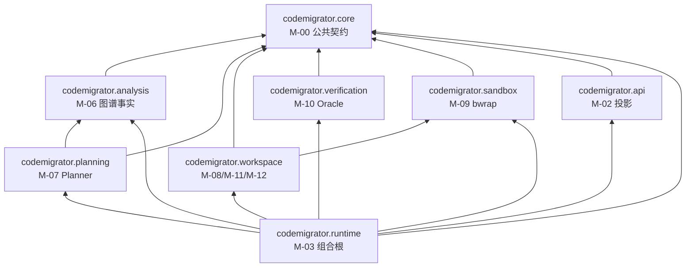
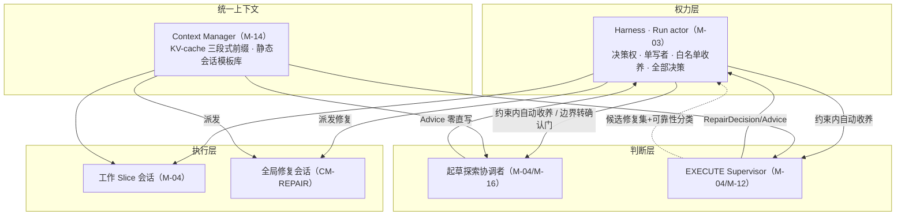
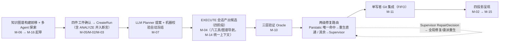
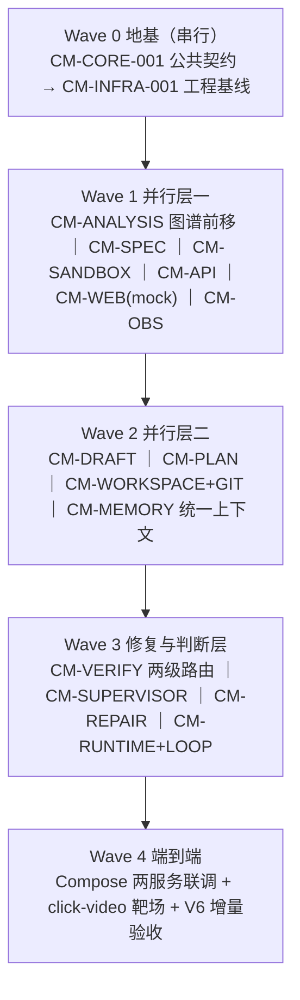

# CodeMigrator 开发任务规划与进度跟踪

> 文档定位：CodeMigrator 代码实现的跨模块任务规划、依赖分析、并行开发路线与总体进度看板（AGENTS.md §1.1 指定的整体任务规划与进度跟踪主表）。
> 架构基线：**V6（Python 版）**。跨语言代码迁移 Agent；三层架构（权力层 Harness / 判断层常驻主 Agent / 执行层工作会话）；四阶段 Run 状态机；app + PostgreSQL 两服务部署拓扑，8 个 Python 子包 src-layout 单包。
> 代码范围：`src/codemigrator/`（8 子包）+ `apps/codemigrator-cli` + `web/` + `descriptors/` + `migrations/` + `deploy/` + `tests/` + `pyproject.toml` + `compose.yaml`。
> 当前阶段：V6 Wave 1；`CM-CORE-001` 的 PR #1、`CM-INFRA-001` 的 PR #2 已合并，`CM-SPEC-001` 能力门实现已完成，待其唯一一次 PR 审查与合并收口。
> 总体状态：进行中（18 个任务中 3 个已完成、15 个未开始；Wave 1 其余任务尚未启动）。
> 创建日期：2026-08-28（V5 重写版）；2026-08-29 升级为 V6 单基线。最后更新日期：2026-08-30。
> 维护原则：总体表反映跨模块事实，模块迭代记录保存实现细节；代码、测试和进度记录必须同步更新；每次计划变更必须先与用户对齐（§8）；V6 开放实施项标注"待定"不得臆造为事实。

***

## 0. Agent 使用与维护规则

### 0.1 开始任务前

1. 阅读本文 §7.3 主任务表确认目标任务行状态与前置依赖完成情况；前置依赖未完成或其接口未冻结时不得开工。
2. 阅读目标模块在 `my_space/codemigrator_dev_progress/<模块缩写>/` 下的迭代记录；不存在时先依据 `my_space/codemigrator_dev_progress/CodeMigrator迭代记录模板.md` 创建（命名 `CM-<模块缩写>-<序号>-<描述>_迭代记录.md`，AGENTS.md §1.3）。
3. 阅读目标模块对应的 V6 设计文档（见 §2.1 索引）、`feedback_doc/fb10_align_records.md` 与 `fb11_align_records.md`，核对仓库当前源码、测试与分支状态；记录与源码/设计不一致时，以可验证源码与当前有效设计文档为准，并在本次更新中修正记录。
4. 任务开始动工时更新本文 §7.3 对应任务行：状态改为"进行中"、填写开始日期。
5. 代码更新只允许在 `feature/*` 或 `fix/*` 分支进行（从 `develop` 切出）；不得主动 commit/push，除非用户明确要求（AGENTS.md §2.3）。

### 0.2 完成任务后

1. 对照 §7.2 通用 Definition of Done 逐项核验：运行对应子包 pytest 测试、import-linter 契约检查与 CI 静态审查；未执行项必须明确写为"未执行"并说明原因。
2. 在模块迭代记录中按 `CodeMigrator迭代记录模板.md` 更新：变更动机、变更内容（含关键实现决策与所依据的 V6 设计文档章节/验收条款编号）、自测与验证结果、影响面与风险、后续行动。
3. 更新本文 §7.3 任务行：状态改"已完成"、填写实际完成日期、备注写证据指针（迭代记录路径与关键验证命令）。
4. 同步 §6 状态统计与 §11 更新记录（CHG 条目置顶追加）。
5. 不在本文或模块记录中写入密码、Token、Cookie、私钥、个人环境值等敏感数据（凭证统一放 `my_space/.env` 与 `my_space/model_api_key.json`）。

### 0.3 总体文档与模块记录的边界

| 记录                                                   | 负责                           | 不负责           |
| ---------------------------------------------------- | ---------------------------- | ------------- |
| 本文                                                   | 跨模块任务、依赖、波次、里程碑、总体状态和计划变更    | 保存每次代码修改的完整细节 |
| 模块迭代记录                                               | 单模块实现快照、接口、测试证据、风险和历次变更      | 代替总体依赖和跨模块里程碑 |
| 设计文档（M-00～M-16 + fb10/fb11\_align\_records + 文档迭代记录） | 目标架构、领域语义、契约和验收标准（V6 当前生效口径） | 声明当前代码已经实现    |
| 源码与测试                                                | 可验证的当前实现事实                   | 单独解释完整设计背景    |

出现不一致时：以可验证源码和测试判断"当前实现"，以最新有效设计文档判断"目标行为"；必须通过 §8 变更流程消除差异。V6 开放实施项（Advice 白名单、联合域判定、修复简报 schema 等）必须以"待定"处理，不得臆造为实现事实。

***

## 1. 总体任务概述

### 1.1 开发目标

实现 CodeMigrator：跨语言代码迁移 Agent 系统（V6）——把源语言项目（首个语言对由 `descriptors/` 声明）全量翻译为目标语言新项目，产出经过三层验证与确定性集成的目标代码库。

* **实现形态**：Python 3.12+ 单包 src-layout，`src/codemigrator/` 下恰 8 个固定子包（`core/analysis/planning/workspace/verification/sandbox/runtime/api`），uv 管理，import-linter 强制层间依赖；部署拓扑为 **app + PostgreSQL 两服务**（`compose.yaml`）。

* **三层架构（V6 核心）**：

  * **权力层 Harness**：确定性控制面、单写者 Run actor、全部决策权；状态机/事务/调度/安全。

  * **判断层常驻主 Agent**：起草期探索协调者 + 执行期 EXECUTE Supervisor；只出 `Advice` 零直写权；actor 白名单**两级收养**（约束内自动采纳 / 边界性转确认门）；增益层优雅降级（缺席退回机械路径）。

  * **执行层工作会话**：Slice 翻译会话、修复会话、全局修复会话；经统一 Context Manager 装配。

* **四阶段 Run 状态机（V6）**：`CREATED → PLANNING → EXECUTING → VERIFYING → REPORTING`（ANALYZE 并入 CreateRun，无独立 ANALYZING）。

* **核心机制（V6）**：

  * **起草期**：预索引知识图谱（符号+调用图+FTS+impact，codegraph 式）支撑多 Agent 域扇出探索；探索协调者归并 → 多轮 AskUser 对齐（全周期不限次）→ 四件冻结工件（Spec / UnderstandingDossier / TargetProjectBlueprint / MigrationRulebook）一次确认冻结。

  * **规划期**：LLM Planner 消费四件冻结工件与 M-06 图事实提出 Slice/边/write scope/integration\_rank；机器校验器四重确定性护栏（互斥/Blueprint符合/源覆盖/无环+规模）通过即自动冻结。

  * **执行期**：封闭六工具（QuerySourceAst 增强为图谱导航）；app 直接管理 bwrap；Slice 长期沙箱卷；KV-cache 三段式前缀 + 静态会话模板库 + 统一上下文（M-14）。

  * **验证与修复（V6 两级路由）**：三层确定性 Oracle 保留为护城河；失败机械归因输出候选修复集 + 可靠性分类；静态诊断唯一命中 → 原 Slice 重生直通；其余统一唤醒 Supervisor → RepairDecision → 单 Slice 委派重生或全局修复会话（联合域、不占 generation 0-2）。

  * **修正协议**：运行期结构修正走安全点 → ImpactPreview 用户确认门 → 重规划；已集成 verified 永不回写。

### 1.2 实现范围

**包含：**

* `src/codemigrator/` 下 8 个子包：core（公共契约）、analysis（源端分析+知识图谱）、planning（LLM Planner+机器校验器）、workspace（候选工作区/Git/工具网关执行面）、verification（验证引擎）、sandbox（app 内 bwrap 适配）、runtime（Run actor 组合根 + 判断层收养）、api（REST/SSE 投影）。

* 判断层机制：起草探索协调者（归 CM-DRAFT）、执行 EXECUTE Supervisor（CM-SUPERVISOR）、全局修复会话（CM-REPAIR）。

* `apps/codemigrator-cli`（CLI，只消费 REST/SSE）、`web/`（前端工作台，只消费 REST/SSE 投影）。

* `descriptors/`（source/target 双工具链声明式资源）、`migrations/`（PostgreSQL schema）、`deploy/`（Compose/seccomp/镜像 digest）、`tests/`（contracts/recovery/security）。

* `compose.yaml`（app+PostgreSQL 基线；MinIO/观测组件为可选 profile）、`pyproject.toml`（uv 单包清单、import-linter 配置、`[project.scripts]` 仅 `codemigrator-app`）。

* 单元测试、契约测试、恢复/安全测试、V6 增量验收。

**不包含：**

* 新增语言对的资源建设（属 `descriptors/` 数据扩展，核心子包零 diff）。

* 分布式/多机部署、多租户、模型训练。

* 已退场体系残留：独立 sandbox-worker 进程、UDS/Protobuf 六方法协议、overlay grant 授权链（V5 起退场）、V3 插件进程（八方法 RPC/长度前缀帧/CapabilityManifest/PluginId）、CheckRunner 作为 Agent 工具、GuardedPatch、机械 DAG 派生管线。

* V6 不再保留：独立 `ANALYZE` 阶段（并入 CreateRun）、Supervisor"被动唤醒式常驻 + 滚动摘要"机制（改事件触发式新会话）、锁定读视野于写权限的旧模型（改读写分离）。

### 1.3 架构硬约束

1. **公共契约单一定义**：状态机/枚举/错误码/Phase 工具授权矩阵（`core://phase-tool-policy/v2`）以 M-00 为唯一 owner；下游只准引用、禁止复制第二套（AGENTS.md §2.1）。V6 契约新增：`ResidentRole`/`AdviceKind`/`Advice`/`RepairDecision`/`GlobalRepairSession`/`FailureReason.DossierInconsistent`。
2. **Python 8 子包+import-linter 契约**：依赖方向 `runtime→全部；其余→core；planning→analysis；workspace→sandbox`；与冻结清单 exact-match，CI 违例拒绝合并；`runtime` 之外任何子包不读环境、不建后台任务。V6 **不新增子包、不改依赖边**（判断层/修复会话落 runtime/analysis 既有子包）。
3. **三层架构权力单向**：判断层只出 Advice 零直写权；Harness（Run actor）白名单两级收养（约束内自动 / 边界转确认门）；决策权始终在 Harness；VERIFY/REPORT 零模型硬边界；增益层优雅降级。
4. **四阶段状态机**：`CREATED→PLANNING→EXECUTING→VERIFYING→REPORTING`；ANALYZE 三件事（复用投影/冻结校验/档案一致性断言）并入 CreateRun，失败 `DOSSIER_INCONSISTENT` 零副作用拒绝。
5. **四件冻结工件在起草期一次确认**：CreateRun 预检（描述符/grammar/镜像三段摘要 + 投影存在 + 档案一致性断言）通过后才创建；Spec 进入 Run 后不可变。
6. **计划自动冻结**：机器校验四重护栏通过即生效；已完成 Slice 永不失效（P-10）；契约漂移修正是唯一受控例外且必须经人工确认门。
7. **两级修复路由**：静态唯一命中 → 原 Slice 重生直通（占 generation 0-2）；静态多命中/全部动态失败 → Supervisor → RepairDecision → 委派重生/全局修复会话（联合域、不占 0-2、免 ImpactPreview 门）；修复 FIFO 集成、基线取最新、独立重试上限。
8. **源项目严格只读**：源快照全程零写入；输出只进托管输出仓库 new 历史。
9. **工具面封闭**：恰六工具；VERIFY/REPORT 空集合；路径安全门 7 规则；无用户自定义 Hook 扩展点；模型不能 spawn 模型（无子 agent 工具）。
10. **write scope 双轨防护**：结构化工具事前逐写拦截 + Shell 写效果由 checkpoint 批量校验；修复会话读视野分离（全境读 + 域内写）。
11. **Git CAS 单写者集成**：集成只按冻结 `integration_rank ASC → SliceId ASC` 串行推进；expected-OID CAS 防并发改写；交付 non-force push。
12. **统一上下文基建**：全类型会话共用同一套 Context Manager（装配/逐出/外置/精确计数）；KV-cache 三段式前缀 + 静态会话模板库；逐出只作用于定向增量段。
13. **预算治理**：预算 100% 后新模型与工具调用为零；常驻判断层计入模型会话池。
14. **脱敏统一出口**：所有出口共享 SecretRegistry 脱敏边界；观测是投影不是真相。
15. **语言映射口径唯一 owner**：Rust→Python 映射决策表在 M-01「语言基线与映射决策」节。

### 1.4 当前事实快照

| 项目            | 当前状态     | 事实依据                                                                                                                                |
| ------------- | -------- | ----------------------------------------------------------------------------------------------------------------------------------- |
| V6 设计文档       | 已冻结      | `architecture_module_design/` M-00\~M-16 V6 收敛版 + `feedback_doc/fb10_align_records.md`、fb11\_align\_records.md + 文档迭代记录.md（V6 收敛基线） |
| 代码实现          | 进行中      | `CM-CORE-001` PR #1 与 `CM-INFRA-001` PR #2 已合并（`683f398`、`d482d88`）；`CM-SPEC-001` 已完成 Spec v3 能力门、canonical、端口与迁移 DDL，待唯一一次 PR 审查与合并 |
| WSL2 开发环境     | 部分就绪     | Docker CE + compose；**Python 3.12+/uv 环境待建**（V6 为 Python，见其他更新记录与 .env）                                                             |
| PostgreSQL 部署 | 未建       | 待 CM-INFRA-001 建 compose.yaml（app+PG）后部署并回填 `my_space/.env`                                                                         |
| 模型 API key    | 已就绪      | `my_space/model_api_key.json`（LLM Planner/Supervisor/修复/多 Agent/Exec 测试用）                                                           |
| 对齐记录          | 已对齐      | 当前 Wave 0/1/2/3 任务均有对应 `code_alignment_record/`；实施中的偏差按 append-only 规则登记                                                                                          |

> 环境明细见 `my_space/codemigrator_dev_progress/其他更新记录.md`；WSL 磁盘配额约束约 100G。

***

## 2. 设计基线与优先级

### 2.1 设计文档索引

V6 设计文档位于 `my_space/codemigrator_design_doc/architecture_module_design/`（契约真相，V6 当前基线）与 `my_space/codemigrator_design_doc/feedback_doc/`（对齐记录）：

| 编号   | 文档                                             | 主要约束（V6 一句话）                                                                           |
| ---- | ---------------------------------------------- | -------------------------------------------------------------------------------------- |
| M-00 | CodeMigrator\_垂类设计原则与架构哲学.md                   | 公共契约唯一 owner；三层架构/四阶段/Advice/RepairDecision/DossierInconsistent/P-09 两级路由              |
| M-01 | CodeMigrator\_核心目录架构设计.md                      | Python 8 子包 + import-linter + descriptors + app+PG 拓扑；语言映射决策表；V6 不改子包边界                |
| M-02 | CodeMigrator\_系统后端架构.md                        | REST/SSE 投影、run\_events 同事务、CreateRun 后置断言、advice/repair 事件投影、幂等                       |
| M-03 | CodeMigrator\_Harness总体设计.md                   | Run actor 单写者、判断层 Advice 收养（两级）、Supervisor 去常驻、全局修复 FIFO 集成；可检查运行性质                    |
| M-04 | CodeMigrator\_Agent\_Loop设计.md                 | 四阶段编排、协调会话（ExploreCoordinator/ExecuteSupervisor）、三段式 KV-cache 前缀、静态会话模板库、修复会话          |
| M-05 | CodeMigrator\_Migration\_Spec抽象层.md            | Spec v3 四道门、canonical、描述符锁；主体沿用 V5                                                     |
| M-06 | CodeMigrator\_代码分析与AST引擎.md                    | 知识图谱**构建前移**（项目注册即建）、ANALYZE 并入 CreateRun 断言、F1-F4/PSF-2、QuerySourceAst 图谱导航           |
| M-07 | CodeMigrator\_迁移计划生成器.md                       | LLM Planner + 机器校验四重护栏、条件化联合域例外、归因→修复集映射、integration\_rank、涟漪                          |
| M-08 | CodeMigrator\_候选工作区与工具网关.md                    | 候选工作区（沙箱卷）、checkpoint、六工具执行落地、审计账本；承接修复会话执行                                            |
| M-09 | CodeMigrator\_沙箱与执行环境.md                       | app 内 bwrap、长期卷、临时物化、三池资源、差异化网络                                                        |
| M-10 | CodeMigrator\_验证引擎.md                          | 三层 Oracle、两级修复路由（可靠域直通+其余统一）、fingerprint、flaky、P-09 归因、守恒、parity；**V6 收敛-001/002/003** |
| M-11 | CodeMigrator\_工作空间与Git集成.md                    | Git refs、CAS 单写者集成、修复 FIFO、non-force 交付                                                |
| M-12 | CodeMigrator\_工具系统与Hook.md                     | 六工具、路径安全门、write scope 双轨、会话级授权（协调会话只读/修复会话域写）、静态会话模板库登记                                |
| M-13 | CodeMigrator\_可观测性系统.md                        | 八指标（phase 4）、SecretRegistry 脱敏、advice/repair 事件观测、诊断指标收缩                               |
| M-14 | CodeMigrator\_记忆与上下文管理.md                      | **升级为全类型会话统一上下文基建**、三段式 KV-cache、静态模板装配、修复导航索引、RecoveryBrief                           |
| M-15 | CodeMigrator\_Web体验与可视化工作台.md                  | persona 舞台、证据页、全局修复会话/Supervisor 决策只读视图、CLI 多模式                                        |
| M-16 | CodeMigrator\_会话与运行时修正编排.md                    | 起草多 Agent 探索+多轮 AskUser+四件工件确认、全局修复免确认门、契约漂移修正协议                                       |
| —    | 文档迭代记录.md                                      | Python 版演进记录（V4→V5→V6/V6 收敛）；语言映射以 M-01 为唯一 owner                                      |
| —    | feedback\_doc/fb10\_align\_records.md          | V6 方向对齐（三层架构/探索协调/图谱前移/两级修复路由/AskUser 纪律）                                              |
| —    | feedback\_doc/fb11\_align\_records.md          | V6 收敛对齐（ANALYZE 并入/去常驻/可靠域直通/KV-cache 前缀/静态模板/DossierInconsistent）                     |
| —    | feedback\_doc/fb7\~fb11.md + align\_records.md | 反馈输入与 V5 对齐追溯                                                                          |

### 2.2 冲突处理顺序

1. 公共契约（状态机、枚举、错误码等）以当前设计文档为唯一来源；只允许引用，禁止复制第二套定义（AGENTS.md §2.1）。
2. **V6 为当前生效基线**；V5/V4 追溯项（`V-Mxx-V4/V5-xxx` 及标注"追溯/历史"）不重新定义当前契约，仅作机制来源参考。V6 增量（各篇 V6 方向对齐/ V6 收敛 + M-10 `V6 收敛-001/002/003`）为当前验收口径。
3. **验收条款标注不一致的处理**：各篇 V6 文档对老条款标注不统一（M-05/M-13/M-16 的 V4 编号仍承载当前可施工契约；M-10 有显式 V6 编号；其余为无编号 V6 增量/内嵌）。本文档以各篇 **V6 当前对齐段 + V6 增量 + 未退役的可施工 V4/V5 编号**为当前验收基准；需在实施中对各任务逐条明确 V6 验收口径（列入 V6 开放项）。
4. 设计文档演进时：一切实现与解释以文档当前版本为准；实现与文档不一致须走 §8 变更流程对齐（架构文档修改前必须先经用户确认，AGENTS.md §2.2）。
5. **V6 开放实施项**（见 §9.1）一律标"待定"，不作为验收依据，不得臆造为事实（fb10 §7 / fb11 §5 惯例）。

***

## 3. 功能模块与开发任务划分

18 个开发任务按 V6 阶段聚合（V5 的 16 任务 + 新增 CM-SUPERVISOR/CM-REPAIR），任务 ID 沿用 `CM-<模块缩写>-001` 风格。任务执行顺序与波次见 §4.3/§5。

| 任务ID              | 名称                          | 覆盖 M-xx                  | 子包/形态                                                     | 职责摘要（V6）                                                                            | 关键 V6 机制                                                                                    | 上游依赖                                             | 验收口径                                        |
| ----------------- | --------------------------- | ------------------------ | --------------------------------------------------------- | ----------------------------------------------------------------------------------- | ------------------------------------------------------------------------------------------- | ------------------------------------------------ | ------------------------------------------- |
| CM-CORE-001       | Python 公共契约层                | M-00                     | `core` 子包                                                 | 公共契约唯一 owner：ID/状态机（四阶段）/枚举/稳定错误码/Phase 授权矩阵/类型族/派生纯函数                              | V6 契约：ResidentRole/AdviceKind/Advice/RepairDecision/GlobalRepairSession/DossierInconsistent | 无（源头）                                            | V6 增量 + 可施工 V4 编号                           |
| CM-INFRA-001      | 工程基线                        | M-01                     | src-layout + 8 子包 + pyproject/compose/migrations/tests/CI | Python 单包骨架、uv、import-linter、descriptors 首对、compose(app+PG)、migrations、tests、CI     | import-linter exact-match；V6 不改子包边界；\[project.scripts] 仅 app                                | CM-CORE-001                                      | import-linter exact-match；app+PG 两服务        |
| CM-SPEC-001       | Migration Spec 能力门          | M-05 (+M-02 入口)          | core 类型 + api 入口                                          | Spec v3 四道门、canonical、insert-or-get、描述符三码拒绝                                         | 主体沿用 V5；四件工件确认包为冻结伴随输入                                                                      | CM-CORE-001、CM-INFRA-001                         | V-M05-V4-001\~012（可施工）                      |
| CM-ANALYSIS-001   | 源端分析与知识图谱                   | M-06                     | `analysis` 子包                                             | **知识图谱构建前移**（项目注册/起草即建）、F1-F4/PSF/图谱导航、重建投影                                         | 图谱前移（键=snapshot OID+描述符摘要，三期共用）                                                             | CM-CORE-001、CM-SPEC-001                          | V5 增量 + V4-001\~019（追溯）+ V6 时序内嵌            |
| CM-DRAFT-001      | 起草期多 Agent 理解与四件工件          | M-16 起草 + M-04 起草 + M-14 | app 内编排                                                   | 图谱域扇出探索（探索协调者）、归并、**多轮 AskUser 对齐（不限次）**、四件工件（含 Blueprint）一次确认冻结                    | 探索协调者切域调整权；AskUser 全周期不限次；试译校准                                                              | CM-ANALYSIS-001、CM-CORE-001                      | V-M16-V4-012/013/014（可施工）+ V6 起草流程          |
| CM-PLAN-001       | LLM Planner + 机器校验器         | M-07                     | `planning` 子包                                             | LLM 消费四件冻结输入+图事实 → Slice/边/write scope/integration\_rank；机器校验四重护栏自动冻结               | 四重护栏；条件化联合域例外（供全局修复）；归因→修复集映射                                                               | CM-DRAFT-001、CM-ANALYSIS-001                     | V-M07-V5-001\~004 + V6 联合域                  |
| CM-WORKSPACE-001  | 候选工作区与工具网关                  | M-08 + M-12 执行面          | `workspace` 子包                                            | 候选工作区（沙箱卷）、六工具落地、checkpoint、审计账本、write scope 双轨                                     | 工作区即沙箱卷；承接修复/重生升级包执行                                                                        | CM-PLAN-001、CM-SANDBOX-001                       | V5 增量 + V4 追溯                               |
| CM-SANDBOX-001    | 内联 bwrap 沙箱适配               | M-09                     | `sandbox` 子包（无独立 entry）                                   | app 内 bwrap/cgroup/命名空间、长期卷、临时物化、三池资源、差异化网络                                         | PDEATHSIG/cgroup；三池（活跃 bwrap 位）                                                             | CM-CORE-001、CM-INFRA-001                         | V5 增量 + V4 追溯（M-09 验收基线待补）                  |
| CM-GIT-001        | 工作空间与 Git 集成                | M-11                     | `workspace` 子包                                            | 托管输出、源只读快照、refs、CAS 单写者集成、non-force 交付                                              | 修复产出 FIFO 集成；集成序唯一                                                                          | CM-PLAN-001、CM-WORKSPACE-001                     | V5 增量 + V4 追溯                               |
| CM-VERIFY-001     | 验证引擎（三层 Oracle + 两级修复路由执行侧） | M-10                     | `verification` 子包                                         | 三层验证、fingerprint、flaky、P-09 归因、守恒、parity；**可靠域直通+其余统一 Supervisor**                  | 候选修复集+可靠性分类；机械归因证据化；全局修复先试、Run 终态兜底                                                         | CM-PLAN-001、CM-SANDBOX-001、CM-GIT-001            | **V6 收敛-001/002/003** + V5 增量 + V4-027 在场门控 |
| CM-RUNTIME-001    | Harness Run actor（含判断层收养）   | M-03 + M-02+             | `runtime` 子包                                              | 四阶段 CreateRun（ANALYZE 并入）、单写者、内联 bwrap 调度、**Advice 白名单两级收养**、Supervisor 触发、取消/预算/恢复 | CreateRun 后置断言（DOSSIER\_INCONSISTENT）；Advice 收养；全局修复 FIFO 集成序                               | 全部子包                                             | 10 条可检查运行性质 + V6 判断层收养                      |
| CM-LOOP-001       | Agent Loop 执行会话（含协调/修复会话类型） | M-04 执行 + M-16 执行        | runtime 编排                                                | 四阶段、EXECUTE 调用循环、六工具授权、Exec、会话隔离；协调会话（只出 Advice）/修复会话                               | KV-cache 三段式前缀；静态会话模板库角色提示；无子 agent 工具                                                      | CM-RUNTIME-001、CM-WORKSPACE-001、CM-DRAFT-001     | V-M04-V4-001\~022（追溯）+ V6 增量                |
| CM-SUPERVISOR-001 | 判断层 EXECUTE Supervisor（新增）  | M-03/M-04/M-00/M-12      | 判断层（app 内，经 runtime 收养）                                   | 事件触发式决策会话；Advice 产出（修复决策/路由建议/proposal\_hash）；两级收养对接                                | 去常驻（事件触发新会话）；只出 Advice 零直写；白名单收养；advice.proposed/adopted                                    | CM-RUNTIME-001、CM-VERIFY-001、CM-MEMORY-001       | V6 增量（Advice 机制）                            |
| CM-REPAIR-001     | 全局修复会话（新增）                  | M-03/M-04/M-07/M-11      | 执行层（app 内，经 runtime 派发）                                   | 全局修复会话（联合域 write scope 条件安全、全境读）；修复简报装配；FIFO 集成；独立重试上限                              | 不占 generation 0-2；免 ImpactPreview 门；RepairDecision/repair.session.\* 事件                     | CM-VERIFY-001、CM-SUPERVISOR-001、CM-WORKSPACE-001 | V6 增量（GetGlobalRepair）                      |
| CM-API-001        | 系统后端控制面                     | M-02                     | `api` 子包 + runtime 存储                                     | REST/SSE、run\_events、幂等、四投影、四件工件随 CreateRun、advice/repair 事件投影、组合根装配                | CreateRun 后置断言；advice/repair 事件 SSE/REST 只读投影                                               | CM-CORE-001、CM-SPEC-001、CM-RUNTIME-001           | V5 增量 + V4-005/006/010（可施工）+ V6 判断层事件       |
| CM-OBS-001        | 可观测性与脱敏                     | M-13                     | app 内横切                                                   | 八指标（phase 4）、SecretRegistry、快照、JSONL、exporter；advice/repair 事件观测                    | 脱敏四编码哨兵；判断层事件入 run\_events                                                                  | CM-CORE-001、CM-API-001                           | V-M13-V4-001\~010（可施工，phase 4 调整）+ V6       |
| CM-MEMORY-001     | 记忆与上下文管理（统一基建）              | M-14                     | app 内横切                                                   | Context Pack、预算、ArtifactRef、逐出、会话重建；**统一上下文基建**（全类型）、三段式 KV-cache、静态模板装配            | KV-cache 三段式前缀；协调/修复会话预算档；修复导航索引式装配                                                         | CM-CORE-001、CM-LOOP-001、CM-WORKSPACE-001         | V5 增量 + V6 增量（统一基建/KV-cache/模板库）            |
| CM-WEB-001        | Web 工作台 + CLI               | M-15                     | `web/` + `apps/codemigrator-cli`                          | persona 舞台、证据页、报告、CLI 多模式；全局修复/Supervisor 决策只读视图                                    | 事件→动作归约；四阶段条；独立全局修复 persona                                                                 | CM-API-001、CM-OBS-001                            | V-M15-V4-001\~029（含渲染完备）+ V6 增量             |

**落点说明（如实标注）：**

1. **V6 新增任务**：CM-SUPERVISOR-001（判断层 EXECUTE Supervisor，事件触发式决策会话 + Advice 收养对接）、CM-REPAIR-001（全局修复会话，联合域 + 不占 generation 0-2）。两者均不新增独立子包（落 runtime 编排 + analysis 事实 + verification 归因），V6 明确"不改子包边界"。
2. **职责 V6 化任务**：CM-ANALYSIS（图谱前移）、CM-RUNTIME（ANALYZE 并入 + Advice 收养 + four-stage）、CM-DRAFT（探索协调者 + 多轮 AskUser）、CM-VERIFY（两级修复路由执行侧）、CM-LOOP（协调/修复会话类型 + KV-cache + 静态模板）、CM-MEMORY（统一上下文基建）、CM-API（CreateRun 后置断言 + advice/repair 事件投影）、CM-OBS（phase 4 + 判断层事件）、CM-WEB（全局修复/Supervisor 视图 + 四阶段条）。
3. **M-08/M-11/M-12 共用** **`workspace`** **子包**（V6 未拆分）；CM-WORKSPACE/GIT 共享，工具面（M-12）执行面亦落 workspace。
4. **M-04/M-16 拆功能**：起草（探索协调）归 CM-DRAFT、执行会话归 CM-LOOP、Supervisor 归 CM-SUPERVISOR。
5. **验收条款口径**：V6 中仅 M-10 有显式 `V6 收敛-001/002/003` 编号；其余 V6 增量为无编号内嵌/bullet。当前可施工老编号：M-05 `V-M05-V4-001~012`、M-13 `V-M13-V4-001~010`、M-16 `V-M16-V4-001~018`、M-10 `V-M10-V4-027`（在场门控）；其余老编号为追溯。统一建立 V6 验收编号体系是 V6 开放项（§9.1）。

**模块分类缩写**（三目录文件夹名，AGENTS.md §1.3）：M-00→`core`、M-01→`infra`、M-02→`api`、M-03→`runtime`、M-04→`agent-loop`、M-05→`spec`、M-06→`analysis`、M-07→`planning`、M-08/M-11/M-12→`workspace`、M-09→`sandbox`、M-10→`verification`、M-13→`obs`、M-14→`memory`、M-15→`web`、M-16→`session`；判断层→`supervisor`、全局修复→`repair`。

***

## 4. 模块依赖关系分析

### 4.1 主依赖图

**Python 8 子包 import-linter 依赖图**（V6 冻结方向；箭头 = 依赖方 → 被依赖方；V6 不改子包边界）：



**三层架构协作图（V6）**：



> 判断层只出 Advice、零直写权；决策权始终在 Harness（actor 白名单两级收养）；增益层缺席时优雅降级回机械路径。

### 4.2 关键调用与数据路径

一次迁移 Run 的主链路（V6 四阶段；数据流 = 左 → 右）：



关键路径说明：

* **起草 → 冻结**：知识图谱构建前移（项目注册即建）→ 多 Agent 域扇出探索（探索协调者切域建议 + Harness 机器校验）→ 多轮 AskUser 对齐（不限次）→ 四件工件一次确认 → CreateRun（预检 + 投影存在断言 + 档案一致性断言 `DOSSIER_INCONSISTENT`）→ 四阶段自 PLANNING 起步。

* **规划 → 执行**：LLM Planner 消费四件冻结输入 + 图事实 → 机器校验四重护栏 → 自动冻结 → Run actor 按依赖闭包就绪调度 → EXECUTE 会话经六工具（统一上下文 + app 内 bwrap 长期卷）产出候选 → checkpoint → 三层 Oracle 临时物化验证。

* **两级修复路由（V6 核心）**：验证失败 → 机械归因输出候选修复集+可靠性分类 → 静态唯一命中 → 原 Slice 重生直通（占 0-2）；静态多命中/全部动态失败 → 唤醒 Supervisor → RepairDecision → 委派重生或全局修复会话（联合域、不占 0-2、免 ImpactPreview）→ FIFO 集成（基线取最新 verified）。

* **修正回路**：结构修正/契约漂移 → 安全点 → ImpactPreview 确认门 → 重规划未集成部分；已集成 verified 永不回写（P-10）。

* **统一上下文**：M-14 为全类型会话统一装配（KV-cache 稳定前缀/演进段/定向增量、静态会话模板库、不可逐出集合保护）。

### 4.3 必须顺序开发的依赖

| 顺序约束                                            | 原因                                              |
| ----------------------------------------------- | ----------------------------------------------- |
| CM-CORE-001（M-00）最先                             | 全部子包消费其公共契约（含 V6 新增 Advice/RepairDecision 类型）   |
| CM-INFRA-001（M-01）紧随                            | Python 8 子包骨架 + import-linter + compose(app+PG) |
| CM-ANALYSIS/CM-SPEC/CM-SANDBOX/CM-API 可并行       | 各自编译面仅依赖 core                                   |
| CM-DRAFT/CM-PLAN 在 CM-ANALYSIS 之后               | 起草/规划消费图谱图事实与四件冻结工件                             |
| CM-WORKSPACE/GIT/VERIFY 在 CM-PLAN+CM-SANDBOX 之后 | 消费冻结 write scope；依赖 app 内 bwrap 适配              |
| CM-VERIFY → CM-SUPERVISOR → CM-REPAIR           | 两级修复路由：归因证据 → Supervisor 决策 → 全局修复会话            |
| CM-RUNTIME/CM-LOOP 在其他子包稳定后                     | runtime 组合根 + 判断层收养；loop 由 actor dispatch       |
| CM-API/OBS/MEMORY/WEB 完善接入                      | 控制面/横切/呈现层真实联调；MEMORY 统一上下文基建须先于判断层/修复会话装配      |

> 判断层（CM-SUPERVISOR）与全局修复（CM-REPAIR）依赖执行层事实、统一上下文装配与机械归因证据，故排在 CM-VERIFY/CM-MEMORY 之后。

***

## 5. 并行开发规划

### 5.1 分阶段执行图



### 5.2 波次计划

| 波次            | 任务                                                              | 并行性                                         | 进入条件                | 出口条件                                                          |
| ------------- | --------------------------------------------------------------- | ------------------------------------------- | ------------------- | ------------------------------------------------------------- |
| Wave 0 地基     | CM-CORE-001 → CM-INFRA-001                                      | 串行                                          | V6 设计冻结（已完成）        | CORE V6 契约测试通过；import-linter exact-match + compose(app+PG) 就绪 |
| Wave 1 并行层一   | CM-ANALYSIS（图谱前移）、CM-SPEC、CM-SANDBOX、CM-API、CM-WEB(mock)、CM-OBS | 六线并行                                        | Wave 0              | 各自 V6 增量通过；图谱前移使 ANALYSIS 提前就绪                                |
| Wave 2 并行层二   | CM-DRAFT、CM-PLAN、CM-WORKSPACE+CM-GIT、CM-MEMORY                  | 四线并行（workspace 共享协调）                        | ANALYSIS/DRAFT 事实就绪 | 四件工件/计划冻结/checkpoint/统一上下文                                    |
| Wave 3 修复与判断层 | CM-VERIFY（两级路由）、CM-SUPERVISOR、CM-REPAIR、CM-RUNTIME+CM-LOOP      | VERIFY→SUPERVISOR→REPAIR 序贯；RUNTIME/LOOP 协同 | Wave 2              | 两级修复路由闭环、Advice 收养、全局修复 FIFO                                  |
| Wave 4 端到端    | 跨模块集成验收 + Compose 联调 + click-video 靶场                           | —                                           | 全部                  | §10 场景全过（含全局修复/判断层降级）                                         |

### 5.3 并行开发纪律

1. **契约先行**：CM-CORE-001 V6 契约（含 Advice/RepairDecision/GlobalRepairSession）冻结后才允许并行；并行任务只通过 core 契约类型交互。
2. **接口替身经测试冻结**：并行任务消费未完成上游时用 stub/fake，行为测试锁定，上游就绪后替换对齐。
3. **共享子包协调**：CM-WORKSPACE/GIT/REPAIR 共享 workspace/replace 相关落点，先对齐子包内公共接口；判断层/修复会话不新增子包，落 runtime。
4. **判断层收养接口**：CM-SUPERVISOR 的 Advice 产出必须对齐 CM-RUNTIME 的 actor 白名单收养接口（约束内/边界性分界），跨任务协调。
5. **交叉验收归属**：两级修复路由条款（M-10 ↔ M-03 ↔ M-04）在 CM-VERIFY/CM-RUNTIME/CM-SUPERVISOR 三方登记，联调证据放后完成方。
6. **开放项不臆造**：V6 开放实施项（Advice 白名单精确枚举、联合域判定算法、修复简报 schema、独立重试上限数值、可靠域直通精确判定等）标注"待定"，实现不得替用户决定；细化前走 §8 变更流程与用户对齐。
7. **Git 纪律**：从 `develop` 切 `feature/<模块缩写>-<简述>`；合并前 pytest/import-linter 通过；禁止 push main/develop 与 force push。

***

## 6. 里程碑与总体状态

### 6.1 里程碑汇总

| 里程碑          | 内容                                          | 对应任务                                      | 状态                |
| ------------ | ------------------------------------------- | ----------------------------------------- | ----------------- |
| MS-0 V6 设计定稿 | 17 篇 V6 + fb10/fb11 aligned + 迭代记录冻结        | —                                         | 已完成（2026-08-29 前） |
| MS-1 工程地基    | 公共契约（V6）+ Python 工程基线（import-linter、app+PG） | CM-CORE、CM-INFRA                          | 已完成（2026-08-30）               |
| MS-2 基础能力    | 图谱前移、Spec、app 内 bwrap、控制面、Web/CLI、观测        | CM-ANALYSIS/SPEC/SANDBOX/API/WEB/OBS      | 进行中（CM-SPEC 已完成，其他任务未开始）               |
| MS-3 计划与验证   | 起草/计划/工作区/Git/统一上下文；两层修复路由准备                | CM-DRAFT/PLAN/WORKSPACE/GIT/MEMORY/VERIFY | 未开始               |
| MS-4 运行与修复闭环 | Run actor、判断层 Supervisor、全局修复会话             | CM-RUNTIME/LOOP/SUPERVISOR/REPAIR         | 未开始               |
| MS-5 交付      | Compose 两服务联调 + click-video 靶场 + V6 增量验收    | 全部任务完善 + 验收活动                             | 未开始               |

### 6.2 状态统计

按主任务表 18 个任务计：已完成 3 / 进行中 0 / 未开始 15（完成度约 16.7%，未合并 PR 不计入主干事实）。

> 完成度仅为任务数量比例，不替代各任务质量门（V6 增量/运行性质）；V6 开放实施项细化前不计为验收欠账，单独在 §9 跟踪。

***

## 7. 总体任务进度跟踪

### 7.1 状态与日期规则

* 状态只取三值：**未开始 / 进行中 / 已完成**；阻塞在"备注"注明并同步 §9。

* 开始日期 = 实际动工日期；实际完成日期 = §7.2 DoD 全部满足日期。

* 日期格式 `YYYY-MM-DD`；未知填"—"，不猜测。

### 7.2 通用 Definition of Done

1. 对应模块 V6 增量（或可施工的 V4/V5 编号、可检查运行性质）全部通过，逐条勾选并给证据。V6 开放实施项细化前不作验收欠账，但不臆造字段/拒绝码。
2. 对应子包 pytest 通过 + import-linter 契约检查通过（如适用）+ CI 静态审查通过。
3. 模块迭代记录按 `CodeMigrator迭代记录模板.md` 更新。
4. 本表 §7.3 任务行更新（状态/日期/备注证据指针）。
5. 需求对齐结果与原设计不同时更新冲突部分；V6 开放项细化改变契约则走 §8 变更流程对齐。

### 7.3 主任务表

| 任务ID              | 任务描述                                                                                                                | 状态  | 开始日期 | 实际完成日期 | 备注                           |
| ----------------- | ------------------------------------------------------------------------------------------------------------------- | --- | ---- | ------ | ---------------------------- |
| CM-CORE-001       | Python 公共契约层（M-00）：ID/四阶段状态机/枚举/错误码/phase 授权矩阵/V6 契约（Advice/RepairDecision/GlobalRepairSession/DossierInconsistent） | 已完成 | 2026-08-30    | 2026-08-30      | Wave 0；全部子包上游；已对齐：my_space/code_alignment_record/core/CM-CORE-001-对齐记录.md；迭代记录：my_space/codemigrator_dev_progress/core/CM-CORE-001-公共契约层迭代记录.md；PR #1 已完成既有审查反馈的修复与验证并合并（`683f398`）；按用户流程不再追加审查；当前验证：`PYTHONPATH=src /tmp/codemigrator-infra/.venv/bin/python -m pytest tests/core tests/contracts -q`（55 passed）、compileall、静态扫描；分支 `feature/core-contracts` |
| CM-INFRA-001      | 工程基线（M-01）：Python 8 子包/uv/import-linter/descriptors/compose(app+PG)/migrations/tests/CI                             | 已完成 | 2026-08-30    | 2026-08-30      | Wave 0；依赖 CM-CORE（已完成）；已对齐：my_space/code_alignment_record/infra/CM-INFRA-001-对齐记录.md；迭代记录：my_space/codemigrator_dev_progress/infra/CM-INFRA-001-工程基线迭代记录.md；PR #2 已按唯一一次审查反馈修复后直接合并（`d482d88`）；70 passed、import-linter 3 contracts、Ruff/mypy/compileall/Compose config 通过；target-python 重建与 app/PG 冒烟待联网环境完成；分支 `feature/infra-python-skeleton` |
| CM-SPEC-001       | Migration Spec 能力门（M-05）：四道门/canonical/不可变/描述符三码拒绝                                                                  | 已完成 | 2026-08-30 | 2026-08-30 | Wave 1；依赖 CM-CORE/CM-INFRA（均已完成）；已对齐：my_space/code_alignment_record/spec/CM-SPEC-001-对齐记录.md；四份收口文档、四道门、JCS/hash、端口替身、DDL 与契约测试已完成；113 passed、import-linter/Ruff/mypy/compileall/diff 通过；唯一一次审查反馈已修复，待直接合并；分支 `feature/spec-capability-gate` |
| CM-ANALYSIS-001   | 源端分析与知识图谱（M-06）：图谱构建前移/F1-F4/PSF/图谱导航/重建投影                                                                          | 未开始 | —    | —      | Wave 1；图谱前移使 ANALYSIS 提前；已对齐：my_space/code_alignment_record/analysis/CM-ANALYSIS-001-对齐记录.md |
| CM-DRAFT-001      | 起草期多 Agent 理解与四件工件（M-16 起草+M-04+M-14）：图谱域扇出/探索协调者/多轮 AskUser（不限次）/一次确认                                              | 未开始 | —    | —      | Wave 2；Blueprint 字段待定（本任务不臆造，CM-PLAN 对齐收口）；已对齐：my_space/code_alignment_record/draft/CM-DRAFT-001-对齐记录.md |
| CM-PLAN-001       | LLM Planner+机器校验器（M-07）：PlanProposal/DAG 冻结/四重护栏/条件化联合域/涟漪                                                          | 未开始 | —    | —      | Wave 2；校验拒绝码已对齐定稿（八码）；已对齐：my_space/code_alignment_record/plan/CM-PLAN-001-对齐记录.md |
| CM-WORKSPACE-001  | 候选工作区与工具网关（M-08+M-12 执行面）：沙箱卷生命周期/六工具/checkpoint/审计账本                                                               | 未开始 | —    | —      | Wave 2；与 CM-GIT 共享 workspace；已对齐：my_space/code_alignment_record/workspace/CM-WORKSPACE-001-对齐记录.md |
| CM-SANDBOX-001    | 内联 bwrap 沙箱适配（M-09）：PDEATHSIG/cgroup/命名空间/长期卷/临时物化/三池                                                               | 未开始 | —    | —      | Wave 1；M-09 V5 验收基线待补（对齐已补 V-M09-V5-001~017）；已对齐：my_space/code_alignment_record/sandbox/CM-SANDBOX-001-对齐记录.md |
| CM-GIT-001        | 工作空间与 Git 集成（M-11）：refs/CAS 单写者集成/修复 FIFO/non-force 交付                                                              | 未开始 | —    | —      | Wave 2；已对齐：my_space/code_alignment_record/git/CM-GIT-001-对齐记录.md |
| CM-VERIFY-001     | 验证引擎（M-10）：三层 Oracle/两级修复路由（可靠域直通+其余统一）/fingerprint/flaky/守恒/parity                                                 | 未开始 | —    | —      | Wave 3；V6 收敛-001/002/003；已对齐（推荐方案采纳）：my_space/code_alignment_record/verify/CM-VERIFY-001-对齐记录.md |
| CM-RUNTIME-001    | Harness Run actor（M-03）：四阶段 CreateRun/Advice 两级收养/Supervisor 触发/取消/预算/恢复                                            | 未开始 | —    | —      | Wave 3；10 条运行性质；已对齐（推荐方案采纳）：my_space/code_alignment_record/runtime/CM-RUNTIME-001-对齐记录.md |
| CM-LOOP-001       | Agent Loop 执行会话（M-04 执行+M-16 执行）：四阶段/调用循环/协调·修复会话类型/KV-cache/静态模板                                                   | 未开始 | —    | —      | Wave 3；与 CM-RUNTIME 协同；已对齐（推荐方案采纳）：my_space/code_alignment_record/loop/CM-LOOP-001-对齐记录.md |
| CM-SUPERVISOR-001 | 判断层 EXECUTE Supervisor（新增）：事件触发式决策会话/Advice 产出/白名单收养对接                                                              | 未开始 | —    | —      | Wave 3；Advice 白名单已对齐定稿（CM-RUNTIME D-01）；已对齐（推荐方案采纳）：my_space/code_alignment_record/supervisor/CM-SUPERVISOR-001-对齐记录.md |
| CM-REPAIR-001     | 全局修复会话（新增）：联合域条件安全/全境读/修复简报/FIFO 集成/独立重试上限                                                                          | 未开始 | —    | —      | Wave 3；联合域判定/修复简报 schema 已对齐定稿（推荐方案采纳）；已对齐：my_space/code_alignment_record/repair/CM-REPAIR-001-对齐记录.md |
| CM-API-001        | 系统后端控制面（M-02）：REST/SSE/run\_events/幂等/四投影/CreateRun 后置断言/advice·repair 事件投影                                         | 未开始 | —    | —      | Wave 1 骨架 → Wave 4 完善；已对齐：my_space/code_alignment_record/api/CM-API-001-对齐记录.md |
| CM-OBS-001        | 可观测性与脱敏（M-13）：八指标（phase 4）/SecretRegistry/快照/JSONL/判断层事件观测                                                          | 未开始 | —    | —      | Wave 1 骨架 → Wave 4 完善；已对齐：my_space/code_alignment_record/obs/CM-OBS-001-对齐记录.md |
| CM-MEMORY-001     | 记忆与上下文（M-14）：统一上下文基建/KV-cache 三段式前缀/静态模板装配/修复导航索引/会话重建                                                              | 未开始 | —    | —      | Wave 2；预算档·演进段稳定性已对齐定稿；已对齐：my_space/code_alignment_record/memory/CM-MEMORY-001-对齐记录.md |
| CM-WEB-001        | Web 工作台+CLI（M-15）：persona 舞台/证据页/四阶段条/全局修复·Supervisor 只读视图/多模式渲染                                                    | 未开始 | —    | —      | Wave 1 mock → Wave 4 真实联调；已对齐：my_space/code_alignment_record/web/CM-WEB-001-对齐记录.md |

***

## 8. 变更管理流程

> agent 因开发实际情况需要动态变更时，**每次变更必须先与用户对齐并记录变更原因、内容和影响范围**，禁止未经对齐自行改表。

### 8.1 需要对齐的变更场景

1. 新增/删除任务、调整任务编号或任务与 M-xx 映射。
2. 调整任务执行次序或波次归属。
3. 修改模块依赖关系或并行开发规划。
4. 验收标准（V6 增量口径、DoD）调整。
5. 实现范围变化（§1.2 包含/不包含调整）。
6. **V6 开放实施项细化**（Advice 白名单、联合域判定、修复简报 schema、独立重试上限、可靠域直通精确判定、档案一致性阈值等）——凡涉及契约/验收口径的细化，先与用户对齐确认。
7. 设计文档演进导致任务重定义（架构文档修改前先经用户确认，AGENTS.md §2.2）。

### 8.2 固定流程

1. agent 发现需要变更 → **使用提问工具与用户对齐**（变更原因、内容、影响范围、可选方案）。
2. 用户确认后 → 更新本文相关章节。
3. 在 §8.3 变更记录表登记。
4. 在 §11 更新记录置顶追加 CHG 条目。
5. 同步受影响的模块迭代记录与（必要时）设计文档变更（后者另行经用户确认）。

### 8.3 变更记录表

| 日期         | 变更原因                        | 变更内容                                                                              | 影响范围                               | 对齐确认                                |
| ---------- | --------------------------- | --------------------------------------------------------------------------------- | ---------------------------------- | ----------------------------------- |
| 2026-08-29 | 设计与 V5 演进到 V6（fb10/fb11 落地） | 主文档 V5 单基线升级为 V6 单基线：18 任务（新增 CM-SUPERVISOR/CM-REPAIR）、四阶段、三层架构、两级修复路由、图谱前移、统一上下文 | 全文档（任务划分/依赖/并行/验收口径）；旧对齐记录待按 V6 重做 | 用户经本 spec（rewrite-cm-dev-plan-v6）批准 |

### 8.4 新变更记录模板

```markdown
### CHG-YYYYMMDD-NN：<简短、可检索的标题>

- 时间：YYYY-MM-DD
- 变更类型：任务新增 / 任务删除 / 次序调整 / 依赖修改 / 范围调整 / 验收口径调整 / 开放项细化 / 文档修正
- 变更原因：<触发条件与理由>
- 变更内容：<具体变化点，注明任务 ID 与章节>
- 影响范围：<受影响任务、章节、文档与里程碑>
- 对齐确认：<与用户对齐的方式与结论>
- 验证：<核验方式与结果>
- 后续行动：<明确下一步；没有则写"无">
```

***

## 9. 风险、阻塞与外部依赖

### 9.1 V6 开放实施项（待定，须随任务推进与用户对齐细化）

| 开放项                                              | 归属                  | 状态 | 影响                            |
| ------------------------------------------------ | ------------------- | -- | ----------------------------- |
| Advice 白名单精确枚举（约束内/边界性分界）与 proposal\_hash schema | M-03/M-16/CM-CORE   | 已细化（2026-08-29 对齐·推荐采纳） | 白名单两级=AdviceKind 枚举两级终值（约束内{ExploreReassignment,RepairDecision}自动收养+机械校验/边界性{RouteSuggestion,PlanRevision,AskUser}转确认门）；proposal_hash=SHA-256(JCS canonical(advice_id/kind/run_id/role/payload))；收养四步流程；见 code_alignment_record/runtime/CM-RUNTIME-001-对齐记录.md D-01 |
| 联合域安全判定算法（无在途并行写者）                               | M-07/M-04/CM-REPAIR | 已细化（2026-08-29 对齐·推荐采纳） | 派发时点冻结机械查表：①修复集内 Slice 全部已终态集成 ②联合域∩在途写者 write scope=∅ ③通过冻结 joint_write_scope，失败等待重判或改委派；见 code_alignment_record/repair/CM-REPAIR-001-对齐记录.md D-01 |
| 修复简报/态势快照 schema                                 | M-04/M-14/M-16      | 已细化（2026-08-29 对齐·推荐采纳） | RepairBrief 五段（attribution/failure_facts/scope_index/repair_history/constraints·不可截断+超限外置）；SituationalSnapshot 五字段派生不持久化；见 code_alignment_record/repair/CM-REPAIR-001-对齐记录.md D-02/D-04 |
| 全局修复独立重试上限数值                                     | M-03/M-10           | 已细化（2026-08-29 对齐·推荐采纳） | 总尝试 3 次（首次+2 重试，与 generation 0-2 同构；可配常数）；见 code_alignment_record/verify/CM-VERIFY-001-对齐记录.md D-02 |
| 可靠域直通"静态唯一命中"精确判定（含 lint 噪音过滤）                   | M-10                | 已细化（2026-08-29 对齐·推荐采纳） | 强耦合=同次诊断证据同时命中签名定义处与调用处≥2 Slice；lint 过滤=仅 Error 级参与直通与归因；见 code_alignment_record/verify/CM-VERIFY-001-对齐记录.md D-01 |
| 档案一致性"重大偏差"判定阈值                                  | M-16/CM-DRAFT       | 已细化（2026-08-29 对齐） | CreateRun 断言核对集：最小机械核对（锚点可解析+模块成员⊆范围∩F1+冲突清零），一条断言无分档；见 code_alignment_record/draft/CM-DRAFT-001-对齐记录.md D-01 |
| 演进段字节稳定性 + provider prefix-cache 差异              | M-04/M-14           | 已细化（2026-08-29 对齐） | 演进段=append-only 条目表（写入不可变）+渲染模板版本随 Run 冻结→重放字节一致；prefix cache provider 适配归 provider adapter（CM-LOOP 对齐收口）；命中率度量归 M-13；见 code_alignment_record/memory/CM-MEMORY-001-对齐记录.md D-02 |
| 静态会话模板库资源形态                                      | M-04/M-12/M-14      | 已细化（2026-08-29 对齐） | core 静态资源 core://session-templates/v1：每会话类型一模板+manifest sha256，启动核验/Run 冻结/运行期零变更（与 phase policy 同机制）；见 code_alignment_record/workspace/CM-WORKSPACE-001-对齐记录.md D-02；会话类型清单归 CM-LOOP 对齐收口 |
| 读视野条件化扩展精确判定/schema                              | M-12                | 已细化（2026-08-29 对齐） | 修复会话可读根追加「当前 verified head 只读根」（全境读字面落地，会话类型即判定）；写权限仍限本域/联合域；见 code_alignment_record/workspace/CM-WORKSPACE-001-对齐记录.md D-03 |
| V6 验收条款编号统一（当前仅 M-10 有 V6 收敛编号）                  | 各篇                  | 待定 | 验收口径                          |
| M-09 V6 验收基线补齐                                   | M-09                | 已细化（2026-08-29 wave01 对齐） | V-M09-V5-001~017 适配清单（V4 剔退役改写为 app 直管 bwrap 语义）；见 code_alignment_record/sandbox/CM-SANDBOX-001-对齐记录.md D-01 |

### 9.2 风险、阻塞与外部依赖

| ID   | 类型   | 级别 | 描述                                   | 影响                                  | 缓解措施                        |
| ---- | ---- | -- | ------------------------------------ | ----------------------------------- | --------------------------- |
| R-01 | 环境   | 高  | Python 3.12+/uv 环境未建                 | 全部任务无运行环境                           | CM-INFRA-001 建立并回填 .env     |
| R-02 | 外部依赖 | 中  | PostgreSQL 未部署（待 compose(app+PG)）    | 控制面无法联调                             | Wave 0 CM-INFRA-001 建立后部署   |
| R-03 | 计划风险 | 高  | V6 开放实施项密集（§9.1），尤其判断层收养/修复路由        | 波及 SUPERVISOR/REPAIR/VERIFY/RUNTIME | §8 变更流程逐项对齐，标待定不臆造          |
| R-04 | 验收口径 | 中  | 各篇老条款标注不一致、V6 编号未统一                  | 验收基线混乱                              | 统一 V6 编号（§9.1）+ §2.2 裁决     |
| R-05 | 计划风险 | 中  | workspace 子包多模块/判断层跨任务接口协调           | 并行效率                                | §5.3 纪律 3/4                 |
| R-06 | 资源约束 | 低  | WSL 磁盘配额约 100G                       | 镜像/构建缓存                             | 安装前预算评估                     |
| R-07 | 旧基线  | 中  | 旧对齐记录基于 V5/V6 前设计                    | goal 前提未就绪                          | 主文档定稿后按 V6 重做（押后）           |
| R-08 | 外部依赖 | 中  | 模型 API（LLM Planner/Supervisor/修复/探索） | 规划/判断/修复需真实 token                   | 用 model\_api\_key.json；早期替身 |

> 任务被阻塞时 §7.3 注明"阻塞：原因与解除条件"。

***

## 10. 总体验收场景

1. **起草闭环**：CLI 注册项目 → 知识图谱构建前移（项目注册即建）→ 多 Agent 域扇出探索 → 多轮 AskUser 对齐 → 四件工件一次确认 → CreateRun（预检 + 投影存在断言 + 档案一致性断言零副作用，失败 `DOSSIER_INCONSISTENT`）。
2. **规划闭环**：LLM Planner 消费四件冻结输入+图事实 → 机器校验四重护栏自动冻结；违规构造返回拒绝零部分计划行（V-M07-V5-002）。
3. **执行验证闭环**：Run actor 按依赖闭包就绪调度 → EXECUTE 会话（统一上下文 + bwrap 长期卷）产出候选 → checkpoint → 三层 Oracle 临时物化验证。
4. **两级修复闭环（V6）**：静态唯一命中 → 原 Slice 重生直通；静态多命中/动态失败 → Supervisor RepairDecision → 委派重生/全局修复会话（联合域、不占 0-2、免确认门）→ FIFO 集成；修复重试耗尽才 Run 终态。
5. **判断层收养闭环（V6）**：判断层只出 Advice 零直写；actor 白名单两级收养（约束内自动/边界转确认门）；增益层缺席时优雅降级回机械路径，Run 仍达合法终态。
6. **修正协议**：结构修正/契约漂移 → 安全点 → ImpactPreview 确认门 → 重规划未集成部分；已验证主线永不回写。
7. **恢复/安全/靶场**：任意环节终止后恢复一致（`tests/recovery/`）；路径安全门/bwrap 挂载/脱敏哨兵全零命中（`tests/security/`）；click-video（Go→Python）V6 批次 1 验收载体 + Oracle 反向自检。

***

## 11. 更新记录

> 每次完成任务或计划变更后在本标题下方置顶追加 CHG 条目（模板见 §8.4）；最新记录在最上方。

### CHG-20260830-07：CM-SPEC-001 能力门实现完成

* 时间：2026-08-30
* 变更类型：任务完成/交付准备
* 变更原因：Wave 1 的 Spec v3 输入契约需要在 M-06/M-07/M-09/M-10 等下游任务开始前冻结，并按 M-05 与对齐记录完成可施工实现。
* 变更内容：完成四道门短路校验、有限范围匹配器、JCS canonical/hash、DescriptorRegistry/SpecRepository 端口与内存替身、`migration_specs` DDL；新增专用门测试、契约测试，并同步四份任务收口文档和主表。
* 影响范围：CM-SPEC-001；仅触及 core Spec 契约、对应迁移、测试和 `my_space/` 任务文档，不实现 runtime I/O、SQL repository 或完整 API。
* 验证：101 passed；import-linter 3 contracts kept、0 broken；Ruff、mypy、compileall、`git diff --check` 通过；未进行真实模型调用。
* 后续行动：唯一一次独立审查已明确完成并返回 `REQUEST_CHANGES`，反馈已在原分支修复；重新验证后直接合并，不追加审查，再在主工作区拉取 `develop`。

### CHG-20260830-06：CM-INFRA-001 唯一审查反馈修复

* 时间：2026-08-30
* 变更类型：审查修订/验证收口
* 变更原因：PR #2 唯一一次独立审查在延长等待后完成并返回 `REQUEST_CHANGES`；按用户流程仅修复该次反馈，不重新发起审查。
* 变更内容：拆分 `api`/`runtime` import-linter 层级；补齐 Compose 的 seccomp、`SYS_ADMIN` 与 cgroup v2 委派目录；为 Python 目标描述符声明最小依赖域白名单；将 target-python 工具版本对齐 `uv.lock`；同步 M-01 目录树并强化描述符与凭据构建边界测试。
* 影响范围：CM-INFRA-001；仍在 `feature/infra-python-skeleton` 原分支提交，不触及主工作区既有用户修改。
* 验证：70 passed；import-linter 3 contracts kept；Ruff、mypy、compileall 与 Compose config 通过。target-python 新版本重建因 Docker/PyPI 外部下载无响应中止，现有旧版本本地镜像未作为新版本证据。
* 后续行动：提交并推送当前分支，直接合并 PR #2；合并后在主工作区拉取 `develop`。联网环境下重建 target/app 镜像并完成 PG 冒烟。

### CHG-20260830-05：CM-CORE-001 合并与 CM-INFRA-001 开工

* 时间：2026-08-30
* 变更类型：任务切换
* 变更原因：CM-CORE-001 PR #1 已按既有审查结论合并，主工作区已 fast-forward 同步 `origin/develop`；按串行 Wave 0 依赖关系启动 CM-INFRA-001。
* 变更内容：基于合并后的 `develop` 创建 `feature/infra-python-skeleton`，恢复并继续既有 infra WIP；读取 M-01 架构、CM-INFRA-001 对齐记录和任务文档，当前已具备工程骨架、描述符、Compose、迁移、部署、CI 与确定性测试。
* 影响范围：CM-INFRA-001；保留主工作区既有用户未提交修改，不修改 M-01 架构模块设计文档。
* 验证：初始实现阶段 `uv lock --check`、全量 pytest（70 passed）、compileall、Ruff、mypy、import-linter 通过；目标工具链镜像已构建且 digest 与构建清单一致；app 镜像构建因 Docker 外部网络下载依赖长期无响应，未完成，待记录为环境限制。
* 后续行动：已完成本 PR 唯一一次独立审查返回的反馈修复；仅在原分支重新验证后直接提交、推送并合并，不追加同一 PR 审查轮次。

### CHG-20260830-04：CM-CORE-001 审查反馈收口与流程纠偏

* 时间：2026-08-30
* 变更类型：任务完成/流程修正
* 变更原因：现有审查反馈已完成修复与验证；按用户明确的 PR 流程，本 PR 不再启动新的审查轮次，后续直接提交、推送、合并并同步主工作区。
* 变更内容：补齐 `PlanEdge` validation/serialization JSON Schema 的可发现性；修正 PR 说明中的可复现测试命令和仓库根相对文档链接；将 CM-CORE-001 标记为已完成并更新统计。
* 影响范围：CM-CORE-001；未修改架构模块设计文档，CM-INFRA-001 仍为后续独立任务。
* 验证：`tests/core tests/contracts`、compileall、ruff、mypy、import-linter 与 diff 检查待本次最终提交前统一复核。
* 后续行动：完成最终验证后提交并推送 `feature/core-contracts`，直接合并 PR #1；随后在主工作区执行 `git fetch origin` 与 `git pull --ff-only origin develop`。

### CHG-20260830-03：CM-CORE-001 独立审查修订

* 时间：2026-08-30
* 变更类型：审查修订（任务保持进行中）
* 变更原因：两份延长等待后的独立审查均返回有效 `REQUEST_CHANGES`，指出模型边界、JCS 摘要、semver JSON round-trip、PlanEdge alias、跨模块错误码和文档事实口径问题。
* 变更内容：补充失败测试并修复 CreateRun/路径/subject/dossier 约束、公共 facade 导出、`SHA-256(JCS(payload))` 资源摘要、PlanEdge 默认 alias、semver JSON round-trip/Schema、模型边界错误语义和跨模块稳定错误码；同步对齐记录、详细设计、实施计划、迭代记录和 PR 说明。
* 影响范围：CM-CORE-001；工程依赖登记仍归 CM-INFRA-001；未修改架构模块设计文档。
* 验证：新增回归后 `tests/core tests/contracts` 共 55 passed；审查通过与 PR 合并尚未完成。
* 后续行动：清理工作树并提交审查修订，推送 PR #1；取得有效独立 `APPROVE` 后合并，再在主工作区拉取 `develop`。

### CHG-20260830-01：CM-CORE-001 公共契约层完成

* 时间：2026-08-30
* 变更类型：任务完成
* 变更原因：Wave 0 需要先交付全部下游共享的 Python 公共契约唯一 owner。
* 变更内容：完成 `src/codemigrator/core/` 的 UUID v7 NewType、枚举、稳定错误码、严格 Pydantic 模型、判别联合、纯函数、四类版本化静态资源和统一导出；新增核心与跨包契约测试及三类任务收口文档。
* 影响范围：CM-CORE-001；为 CM-INFRA-001 及后续 analysis/planning/workspace/verification/runtime/api 提供公共依赖；`uuid-utils` 与 RFC 8785 依赖待 CM-INFRA-001 登记进工程基线。
* 对齐确认：goal 模式依照 `my_space/code_alignment_record/core/CM-CORE-001-对齐记录.md` 最新决策实施；未修改架构模块设计文档。
* 验证：49 个 `tests/core` 与 `tests/contracts` 测试通过；core `compileall` 通过；静态扫描未发现 runtime、环境变量、后台任务或线程依赖；import-linter/CI 未执行，归 CM-INFRA-001。
* 后续行动：从已提交 `develop` 创建的 `feature/core-contracts` 分支完成交付后，进入 `CM-INFRA-001`，登记依赖并建立完整工程基线。

### CHG-20260829-04：预算体系重对齐（结构性预算+分段续作，参照 DSH 哲学）

* 时间：2026-08-29
* 变更类型：对齐决策修订（无代码变更、任务状态不变）
* 变更原因：用户质疑首轮预算对齐的两个缝隙——①编码复杂度不可预测，token 定量预算（CM-MEMORY D-01 计量式 cap 表）必误伤或形同虚设；②「Slice 未完成 agent 就停下」无续作路径（会话预算耗尽误用 Run 级 BudgetExhausted 死亡语义）。参照 `temp_doc/dsh_design.md`（DSH 设计哲学：结构性预算取代计量式预算；单一 agent 循环语义上要求"继续到完"，内置步数上限应做成扩展点而非看门狗）。
* 变更内容：①**会话预算重构**：SessionBudgetProfile 改 `{max_rounds, eviction_watermark_pct}`（作废 token cap 字段；轮数十档表——Impl/Repair 500 轮、Supervisor 30 轮等防爆炸级宽限）；上下文窗口重定位为物理边界（净输入公式+逐出不变）；②**Run 预算定位收窄**：input/output/cost 三项（M-00 契约不变）=用户钱包断路器（粗粒度兜底，token 计量唯一用途=usage ledger；不承担会话控制）；③**分段续作机制**：会话出口三→四（新增「轮数耗尽/模型提前停→分段续作」）；checkpoint 保存进度→actor 机械判定资格（钱包未断∧实质进展∧续作<3 次/generation）→同 generation 续作会话（checkpoint 重建+分段进度摘要——M-08/M-14 物理基建复用）；轮数上限是分段点不是死刑；三个计数器独立（generation/修复重试/续作次数）；④**联动**：CM-LOOP adapter 计数单轨化（原 M-14 零近似偏差登记失效）、新增续作事件常量归 api。
* 影响范围：CM-MEMORY（D-01 重构+RecoveryBrief 扩展分段进度摘要段）、CM-LOOP（出口四类+D-01 修订）、CM-RUNTIME（预算定位+新增 D-06 续作判定编排）、CM-REPAIR/CM-API/CM-CORE（联动变更行）；文档偏差登记（实施期同步）：M-14（预算治理节+档字段）、M-03（预算终止定位+续作编排）、M-04（会话出口表）、M-00（关联表述）。
* 对齐确认：用户经提问工具逐项确认四项（纯结构性轮数/钱包断路器/分段续作/变更行修订）——本 CHG 全部决策为用户确认（非推荐采纳）。
* 验证：各记录变更行 append-only 合规；token cap 字段全记录零残留（§1.1 重构覆盖）。
* 后续行动：无（对齐体系保持 18/18 完备；goal 启动不受影响——实现 agent 读各记录最新 §1.1/§2 有效契约）。

### CHG-20260829-03：Wave 2+3 十任务编码前对齐全线收口

* 时间：2026-08-29
* 变更类型：文档新增（对齐记录体系续篇；无代码变更、任务状态不变）
* 变更原因：goal 模式「从头跑到底」前提为 18 任务全部完成编码前对齐——wave01 完成 Wave 0+1 八任务后，Wave 2/3 十任务未对齐且 §9.1 开放实施项大部分归属这些任务（R-03/R-07）。
* 变更内容：①完成 Wave 2+3 十任务对齐：CM-DRAFT-001（M-16 起草，D-01~06 用户逐项确认）、CM-PLAN-001（M-07，D-01~06 含「边」澄清）、CM-WORKSPACE-001（M-08+M-12，D-01~06 含 Exec JS 必要性澄清与 Shell 统一超时两轮收敛）、CM-GIT-001（M-11，D-01~04）、CM-MEMORY-001（M-14，D-01~04 含预算档语义澄清与 256k/1M 重算）——前五任务用户逐项确认共 26 项决策；CM-VERIFY-001（M-10，D-01~06）、CM-RUNTIME-001（M-03，D-01~05）、CM-LOOP-001（M-04，D-01~05）、CM-SUPERVISOR-001（判断层，D-01~04）、CM-REPAIR-001（全局修复，D-01~05）——后五任务用户跳过逐项确认，25 项决策按推荐方案采纳并如实标注（各记录 §2/§6 溯源）；②§9.1 开放项收口：Advice 白名单+proposal_hash（RUNTIME D-01）、联合域判定（REPAIR D-01）、修复简报/态势快照 schema（REPAIR D-02/D-04）、全局修复重试上限 3（VERIFY D-02）、可靠域直通判定（VERIFY D-01）、档案一致性阈值（DRAFT D-01）、演进段稳定性（MEMORY D-02）、模板库形态（WORKSPACE D-02）、读视野扩展（WORKSPACE D-03）——九项已细化，仅「V6 验收编号统一」全局项保持待定；③主表 §7.3 十行备注追加「已对齐」指针；④文档偏差登记四处（实施期同步）：Shell 统一 600s 超时（M-00/M-12）、token 装配门保守估算（M-14「零近似」限定 ledger 侧）、SessionKind 补 RepairSession（M-14）、parity 源端 runtime_image_digest（M-00/M-01 SourceToolchain 扩展）。
* 影响范围：对齐记录体系（新增 10 文件）；主任务表 §7.3/§9.1/§11；CM-API/CM-CORE 记录追加联动变更行；未修改 `architecture_module_design/` 与 `feedback_doc/` 下任何文档（四处偏差实施期按 §8/AGENTS §3.4 流程同步）。
* 对齐确认：用户经 `.trae/specs/align-cm-tasks-wave23/spec.md` 批准（change-id：align-cm-tasks-wave23）；前五任务逐项经提问工具确认（含三轮用户澄清追问），后五任务用户跳过确认批次、按推荐方案采纳（各记录如实标注非用户逐项确认——goal 启动前建议复审后五任务 §2 决策表）。
* 验证：对照 `align-cm-tasks-wave23/checklist.md` 逐项核验（10 份记录齐全、八章结构、决策溯源清晰、开放项零遗漏、零设计文档修改、零敏感信息、UTF-8 无 BOM）。
* 后续行动：18 任务全部具备 goal 模式启动条件——可从 Wave 0（CM-CORE-001）从头跑到底；建议启动前快速复审后五任务（VERIFY/RUNTIME/LOOP/SUPERVISOR/REPAIR）的推荐采纳决策（尤其 REPAIR D-03 队列头撤销、LOOP D-01 token 估算偏差、VERIFY D-01 强耦合判定）。

### CHG-20260829-02：Wave 0+1 八任务编码前对齐记录建立

* 时间：2026-08-29
* 变更类型：文档新增（对齐记录体系；无代码变更、任务状态不变）
* 变更原因：goal 模式开发前提为「详细设计文档 + 编码前逐任务对齐」——设计文档已冻结（V6），逐任务对齐缺失（§1.4/R-07 押后项）；V6 主任务表定稿后启动本轮对齐。
* 变更内容：①建立 `my_space/code_alignment_record/` 体系（模板 + 8 模块子目录）；②完成 Wave 0+1 共 8 任务对齐：CM-CORE-001（M-00，D-01~07）、CM-INFRA-001（M-01，D-01~08）、CM-API-001（M-02，D-01~04）、CM-SPEC-001（M-05，D-01~04）、CM-ANALYSIS-001（M-06，D-01~04）、CM-SANDBOX-001（M-09，D-01~03）、CM-OBS-001（M-13，D-01~03）、CM-WEB-001（M-15，D-01~03）——共 36 项用户确认决策；③主任务表 §7.3 八行备注追加「已对齐：<记录路径>」；④M-09 V5 验收基线补齐（V-M09-V5-001~017，关闭 §9.1 对应开放项）；⑤core StableErrorCode 扩容登记（M-05/M-02 码族进单一枚举）。
* 影响范围：对齐记录体系（新增 9 文件）；主任务表 §7.3/§11；未修改 `architecture_module_design/` 与 `feedback_doc/` 下任何文档（实施期同步义务已在各记录登记：M-01 docs/ 条目、M-06 PSF 物理存储裁决、M-09 V5 基线回填，均须代码落盘后按 §8/AGENTS §3.4 流程同步）。
* 对齐确认：用户经 `.trae/specs/align-cm-tasks-wave01/spec.md` 批准（change-id：align-cm-tasks-wave01）；8 任务逐项经提问工具确认（含 M-06 PSF 作用澄清、M-13 库/服务 distinction 澄清等追问回合）。
* 验证：对照 `align-cm-tasks-wave01/checklist.md` 逐项核验（8 份记录齐全、八章结构、决策均用户结论、零设计文档修改、零敏感信息、UTF-8 无 BOM）。
* 后续行动：Wave 2/3 十任务（CM-DRAFT/PLAN/WORKSPACE/GIT/VERIFY/RUNTIME/LOOP/SUPERVISOR/REPAIR/MEMORY）押后对齐（后续轮次，goal 前提补齐后按需推进）；goal 模式可从 Wave 0（CM-CORE-001）启动编码。

### CHG-20260829-01：主任务文档 V6（Python）单基线升级

* 时间：2026-08-29

* 变更类型：文档升级（架构基线迁移 V5→V6）

* 变更原因：设计文档完成 V5→V6 演进（fb10/fb11 两轮架构反馈落地：ANALYZE 并入 CreateRun、三层架构、Supervisor 去常驻、两级修复路由、知识图谱前移、AskUser 不限次、KV-cache 前缀、DossierInconsistent），现有主文档（V5 单基线）与 V6 脱节，需升级。

* 变更内容：①任务集合由 16 增至 18（新增 CM-SUPERVISOR-001 判断层、CM-REPAIR-001 全局修复会话）；②四阶段模型（ANALYZE 并入 CreateRun）；③三层架构（权力 Harness/判断层/执行层 + Advice 白名单两收收养）；④两级修复路由（可靠域直通 + 其余统一 Supervisor）；⑤知识图谱前移、统一上下文基建（KV-cache）、网格修复 FIFO；⑥依赖/并行/验收口径 V6 化。

* 影响范围：全文档（§1\~§11）；任务 ID 与 M-xx 映射新增；V5 单基线语义废弃；旧对齐记录（基于 V5 前）押后按本 V6 重做。

* 对齐确认：用户经 `.trae/specs/rewrite-cm-dev-plan-v6/spec.md` 批准（change-id：rewrite-cm-dev-plan-v6）；关键决策——升级 V6 单基线、V5 基础上调整 18 任务、旧对齐押后、V6 开放项标待定。

* 验证：对照 rewrite-cm-dev-plan-v6/checklist.md 逐项核验（六要素齐全、18 任务表、Mermaid 图、六字段主表、V6 增量与开放项如实）；未修改 architecture\_module\_design 与 feedback\_doc 下任何文档。

* 后续行动：从 CM-CORE-001（V6 公共契约）启动 Wave 0；随后按 V6 重做对齐记录（goal 前提）。
