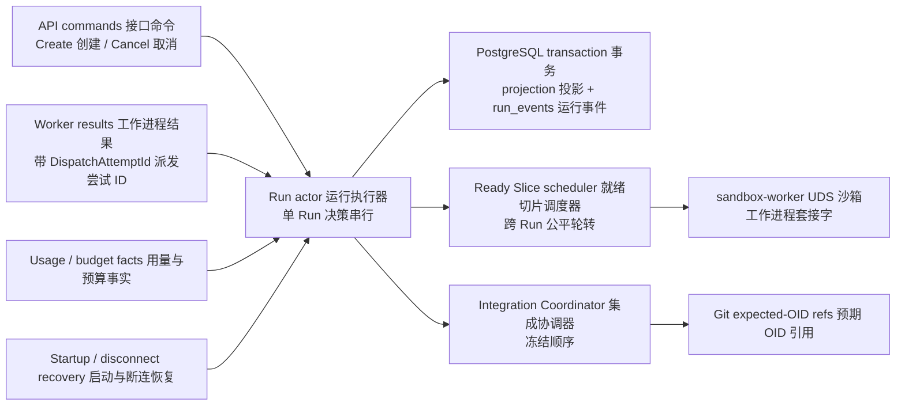

# CodeMigrator Harness：Run actor、派发接管与事实恢复

> 文档状态：V4 当前架构基线  
> 适用范围：单写者控制面、单个 Run 的命令归约、契约层/实现层拓扑层并行 Slice 调度（依赖闭包就绪即启动，无全局屏障）、worker 接管、取消、预算终止与崩溃恢复  
> 契约真相：[M-00 垂类设计原则与架构哲学](CodeMigrator_垂类设计原则与架构哲学.md)拥有 `RunStatus`、`SliceAttemptStatus`、`CandidateGeneration`、`DispatchAttemptId`、失败原因、Git refs 与固定保留期  
> 关联文档：[系统后端架构](CodeMigrator_系统后端架构.md)、[Agent Loop](CodeMigrator_Agent_Loop设计.md)、[迁移计划生成器](CodeMigrator_迁移计划生成器.md)、[候选工作区与工具网关](CodeMigrator_候选工作区与工具网关.md)、[沙箱与执行环境](CodeMigrator_沙箱与执行环境.md)、[验证引擎](CodeMigrator_验证引擎.md)、[工作空间与 Git 集成](CodeMigrator_工作空间与Git集成.md)、[Web 体验与迁移可视化工作台](CodeMigrator_Web体验与可视化工作台.md)

Harness 编排层的职责不是把所有写操作包进一种并发协议，而是让每个事实只有一个决定者。一个 app 负责控制面写入，每个非终态 Run 由一个内存 actor（asyncio 任务）串行处理命令；并行发生在 actor 派发的独立 Slice 候选工作区（candidate workspace）与沙箱任务中。PostgreSQL 保存可重启事实，Git 保存代码事实，worker 只返回带物理派发身份的执行事实。CLI 是写控制命令的产品入口；Web 只把 actor 已持久化的投影和 `run_events` 呈现为迁移现场。

## 单 app 是部署约束，不是分布式选主

`app` 启动时用一条专用 PostgreSQL session 连接获取控制面 advisory lock。只有持锁进程可以通过 readiness、恢复非终态 Run 或接受迁移写命令；第二个 app 即使进程存活，也必须拒绝 ready，不能进入只写一部分事实的降级模式。

| app 生命周期事件 | 立即动作 | 后续动作 | 禁止行为 |
|---|---|---|---|
| 获得 session lock | 开放恢复流程，仍保持 readiness 关闭 | 恢复完成且 worker/PG 预检通过后 ready | 未恢复 actor 就接受 CreateRun |
| 未获得 lock | 保持 not-ready | 退出，由 Compose 按部署策略处理 | 作为热备读取后偷偷执行命令 |
| 持锁连接丢失 | 关闭 readiness，拒绝新命令，关闭所有 app-worker 控制连接 | 要求 worker 清理活动进程组并退出；app 随后退出 | 重新连库后在原进程中继续写 |
| PostgreSQL 暂时不可用 | 保持已提交投影可诊断，但不接受写命令 | 退出并由 Compose 重启 | 先写内存、文件或 Git，稍后补库 |

advisory lock 只证明“当前有一个控制面写者”，不进入 Run、Slice、worker 消息或 Git commit。系统不保留多 app 水平扩展所需的周期协调机制；如果未来改变部署边界，必须重新设计而不是复用这把 session lock。

## 每个 Run 由一个 actor 串行决定

API、worker 返回、预算事件和恢复命令都进入相应 Run actor 的有序邮箱（asyncio.Queue）。actor 负责检查当前 Run/Slice 投影、作出确定性归约，并按 M-02 拥有的 `next_event_sequence` 规则把状态变化和 `run_events` 在一个 PostgreSQL 事务提交。数据库 `version` 仍对外投影，供 GET 响应 ETag 和 DELETE 的 `If-Match` 使用；事件序列的分配细节由 M-02 唯一定义，本篇不复制。内部步骤不对每次写入重复 expected-state/version 比较。

| actor 拥有的决定 | 输入事实 | 可写事实 | 不直接执行 |
|---|---|---|---|
| Run 阶段推进 | M-00 状态边、当前 Slice 投影、验证 receipt | Run projection、failure reason、event | HTTP DTO、Git 命令、沙箱进程 |
| Slice 调度 | M-07 四类 Slice DAG ready 集、write scope 互斥、全局资源许可 | active dispatch 集合、Slice attempt 投影 | 扩大 write scope、改变集成顺序 |
| 集成准入 | 冻结队首、局部验证 receipt、integration intent/receipt | 集成投影与 event | 跳过 M-10 prospective checks |
| 取消 | 已持久化外部命令、当前 active attempts | `cancel_requested`、取消投影与 event | 把取消归约成部分完成 |
| 终态 | 已集成 Slice、类型化 terminal failures、最终验证 | Run terminal projection | 改写报告或代码交付状态 |

一个 Run actor 的阻塞不得阻塞其他 Run。scheduler 在不同 Run 间公平轮转；同一 Run 只选择 DAG ready 且 write scope 互斥的 Slice，实现波与测试翻译 Slice 的 ready 条件包含其依赖契约 Slice 已集成——两波次序由 M-07 的 DAG 表达，不为 `RunStatus` 增加状态。真正耗时的模型调用、Agent 工具箱执行（M-12 的 `ReadFile/WriteFile/EditFile/QuerySourceAst/Shell/Exec` 六工具，作用于本 Slice 候选工作区即沙箱卷，write scope 双轨防护）、Git 集成事务和 sandbox 检查在 actor 外执行，完成后以不可变 receipt 回到邮箱，actor 不在等待 I/O 时阻塞事件循环。

## DispatchAttempt 只识别一次物理派发

每次 app 向 worker 发出物理请求都会生成新的 UUIDv7 `DispatchAttemptId`。actor 在 PostgreSQL 维护 active dispatch 集合，唯一键固定为 `run_id + canonical(ExecutionSubject identity) + check_id`；每个键恰有一个 active attempt，不同 Slice、不同 check，以及 prospective/final subject 可以按资源许可并行。entry 保存 attempt、完整判别 subject、CheckId 与 `tested_commit_oid`；物理中断后的重派只替换该 entry 的 attempt，不消耗语义 generation。物理重派范畴显式包含模型基础设施故障（provider 5xx/超时/断流）：会话级模型调用失败按 30s/60s/120s 逐次退避做**同代重派**——不消耗 generation，每次中断以 `dispatch.interrupted` 审计事件记入 `run_events`（语义追认 owner 为 M-00）。

| 返回校验 | 匹配 | 不匹配 |
|---|---|---|
| `run_id + subject identity + check_id` | 找到唯一 active entry | 记录 `LATE_DISPATCH_RESULT`，不归约业务结果 |
| `dispatch_attempt_id` | 继续检查 | 视为取消、断连或重派后的迟到结果 |
| `tested_commit_oid` | 可归约 CheckResult 或失败事实 | candidate/scratch/verified revision 已变化，结果失效 |

迟到成功与迟到失败采用相同行为：只写低基数审计事件，不生成 `CheckResult`，不推进 candidate 或 verified，也不改变当前 attempt 的重试计数。这个窄 gate 保护异步返回边界，不流入 worker 协议、Agent 文件操作或普通数据库写入。

**边界例：**同一 candidate 同时执行 Compile 与 Test，它们拥有两个 active keys 和两个 attempt。worker socket 断开后，actor 分别将两个 entry 记为 `INTERRUPTED` 并创建新 attempt/新 validation overlay。旧 Compile 随后返回“通过”；即使 tested OID 未改变，attempt 已不是对应 key 的 active 值，结果仍被丢弃，也不会影响新 Test。

## worker 断连即接管，不等待时间窗口

app 与独立 `sandbox-worker` 使用 M-09 拥有的宿主 UDS 协议。worker 不连接 PostgreSQL，因此它不能判断 Run 是否取消、不能发布集成结果，也不能在 app 不可用时继续孤立工作。

| 故障方向 | worker 侧 | app 侧 | 恢复结果 |
|---|---|---|---|
| app 控制连接断开 | 终止该连接所属的全部沙箱进程组 | 当前进程通常已失去控制面资格 | 5 秒内清空；否则 worker 自行退出，由 Compose 重启 |
| worker 连接断开 | 进程退出或重建本地 listener | 该连接的所有 active entries 记为 `INTERRUPTED` | Run 未取消且 subject 有效时，每键以新 attempt 和新 overlay 自动续跑 |
| 单一沙箱进程异常 | 终止其进程组并返回类型化失败 | 按 active attempt gate 接收 | 由错误类别决定同 attempt 失败或物理重派 |

取消传播也通过当前控制连接执行。worker 必须在收到取消后终止对应进程组；5 秒清理上限由沙箱模块拥有。无论 worker 是否及时返回确认，actor 一旦持久化取消就不得创建新 generation、dispatch 或 integration。

## 取消先成为事实，再成为 HTTP 成功

`DELETE /api/v1/migrations/{run_id}` 的 API 层只校验 `If-Match` 的语法并构造 `CancelCommand(expected_version)`，不在 actor 之外先读 version 作决定。actor 处理该命令时才比较 expected version 与当前 Run version；不匹配返回 `STALE_VERSION` 且写入数为零，匹配则在同一 PostgreSQL 事务写入 `cancel_requested=true`、新 version 与对应 `run_events`，提交后才向 API 确认接受。这是外部取消命令的并发保护，不被复用为内部步骤的通用 CAS。CLI 的首次 Ctrl+C 同样只能走这条命令链：它不能直接终止 worker、写 PostgreSQL 或修改 Git；`STALE_VERSION` 时客户端最多刷新一次投影并以新 version 重试一次，是否继续等待终态属于 [M-15](CodeMigrator_Web体验与可视化工作台.md) 的交互边界。

取消事实提交后：未派发 Slice 保持不启动，活动 attempt 收到终止请求，集成队列停止消费，未验证 candidate 归入 abandoned 证据，已经推进的 verified 主线保持不变。Run 最终恒为 `CANCELLED`，即使已有一个或多个 Slice 集成成功，也只在终态投影中展示这些事实，不改写为 `PARTIALLY_COMPLETED`。

## checkpoint 加速恢复，不证明完成

checkpoint 仍按每 10 个任务或 60 秒生成，保存 actor 可重建的游标、已提交 receipt 引用和候选索引；它不是任务完成证明，也不是 [M-08](CodeMigrator_候选工作区与工具网关.md) 候选工作区的 checkpoint commit——后者把 Agent 文件操作后的工作区文件集提交为代码事实，由 Git refs 与 checkpoint 幂等键保护。完整控制事实来自 PostgreSQL，代码事实来自 Git，正文事实来自 host CAS。checkpoint 损坏时允许忽略并重建，不得因为缓存内容领先而推进状态。

| 事实/派生物 | 恢复 owner | 恢复动作 | 幂等边界 |
|---|---|---|---|
| 非终态 Run 与 Slice | PostgreSQL | 重建 actor、ready 集和 frozen integration order | 唯一 Run/Slice ID |
| active dispatch 集合 | PostgreSQL + worker 连接事实 | 启动时逐 entry 标为 `INTERRUPTED`，必要时创建新 attempt/overlay | `(run, subject identity, check_id)` 唯一约束 |
| candidate/verified/scratch | Git refs | 由 M-11 判定 candidate 继续、失败归档或集成恢复 | expected OID ref transaction |
| candidate checkpoint commit 已写、receipt 缺失 | Git candidate ref 已是 checkpoint commit | 按 M-08 checkpoint 幂等键补写 receipt | 不重复应用工作区文件集 |
| integration intent 无 receipt | PG intent + Git ref | 比对 expected/new OID，重试推进或补写 receipt | intent/receipt 唯一键 |
| checkpoint | PG/CAS 引用 | 可验证则加速；损坏则舍弃 | 不作为终态 guard |

Recovery Coordinator 只由 app 启动、worker 断连或已知 integration intent 缺口触发，不常驻扫描。若 Git verified 已等于 intent 的 new OID 而 receipt 缺失，恢复只补写 receipt；若仍等于 expected OID，则按原 intent 幂等重试；若两者都不等，停止该 Run 并报告 ref drift，不猜测覆盖。

## 预算耗尽关闭新工作

Run usage ledger 累计模型 token 与成本。达到 80% 只写一次告警事件；任一上限达到 100% 时，actor 关闭新模型、工具、generation、dispatch 与 integration，保存 checkpoint，归档未验证 candidate，再以 `FailureReason.BudgetExhausted` 进入 `FAILED`。checkpoint I/O 失败会形成 `CHECKPOINT_WRITE_FAILED` 证据，但不能重新开放预算门或启动 provider。

报告正文生成仍属于 `REPORTING`。正文生成、脱敏或持久化失败使 Run 进入 `FAILED`；终态后报告投递与 push/PR 只改变统一枚举 `DeliveryChannelStatus` 的对应交付 ledger 投影（`report_delivery_status` / `code_delivery_status`，两列分立互不影响）。这些投影的重试可使用幂等唯一键，但不经过 Run actor 重开迁移主线。

## 贯穿场景：并行候选在 app 重启后继续汇合

一个 TS→Python 翻译 Run 进入 `EXECUTING` 后（A 与 B 依赖闭包内的契约 Slice 均已集成，模块接口契约就绪），actor 同时选择 write scope 不相交的实现 Slice A 与 B，为二者 generation `0` 创建独立候选工作区（candidate workspace，见 [M-08](CodeMigrator_候选工作区与工具网关.md)），并在 active dispatch 集合中分别建立各自的 active entry 与 attempt。A 先局部通过并进入集成队列；B 的 worker 连接断开，B 对应 entry 的旧 attempt 被记为 `INTERRUPTED`，actor 在不改变 generation 的情况下为该键派发新 attempt。旧 worker 的迟到成功只产生审计事件。

A prospective head 验证通过后，Integration Coordinator 写入 intent、以 expected verified OID 推进 Git，再准备写 receipt；此时 app 崩溃。worker 因 UDS 断开清理全部沙箱。新 app 取得 session lock，从 PostgreSQL 重建 actor，发现 Git 已是 intent 的 new OID，遂补写 receipt 而不重复集成 A。B 从原 candidate generation 继续。最终所有可集成 Slice 处理后，Run 单向进入 `VERIFYING` 执行翻译后全套测试的最终全量验证，再进入 `REPORTING`。

## 可检查的运行性质

- 第二个 app 无法获得 session advisory lock 时 readiness 为失败，且控制面写入数为零。
- 任一 Run 的状态、Slice 调度、集成和终态决定只经该 Run actor；不同 Run 仍可并行。
- 旧 DispatchAttempt 在取消、断连或重派后返回成功时，不生成 CheckResult，不推进 candidate/verified。
- worker 断连立即产生 `INTERRUPTED` 并创建新 attempt，不依赖周期时间窗口；物理重派不增加 generation。
- app 断连后 worker 在 5 秒内清空沙箱进程组，失败则自行退出。
- cancel API 只在 `cancel_requested` 与事件提交后确认；此后新 generation、dispatch 和 integration 数均为零。
- Git 已推进、receipt 缺失时恢复只补 receipt；intent 已写、Git 未推进时按 expected OID 幂等重试。
- 损坏 checkpoint 可仅由 PostgreSQL、Git 与 CAS 引用重建，不被解释为完成事实。
- 预算达到 100% 后新模型与工具调用数为零，且 checkpoint/归档先于 `FAILED`。
- 当前实现不存在周期任务续权、全链路代次令牌、字节级前置哈希守卫、Run 级共享候选引用、内部通用状态 CAS、独立事件中继或常驻轮询恢复器。

## 会话输入只在安全点改变调度

CLI 的 Ctrl+C 仍通过 `CancelCommand(expected_version)` 进入本 actor；会话 message、AskUser answer 与 correction confirmation 则由 [M-16](CodeMigrator_会话与运行时修正编排.md) 先持久化。actor 收到新的 CorrectionIntent 后把 InteractionStatus 置为 `PAUSING_FOR_INPUT`，停止新模型调用、dispatch、候选工作区 Agent 文件操作、generation 与 integration，并让已有原子操作抵达安全点。只有 intent 已写时，actor 先完成 expected-OID Git 对账与 receipt 恢复，随后才进入 `WAITING_FOR_USER` 或 `APPLYING_CORRECTION`。

局部修正应用后 actor 切换到新的 PlanRevision；结构修正只在 preview hash 被确认后切换。它不接受来自 CLI/Web 的 worker 终止、Git ref 写入或数据库直写请求。Final Verify 开始后，输入成为后续 TaskDraft，当前 actor 保持 `VERIFYING → REPORTING` 的单向主线。

> 设计演进、历史缺陷处置和变更理由见：[文档迭代记录](文档迭代记录.md)。
