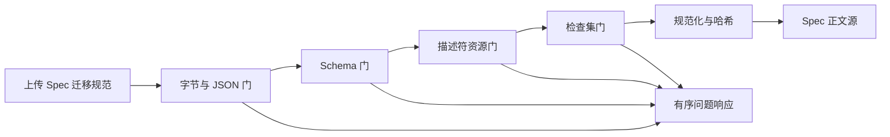

# CodeMigrator Migration Spec：从迁移意图到可验证输入

> 文档状态：V4 当前架构基线。  
> 适用范围：迁移意图作者、Spec 上传端、CreateRun 前置校验。  
> 契约真相：公共 ID、`ToolchainDescriptor`、`SourceToolchain`、`TargetToolchain`、`CheckCommandTemplate`、`CheckAction`、`RequiredCheck` 与检查超时由 [M-00：设计原则、并行系统地图与公共契约](CodeMigrator_垂类设计原则与架构哲学.md) 唯一定义；本篇拥有 Spec 的业务语义和规范化规则。  
> 关联文档：[工程边界与目录架构](CodeMigrator_核心目录架构设计.md)、[外部 API 与投影](CodeMigrator_系统后端架构.md)、[源端代码分析](CodeMigrator_代码分析与AST引擎.md)、[并行计划生成器](CodeMigrator_迁移计划生成器.md)、[沙箱与执行环境](CodeMigrator_沙箱与执行环境.md)、[验证引擎](CodeMigrator_验证引擎.md)。

Migration Spec 不是"给模型的一段需求"，而是一份可持久化、可审计、可在运行前拒绝的问题定义。它把跨语言迁移意图收束为一个已锁定的语言对、两份精确锁定的工具链描述符资源、一个有限的迁移范围和一组必须完成的检查。这样，后续模块接到的是确定输入，而不是用户命令、自由 prompt 或构建脚本。翻译语义本身不进入 Spec：由 EXECUTE 的 Agent 依契约层产出的接口直接承担，Spec 只锁定"翻译成什么语言、翻哪些路径、用什么检查证明"。

## Spec 的边界：声明什么，不声明什么

一份有效 Spec v3 声明语言对（`source_language_id` + `target_language_id`）、双工具链描述符锁（`descriptor_version` + 源/目标资源摘要 + 工具链镜像摘要）、迁移范围（include/exclude 路径模式，有限表达力）、检查集（从目标端描述符 `CheckCommandTemplate` 中选择的 `CheckAction` 集合，至少含 Compile 与 Test 各一）与可选的分解策略（目标模块粒度、并行度上限、测试分组策略）。它不承载翻译规则、模型指令、prompt、自由命令、shell、argv；也不自定义超时——超时只能来自描述符模板的 `timeout_secs`。

| 输入面 | 允许表达 | 拒绝原因 |
|---|---|---|
| 语言对 | 源/目标 `language_id`，必须与锁定的两份描述符资源一致 | 防止语言声明与实际能力资源分叉 |
| 描述符锁 | 精确版本、源/目标描述符资源 SHA-256、工具链镜像摘要 | 防止同名升级在 Run 中改变 grammar、命令模板或沙箱策略 |
| 迁移范围 | 仓库相对路径的有限模式（include/exclude） | 使范围事实确定、可哈希、可在规划前判定 |
| 检查集 | `CheckAction` + 模板摘要的选择对；Compile 与 Test 必选 | 保证每一个 Slice 都有可派生的完成条件 |
| 分解策略 | 目标模块粒度、并行度上限、测试分组策略（可选） | 只约束计划形状，不触碰 write scope 或检查内容 |
| 自由命令或 prompt | 不允许 | 避免绕过类型化执行与不可信数据边界 |

write scope 不是 Spec 字段：M-00 规定 `WriteScope` 由 Planner 从分析产物与描述符派生，Spec 与模型都不能提交或覆盖它。Spec 中出现任何 write scope 声明字段按 unknown-field deny 拒绝。

### 固定输入门槛

上传正文为 UTF-8 JSON，最大 `256 KiB`（`262144` bytes），无 BOM、无重复 key、最大嵌套深度 `32`。顶层 `schema` 固定为 `codemigrator.migration-spec`，`version` 固定为整数 `3`，所有层级拒绝未知字段（Pydantic v2 模型以 `extra='forbid'` 承载该约束）。最多返回 `100` 个按 JSON Pointer 升序排列的问题；其余以 `truncated=true` 标识。

这些限制并非为了压缩表达，而是把 Spec 保持在"可在 API 边界完整校验"的规模。语言能力正文归属于内置描述符资源与 grammar 制品，不随每次上传进入数据库。

## 从上传到冻结：四道门，而不是一条乐观路径



门之间不存在"尽量继续"的分支：任一门失败，该次上传不产生 Spec 正文；CreateRun 的描述符资源门失败则不分配 `run_id`，Run、`run_events` 与 Git ref 新增数均为 `0`。资源预检发生在 CreateRun 事务之前，因此失败路径也不会创建 Slice、candidate generation 或 worker dispatch。

| 门 | 检查事实 | 成功产物 | 主要拒绝 |
|---|---|---|---|
| 字节与 JSON | 大小、编码、重复 key、深度 | strict document | `SPEC_TOO_LARGE`、`SPEC_JSON_INVALID`、`SPEC_DUPLICATE_KEY`、`SPEC_DEPTH_EXCEEDED` |
| Schema | 固定 schema/version、未知字段、字段类型、语言对非空、include 非空且模式合法 | typed document | `SPEC_SCHEMA_UNSUPPORTED`、`SPEC_SCHEMA_INVALID` |
| 描述符资源 | 源/目标描述符存在性、版本与资源摘要匹配、源端 grammar 可用、目标端工具链镜像摘要可验证 | frozen descriptor selection | `DESCRIPTOR_NOT_FOUND`、`DESCRIPTOR_DIGEST_MISMATCH`、`TOOLCHAIN_IMAGE_UNAVAILABLE` |
| 检查集 | 所选 `CheckAction` 与模板摘要被目标端描述符覆盖、Compile 与 Test 必选 | canonical business document | `CHECK_ACTION_UNSUPPORTED`、`CHECK_SET_INCOMPLETE` |

### v3 顶层字段清单

| 字段 | 类型 | 必填 | 固定约束 |
|---|---|---|---|
| `schema` | string | 是 | 恰为 `codemigrator.migration-spec` |
| `version` | integer | 是 | 恰为 `3` |
| `name` | string | 是 | `1..=128` 字节业务名称 |
| `description` | string | 否 | ≤`1024` 字节；只入投影与报告，不参与门判定 |
| `source_language_id` | string | 是 | 小写语言 slug；必须与目标语言不同——跨语言全量翻译是唯一支撑定位 |
| `target_language_id` | string | 是 | 同上 |
| `descriptor_lock` | object | 是 | 恰含 `descriptor_version`、`source_descriptor_sha256`、`target_descriptor_sha256`、`toolchain_image_digest` 四个子字段 |
| `scope` | object | 是 | `include` 至少 `1` 条合法模式；`exclude` 可省略 |
| `required_checks` | array | 是 | `(action, template_sha256)` 选择对；Compile 与 Test 至少各一 |
| `decomposition` | object | 否 | 三个子字段均可选；取值枚举与 M-07 对齐，并行度上限只收窄、从不放大 M-00 沙箱并发公式 |

### 有序问题响应

任一门失败时，API 返回按 JSON Pointer 字典序升序的问题清单，每条含 `pointer`、`code` 与固定 message 模板；总数超过 `100` 时截断并置 `truncated=true`，未列出的其余问题不改变拒绝结论。门之间按固定次序短路：前一门失败后，后续门不再对同一上传产生第二组问题，避免跨门噪音淹没首先失败的事实。

上传成功后只说明 Spec 本身合法；每次 CreateRun 都会用已存描述符锁再次进行资源预检。这样既可复用历史 Spec，也不会让已被替换、损坏或镜像失联的描述符资源进入新的 Run。

## 描述符锁与能力预检

描述符资源是随 app 分发的内置声明式资源（物理形状由 [M-01](CodeMigrator_核心目录架构设计.md) 冻结），按语言对组织为源端与目标端两份：源端声明语言 id、扩展名、tree-sitter grammar 与清单解析（M-00 `SourceToolchain`）；目标端声明包管理器与脚手架/构建/测试/lint/类型检查命令模板及工具链镜像摘要（M-00 `TargetToolchain`）。Spec 的描述符锁同时命中两份资源；两份命中资源组装后即为 M-00 的 `ToolchainDescriptor`，组装视图的 `descriptor_sha256` 由两份资源 canonical bytes 派生。语言对 id 与资源不一致（例如源端声明 typescript 却命中 python 源资源）按 `DESCRIPTOR_NOT_FOUND` 拒绝。

目标端描述符还携带工件策略字段 `artifact_rules`（字段形状归 [M-01](CodeMigrator_核心目录架构设计.md)，`ArtifactKind` 枚举归 M-00 公共契约）：以模式声明工件分类——`GeneratedCode`/`DeclarativeConfig`/`ResourceFile` 三类——与各类处理策略。能力门（描述符资源门与 CreateRun 预检）在锁定资源的同时消费该工件声明：工件分类事实由 [M-06](CodeMigrator_代码分析与AST引擎.md) 按声明模式在快照扫描期识别（F4 构建清单摘要与工件识别），并作为 [M-07](CodeMigrator_迁移计划生成器.md) 的 Slice 派生输入——工件策略由此影响 Slice 派生。Spec 正文不出现任何工件声明字段（unknown-field deny 拒绝）：工件策略的真相在描述符，Spec 经由描述符锁间接锁定它，与命令模板、超时同一待遇。

| 参与者 | 拥有的事实 | 不能决定的事 |
|---|---|---|
| Spec | 语言对、双描述符锁（版本+资源摘要+镜像摘要）、范围、检查选择、分解策略 | grammar 正文、命令模板正文、write scope、超时 |
| 描述符资源 | 已发布语言能力与冻结命令模板（含 `timeout_secs`） | 某个 Run 是否有权开始 |
| CreateRun preflight | Spec 锁与当前安装资源是否仍精确匹配 | 修改已存 Spec 或降低校验标准 |
| Runtime | 预检通过后冻结选择并开始事务 | 以兼容版本范围替代精确锁 |

资源门在两个时点执行同一清单：上传期作用于当次正文，CreateRun 期作用于已存描述符锁。两个时点不存在不同的放宽标准，历史 Spec 的复用因此不会跳过预检：

| 检查项 | 通过条件 | 失败码 |
|---|---|---|
| 源端资源存在 | 描述符资源账本命中 `source_language_id` 对应源端资源 | `DESCRIPTOR_NOT_FOUND` |
| 目标端资源存在 | 账本命中 `target_language_id` 对应目标端资源 | `DESCRIPTOR_NOT_FOUND` |
| 版本与摘要匹配 | Spec 锁的版本与两个资源 SHA-256 同账本登记值全等 | `DESCRIPTOR_DIGEST_MISMATCH` |
| 源端 grammar 可用 | grammar 制品摘要与描述符声明一致且可加载 | `DESCRIPTOR_NOT_FOUND` |
| 目标端镜像可验证 | `toolchain_image_digest` 可在本地缓存或配置 registry 完成验证 | `TOOLCHAIN_IMAGE_UNAVAILABLE` |

### 贯穿场景：一次 TS→Python 的迁移声明

迁移意图作者提交一个 `1794` bytes 的 v3 Spec，锁定 typescript-source 与 python-target 两份内置描述符：

```json
{
  "schema": "codemigrator.migration-spec",
  "version": 3,
  "name": "orders-api-ts-to-python",
  "description": "将订单服务从 TypeScript 翻译为 Python 项目",
  "source_language_id": "typescript",
  "target_language_id": "python",
  "descriptor_lock": {
    "descriptor_version": "1.4.2",
    "source_descriptor_sha256": "sha256:9f2c…",
    "target_descriptor_sha256": "sha256:4ab1…",
    "toolchain_image_digest": "sha256:e7d0…"
  },
  "scope": {
    "include": ["src/", "tests/"],
    "exclude": ["src/generated/"]
  },
  "required_checks": [
    { "action": "COMPILE", "template_sha256": "sha256:31cc…" },
    { "action": "LINT", "template_sha256": "sha256:8e5a…" },
    { "action": "TEST", "template_sha256": "sha256:6d20…" },
    { "action": "TYPECHECK", "template_sha256": "sha256:b093…" }
  ],
  "decomposition": { "max_parallelism": 4, "test_grouping": "BY_MODULE" }
}
```

上传门先验证字节与 schema，再由资源门命中两份 `1.4.2` 描述符：typescript-source 携带 tree-sitter grammar 摘要与 package.json 清单解析，python-target 携带 pyproject 构建、pytest、ruff 与 mypy 模板及镜像摘要；检查集门确认四个选择均被目标端模板覆盖且含 Compile 与 Test。规范化后同一业务正文仅调整 object key 或数组输入顺序，hash 保持不变，第二次上传返回既有 Spec 身份而不是制造新版本。

若 CreateRun 前目标端资源被 `1.4.3` 替换，预检返回 `DESCRIPTOR_DIGEST_MISMATCH`；该 Spec 仍可被读取和审计，但不存在新的 Run、Slice 或 Git 副作用。若目标端镜像摘要无法在本地或配置 registry 验证，同样以 `TOOLCHAIN_IMAGE_UNAVAILABLE` 零副作用拒绝。

该 Spec 通过 CreateRun 后，后续消费全部以 canonical hash 关联同一正文：范围 `src/ + tests/` 决定 M-06 的扫描面，被排除的 `src/generated/` 不进入模块清单与测试覆盖图；四个检查随计划冻结为全量检查集，最终验证在冻结 verified head 上执行 pytest 模板全集。用户事后想补翻 `src/generated`，只能通过新 Spec 与新 Run 表达，不存在对既有 Spec 的追加改写。

## 迁移范围：仓库相对路径的有限模式

include/exclude 只接受仓库相对路径的有限模式，表达力被刻意限制为"前缀匹配 + 有限后缀"：

| 模式形态 | 匹配语义 | 示例 |
|---|---|---|
| 字面目录前缀 | 以该前缀开头的所有文件 | `src/`、`tests/` |
| 字面文件 | 恰好该文件 | `package.json` |
| 前缀 + 尾段通配 | 前缀目录下单层文件名匹配，`*` 只允许出现在最后一段且每模式至多一次 | `src/*.ts`、`tests/*.test.ts` |

`**`、`?`、字符类、大括号展开、正则、绝对路径、`..`、空段与 `.git` 前缀一律 `SPEC_SCHEMA_INVALID` 拒绝。exclude 只能在 include 之内收窄，不能引入 include 未覆盖的新前缀。`.git/` 永远排除：即使 include 覆盖整个仓库根，`.git` 下任何路径都不进入范围事实。语言对的源扩展名过滤（如只取 `.ts/.tsx`）由源端描述符的 `extensions` 在 [M-06](CodeMigrator_代码分析与AST引擎.md) 分析时决定，不进入范围模式本身。

文件级求值只有一条规则：`included(file) = matches(include) && !matches(exclude)`，判定发生在 M-06 快照扫描期，结果作为分析输入冻结，运行期不存在重算。范围与源扩展名过滤的交集为空时，M-06 按空输入项目报告分析失败，而不是在 Spec 层猜测意图。以上文贯穿场景的 `include=["src/","tests/"]`、`exclude=["src/generated/"]` 为例：

| 示例路径 | include 命中 | exclude 命中 | 求值结果 |
|---|---|---|---|
| `src/models/user.ts` | `src/` | 否 | 进入范围 |
| `src/generated/api.ts` | `src/` | `src/generated/` | 排除 |
| `.git/config` | 否 | — | 排除（永久规则） |

范围事实参与规范化：include 与 exclude 各自去重后按 UTF-8 字节升序保存，并进入 Spec canonical hash。相同语言对与检查集、不同 include 集合是两份不同 Spec；范围在 Run 内不可被运行期扩大。

## 检查集：引用描述符模板，而不是携带命令

迁移是否完成由 M-00 的派生 Oracle 决定，但 Oracle 的输入集合由 Spec 决定。Spec 的 `required_checks` 是 `(action, template_sha256)` 选择对的列表；进入计划冻结时系统为每一选择分配 `CheckId`，构成 M-00 的 `RequiredCheck`（字段 `id`、`action`、`template_sha256`）。命令正文、program、argv 与超时永远只存在于目标端描述符的 `CheckCommandTemplate` 中，由裁决层 Harness 内部验证独占消费；Agent 侧会话自检经 `Shell` 自由命令执行（[M-12](CodeMigrator_工具系统与Hook.md)），不共用裁决命令面、不写 `CheckResult`——验证独立性由冻结检查集独立裁决保证。

| 规范化项 | 规则 | 拒绝码 |
|---|---|---|
| action | 必须存在于目标端描述符对应 action 的模板集合 | `CHECK_ACTION_UNSUPPORTED` |
| 模板摘要 | 必须精确等于该 action 下某个模板的 canonical SHA-256 | `CHECK_ACTION_UNSUPPORTED` |
| 必选约束 | Compile 与 Test 至少各一项 | `CHECK_SET_INCOMPLETE` |
| 重复 | 同一 `(action, template_sha256)` 恰好一次 | `SPEC_SCHEMA_INVALID` |
| 排序 | 去重后按 CheckAction 名称、模板摘要的 UTF-8 字节升序 | 不保留输入顺序语义 |
| 超时 | 只来自模板 `timeout_secs`（默认档 Scaffold/Compile/Lint/TypeCheck `300` 秒、Test `120` 秒） | Spec 层不存在该字段 |

三层验证消费的是同一冻结集合：局部、集成与最终各取该集合的哪个子集由 [M-10](CodeMigrator_验证引擎.md) 定义。Spec 不为任何验证层单独声明检查子集，运行期也不允许删减或替换集合成员——这正是"运行期删减检查"被列入交接表不交接列的原因。

### 边界例：把命令伪装成参数

Spec 层没有命令参数面。`required_checks` 只携带 action 与模板摘要；`program`、`argv`、`shell`、`script`、`timeout`、`prompt`、`prompt_template`、`model_instructions` 等字段因 schema unknown-field deny 在 hash 之前被拒绝。受信层从不接受 Spec 提供的任何命令正文，前端也只展示目标端描述符登记的 action 与模板清单，不提供自由命令或超时输入控件。

## 规范化正文、去重与留存

业务字段通过 RFC 8785 JCS 转换为 canonical UTF-8 JSON，再计算 SHA-256。hash 覆盖 schema/version、语言对、描述符锁、规范化范围、完整 canonical 检查集、分解策略与业务 metadata，不覆盖 `SpecId`、创建时间等服务端生成字段。相同 canonical bytes 走 insert-or-get（实现注记：SHA-256 碰撞在工程上可忽略；如同 hash 不同 bytes 的探测分支存在，属防御性实现细节而非契约故障路径）。

| 输入差异来源 | 规范化动作 | hash 效果 |
|---|---|---|
| object key 顺序 | JCS 统一键序 | 不变 |
| `required_checks` 输入顺序 | 按 (action, template_sha256) 重排 | 不变 |
| `include`/`exclude` 输入顺序与重复项 | 去重后按 UTF-8 字节升序 | 不变 |
| JSON 数字表示差异 | JCS 数字规范化 | 不变 |
| 语义差异（不同模板摘要、不同范围、不同语言对） | 无规范化可消除 | 必然改变 |

| 保存位置 | 保存内容 | 真相源角色 | 留存与恢复 |
|---|---|---|---|
| PostgreSQL `migration_specs` | 原始 JSON、canonical JSON、hash、描述符锁、canonical 检查集 | Spec 持久正文源 | M-00 长期事实；存在 Run 引用时删除返回 `SPEC_IN_USE` |
| PostgreSQL validation receipts | gate 摘要、错误投影与 idempotency 结果 | 审计投影 | 与 M-00 run ledger 同期限 |
| 描述符资源账本 | 内置源/目标描述符、grammar 摘要、命令模板与镜像摘要登记 | 能力正文源 | 按锁定版本与 SHA-256 对账；显式删除前长期保留 |
| 进程内 JSON tree | 单次请求解析值 | 临时源 | 请求结束释放 |

数据库提交不确定时，以 canonical hash 查询；未查到才最多重试 `1` 次。Spec 上传的 HTTP `Idempotency-Key` 只重放响应，不改变基于正文 hash 的去重语义。

## API 入口与可观察的失败

外部入口由 [M-02](CodeMigrator_系统后端架构.md) 唯一拥有；本篇限定其语义：`POST /api/v1/specs` 需要 `Idempotency-Key`，正文符合 v3 且不超过 `256 KiB`；`POST /api/v1/migrations` 接受既存 `SpecId` 和 M-00 的 `CreateRun`，描述符资源失败返回 `422` 且没有 `run_id`。DTO 与路由形状以 M-02 为准；`GET` 只返回已经存储的 Spec，不展开描述符资源内部正文或宿主路径。

| 事件 | 记录字段 | 不能记录的内容 |
|---|---|---|
| 上传成功/拒绝 | `spec_id`、canonical hash、schema、语言对、error code | description 正文、分解策略正文、任何 prompt |
| 描述符资源拒绝 | 不匹配原因分类（版本/摘要/镜像） | 资源内部正文、宿主路径 |
| 检查集拒绝 | action 与拒绝分类 | 用户提交的模板参数正文 |

各门失败到 HTTP 类别的映射只做方向约束，响应 envelope 与路由形状以 M-02 为准：

| 拒绝来源 | HTTP 类别 |
|---|---|
| 字节与 JSON 门 | `400` |
| Schema 门、描述符资源门、检查集门 | `422` |
| 读取不存在的 Spec | `404` |
| 删除被 Run 引用的 Spec | `409`（`SPEC_IN_USE`） |

`codemigrator_run_preflight_side_effect_total` 在描述符资源拒绝路径必须为 `0`；Run、`run_events`、Slice、dispatch 与 Git ref 的新增量也必须分别为 `0`。若出现非零值，说明前置 gate 被错误地放到了 CreateRun 事务或 Git 初始化之后。

## 交接给分析与计划

Spec 进入 Run 后保持不可变。M-06 使用源项目快照、源端解析器引用与测试识别配置建立 import 图、模块清单与测试覆盖图；M-07 接收范围、检查集、分解策略与描述符锁，构造契约/实现/测试翻译/测试生成四类 `MigrationSlice`（M-00 `SliceKind`）并从描述符派生 write scope；首版所有 Slice 完整继承 Spec 全量冻结检查集，没有按文件裁剪或局部检查子集。三层验证消费的是同一冻结集合，各层实例化该集合的哪个子集由 M-10 的分层检查表唯一定义（NONDETERMINISM 守卫以共有 CheckId 规范化语义结果为单位比较，不要求两层 frozen set 全等，见 M-00/M-10）。Spec 不能因为某个 Slice 失败而被局部改写或临时放宽。

不可变性有机制支撑而不只是承诺：`migration_specs` 行不存在 UPDATE 路径，修正迁移意图只能上传新正文并获得新 `SpecId`；Run、计划、验证证据与报告全部以 canonical hash 作为引用键，而不是行位置或可变指针。因此描述符资源后续升级、模式白名单扩展或 schema 升级都不会追溯改写历史 Run 的输入定义，对同一 Spec 的任意次读取都得到字节相同的 canonical JSON。

| 交接对象 | 交接事实 | 不交接 |
|---|---|---|
| M-06 | 源项目快照引用、源端解析器（grammar）引用、测试识别配置 | 自由 query、源码正文 |
| M-07 | 范围、检查集、分解策略、描述符锁、Spec hash | 模型生成 edge、动态写路径 |
| M-09/M-10 | canonical 目标端命令模板、描述符锁、Spec 全量冻结检查集 | command、shell、用户超时、运行期删减检查 |
| M-03 | 描述符摘要收据、Spec hash | 可变 Spec 草稿 |

### 可验收的结果

- [ ] V-M05-V4-001：`256 KiB` Spec 被接收，`256 KiB + 1 byte` 在解析前返回 `SPEC_TOO_LARGE`。
- [ ] V-M05-V4-002：重复 key、未知字段、深度 `33`、未知 schema 版本（如 `version: 2`）均不产生 Spec 行。
- [ ] V-M05-V4-003：描述符资源摘要与安装资源不匹配时返回 `DESCRIPTOR_DIGEST_MISMATCH`，且 Run、`run_events`、Slice、dispatch 与 Git ref 新增数均为 `0`。
- [ ] V-M05-V4-004：`required_checks` 缺 Test 或缺 Compile 时返回 `CHECK_SET_INCOMPLETE`，不进入规范化。
- [ ] V-M05-V4-005：Spec 任何层级出现 `program`、`argv`、`shell`、`script`、`timeout`、`prompt` 或 `prompt_template` 字段时被 schema 拒绝。
- [ ] V-M05-V4-006：所选 action 不在目标端描述符模板集合中、或模板摘要不等于任一登记模板时返回 `CHECK_ACTION_UNSUPPORTED`。
- [ ] V-M05-V4-007：源/目标描述符资源缺失或语言对 id 与命中资源不一致返回 `DESCRIPTOR_NOT_FOUND`；镜像摘要不可验证返回 `TOOLCHAIN_IMAGE_UNAVAILABLE`，两条路径副作用均为 `0`。
- [ ] V-M05-V4-008：同一 Spec 仅改变 object key 或数组输入顺序时得到相同 canonical hash 与既有 Spec 身份；仅改变 include 集合即得到不同 hash 与新 Spec 身份。
- [ ] V-M05-V4-009：范围模式含 `**`、`?`、正则、`..` 或 `.git` 前缀返回 `SPEC_SCHEMA_INVALID`；include 覆盖仓库根时 `.git/` 下路径仍全部排除。
- [ ] V-M05-V4-010：write scope、辅助路径或任何命令正文字段出现在 Spec 中时被 schema 拒绝；这些事实只能来自描述符与 Planner 派生。
- [ ] V-M05-V4-011：Spec 被 Run 引用后删除请求返回 `SPEC_IN_USE`；同一 Spec 的第二次 CreateRun 重新预检，资源已替换时拒绝且不影响既有 Run 的冻结事实。
- [ ] V-M05-V4-012：`codemigrator_run_preflight_side_effect_total` 在全部四道门的拒绝路径上恒为 `0`。

## Spec 起草会话把自然语言收敛为同一份 Spec

Spec 生命周期的前段是"草稿→确认→冻结"。Spec 起草会话（[M-04](CodeMigrator_Agent_Loop设计.md) 定义工具面与循环边界，会话 Agent 与 TaskDraft/草稿数据模型 owner 为 [M-16](CodeMigrator_会话与运行时修正编排.md)）发生在 ANALYZE 之前：用户选定源项目路径并输入自然语言迁移需求，Agent 以只读探索（ReadFile/QuerySourceAst）起草 Spec 草稿——自然语言收敛为语言对、范围与工件策略、测试策略的建议值；经 AskUser 补齐关键决策、用户多轮审阅修改后，草稿经用户显式确认才由 TaskDraftRevision 生成本篇的 canonical Spec Artifact/hash 并进入 CreateRun 流程。Agent 只起草不提交，确认权在用户；未经显式确认的草稿不产生任何 Run 副作用。

会话目标不是第二种 Spec 输入：草稿阶段不占用本篇 Spec 语义，canonical Spec 仍唯一。工件分类与处理策略的真相在描述符 `artifact_rules` 声明（见上文能力预检），测试策略落位于检查集与分解策略字段；描述符锁由系统按语言对从当前资源账本解析并写入，TaskDraft、message 或会话上下文不能直接指定它，也不能覆盖 write scope 或安全策略。

运行中修正如改变这些冻结事实，必须按结构修正产生 ImpactPreview，确认后创建新的 PlanRevision；去掉 Compile/Test 检查、替换描述符锁、扩大范围越过模式白名单或削弱安全策略固定拒绝。这样用户可以修正迁移意图，却不能把自然语言变成任意命令面。

> 设计演进、历史缺陷处置和变更理由见：[文档迭代记录](文档迭代记录.md)。
