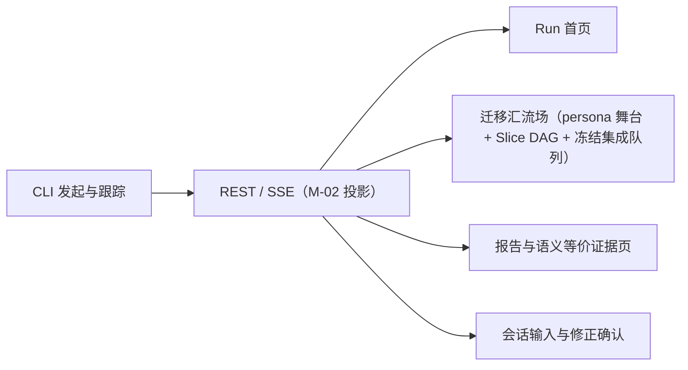
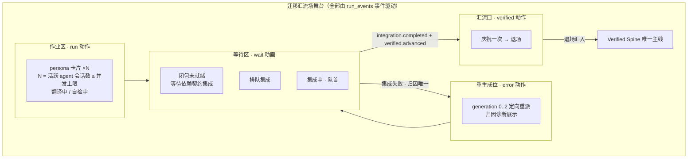
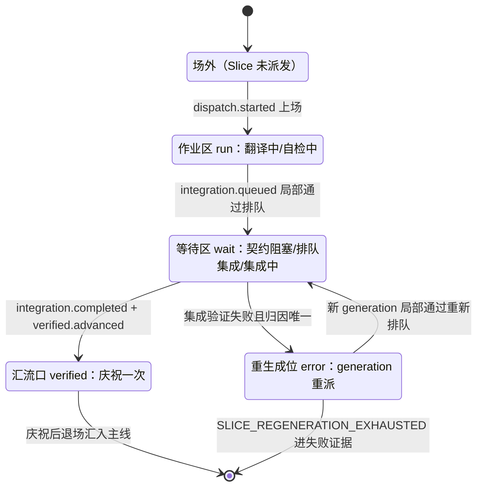
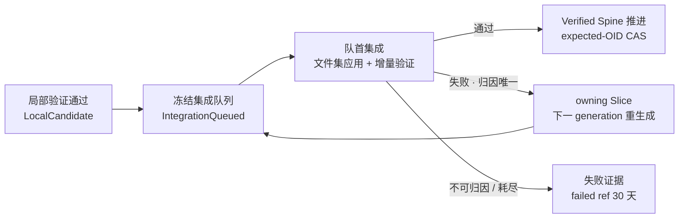
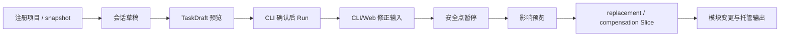

# CodeMigrator Web 体验与迁移可视化工作台

> 文档状态：V4 当前架构基线；本篇为 M-15，拥有 Web 页面与 CLI/Web 展示体验的展示模型、persona 舞台、场分区、事件→动作归约、视觉与动画语义。  
> 技术范围：跨语言翻译 Run 的展示体验——persona 舞台与四场分区、语义等价证据页、报告与系统页面、快照/SSE 前端归约、CLI 精简过程视图；覆盖桌面主工作台、平板降级视图与移动端观察视图。  
> 契约真相：REST/SSE 投影与事件回放由 [M-02：系统后端架构](CodeMigrator_系统后端架构.md) 拥有；`SliceAttemptStatus`、`SliceKind`、并发上限公式与事件术语由 [M-00：设计原则、并行系统地图与公共契约](CodeMigrator_垂类设计原则与架构哲学.md) 拥有；四类 Slice DAG、冻结集成序与边 provenance 由 [M-07：迁移计划生成器](CodeMigrator_迁移计划生成器.md) 拥有；三层验证、归因（含守恒辅助归因信号）与 flaky 事件、GENERATED 标注维度与验证边界声明语义由 [M-10：验证引擎](CodeMigrator_验证引擎.md) 拥有，本篇只呈现、不修改其语义；候选工作区与 checkpoint 由 [M-08：候选工作区与工具网关](CodeMigrator_候选工作区与工具网关.md) 拥有；会话与修正确认由 [M-16：会话与运行时修正编排](CodeMigrator_会话与运行时修正编排.md) 拥有。本篇不重复定义公共状态、HTTP DTO 或指标 descriptor。  
> 产品边界与关联：CLI 是创建、取消、服务管理、交付重试与自动化的主入口；Web 以观察为主，只开放会话输入、问题回答与修正确认，不执行迁移控制、代码修改、Git 写操作、取消或交付重试。关联 [Harness 总体设计](CodeMigrator_Harness总体设计.md)、[Git 集成](CodeMigrator_工作空间与Git集成.md)、[可观测性](CodeMigrator_可观测性系统.md)、[上下文管理](CodeMigrator_记忆与上下文管理.md)。  

Web 不是第二个控制台。它让用户看懂一个已经由 CLI 或 Web 会话确认后发起的跨语言翻译：TypeScript 源项目被只读分析，哪些 Slice 正在并行翻译、哪个 agent 会话正在作业哪个 Slice、为什么一个候选在等待契约或排队集成、哪次集成失败正在定向重生成，以及最终哪些目标代码真正汇入了唯一 verified 主线。CLI 同样持续展示工作过程，只是把复杂事实压缩为可读的终端过程流。浏览器只能读取稳定的 REST/SSE 事实，并提交会话消息、问题回答和已生成预览的修正确认。

基于旧文档的初版web页面原型 ref/codemigrator-web-prototype/ 页面布局和样式和动画效果，后面实现需要参考这个原型。

## 迁移汇流场，而不是 AI 办公室

本工作台借鉴多 Agent 产品中"中央任务空间 + 上下文侧栏 + 真实状态反馈"的可读性（腾讯 Marvis UI 的简洁、年轻化与扁平化），并建立自己的视觉隐喻：**迁移汇流场**——多个翻译 Slice 的 persona 在舞台上作业、等待、重生成，逐个通过确定性集成汇入唯一 verified 主线。画面上没有常驻装饰角色：每一个吉祥物都是一次真实的 agent 会话，每一张 persona 卡片都能追溯到 SliceId、generation、DispatchAttemptId 或 CheckId。



视觉基线为浅色优先：暖白与浅雾灰承载画布，电光蓝表达 agent 作业与内部验证，青绿色表达 verified 与集成通过，琥珀色表达等待与契约阻塞，珊瑚红表达重生成与终态失败。风格极简，**高质量实线优先于阴影与渐变**：卡片与分区以 1px 实线边框和留白区分层级，不堆叠发光、粒子或毛玻璃；交互发生时必须有清晰的视觉变化——例如拖动分栏分隔条时立即以强调色高亮分隔条与目标分区，松手后回落。OID、路径、CheckId 与错误码使用等宽字体，其余使用系统无衬线字体。状态必须同时有文字、图标与颜色，不能只靠色彩区分。

背景可以有极淡的代码网格纹理；不使用全屏深色运维大屏、无意义的霓虹粒子、持续抖动或为了"显得忙碌"而播放的假进度。

## 展示模型：persona 舞台

这是本篇的核心：舞台展示模型由八条规则定义，全部由 `run_events` 事件驱动，前端不自行创造任何舞台事实。

### persona 绑定当前作业的 Slice，不绑定固定角色

吉祥物是 **agent persona**——一次 agent 会话的舞台化身。一个 persona 上场后作业**一个**Slice（一个 generation 的完整候选流程：翻译 → 自检 → checkpoint 提交）；该 Slice 到达终态（集成通过退场或终态失败）后，persona 转场到下一个 ready Slice 重新上场，卡片切换为新 SliceId。系统中不存在"固定四个吉祥物常驻"的模型：persona 卡片的生死只由派发与终态事件决定，角色名（如虚构的 coder/reviewer 人设）不是身份键，`(slice_id, generation)` 的作业会话才是。

### 作业区：数量等于正在工作的 agent 会话

**作业区 persona 卡片数量恒等于当前实际工作中的 agent 会话数**，随事件增减——用户在任何时刻都能直接看到"现在有几个 agent 在工作、各自在作业哪个 Slice"。每张卡片实时显示：配对 SliceId（等宽短码）、SliceKind 标签（契约 / 实现 / 测试翻译 / 测试生成）、generation（`g0/g1/g2`）、当前动作（翻译中 / 自检中 / 反馈修复中）与运行时长。卡片上限由 M-00 沙箱并发公式约束：

```
作业区最大 persona 数 = max(1, min(4, floor(host_memory_gib / 4), floor(host_cpu_cores / 2)))，恒 ≤ 4
```

重生成位中的重生成作业占用同一执行预算，作业区与重生成位的活跃作业总数不超过该上限。等待区与汇流口不受此限。

### 四动作与四场分区

舞台由四个场分区组成，persona 的每个舞台状态恰属一个分区、播放一种动作；四动作与四分区一一对应，不存在无分区归属的状态，也不存在"永远 run"的死角。

| 场分区 | persona 动作 | 承载的 Slice 状态（M-00） | 视觉基调 |
|---|---|---|---|
| 作业区 | **run**（伏案打字、呼吸、摇尾） | `RUNNING`（翻译中）、`LOCAL_VERIFYING`（自检中） | 电光蓝；活动卡片低频呼吸 |
| 等待区 | **wait**（闭眼小憩、zzz） | 契约阻塞（ready 但 Requires 前驱契约未集成）、`INTEGRATION_QUEUED`（排队集成）、`INTEGRATING`（集成中·队首） | 琥珀色；低饱和、慢节奏 |
| 重生成位 | **error**（歪头、汗滴、问号） | `REGENERATING`（generation `0`~`2` 内定向重派） | 珊瑚红；卡片展示归因诊断摘要 |
| 汇流口 | **verified**（戴墨镜、星星、彩屑） | `INTEGRATED`（刚集成通过） | 青绿色；庆祝动画只播放一次 |



等待区中的契约阻塞卡片是**低饱和占位卡**：它尚未被派发、没有 agent 会话，因此不渲染 persona 本体，只以剪影加"等待契约集成"标注；排队集成与集成中的卡片由已局部验证 Slice 的 persona 睡眠等待呈现。

### 舞台状态机与事件→动作映射

一个 persona 的舞台生命周期如下（单 Slice 视角；转场即退场后对下一个 ready Slice 重新走"上场"）：



上场、退场、动作切换与转场**全部**由 M-02 投影的 `run_events` 事件驱动；下表是唯一的映射真相，前端按 `sequence` 归约执行，无事件不动画：

| run_events 事件 | Slice 投影变化 | 舞台动作 | 卡片实时文本（示例） |
|---|---|---|---|
| `dispatch.started` | → `RUNNING` | persona 上场进作业区，run | `翻译中 · g0 · a4f2` |
| `slice.status_changed` → `LOCAL_VERIFYING` | `RUNNING → LOCAL_VERIFYING` | 作业区内 run 变体（自检） | `自检中 · 语法+契约类型检查` |
| `verification.completed`（LocalCandidate 通过） | → `LOCALLY_VERIFIED` | 作业区 → 等待区，run → wait | `局部通过 · 集成序 #5` |
| `integration.queued` | → `INTEGRATION_QUEUED` | 等待区·排队集成，wait | `排队集成 #5` |
| `integration.started` | → `INTEGRATING` | 等待区·队首加强，wait | `集成中 · prospective 3f9a…` |
| `TEST_FAILURE_ATTRIBUTED`（集成失败归因） | → `REGENERATING` | 等待区 → 重生成位，error | `诊断归因本 Slice → g1 重生成` |
| `candidate.generation_started`（重生成代次） | `REGENERATING` 内新代次作业 | 重生成位保持 error | `g1 重生成中 · 翻译/自检` |
| 新代次 `integration.queued` | → `INTEGRATION_QUEUED` | 重生成位 → 等待区，error → wait | `g1 局部通过 · 重新排队` |
| `integration.completed` + `verified.advanced` | → `INTEGRATED` | 汇流口 verified 庆祝一次 → 退场 | `集成通过 · verified 7f2a91c` |
| `dispatch.interrupted` / `dispatch.discarded` | 状态不变 | 原位角标，不驱动成功动画 | `attempt 中断重派` / `迟到结果丢弃审计` |
| `FLAKY_TEST_OBSERVED` | 状态不变 | 不驱动舞台 | 进入证据页 flaky 清单 |
| generation 耗尽 | → `TERMINAL_FAILED` | 重生成位定格 → 失败证据区 | `SLICE_REGENERATION_EXHAUSTED` |
| `run.status_changed` → 终态取消 | → `CANCELLED` | 全场停止动画、降低饱和度 | — |

局部验证的同 generation 反馈修复（M-10）不换分区：persona 留在作业区继续 run，卡片文本切换为"反馈修复中 · 第 n/2 次"。

### 汇流口：庆祝一次，退场汇入主线

集成通过（`integration.completed` 与 `verified.advanced`）触发 persona 进入汇流口，播放**一次** verified 庆祝动画（约 1.2–1.8 秒：墨镜、星星、彩屑），随后 persona 退场——卡片收起、Verified Spine 增加一条 commit 短 OID 与 Slice 记录。verified 状态不常驻舞台：主线上只有 commit 事实记录，没有永远戴着墨镜的吉祥物。若后续修正需要触及已集成内容，由 M-16 的 compensation Slice 以新 Slice 身份重新上场。

### 舞台聚焦：跟随、锁定与提示

舞台默认**跟随最近状态变化的 Slice**：最近一条改变 Slice 状态的事件所指向的卡片获得舞台焦点（放大、描边强调、检查器联动），让用户不操作也能持续看到"正在发生什么"。用户点击任意卡片或 DAG 节点即**锁定**该对象：锁定期间聚焦不再自动跟随；锁定对象自身发生状态变化（分区迁移、动作切换、归因事件）时，卡片以强调色高亮脉冲提示一次，不抢走焦点、不打断输入。再次点击锁定对象或按 Esc 解除锁定，恢复自动跟随。

### 契约层先行与依赖闭包就绪的汇入

汇流场隐喻适配拓扑分层调度（M-07，依赖闭包就绪即启动）：

- **契约层独奏**：契约 Slice 通常最先作业。它作业期间舞台上只有它一张 persona 卡片在作业区奔跑（独奏），身后是整片尚在低饱和等待的占位卡——用户一眼看懂"地基未成"。占位卡标注"等待其依赖闭包内的契约 Slice 集成"，对应等待区·契约阻塞。
- **闭包就绪、逐个汇入**：任一 Slice（实现/测试翻译/测试生成）在其依赖闭包内全部契约 Slice 集成后即可上场——多契约长尾期，已就绪 Slice 与在途契约 Slice 同台并行，不等待全仓库契约清空（V-M00-V4-001）。persona 在汇流口庆祝退场后，后续 Slice 依 DAG ready 并行上场（数量受并发上限与 ready 集合约束），舞台进入多 persona 并行作业态。完成先后不改变冻结集成序（M-07 集成键），先完成者只能在等待区排队。
- **测试翻译/测试生成 Slice 的展示**：测试翻译 Slice 在其覆盖模块归属的契约 Slice 集成后 ready，可与被测实现 Slice 并行上场；其测试执行裁决由 M-10 在场门控保序（V-M10-V4-027，被测实现在场方执行），舞台不因此改变其上场时机。测试生成 Slice（源模块无测试时派生，M-00/M-07）同规则上场；两者以同一套 persona 卡片呈现，SliceKind 标签区分类别，测试生成 Slice 相关证据在证据页以 GENERATED 标注与移植测试严格区分（见下文）；其排队、集成、归因重生成（`TEST_FAILURE_ATTRIBUTED` 两步归因可能把失败归属实现 Slice）与庆祝退场使用同一状态机。

以贯穿场景（TS→Python，冻结集成序 CT→A→B→C→T1→T2，M-07/M-10）走一遍舞台时间线：CT 独奏 → 汇流口庆祝退场 → A、B 双 persona 并行上场 → B 先局部通过进等待区（wait），A 后通过也排队，Coordinator 仍先集成 A → A 庆祝退场、B 集成 → C 上场；C 集成时类型检查发现对 models 契约误用，`TEST_FAILURE_ATTRIBUTED` 归因 C，C 的 persona 移入重生成位（error）展示"契约签名不一致 · client.py:42 → g1" → g1 局部通过回等待区 → 集成庆祝退场 → T1、T2 依序上场、集成。最终验证（VERIFYING）不属于舞台 persona：它在冻结 verified head 上执行翻译后全套测试，进度以 Run 头部阶段条与事件时间线呈现，失败归因触发对应 Slice 重生成时该 Slice 的 persona 重新上场走完整状态机。

## 页面地图：从 Run 到证据

| 路由 | 页面 | 用户要回答的问题 |
|---|---|---|
| `/` | Run 首页 | 最近发生了什么，下一步该在 CLI 做什么？ |
| `/runs/:runId` | 迁移汇流场 | 谁在作业、谁在等待、谁在重生成、什么已汇入主线？ |
| `/runs/:runId/report` | 报告与语义等价证据页 | 翻译结果、验证证据与交付分别是什么？ |
| `/sessions/new`、`/sessions/:sessionId` | 会话输入 | 任务草稿与修正确认如何进入 Run？ |
| `/system` | 系统状态 | app、worker、PostgreSQL 与描述符资源是否可用？ |

`/runs/:runId` 接受 `slice`、`check`、`event`、`panel`、`viewport`、`focus` 和 `filter` 查询参数。它们只保存用户选择、舞台焦点与过滤条件；URL 中不得出现 credential、ArtifactRef、源码正文、日志正文或宿主路径。刷新或分享链接后，页面必须恢复同一对象的检查器上下文与舞台焦点（含锁定状态）。

桌面端由四个可伸缩区域组成：左侧导航轨道、中央迁移汇流场（舞台上部 + DAG/集成队列下部，始终是视觉中心）、右侧上下文检查器、底部事件时间线。平板端把检查器收进抽屉；移动端不渲染自由舞台与 DAG，改为按冻结集成顺序排列的 Slice 卡片列表与时间线——列表项保留四动作图标语义。

## Run 首页：让用户迅速进入正确的现场

首页不是"创建迁移"的表单。Product Header 展示 CodeMigrator 标识、服务连接状态、当前语言对（如 `TypeScript → Python`）和可复制的 `codemigrator migrate start` 命令。没有隐藏的创建按钮。

活动 Run 使用迁移流卡片展示：仓库、Spec、语言对、RunStatus、活动 Slice 数、已集成 Slice 数、当前验证层和最后事件。活动卡片可有低频边缘呼吸；终态 Run 保持静态。历史不超过 20 条时使用卡片，超过后切换紧凑列表，并支持仓库、日期、RunStatus、部分完成、报告交付与代码交付过滤。

页面底部的 Environment Strip 只显示 app、sandbox-worker、PostgreSQL 与双工具链描述符资源的安全摘要。它链接到系统状态页，不暴露 DSN、socket 路径、凭据或宿主文件路径。

| 情况 | 页面行为 | 禁止行为 |
|---|---|---|
| 首次加载 | 显示结构骨架 | 虚构百分比进度 |
| 没有 Run | 显示汇流场空状态和 CLI 命令 | 在浏览器内创建 Run |
| API 不可用 | 显示连接诊断和 `server status` 提示 | 清空用户已有的可信投影 |
| 局部读取失败 | 保留成功模块并在局部给出错误 | 把整个首页伪装成空状态 |
| 数据陈旧 | 标识最后可信时间和重连状态 | 假装实时连接仍正常 |

## 迁移汇流场：舞台周围的确定性结构

### Slice DAG

舞台下方的 DAG 画布呈现 [M-07](CodeMigrator_迁移计划生成器.md) 冻结的四类 Slice、依赖边与集成序。节点基础位置在计划冻结后保持稳定，绝不能因 Agent 返回较快而重新排序。

| 图形元素 | 含义 | 交互 |
|---|---|---|
| 节点形状按 SliceKind | 契约 / 实现 / 测试翻译 / 测试生成 四类 | 选中打开检查器 |
| 实线箭头 | `Requires`（实现→契约、实现→实现、测试翻译/测试生成→契约） | 选中后高亮依赖闭包 |
| 虚线箭头 | `OrderedBefore`（Unknown 保守边、写冲突边） | 显示 provenance 与排序原因 |
| 冻结集成序号 | 集成键序（`topological_layer → plan_order_key → SliceId`） | 跳转集成队列对应位置 |

Slice 节点默认只展示短 SliceId、SliceKind、`SliceAttemptStatus`、`g0/g1/g2`、write scope 文件数与冻结集成序号。详细的 write scope、generations 历史、provenance 与事件只在右侧检查器展开，不能以弹窗淹没画布。

### 冻结集成队列与 Verified Spine

等待区旁保留一条显眼但克制的冻结集成队列视图，严格消费 M-07 冻结的 `topological_layer ASC → deterministic_plan_order_key ASC → SliceId ASC`。候选完成速度只影响"已经准备好"的状态，不改变队列位置。队首 Slice 进入集成（prospective 建立与增量验证）期间，后续 Slice 可继续局部计算，但不能越过队首正式集成。



Verified Spine 只展示 commit 短 OID、已接受 Slice（四类与 generation）、integration receipt 摘要与推进时间。它不是 Git 客户端：不出现 branch、reset、force push 或 ref 写操作。

### 右侧检查器与事件时间线

右侧检查器随选择对象改变：

| 对象 | 检查器标签 |
|---|---|
| Slice | Overview、WriteScope、Generations、Events |
| Agent 会话（persona 卡片） | Subject（Slice/generation）、Attempt、Activity、工具调用摘要 |
| Check | Invocation、Status、Diagnostics、Evidence |
| Commit | Integrated Slices、Verification、Receipt |
| Event | Projection、Sequence、Related Object |

检查器展示当前动作对应的工具面事实（如"翻译中：WriteFile ×12 / QuerySourceAst ×5 / Shell 自检 1 次通过"），均来自事件投影。ArtifactRef 不是浏览器可读取 URL：证据入口只能按 receipt 或 check 请求 M-02 规定的授权、脱敏、分页投影。

底部时间线按 `run_events.sequence` 排列，支持事件类型、Slice、attempt、Check 与异常过滤，支持跳转相关卡片与复制深链接；采用虚拟滚动和按 Slice 语义分组，不模拟终端无限滚屏。

### 三层验证：把"通过"说清楚

工作台固定展示 LocalCandidate（局部自检：语法 + 对契约类型检查）、ProspectiveIntegration（增量集成：编译 + lint + 类型检查 + 已集成测试）、FinalVerified（最终主证：翻译后全套测试）三层（M-10）。每层显示 tested commit 短 OID、冻结检查集摘要、CheckStatus、Error UNKNOWN 数量、verification fingerprint 摘要与脱敏证据入口；测试生成 Slice 相关的 receipt 与 fingerprint 摘要携带 GENERATED 标注（消费 M-10 标注维度，与证据页规则一致）。

局部通过不等于正式集成；集成通过后才有 integration receipt 与 verified 推进；最终通过才进入报告。最终层与最近同 commit/检查集的 prospective 语义 fingerprint 不一致时，页面显示 `NONDETERMINISTIC_VERIFICATION` 分叉提示，不能把它压成普通红色失败。`FLAKY_TEST_OBSERVED` 在时间线以独立标识呈现，不与真失败混色。

## 语义等价证据页：REPORT 阶段的投影归约

语义等价证据页（`/runs/:runId/report` 的核心区块）回答跨语言翻译的唯一关键问题：**翻译后的项目与源项目语义等价的证据是什么**。页面内容全部从 `run_events`、CheckResult 与结构守恒事实的后端投影归约，前端不自行计算任何判定；报告正文由后端**确定性模板从 verified facts 拼装**（挡位收敛定案：REPORT 无模型会话，M-00/M-04），本页呈现的是模板拼装正文与证据投影的渲染——素材来源可审计，不存在模型生成的未验证叙述：

| 证据区块 | 数据来源（投影） | 展示 |
|---|---|---|
| 测试通过率 | 最终验证 FinalVerified outcome 的 per-test 结果账本 | `passed / total` 总通过率、分层（集成层已跑 / 最终全集）统计；移植测试与生成测试分列呈现 |
| 失败清单 | 最终与集成层 `Failed` 测试 + `TEST_FAILURE_ATTRIBUTED` 事件 | 每条失败：测试名、稳定错误码、归因 owning Slice（含 g0→g1→g2 重生成轨迹与最终结局）；生成测试条目携带 GENERATED 徽标 |
| flaky 清单 | `FLAKY_TEST_OBSERVED` 事件 | 测试名、三次执行多数态摘要；明确标注"未触发重生成" |
| 覆盖映射 | M-06 F3 测试覆盖图投影：源测试文件 → 被测源模块 → 目标测试文件 → 目标模块 | 源/目标双栏映射表；未覆盖模块清单（`Uncovered` 标注）；测试生成 Slice 产出的目标测试文件标注 GENERATED |
| 结构守恒 | REPORT 阶段后端产出的 `StructuralConservationFacts` 投影（M-10 计算） | 每模块测试数对齐比、断言密度比、LOC 比例与离群标记；离群以黄色警示呈现，不影响通过判定——行为证据是主证，守恒事实是辅证 |
| 守恒归因 | `TEST_FAILURE_ATTRIBUTED` 事件投影中的守恒信号参与事实（M-10 归因） | 归因依据摘要中呈现守恒信号（断言数对齐比/测试数对齐比）；失败证据模糊场景下守恒离群作为"优先怀疑测试翻译 Slice"的辅助信号可视化（见下文） |
| 等价信心分级 | REPORT 阶段后端产出的分级结论（双档，M-00 定义） | 移植测试主证（标准档）与生成测试主证（降一档）分别呈现；判定依据摘要（通过率、覆盖完整度、失败归因闭合度、结构守恒）；部分完成时呈现部分通过率与未闭合失败 |
| 验证边界声明 | REPORT 阶段后端产出的边界声明（M-10 语义 owner） | 固定声明文案：测试主证覆盖行为等价（限于源测试覆盖范围）；性能等价、安全等价、生态习惯适配不在主证证明范围（见下文） |

### GENERATED 标注：生成测试与移植测试严格区分

源模块无测试时，Planner 派生测试生成 Slice（`SliceKind.TestGeneration`，M-00/M-07）以源模块代码语义+契约签名为锚点生成目标测试。证据页中此类证据全链路显式标注 GENERATED 徽标：测试生成 Slice 的产出文件（覆盖映射的目标测试文件）、失败与 flaky 清单中的测试条目、CheckResult receipt 摘要与验证 fingerprint 条目全部携带 GENERATED 标注，与移植测试在视觉上严格区分。徽标消费 [M-10](CodeMigrator_验证引擎.md) 的 GENERATED 标注维度（M-00 全链路语义），本篇只呈现、不改验证语义——用户在证据页看到的每一条测试证据都能立即分辨它来自源测试的移植还是 Agent 的生成。

### 等价信心分级：双档诚实呈现

等价信心分级按主证来源双档展示（语义 M-00 定义、M-10 owner，本篇呈现）：

| 主证档位 | 适用条件 | 展示规则 |
|---|---|---|
| 移植测试主证（标准档） | 源模块有测试，测试翻译 Slice 产出 | 标准分级呈现 |
| 生成测试主证（降一档） | 源模块无测试，测试生成 Slice 产出 | 降一档呈现，固定显示理解偏差风险声明 |

生成测试主证的理解偏差风险声明固定文案：**生成测试验证的是"翻译后代码自洽且符合源语义的 Agent 理解"**——它证明翻译后代码自洽且符合 Agent 对源语义的理解，存在理解偏差风险，证据力低于移植测试。分级诚实反映证据力差异：生成测试主证不因通过率相同而获得与移植测试相同的信心档位；两类主证在同一 Run 并存时，分级按模块主证来源分别陈述，不合并为单一档位。

### 验证边界声明：主证证明什么、不证明什么

证据页固定呈现验证边界声明区块（语义 owner M-10，本篇仅呈现）：**测试主证覆盖行为等价（限于源测试覆盖范围）；性能等价、安全等价、生态习惯适配不在主证证明范围**。声明区块紧邻等价信心分级呈现，防止读者把"全部测试通过"读成"全面等价"。边界声明只声明主证的证明范围，不参与分级计算、不改变任何验证判定。

### 行为 parity 场景对比呈现：黑盒补充取证维度

用户确认场景且源侧可隔离运行时，证据页增设 parity 场景对比区块（语义 owner M-10）：每场景一行——场景名、源/目标输出摘要 diff 结论（Passed/Failed）、差异摘要入口；区块头部标注覆盖范围说明（"仅覆盖已确认的 N 个场景"）。手段缺席（未确认场景或源不可运行）时区块显示缺席原因而非隐藏。parity 结果与主证分级并列但独立呈现，不折算、不升降任何分级。

### 守恒归因展示：辅助信号可视化

守恒信号（断言数对齐比/测试数对齐比，[M-10](CodeMigrator_验证引擎.md) 结构守恒计算）在归因信息中呈现：失败清单与守恒归因区块展示每条归因结论的依据摘要，守恒信号的参与事实一并投影。失败证据模糊场景（超时/OOM/栈不清晰）下，守恒离群作为"优先怀疑测试翻译 Slice"的辅助信号可视化——以辅助信号标注呈现守恒离群与怀疑方向的关联，与归因结论并列展示、不替代归因结论；诊断视图（重生成位卡片的归因诊断摘要与检查器 Diagnostics 标签）同步呈现该辅助信号。本篇只消费 M-10 归因结果，不修改归因语义——守恒信号在展示层不触发任何判定。

证据页在 `PARTIALLY_COMPLETED` 下同样完整呈现：已集成成果、部分通过率、失败 Slice 证据与 flaky 清单并列，不把部分完成伪装成完全成功。`run_status`、`verification_outcome`、`report_delivery_status` 与 `code_delivery_status` 分别渲染：迁移成功但 PR 失败不能标成迁移失败。

## 快照、SSE 与前端状态归约

首次进入 Run 工作台时，前端按下列顺序工作：解析 URL、读取 workspace 快照、记录快照 `latest_sequence`、从其后建立 SSE、按 sequence 归约事件、恢复选择对象与舞台焦点（含锁定态），只为最新事实播放有限动画。快照携带 sequence 是为了避免"先订阅还是先读取"造成窗口；服务端的 SSE 回放由 M-02 所有。

| 前端索引 | 键 |
|---|---|
| Run | `run_id` |
| Slice | `slice_id` |
| persona 卡片 | `slice_id + generation` |
| dispatch | `DispatchAttemptId` |
| Check | canonical ExecutionSubject + CheckId |
| integration | 冻结队列序号 |
| event | `run_id + sequence` |

`sequence <= cursor` 的事件是重复事件，不重复触发舞台动作；sequence 出现缺口时暂停动画并补读；未知事件记录为兼容性诊断后推进 cursor，不修改已知领域状态；旧 generation 不得覆盖当前 generation 的舞台投影；非 active attempt 只进入 discarded 审计投影。REST 快照与事件冲突时，取 committed sequence 更高的投影。重放历史事件（补读、刷新）时，persona 状态直接收敛到最新事实，不重播庆祝动画。

连接状态使用 `connected`、`catching-up`、`reconnecting`、`stale`、`terminal`。断线时保留最后可信舞台；补读完成后直接收敛；终态 Run 停止持续订阅。

## CLI：主操作入口的精简过程视图

CLI 不是只返回 Run ID 的薄客户端。交互式终端持续显示已经发生的关键工作，回答"正在做什么、为什么等待、是否出现问题、最终结果是什么"；不展示模型思维链、隐藏推理、prompt、源码正文或完整日志。

| 事实 | CLI 默认展示 | Web 展示 |
|---|---|---|
| RunStatus / Phase | 当前阶段与状态摘要 | 完整状态、历史和关联事件 |
| Slice | 开始、通过、重生成、失败 | persona 舞台、DAG、write scope 与队列 |
| agent 会话 | 当前动作与所属 Slice | persona 卡片、subject、attempt、工具摘要 |
| generation | `g0/g1/g2` 与稳定原因码 | 全部代次、候选与失效证据 |
| 验证 | 层级、通过数和失败 Check 摘要 | exact-set、fingerprint、diagnostics、evidence |
| 集成 | 排队、开始、verified 推进 | 冻结队列、prospective、receipt、Verified Spine |
| 日志 | 默认不输出正文；失败时给证据入口 | 授权、脱敏、分页日志 |
| Git | verified 短 OID 与交付结果 | commit、Slice、receipt 与交付详情 |

### 命令与输出模式

交互式 TTY 中执行 `codemigrator migrate start <spec>` 默认创建 Run 后进入跟踪；`codemigrator run watch <run_id>` 使用同一过程视图。`--no-follow` 只输出 Run ID、初始状态、Web 深链接与 `run watch` 命令；`--follow` 在 TTY 与非 TTY 中都生效。输出面固定为 `--output human|json|jsonl`：只改变渲染，不改变订阅、sequence、权限或 Run 语义。

| 参数或环境 | 行为 |
|---|---|
| TTY，未指定输出 | `human` 动态过程流 |
| 非 TTY，未指定 `--follow` | 单个 JSON 创建结果后退出 |
| 非 TTY，指定 `--follow` | JSONL 事件摘要流，无 ANSI 控制字符 |
| `--output=json` + 跟踪 | 只在终态输出单个最终对象 |
| `--output=jsonl` | 逐事件输出稳定摘要对象 |
| `TERM=dumb` / `NO_COLOR` / `-q` / `-v` / `-vv` | 依次降级/升级细节；仍不输出敏感正文 |

TTY 采用"持久过程流 + 固定摘要"的混合形式：顶部 Header（仓库、语言对、短 Run ID、Phase/RunStatus、运行时间、Web 深链接）；中部 Process Stream 逐条保留关键事实；底部 Live Summary 更新活动 persona、等待队列、已集成 Slice、warning/error 与 token/cost 摘要。同时活动对象超过四个时保留最重要的四项，其余归约为"另有 N 个 Slice/Check 正在运行"。

### 过程行与事件压缩

过程行只描述可观察事实，例如："Slice A g0 候选已提交 checkpoint（5 文件）""Slice B 局部验证 4/4 passed""Slice C g0 → g1 集成类型检查失败，诊断归因 C（client.py:42）""Verified 7f2a91c 已集成 Slice B""最终验证 test_order_create 失败 → 归因 Slice A → g1 定向重生成"。不得输出"模型正在思考"或任何不能由领域事件证明的叙述。

| SSE 事件 | CLI 默认归约 |
|---|---|
| `run.status_changed` | 更新 Header；关键 Phase 追加一行 |
| `slice.status_changed` | 只显示 RUNNING、LOCALLY_VERIFIED、REGENERATING、INTEGRATED、TERMINAL_FAILED、CANCELLED |
| `candidate.generation_started` | 显示代次变化与稳定原因码 |
| `dispatch.started` / `dispatch.interrupted` / `dispatch.discarded` | 默认入摘要；中断追加 warning；`-v` 显示 |
| `verification.completed` | 显示层级与检查汇总；失败始终显示 |
| `TEST_FAILURE_ATTRIBUTED` | 显示归因结论与 owning Slice 短码 |
| `FLAKY_TEST_OBSERVED` | 计入摘要并标注 flaky；不渲染为失败 |
| `integration.queued` / `integration.started` | 仅队首变化或集成开始时显示 |
| `integration.completed` / `verified.advanced` | 更新摘要并追加 verified 推进事实 |
| `report.completed` / `delivery.status_changed` | 独立显示报告与交付，不改写 Run 结论 |

显示压缩不改变事件消费：CLI 仍逐条推进 sequence；重复事件不重复打印，缺口先补读；断线补读后打印"已恢复，补齐 N 个事件"并展示当前归约结果，不重播离线动画。

### Ctrl+C 是取消 Run，不是仅退出观察

跟踪中第一次 Ctrl+C 停止新增终端动画，以当前可信 version 发送 `If-Match` Cancel 请求，显示 `Cancelling Run…`，等待 Run actor 持久化取消事实并补读 `CANCELLED`。第二次 Ctrl+C 立即退出本地 CLI，但必须说明取消是否确认；未确认时输出 `codemigrator run show <run_id>` 与 `codemigrator run cancel <run_id>`。返回 `STALE_VERSION` 时读取一次最新投影重试一次，第二次仍冲突则报告取消未确认。CLI 永远不能直接终止 worker、写 PostgreSQL 或修改 Git。

| 已知结果 | Exit code |
|---|---:|
| 创建成功且 `--no-follow` / 跟踪至 `COMPLETED` | 0 |
| 跟踪至 `PARTIALLY_COMPLETED` | 2 |
| 跟踪至 `FAILED` | 3 |
| Run 被外部取消 | 4 |
| REST/SSE/协议错误导致结果未知 | 5 |
| 本地 Ctrl+C 且取消已确认 | 130 |

## 对 M-02 的只读投影需求

M-15 不拥有 HTTP 契约，但要求 M-02 提供以下只读投影：

| 接口 | 展示用途 |
|---|---|
| `GET /api/v1/migrations` | Run 首页分页、过滤和游标 |
| `GET /api/v1/migrations/{run_id}` | Run 基础投影 |
| `GET /api/v1/migrations/{run_id}/workspace` | persona 舞台、Slice DAG、冻结集成队列、验证摘要、`latest_sequence` |
| `GET /api/v1/migrations/{run_id}/events` | SSE 与 Last-Event-ID 回放 |
| `GET /api/v1/migrations/{run_id}/report` | 报告与语义等价证据页投影 |
| `GET /api/v1/migrations/{run_id}/evidence/{receipt_id}` | 授权且脱敏的证据分页 |
| `GET /api/v1/system/health` | 安全化系统状态（app、worker、PostgreSQL、描述符资源） |

`workspace` 是展示聚合，不能成为新的运行真相源；它只能由 PostgreSQL、Git receipt 与既有只读投影构建。SSE 沿用 M-02 的 envelope 版本化事件流，本篇至少消费：`run.status_changed`、`slice.status_changed`、`candidate.generation_started`、`dispatch.started`、`dispatch.interrupted`、`dispatch.discarded`、`verification.completed`、`integration.queued`、`integration.started`、`integration.completed`、`verified.advanced`、`TEST_FAILURE_ATTRIBUTED`、`FLAKY_TEST_OBSERVED`、`report.completed`、`delivery.status_changed`。新增事件类型只扩展映射表行，不改变四动作四分区模型。渲染完备性验收义务：新事件类型必须与定义它的同一变更集交付渲染 case，或提供可理解的 default 呈现——不允许出现"入流但无渲染语义"的不可见事件（实测 40.4% 事件无终端渲染 case 的教训成文为验收项）。

## 动画只呈现事实

| 已提交事件 | 允许动画 |
|---|---|
| `dispatch.started` | persona 上场进作业区，run |
| `slice.status_changed` → `LOCAL_VERIFYING` | run 动作切换自检变体 |
| `integration.queued` | persona 移入等待区，wait |
| `integration.started` | 队首卡片加强 |
| 归因重生成 | persona 移入重生成位，error |
| `verified.advanced` | 汇流口 verified 庆祝**一次**后退场 |
| `dispatch.discarded` | 角标灰化进入时间线，不播成功动画 |
| 终态失败 | error 定格后进入失败证据 |
| 取消 | 全场停止活动并降低饱和度 |

微交互控制在 160–240ms，卡片与分区移动控制在 320–480ms，呼吸周期 1.8–2.4 秒，verified 庆祝 1.2–1.8 秒且每 Slice generation 至多一次。同一对象同时只能有一个主要过渡；页面后台化时暂停非必要动画。reduced-motion 下禁用位移、缩放、粒子与视差，只保留短淡入、文字与图标变化。图形关系布局适合交给 React Flow，状态驱动过渡与 reduced-motion 适合交给 Motion；具体版本在 Web 详细编码设计冻结。

## 响应式、无障碍与性能预算

桌面端提供完整四区工作台；平板端把检查器改为抽屉；移动端降级为按冻结顺序排列的 Slice 卡片列表（保留四动作图标）与时间线。DAG 必须同时提供等价的树形或列表视图；键盘可选择卡片与节点、打开检查器和跳转事件；SSE 更新不能抢走焦点；新事件通过非打断式 ARIA live 摘要表达；Tooltip 不得承载唯一信息；persona 动画在 reduced-motion 下退化为静态姿态图符。

首版性能目标是 200 个 Slice、500 条边、10,000 条事件、20 个同时活动的对象投影；M-07 上限 5000 Slice 时自动降级为列表视图。舞台 persona 卡片恒 ≤ 4，卡片动画开销天然有界。事件只更新受影响卡片与节点；时间线虚拟滚动；日志和证据分页；详情按需加载；终态停止 SSE；画布不可见时降低刷新和动画频率。

## 前端包与 CLI 应用的施工边界

`web/` 是独立前端 package，不计入核心子包依赖图。编码以 React、TypeScript、Vite、React Flow 和 Motion 为技术基线，并按下列边界组织：

| 位置 | 负责内容 |
|---|---|
| `app/` | 路由、布局、初始化、错误边界 |
| `features/run-list/` | 首页和历史列表 |
| `features/run-workspace/` | persona 舞台状态机、四场分区、DAG、集成队列、检查器、时间线 |
| `features/run-report/` | 报告与语义等价证据页 |
| `features/session-input/` | 会话消息、问题回答、修正确认 |
| `features/system-health/` | 系统状态 |
| `entities/` | 只读 Run、Slice、persona、Verification 投影 |
| `shared/api/` | REST/SSE、补读、sequence 与错误映射 |
| `shared/stage/` | 事件→舞台动作映射表（唯一真相）与转场调度 |
| `shared/ui/` | design token、实线优先的基础组件 |
| `shared/graph/` | React Flow 节点、边与布局 |
| `shared/motion/` | 四动作动画定义与 reduced-motion |

本篇不写 React 函数体、CSS 类名或状态库实现；这些进入后续 Web 详细编码设计。`apps/codemigrator-cli/` 同样不计入核心子包，分为 API/SSE client、TTY renderer、append-only renderer、JSON/JSONL renderer、sequence cursor 与命令层；每个 renderer 只消费同一已脱敏事件归约，不能自行创建领域状态、绕过 SecretRegistry 或读取 host CAS。

## 与 v14 原型的衔接：复用与重做

用户已用 `codemigrator-web-prototype/pages/run-workspace-v14.html` 验证视觉方向。对齐结论如下。

**可直接复用（视觉语言与骨架）**：

1. 设计 token 体系：`--cm-state-verified/agent/waiting/failure(+soft)` 四组语义色、暖白画布（#FAF9F7）、边框/圆角/间距阶梯、等宽字体用于 ID——四组语义色与 V4 四场分区一一对应（agent→作业区、waiting→等待区、failure→重生成位、verified→汇流口）。
2. 像素猫吉祥物 SVG 与四状态动画骨架：running（打字/呼吸/摇尾/键盘键帽律动）、waiting（闭眼/zzz/咖啡）、failed（歪头/汗滴/问号）、verified（墨镜/星星/彩屑）——四个动画族直接映射 run/wait/error/verified 四动作。
3. 玻璃胶囊卡片骨架：状态色边框、mini cat 头像位、状态行（状态点 + 文字 + gen/文件数/序号）——改造为 persona 配对卡片。
4. 汇流场舞台布局骨架：中央吉祥物区 + 侧翼与底部胶囊环绕、极淡网格底纹。
5. 右侧检查器骨架：Slice/Agent 双 segment + tabs + 行式 KV 渲染。
6. 底部事件 ticker 与"按 Slice 分组"事件面板的 UI 骨架（分组交互、虚拟化思路）。
7. reduced-motion 全局降级、`connected/catching-up` 连接状态指示、平板/移动端响应式降级。

**必须重做（旧模型与 V3 残留）**：

1. **固定吉祥物常驻模型**：v14 固定两只猫绑定 agent 角色名（coder-v2/reviewer-v1），常驻舞台——替换为动态 persona 会话模型（卡片数 = 活跃会话数，事件驱动上下场，绑定当前作业 Slice）。
2. **点击驱动的状态**：v14 中猫的状态由用户点击 `focusSlice` 触发——替换为 `run_events` 事件驱动的舞台状态机，点击只负责聚焦与锁定。
3. **无场分区语义**：v14 的胶囊按 verified/running/waiting/failed 散布四周，配"候选池/验证/集成/主线"维度切换器——替换为四场分区（作业/等待/重生成/汇流口）与等待区三细分（契约阻塞/排队集成/集成中）。
4. **verified 常驻循环动画**：v14 的墨镜猫持续播放庆祝——替换为一次性庆祝后退场汇入主线。
5. **V3 事件术语与文案**：`patch_applied`/edit intents/AstPatch/tsc 类型检查叙述——替换为 V4 事实（checkpoint 提交、描述符检查命令、归因事件、六工具摘要）。
6. **同语言场景**：`react-19-upgrade.mspec.toml`、`src/**/hook.ts`、TS 诊断文案——替换为 TS→Python 贯穿场景（pytest/mypy 语义、`src/pkg/**.py`）。
7. **等待区无闭包占位**：v14 不知道拓扑分层调度——补充闭包未就绪占位卡与独奏→汇入的舞台叙事（依赖闭包就绪即启动语义）。
8. **无舞台聚焦策略**：v14 只有点击聚焦——补充默认跟随、锁定与高亮提示。
9. **无语义等价证据页**与最终验证（VERIFYING）阶段呈现。

## 会话输入与 Source → Output 体验

用户在项目根或子目录运行裸 `codemigrator` 时，CLI 自动发现最近 Git root，并以 `当前项目 → 翻译目标` 作为过程流 Header，例如 `legacy-console → Python`。会话确认后，CLI 和 Web 都在展开区域显示同一组受限事实：Source 是只读项目名和授权 display path，Target 是目标语言与工具链描述符摘要，Output 是托管输出工作区，Base/Verified 只显示短 OID。真实路径、ArtifactRef、源码正文和凭据从 URL、公共 SSE、错误文本与分享链接中排除。

`/sessions/new` 只能选择 CLI 已注册项目、既有托管 snapshot 或远端 Git，不能浏览服务器任意目录；`/sessions/:sessionId` 由会话流、TaskDraft 预览、问题卡、context chip、ImpactPreview 和模块变化视图组成。Web 只能提交自然语言 message、Question answer、TaskDraft confirm 或 ImpactPreview confirm；不会出现隐藏的代码修改、Git、worker、数据库、Cancel 或 delivery retry 按钮。**起草会话边界**：Spec 起草会话批次 1 以 CLI 为主入口；Web 的 TaskDraft confirm 仅把草稿确认事实写入会话通道（TaskDraftRevision 账本），不触发 CreateRun——Run 创建仍仅由 CLI 主入口发起（V-M15-V4-001 Web 无 CreateRun 入口不变）。**理解档案呈现**：起草会话的《项目理解档案》与 Spec 草稿并列呈现供用户审阅（章节导航 + 锚点跳转源快照只读视图）；确认状态与内容 hash 随会话投影展示；档案摘录随各 Slice 卡片详情只读可查——均为已冻结事实的投影，本篇零自行判定。



CLI 在会话模式保留固定输入行，支持 `/status`、`/skills`、`/changes`、`/output`、`/web` 与 `/cancel`；`@slice`、`@check` 显式定位修正目标，未指定时是 Run-wide。输入提交后过程流只显示 `received → pausing → classifying → applied/needs confirmation` 等已持久化事实。Esc 清空未提交文字；Ctrl+C 仍是既有业务取消。

| 展示对象 | 默认信息 | 深入入口 |
|---|---|---|
| TaskDraft | 翻译目标、语言对、范围、排除项、检查集摘要 | 会话预览与确认记录 |
| 修正 | 原始脱敏文字、对象 chip、状态、影响摘要 | ImpactPreview 与 PlanRevision |
| ProjectModule | 模块名称、相对根、语言、映射的目标路径、最终结果 | Effective Changes / Attempt History |
| 输出 | 物化状态、verified 短 OID、部分/取消/失败说明 | 语义等价证据页、CLI export 提示 |

Run 工作台的右侧检查器提供 `Corrections` 与 `Module Changes` 标签，但不改变 DAG 基本位置或冻结集成顺序。局部修正显示 superseded Slice 到 replacement Slice 的 lineage；结构修正显示确认过的 preview 摘要；已集成修改显示 compensation Slice 重新上场的过程。旧 generation、失效候选与 discarded attempt 只能进入 Attempt History，不能点亮成功动画。会话流使用持久 `migration.session.event` 与短暂 `assistant.delta`：前者按 sequence 归约，后者只用于正在形成的回复，不能使舞台状态或动画提前发生。

## 可证伪验收

- [ ] V-M15-V4-001：CLI 可在不打开浏览器的情况下创建、追踪、取消和查看迁移；Web 没有 CreateRun、Cancel、delivery retry 或 Git 写操作入口。
- [ ] V-M15-V4-002：M-00 的 owner 索引和阅读路径均能到达本篇；本篇不重复定义公共状态、HTTP DTO、指标 descriptor 或安全策略。
- [ ] V-M15-V4-003：persona 卡片绑定当前作业 Slice（SliceId + generation + SliceKind 实时可见）；Slice 终态后 persona 退场并在下一 ready Slice 派发时转场上场；不存在常驻固定数量吉祥物。
- [ ] V-M15-V4-004：作业区 persona 卡片数量逐事件等于当前 `RUNNING/LOCAL_VERIFYING` 的 agent 会话数，且不超过 `max(1, min(4, floor(host_memory_gib / 4), floor(host_cpu_cores / 2)))`。
- [ ] V-M15-V4-005：一个 Slice 依次经历翻译中 → 排队集成 → 集成失败重生成 → 集成通过时，其 persona 依次呈现 run → wait → error → verified 四动作，无"永远 run"死角；每个 `SliceAttemptStatus` 值都有唯一场分区归属。
- [ ] V-M15-V4-006：verified 庆祝动画仅由 `integration.completed` + `verified.advanced` 触发、每 Slice generation 至多播放一次，播放后 persona 退场、主线增加记录；重放与刷新不重播庆祝。
- [ ] V-M15-V4-007：全部上场、退场、动作切换由 `run_events` 按 sequence 归约驱动；关闭事件源后舞台零变化；无事件对应的动画不存在。
- [ ] V-M15-V4-008：舞台默认聚焦最近状态变化的 Slice；用户点击锁定后不再自动跟随，锁定对象状态变化时高亮脉冲一次且不抢焦点；Esc 或再次点击解除锁定。
- [ ] V-M15-V4-009：舞台按 Slice 自身就绪语义展示——任一 Slice 在其依赖闭包内全部契约 Slice 集成后即显示为上场作业（依赖闭包就绪即启动，V-M00-V4-001），多契约长尾期已就绪 Slice 与在途契约 Slice 同台；低饱和契约阻塞占位卡仅针对闭包尚未满足的 Slice，不得出现"全仓库契约清空前隐藏已就绪 Slice"的全局屏障式展示。
- [ ] V-M15-V4-010：改变各 Slice 完成顺序 100 次，冻结集成队列与 Verified Spine 展示顺序保持 `topological_layer ASC → deterministic_plan_order_key ASC → SliceId ASC`。
- [ ] V-M15-V4-011：三层验证（局部语法+契约类型检查 / 集成增量全量 / 最终翻译后全套测试）在页面上可区分；Error UNKNOWN 大于零时明确显示 Oracle 阻断。
- [ ] V-M15-V4-012：Final 与同 commit/检查集的 prospective 语义 fingerprint 不一致时显示 `NONDETERMINISTIC_VERIFICATION` 分叉；仅 receipt/日志载体差异不触发。
- [ ] V-M15-V4-013：语义等价证据页呈现通过率、失败清单（含 `TEST_FAILURE_ATTRIBUTED` 归因与 generation 轨迹）、flaky 清单、覆盖映射、结构守恒与等价信心分级，全部来自 M-02 投影，前端零自行计算。
- [ ] V-M15-V4-014：`PARTIALLY_COMPLETED` 下证据页完整呈现部分通过率、失败 Slice 证据与已集成成果，不伪装成完全成功。
- [ ] V-M15-V4-015：SSE 断线后从 Last-Event-ID 补读，舞台与时间线直接收敛到最新 sequence，不重演离线期间动画。
- [ ] V-M15-V4-016：URL 深链接在刷新后恢复 Slice、Check、Event、检查器标签、画布视口与舞台聚焦（含锁定态），不泄漏敏感数据。
- [ ] V-M15-V4-017：报告页将 Run、验证、报告投递和代码交付的失败原因分别显示，不把 PR 失败渲染为迁移失败。
- [ ] V-M15-V4-018：reduced-motion 下没有持续位移、缩放、粒子和视差；persona 退化为静态姿态图符；图形仍有键盘可达的列表替代视图。
- [ ] V-M15-V4-019：200 Slice、500 边、10,000 事件与 20 活动投影下，事件只更新受影响卡片与节点；舞台卡片恒 ≤ 4；时间线和证据保持虚拟化/分页。
- [ ] V-M15-V4-020：CLI 默认只显示归约后的关键事实，四个以上并行对象时保留四个活动槽并聚合其余；不显示完整 DAG、模型推理、prompt、源码、完整日志或凭据。
- [ ] V-M15-V4-021：第一次 Ctrl+C 通过 If-Match 请求取消并等待 actor 确认；STALE_VERSION 只刷新并重试一次；第二次 Ctrl+C 或网络故障必须明确取消是否确认。
- [ ] V-M15-V4-022：session delta 不推进舞台状态或触发成功动画；断线补读只收敛到提交后的事实；CLI/Web 中的脱敏明文泄漏数为零。
- [ ] V-M15-V4-023：全篇扫描零 V3 残留——不存在候选编辑链/补丁流展示（edit intent、patch、AstPatch 字样）、插件能力页面或插件相关展示、固定数量吉祥物常驻模型（仅允许出现在 v14 衔接"必须重做"清单中）、同语言迁移场景表述（贯穿示例全部为 TS→Python）。
- [ ] V-M15-V4-024：测试生成 Slice 的产出文件（覆盖映射目标测试文件）、失败与 flaky 清单测试条目、CheckResult receipt 摘要与验证 fingerprint 条目在证据页全部显式标注 GENERATED 徽标，与移植测试视觉严格区分；徽标仅消费 M-10 GENERATED 标注维度，前端零自行判定测试来源。
- [ ] V-M15-V4-025：等价信心分级双档展示——移植测试主证按标准档呈现；生成测试主证降一档呈现并固定显示理解偏差风险声明（生成测试验证的是"翻译后代码自洽且符合源语义的 Agent 理解"）；两类主证并存时按模块主证来源分别陈述，不因通过率相同而合并为同一档。
- [ ] V-M15-V4-026：证据页呈现验证边界声明区块，固定明示"测试主证覆盖行为等价（限于源测试覆盖范围）；性能等价、安全等价、生态习惯适配不在主证证明范围"；声明语义 owner 为 M-10，本篇呈现零新增验证语义。
- [ ] V-M15-V4-029：渲染完备性——每个新增事件类型在定义它的同一变更集内交付渲染 case 或可理解的 default 呈现；不存在入流但无任何渲染语义的事件类型。
- [ ] V-M15-V4-027：守恒归因展示——归因信息中呈现守恒信号（断言数对齐比/测试数对齐比）；失败证据模糊场景下守恒离群作为"优先怀疑测试翻译 Slice"的辅助信号可视化，与归因结论并列、不替代归因结论；全部消费 M-10 归因结果，展示层零归因语义修改。
- [ ] V-M15-V4-028：GENERATED 标注、双档分级、验证边界声明与守恒归因展示均为只读投影消费，未新增任何 Web 写通道——Web 仍无 CreateRun、Cancel、delivery retry 或 Git 写操作入口。

---

> 设计演进、历史缺陷处置和变更理由见：[文档迭代记录](文档迭代记录.md)。
