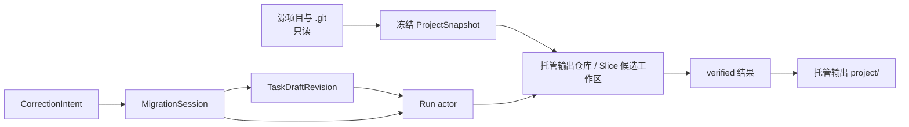

# CodeMigrator 会话式迁移、途中修正与安全点编排

> 文档状态：V4 当前架构基线；本篇为 M-16。  
> 技术范围：本地项目注册、MigrationSession、Spec 起草会话、风险驱动提问、运行中修正（PlanRevision）与契约漂移修正协议、薄 Skill 与托管输出；修正边界对齐 Migration Spec v3 与四类 Slice DAG。  
> 契约真相：本篇拥有会话、问题、修正、PlanRevision、Spec 起草会话（会话流程、草稿数据模型与确认语义）、契约漂移修正协议（涟漪确认门与作废重建执行语义）、模块变更账本与交互门；Run/Slice/验证语义由 [M-00](CodeMigrator_垂类设计原则与架构哲学.md) 拥有，涟漪计算依赖图由 [M-07](CodeMigrator_迁移计划生成器.md) 拥有，REST/SSE 由 [M-02](CodeMigrator_系统后端架构.md) 拥有；会话输入不能直接写 Git、PostgreSQL、worker、candidate 或源项目，Run actor 只在安全点吸收已持久化的意图。  
> 关联文档：[核心目录](CodeMigrator_核心目录架构设计.md)、[Run actor](CodeMigrator_Harness总体设计.md)、[Agent Loop](CodeMigrator_Agent_Loop设计.md)、[Spec](CodeMigrator_Migration_Spec抽象层.md)、[计划](CodeMigrator_迁移计划生成器.md)、[候选工作区与工具网关](CodeMigrator_候选工作区与工具网关.md)、[Git](CodeMigrator_工作空间与Git集成.md)、[上下文](CodeMigrator_记忆与上下文管理.md)、[CLI/Web 体验](CodeMigrator_Web体验与可视化工作台.md)。

CodeMigrator 的交互不把跨语言翻译变成一段不可中断的黑箱，也不把聊天框变成绕过工程约束的第二个 Agent。用户从项目目录进入会话，先经 Spec 起草会话把自然语言需求收敛为可审阅的 Spec 草稿，再确认一份冻结的跨语言翻译任务——语言对、双端工具链描述符锁、检查集与分解策略；Run 开始后，用户仍能基于正在产生的模块变更、验证和日志投影提出自然语言修正。消息先成为可审计事实，再由 Run actor 在安全点暂停整条 Run、分类影响并生成新的计划修订（PlanRevision）。V4 下受控编辑链与插件进程已废除：修正的吸收面是冻结的四类 Slice DAG 与描述符锁，已验证主线只向前推进、不回写。

## 从只读项目到托管输出

本地 CLI 从当前目录向上发现最近 Git root。找不到 Git root 时拒绝把普通目录初始化为仓库；当前目录不是 root 时只要求一次确认。源项目是输入，而不是工作区：不改源文件、目录、mtime、权限、索引或 `.git`，不在源目录创建任何工作区，也不生成 `.codemigrator`。CLI 只读采集事实，随后在 CodeMigrator 用户数据目录中创建冻结 snapshot 与托管输出工作区。

逻辑目录固定为平台对应的用户数据根，例如 `~/.codemigrator/`：`projects/<project-id>/snapshots/<snapshot-id>/` 保存冻结输入；`runs/<run-id>/repo/`、候选工作区与 `artifacts/` 是托管执行区；`outputs/<project-slug>/<run-id>/` 保存最终 `project/`、`migration-log.md` 与 `migration-manifest.json`。路径由服务端从 `project-slug + run-id` 派生，客户端不提供输出路径，因此 Run 之间不覆盖。

| Run 终态 | `project/` 物化规则 | 必须写入的说明 |
|---|---|---|
| `COMPLETED` | 物化最终 verified | verified OID 与完整结果 |
| `PARTIALLY_COMPLETED` | 物化依赖闭合的 verified | 哪些独立 Slice 未完成 |
| `CANCELLED` | 有 verified 推进才物化 | 取消前已验证边界 |
| `FAILED` | 仅有有效 verified 进展才物化 | 失败原因与非成功标识 |

物化先写同一文件系统的临时目录，再原子 `os.replace`；未完成复制时正式 `project/` 不可见。`output show`、`output open` 与 `output export <destination>` 是用户显式动作，export 不回写源项目。

脏工作树是唯一需要用户选择的输入事实：干净仓库冻结当前 HEAD；有未提交修改时，AskUser 要求在“仅当前 HEAD”与“把当前工作树只读复制为 synthetic snapshot”间选择。后者包含 tracked 修改，未跟踪文件只有在用户明确确认后纳入；synthetic commit 只写托管输出仓库。

## Spec 起草会话先收敛意图，再由用户确认冻结

手写完整 Spec JSON 对多数用户并不现实：语言对、范围模式、检查集与分解策略的字段语义超出普通用户的书写能力，而既有的 AskUser 只覆盖关键决策缺口（脏工作树选择、运行中风险提问），不承担从零构造任务的职责。Spec 起草会话填补这一门槛空隙：它是 ANALYZE 之前、CreateRun 之前的交互阶段，把"描述迁移什么"交给自然语言，把"构造正确的 Spec 草稿"交给会话 Agent，把"草稿是否生效"交给用户确认。会话类型（四类 Slice 会话之外的一类模型会话）与工具面、循环边界由 [M-04](CodeMigrator_Agent_Loop设计.md) 定义，本篇是起草会话的设计 owner——拥有会话流程、草稿数据模型与确认语义；上下文装配同受 [M-14](CodeMigrator_记忆与上下文管理.md) 预算治理约束。

流程自用户选定源项目路径开始：CLI 为主入口（`codemigrator migrate start` 衔接既有入口，Git root 发现与脏工作树确认沿用既有规则；Web 只读边界不变，[M-15](CodeMigrator_Web体验与可视化工作台.md)）。用户以自然语言输入迁移需求后，会话 Agent 以 ANALYZE 级只读授权探索源项目（ReadFile/QuerySourceAst/Exec 只读编排批量探索，[M-04](CodeMigrator_Agent_Loop设计.md)）——探索对象是用户选定项目的只读事实，不触达任何候选工作区或托管输出，全程对源项目零写入。起草分两段、产出三件工件：先浅探索产出 Spec 草稿——语言对、翻译范围与排除项、工件策略建议值（ArtifactKind 分类，真相仍归描述符 `artifact_rules`）与测试策略建议值（落位于检查集与分解策略字段）；再深潜探索产出《项目理解档案》UnderstandingDossier 草稿（语义模块划分、依赖消解判定、风险热点、策略建议，[M-04](CodeMigrator_Agent_Loop设计.md) 理解会话节/M-00 公共契约）；随档案一并产出《迁移规则手册》MigrationRulebook 初版（惯用法映射/命名约定/错误处理模式/框架 idiom，M-00 契约）。三件工件一并呈现给用户。关键决策缺口经 AskUser 补齐，复用既有 InteractionStatus 交互门与提问纪律：一次最多三题、互斥选项与推荐项、无法从 Git、manifest、描述符或 Spec 推导的关键缺口才允许提问、相同回答幂等，默认值必须在草稿预览中可见。

产制点归一（X1 定案）：**起草会话深潜阶段＝理解会话本体**——《项目理解档案》在此产出并随 Spec/Rulebook 一并经用户确认冻结为 Run 三件输入；ANALYZE 阶段不再产出档案，只执行机械完备层管线并消费已冻结档案做一致性校验（M-00 信息分层原则/M-04 阶段表同步口径）。

**试译-弃稿校准环节**：三件工件确认前，Agent 选取 2–3 个代表性文件做试译演练——同一文件分别按规则手册约束与"自由发挥"各译一版，在会话内并排呈现差异供用户对比；差异结论用于校准规则手册条目与档案（如发现规则缺失或语义分组不当）。试译产物仅在会话内呈现、显式标记弃稿——零落盘、零候选工作区触碰、零 Run 副作用，其价值是磨规则而非攒进度（Anthropic 迁移实践吸收：扇出前的 shakedown cruise）。

用户审阅的是三份草稿全文：可以自然语言提出修改意见，Agent 修订草稿并再次呈现，多轮修改与再对齐各自留版本、全部经会话通道入账；对理解档案与规则手册的修改意见同样进入修订循环（如"这两个目录其实是一个模块""这个动态 import 可以忽略""错误处理统一用 Result 风格"）。用户显式确认后三件工件才生效：被确认的 Spec 草稿 revision 由 TaskDraftRevision 生成 canonical Spec Artifact/hash（[M-05](CodeMigrator_Migration_Spec抽象层.md) 的"草稿→确认→冻结"），被确认的档案以内容 hash 冻结为 Run 第三件输入（PLAN 消费，M-07），被确认的规则手册以 version 1 冻结为 Run 知识工件（运行中经受控追加演进，M-00），一并进入 CreateRun 流程；确认后的冻结与能力门预检按"会话先冻结目标，再创建 Run"的既有规则执行。

边界四条：

- Agent 只起草不提交。草稿生效的确认权在用户，未经显式确认的草稿零 Run 副作用——Run、`run_events`、Slice、candidate 与托管输出新增数均为零。
- 起草会话工具面＝只读探索（含 Exec 编排只读批量查询，编排对象仅限 ReadFile/QuerySourceAst）+ AskUser，无任何写权限。WriteFile/EditFile/Shell 不在授权面内，Exec 脚本零环境权威且仅可编排只读工具（[M-04](CodeMigrator_Agent_Loop设计.md)/M-12），草稿与档案持久化走会话通道（TaskDraftRevision 账本）而非 WriteFile。
- 草稿不是第二种 Spec 输入。草稿阶段不占用 [M-05](CodeMigrator_Migration_Spec抽象层.md) 的 Spec 语义，canonical Spec 仍唯一；描述符锁由系统按语言对从当前资源账本解析写入，TaskDraft、message 或会话上下文不能指定描述符锁，也不能覆盖 write scope 或安全策略。
- 冻结后的修正边界不变。Spec 经确认冻结后，语言对、描述符锁与 required checks 的运行中修正仍按"修正先入账，再在安全点吸收"的既有边界拒绝或落地；起草会话只改变任务的构造方式，不改变冻结事实的修正规则。

## 会话先冻结目标，再创建 Run

`MigrationSession` 与 Run 分离，使任务澄清、会话消息和运行期间修正都能有独立账本。全部会话 ID、`MigrationSessionStatus`、`InteractionStatus` 与 `CorrectionIntentStatus` 是 [M-00](CodeMigrator_垂类设计原则与架构哲学.md) 的 UUID v7 公共契约；本篇只规定它们的存储、触发和消费边界。

会话先收集用户目标，Session Agent 读取项目摘要、双端工具链描述符能力与锁定 Skill catalog；只在答案会改变语言对、翻译范围、目标结构、输出或验证时调用 AskUser。TaskDraftRevision 冻结 snapshot、语言对与目标、翻译范围与排除项、required checks、Spec Artifact/hash（含双端描述符锁）、分解策略、Skill catalog hash、用户消息 sequence 与默认输出目录。用户确认指定 revision，能力门预检（描述符、grammar 与工具链镜像摘要）通过后才允许创建 Run；预检失败不创建 Run。

状态收敛说明（消费方口径，与 M-00 枚举表同变更集同步）：`CorrectionIntentStatus` 收敛为七值——`Classifying` 归入 `Received`（分类是 actor 即时行为而非持久态）、`Superseded` 并入 lineage/Attempt History 记录（被取代不是意图自身的状态，取代事实经 `supersedes_slice_id` lineage 可查）、`DeferredToFollowUp` 保留为显式挂起终态；本篇及各消费方不得再引用被合并态。`InteractionStatus` 辨析：`PausingForInput`＝正在排空至安全点的瞬态（在途原子操作计数由 Run 投影表达），`WaitingForUser`＝已抵达安全点等待输入的稳态——UI 在前者呈现"暂停中"、后者呈现"等待输入"，两者不混用。

AskUser 不是模型工具：它不属于任何 phase 工具箱（M-12 边界），只属于 Session Agent 与 Steering Interpreter。一次最多三题，每题都有 QuestionId、互斥选项、推荐项、影响说明、自由文本许可和绑定 revision。无法从 Git、manifest、描述符或 Spec 推导的关键缺口才允许提问；相同回答幂等，过期 question revision 的冲突回答固定拒绝。CLI 用编号选择，Web 用选择卡，默认值必须在 TaskDraft 预览中可见。

## 修正先入账，再在安全点吸收

RunStatus 不增加“等待用户”枚举。`InteractionStatus` 独立表达交互门，因此用户看见的是 `EXECUTING · WAITING_FOR_USER`，而不是一个被伪装成失败或验证状态的 Run。

| 安全点 | actor 在收到修正后的行为 |
|---|---|
| 模型调用完成 | 不启动下一次模型调用 |
| Agent 文件操作与 candidate checkpoint 完成 | 不启动下一次 checkpoint 或 generation |
| 单个 check receipt 接纳完成 | 不派发下一 check |
| integration intent 写入之前 | 不写 intent |
| intent 已写 | 对账 Git CAS 与 receipt，不遗留半事务 |
| Phase 转换提交之前 | 不提交下一阶段 |

用户消息先持久化为 `CorrectionIntent`，actor 随即关闭新工作入口，等待全 Run 收敛到上述安全点。等待期内模型调用、dispatch、Agent 文件操作、generation 与 integration 的新增数都是零。Steering Interpreter 对意图生成脱敏影响摘要：目标对象只能来自 CLI 的 `@slice`、`@check` 或 Run-wide 显式选择，以及 Web 的 context chip；系统不得根据当前页面视口猜测对象。

修正的可行边界由冻结事实划界：语言对、双端描述符锁与 required checks 在 Run 创建时冻结，试图改变它们的 CorrectionIntent 直接拒绝，不进入分类流程；可作用的只有分解策略参数（目标模块粒度、并行度上限、测试分组策略）、翻译范围偏好与具体 Slice 的目标结构偏好，且全部经 PlanRevision 重规划尚未集成的 Slice 落地。已集成进入 verified 的部分永不失效（P-10）：对其效果的修正只能以 compensation Slice 从最新 verified 向前推进；唯一成文的例外是契约漂移修正协议——错误源于契约本身时，已集成下游 Slice 经涟漪确认门确认后以 generation 重置整体重建，verified 历史仍零回写（见下文）。

局部修正仅在它只影响一个未集成 Slice、不扩大 write scope、不改变语言对/描述符锁/required checks/安全策略、不改已集成代码且不改其他 Slice 依赖时自动应用。它仍不篡改冻结 Slice：新 PlanRevision 产生新 SliceId 与 `supersedes_slice_id` lineage，replacement Slice 继承被替换者的 SliceKind、从 generation `0` 起；旧 candidate、上下文包与工具授权失效并归档。

结构修正影响多个 Slice、DAG、write scope、候选集合或已集成效果时，系统必须先给出 `ImpactPreview`。预览列出 preserved、invalidated、replacement 与 compensation Slice、新冻结集成后缀以及保持不变的 checks、描述符锁和安全边界；四类 Slice 的影响差异分别呈现——替换实现或测试翻译 Slice 只重派生该组的目标输出路径集合，契约与其他 Slice 不失效；调整分解策略（目标模块粒度、测试分组）会重建未集成实现/测试翻译 Slice 的分组与依赖边，契约 Slice 的集成事实不变；已集成 Slice 永不失效，对其效果的修正只能从最新 verified 产生 compensation Slice（契约源头错误的波及修正除外，见下文契约漂移修正协议）。用户确认 preview hash 后才创建 PlanRevision。已进入 verified 的历史不回写。`CandidateGeneration` 的 `0/1/2` 只表达同一 replacement Slice 的验证重生成，用户消息不消耗它。

进入 Final Verify 后当前 Run 不回到 EXECUTING。新的用户消息形成基于当前 verified 的后续 TaskDraft，用户确认后创建后续 Run。语言对、描述符锁、required checks、Skill catalog、base snapshot 与安全策略不接受运行中自然语言削弱或替换；缩小翻译范围、调整目标结构偏好等修正只能经 PlanRevision 重规划未集成 Slice，不回写冻结 Spec 本体。

## 契约漂移修正先算涟漪，再经确认门作废重建

契约 Slice 集成后发现签名/设计级错误时，问题不在某一个实现：其全部下游实现/测试翻译/测试生成 Slice 都构建在该契约之上，错误前提波及整条依赖闭包。既有机制各有覆盖——PlanRevision 重规划未集成 Slice、generation `0/1/2` 定向重生成承接实现级失败、compensation Slice 修正已集成结果的局部偏差——唯独"契约源头错误的波及修正"的涟漪成本与决策门槛没有定义，契约漂移修正协议填补这一空隙。触发来源两类：集成层验证发现契约签名与实现/测试用法不一致（归因落到契约 Slice 本身），或用户经会话确认契约需要变更——后者仍先入账为 CorrectionIntent、在安全点吸收；实现级错误（归因落到具体实现/测试 Slice）不触发本协议，仍走既有定向重生成。

涟漪成本模型的事实来源是 [M-07](CodeMigrator_迁移计划生成器.md) 涟漪计算依赖图的三步确定性查表：

- 符号引用闭包：以漂移的契约符号（一个或多个）为锚，经 PSF-2 项目索引的 ReferenceSite（[M-06](CodeMigrator_代码分析与AST引擎.md)）查"引用该契约符号的模块集"——符号绑定→引用点→引用文件→归属模块，双向索引直接查表，零运行时图解析。
- 依赖闭包：受影响模块集在 PSF-3 关系图上取传递闭包——受影响模块自身及其全部下游依赖模块。
- Slice 映射：闭包内模块经冻结计划的 source_modules→Slice 映射命中受影响 Slice 集。

受影响粒度精确到符号级：未引用漂移符号的下游模块不进入作废范围，区别于作废全部下游模块的旧粒度；text-fallback 无 PSF-2 条目时降级为模块级闭包并显式标注降级事实（[M-07](CodeMigrator_迁移计划生成器.md)）。涟漪计算是冻结计划与 M-06 投影之上的只读投影，不修改计划事实；其产出是涟漪预览——作废范围、重建范围与预计 Slice 数，附受影响集合的集成状态分布（已集成/在途/未开始计数，已集成计数是确认门阈值判定的直接输入）与预计涉及符号清单。

用户确认门以"触及已集成成果的成本"为轴，**一律确认、无阈值分叉**（丙-14 定案）：契约漂移的作废重建必须经 `ImpactPreview` 用户确认后才执行——涟漪预览作为 `ImpactPreview` 的事实输入（[M-07](CodeMigrator_迁移计划生成器.md)），复用既有 preview hash 确认与 InteractionStatus 交互通道，未确认前作废、重置与重派的执行数为零；原"小涟漪自动执行"支路删除——不设阈值 N、无自动执行分支，触及已集成成果的波及修正不存在免人工门路径。涟漪预览产出、确认门触发与下游作废重建三类漂移观测事件全部经 [M-13](CodeMigrator_可观测性系统.md) 的同一脱敏出口追加进 `run_events`（指标口径见 M-13）；观测不改变 PlanRevision 或确认门语义。

执行语义依集成状态分流：

| 受影响对象 | 集成状态 | 处置 | 通道 |
|---|---|---|---|
| 契约 Slice（错误源头） | 已集成 | replacement lineage 重生成：新 SliceId、`supersedes_slice_id`、继承 Contract SliceKind、generation 从 `0` 起 | 既有 PlanRevision |
| 下游 Slice | 已集成 | generation 重置为 `0`——开启**新候选流**（旧流 superseded 归档，M-00 generation 语义的唯一受控例外），从最新 verified（含重生成后的契约）重跑完整候选流程且新流同样受 `0`~`2` 约束；原集成事实保留，新代经验证集成后向前取代 | 既有定向重生成 |
| 下游 Slice | 未开始或在途 | 作废重派：在途 candidate、上下文包与工具授权失效归档，新冻结输入绑定修正后契约 | 既有 PlanRevision replacement |

两种重建都只向前取代：原契约与原下游的集成事实以 superseded 记入 ModuleChangeRecord 与 Attempt History，verified 历史在任何路径下零回写。修正落地仍走 PlanRevision 全部规则（write scope 派生、环拒绝、集成键、5000 上限，[M-07](CodeMigrator_迁移计划生成器.md)）；重跑过程中的失败按既有 `0/1/2` generation 预算定向重生成。重建走正常 DAG 就绪：契约 Slice 重新集成后，仅依赖该契约的下游 Slice 依赖闭包即就绪、即可进入 `RUNNING` 重建，不等任何全局屏障（依赖闭包就绪即启动，[M-00](CodeMigrator_垂类设计原则与架构哲学.md)/[M-07](CodeMigrator_迁移计划生成器.md)）。

与 compensation Slice 的边界：compensation 处理"已集成结果的局部修正"（既有）——错误源于实现的局部偏差，已集成 Slice 永不失效，修正从最新 verified 以 compensation Slice 向前推进；本协议处理"契约源头错误的波及修正"（新增）——错误源于契约本身的签名/设计级缺陷，波及全部建于其上的下游。两层衔接：契约修正（本协议）之后，下游已集成结果的处置依错误性质分流——实现局部偏差由 compensation 承接，契约源头错误导致的整体性偏差走本协议的作废重建；判断准则是错误是否源于契约本身（签名/设计级）而非实现局部偏差。"已集成 Slice 永不失效"保持为运行中修正的默认边界，本协议是其唯一成文的受控例外，例外范围由确认门约束——正因触及已集成成果，作废重建必须经人工确认。

## 薄 Skill 只提供知识，不获得执行权

运行前安装的内置或第三方 `<skill-name>/SKILL.md` 只提供 `name`、`description`、`when_to_use`、`phases`、`version`、Markdown 正文与只读引用。允许的内容组成锁定 catalog；CreateRun 前冻结 SkillId、来源、版本与 SHA-256，Run 内模型只按 Phase 从该 catalog 选择 Skill，选择事实进入 session/run events，正文计入 [上下文预算](CodeMigrator_记忆与上下文管理.md)。

| 输入字段或能力 | 处理 | 原因 |
|---|---|---|
| Markdown 知识、步骤、引用 | 读取并纳入受限上下文 | 可审计、可锁定 |
| tool、shell、script、hook、MCP | 忽略并明确提示 | Skill 不能扩大执行面 |
| agent、model、effort、execution context | 忽略并明确提示 | 运行策略由 Harness 编排层冻结 |
| 网络下载、安装动作 | 拒绝 | catalog 只能运行前安装 |

首批内置 Skill 的具名清单移**实施期待办**（命名与数量在实施期结合批次 1 靶场确定；架构约束不变）：Skill 不能注册工具、执行脚本、改写 Spec、取得 Git 权限或绕过工具网关直接写目标文件。

## 模块变化记录把最终事实与尝试分开

模块粒度优先使用源端描述符清单解析识别的 npm workspace、Java module、Go module、Python package/project 或其他 typed module fact；识别失败时退化为 Slice 与文件清单。`ProjectModuleId` 投影固定保存模块名称、仓库相对根、language/描述符、build system 与 Slice 集合。

每次 integrated、superseded、failed 或 compensated 动作都追加 `ModuleChangeRecord`：它关联 ProjectModuleId、PlanRevision、Slice lineage、SliceKind、generation、CorrectionIntent、文件新增/修改/删除/重命名清单、candidate/prospective/verified OID、三层验证摘要、integration receipt、路径/hash/ArtifactRef 与 UTC 时间；不保存源码正文或完整日志。

最终输出以两种视图表达：Effective Changes 仅包含进入 verified 的模块修改；Attempt History 保留替换、失效、重生成与失败尝试。`migration-log.md` 面向用户，`migration-manifest.json` 面向机器和后续 Run；二者只写托管输出目录与最终报告模块章节。

## 对外投影与可检查的边界

会话持久事件使用 `migration.session.event` version `1`。`assistant.delta` 只用于短暂流式显示，不持久化也不推进 session sequence；完整回复落账后才产生 `assistant.message.completed`。修正被接受时，与对应的 `run_events` 在同一事务写入，确保 CLI 与 Web 不会看到不同的暂停事实。

| 投影 | 允许提交 | 明确拒绝 |
|---|---|---|
| CLI/Web 会话 | message、answer、confirmed draft、confirmed correction | patch、Git、worker、数据库直写、交付重试 |
| Web 项目选择 | 已注册本地项目、托管 snapshot、远端 Git | 任意宿主目录浏览 |
| 输出信息 | 授权用户的 source/output display path、OID、模块摘要 | 真实路径进入日志、指标、公共 SSE、错误或分享链接 |
| API source | `RemoteRepository` 或 `RegisteredProject` 判别来源 | 客户端提供任意 output path |

贯穿场景：用户在 TypeScript 项目 `legacy-console` 根目录执行裸 `codemigrator`，确认 synthetic snapshot 与“TS→Python 全量翻译”的 TaskDraft（冻结 typescript/python 双端描述符锁与检查集）。Run 执行到波 2 时，用户在实现 Slice `models` 详情输入“实体用 dataclass 表示，不要用裸 dict”。actor 在当前 check receipt 后暂停；解释器发现该输入只影响未集成实现 Slice 且 write scope 不变，创建 replacement Slice `g0`（继承 Implementation kind）。它局部通过（语法+契约类型检查）、按冻结队列集成后被 ModuleChangeRecord 记为 effective change，最终 Python 项目物化到托管输出而源目录保持零写入。反例一：“降低测试要求”——它改变 required checks，CorrectionIntent 直接拒绝，不产生 PlanRevision 或 candidate。反例二：“改用 Go 作为目标语言”——它改变语言对与描述符锁，同样直接拒绝。

可施工验收：

- [ ] V-M16-V4-001：裸 CLI 在 Git 子目录自动发现最近 root；源目录与 `.git` 的写入、mtime、权限和索引变化数均为零。
- [ ] V-M16-V4-002：脏工作树必须经 AskUser 确认 snapshot 方式；未确认前不创建 Run。
- [ ] V-M16-V4-003：每 Run 有唯一托管输出，候选工作区不可直接物化或发布到用户分支。
- [ ] V-M16-V4-004：会话消息使整个 Run 在安全点暂停；等待期内模型调用、dispatch、Agent 文件操作、generation 与 integration 的新增数为零。
- [ ] V-M16-V4-005：局部修正产生 replacement Slice（新 SliceId、`supersedes_slice_id` lineage、继承 SliceKind、从 generation `0` 起）；结构修正必须确认 preview hash 后才创建 PlanRevision——契约漂移修正协议同样经确认门（见 V-M16-V4-016），无自动执行例外。
- [ ] V-M16-V4-006：改变语言对、描述符锁或 required checks 的 CorrectionIntent 全部直接拒绝，PlanRevision 与 candidate 新增数为零。
- [ ] V-M16-V4-007：任何修正后，已进入 verified 的 commit 序列零回写；已集成 Slice 永不失效，效果修正只经 compensation Slice——唯一例外是契约漂移修正协议的作废重建路径（见 V-M16-V4-015 至 V-M16-V4-018），该路径下 verified 历史同样零回写。
- [ ] V-M16-V4-008：Final Verify 后用户输入只形成后续 TaskDraft，不产生本 Run 的 PlanRevision，也不出现 EXECUTING 回退。
- [ ] V-M16-V4-009：薄 Skill 的脚本、hook、MCP 与工具权限实际生效数为零。
- [ ] V-M16-V4-010：每个 ModuleChangeRecord 可由 receipt、OID 与 ArtifactRef 重建。
- [ ] V-M16-V4-011：会话输入不改变描述符冻结的检查命令面，也不扩容核心八指标。
- [ ] V-M16-V4-012：Spec 起草会话全程 WriteFile/EditFile/Shell 的调用接纳数为零，Exec 仅接纳编排只读工具的脚本且逐笔过网关；Spec 草稿与理解档案（含多轮修订版本）经会话通道以 TaskDraftRevision 账本持久化，经 WriteFile 的写入数为零；用户确认后 Spec 与档案分别以内容 hash 冻结为 Run 输入。
- [ ] V-M16-V4-013：未经用户显式确认的 Spec 草稿产生的 Run、`run_events`、Slice、candidate 与托管输出新增数均为零；多轮修改与再对齐不改变这一边界。
- [ ] V-M16-V4-014：用户显式确认后，被确认 revision 生成的 canonical Spec Artifact/hash 与 [M-05](CodeMigrator_Migration_Spec抽象层.md) 的 canonical 化规则一致，Run 创建经能力门预检；预检失败不创建 Run，草稿可继续修改后再确认。
- [ ] V-M16-V4-015：契约漂移的受影响集合为"引用该漂移契约符号的模块集"（PSF-2 ReferenceSite 查表）在 PSF-3 关系图上的依赖闭包经 source_modules→Slice 映射命中——未引用漂移符号的下游模块对应的 Slice 不进入作废范围（区别于全量下游粒度）；text-fallback 无 PSF-2 条目时降级为模块级闭包并显式标注降级事实；涟漪预览含作废范围、重建范围、预计 Slice 数与已集成/在途/未开始状态分布，涟漪计算不修改冻结计划事实。
- [ ] V-M16-V4-016：契约漂移一律经 `ImpactPreview` 用户确认（preview hash）后执行——未经确认的作废重建（作废、重置与重派）执行数为 0；不存在阈值 N 分叉与自动执行支路。
- [ ] V-M16-V4-017：执行语义依集成状态正确分流——契约 Slice 经 PlanRevision replacement 重生成；已集成下游 Slice generation 重置为 `0`、从最新 verified 重跑完整候选流程且原集成事实以 superseded 记入 Attempt History、verified 历史零回写；未集成下游 Slice 作废重派（在途 candidate 失效归档、新冻结输入绑定修正后契约）；重建依依赖闭包就绪即启动，无全局屏障等待。
- [ ] V-M16-V4-018：错误源于契约本身（签名/设计级）的修正经本协议作废重建落地，错误源于实现局部偏差的已集成结果修正经 compensation Slice 落地；归因记录区分两类错误，两条通道不混用——实现级错误不触发涟漪作废，契约漂移不为无关已集成结果产生 compensation。

---

> 设计演进、历史缺陷处置和变更理由见：[文档迭代记录](文档迭代记录.md)。
