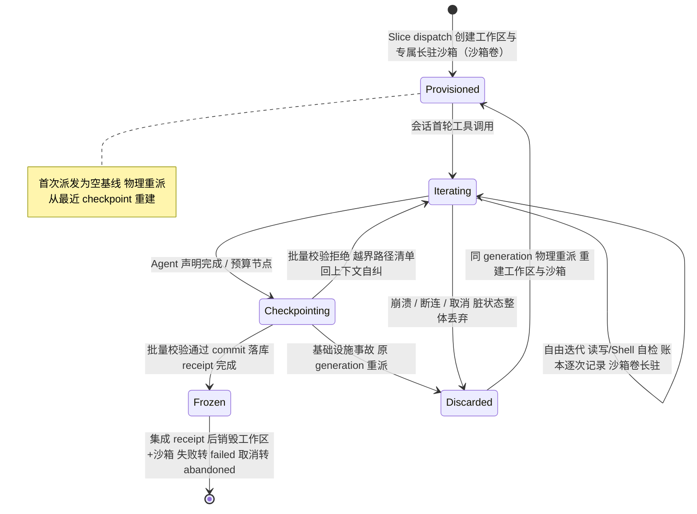
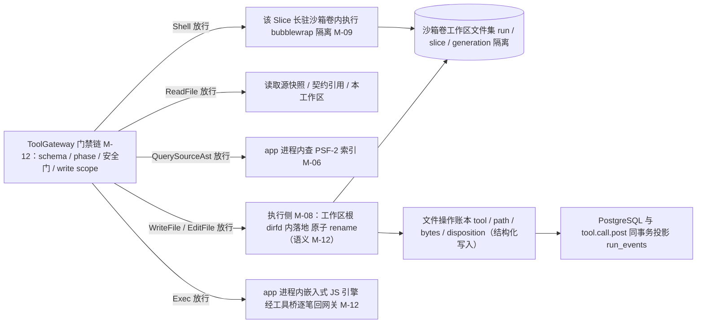
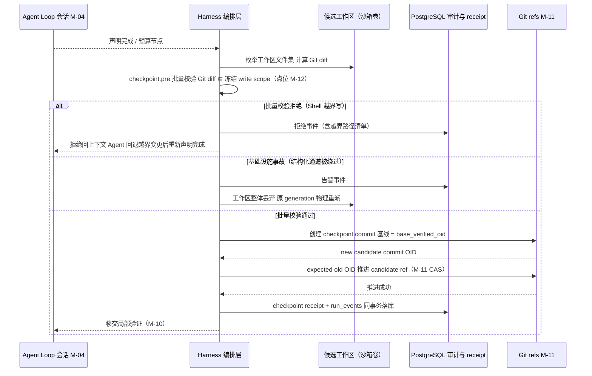

# CodeMigrator 候选工作区与工具网关：隔离迭代、执行侧落地与 checkpoint 提交

> 文档状态：V4 当前架构基线；本篇是候选工作区生命周期、六工具执行侧与 checkpoint commit 的唯一 owner。工作区即沙箱卷（fb7 对齐）：每 Slice 候选工作区物理上是宿主 app 与该 Slice 专属长驻沙箱共享挂载的沙箱卷；write scope 防护双轨——结构化工具逐写路径门拦截 + Shell 写效果 checkpoint 批量校验；CheckRunner 已作为 Agent 工具退役（自检并入 Shell，M-12）。  
> 技术范围：候选工作区（沙箱卷）创建/自由迭代/冻结/清理、六工具（ReadFile/WriteFile/EditFile/QuerySourceAst/Shell/Exec）在候选工作区的执行落地与执行面分工、工作区文件操作审计、checkpoint commit 与 `checkpoint.pre` 批量校验的执行侧、write scope 防护双轨、生成 action 执行侧（`ArtifactKind.GeneratedCode`）、恢复与中断窗口。  
> 契约真相：Phase 工具授权、`WriteScope`、稳定错误码与路径安全门由 [M-00](CodeMigrator_垂类设计原则与架构哲学.md) 与 [M-12 工具系统与 Hook](CodeMigrator_工具系统与Hook.md) 唯一拥有；Git ref 物理事务与 expected-OID CAS 由 [M-11](CodeMigrator_工作空间与Git集成.md) 拥有；沙箱物理隔离（bubblewrap 参数、无凭据挂载、网络策略）、资源公式与裁决层一次性 validation overlay（以 tested commit 为源）由 [M-09](CodeMigrator_沙箱与执行环境.md) 拥有；会话循环与会话失效由 [M-04](CodeMigrator_Agent_Loop设计.md) 拥有。  
> 关联文档：[Agent Loop](CodeMigrator_Agent_Loop设计.md)、[工具系统与 Hook](CodeMigrator_工具系统与Hook.md)、[沙箱与执行环境](CodeMigrator_沙箱与执行环境.md)、[Git 集成](CodeMigrator_工作空间与Git集成.md)、[验证引擎](CodeMigrator_验证引擎.md)、[记忆与上下文管理](CodeMigrator_记忆与上下文管理.md)。

本篇回答四个问题：Agent 的工具调用落在哪里（候选工作区——物理上即沙箱卷）、六工具调用如何变成磁盘状态与审计事实（执行侧）、Shell 写效果如何被整体裁决（checkpoint 批量校验）、生成代码类工件如何产出（生成 action 执行侧）。V4 之下 Agent 持六工具（L1 结构化文件 / L2 结构化导航 / L3 Shell / L4 Exec，M-12）在候选工作区直接写目标代码（P-01）：每个 Slice generation 拥有一个独立候选工作区（P-07）——物理上是一个沙箱卷，宿主 app 与该 Slice 专属长驻沙箱共享挂载；Agent 在其中自由迭代——没有提案链、没有批次、没有字节级哈希守卫；Harness 编排层不逐键介入文件内容，只在迭代终点把工作区文件集整体提交为 checkpoint commit，并以 expected old OID 推进同 generation 的 candidate ref。V3 的 GuardedPatch、批次链、三哈希与受控重放全部废除，并发保护收敛为两条：计划冻结的输出路径集合互斥，加上 Git ref 推进的 expected-OID CAS；write scope 防护收敛为双轨：结构化工具事前逐笔拦截，Shell 写效果事后由 checkpoint 批量校验整体裁决。

## 职能边界：M-08 拥有什么，引用什么

| 职责 | 唯一 owner | 本篇角色 |
|---|---|---|
| 候选工作区生命周期：创建、自由迭代期、冻结、集成/废弃清理，含专属长驻沙箱（沙箱卷）的创建与销毁时机 | 本篇 | 唯一 owner |
| 六工具执行侧：WriteFile/EditFile/ReadFile 在工作区（沙箱卷）的落地、Shell 入该 Slice 长驻沙箱、Exec 引擎宿主与工作区状态 | 本篇 | 唯一 owner |
| checkpoint commit 与 `checkpoint.pre` 批量校验（write scope 防护双轨的事后防线）的执行侧 | 本篇 | 唯一 owner（点位定义与记录内容由 M-12 拥有） |
| 生成 action 执行侧：`ArtifactKind.GeneratedCode` 的从源头重新生成与 scaffold 档命令落地 | 本篇 | 唯一 owner（工件分类契约归 M-00/M-01，派生归属归 M-07） |
| 工具 schema、拒绝码、路径安全门、phase 授权 | [M-12](CodeMigrator_工具系统与Hook.md) / [M-00](CodeMigrator_垂类设计原则与架构哲学.md) | 只引用；本篇不复制第二套规则 |
| candidate/integration/verified ref 物理事务与 expected-OID CAS | [M-11](CodeMigrator_工作空间与Git集成.md) | 只引用：checkpoint 请求 ref 推进 |
| 沙箱物理隔离（bubblewrap 参数、无凭据挂载、网络策略）与并发资源公式 | [M-09](CodeMigrator_沙箱与执行环境.md) | 只引用：长驻沙箱卷的隔离边界与资源语义 |
| 裁决层一次性 validation overlay（以 tested commit 为源）的创建与销毁 | [M-09](CodeMigrator_沙箱与执行环境.md) | 只引用：overlay 与候选工作区零共享 |
| 会话循环、会话身份三元组与失效 | [M-04](CodeMigrator_Agent_Loop设计.md) | 只引用：会话终止触发 checkpoint 或废弃 |
| 局部/集成/最终验证 | [M-10](CodeMigrator_验证引擎.md) | 只引用：checkpoint 后移交 |
| 不相交文件集应用与冻结集成序 | [M-11](CodeMigrator_工作空间与Git集成.md) / [M-00](CodeMigrator_垂类设计原则与架构哲学.md) | 只引用：集成 receipt 触发工作区清理 |
| 托管输出工作区物理目录布局 | [M-01](CodeMigrator_核心目录架构设计.md) | 只引用 |

M-08 与 M-12 的边界一句话：M-12 拥有"调用是否被允许"的全部判断（schema admission、phase 成员测试、路径安全门、write scope 域校验、拒绝码与错误 facts）；M-08 拥有"允许之后发生什么"——文件在工作区（沙箱卷）的原子落地、工作区状态迁移、逐次写操作的审计账本，以及迭代终点的 checkpoint 提交与批量校验。CheckRunner 已作为 Agent 工具退役（M-12）：会话自检并入 Shell 在长驻沙箱内自由执行，本篇保证自检副作用留在该 Slice 沙箱卷内、由 checkpoint 批量校验整体裁决；裁决层 `InternalVerificationDispatch` 不是模型工具、不经网关模型工具通道，其 overlay 纪律归 M-09（M-00/M-09 边界）。

## 候选工作区生命周期



### 物理形态：工作区即沙箱卷

每个 Slice 的候选工作区物理上就是一个沙箱卷：宿主 app 与该 Slice 专属长驻沙箱以共享挂载方式挂载同一卷（Docker volume 模式）。宿主侧路径供 L1 结构化文件工具（WriteFile/EditFile/ReadFile）在 app 进程内原子落地，沙箱侧同一文件集供 L3 Shell 与目标工具链以执行现场视角读写——两侧看到的是同一份磁盘状态，不存在拷贝或同步。一 Slice 一卷：write scope 不相交的并行 Slice，其沙箱卷两两隔离（V-M08-V4-001）。

沙箱生命周期随之从"单次检查"延展为 Slice 全生命周期：Slice generation 派发时与工作区同生（创建沙箱卷），经自由迭代期长驻——构建缓存与已装依赖跨命令驻留于卷内，同会话第二次构建/测试无冷编译、无重复下载（迭代加速）；集成 receipt 或废弃终态时与工作区同灭（销毁沙箱卷）。长驻只延展时间维度，不改变隔离语义：bubblewrap 参数、无凭据挂载与网络策略均与 [M-09](CodeMigrator_沙箱与执行环境.md) 冻结的隔离边界一致，沙箱内进程始终不可信，宿主凭据、Git refs 与控制面存储不进入挂载表。

资源语义随长驻联动：长驻沙箱的内存驻留计入 M-09 并发资源公式（驻留内存 × 并发 Slice 数）——工作区数量不再只是磁盘目录数，而是带内存驻留的沙箱实例数；并行度受计划分解（M-07）与并发槽位共同约束，[M-03](CodeMigrator_Harness总体设计.md) 在槽位之上执行跨 Run 公平轮转。

### 创建

Harness 在 Slice generation 派发时创建候选工作区：以沙箱卷为物理载体——宿主 app 与该 Slice 专属长驻沙箱共享挂载同一卷（Docker volume 模式），宿主侧挂载点位于 app 管理的托管输出工作区内、按 `run/slice/generation` 命名空间隔离的独立目录（物理布局归 M-01），并预先打开工作区根 dirfd 供路径安全门绑定（M-12 规则 6）；沙箱以同一卷为可写根，供 Shell 与目标工具链执行。工作区初始内容只有两种来源：

| 派发情形 | 初始内容 | 依据事实 |
|---|---|---|
| generation 首次派发 | 空基线——write scope 内文件数为 0，Agent 从零 WriteFile 目标文件 | 目标项目是全量翻译的全新产出，`base_verified_oid` 仅记录为 `SliceCandidate` 的分叉基线 |
| 同 generation 物理重派（断连、崩溃恢复、批量校验基础设施事故重派） | 从当前 candidate ref 指向的最近 checkpoint commit 重建文件集与沙箱卷；从未 checkpoint 过则仍为空基线 | candidate ref 是该 generation 已提交事实的唯一载体 |

generation `0..=2` 的语义重生成不继承旧 generation 的工作区、账本或上下文：新 generation 创建全新工作区并从当时最新 verified 重新分叉（M-00）。

### Agent 自由迭代期

会话首轮工具调用后进入迭代期。此期间工作区是被信但不被查的编辑面：Agent 以任意顺序、任意次数组合六工具（M-04/M-12）——ReadFile（读源快照、契约引用、本工作区）、WriteFile/EditFile（冻结 write scope 内直写）、QuerySourceAst（查 PSF-2 索引）、Shell（长驻沙箱内自由命令：构建、依赖安装、探索与会话自检）与 Exec（app 进程内嵌入式 JS 引擎编排 L1-L3）；Harness 对文件内容零介入——不审查、不做哈希、不拦截中间态。实时约束是 M-12 工具层的类型化拒绝（如结构化工具越界 `WRITE_SCOPE_VIOLATION`），拒绝不终止会话，Agent 据此自纠；Shell 写效果无逐笔拦截，由迭代终点的 checkpoint 批量校验事后裁决（下文双轨）。

迭代期的两个不变量：

- **写入只落本工作区文件集**。结构化通道：WriteFile/EditFile 的临时文件物化与原子 rename 语义由 M-12 定义，本篇执行侧保证其只作用于工作区根 dirfd 绑定的目录树；Shell 通道：写效果受沙箱卷物理边界约束——落点只可能在卷内。两条通道下，源项目快照、Git refs 与其他 Slice 工作区的写入数为 0（结构化通道由域校验保证，Shell 通道由沙箱隔离保证）；卷内是否越出冻结 write scope，由 checkpoint 批量校验事后裁决。
- **每次成功写操作即时入账**。执行侧为每次成功的 WriteFile/EditFile 追加一条结构化文件操作记录（下节），先于工具结果返回模型落账；工作区崩溃后不需要也无法从内存重建账本。Shell 调用的审计在 M-12 `tool.call.post`（命令文本、退出码与输出摘要），不进入本账本——账本只覆盖结构化写入。

Shell 自检在此期间随时可用：自检命令（如 `uv run pytest -q`、`uv run mypy .`）直接在该 Slice 长驻沙箱卷内执行——工作区即沙箱卷，自检现场就是迭代现场，无需一次性 overlay 拷贝，构建缓存与已装依赖跨命令驻留复用。自检覆盖的是尚未 checkpoint 的最新迭代状态，且仍是反馈不裁决——不写 `CheckResult` 账本、不推进 Slice 状态、不进 verification fingerprint（M-12）。CheckRunner 已退役（M-12）：其原"一次性 overlay 隔离自检"路线被工作区即沙箱卷取代——写效果本就发生在沙箱卷内，由 checkpoint 批量校验兜底。

### 冻结：checkpoint 提交

Agent 声明完成或预算节点到达时，工作区进入冻结路径（详见下节 checkpoint commit）：文件集经 `checkpoint.pre` 批量校验（工作区 Git diff ⊆ 冻结 write scope）后提交为 commit、candidate ref 以 expected OID 推进、receipt 落库。此后工作区转为只读证据面——局部与后续验证一律从 candidate commit 的一次性 overlay 执行（M-09/M-10），不再读写迭代期工作区；对该 Slice 的一切进一步修改只能经由新 generation 会话（M-04）。

### 集成/废弃清理

| 终点 | 触发 | 工作区与沙箱处理 | ref 处理（M-11） |
|---|---|---|---|
| 集成成功 | integration receipt 落库 | 销毁工作区与长驻沙箱（终止沙箱进程组、删除卷、目录与 dirfd） | 删除 candidate ref |
| 语义重生成 | 集成/最终验证归因触发，generation `0..=2` 余额内 | 旧 generation 工作区、账本与长驻沙箱整体废弃 | 旧 candidate 归档 failed ref 30 天 |
| generation 终态失败 | generation `2` 仍不能集成，恰一次 `SLICE_REGENERATION_EXHAUSTED` | 销毁工作区与长驻沙箱 | failed ref 保留 30 天 |
| 用户取消 | `cancel_requested` 已持久化 | 未验证工作区与长驻沙箱整体废弃 | abandoned ref 保留 30 天 |
| 预算耗尽 | 预算 100%，保存 checkpoint 后归档（M-03/M-00） | 归档后销毁工作区与长驻沙箱 | 未验证候选按 Run 失败证据规则保留 |

清理是幂等的单位级操作：销毁以工作区+沙箱卷为单位整体执行——先终止沙箱内进程组（M-09 清理语义），再删除卷与目录，不留半删状态与孤儿卷；工作区在 Run 终态前禁止 GC 提前回收（M-00 留存规则）。

## 工具网关执行侧：从放行调用到磁盘事实

工具网关的门禁链（schema → phase → 路径安全门 → 域校验）全部位于 M-12；六工具（L1-L4 四层）经网关放行后进入本篇执行侧：



六工具执行面分工（工具语义、schema 与拒绝码归 M-12；本表只定执行位置与写效果防护归属）：

| 层 | 工具 | 执行面 | 写效果防护 |
|---|---|---|---|
| L1 | ReadFile | app 进程内读三个可读根 | 只读 |
| L1 | WriteFile / EditFile | app 进程内、工作区根 dirfd 内原子落地 | 逐写路径门拦截（M-12）+ 本篇账本 |
| L2 | QuerySourceAst | app 进程内查 PSF-2 索引（M-06 服务） | 只读 |
| L3 | Shell | 该 Slice 专属长驻沙箱卷内执行（隔离 M-09） | 卷内物理边界 + checkpoint 批量校验（本篇） |
| L4 | Exec | app 进程内嵌入式 JS 引擎；经工具桥逐笔过网关编排 L1-L3 | 底层调用逐笔过网关（M-12，防护不降级） |

验证裁决不经网关模型工具通道：裁决层 `InternalVerificationDispatch` 不是模型工具，以冻结检查集 + tested commit overlay 独立执行（M-00/M-09/M-10），与六工具面零共享——模型无论在 L3/L4 执行了什么，fingerprint 的计算输入不受任何影响（P-02）。

执行侧的职责清单：

1. **落地**：结构化写入按 M-12 定义的临时文件 + 原子 rename 语义，物化到工作区根 dirfd 绑定的目录树内；目标保持旧内容或整体替换，不存在半写文件（M-12 V-M12-V4-004 同源验收）。Shell 命令在该 Slice 长驻沙箱卷内执行，宿主文件系统零触碰（M-09 隔离边界）；Exec 脚本零环境权威——引擎不暴露文件系统/网络/进程 API，唯一出口是工具桥（M-12）。
2. **工作区状态**：维护工作区（沙箱卷）在生命周期状态机中的位置；批量校验拒绝时工作区保留供 Agent 自纠（回退越界变更后重新声明完成）；`checkpoint.pre` 的基础设施事故路径或会话失效后，执行侧负责工作区（含沙箱）的原子丢弃与从 checkpoint 基线重建。
3. **审计**：每次成功结构化写操作记录一条账本（下表），并与 M-12 的 `tool.call.pre/post` 审计点衔接——`tool.call.pre` 记录"有这次调用"，`tool.call.post` 记录"调用的终态与副作用摘要"，本篇账本补足"副作用落在工作区的哪个文件、多少字节、何种 disposition"，三者同事务进入 `run_events`（M-02），供 M-13 指标与 M-15 工作台消费。

```python
class WorkspaceWriteTool(str, Enum):
    WriteFile = "WRITE_FILE"
    EditFile = "EDIT_FILE"


class WorkspaceFileOperation(BaseModel):
    run_id: RunId
    slice_id: SliceId
    generation: CandidateGeneration
    tool: WorkspaceWriteTool
    path: RepoRelativePath
    bytes_written: int
    disposition: WriteDisposition       # M-12：Created | Overwritten
```

审计边界：账本记录路径与字节摘要，不记录文件正文——正文只在候选工作区与 checkpoint commit 中；对外投影（run_events）与 M-12 拒绝审计一致，不携带正文、匹配内容或 stdout/stderr。

## 生成 action 执行侧：GeneratedCode 不翻译、从源头重新生成

工件策略（`ArtifactKind` 三类公共契约归 [M-00](CodeMigrator_垂类设计原则与架构哲学.md)，描述符 `artifact_rules` 字段归 [M-01](CodeMigrator_核心目录架构设计.md)）中，`GeneratedCode`（`.pb.go`、`*_pb2.py` 等生成代码）的执行语义是**不翻译**：这类工件是目标工具链命令的确定性输出，逐行翻译源侧生成物既不可靠（生成器版本与代码风格随工具链漂移）也无必要。执行侧落地为四条：

| 侧面 | 语义 | owner |
|---|---|---|
| 工件分类 | `artifact_rules` 以 `ArtifactKind.GeneratedCode` 声明 pattern 与 source_pattern（如 `**/*_pb2.py` ← `**/*.proto`） | M-01（描述符）/ M-00（契约） |
| 生成命令 | 目标侧从源头（`.proto`）用目标工具链重新生成；grpcio-tools 类重新生成命令入目标端描述符 scaffold 档——`CheckCommandTemplate` 命令模板机制的自然用法（向 scaffold 档追加一条命令模板），零机制新增 | M-12（命令面）/ M-09（执行面） |
| 派生归属 | 生成 action 归契约层 Slice 派生：`.proto` 源文件作为接口事实源被契约层消费，生成产物路径划入该契约 Slice 的冻结 write scope | M-07 |
| 执行语义 | 生成产物不进入 Agent 翻译面——不存在"翻译 `_pb2.py`"的 Slice；生成命令本身确定性执行，无模型裁量 | 本篇 |

执行面经沙箱（[M-09](CodeMigrator_沙箱与执行环境.md)）：生成命令作为 scaffold 档模板实例化后在沙箱内执行，产物由 Harness 从中受信提取应用（M-09 Scaffold 语义）——不经 Agent 工具面，也不占用 Agent 会话预算。Agent（契约 Slice 会话）对生成产物的触达与对其它工作区文件一致：ReadFile 引用，或在冻结 write scope 允许时的结构化编辑；越界修改与其它路径一样受双轨防护。

## checkpoint commit：提交、批量校验与幂等

checkpoint 是候选工作区与 Git 真相之间唯一的桥：它把"Agent 写了什么"整体固化为"candidate ref 指向什么"。提交由 Harness 编排层执行——不是 Agent 动作，Agent 无法触发、无法指定内容、无法跳过批量校验。



提交的固定顺序与失败语义：

| 步骤 | 动作 | 失败结果 |
|---|---|---|
| 0 | **quiesce**：Harness 终止该沙箱卷内全部活动 Shell/Exec 进程组（含后台驻留进程），卷进入静默态后再枚举——消除 diff 计算与 commit 推进窗口内的并发写竞态；进程终止不损失卷内文件与缓存 | quiesce 超时（进程不可终止）：按基础设施事故处理，工作区整体丢弃、原 generation 物理重派 |
| 1 | 枚举工作区文件集，执行 `checkpoint.pre` 批量校验（diff 口径见下文；Git diff ∖ build_excludes ⊆ 冻结 write scope，覆盖 Shell 写效果） | Shell 越界写：拒绝提交——commit 不创建、零 ref 推进、verified 零污染，拒绝事件（含越界路径清单）回 Agent 上下文自纠，回退越界变更后重新声明完成，generation 不消耗；越界来源分界事实=结构化工具审计是否存在越界记录（M-12）。结构化通道被绕过：属基础设施事故，工作区整体丢弃、原 generation 物理重派（M-12） |
| 2 | 创建 checkpoint commit（记录 `base_verified_oid` 与文件集 tree） | commit 对象创建原子：失败即无 commit，重派后重做 |
| 3 | 以 expected old OID 推进 candidate ref（M-11 事务） | CAS 不匹配即 Git 分叉事实：按基础设施事故冻结该 generation，禁止强制覆盖 |
| 4 | checkpoint receipt 与 `run_events` 同事务落库 | 见恢复窗口表：只补写，不重复应用文件集 |

### write scope 防护双轨

write scope 防护从单轨逐笔拦截扩展为事前+事后双轨：

- **事前（结构化工具）**：WriteFile/EditFile 保持逐写路径门拦截——每次调用即时做冻结 write scope 域校验（`WRITE_SCOPE_VIOLATION` 拒绝，M-12），临时文件 + 原子 rename 防半写，每次成功写即时入账。原子写、防半写、精细审计使结构化通道的每次写入类型化、可逐笔拦截、可逐笔回执。
- **事后（Shell 批量校验）**：Shell 写效果不走逐写路径门（命令重定向无法逐笔拦截），由 checkpoint 批量校验防护——提交时校验工作区 Git diff 全部落在冻结 write scope 内，越界拒绝提交且工作区不污染 verified（commit 不创建、零 ref 推进）。防线不在命令执行时点，而在事实固化时点：越界写可以发生在卷内，但不可能进入 candidate ref。
- **Exec 不构成防护缺口**：Exec 编排的底层调用逐笔过网关（工具桥，M-12），write scope/路径门拒绝行为与直调一致，防护不因编排降级；脚本自身不产生工具桥之外的写效果。

**diff 锚点的信任模型**：批量校验的 diff 计算由宿主 app 侧受信 git 执行——工作区卷内不存在可供 Shell 使用的工作区 `.git` 控制目录（宿主以外部 GIT_DIR/worktree 形式持有候选树的 Git 元数据，对沙箱侧不可见不可写），Shell 进程无法通过选择性 stage、`assume-unchanged`/`skip-worktree` 位、嵌套仓库或改写 index 使"Git diff ⊆ 冻结 write scope"失真。diff 计算输入对沙箱不可变，是双轨第二轨成立的信任前提。

**diff 口径**：scope 校验对象是**相对种子基线的变更集**（最近 checkpoint commit，无则空基线）——校验输入是 Git diff 本身，不是工作区全量树镜像；把校验面按字面实现成全量文件清单比对会误伤非契约产出（A-04 教训成文为口径义务）。变更集构成：tracked 文件的修改与删除 + create_roots 与 write_paths 内新建文件的 untracked 纳入 + symlink 以链接目标路径参与域判定（指向域外即越界）。删除处理单独定义：删除本 Slice write_paths/create_roots 派生路径内的既有文件计入变更集且合法；删除任何域外路径即越界拒绝。`create_roots`「仅新建」语义澄清：create_root 只授予在其目录树下**新建**路径的权利，不授予对既有文件的修改权——修改权仅来自 `write_paths` 枚举。描述符声明的 `build_excludes` 排除集（依赖副产物：`.venv/`、`__pycache__/`、`node_modules/` 等，M-00/M-01）不计入校验也不进入 candidate commit——依赖在长驻卷内驻留复用而不污染代码事实，这就是"装完 mypy 后 checkpoint 正常通过"的机制依据。quiesce 先于枚举消除 TOCTOU 窗口。

`checkpoint.pre` 批量校验因此是 write scope 防护双轨的事后防线而非纯复核门：结构化工具的越界写已在事前被逐笔拦截，此处承担的是 Shell 写效果的整体裁决。批量校验通过不代表内容正确——内容正确性由局部/集成/最终验证的确定性 Oracle 裁决（M-10）；拒绝的主体语义是可自纠失败——最常见成因是 Shell 命令的越界写效果（如重定向至冻结集合外路径），越界路径清单回 Agent 上下文，Agent 回退越界变更后重新声明完成，generation 不消耗。结构化通道的越界写理论上不可能出现在 diff 中（已被逐笔拦截），若出现则意味着网关被绕过或实现缺陷，属基础设施事故，不消耗 generation。

checkpoint 幂等键由 M-00 冻结：覆盖 `run_id/slice_id/generation/candidate_commit_oid/checkpoint 内容摘要`；generation 或 candidate OID 变化必须生成新键，同键重复提交幂等返回原 receipt。内容摘要只作幂等与审计成分，不承担任何"编辑前置验证"职责——这是它与被废除的 V3 `content_sha256` 守卫的本质区别。

```python
class CheckpointManifest(BaseModel):
    slice_candidate: SliceCandidate        # M-00：run/slice/generation/base_verified/candidate OID
    file_count: int
    total_bytes: int
    file_set_digest: Sha256                # canonical(路径→字节摘要)；仅幂等键成分与审计
    scope_check_passed: bool               # checkpoint.pre 批量校验结论（Git diff ⊆ 冻结 write scope）


class CheckpointReceipt(BaseModel):
    run_id: RunId
    slice_id: SliceId
    generation: CandidateGeneration
    expected_candidate_oid: GitOid
    new_candidate_oid: GitOid
    manifest: CheckpointManifest
    idempotency_key: Sha256                # 构成由 M-00 冻结
```

## 并发保护：路径集合互斥 + Git CAS

V4 撤销了 V3 的整套字节级守卫体系。并发安全不再依赖"检查每处编辑的前置字节"，而依赖两条结构性质：

1. **输出路径集合互斥**（计划期保证）：Planner 冻结 write scope（`write_paths` + `create_roots`；`RepositoryExclusive` 已废除，D-033）时，两个 Slice 的 `write_paths` 相交、或一方 `create_roots` 与其他 Slice 的冻结集合（`write_paths`/`create_roots`）重叠，即生成确定性 `OrderedBefore` 边（M-00/M-07）——因此任一时刻处于迭代期的并行工作区，其可写路径集合两两不相交；运行期 write scope 不可扩大，不存在两个工作区写同一路径的合法状态。运行期无需动态跨工作区检查，单工作区的域校验由 M-12 工具层执行。
2. **Git expected-OID CAS**（提交期保证）：candidate ref 推进携带 expected old OID（M-11），崩溃重放、迟到提交或意外 ref 改动要么幂等重试成功、要么暴露分叉事实，不可能静默覆盖他人推进。

| 废除的 V3 机制 | V4 替代 |
|---|---|
| GuardedPatch（候选绑定受控补丁）与 edit intent 提案链 | Agent 直写：WriteFile/EditFile 落地工作区 + Harness checkpoint |
| 批次链：50 条意图分批、每批重新 Parse/Resolve/Emit | 自由迭代 + 迭代终点整体 checkpoint，无批次边界 |
| 三哈希守卫（precondition/replacement/anchor_hash）与 `content_sha256` 已应用判断 | 无字节哈希守卫；路径集合互斥 + Git expected-OID CAS |
| patch 幂等键矩阵（run/slice/rule/locator/generation/OID/replacement） | checkpoint 幂等键（M-00：generation/OID/内容摘要维度） |
| 集成期受控修改重放 | 不相交文件集直接应用 + 增量验证（M-11） |
| candidate 重定位（ResolveLocator、跨批复用失效） | 无重定位：工作区文件即真相，重派从 checkpoint commit 重建 |
| `STALE_CANDIDATE`/`ALREADY_APPLIED`/`CONFLICT`/`POST_PARSE_ASSERTION_FAILED` 等编辑级错误码 | 不存在；会话失效由 generation/OID gate 表达（M-04），旧会话迟到结果零发布 |

## 恢复与中断窗口

Git 与 PostgreSQL 不共享事务，但 checkpoint 的可见范围很小：它只推进本 Slice generation 的 candidate ref，不触碰 verified 与用户分支。窗口表按新机制重写：

| 中断窗口 | 决定事实 | 恢复动作 | 禁止结果 |
|---|---|---|---|
| Agent 迭代中崩溃（脏工作区） | candidate ref 未推进；工作区存在未 checkpoint 写入 | 脏工作区可丢弃：同 generation 物理重派（新 DispatchAttempt/会话），从最近 checkpoint commit 重建工作区与会话上下文（M-14），无 checkpoint 则空基线重来 | 不得消耗 generation；不得把脏工作区内容当作候选事实或验证输入 |
| checkpoint commit 已建、ref 未推进 | commit 对象存在，candidate ref 仍等于 expected OID | 以 expected/new OID 幂等重试 ref 推进（M-11 事务） | 不得创建第二个 commit 冒充同一 checkpoint |
| ref 已推进、receipt 未落库 | candidate ref 等于 checkpoint.new OID | 以 checkpoint 幂等键与 commit 证据补写 receipt 与 `run_events`（M-00 恢复协议） | 不得重复应用工作区文件集 |
| ref 既非 expected 也非 new | Git 分叉事实 | 基础设施事故：冻结该 generation 并告警，人工对账后处置 | 强制覆盖 ref |
| checkpoint 批量校验拒绝 | 工作区 Git diff ⊄ 冻结 write scope（含 Shell 越界写效果） | 拒绝提交：commit 不创建、零 ref 推进、verified 零污染；拒绝事件（含越界路径清单）回 Agent 上下文，回退越界变更后重新声明完成；结构化通道被绕过的属基础设施事故：工作区整体丢弃，原 generation 物理重派从最近合法 checkpoint 重建 | 消耗 generation；污染 verified；以任何方式"部分采纳"越界文件 |
| 恢复时重建会话上下文 | 最近 checkpoint commit OID（或无） | 工作区、文件操作账本投影与会话上下文 pack 均从该 OID 与 PostgreSQL 事实重建（M-14） | 从脏工作区、未 checkpoint 状态或旧 attempt 迟到结果续跑 |

恢复只由启动扫描、断连、已知 receipt 缺口等事实触发（M-00 恢复协议），不设常驻轮询；工作区本身是可丢弃的派生物——控制面真相在 PostgreSQL，代码与集成真相在 Git refs，两者都能在丢失工作区后重建全部必要状态。

## 贯穿场景：实现 Slice A 的一次完整候选周期

TS→Python Run 中实现 Slice A（`src/models/**`）与 B（`src/api/**`）write scope 不相交，契约 Slice C 已集成：

1. **创建**：A 的依赖契约已集成且 write scope 与在途 Slice 不相交，Harness 为 A 创建 generation `0` 候选工作区（空基线，`base_verified_oid` = 当前 verified）——物理上创建一个沙箱卷，宿主 app 与 A 专属长驻沙箱共享挂载；开启会话并注入实现会话 Context Pack（M-04/M-14）。
2. **自由迭代**：Agent ReadFile 契约目标路径、QuerySourceAst 确认 `models/user.ts` 导出结构，WriteFile `src/models/user.py`——执行侧落盘并追加一条 `WorkspaceFileOperation`（WriteFile/路径/字节/Created），与 `tool.call.post` 同事务投影。期间一次尝试写 `src/api/client.py`（命中 B 的冻结 `write_paths`）被 M-12 网关以 `WRITE_SCOPE_VIOLATION` 拒绝：零落盘、零账本副作用、会话继续。
3. **自检**：Agent 调 Shell `uv run mypy .`——命令直接在 A 的长驻沙箱卷内执行（工作区即执行现场，无 overlay 拷贝），诊断回上下文，Agent EditFile 修正签名；首次自检安装的 mypy 与依赖驻留卷内，后续自检直接复用，无重复下载与冷编译。
4. **checkpoint**：Agent 声明完成。`checkpoint.pre` 批量校验确认工作区 Git diff ⊆ A 的冻结 write scope——若期间某条 Shell 命令曾重定向写入 `src/api/client.py`，此处拒绝提交：越界路径清单回上下文，A 回退该文件后重新声明完成；校验通过则 commit 创建、candidate ref 以 expected OID 推进、receipt 落库，工作区冻结为只读证据面，A 进入局部验证（M-10）。
5. **插曲：迭代中崩溃**：若第 3 步中途 app 崩溃，脏工作区与沙箱整体丢弃；恢复后 A 以原 generation 物理重派——该 generation 尚无 checkpoint，工作区从空基线重来；若崩溃前已有预算节点 checkpoint，则从该 commit 重建工作区，generation 均保持 `0`。
6. **清理**：A 集成 receipt 落库后，candidate ref 与工作区（沙箱卷）一并销毁——先终止沙箱进程组再删卷；若 A 在 generation `2` 仍无法集成，工作区与沙箱销毁、failed ref 保留 30 天，恰一次 `SLICE_REGENERATION_EXHAUSTED`。

## 可证伪施工验收

- [ ] V-M08-V4-001：每个进入迭代的 Slice generation 恰有一个候选工作区（沙箱卷）；write scope 不相交的并行 Slice 的工作区目录、dirfd、沙箱卷、账本与 Artifact 命名空间两两不相交
- [ ] V-M08-V4-002：generation 首次派发的工作区在 write scope 内初始文件数为 0；同 generation 物理重派且存在已成功 checkpoint 时，工作区从该 checkpoint commit 重建，逐文件一致
- [ ] V-M08-V4-003：Agent 迭代期 Harness 对文件内容的逐键审查、字节哈希校验与批次拦截数为 0；实时拦截点只有 M-12 工具层类型化拒绝（结构化工具），Shell 写效果由 checkpoint 批量校验事后裁决
- [ ] V-M08-V4-004：每次成功的 WriteFile/EditFile 恰产生一条 `WorkspaceFileOperation`（工具/路径/字节/disposition），与 `tool.call.post` 同事务进入 run_events；账本与对外投影中文件正文出现次数为 0
- [ ] V-M08-V4-005：候选工作区写入只作用于本工作区文件集；源项目快照、Git refs 与其他 Slice 工作区的写入数为 0（结构化通道由域校验保证，Shell 通道由沙箱卷物理边界保证）
- [ ] V-M08-V4-006：checkpoint 只在 Agent 声明完成或预算节点触发；提交前恰执行一次 `checkpoint.pre` 批量校验；Agent 侧不存在任何触发、跳过或改写 checkpoint 的调用路径
- [ ] V-M08-V4-007：checkpoint 批量校验拒绝时 commit 不创建、零 ref 推进、verified 零污染，拒绝事件含越界路径清单并回 Agent 上下文；Agent 回退越界变更后重新声明完成的第二次提交正常通过；generation 消耗为 0
- [ ] V-M08-V4-008：checkpoint 以 expected old OID 推进 candidate ref；推进成功前局部验证派发数为 0；candidate 推进不改变 verified
- [ ] V-M08-V4-009：checkpoint 幂等键仅在 generation 或 candidate OID 变化时生成新键；同键重复提交幂等返回原 receipt，不产生第二个 commit
- [ ] V-M08-V4-010：commit 已建而 ref 未推进时按 expected/new OID 幂等重试；ref 已推进而 receipt 缺失时只补写 receipt 与事件；两种窗口内重复应用工作区文件集的次数为 0
- [ ] V-M08-V4-011：Agent 迭代中崩溃后脏工作区被整体丢弃且零 ref/receipt 副作用；重派会话的工作区与会话上下文从最近 checkpoint（或空基线）重建，迟到 attempt 结果零发布
- [ ] V-M08-V4-012：集成 receipt 后 candidate ref 与工作区（含长驻沙箱与卷）均销毁；终态失败转 failed ref、取消转 abandoned ref（各保留 30 天）；清理后残留目录、临时文件、孤儿卷、沙箱运行进程与 dirfd 数为 0
- [ ] V-M08-V4-013：Shell 自检在该 Slice 长驻沙箱卷内执行，宿主文件系统零触碰；自检不写 `CheckResult` 账本、不推进 Slice 状态、不进 verification fingerprint（fingerprint 计算输入与无 Shell 会话逐字节一致，P-02）
- [ ] V-M08-V4-014：运行时扫描不存在 GuardedPatch、edit intent、50 条批次链、precondition/replacement/anchor/content_sha256 守卫、patch 幂等键矩阵、受控重放、candidate 重定位或已退役 CheckRunner 工具注册的代码路径与配置残留
- [ ] V-M08-V4-015：每个进入迭代的 Slice generation 的候选工作区物理上是一个沙箱卷——宿主 app 与该 Slice 专属长驻沙箱共享挂载同一卷；沙箱生命周期覆盖 Slice 全生命周期（创建→集成/废弃）；同会话第二次构建/测试复用卷内驻留的构建缓存与已装依赖（无重复下载与冷编译）；集成 receipt 或废弃终态后卷与沙箱一并销毁
- [ ] V-M08-V4-016：`ArtifactKind.GeneratedCode` 工件零翻译——目标项目中此类产物全部由目标侧从源头（如 `.proto`）用目标工具链在沙箱内重新生成，grpcio-tools 类命令实例化自目标端描述符 scaffold 档命令模板；生成产物路径归契约层 Slice 冻结 write scope（M-07），不存在"翻译生成物"的 Slice；生成 action 不经 Agent 工具面、不占用会话预算

> 设计演进、历史缺陷处置和变更理由见：[文档迭代记录](文档迭代记录.md)。
