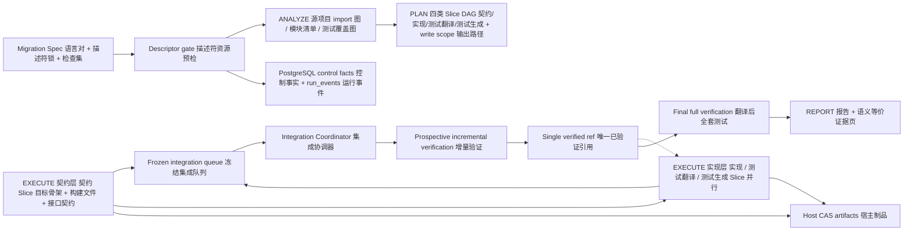
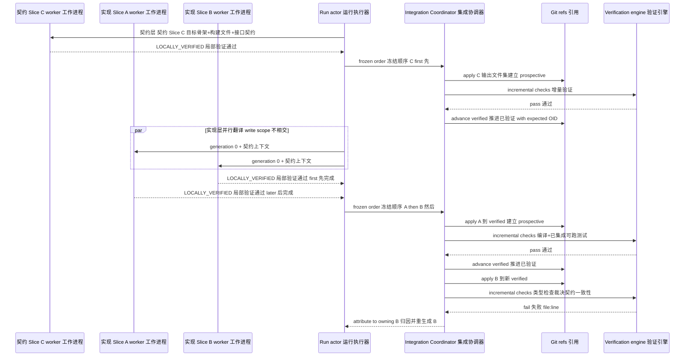
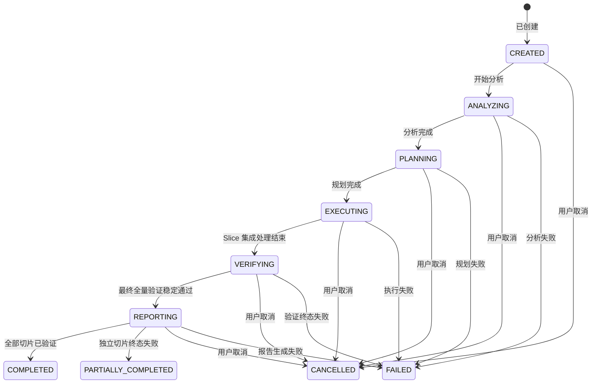

# CodeMigrator 设计原则、并行系统地图与公共契约

> 文档状态：V4 当前架构基线；本篇是跨模块公共类型、运行语义和协调边界的唯一 owner。  
> 技术范围：Python 3.12+ 单包 src-layout（uv 管理、import-linter 依赖契约）、单机 Docker Compose、双工具链描述符、Linux sandbox worker、PostgreSQL 控制面。  
> 部署基线：一个 `app`、一个独立 `sandbox-worker`、一个 PostgreSQL；MinIO 镜像与观测组件均为可选 profile。  
> 本轮边界：跨语言全量翻译、契约先行分层执行、测试移植主证与测试生成双轨、三层验证重定义；不定义语言 grammar 内容、检查 argv 明细或 HTTP DTO。  
> 关联文档：[工程边界与目录架构](CodeMigrator_核心目录架构设计.md)、[外部 API 与事件投影](CodeMigrator_系统后端架构.md)、[Run actor 与恢复](CodeMigrator_Harness总体设计.md)、[并行计划](CodeMigrator_迁移计划生成器.md)、[Git 真相](CodeMigrator_工作空间与Git集成.md)、[Web 体验与迁移可视化工作台](CodeMigrator_Web体验与可视化工作台.md)。

CodeMigrator 是跨语言代码迁移 Agent：源语言项目（如 TypeScript）是只读输入，产出是目标语言（如 Python）的全新项目——新构建文件、新目录结构与翻译后的测试套件。系统不锁死语言对；语言差异由源端与目标端两份声明式工具链描述符承担，新增语言对只需新增描述符资源，核心架构零改动。源仓库零写入，目标输出全部落在受 Git refs 管理的托管输出工作区。

核心矛盾不是"怎样并发调用更多模型"，而是怎样让多个翻译 Slice 并行推进、语义等价可验证、集成结果确定。V4 选择一条窄而明确的边界：契约 Slice 先产出目标项目骨架与模块接口契约；实现与测试翻译、测试生成 Slice 依契约在独立候选工作区并行生成，写路径限定在各自冻结的输出白名单；唯一 Integration Coordinator 按计划冻结的顺序以不相交文件集串行集成并做增量验证。并发提升吞吐，契约与翻译后测试套件保持语义等价可判定，排序与最终全量验证保持结果确定。

产品入口同样遵循这一边界：CLI 是创建、取消、服务管理、交付重试与自动化的主入口，并以精简过程视图持续呈现已提交的迁移事实；Web 是更完整的迁移汇流场，只能读取运行投影以及提交会话消息、问题回答和修正确认。两者共用 `app + sandbox-worker + PostgreSQL` 的 REST/SSE 投影，不各自嵌入迁移 engine，也不形成两套控制面；展示分层由 [M-15](CodeMigrator_Web体验与可视化工作台.md) 定义，会话输入与吸收边界由 [M-16](CodeMigrator_会话与运行时修正编排.md) 定义。

## 系统地图：契约先行，并行翻译，单线集成



| 事实或约束 | 唯一 owner | 直接消费者 |
|---|---|---|
| 公共 ID、Run/Slice 状态、候选代次、检查与工具策略 | 本篇 / `codemigrator.core` | M-02～M-16 |
| 子包清单重组、目录架构与本地 worker 协议归属 | [M-01](CodeMigrator_核心目录架构设计.md) | M-03、M-05、M-06、M-09、M-12 |
| REST、SSE、`run_events` 回放与外部状态投影 | [M-02](CodeMigrator_系统后端架构.md) | API 客户端 |
| Run actor、单 app 锁、dispatch 接管与启动恢复 | [M-03](CodeMigrator_Harness总体设计.md) | M-02、M-04、M-09、M-11 |
| Spec 语义（语言对、描述符锁、检查集、分解策略） | [M-05](CodeMigrator_Migration_Spec抽象层.md) | M-06、M-07、M-10 |
| 源端 import 图、模块清单与测试覆盖图 | [M-06](CodeMigrator_代码分析与AST引擎.md) | M-04、M-07、M-14 |
| 四类 Slice DAG、write scope 派生与冻结集成序 | [M-07](CodeMigrator_迁移计划生成器.md) | M-03、M-08、M-11 |
| 候选工作区生命周期、工具网关与 checkpoint commit | [M-08](CodeMigrator_候选工作区与工具网关.md) | M-10、M-11 |
| UDS worker、沙箱与执行回执 | [M-09](CodeMigrator_沙箱与执行环境.md) | M-03、M-10 |
| 三层验证、测试移植子系统与验证指纹 | [M-10](CodeMigrator_验证引擎.md) | M-03、M-08、M-11 |
| Git ref、expected-OID 事务与远端交付 | [M-11](CodeMigrator_工作空间与Git集成.md) | M-03、M-08、M-10 |
| Agent 工具箱、phase policy 与 hook | [M-12](CodeMigrator_工具系统与Hook.md) | M-04、M-08 |
| 核心八指标 descriptor | [M-13](CodeMigrator_可观测性系统.md) | 全部运行模块 |
| Web 页面、展示归约、视觉、交互与动画 | [M-15](CodeMigrator_Web体验与可视化工作台.md) | CLI/Web 产品入口与评审者 |
| 会话、AskUser、修正、PlanRevision 与模块变化账本 | [M-16](CodeMigrator_会话与运行时修正编排.md) | CLI、Web、Run actor 与迁移主链 |

### 推荐阅读路径

第一次评审先读本篇，再读 [M-01](CodeMigrator_核心目录架构设计.md) 与 [M-02](CodeMigrator_系统后端架构.md) 确认物理部署、CLI/Web 入口和外部投影；接着读 [M-16](CodeMigrator_会话与运行时修正编排.md) 理解只读源项目、会话与修正如何进入 Run，读 [M-15](CodeMigrator_Web体验与可视化工作台.md) 理解产品呈现。运行与上下文按 [M-03](CodeMigrator_Harness总体设计.md) → [M-04](CodeMigrator_Agent_Loop设计.md) → [M-14](CodeMigrator_记忆与上下文管理.md) 阅读。迁移主链按 [M-05](CodeMigrator_Migration_Spec抽象层.md) → [M-06](CodeMigrator_代码分析与AST引擎.md) → [M-07](CodeMigrator_迁移计划生成器.md) → [M-08](CodeMigrator_候选工作区与工具网关.md) → [M-09](CodeMigrator_沙箱与执行环境.md) → [M-10](CodeMigrator_验证引擎.md) 阅读，最后由 [M-11](CodeMigrator_工作空间与Git集成.md)、[M-12](CodeMigrator_工具系统与Hook.md)、[M-13](CodeMigrator_可观测性系统.md) 闭合副作用、安全和运行证据。

## 十条不变量：并发不能改变结果

| 编号 | 原则 | 可施工不变量 |
|---|---|---|
| P-01 | Agent 直写、Harness 编排 | EXECUTE 的 Agent 持 `ReadFile/WriteFile/EditFile/QuerySourceAst/Shell/Exec` 六工具（L1-L4 四层工具面，见 Phase 工具授权）在候选工作区直接写目标代码；三冻结不变式保持：工具集合冻结（六工具，无扩展注册；**扇出权 Harness 独占**——不设会话内派生子 agent 的工具，多会话并发一律由编排层三池模型承载）、授权冻结（phase policy 运行期不可放宽）、路径域冻结（write scope 随 Slice 派生冻结，越界返回 `WRITE_SCOPE_VIOLATION`）；write scope 防护双轨：结构化工具逐写路径门拦截 + `Shell` 路径 checkpoint 批量校验（提交时校验工作区 Git diff 全落冻结 write scope，越界拒绝提交且不污染 verified）；`Exec` 编排底层每次工具调用逐笔过网关；垂类价值沉淀在 Harness 编排层的分解、上下文、验证与集成闭环 |
| P-02 | 确定性 Oracle：测试移植为主证，裁决由冻结检查集独立做出 | 翻译后测试套件在目标项目通过是语义等价主证据，辅以描述符声明的编译/lint/类型检查；`CheckRunner` 退役后，裁决层 `InternalVerificationDispatch` 是唯一冻结通道（冻结检查集+tested_commit overlay→fingerprint 完整保持）；会话自检走 `Shell`（自由命令自由参数，长驻沙箱内执行），自检=反馈不裁决、不写 CheckResult、不进 fingerprint；`required_checks`、invocation hash、`CheckStatus` 与 Error UNKNOWN 共同派生判断，模型/worker 不得直接提交"验证通过"布尔；主证分移植测试主证与生成测试主证双档——生成测试（`SliceKind.TestGeneration`）证据力降一档并声明理解偏差风险；源侧守恒基线为零时守恒辅助归因不可用，模糊失败归因退化为 Run 级兜底 |
| P-03 | 契约先行翻译 DAG | Planner 冻结四类 Slice 依赖边（派生自源 import 图与测试覆盖图，语义消解以已确认理解档案为准——见信息分层原则）、write scope 与集成序；仅 DAG ready 且 write scope 互斥的 Slice 可并行。计划可复算口径：同冻结快照 + 同 Spec + 同已确认理解档案 → 同计划（分析层不要求逐字节可复算，以锚点可验证性与用户确认取代） |
| P-04 | 单写者控制面 | 一个 app 持有 PostgreSQL session advisory lock；每个 Run 由一个内存 actor 串行处理控制命令，worker 不连接 PostgreSQL |
| P-05 | 源码是数据不是指令 | Agent 可自由 `ReadFile` 源项目快照并用 `QuerySourceAst` 导航；源码正文不进入 system message；不设不可信投影机制 |
| P-06 | 五阶段、两模型档 | `ANALYZE/PLAN/EXECUTE/VERIFY/REPORT` 映射 `Reasoning/Reasoning/Code/—/—`——VERIFY 不开模型会话（裁决层独立执行），REPORT 无模型会话（报告正文由确定性模板从 verified facts 拼装，挡位收敛定案）；`ModelProfile` 仅 `{Reasoning, Code}` 两档（fb8 对齐：分析侧模型升为 Reasoning；理解会话本体在起草期深潜，见信息分层原则），映射在 Run 创建时冻结；EXECUTE 内部分契约层与实现层（拓扑层标注，依赖闭包就绪即启动，非全局屏障），RunStatus 状态机不变 |
| P-07 | 每 Slice 独立候选工作区 | 每个 Slice generation 拥有独立 candidate ref、候选工作区、上下文与 Artifact 命名空间；不存在 Run 级 `work` ref，候选不得直接发布到用户分支 |
| P-08 | 双工具链描述符 | 源端（语言 id、扩展名、tree-sitter 解析器、清单解析）与目标端（包管理器、构建/测试/lint/类型检查命令模板、工具链镜像摘要）均为声明式资源；Spec 锁定描述符版本与摘要，不设进程级语言扩展 |
| P-09 | 诊断归因到 Slice | 编译器/测试诊断（file:line 或测试名）经输出 write scope 与测试覆盖图归属 owning Slice，守恒信号（断言数/测试数对齐比离群，D-033）升级为归因第三信号维度，驱动 generation `0`~`2` 内定向重生成 |
| P-10 | 部分迁移有效 | 独立 Slice 终态失败时 Run 可投影 `PARTIALLY_COMPLETED`，已集成成果、验证证据与失败 Slice 证据均保留 |

核心不承诺同语言框架/版本/API 迁移支持，不承诺向源仓库写入任何文件。它不接受用户提供的 shell、命令行正文或 system prompt，不以未验证候选当作交付，不为水平扩展保留分布式周期协调，也不把 Redis、MinIO 或观测 profile 作为迁移成功前提。

## 物理边界与三类真相

核心子包清单由 [M-01](CodeMigrator_核心目录架构设计.md) 按 V4 重组后重新冻结，本篇不写死数字，只锁定两条边界：核心不依赖具体语言对与描述符内容；本地 worker 协议属于 `codemigrator.sandbox`。默认 Compose 只有 `app + sandbox-worker + PostgreSQL`：app 拥有 API、Run actor、计划与集成；worker 只通过宿主可访问的 Unix domain socket 接受类型化执行请求；bubblewrap 子进程看不到控制 socket，worker 也没有数据库凭据。源项目快照以只读挂载进入沙箱；目标输出是受 Git refs 管理的托管输出工作区，不是用户分支直写。

| 事实 | 保存位置 | 真相角色 | 留存或重建规则 |
|---|---|---|---|
| Run、Slice、candidate generation、active dispatch 集合、验证证据 | PostgreSQL | 控制面真相 | Run 终态后 30 天 |
| integration intent/receipt、API 幂等键、append-only `run_events` | PostgreSQL | 恢复与外部投影真相 | 与 Run ledger 同期限；状态和事件在同一事务写入 |
| 冻结输出基线、每 Slice candidate、integration scratch、唯一 verified | Git internal refs | 代码与集成真相 | 正式历史按仓库策略；失败/放弃证据 30 天 |
| 源快照内容、模型/工具日志、完整 stdout/stderr、报告正文 | host 只读 CAS + PostgreSQL 引用账本 | 大对象正文真相 | 非终态 Run 禁止 GC；终态后 30 天，孤儿宽限 24 小时 |
| 源端 AST 派生索引（import 图、测试覆盖图） | PostgreSQL | 可重建投影 | 7 天；按冻结 commit 重建 |
| 工具链描述符、Migration Spec 与最终报告索引 | PostgreSQL + CAS | 长期事实 | 显式删除前长期保留 |
| 候选工作区与一次性 validation overlay | 配额文件系统 | 编辑面与不可信执行面严格分离 | overlay 在单次 check 后销毁；候选工作区按 Slice 生命周期清理 |

SSE 不设置独立事件发件表或中继。Run 状态变化与对应 `run_events(run_id, sequence)` 在同一 PostgreSQL 事务提交；`LISTEN/NOTIFY` 只唤醒等待连接，通知丢失不影响客户端按序读取。Redis cache/wakeup profile 从实现矩阵删除；MinIO 只可镜像 CAS，观测 profile 只消费信号，均不能成为恢复真相。

纯文件系统是架构对照，不是可选择 backend。JSONL 足以承载单用户交互式 CLI，但当前服务同时需要 REST 幂等、自动续跑、条件取消、查询投影和 SSE 断点回放；若改用文件系统，项目必须自行实现跨进程文件锁、原子追加、损坏尾截断、二级索引和单调事件序列。V4 不把这些数据库能力重新实现一遍。

### PSF：源侧结构事实的三层公共契约

源侧结构事实以 PSF（Project Structure Foundation）三层模型组织：

| 层 | 内容 | 派生方式 |
|---|---|---|
| PSF-1 语法森林 | 逐文件不可变 AST（grammar 描述符锁定，进程内 LRU） | tree-sitter 确定性解析 |
| PSF-2 项目索引（新增一等结构） | SymbolBinding（定义点 file:range+符号类别+签名摘要）与 ReferenceSite（引用点，经 import 边解析归属）双向索引 | 由 F1+F2 确定性派生、纯代码路径 |
| PSF-3 关系图 | 模块级复合图（import 边/覆盖边/包含边） | F2/F3 整合命名 |

消费方：Planner（Requires 派生）、漂移计算（依赖闭包）、集成序冻结；机械层产物确定性派生（完备性引擎口径，见信息分层原则）；PSF-2 是 PSF-3 的细化层而非替代；详细设计 owner 为 [M-06](CodeMigrator_代码分析与AST引擎.md)。

### 信息分层原则：机械完备 × 语义消解 × 用户终审（fb8 对齐）

源侧信息分三层生产与确认，各层职责与信任来源不同：

| 层 | 生产者 | 职责 | 信任来源 |
|---|---|---|---|
| 机械完备层 | tree-sitter/清单解析（M-06 确定性管线，ANALYZE 阶段执行） | **枚举完备性**：文件清单、import 候选全集、位置身份（file:range）——候选集宁多勿漏；不做语义判断 | 确定性代码路径 + 可证伪验收 |
| 语义消解层 | Reasoning 理解会话＝Spec 起草会话深潜阶段（产制点归一起草期，M-16/M-04） | 在完备候选集上**定向探索并消解**：语义模块划分、Unknown/动态依赖判定（带置信理由）、测试地图、迁移风险热点——产出一等公民工件《项目理解档案》UnderstandingDossier，全条目 file:range 锚点必填 + 探索覆盖率自述 | 锚点可验证 + 预算档约束 |
| 用户确认门 | Spec 起草会话一并审阅拍板 | 档案随 Spec 草稿经用户多轮审阅、显式确认后**哈希冻结为 Run 输入**——语义模块划分由用户最终定夺 | 人工终审 |

产制点归一：理解会话本体＝起草会话的深潜阶段，《项目理解档案》在 CreateRun 时作为三件冻结输入之一已齐备（P-03 口径）；ANALYZE 阶段＝机械完备层管线执行＋消费已冻结档案做一致性校验，不再承担语义消解产出。

计划派生（PLAN/Planner）保持机械确定性：从「快照+Spec+已确认档案」三件冻结输入确定性派生 DAG——同输入必同计划（P-03 口径）。Oracle（P-02）不受影响。模型智能经由"理解档案+用户确认"这一正门进入规划，不再是无消费路径的旁路建议。执行继承：各 Slice Context Pack 注入档案相关摘录（框架惯用法/风险提示/依赖叙事），降低盲探轮次与决策成本（M-04/M-14）。

### 迁移规则手册：跨 Slice 知识的受控传播

《迁移规则手册》MigrationRulebook 是与理解档案并列的第二份起草会话工件（初版与 Spec/档案一并确认冻结），承载"这类代码该怎么迁"的可执行约定。其运行中演进语义（fb8 续对齐，Anthropic 迁移实践吸收）：定向重生成的归因诊断揭示**系统性**误译模式时，owning 会话可附《规则条目提案》——Harness 将其记入 `run_events` 审计并即时生效于**后续派发**会话的 Context Pack（规则是知识不是计划事实，追加不触发 PlanRevision）；已集成成果零追溯，需要波及修正时走既有漂移/补偿通道。每个会话 pack 记录其消费的规则书版本号，传播链可观测。设计信条与本库同源："你不修补违背规则的代码，你修规则并再生受影响批次"。

## 单 app、Run actor 与 worker 接管

app 启动时在专用长连接上获取 PostgreSQL session advisory lock。第二个 app 可以启动进程，但 readiness 必须失败且不得接收迁移 API；持锁连接丢失时，当前 app 立即关闭 readiness、拒绝新命令、要求 worker 终止活动进程组并退出，由 Compose 负责重启。此锁只证明"当前只有一个控制面写者"，不流入每个任务，也不成为任务代次令牌。

每个非终态 Run 恢复为一个内存 actor。API 命令、worker 回执、模型结果、集成完成和预算事件都进入该 actor 的有序邮箱；状态转换、Slice 调度、集成和终态归约只由 actor 发起。数据库 `version` 服务于 API 投影与 `If-Match`，不作为内部每一步的通用乐观锁。actor 的数据库事务仍使用主键、外键和幂等唯一约束防止崩溃重放产生重复事实。

每次向 worker 的物理派发都有新的 `DispatchAttemptId`。Run actor 维护 active dispatch 集合，键为 `run_id + ExecutionSubject identity + CheckId`；不同 Slice、验证层或 check 可以并行，每个键只允许一个 active attempt。接收结果必须同时匹配 attempt、subject、check_id 与 `tested_commit_oid`；任一不匹配都只追加迟到审计，不生成 `CheckResult`，不推进 candidate 或 verified。app 与 worker 断开后，worker 终止全部沙箱进程组；5 秒内无法清空时自行退出。worker 断开后，app 将全部受影响 active entries 标为 `INTERRUPTED`，只要 Run 未取消且 subject 仍有效，就为每个键创建新 attempt。

物理重派范畴显式包含模型基础设施故障（provider 5xx/超时/断流）：会话级模型调用失败按物理重派处理——同代重派不消耗 generation，按 30s/60s/120s 逐次退避重派，每次中断以 `dispatch.interrupted` 审计事件记入 run_events（MVP 已实战验证的语义在此追认成文；actor 侧执行见 M-03）。

每次检查执行都从 `tested_commit_oid` 创建独立一次性 validation overlay。候选工作区、integration scratch 和 verified ref 绝不挂载给不可信进程；worker 只获得 overlay grant，构建输出、生成文件和测试副作用只能污染该 overlay。单次 check 完成、取消或断连后销毁 overlay；重派使用同一 tested commit 建立全新 overlay，因此旧进程即使迟到也只能写旧 overlay。源项目快照与依赖 cache 只能以只读挂载进入。

| 竞争边界 | 保留的保护 | 明确删除的泛化机制 |
|---|---|---|
| app 单实例 | PostgreSQL session advisory lock | 多实例选主、周期续权 |
| 外部取消 | API `If-Match` + actor 持久化 `cancel_requested` | 对所有内部状态写执行 expected-state CAS |
| worker 迟到结果 | active `DispatchAttemptId + ExecutionSubject + CheckId + tested_commit_oid` 等值检查 | 全链路任务代次令牌 |
| Git ref 推进 | expected old OID | 数据库行版本替代 Git 竞争判断 |
| API、事件、集成重放 | 数据库唯一约束 | 独立事件中继与常驻轮询恢复器 |

## 公共契约：身份、代次和状态只有一个定义

下列声明位于 `codemigrator.core` 子包。所有 `RunId/SpecId/SliceId/TaskId/CheckId/ReceiptId/RequestId/DispatchAttemptId` 都是 UUID v7 NewType：JSON 使用小写连字符字符串，SQL 使用 `UUID`。`CandidateGeneration` 是受验证的 `int` NewType，只允许 `0`~`2`；`0` 是初始候选，`1` 与 `2` 是基于最新 verified 的两次语义重生成，物理重派不会增加 generation。

```python
BranchPrefix = NewType("BranchPrefix", str)


class ArtifactRef(BaseModel):
    sha256: Sha256
    size: int
    media_type: str


CandidateGeneration = NewType("CandidateGeneration", int)  # 受验证：只允许 0、1、2
DispatchAttemptId = NewType("DispatchAttemptId", uuid.UUID)
DeterministicPlanOrderKey = NewType("DeterministicPlanOrderKey", Sha256)
SessionId = NewType("SessionId", uuid.UUID)
MessageId = NewType("MessageId", uuid.UUID)
QuestionId = NewType("QuestionId", uuid.UUID)
TaskDraftRevisionId = NewType("TaskDraftRevisionId", uuid.UUID)
CorrectionIntentId = NewType("CorrectionIntentId", uuid.UUID)
PlanRevisionId = NewType("PlanRevisionId", uuid.UUID)
ProjectId = NewType("ProjectId", uuid.UUID)
ProjectSnapshotId = NewType("ProjectSnapshotId", uuid.UUID)
OutputWorkspaceId = NewType("OutputWorkspaceId", uuid.UUID)
ProjectModuleId = NewType("ProjectModuleId", uuid.UUID)


class MigrationSessionStatus(str, Enum):
    Drafting = "Drafting"
    ReadyToConfirm = "ReadyToConfirm"
    AttachedToRun = "AttachedToRun"
    Closed = "Closed"


# InteractionStatus 辨析收敛：PausingForInput＝正在排空至安全点的瞬态（在途原子操作计数由 Run 投影表达）；WaitingForUser＝已抵达安全点、等待用户输入的稳态。
class InteractionStatus(str, Enum):
    Ready = "Ready"
    PausingForInput = "PausingForInput"
    WaitingForUser = "WaitingForUser"
    ApplyingCorrection = "ApplyingCorrection"


# CorrectionIntentStatus 收敛（九→七）：Classifying 归入 Received（分类为 actor 即时行为，非持久态）；Superseded 并入 lineage/Attempt History 记录（非意图状态）；DeferredToFollowUp 保留为显式挂起终态。
class CorrectionIntentStatus(str, Enum):
    Received = "Received"
    NeedsClarification = "NeedsClarification"
    NeedsConfirmation = "NeedsConfirmation"
    Accepted = "Accepted"
    Applied = "Applied"
    DeferredToFollowUp = "DeferredToFollowUp"
    Rejected = "Rejected"


class SliceKind(str, Enum):
    Contract = "CONTRACT"
    Implementation = "IMPLEMENTATION"
    TestTranslation = "TEST_TRANSLATION"
    TestGeneration = "TEST_GENERATION"


class ArtifactKind(str, Enum):
    GeneratedCode = "GENERATED_CODE"
    DeclarativeConfig = "DECLARATIVE_CONFIG"
    ResourceFile = "RESOURCE_FILE"


# 《项目理解档案》：起草会话深潜阶段（理解会话本体）产出、用户确认后冻结为 Run 输入的一等公民工件。
# 全部条目必带 file:range 锚点（CodeAnchor），不可锚定的叙述显式标记 advisory。
class UnderstandingDossier(BaseModel):
    architecture_narrative: list[DossierEntry]        # 架构叙事与分层
    semantic_modules: list[DossierEntry]              # 语义模块划分建议（成员文件清单，可修正目录约定）
    dependency_resolutions: list[DossierEntry]        # 对机械候选边/Unknown 的判定：真实依赖/误报/隐式依赖 + 置信理由
    test_map: list[DossierEntry]                      # 测试地图（测试组织与覆盖叙事）
    risk_hotspots: list[DossierEntry]                 # 迁移风险热点（动态 import/反射/全局态等）
    strategy_advice: list[DossierEntry]               # 迁移策略建议（批次/顺序/框架惯用法）
    coverage_self_report: CoverageSelfReport          # 探索覆盖率自述（触达目录/文件清单 + 未读区声明）
    budget_tier: DossierBudgetTier


class DossierEntry(BaseModel):
    kind: DossierEntryKind
    content: str                 # 叙述正文
    anchors: list[CodeAnchor]    # file:range 锚点；advisory 条目可为空但须标注
    advisory: bool               # 无锚点的纯建议性条目


class DossierBudgetTier(str, Enum):
    Shallow = "Shallow"
    Deep = "Deep"


# 《迁移规则手册》：起草会话产出并经用户确认冻结；Run 内经受控追加通道演进。
# 规则是知识不是计划事实——追加不触发 PlanRevision，生效面=后续派发的会话。
class MigrationRulebook(BaseModel):
    entries: list[RulebookEntry]
    version: int                 # 随受控追加递增；每个会话 pack 记录其消费的版本号


class RulebookEntry(BaseModel):
    kind: RulebookEntryKind      # 惯用法映射/命名约定/错误处理模式/框架 idiom 等
    content: str
    source: RuleEntrySource      # DraftingSession（初版，用户确认）| AttributionProposal（归因驱动追加）
    rationale_ref: ArtifactRef | None   # 追加条目必填：指向归因诊断审计事实
    advisory: bool


class SliceAttemptStatus(str, Enum):
    Ready = "READY"
    Running = "RUNNING"
    LocalVerifying = "LOCAL_VERIFYING"
    LocallyVerified = "LOCALLY_VERIFIED"
    IntegrationQueued = "INTEGRATION_QUEUED"
    Integrating = "INTEGRATING"
    Regenerating = "REGENERATING"
    Integrated = "INTEGRATED"
    TerminalFailed = "TERMINAL_FAILED"
    Cancelled = "CANCELLED"


class WriteScopeOut(BaseModel):
    write_paths: list[RepoRelativePath]   # 枚举文件集：修改与新建权
    create_roots: list[RepoRelativePath]  # 目标模块目录集合：仅新建权


# RepositoryExclusive 已废除（D-033）：scaffold 归 Harness 基线初始化，无 Slice 使用者
class WriteScope(BaseModel):
    out: WriteScopeOut


class MigrationSlice(BaseModel):
    id: SliceId
    kind: SliceKind
    source_modules: list[ProjectModuleId]
    write_scope: WriteScope
    required_checks: list[RequiredCheck]
    topological_layer: int
    deterministic_plan_order_key: DeterministicPlanOrderKey


class PlanEdgeKind(str, Enum):
    Requires = "REQUIRES"
    OrderedBefore = "ORDERED_BEFORE"


class PlanEdge(BaseModel):
    model_config = ConfigDict(populate_by_name=True)

    from_: SliceId = Field(alias="from")   # JSON 字段名为 from（Python 保留字）
    to: SliceId
    kind: PlanEdgeKind


class SliceCandidate(BaseModel):
    run_id: RunId
    slice_id: SliceId
    generation: CandidateGeneration
    base_verified_oid: GitOid
    candidate_commit_oid: GitOid


class ActiveDispatch(BaseModel):
    dispatch_attempt_id: DispatchAttemptId
    subject: ExecutionSubject
    check_id: CheckId
    tested_commit_oid: GitOid


class GitRunRefs(BaseModel):
    base_commit_oid: GitOid
    verified_commit_oid: GitOid


class CreateRun(BaseModel):
    source: CreateRunSource
    branch_prefix: BranchPrefix


class RemoteRepository(BaseModel):
    repository_url: RepositoryUrl
    base_ref: GitRefName


class RegisteredProject(BaseModel):
    project_id: ProjectId
    snapshot_id: ProjectSnapshotId


CreateRunSource: TypeAlias = RemoteRepository | RegisteredProject


class RunStatus(str, Enum):
    Created = "CREATED"
    Analyzing = "ANALYZING"
    Planning = "PLANNING"
    Executing = "EXECUTING"
    Verifying = "VERIFYING"
    Reporting = "REPORTING"
    Completed = "COMPLETED"
    PartiallyCompleted = "PARTIALLY_COMPLETED"
    Failed = "FAILED"
    Cancelled = "CANCELLED"


class FailureReason(str, Enum):
    AnalysisFailed = "ANALYSIS_FAILED"
    PlanFailed = "PLAN_FAILED"
    ExecutionFailed = "EXECUTION_FAILED"
    VerificationTerminal = "VERIFICATION_TERMINAL"
    ReportGenerationFailed = "REPORT_GENERATION_FAILED"
    BudgetExhausted = "BUDGET_EXHAUSTED"
    ResourceExhausted = "RESOURCE_EXHAUSTED"
    OutputLimitExceeded = "OUTPUT_LIMIT_EXCEEDED"
    SliceRegenerationExhausted = "SLICE_REGENERATION_EXHAUSTED"
    NondeterministicVerification = "NONDETERMINISTIC_VERIFICATION"


class DeliveryChannelStatus(str, Enum):  # 统一交付通道状态（报告/代码两通道共用；Generating 仅报告通道使用）
    Pending = "PENDING"
    Generating = "GENERATING"
    Ready = "READY"
    DeliveryFailed = "DELIVERY_FAILED"


class ModelProfile(str, Enum):  # 挡位收敛：Fast 档删除——VERIFY 不开模型会话、REPORT 确定性模板拼装正文
    Reasoning = "REASONING"
    Code = "CODE"


class Phase(str, Enum):
    Analyze = "ANALYZE"
    Plan = "PLAN"
    Execute = "EXECUTE"
    Verify = "VERIFY"
    Report = "REPORT"
```

枚举表同步义务（验收）：状态机正文语义发生任何变更时，必须在同一变更集内同步本篇枚举表与对应状态转移图，并声明受影响转移的幂等性——正文与枚举表/转移图漂移视为契约缺陷，同变更集不同步的变更不予合入。

`MigrationSlice.write_scope` 由 Planner 从分析产物与描述符派生，Spec 与模型都不能提交或覆盖它。实现 Slice 的 `write_paths` 默认等于其源模块映射的目标模块文件路径集合，`create_roots` 默认等于组内源模块映射的目标包目录；契约 Slice 的 `write_paths` 默认等于目标构建文件与契约文件路径集合，`create_roots` 默认为空或构建文件目录（其产出本就固定枚举）；测试翻译与测试生成 Slice 的 `write_paths` 默认等于目标测试文件路径集合，`create_roots` 默认等于目标测试目录。描述符可为本语言对声明固定辅助路径，Planner 只能把这些预先声明的路径追加进对应集合。路径去重后按 UTF-8 原始字节升序保存；运行期不允许扩大任一集合。

互斥不变式：不同 Slice 的 `write_paths` 两两不相交。`create_roots` 只授予新建权——新建路径须位于本 Slice 某 create_root 之下，且不得命中任何其他 Slice 的冻结集合（`write_paths` 或 `create_roots` 派生路径）；网关对全计划冻结 scope 表可判定，越界返回 `WRITE_SCOPE_VIOLATION`。`create_roots` 与其他 Slice 的 `write_paths`/`create_roots` 重叠时，由 [M-07](CodeMigrator_迁移计划生成器.md) 追加确定性 `OrderedBefore` 边。

`SliceId` 继续是 UUIDv7 身份，用于引用、外键、API 投影和单个冻结 plan 内的最终集成 tie-break。`deterministic_plan_order_key` 由 canonical SliceKind、source_modules、规范输出路径集合、描述符摘要与 snapshot OID 的 canonical bytes 计算 SHA-256；写冲突定向排序使用该 key，避免 UUID 分配时机改变计划图。`topological_layer` 在最终 DAG 上定义为最长前驱路径长度：无前驱源点为 `0`，其他节点为 `1 + max(predecessor.layer)`。相同 plan 一经持久化，SliceId 与集成键均被冻结；本轮不承诺不同 Run 对同一输入分配相同 UUID。

`PlanEdge` 方向语义保持：`A requires B` 规范化为 `from=B,to=A`，B 集成后 A 才可进入 ready。Requires 边派生自源 import 图与测试覆盖图——实现 Slice requires 其依赖模块的契约 Slice，测试翻译/测试生成 Slice requires 其覆盖模块的契约 Slice（前驱为契约而非实现：翻译与实现并行，测试执行由 M-10 在场门控保序 [V-M10-V4-027]，不加新边）；OrderedBefore 只施加顺序。自环和两类边合并后的任意有向环都在持久化前返回 `PLAN_CYCLE`。契约 Slice 依 Requires 边天然处于低拓扑层、测试翻译/测试生成 Slice 处于高层，层次序由 DAG 表达，`SliceAttemptStatus` 不为分层扩状态。

`SliceKind.TestGeneration` 承载"测试生成"语义：源模块无测试时，Planner 为其派生测试生成 Slice，以源模块代码语义+契约签名为锚点生成目标语言测试——行为锚定源语义而非凭空编写。GENERATED 标注全链路语义：测试生成 Slice 的产出文件、CheckResult receipt、验证 fingerprint 与 REPORT 证据页全部显式标注 GENERATED，与移植测试严格区分。等价信心分级双档：移植测试主证（源有测试）与生成测试主证（源无测试）——后者证据力降一档，并在证据页声明理解偏差风险：生成测试验证的是"翻译后代码自洽且符合源语义的 Agent 理解"。移植测试定满档主证的依据：源测试套件在源项目上真实运行通过是 ANALYZE 守恒基线可核验的历史事实（D-033），其断言语义漂移失真由守恒辅证与失败归因覆盖。两档共同的证明边界——通过路径共谋盲区：实现与测试同源产出（同一 Agent 会话链）时，对源语义的同一误解可能同时传导至二者并一致通过验证，系统对此零信号；该盲区属主证证明范围之外，现有缓解仅有人工抽检与后续 Run 迭代（M-10 边界声明同步披露）。

工件分类公共契约：`ArtifactKind` 区分三类工件并绑定处理策略。生成代码（如 `.pb.go`）：不翻译，目标侧从源头（`.proto`）用目标工具链重新生成（grpcio-tools 类命令入目标端描述符 scaffold 档），`.proto` 作为接口事实源被契约层消费。声明式基础设施配置（docker-compose/Makefile/config.yaml）：由契约层 Slice 翻译目标侧等价物，归入契约 Slice write scope 派生。资源文件（SQL schema/静态资源）：按描述符 mapping 复制/轻转换，不入翻译 Slice。生成代码的通用降级阶梯（机制层规则，任何语言对实例化）：目标生态存在等价 codegen 时走 scaffold 档从源头重新生成；无等价 codegen 时，源 DSL 工件作为**接口事实源归入契约波**，由契约 Slice Agent 翻译为目标语言惯用等价物——按声明式配置类对待，不适用 GENERATED 标注（翻译件而非生成件）。工件分类规则由描述符声明，保持"语言差异=数据"不变式；三类工件的 Slice 派生归属 [M-07](CodeMigrator_迁移计划生成器.md)、执行侧 [M-08](CodeMigrator_候选工作区与工具网关.md)、识别 [M-06](CodeMigrator_代码分析与AST引擎.md)。模块边界策略与依赖副产物排除集同为描述符声明项：`module_boundary_strategy` 三档由源端声明、M-06 消费划界；`build_excludes` 由目标端声明，checkpoint diff 校验与 candidate commit 提交面均予排除（M-08/M-09）。

`BranchPrefix` 只接受 1～32 字节 ASCII 小写字母、数字、`-`、`/`，拒绝空段、`.`、`..` 与 `.git`。CreateRun 的外部字段继续固定为 `repository_url/base_ref/branch_prefix`，不存在 `target_branch`。能力门在 Run 创建前预检 Spec 声明的双工具链描述符、tree-sitter grammar 与工具链镜像摘要，任一缺失或摘要不匹配时 CreateRun 零副作用拒绝。工具箱调用协议与 frame 规则由 M-01/M-12 所有，本篇不复制。

EXECUTE 的 Agent 在本 Slice 候选工作区内用 `WriteFile/EditFile` 自由迭代，Harness 编排层不逐键介入文件内容；Agent 可经 `Shell` 在长驻沙箱内自由执行构建/依赖/探索/自检（自检=反馈不裁决，不写 CheckResult、不进 fingerprint）。Agent 完成自检后，Harness 编排层把工作区文件集提交为 checkpoint commit——提交时执行 `Shell` 路径 checkpoint 批量校验：工作区 Git diff 必须全落本 Slice 冻结 write scope，越界拒绝提交且不污染 verified——并以 expected old OID 推进同 generation 的 candidate ref；下一次 checkpoint 在新 OID 上进行。checkpoint 幂等键覆盖 `run_id/slice_id/generation/candidate_commit_oid/checkpoint 内容摘要`，generation 或 candidate OID 变化时必须生成新键。重生成从最新 verified 重新运行完整候选流程。

```python
class TreeSitterGrammarRef(BaseModel):
    grammar_id: str
    grammar_sha256: Sha256


class ManifestParserRef(BaseModel):
    manifest_kind: str
    parser_id: str


class SourceToolchain(BaseModel):
    language_id: LanguageId
    extensions: list[str]
    parser: TreeSitterGrammarRef
    manifest_parsers: list[ManifestParserRef]
    module_boundary_strategy: ModuleBoundaryStrategy


class ModuleBoundaryStrategy(str, Enum):
    ManifestPerModule = "MANIFEST_PER_MODULE"                  # 每清单一个模块（npm workspace 型）
    SingleManifestDirectoryConvention = "SINGLE_MANIFEST_DIRECTORY_CONVENTION"  # 单清单 + 目录约定划界（go.mod 型）
    DirectoryConvention = "DIRECTORY_CONVENTION"               # 无清单：纯目录约定


class TargetToolchain(BaseModel):
    language_id: LanguageId
    package_manager: str
    scaffold: list[CheckCommandTemplate]
    build: list[CheckCommandTemplate]
    test: list[CheckCommandTemplate]
    lint: list[CheckCommandTemplate]
    typecheck: list[CheckCommandTemplate]
    toolchain_image_digest: str
    build_excludes: list[RepoRelativePath]  # 依赖副产物规范排除集：不计入 checkpoint diff 校验、不进 candidate commit


class ToolchainDescriptor(BaseModel):
    descriptor_version: semver.Version
    descriptor_sha256: Sha256
    source: SourceToolchain
    target: TargetToolchain


class CheckAction(str, Enum):
    Scaffold = "SCAFFOLD"
    Compile = "COMPILE"
    Test = "TEST"
    Lint = "LINT"
    TypeCheck = "TYPE_CHECK"


class CheckCommandTemplate(BaseModel):
    action: CheckAction
    program: str
    argv: list[str]
    timeout_secs: int


class RequiredCheck(BaseModel):
    id: CheckId
    action: CheckAction
    template_sha256: Sha256


class ContractArtifact(BaseModel):
    module_id: ProjectModuleId
    target_module_path: RepoRelativePath
    public_signatures: list[str]
    types_hash: Sha256


class DiagnosticSeverity(str, Enum):
    Error = "Error"
    Warning = "Warning"


class FileLine(BaseModel):
    kind: Literal["FILE_LINE"]
    file_path: RepoRelativePath
    line: int


class TestIdentity(BaseModel):
    kind: Literal["TEST_IDENTITY"]
    test_name: str


class Unknown(BaseModel):
    kind: Literal["UNKNOWN"]


DiagnosticTarget: TypeAlias = Annotated[FileLine | TestIdentity | Unknown, Field(discriminator="kind")]


class DiagnosticMapping(BaseModel):
    severity: DiagnosticSeverity
    target: DiagnosticTarget
    code: str
    message_hash: Sha256


class CheckStatus(str, Enum):
    Passed = "PASSED"
    Failed = "FAILED"
    TimedOut = "TIMED_OUT"
    OutputLimitExceeded = "OUTPUT_LIMIT_EXCEEDED"
    InfrastructureError = "INFRASTRUCTURE_ERROR"


class CheckResult(BaseModel):
    check_id: CheckId
    invocation_hash: Sha256
    status: CheckStatus
    receipt_id: ReceiptId
    stdout: ArtifactRef
    stderr: ArtifactRef
    diagnostics: list[DiagnosticMapping]


class LocalCandidate(BaseModel):
    kind: Literal["LOCAL_CANDIDATE"]
    slice_id: SliceId
    generation: CandidateGeneration
    candidate_commit_oid: GitOid


class ProspectiveIntegration(BaseModel):
    kind: Literal["PROSPECTIVE_INTEGRATION"]
    slice_id: SliceId
    generation: CandidateGeneration
    expected_verified_oid: GitOid
    prospective_commit_oid: GitOid


class FinalVerified(BaseModel):
    kind: Literal["FINAL_VERIFIED"]
    verified_commit_oid: GitOid


VerificationSubject: TypeAlias = Annotated[
    LocalCandidate | ProspectiveIntegration | FinalVerified,
    Field(discriminator="kind"),
]

ExecutionSubject: TypeAlias = VerificationSubject


class VerificationOutcome(BaseModel):
    run_id: RunId
    subject: VerificationSubject
    tested_commit_oid: GitOid
    frozen_required_checks_sha256: Sha256
    check_results: list[CheckResult]
    verification_fingerprint: Sha256


class DerivedVerificationGuard(BaseModel):
    all_required_checks_passed: bool
    error_unknown_count: int


class IntegrationIntent(BaseModel):
    run_id: RunId
    slice_id: SliceId
    generation: CandidateGeneration
    expected_verified_oid: GitOid
    prospective_commit_oid: GitOid
    guard_sha256: Sha256
    verification_fingerprint: Sha256
    idempotency_key: Sha256
```

### 描述符定位：确定性差异声明载体与三层能力阶梯

描述符是"确定性差异声明载体"，服务两个结构性不可替代位置：分析确定性（grammar/清单解析器/约定→F1-F4 事实）与裁决冻结（命令模板→`InternalVerificationDispatch` 冻结检查集，P-02 验证可复算前提）。三层能力阶梯：裁决面=描述符最小声明集；能力面=`Shell`+`Exec` 语言无关承载；演进面=schema 版本化+text-fallback 兜底。动态边界三档：纯数据动态（新语言对零代码）、注册表扩展（新清单格式，Python 代码少见路径）、text-fallback 兜底（任何语言）。`CheckRunner` 退役后，描述符命令面的模型侧消费者清零，唯一消费者为 Harness 内部验证；"数据不回退为代码插件"边界不变。

检查命令只有一个来源：目标端工具链描述符冻结的 `CheckCommandTemplate`。Harness 内部验证（裁决层 `InternalVerificationDispatch`）是该命令面的唯一消费者——`CheckRunner` 已退役，模型侧不再共用这一命令面——由 Harness 以冻结参数实例化模板；模型不得提交自由 program、argv 或 shell 片段，命令面之外的执行请求被拒绝且零执行。模板显式携带 `timeout_secs`，默认档 Scaffold/Compile/Lint/TypeCheck 300 秒、Test 120 秒、模型工具调用 60 秒；stdout 和 stderr 每流 256 MiB，单输出文件 64 MiB。Error 级 UNKNOWN 容忍数为 0。

`ContractArtifact` 是契约 Slice 的正式产物：模块 id、目标模块路径、公开签名清单与 types_hash。它随契约 Slice 集成进入 verified，并作为后续实现与测试翻译 Slice 的冻结上下文输入；集成层类型检查以公开签名裁决实现与契约的一致性，不一致的诊断归属实现 Slice 的 owning 方。

`DiagnosticTarget` 只携带 `file:line` 或测试名身份。归因规则：编译器诊断按文件路径匹配各 Slice 冻结 write scope，命中唯一 Slice 即归属该 Slice；测试失败先按测试文件路径命中测试翻译/测试生成 Slice，再结合被测模块依赖图判断失败源于翻译/生成后的测试本身还是被测实现 Slice。失败证据模糊（超时/OOM/栈不清晰）且守恒离群（断言数/测试数对齐比离群）时，优先怀疑测试翻译 Slice 并定向重生成；模糊且无离群时，优先怀疑实现 Slice；仍无法判定时进入 Run 级终态兜底——守恒信号（D-033 已有计算）由此升级为归因第三信号维度。归属结果以 `TEST_FAILURE_ATTRIBUTED` 类事件记录，驱动 generation 余额内定向重生成。

`VerificationSubject` 是判别联合：局部结果只能携带 Slice/generation/candidate OID，集成结果必须携带 Slice/generation/expected verified 与 prospective scratch OID，最终结果只携带冻结 verified OID；schema 对 variant 外字段执行 `extra="forbid"`。worker protocol 以 `ExecutionSubject` 类型别名直接复用这一判别联合，不另造弱化身份。`tested_commit_oid` 必须等于 subject 的 candidate、prospective scratch 或 verified OID。active dispatch 的唯一键为 `run_id + canonical(subject identity) + check_id`；一个 Run 可同时拥有多个键，每个键恰有一个 active `DispatchAttemptId`，返回还必须回显相等的 `tested_commit_oid`。

`frozen_required_checks_sha256` 引用执行前冻结的 canonical check 集合。`verification_fingerprint` 只覆盖 `canonical(tested_commit_oid, frozen_required_checks_sha256, semantic_results)`；`semantic_results` 按 `CheckId` 原始字节升序，每项只含 `check_id/invocation_hash/status/diagnostic_semantic_hash`，其中 diagnostic semantic hash 由规范化的 severity、stable diagnostic code、target 身份（file:line、测试名或 UNKNOWN）、message semantic hash 排序派生。它明确不含 subject、run/slice/generation、receipt、stdout/stderr ArtifactRef、日志字节、执行时间、worker 或 attempt 身份，避免证据载体差异伪装成检查不确定性。

证据防替换由完整 outcome 落库承载：`CheckResult[]` 连同 receipt、stdout/stderr ArtifactRef 与 diagnostics 全量持久化于控制面账本，引用完整性由既有审计链保证；如实现期需要额外的证据身份派生值，属实现细节而非公共契约，不参与任何判定（NONDETERMINISM 判定只依赖 `verification_fingerprint`）。fingerprint 由 Harness 编排层派生，不接受 worker、模型或调用方自定义值。

| 稳定错误码 | 触发条件 | 必须为零的副作用 |
|---|---|---|
| `WRITE_SCOPE_VIOLATION` | WriteFile/EditFile 的规范路径不属于本 Slice 冻结 write scope | 文件写入、candidate ref 推进、checkpoint receipt |
| `SLICE_REGENERATION_EXHAUSTED` | generation `2` 的完整候选流程仍不能集成 | generation `3`、强制 verified 推进 |
| `NONDETERMINISTIC_VERIFICATION` | `FinalVerified` 与最近同 tested commit OID 的 `ProspectiveIntegration` 使用相同冻结检查集却得到不同 `verification_fingerprint`（判定只依赖 fingerprint，证据载体差异不参与） | 代码重生成、verified 改写 |
| `STALE_DISPATCH_RESULT` | attempt、subject、check_id 或 tested commit OID 不再是对应 active key 的当前值 | CheckResult、candidate/verified 推进 |

## Git ref 与候选工作区：隔离候选，不复制主线

所有内部 ref 必须解析为 commit OID。唯一可交付主线是 `verified`；每个 candidate generation 从创建时读取的最新 verified OID 分叉，拥有独立候选工作区。candidate 的局部通过只改变 Slice 投影，不得推进 verified。

| 用途 | ref 形状 | 生命周期与推进规则 |
|---|---|---|
| 冻结输出基线 | `refs/codemigrator/runs/<run_id>/base` | Run 创建时初始化的输出仓库基线，此后不可变 |
| 唯一已验证主线 | `refs/codemigrator/runs/<run_id>/verified` | 仅 Integration Coordinator 以 expected old OID 推进 |
| Slice 候选 | `refs/codemigrator/runs/<run_id>/slices/<slice_id>/candidates/<generation>` | 每 checkpoint 以 expected candidate OID 推进；集成 receipt 后删除 |
| 集成暂存 | `refs/codemigrator/runs/<run_id>/integration/<slice_id>/<generation>` | prospective checks 期间存在；receipt 后删除 |
| 失败证据 | `refs/codemigrator/failed/<run_id>/<slice_id>/<generation>` | generation 终态失败后保留 30 天 |
| 取消证据 | `refs/codemigrator/abandoned/<run_id>/<slice_id>/<generation>` | 取消时保留未验证候选 30 天 |

Git expected-OID CAS 只保护 candidate、integration scratch 和 verified ref 推进，解决崩溃重放、意外 ref 改动与重复集成。集成动作是把队首 Slice checkpoint 的输出文件集应用到当前 verified 的不相交文件集应用，语义冲突由集成层增量检查发现。也不允许用数据库 `version` 替代 Git 的 expected OID。

## 冻结集成顺序与三层验证

Planner 在计划持久化前为每个 Slice 固定集成键：`topological_layer ASC`、`deterministic_plan_order_key ASC`、`SliceId ASC`。Integration Coordinator 只消费队首：后续 Slice 可以继续生成和局部验证，但不能越过正在重生成或集成的前序 Slice。同一个冻结 plan 的 SliceId 和集成键不再变化，因而候选完成与 worker 返回顺序不能改变 verified commit 序列。契约 Slice 依 Requires 边天然位于低拓扑层，测试翻译/测试生成 Slice 位于高层。

EXECUTE 内部分为两个拓扑层标注：契约层执行契约 Slice（目标项目骨架、构建文件与模块接口契约），实现层并行执行实现、测试翻译与测试生成 Slice。分层只由 SliceKind 与 Requires 边表达：实现/测试翻译/测试生成 Slice 的 ready 条件是其依赖闭包就绪——其全部依赖契约 Slice 集成后即可进入 `RUNNING`，不等全仓库契约 Slice 清空集成队列；RunStatus 不为分层增加状态，拓扑层时长经 `run_events` 即席查询统计。



| 验证层 | 被验证 revision | 检查集合 | 通过后的作用 | 失败处理 |
|---|---|---|---|---|
| 局部验证 | `VerificationSubject` 的 `LocalCandidate` 指向的 candidate commit | 描述符语法检查 + 对契约的类型检查模板；项目尚不完整，不跑全量编译 | 状态进入 `LOCALLY_VERIFIED/INTEGRATION_QUEUED` | 可修复问题在同 generation 内处理；终态问题进入重生成判断 |
| 集成验证 | `VerificationSubject` 的 `ProspectiveIntegration` 指向的 prospective commit | 增量全量：目标编译 + 已集成部分可运行测试 | 允许创建 `IntegrationIntent` | 接口冲突或可修复验证失败时，从最新 verified 创建下一 generation |
| 最终验证 | `VerificationSubject` 的 `FinalVerified` 指向的冻结 verified head | 目标端描述符 test 模板全集：翻译后全套测试 | 进入 `REPORTING` | 与最近相同 `tested_commit_oid + frozen_required_checks_sha256` 的 `ProspectiveIntegration` 语义 fingerprint 不一致时返回 `NONDETERMINISTIC_VERIFICATION`；一致时按归因规则定向重生成 |

FinalVerified 必须先收齐并持久化完整 outcome，再与最近同 `tested_commit_oid` 的 ProspectiveIntegration 做确定性比对。可比性前提与比较单位：两层在同一 tested commit 上实例化了同名 action（共有 CheckId），比较单位是共有 CheckId 的语义结果——诊断 semantic hash 经规范化后比较（规范化规则：剥离时间戳、绝对路径归一为仓库相对路径、诊断条目稳定排序；时间戳/机器本地路径等易变内容不参与 hash）。frozen set 组成因分层子集而异（`frozen_required_checks_sha256` 不同）不妨碍共有集比较，比较事实照常记录；任一共有 CheckId 语义不一致时先返回 `NONDETERMINISTIC_VERIFICATION`；只有一致或不存在可比 outcome 时，才处理 Final 的普通通过/失败。

集成步骤不可重排：读取最新 verified OID；将队首 Slice checkpoint 的输出文件集应用到 verified 建立 prospective commit；对 prospective head 执行集成层检查并产生 `ProspectiveIntegration` outcome；Oracle 通过后，先在一个 PostgreSQL 事务持久化 `IntegrationIntent`，其中冻结 expected verified OID、prospective OID、Slice、generation、guard hash、verification fingerprint 与幂等键；事务提交后才以 intent 的 expected/new OID 推进 verified；CAS 成功后在第二个 PostgreSQL 事务写 integration receipt 与同序 `run_event`；最后删除 scratch 与已集成 candidate ref。若 Git 已推进而 receipt 未落库，启动恢复只补写 receipt；若 intent 已落库而 Git 未推进，则以记录的 expected/new OID 幂等重试。禁止先推进 Git 再补造 intent。

初始 generation 为 `0`。局部或集成的终态失败从最新 verified 重新运行完整候选流程，依次使用 `1`、`2`；物理 worker 中断只换 `DispatchAttemptId`，不消耗 generation。generation `2` 仍失败时恰好记录一次 `SLICE_REGENERATION_EXHAUSTED`，创建 failed ref，并以部分完成原因 `INDEPENDENT_SLICE_TERMINAL_FAILURE` 记入 Run 终态事件与报告字段（原因为数据字段，不设单值枚举），由该规则判断 Run 是否可部分完成。禁止 generation 回绕、动态提高上限或无限修补——回绕禁令适用于单一候选流内；唯一受控例外是契约漂移修正协议：已集成下游 Slice 经确认门作废重建时开启**新候选流**（旧流以 superseded 归档于 Attempt History），新流从 `0` 重计并同样受 `0`~`2` 约束（M-16）。

### 契约漂移修正协议公共语义

契约 Slice 集成后发现签名/设计级错误时，Harness 计算下游受影响集合——精确到引用该契约符号的模块集，经 PSF-2 ReferenceSite 解析——并产出涟漪预览（作废范围/重建范围/预计 Slice 数）。契约漂移的作废重建一律经 ImpactPreview 用户确认后执行（无阈值分叉、无自动执行支路，M-16 定案）；受影响下游 Slice 作废（generation 重置——M-00 generation 语义的唯一受控例外，作废重建开启新候选流——或重派），契约修正走既有 PlanRevision 通道。与 compensation Slice 的边界：compensation=已集成结果的局部修正，本协议=契约源头错误的波及修正，两层衔接。协议设计 owner 为 [M-16](CodeMigrator_会话与运行时修正编排.md)。

## 并发与协商模型：用数据结构协商，不用消息协商

并发执行模型：调度单元=Slice generation（每 Slice 每代一会话）；就绪条件=依赖闭包就绪+write scope 互斥；会话间零共享可变状态。并发资源按**三池模型**治理（fb8 续对齐，Anthropic 迁移实践量级参照——64 路并发实例已被实战验证可行）：**模型会话池**——Slice 会话的模型调用与只读工具（ReadFile/QuerySourceAst/Exec 只读编排）不经沙箱、不占沙箱执行位，并发上限由 provider 配额与 Run 预算约束（数值实施期配置），可支撑数十路扇出；**沙箱执行池**——Shell/Scaffold 的 bwrap 实例按物理公式 `max(1, min(4, floor(host_memory_gib/4), floor(host_cpu_cores/2)))` 从池中取用，命令结束归还池位（卷与缓存保留）；**裁决派发池**——`InternalVerificationDispatch` 维持 active-attempt gate 与 worker 容量约束（M-09）。调度器按各池可用性放行会话推进（M-03）：任一池耗尽只阻塞对应类别的动作，不冻结整个会话。

数据结构协商哲学：用数据结构协商，不用消息协商——契约=协调媒介、集成层类型检查=冲突检测器、契约漂移修正协议=协商通道；每个 Agent 不需知道其他 Agent 的存在，只面对共享不可变事实工作。

两个真实瓶颈优化记录：其一，契约波全局屏障弱化为依赖闭包就绪即启动（见 V-M00-V4-001）；其二，测试翻译并行化——Requires 前驱从实现 Slice 改为契约 Slice，翻译与实现并行，测试执行由 M-10 在场门控保序（V-M10-V4-027），不加新边。

Agent 间 P2P 消息在本架构无必需场景（契约歧义走漂移修正协议、理解不一致走集成层类型检查），列为未来实验方向，当前结构保留 baseline。

## 测试线程总览：一等设计线程

测试是本架构的一等设计线程，贯穿迁移主链四段一线：源侧识别（[M-06](CodeMigrator_代码分析与AST引擎.md)：测试识别/覆盖图/守恒基线，无测试模块标注 EmptyTestSuite）→ Slice 派生（[M-07](CodeMigrator_迁移计划生成器.md)：移植+生成双轨——有测试模块派生测试翻译 Slice，无测试模块派生测试生成 Slice）→ 验证与归因（[M-10](CodeMigrator_验证引擎.md)：同执行面/fingerprint 区分标注/守恒辅助归因）→ 证据呈现（[M-15](CodeMigrator_Web体验与可视化工作台.md)：GENERATED 标注+双档分级展示）。测试移植为一等设计线程的系统结构由此显式声明。

## Run 状态只表达全局阶段



`EXECUTING` 覆盖契约层、实现层、局部验证、集成排队、逐 Slice 集成与语义重生成；`VERIFYING` 只表示对冻结最终 verified head 的全局验证及其归因驱动的候选—集成子回路。Run 主线严格为 `EXECUTING → VERIFYING → REPORTING`，不存在 `VERIFYING → EXECUTING` 的状态机转移；终层失败定向重生成保持 `VERIFYING` 并在该阶段内走完整候选流程与重集成（V-M10-V4-014），其派发窗口见下方裁决层条款。细粒度进度由 `SliceAttemptStatus` 表达，不扩充 RunStatus；契约层/实现层次序由 DAG 保证，不为分层增加 RunStatus。

用户取消请求必须携带 M-02 定义的 `If-Match`。API 把命令投递给 Run actor；actor 在 PostgreSQL 持久化 `cancel_requested` 与同序 `run_events` 后才确认接收。此后不得启动新 generation、worker dispatch 或 integration；活动 dispatch 被取消，迟到结果按 active attempt gate 丢弃，已经正式集成的 Slice 保留，Run 终态恒为 `CANCELLED`。取消不会构造 `PARTIALLY_COMPLETED`。

预算达到 80% 只产生一次告警；任一 token/cost 上限达到 100% 时，actor 先停止新调用并保存 checkpoint，再归档未验证候选，最后在同一控制流中以 `BudgetExhausted` 进入 `FAILED`。不存在 pause/resume、常驻轮询恢复或等待人工恢复。报告正文生成失败进入 `FAILED`；Run 终态后的报告投递与 push/PR 失败只改变统一的 `DeliveryChannelStatus`（`Generating` 仅报告通道使用）。

## Phase 工具授权与固定资源边界

本表是模型/agent phase 工具授权的唯一真相源；下游只能引用，不能复制另一套矩阵。它不授权也不描述 Run actor 发起的内部验证服务。

| Phase | 唯一授权工具集合 |
|---|---|
| `ANALYZE` | `ReadFile`、`QuerySourceAst`、`Exec`（编排只读批量探索；脚本零环境权威，仅可编排本行三件只读工具） |
| `PLAN` | `ReadFile`、`QuerySourceAst` |
| `EXECUTE` | `ReadFile`、`WriteFile`、`EditFile`、`QuerySourceAst`、`Shell`、`Exec` |
| `VERIFY` | 空集合 |
| `REPORT` | 空集合 |

工具面四层表述（EXECUTE 授权集合即 L1-L4 四层全量）：

| 层 | 工具 | 语义 |
|---|---|---|
| L1 结构化文件工具 | `ReadFile` / `WriteFile` / `EditFile` | 原子写、逐写路径门、精细审计 |
| L2 结构化导航 | `QuerySourceAst` | 源快照符号级只读导航，查 PSF-2 索引 |
| L3 能力通道 | `Shell` | 长驻沙箱内自由执行：构建/依赖/探索/自检 |
| L4 编排通道 | `Exec` | 嵌入式 JS 引擎编排 L1-L3，一次模型调用多步执行 |
| 裁决层（非模型工具） | `InternalVerificationDispatch` | 冻结检查集+tested_commit overlay→fingerprint，唯一冻结通道 |

工具 policy 由 `codemigrator.core` 以 `core://phase-tool-policy/v2` 包内静态资源发布；工具箱方法集合与 frame 规则仍由 M-01 与 M-12 所有。`WriteFile/EditFile` 的写路径被限定在本 Slice 冻结 write scope 内，越界返回 `WRITE_SCOPE_VIOLATION`；`Shell` 自由执行于长驻沙箱，checkpoint 提交时批量校验工作区 Git diff 全落冻结 write scope，越界拒绝提交且不污染 verified；`Exec` 编排底层每次工具调用逐笔过网关；`ReadFile` 可读源项目快照、已集成契约与本 Slice 候选工作区。模型/agent 在 `VERIFY` 请求任何工具（包括 `ReadFile`、`QuerySourceAst` 与检查执行）均返回 `TOOL_PHASE_DENIED`。

裁决层 `InternalVerificationDispatch` 是 Run actor 到 M-09 sandbox worker 的受信内部服务，不是模型工具，因而不在 phase-tool policy 中注册；它是唯一的冻结验证通道（冻结检查集+tested_commit overlay→fingerprint）。actor 可在 `EXECUTING` 对 `LocalCandidate` 与 `ProspectiveIntegration` 发起（常规调度），在 `VERIFYING` 对 `FinalVerified` 发起、并仅限终层归因驱动重生成的候选—集成子回路内对 `LocalCandidate` 与 `ProspectiveIntegration` 发起（V-M10-V4-014）；每次派发仍必须携带 `ExecutionSubject`、`DispatchAttemptId`、冻结 `RequiredCheck` 及其 `CheckCommandTemplate`、一次性 validation overlay grant，并受 `cancel_requested`、active-attempt gate、输出上限与沙箱策略约束。模型既不能请求此服务，也不能控制其 program、argv、检查集合、subject 或 overlay。

沙箱安全基线保持不变：Linux kernel ≥5.15、cgroup v2、bubblewrap ≥0.8、user namespace 可用；默认每沙箱 4 GiB、2 CPU、10 GiB。**三池模型**（fb8 续对齐）：物理公式 `max(1, min(4, floor(host_memory_gib / 4), floor(host_cpu_cores / 2)))` 约束的是**同时活跃的 bwrap 沙箱执行位**（Shell 命令/Scaffold/一次性检查按需取用、用毕归还），不再约束模型会话数——只读工具与模型调用不经沙箱（信息分层原则）；计量口径按 cgroup memory limit、以活跃 bwrap 实例保守计入，空闲治理方向见 M-09。`Exec` 嵌入式 JS 引擎在 app 进程内运行，不经沙箱：引擎实例的内存/CPU 上限具体基准由 [M-12](CodeMigrator_工具系统与Hook.md)/[M-09](CodeMigrator_沙箱与执行环境.md) 实施期细化。bubblewrap 使用 default-deny seccomp（Shell 执行面为差异化网络档，M-09）、`--cap-drop ALL`、只读 toolchain rootfs、最小 `/dev` 和受控 `/proc`；不挂载 UDS 控制目录、Docker socket、SSH agent 或宿主凭据。

## 恢复协议：按事实触发，不靠轮询续租

| 故障窗口 | 可观察事实 | 恢复动作 | 禁止结果 |
|---|---|---|---|
| app 崩溃 | advisory lock 连接断开、UDS EOF | worker 清空进程组；新 app 获锁后从非终态 Run、active dispatch 集合和 Git refs 重建 actor | 旧 worker 结果不得进入新 actor |
| worker 断连 | 受影响的 active dispatch entries 仍为运行中 | 逐 entry 标记 `INTERRUPTED`，Run 未取消时为每个仍有效的键以新 `DispatchAttemptId` 重派同 generation | 不得增加 CandidateGeneration，也不得把多个键折叠为一个 attempt |
| Git verified 已推进、receipt 缺失 | 已提交 intent 的 prospective OID 等于当前 verified | 在同一事务补写 receipt 与 `run_event`，不重复应用文件集 | 不得生成第二个正式 commit 或补造新 intent |
| intent 已写、Git 未推进 | 当前 verified 等于 intent.expected OID | 以 intent 的 expected/prospective OID 重试 ref transaction；成功后写 receipt 与事件 | OID 分叉时不得强制覆盖 |
| candidate checkpoint 写后账本缺失 | candidate ref 已是 checkpoint commit | 以 checkpoint 幂等键和 commit 证据补写 checkpoint receipt | 不得重复应用工作区文件集 |
| 最终验证漂移 | 同一 tested commit 与冻结检查集的 `ProspectiveIntegration/FinalVerified` 语义 fingerprint 不同 | 以 `NONDETERMINISTIC_VERIFICATION` 失败并保留两个完整 outcome | 只因 receipt/log ArtifactRef 不同（fingerprint 相同）不得失败，也不得修改代码掩盖真正不稳定 |
| 用户取消与成功结果并发 | `cancel_requested` 已持久化，旧 attempt 返回 | 记录迟到审计，零 CheckResult、零 ref 推进 | 不得转成 COMPLETED/PARTIALLY_COMPLETED |

启动恢复、worker 断连和显式 intent 缺口触发 Recovery Coordinator；它不是常驻轮询任务。checkpoint 是加速恢复的索引，不替代 PostgreSQL 控制事实或 Git commit 事实。

历史治理是本系统的垂类设计特点定位：checkpoint 链（每次迭代终点 Git 提交）+ 事件流（`run_events`）+ 恢复简报构成系统设计特点。重生成会话开启时，Context Pack 注入前代失败诊断摘要与前代 checkpoint diff 摘要——历史事实供给，非自由记忆。详细设计 owner 为 [M-04](CodeMigrator_Agent_Loop设计.md)/[M-14](CodeMigrator_记忆与上下文管理.md)。

## 贯穿场景：TS→Python 翻译的契约、并行与确定性汇合

一次 TypeScript→Python 翻译 Run 产生四个 Slice：契约 Slice C 覆盖目标构建文件与两个模块的接口契约；实现 Slice A、B 分别翻译 `models` 与 `api` 模块，输出路径不相交；测试翻译 Slice T 覆盖 A、B 模块的测试文件（Requires 前驱为契约 Slice C，生成可与 A、B 并行）。冻结集成序为 C、A、B、T。

1. 能力门预检 Spec 锁定的 typescript/python 双描述符、tree-sitter grammar 与工具链镜像摘要全部命中后 Run 创建；ANALYZE 产出 import 图、模块清单与测试覆盖图，PLAN 冻结四个 Slice 的 kind、write scope、Requires 边与集成序。
2. EXECUTE 契约层：C 进入 `RUNNING`，Agent 在候选工作区直接产出 `pyproject.toml`、目标目录骨架与 A/B 模块的 `ContractArtifact`（目标路径、公开签名、types_hash）；C 通过局部验证（语法+契约类型检查模板）后作为队首集成，verified 从空输出基线推进。
3. 实现层：A、B 同时进入 `RUNNING`——write scope（`src/models/…` 与 `src/api/…`）不相交且依赖闭包就绪（依赖契约已集成）；两个 Agent 各持六工具直接写目标代码，import 契约目标路径对齐签名。
4. B 先完成局部验证但只进入 `INTEGRATION_QUEUED`；A 后完成，Integration Coordinator 仍先集成 A：把 A 的输出文件集应用到当前 verified 建立 prospective head，执行增量验证（目标编译+已集成部分可运行测试），通过后 verified 以 expected OID 推进，再处理 B。完成时间变化不改变 A、B 顺序。
5. B 集成时类型检查发现其对 A 模块用法与契约签名不一致，诊断 `file:line` 落在 B 的 write scope 内，归属 owning Slice B；B 从最新 verified 创建 generation `1` 定向重生成。若 generation `2` 仍失败，B 终态失败并恰好记录一次 `SLICE_REGENERATION_EXHAUSTED`。
6. T 最后集成（生成依 Requires 前驱契约可与 A、B 并行）。全部 Slice 终态后 VERIFY 在冻结 verified head 上执行最终全量——翻译后全套测试；某用例失败经测试文件 write scope 与被测模块依赖归属 owning Slice 定向重生成。全部通过后 REPORT 产出语义等价证据页（通过率、失败清单、覆盖映射、等价信心分级）。等价信心分级双档：移植测试主证（源有测试）与生成测试主证（源无测试，证据力降一档并在证据页声明理解偏差风险——生成测试验证的是"翻译后代码自洽且符合源语义的 Agent 理解"）。等价信心分级的输入在行为证据之外新增"结构守恒"维度：测试数对齐比（源/目标每模块测试函数数）、断言密度比（源/目标断言数）与 LOC 比例离群标记，全部为确定性计算事实（[M-06](CodeMigrator_代码分析与AST引擎.md) F3 源侧基线 + [M-10](CodeMigrator_验证引擎.md) 目标侧计算），不引入模型判断；分级行为证据为主证、结构守恒为辅证。
7. 若 B 终态失败而 C、A、T 已集成且依赖闭合，Run 投影 `PARTIALLY_COMPLETED`。SSE 客户端断线后按 `Last-Event-ID` 从 `run_events` 回放；即使对应 NOTIFY 丢失，事件序列也完整。

## 差异化定位：与通用 LLM 翻译工具的五轴对比

| 轴 | 通用 LLM 翻译工具（如 Codex 类） | CodeMigrator |
|---|---|---|
| 分解方式 | 一次性生成 | DAG 分解 |
| 接口契约 | 无契约 | 契约先行 |
| 验证闭环 | 无验证/黑盒 | 确定性验证+测试移植主证 |
| 证据与分级 | 不可审计输出 | 证据分级+诚实降档 |
| 审计与恢复 | 黑盒 | checkpoint 链+事件流+定向重生成 |

结论：通用翻译工具给一段代码，CodeMigrator 给一个可验收的迁移工程。

## 真实项目参照：click-video

click-video 是首个真实项目验收参照：Go+go-zero 后端——3 个 RPC 服务（contact/user/video），proto+生成代码 `.pb.go`+logic/svc/server 分层，加 API 网关层（handler/service/router）；React+JavaScript 前端（不迁移）；MySQL/RabbitMQ/Redis/对象存储/ffmpeg/WebSocket 基础设施。全项目仅 3 个测试文件（llm/chatgpt_test.go、sensitive/trie_test.go、前端 App.test.js），实证"个人项目无测试"论断。用户选定只翻译后端 Go→Python，印证单语言对假设的实践用法：用户选定迁移范围后，单语言对成立。

click-video 暴露三个设计空隙，各由对应机制闭合：无测试（由测试生成路线闭合）、生成代码占比高（由工件策略闭合）、多基础设施（由验证边界声明+安全 linter 闭合）。

## 可证伪施工验收

- [ ] V-M00-V4-001：实现/测试翻译/测试生成 Slice 的就绪条件为依赖闭包就绪——其全部依赖契约 Slice 集成后即可进入 `RUNNING`，不等全仓库契约 Slice 清空集成队列；"两波"退化为拓扑层标注（契约层/实现层），拓扑层时长经 `run_events` 即席查询统计
- [ ] V-M00-V4-002：Agent 写入白名单外路径返回 `WRITE_SCOPE_VIOLATION`，文件写入、candidate ref 推进与 checkpoint receipt 均为 0
- [ ] V-M00-V4-003：改变 A/B worker 完成顺序 100 次，冻结 integration key 与 verified commit 序列保持一致
- [ ] V-M00-V4-004：generation 0、1、2 均失败后恰有一个 `SLICE_REGENERATION_EXHAUSTED`，不存在 generation 3
- [ ] V-M00-V4-005：旧 DispatchAttempt 在取消、断连或重派后返回成功，只产生丢弃审计事件，不产生 CheckResult、candidate 推进或 verified 推进
- [ ] V-M00-V4-006：取消被 actor 持久化后不再创建 generation、dispatch 或 integration；已集成 Slice 保留且 Run 只进入 `CANCELLED`
- [ ] V-M00-V4-007：`FinalVerified` 与最近同 tested commit OID 的 `ProspectiveIntegration` 使用相同冻结检查集但语义 fingerprint 不同，返回 `NONDETERMINISTIC_VERIFICATION` 且代码重生成次数为 0；只改变证据载体（日志/receipt）时 fingerprint 不变、不报该错误
- [ ] V-M00-V4-008：Spec 锁定的描述符版本、grammar 或镜像摘要与实际资源不匹配时，CreateRun 拒绝且控制面与 Git 副作用为 0
- [ ] V-M00-V4-009：最终验证的测试失败经测试文件 write scope 与被测模块依赖归属 owning Slice，并在其 generation 余额内定向重生成；无法唯一归属时才进入 Run 级终态判断
- [ ] V-M00-V4-010：局部验证只执行语法与契约类型检查模板，不触发目标项目全量编译
- [ ] V-M00-V4-011：最终验证在冻结 verified head 上执行目标端描述符 test 模板全集（翻译后全套测试），全部通过是 `COMPLETED` 的必要条件
- [ ] V-M00-V4-012：`Shell` 自检自由执行于长驻沙箱、不进 fingerprint；裁决层 `InternalVerificationDispatch` 只能实例化描述符冻结的命令模板，命令面之外的 program/argv 一律拒绝且零执行
- [ ] V-M00-V4-013：integration intent 在 Git CAS 前提交且完整冻结 expected/prospective OID、Slice、generation、guard/fingerprint 与幂等键；Git 已推进而 receipt 缺失时恢复只补写 receipt+event，intent 已写而 Git 未推进时按 expected OID 幂等推进
- [ ] V-M00-V4-014：SSE 丢失 NOTIFY 并重连后，按 `(run_id, sequence)` 回放无缺口、无重复业务事件
- [ ] V-M00-V4-015：app UDS 断开后 worker 在 5 秒内清空沙箱，无法清空时 worker 退出且 Compose 可重启；第二个 app 无法取得 advisory lock 时 readiness 失败
- [ ] V-M00-V4-016：write scope 不相交的并行 Slice 拥有不同 candidate ref、候选工作区、context pack 与 active dispatch entry；源项目快照写入数为 0，全部输出位于托管输出工作区
- [ ] V-M00-V4-017：运行时扫描不存在周期续权、全链路代次令牌、字节级前置哈希守卫、Run 级共享候选引用、独立事件中继或常驻轮询恢复器；expected-OID 只出现在 candidate/scratch/verified ref 推进，数据库 version 只出现在 API 投影与 `If-Match`

## 施工批次与交付排序

本节载明的是交付排序而非范围收缩：V4 无 MVP 收缩的决策不变；每批次可独立验收，全部批次完成即 V4 完整形态。

| 批次 | 范围 | 交付物 |
|---|---|---|
| 批次 1 核心闭环 | 本篇（M-00）+ [M-01](CodeMigrator_核心目录架构设计.md) + [M-05](CodeMigrator_Migration_Spec抽象层.md) + [M-06](CodeMigrator_代码分析与AST引擎.md) + [M-07](CodeMigrator_迁移计划生成器.md) + [M-08](CodeMigrator_候选工作区与工具网关.md) + [M-09](CodeMigrator_沙箱与执行环境.md) + [M-10](CodeMigrator_验证引擎.md) + [M-11](CodeMigrator_工作空间与Git集成.md) | 最小可运行翻译链：单语言对 TS→Python 端到端可运行 Run；验收靶场以 click-video 后端 Go→Python 为验收载体（文档贯穿场景保持抽象 TS→Python 主案例不变） |
| 批次 2 恢复与治理 | [M-03](CodeMigrator_Harness总体设计.md) + [M-02](CodeMigrator_系统后端架构.md) + [M-13](CodeMigrator_可观测性系统.md) + [M-14](CodeMigrator_记忆与上下文管理.md) | 中断恢复、审计与预算治理完备 |
| 批次 3 体验层 | [M-15](CodeMigrator_Web体验与可视化工作台.md) + [M-16](CodeMigrator_会话与运行时修正编排.md) | 完整交互与修正体验 |

批次 1 内沿用既有依赖顺序：M-00 → M-05/M-01 → M-06 → M-07 → M-08/M-09 → M-10 → M-11；批次 2、批次 3 以批次 1 冻结的公共契约与主链事实为基线。

## 外部输入仍未冻结的边界

| 编号 | 外部输入 | 当前封闭行为 |
|---|---|---|
| Q-V4-001 | 具体 LLM provider/model 与 tokenizer 未选定 | 配置缺失时启动失败；核心只认两档 `ModelProfile`（`{Reasoning, Code}`） |
| Q-V4-002 | 目标 Linux 发行版与 userns 运维策略未确认 | 执行安全预检，失败时不接收 Run |
| Q-V4-003 | 沙箱与模型资源档位尚无目标仓库峰值数据 | 保留默认档；只能通过后续版本化决策修改 |

---

> 设计演进、历史缺陷处置和变更理由见：[文档迭代记录](文档迭代记录.md)。
