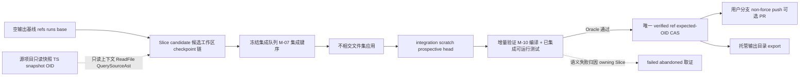
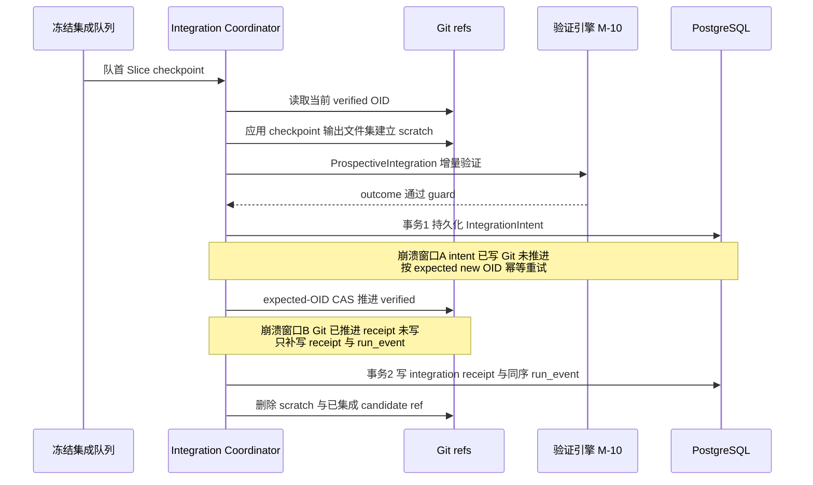
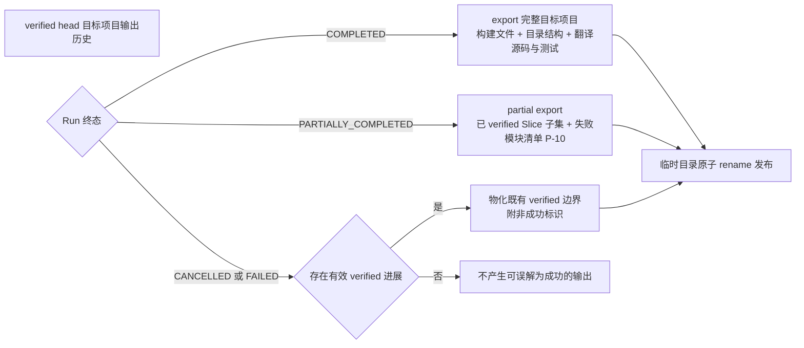

# CodeMigrator Git 真相、Slice 候选与确定性交付

> 文档状态：V5 方向对齐版。  
> 技术范围：单个迁移 Run 的托管输出仓库、源项目只读快照、内部 refs、不相交文件集集成、expected-OID CAS 事务、非 force push 交付、可选 PR 与托管输出 export。  
> 契约真相：[M-00 公共契约](CodeMigrator_垂类设计原则与架构哲学.md)拥有 `GitRunRefs`、`CandidateGeneration`、`IntegrationIntent`、`RunStatus`、`VerificationOutcome` 与 `DeliveryChannelStatus`；本篇拥有其 Git 落地、文件集应用与恢复规则，以及输出物化的 Git 侧语义。  
> 关联文档：[运行协调](CodeMigrator_Harness总体设计.md)、[并行计划](CodeMigrator_迁移计划生成器.md)、[候选工作区与工具网关](CodeMigrator_候选工作区与工具网关.md)、[三层验证](CodeMigrator_验证引擎.md)、[外部 API](CodeMigrator_系统后端架构.md)、[会话与托管输出](CodeMigrator_会话与运行时修正编排.md)、[Web 体验与迁移可视化工作台](CodeMigrator_Web体验与可视化工作台.md)。

Git 在 CodeMigrator 中保存两类互相独立的事实：冻结的**源项目只读快照**与**目标项目的输出历史**。源快照是源项目零写入承诺的 Git 侧表达——只在托管 clone 中只读存在，永不推进；目标项目（构建文件、目录结构、翻译后的源码与测试）的全部产出落在从空输出基线开始的独立历史中。每个 Slice generation 的候选在独立候选工作区生成，Agent 直写目标代码，Harness 把完成的文件集冻结为 checkpoint commit；Integration Coordinator 按冻结集成序把队首 checkpoint 的输出文件集**直接应用**到唯一 `verified` 主线——没有补丁重放，也没有编辑序列重演；语义正确性由集成后的增量验证裁决。目录和 worktree 都可删除后重新物化；commit、ref、PostgreSQL intent 与 receipt 才是崩溃恢复能信任的证据。

## V5 当前对齐

Git 仍是源快照和目标输出的真相，CAS 单写者、checkpoint receipt、直接文件集应用和 verified 单主线均保留。Planner 冻结的 integration_rank 是唯一集成序；它来自已确认的计划提案，不能由完成时间、旧的 topological_layer 或 deterministic_plan_order_key 改写。验证目录从被测 commit 临时物化，长期 Slice 沙箱卷只承载候选迭代和构建缓存。

## 源快照与输出基线：两个互不重叠的 Git 根事实

Run 创建时，受信 repo 服务以一次 fetch 把 `repository_url + base_ref` 解析为不可变源快照 commit（`snapshot_oid`）；RegisteredProject 来源则复用已冻结的 ProjectSnapshot。同一时刻初始化空输出基线：一个 tree 为空的 root commit，写入 `refs/codemigrator/runs/<run_id>/base` 后不可变。

| Git 根事实 | 身份 | 写入时机 | 只读承诺 |
|---|---|---|---|
| 源快照（如 TS 项目） | `snapshot_oid`（ProjectSnapshot 账本管理） | Run 创建时一次冻结 | Run 全程零写入、零推进；分析（M-06）、上下文（M-14）、`QuerySourceAst` 与沙箱只读挂载都以它为唯一锚 |
| 输出基线（目标项目历史之根） | `refs/codemigrator/runs/<run_id>/base` | Run 创建时初始化一次 | 此后不可变，也不再解释为新基线；verified 从这里推进 |

verified 输出历史的根是输出基线，不含源快照的任何 commit：目标项目在 Git 侧是全新历史，源项目历史不进入交付物。V3 把 base 当作"迁移工作基线、候选从源历史分叉"的语义随之废除——候选与集成都只发生在输出历史内，源快照永远只是输入。

## 一条 verified 主线，多条独立候选线

每个 Slice generation 拥有独立 candidate ref。generation `0` 从创建该候选时读取的最新 verified OID 分叉（Run 内首次即输出基线）；generation `1`、`2` 从触发重生成时的最新 verified 重新建立完整候选。bwrap 物理重派只改变 `DispatchAttemptId`，不创建新代次。



| 代码事实 | 指向 | 所有者与变化时机 | 禁止结果 |
|---|---|---|---|
| 源快照 | 冻结的 commit OID | Run 创建一次，此后只读 | 以再次 fetch 覆盖来源事实 |
| base（输出基线） | 空 tree root commit OID | Run 创建时写一次 | 被改写、推进或解释为源历史 |
| Slice candidate | `CandidateGeneration` 的 commit OID | 该 Slice 的每次 checkpoint 以 expected-OID CAS 推进 | 成为用户分支或另一 Slice 的输入 |
| integration scratch | prospective commit OID | Coordinator 应用队首 checkpoint 文件集后临时创建 | 交给 agent、bwrap 或作为正式交付 |
| verified | 唯一正式 commit OID | prospective 增量验证 Oracle 通过后原子推进 | 被局部验证、push 或报告直接推进 |
| 用户分支 | verified commit OID | 仅在代码交付时从 verified 建立或前推 | 指向 candidate、scratch 或 tree OID |

上述 ref 一律指向 commit，不指向 tree。candidate 的候选工作区是该 Slice/generation 私有物；验证从被测 commit 物化临时目录，绝不挂载 canonical candidate、scratch 或 verified 的工作区，不可信构建输出因此既不能污染下一次 checkpoint，也不能修改 Git ref。

## Ref 名称把并行边界写进仓库

| ref | 生命周期 | 允许写入 | 清理或保留 |
|---|---|---|---|
| `refs/codemigrator/runs/<run_id>/base` | Run 全程 | 创建时初始化空输出基线一次 | 依仓库保留策略 |
| `refs/codemigrator/runs/<run_id>/verified` | Run 至交付 | 仅 Integration Coordinator 的 expected-OID CAS | 用户分支的唯一来源 |
| `refs/codemigrator/runs/<run_id>/slices/<slice_id>/candidates/<generation>` | 一个 Slice 代次 | 该 Slice 每次 checkpoint 的 expected-OID CAS | 集成成功即删除；终态时转取证 ref |
| `refs/codemigrator/runs/<run_id>/integration/<slice_id>/<generation>` | 一次 prospective 集成 | 只由 Coordinator 创建与删除 | receipt 持久化后立即删除 |
| `refs/codemigrator/failed/<run_id>/<slice_id>/<generation>` | 终止失败取证 | 指向最后 candidate，创建后不可变 | 30 天 |
| `refs/codemigrator/abandoned/<run_id>/<slice_id>/<generation>` | 取消取证 | 指向最后 candidate，创建后不可变 | 30 天 |
| `refs/heads/<branch_prefix>/<run_id>` | 用户可见交付 | 只指向 verified | 按远端仓库策略 |

Run 级共享 `work` ref 不存在。并发保护由三件事承担，不依赖任何字节哈希：

1. **输出路径集合互斥**——M-07 在 PLAN 冻结 write scope（write_paths + create_roots），write_paths 相交或 create_roots 与他 Slice 冻结集合相交时加入确定性 `OrderedBefore`，因此任意时刻处于生成期的 Slice 其输出路径两两不相交；
2. **冻结集成序**——Coordinator 只按 M-07 冻结的 `integration_rank ASC → SliceId ASC` 消费队首；
3. **expected-OID CAS**——candidate checkpoint、scratch 建立与 verified 推进都要求显式 expected OID。

precondition/replacement/anchor 三哈希与 `content_sha256` 体系全部废除：目标文件由 Slice 新建、源文件只读、输出路径互斥，字节级前置守卫没有对应场景。write scope 防护为双轨（M-08/M-12）：结构化工具的越界写在落盘前被逐笔拦截返回 `WRITE_SCOPE_VIOLATION`；Shell 写效果不经逐笔拦截，由 checkpoint 批量校验在事实固化时点整体裁决——越界拒绝提交、工作区不污染 verified。两轨均不扩大集合，也不创建额外 ref。

## checkpoint 只推进自己的 candidate

EXECUTE 的 Agent 在本 Slice 候选工作区内用 `WriteFile/EditFile` 自由迭代，Harness 编排层不逐键介入文件内容。Agent 自检完成后，Harness 把工作区文件集提交为 checkpoint commit，并以批次开始时的 candidate OID 为 expected 值推进同一 candidate ref；下一次 checkpoint 在新 OID 上进行（候选工作区协议由 [M-08](CodeMigrator_候选工作区与工具网关.md) 拥有）。

checkpoint 的**输出文件集**定义为该 commit tree 在冻结 write scope（`write_paths` ∪ `create_roots` 派生域）路径下的全部文件——结构化通道由逐写拦截保证集合外零落盘，Shell 通道由 checkpoint 批量校验保证集合外写入不进入 commit（含 quiesce 后枚举与应用 `build_excludes` 排除集，M-08）。因此这个文件集就是候选与后续集成的全部代码事实——不存在需要跨 commit 复用的编辑位置或补丁对象。

tree 条目是 blob 指针不是内容：checkpoint tree 与 verified tree 的文件条目值均为 blob OID，提取输出文件集或消费文件内容时必须经 blob 表解引用读取对象正文，不得把 tree 条目值当作文件内容使用。

| 阶段 | 输入事实 | Git 写入 | 可观察拒绝 |
|---|---|---|---|
| 候选迭代 | Slice、generation、冻结 write scope、候选工作区 | 无 | `WRITE_SCOPE_VIOLATION`（结构化工具落盘前拒绝）；Shell 越界写由 checkpoint 批量校验拒绝提交（M-08） |
| checkpoint | 工作区文件集、expected candidate OID | 仅 candidate ref CAS | `CANDIDATE_REF_CONFLICT` |
| 局部验证 | candidate commit 的临时物化目录 | 无 canonical ref 写入 | 验证失败语义归 M-10 |
| 集成排队 | 局部通过的 Slice/generation | 无 | 队列仍按冻结集成键消费 |

checkpoint 幂等键覆盖 `run_id/slice_id/generation/candidate_commit_oid/checkpoint 内容摘要`（M-00 冻结），仅服务崩溃后的 receipt 对账。贯穿场景中，翻译 `models` 的 Slice A 与翻译 `api` 的 Slice B 各自在独立 candidate ref 上推进 checkpoint 链；即使 B 先局部通过，Coordinator 仍按冻结序先消费 A，B 的 candidate 保持不变并在队列等待。

## 集成是不相交文件集应用：一次可恢复的意图—Git—回执事务

Coordinator 只处理队首的局部通过候选。集成动作是纯文件集落地：读取当前 verified OID；从队首 checkpoint tree 提取输出文件集；把这些路径的文件直接放到 verified tree 之上建立 integration scratch commit。write scope 互斥保证该文件集与 verified 中其他 Slice 已落地路径不相交，应用是新建落位，不做三方合并，不生成文本补丁，不重演任何编辑序列。类型或接口等语义冲突不由 Git 层发现，而由 M-10 对 prospective head 的增量验证（目标编译 + 已集成部分可运行测试）裁决，失败诊断经 P-09 归因到 owning Slice。

```python
class FileSetApplication(BaseModel):
    """集成应用事实：队首 checkpoint 的输出文件集应用到 verified 的结果（本篇局部类型）"""
    run_id: RunId
    slice_id: SliceId
    generation: CandidateGeneration
    source_candidate_oid: GitOid
    expected_verified_oid: GitOid
    applied_paths: list[RepoRelativePath]  # ⊆ write_paths ∪ create_roots 派生域，UTF-8 字节序升序
    prospective_commit_oid: GitOid
```

`applied_paths` 必须恰好等于该 checkpoint tree 相对其 `base_verified_oid` 的全部输出路径；越界差异即控制面完整性错误，不进入验证。



| 顺序 | PostgreSQL 事实 | Git 副作用 | 失败后的确定行为 |
|---|---:|---|---|
| 1 | 读取已冻结的队列顺序和最新 verified OID | 应用文件集建立 scratch commit | 应用失败时保留诊断，candidate 不变 |
| 2 | 保存 prospective 的完整验证证据 | 无 | Oracle 不通过则不写 intent、不推进 verified |
| 3 | 事务写入 `IntegrationIntent` | 无 | intent 必含 expected/prospective OID、Slice、generation、guard hash、verification fingerprint 与幂等键（字段由 M-00 契约冻结） |
| 4 | intent 已提交 | expected-OID CAS 推进 verified | OID 不符时不产生 receipt，进入恢复或重生成判定 |
| 5 | 事务写入 receipt 与同序 `run_event` | 删除 scratch 和已集成 candidate ref | 删除失败仅为可重试清理，不撤销 verified |

`IntegrationIntent` 是 Git 与控制面之间唯一的恢复铰链；同键重复提交只能读取既有 intent 或 receipt。Git CAS 只防止 ref 被意外或重复推进，不包裹普通数据库投影写入。启动恢复和 actor 检测到 intent/receipt 缺口时执行同一有限流程：若 verified 已等于 intent 的 prospective OID 而 receipt 缺失，只补写 receipt 与 event；若 intent 存在且 verified 仍等于 expected OID，则以原 expected/new OID 幂等重试 Git 事务；其他组合返回 `RECOVERY_LEDGER_INCONSISTENT`，保留 refs 与证据，不做任何猜测性代码操作。恢复只由启动与已知事件触发。

## 重生成与终态取证

集成增量验证的语义失败不会回滚已验证主线。Coordinator 从最新 verified 建立下一 generation，重新执行完整候选流程——新候选工作区、Agent 重译、checkpoint 与局部验证；generation `2` 仍失败时恰好记录一次 `SLICE_REGENERATION_EXHAUSTED`，建立 failed ref，并交给 M-03 的 `IndependentSliceTerminalFailure` 归约决定 `PARTIALLY_COMPLETED` 或 `FAILED`。最终验证与最近一次同 tested commit OID、同冻结检查集的集成验证 fingerprint 不一致时返回 `NONDETERMINISTIC_VERIFICATION`，禁止把不稳定检查伪装成代码需要再次生成。

| 事件 | ref 结果 | verified 结果 | 后续动作 |
|---|---|---|---|
| Slice 集成成功 | 删除 scratch 与该 generation candidate | 原子推进到新正式 commit | 消费下一队首 |
| 增量验证失败且 generation < 2 | 归档旧 candidate 为诊断输入或清理 | 不变 | 从最新 verified 创建下一 generation |
| generation 2 失败 | 创建 failed ref，保留 30 天 | 不变 | 终态归约 |
| 用户取消 | 各活跃候选创建 abandoned ref，保留 30 天 | 已集成 commit 保留 | Run 为 `CANCELLED` |
| 预算耗尽 | 未验证候选转 failed ref | 不变 | checkpoint 后 `FAILED` |

## 远端交付不改变迁移真相

远端交付与本地 Slice 集成是不同边界；交付物是输出历史中的目标项目。`PushGuard` 只接受由 `branch_prefix` 派生的固定分支名与无 `+` 的 non-force refspec；首次发布要求远端不存在，后续发布要求 `frozen_last_pushed_oid == expected_remote_oid == observed_remote_oid`。远端移动先重新 fetch 并创建新的交付 intent，绝不 force push，也不以远端状态改写 verified。

| 条件 | 动作 | 结果 |
|---|---|---|
| 远端分支不存在 | 将 verified 建为用户分支后首次 non-force push | `DeliveryChannelStatus.Ready`（代码通道） |
| 远端仍以前次 OID 为头 | non-force 前推用户分支 | `DeliveryChannelStatus.Ready`（代码通道） |
| remote OID 已移动 | 停止发布并保存脱敏 receipt | `REMOTE_REF_MOVED` |
| push 或 PR adapter 失败 | 保留本地 verified、用户分支与 receipt | 仅代码通道投影为 `DeliveryChannelStatus.DeliveryFailed` |

PR 只是 `DeliveryAdapter` 对已交付分支的投影，不能修改 Git object 或内部 refs。push/PR 失败不改变 `RunStatus`、`VerificationOutcome` 或报告交付投影；两交付通道共用统一枚举 `DeliveryChannelStatus`，ledger 分立互不影响。所有 ref transaction、交付 intent、冲突摘要和 receipt 均经 M-13 脱敏后记录；源码正文、凭据和完整远端 URL 不进入事件或指标。

## 源项目只读，目标项目落在托管输出目录

本篇的 base、candidate、scratch、verified、failed、abandoned 与交付 refs 都属于 CodeMigrator 托管 clone，源仓库及其 `.git` 零写入——不在源目录创建 worktree、元数据或输出。托管输出目录由项目 slug 与 Run ID 派生（D-031）；物化即 verified head 的 export：从输出历史导出完整可运行的目标项目，而不是对源项目做增量替换。



partial export 无需特殊裁剪逻辑：verified head 本身就是"已按冻结序集成的 Slice 闭包"，物化它即得到依赖闭合的部分目标项目，失败与缺失模块由 M-16 的账本标注。`migration-log.md` 与 manifest 只写托管输出目录；用户显式 export 才复制到其指定 destination，source repo 不在 export 的写入目标之列。没有有效 verified 的 FAILED/CANCELLED Run 不制造输出。

## V5 可验收增量

- [ ] 源项目与源仓库全程零写入；目标输出只进入托管 Git 根与 verified 主线。
- [ ] 每个 Slice generation 使用独立 candidate ref 与长期沙箱卷，验证从 tested commit 临时物化目录执行，不把验证目录混入候选卷。
- [ ] 集成只由 Integration Coordinator 按冻结 `integration_rank ASC → SliceId ASC` 串行推进，expected-OID CAS 防止并发改写；完成顺序不能改变 verified 历史。
- [ ] PlanRevision 只能经 M-16 安全点/确认门产生新计划或补偿 Slice，已验证历史不被回写；交付失败只改变交付通道状态。

## V4 历史验收基线（追溯，非当前 V5 契约）

- [ ] V-M11-V4-001：Run 全程对源快照与源仓库的写入数为 0——源仓库文件、`.git`、ref 与 mtime 变化均为 0，托管 clone 中源快照 commit 的推进次数为 0。
- [ ] V-M11-V4-002：`runs/<run_id>/base` 在 Run 创建时初始化为空输出基线且此后零变化；verified 历史的根 commit 等于该基线，输出历史包含的源项目 commit 数为 0。
- [ ] V-M11-V4-003：write scope 不相交的并行 Slice 拥有独立 candidate ref、候选工作区与 checkpoint 链；任一时刻生成期 Slice 的 write scope 两两不相交。
- [ ] V-M11-V4-004：checkpoint 只以 expected-OID CAS 推进本 Slice generation 的 candidate ref；checkpoint 直接推进 verified 或成为用户分支的路径数为 0；CAS 失败返回 `CANDIDATE_REF_CONFLICT` 且 ref/receipt 副作用为 0。
- [ ] V-M11-V4-005：prospective commit 相对当前 verified 的路径差异恰好等于队首 checkpoint 冻结 write scope 内的输出文件集；集合外路径差异数为 0；集成路径中不存在补丁对象生成或编辑序列重演。
- [ ] V-M11-V4-006：运行期扫描不存在 precondition/replacement/anchor 哈希或 `content_sha256` 的计算与存储；集成失败的唯一来源是 M-10 增量验证 outcome 的语义失败。
- [ ] V-M11-V4-007：`IntegrationIntent` 在 Git CAS 前持久化且完整冻结 expected/prospective OID、Slice、generation、guard hash、verification fingerprint 与幂等键；先推进 Git 再补造 intent 的代码路径数为 0。
- [ ] V-M11-V4-008：Git 已推进而 receipt 缺失时，恢复只补写 receipt 与 `run_event`，不重复应用文件集；intent 已写而 Git 未推进时按 expected/new OID 幂等重试；OID 分叉时返回 `RECOVERY_LEDGER_INCONSISTENT` 且不强制覆盖。
- [ ] V-M11-V4-009：改变各 Slice 完成顺序 100 次，Coordinator 消费顺序与 verified commit 序列保持冻结集成键序不变；非队首 Slice 只停在 `INTEGRATION_QUEUED`。
- [ ] V-M11-V4-010：集成失败诊断按 file:line 或测试名命中冻结 write scope 归属 owning Slice 并定向重生成；generation 恰在 `0..=2` 内，generation `2` 仍失败时恰有一个 `SLICE_REGENERATION_EXHAUSTED` 与一个 failed ref。
- [ ] V-M11-V4-011：用户分支只指向 verified commit；refspec 不含 `+`；remote OID 移动时返回 `REMOTE_REF_MOVED` 且 force push 次数为 0；push/PR 失败只改变代码通道的 `DeliveryChannelStatus` 投影。
- [ ] V-M11-V4-012：COMPLETED 的物化等于 verified head 的完整目标项目 export（构建文件、目录结构、翻译源码与测试）；PARTIALLY_COMPLETED 物化已 verified Slice 子集且依赖闭合；无有效 verified 的 Run 物化输出数为 0；export 写入源仓库的文件数为 0。
- [ ] V-M11-V4-013：取消持久化后各活跃候选转 abandoned ref 保留 30 天，已集成 verified commit 保留，Run 只进入 `CANCELLED`；取消后新的 ref 推进与集成为 0。

---

> 设计演进、历史缺陷处置和变更理由见：[文档迭代记录](文档迭代记录.md)。
