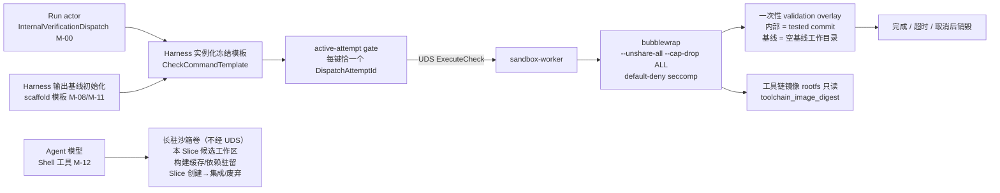
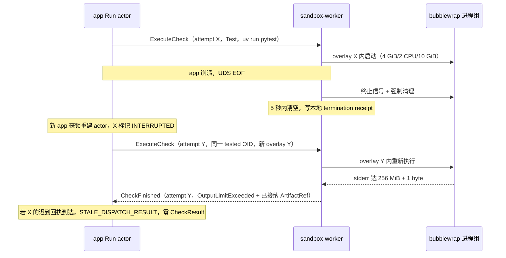

# CodeMigrator 沙箱执行：描述符命令派发与不可信进程隔离

> 文档状态：V5 方向对齐版；sandbox-worker、UDS 派发链和 overlay 授权已退役。每 Slice 候选工作区仍是长驻沙箱卷，构建缓存与已装依赖跨命令驻留，集成 receipt 后销毁。  
> 技术范围：app 直接管理 bwrap、active-attempt 接纳、目标工具链镜像挂载、default-deny seccomp、长驻沙箱卷与 Shell 执行面（受控网络出口）、Exec 嵌入式引擎资源开销、资源限制与进程组回收；部署基线 Linux kernel ≥5.15、cgroup v2、bubblewrap ≥0.8、user namespace 可用。  
> 契约真相：`CheckCommandTemplate`、`CheckAction`、`ExecutionSubject`、`CheckStatus` 与超时/输出默认档由 [M-00](CodeMigrator_垂类设计原则与架构哲学.md) 所有；app 内 bwrap 适配与执行回执由 `codemigrator.sandbox` 子包所有；验证语义与 fingerprint 由 [M-10](CodeMigrator_验证引擎.md) 所有；`Shell`/`Exec` 工具面与 checkpoint 批量校验由 [M-12](CodeMigrator_工具系统与Hook.md) 与 [候选工作区与工具网关](CodeMigrator_候选工作区与工具网关.md) 所有；验证临时目录来源与 Scaffold 执行时机由 [候选工作区与工具网关](CodeMigrator_候选工作区与工具网关.md) 与 [Git 集成](CodeMigrator_工作空间与Git集成.md) 所有。  
> 关联文档：[子包与协议归属](CodeMigrator_核心目录架构设计.md)、[Run actor 与接管](CodeMigrator_Harness总体设计.md)、[验证引擎](CodeMigrator_验证引擎.md)、[工具路径安全](CodeMigrator_工具系统与Hook.md)、[会话与修正](CodeMigrator_会话与运行时修正编排.md)。

沙箱面对的是不可信代码：翻译后的测试程序、依赖树、构建脚本与目标工具链内的任意可执行内容都可能读取宿主秘密、联网或留下后台进程。V5 中 app 直接为 Shell、Scaffold 和验证启动受控 bwrap；Slice 候选使用长期沙箱卷，验证使用被测 commit 的临时物化目录。`CheckRunner` 仍已退役，会话自检走 Shell，Oracle 裁决走内部冻结通道，二者不共享验证目录。

裁决层检查命令只有一个来源：Run 创建时冻结的目标端工具链描述符 `CheckCommandTemplate`，由 app 以冻结参数实例化为 `program + argv[]`。模型零输入——不提供 program、argv、shell 片段或环境变量；命令面之外的任何执行请求在进入执行面前已被拒绝且零执行（M-00/M-12）。bwrap 只捕获执行事实并清空其 cgroup/进程组；它不判断迁移是否正确，也不拥有 Run、Git 或 PostgreSQL。`InternalVerificationDispatch` 不是模型工具，不在 phase-tool policy 中注册。裁决层 fingerprint 的输入是冻结检查集与 tested commit 临时物化目录；Shell 是长驻卷内的自由反馈通道，验证只走前者。

V3 处置对照：插件进程沙箱、能力协商、插件 wire 协议与规则描述符传输随插件进程体系废除，无对应场景、零残留（[M-12](CodeMigrator_工具系统与Hook.md) 同批处置）；源语言解析在 app 进程内完成（tree-sitter，[M-06](CodeMigrator_代码分析与AST引擎.md)），不进沙箱，因此不再存在第二条进程间信任边界。

## V5 当前对齐

app 直接创建和回收 bwrap，并为每个执行设置 PDEATHSIG、cgroup、命名空间和差异化网络策略；不可信进程不再通过独立服务或 UDS 转发。Shell 在 Slice 长期卷内运行，并可通过受控出口代理联网；验证使用默认拒绝网络的临时目录，该目录由被测 commit 物化而来，替代一次性 overlay grant。裁决层仍只接受冻结的 CheckCommandTemplate，Oracle 语义和 fingerprint 输入不变。

### V5 执行面不变量

| 执行面 | 物理目录 | 网络 | 资源与生命周期 |
|---|---|---|---|
| Shell / Exec 反馈 | Slice 专属长期沙箱卷 | 差异化 seccomp + veth/TCP 受控出口代理 | 跨命令保留构建缓存；app 直接设置 PDEATHSIG/cgroup |
| Oracle 验证 | tested commit 临时物化目录 | default-deny | 每次验证独立创建，用毕销毁；active-attempt gate 接纳结果 |
| Scaffold | 输出基线初始化临时目录 | 按初始化策略，禁止访问控制面 | 只由 app 受信吸收声明产物，不进入模型工具面 |

活跃 bwrap 位受沙箱执行池物理公式约束，模型会话不占用该池。验证输入只包括冻结检查集、tested commit 和描述符摘要；长期卷中的 Shell 输出只能通过 checkpoint 批量校验进入候选事实。

## V4 历史协议（已退役）：一条 UDS 派发链

app 与 `sandbox-worker` 之间只有一条本地 worker 协议；消费者恰为两项——Run actor 内部验证与 Harness 基线初始化，只差在身份与接纳动作，不差在执行面、overlay 纪律与命令来源。

| 发起者 | 触发 | 被检内容（overlay 来源） | active 键 | 接纳动作 |
|---|---|---|---|---|
| Run actor 内部验证 | `InternalVerificationDispatch`（M-00），覆盖局部/集成/最终三层 subject | `tested_commit_oid` 的 Git tree | `run_id + canonical(subject) + check_id` | `CheckResult` 交 [M-10](CodeMigrator_验证引擎.md) 归一 |
| Harness 基线初始化 | Scaffold 模板（M-08/M-11 输出基线初始化时机） | 空基线工作目录 | `run_id + baseline-init` | 从 overlay 提取声明的输出路径文件集，受信应用到输出基线 |

| 边界 | 传输与编码 | 所有者 | 允许对象 | 明确禁止 |
|---|---|---|---|---|
| app ↔ sandbox-worker | host-only Unix `SOCK_SEQPACKET`；Protobuf v1；单 frame `<=256 KiB` | `codemigrator.sandbox` | dispatch 身份、冻结命令、ArtifactRef、状态与终止 receipt | 模型提交的命令字段、源码/日志正文、PG 凭据 |
| bubblewrap 子进程 | 无控制协议 | 无 | Harness 实例化的 argv 与隔离文件系统 | 任何 UDS、PostgreSQL、Docker socket、SSH agent |



`Shell` 通道不在这条派发链上（M-12）：它是 Agent 在长驻沙箱卷内的直接执行通道——自由命令自由参数，不经 `CheckCommandTemplate` 实例化、不经 active-attempt gate、不创建一次性 overlay，用于构建、依赖安装、探索与会话自检；自检=反馈不裁决——不写 `CheckResult`、不进 verification fingerprint、不推进 Slice 状态（详见"Shell 执行面"一节）。上图中 Agent 节点与派发链节点分立，两条通道之间不存在边。

### V4 历史：本地 worker 协议（已退役）

socket 固定为共享运行目录中的 `/run/codemigrator/worker/control.sock`；目录 mode 为 `0770`，socket mode 为 `0660`，app 与 worker 使用固定共享 GID。worker 监听后校验 peer credential；只有配置的 app UID/GID 可完成握手。该运行目录只挂载到 app 与 worker 容器，不挂载到 bubblewrap rootfs、工具链镜像、validation overlay 或可选观测容器。

每个 Protobuf frame 以 `protocol_version=1` 与 UUIDv7 `message_id` 开头。接收方在解码前拒绝第 `256 KiB + 1 byte`；大日志、源码和报告只能传 `ArtifactRef`。连接建立后的第一组消息是 `AppHello(instance_id, protocol_version)` 与 `WorkerHello(worker_instance_id, protocol_version)`；版本或 peer credential 不匹配时关闭连接，worker 不执行降级协议。不存在能力协商：worker 不广播能力清单，app 不按回复选择配置；工具链镜像摘要的核验发生在每次 `ExecuteCheck` 接纳时，属于描述符 gate 的运行时兜底。

| 消息 | 必需身份/字段 | 方向 | 语义 |
|---|---|---|---|
| `ExecuteCheck` | Run、`CheckSubject`、`DispatchAttemptId`、完整 canonical 冻结命令与 `template_sha256`、validation overlay grant、目标工具链镜像摘要 | app→worker | 唯一执行入口；worker 复核 subject/命令/摘要/grant；相同 attempt 重放返回原接纳 receipt |
| `CancelAttempt` | Run、attempt、cancel reason | app→worker | 终止该 attempt 的整个 cgroup/process session |
| `CheckStarted` | 完整 attempt identity、cgroup receipt | worker→app | 证明已启动，不代表检查结果 |
| `CheckFinished` | 完整 attempt identity、`CheckSubject`、execution receipt、`CheckStatus`、stdout/stderr ArtifactRef | worker→app | 供 app active-attempt gate 接纳 |
| `CleanupComplete` | attempt、cgroup-empty receipt | worker→app | 证明进程组已清空 |
| `ProtocolError` | message_id、稳定错误码 | 双向 | frame/identity/状态错误，不携带自由堆栈正文 |

```python
MessageId = NewType("MessageId", uuid.UUID)
OverlayId = NewType("OverlayId", uuid.UUID)


class InternalCheckSubject(BaseModel):
    origin: Literal["INTERNAL"]
    subject: ExecutionSubject
    check_id: CheckId


class BaselineInitCheckSubject(BaseModel):
    origin: Literal["BASELINE_INIT"]


CheckSubject: TypeAlias = Annotated[
    InternalCheckSubject | BaselineInitCheckSubject, Field(discriminator="origin")
]


class FrozenCheckCommand(BaseModel):
    action: CheckAction              # M-00 冻结枚举
    program: str
    argv: list[str]
    timeout_secs: int                # 描述符模板显式声明
    template_sha256: Sha256          # 与 Run 冻结描述符逐字节核验


class TestedCommitOverlay(BaseModel):
    source: Literal["TESTED_COMMIT"]
    tested_commit_oid: GitOid


class BaselineInitOverlay(BaseModel):
    source: Literal["BASELINE_INIT"]


OverlaySource: TypeAlias = Annotated[
    TestedCommitOverlay | BaselineInitOverlay, Field(discriminator="source")
]


class OverlayGrant(BaseModel):
    overlay_id: OverlayId
    source: OverlaySource
    root: SandboxPath               # worker 侧唯一可见的源码副本挂载点


class ExecuteCheck(BaseModel):
    message_id: MessageId
    run_id: RunId
    dispatch_attempt_id: DispatchAttemptId
    subject: CheckSubject
    command: FrozenCheckCommand
    toolchain_image_digest: str
    overlay: OverlayGrant
```

协议不设置周期续权、心跳或数据库 version 字段。连接 EOF 本身就是 app/worker 失联事实；`DispatchAttemptId` 标识一次物理派发，`CandidateGeneration` 标识一次语义候选，两者不能互换。方法面冻结为上表六条：解码到方法名之外的 frame 一律 `ProtocolError`，不存在扩展注册。

## V4 历史：worker 返回的 active-attempt gate（已退役）

app 的 Run actor 在 PostgreSQL 维护 active dispatch 集合，键空间按消费者分离：内部验证键为 `run_id + canonical(ExecutionSubject identity) + check_id`，基线初始化键为 `run_id + baseline-init`。每个键恰有一个 active attempt，不同 Slice/check 可以并行。worker 结果只有 `DispatchAttemptId + CheckSubject + tested_commit_oid`（基线链为 overlay 对应的基线初始化身份）全部匹配且 Run 尚未取消时才可被接纳；任何迟到、跨 subject、错 check 或旧身份返回都归为 `STALE_DISPATCH_RESULT`，只追加低敏审计事件。

| gate 结果 | CheckResult 账本 | candidate/verified ref | 审计 |
|---|---:|---:|---|
| 内部验证键匹配且未取消 | 交给 M-10 归一 | 后续流程决定 | accepted event |
| attempt 已被重派取代 | 0 | 0 | stale-attempt event |
| subject/check/身份不匹配 | 0 | 0 | stale-subject event |
| cancel 已持久化 | 0 | 0 | late-after-cancel event |

worker 不连接 PostgreSQL，也不能自行判断 active attempt。它只回显 app 派发的身份并提供执行证据；接纳决定永远在 Run actor。Git、PG、候选工作区或其他 Slice 的写入口不会暴露给 worker 内的检查进程。worker 仅持有本次 dispatch 的日志 staging 与 CAS ingest grant：可把 stdout/stderr 流提交为当前 Run/Slice/attempt 命名空间下的不可变 ArtifactRef，不能读取其他命名空间、覆盖既有 hash 或枚举 CAS；grant 在完成、取消或断连时撤销。

## V4 历史：每个 check 的一次性 validation overlay（已退役）

派发链上的不可信进程永远只看到 overlay，不看到任何受信工作树。overlay 按 `OverlayGrant.source` 从冻结的被检内容创建：内部验证从 `tested_commit_oid` 读取 Git tree 物化；基线初始化从空基线工作目录创建。候选工作区、integration scratch、verified ref 以及它们的 Git 控制目录都不挂载给派发链检查进程——`CheckRunner` 退役后本链不存在候选快照来源，overlay 语义收敛为 tested_commit（内部验证）与空基线（Scaffold）两种。构建生成文件、测试 fixture 和恶意写入只能留在该 overlay，不能改变被验证 commit 或下一次 check 的输入。

| 生命周期 | overlay 行为 | 受信侧保持 |
|---|---|---|
| 首次派发 | 按 grant 来源新建空净 overlay，绑定 subject/check/attempt | Git object 与候选工作区保持不变 |
| 正常完成 | 先封存日志/receipt，再销毁 overlay | 不吸收构建输出 |
| 取消或输出/超时失败 | 清空进程组后销毁 overlay | 不回写 candidate/scratch/verified |
| worker 断连 | 旧 overlay 随旧进程组隔离；新 attempt 使用新 overlay | 旧进程即使迟到也只能污染旧副本 |

依赖 cache 只能按目标工具链镜像声明以只读方式挂载（如 Python 镜像内预置的 uv/pip wheel cache）；派发链 overlay 内不存在跨 check 可写 build cache，cache miss 不联网下载——跨命令缓存驻留是 Shell 长驻沙箱卷的专属语义（见"Shell 执行面"一节），不进入验证输入。overlay 路径不进入结果身份，`tested_commit_oid` 才是验证输入真相。

## V4 历史：Scaffold 派发只服务输出基线初始化（已退役）

`CheckAction.Scaffold` 的命令模板同样来自冻结描述符，但不开放给 Agent（M-12：模型工具面与描述符命令面零交集）：脚手架是带文件写入副作用的一次性项目初始化动作，由 Harness 在输出基线初始化时执行（[候选工作区与工具网关](CodeMigrator_候选工作区与工具网关.md)/[M-11](CodeMigrator_工作空间与Git集成.md) 拥有流程与产物归属）。它经同一条 UDS 链与同一套 bubblewrap 纪律执行——脚手架工具进程同样不可信，其全部写入只落一次性 overlay；执行完成后 Harness 从 overlay 提取描述符声明的输出路径文件集，以受信写入应用到输出基线，随后销毁 overlay。Agent 侧不存在任何可达 Scaffold 的派发路径；Scaffold 与裁决层检查是 UDS 派发链仅有的两个消费者，`CheckRunner` 退役后模型工具面不再实例化任何 `CheckCommandTemplate`。

## Shell 执行面：长驻沙箱卷内的自由执行

`Shell` 工具（M-12）不经营任何命令面：模型提交自由命令文本（含参数），无白名单、无 `CheckCommandTemplate` 实例化、无 active-attempt gate，直接在本 Slice 专属长驻沙箱卷内执行。这是 Agent 的直接执行通道，与裁决层的内部执行通道平行。

**物理形态：工作区即沙箱卷（M-08）。** 每 Slice 候选工作区就是一个沙箱卷：宿主 app 与该 Slice 专属沙箱共享挂载——受信侧（L1 结构化文件工具）与不可信侧（Shell 命令）操作同一文件系统的不同视图。沙箱生命周期与 Slice 对齐，而非与单次检查对齐：Slice 创建时建卷，集成 receipt 或废弃时销毁工作区与沙箱；裁决层检查仍在每次派发时从 `tested_commit_oid` 新建独立临时验证目录，两者不共享隔离实例。

**驻留复用。** 构建缓存与已装依赖跨命令驻留在沙箱卷内：同会话重复构建/测试不重复下载与冷编译，迭代加速是长驻的主要收益。驻留缓存不进入验证输入身份——裁决层检查从冻结 tested commit 的临时验证目录执行，不读取沙箱卷内缓存。

**自检=反馈不裁决。** 会话自检是 Shell 的用途之一：Agent 在沙箱卷内运行测试/编译/lint，以退出码与输出驱动自身修正。结果不写 `CheckResult` 账本、不进 verification fingerprint、不推进 Slice 状态（P-02/M-10）。裁决永远由冻结检查集独立做出——Agent 不能影响检查集选择，否则"自选考题"式自检会使 fingerprint 失去独立性；Agent 自检通过不等于局部验证通过，提交 checkpoint 后 Run actor 仍按冻结检查集独立派发。

**写效果兜底。** Shell 命令的写效果（重定向、生成文件、依赖安装落盘）全部留在沙箱卷内；越界写由 checkpoint 批量校验兜底——checkpoint 提交时校验工作区 diff（应用描述符 `build_excludes` 排除集）全部落在冻结 write scope 内，越界拒绝提交且不污染 verified（M-08）。沙箱卷对宿主的边界与裁决层沙箱一致：bubblewrap 隔离、无宿主敏感挂载（网络出口差异见"网络出口"小节）。

**Shell 进程治理。** Shell 的 bwrap 进程组由 app 直接派生并持有：进程组置于专属 cgroup 域、bwrap 首进程设 `PR_SET_PDEATHSIG`——app 进程死亡时内核同步回收其全部 Shell 沙箱进程组；Shell 执行由 app 直接管理，不依赖另一个服务的断连清理。checkpoint quiesce 与会话失效复用同一 cgroup 域终止语义（M-08）。

## V4 历史：worker 断连必须终止副作用（已退役）

app 连接 EOF 时，worker 立即拒绝新执行并终止该连接拥有的全部 active cgroup/process session；每组先发送终止信号，再在固定清理窗口内强制结束并核验 cgroup 为空。若任一组在 `5` 秒内无法清空，worker 写本地 termination receipt 后自行退出，由 Compose 重启，不能带着未知子进程重新接受 app。

worker 连接 EOF 时，app 将该连接上的每个 active entry 标为 `INTERRUPTED`。Run 未取消且 subject/被检内容仍有效时，actor 为每个内部验证键生成新的 `DispatchAttemptId` 和新的 validation overlay 后重新派发；物理重派不增加 `CandidateGeneration`。长驻沙箱内在途的 Shell 命令随连接清理被终止，以 `InfrastructureError` 语义返回模型上下文（不写验证账本——Shell 输出本就不写账本），Agent 可重新执行；沙箱卷与其内驻留的构建缓存/已装依赖不受进程清理影响，长驻生命周期跨越 worker 实例更替。旧 worker 稍后恢复连接也不能复用原 attempt。

| 故障 | app 行为 | worker 行为 | 禁止结果 |
|---|---|---|---|
| app 崩溃/UDS EOF | 新 app 获控制面锁后重建 actor | 清空全部活动进程组（长驻沙箱卷数据保留）；5 秒失败则退出 | 孤儿进程继续写 overlay/沙箱卷之外的世界 |
| worker 断连 | 受影响 entries→`INTERRUPTED`；条件满足时逐键以新 attempt/overlay 重派 | 旧实例不再被信任 | 增加 generation 或接纳旧结果 |
| CancelAttempt 丢失后连接仍在 | actor 关闭该连接以触发全清理 | 按 EOF 路径回收 | 等待周期 heartbeat 超时 |
| 清理 receipt 丢失 | app 将 attempt 保持 interrupted | worker 重新连接不能补造 CheckResult | 假定进程已清空 |

## 命令模板到进程：模型零输入

Spec、API 与模型都不能表达 program、argv、shell、环境变量或 timeout。app 在执行前以冻结参数实例化目标端描述符的 `CheckCommandTemplate`（canonical 顺序固定），把完整命令与 `template_sha256` 交给 app 内 bwrap 执行适配；适配层重算摘要并核验目标工具链镜像摘要，不从仓库、模型或调用方补全 argv，也不经 shell 拼接。

| 层级 | 信任输入 | 不可信输入 | 固定责任 |
|---|---|---|---|
| Spec/描述符 | Run 创建时冻结的 `CheckCommandTemplate`（program/argv/timeout_secs） | 仓库与说明文字 | 描述符是随 app 分发的内置资源，无插件进程 |
| Harness | 冻结模板、canonical 实例化 | 仓库内容 | 只产生固定 argv，顶层 launcher 不是 shell |
| app | active dispatch set、被检内容、临时物化目录、镜像摘要 | bwrap 返回 | 校验身份并决定接纳 |
| app 内 bwrap 执行适配 | 已验镜像摘要、资源策略、argv、scoped CAS ingest grant | 检查进程行为 | namespace、cgroup、日志捕获、回收 |
| sandbox 内 | 无 | 测试代码、依赖、构建脚本 | 全部作为同一不可信进程组 |

超时是描述符声明的事实：模板显式携带 `timeout_secs`，默认档 Scaffold/Compile/Lint/TypeCheck `300` 秒、Test `120` 秒；没有调用方可覆盖字段。Shell 通道不适用该档——它不经模板实例化，超时走模型工具档（缺省 `60` 秒，可上调至受限上限，M-12）。

## 工具链镜像决定隔离世界

目标语言工具链由 `TargetToolchain.toolchain_image_digest` 声明：该镜像（如含 uv/pytest 的 Python 工具链镜像）以只读 rootfs 提供 target 编译器、包管理器与测试运行时。源语言解析不进沙箱——tree-sitter 查询在 app 进程内完成（M-06）。启动预检核验内核、cgroup v2、bubblewrap、user namespace、磁盘 quota、architecture 与冻结镜像摘要；任一不符就拒绝执行，不能降级为弱隔离。

| 核验项 | 运行时核验 | 沙箱效果 |
|---|---|---|
| 镜像 rootfs digest | 与 Run 冻结 `toolchain_image_digest` 完全一致 | 目标编译器与包管理器根文件系统只读 |
| architecture | 宿主、镜像、BPF 三方一致 | 不跨架构套用 syscall 策略 |
| seccomp SHA-256 | 加载前完全匹配 | default-deny allowlist，默认动作 `EPERM` |
| dependency cache | 仅镜像声明的固定路径与摘要 | 只读；cache miss 不联网下载 |
| environment | `PATH/HOME/LANG` 与描述符白名单 | `--clearenv` 后逐项注入，不继承代理/凭据 |
| validation temp directory | Run/subject/check/attempt 与预注册目录一致 | 只挂载按 `tested_commit_oid` 物化的临时验证目录；不接受候选工作区、canonical ref 或任意路径 |

### bubblewrap 参数边界

| 顺序 | 参数类别 | 来源 | 安全作用 |
|---:|---|---|---|
| 1 | 固定 bubblewrap executable | app runtime image | 不从仓库找 launcher |
| 2 | `--unshare-all` | 固定策略 | 隔离 user/PID/mount/network/IPC |
| 3 | `--new-session`、`--die-with-parent` | 固定策略 | 独立 session，父退出清理子树 |
| 4 | `--clearenv`、`--cap-drop ALL` | 固定策略 | 清空环境和 capability |
| 5 | 工具链镜像 rootfs ro-bind | 冻结镜像摘要 | 目标工具链不可写 |
| 6 | 最小 `/dev`、受控 `/proc`、tmpfs `/tmp` | 固定策略 | 限制设备与临时写入 |
| 7 | validation temp directory bind | app 按 `tested_commit_oid` 物化 | 单次 check 唯一可写源码副本；候选工作区/canonical ref 不可见 |
| 8 | dependency cache ro-bind | 镜像声明 | 只读依赖 |
| 9 | seccomp BPF fd | 已验策略摘要 | allowlist 外 syscall 返回 `EPERM` |
| 10 | 白名单环境与固定 argv | 描述符/固定策略 | 阻断 shell 拼接与额外 bwrap 参数 |

不存在 UDS 控制目录；PostgreSQL socket、Docker socket、SSH agent 和宿主凭据也都不在挂载表中。翻译后的 pytest 测试代码可以在沙箱内运行，但仍属于不可信进程，不能据此把任何检查器提升为受信 launcher。

### 网络出口：裁决层 default-deny，Shell 受控外联（差异化 seccomp 网络档）

bubblewrap namespace/capability 隔离与 default-deny seccomp 基线是全部沙箱实例的公共边界；seccomp 的**网络 syscall 面**按执行面分层：

- **裁决层检查沙箱与 Scaffold 沙箱：零网络。** seccomp 策略阻断全部网络 syscall，依赖只读镜像内预置 cache，cache miss 不联网下载。
- **Shell 长驻沙箱：受控网络出口。** 依赖安装（uv/pip/npm 类）需要外联，且其代理生态面向标准 TCP HTTP(S) 代理（`HTTP(S)_PROXY=host:port`），不存在经 UDS 的标准代理协议——因此机制方向定调为差异化 seccomp 档而非挂载注入：Shell 沙箱使用独立 seccomp 网络档，放行 `AF_INET` 的 `socket()/connect()`，但 netns 隔离保证其唯一网络出口是 veth 对端的宿主白名单代理进程；防火墙（iptables/nft）规则限制出站仅可达代理监听端口，`HTTP(S)_PROXY` 环境变量在沙箱初始化时注入指向该代理，允许域由目标端描述符声明。代理实现细节（域名级白名单/认证/缓存）为实施期细化项。出口能力只覆盖依赖获取类流量，不开放任意网络访问。

沙箱内代码对控制面 socket 的探测事实归本节记录：bubblewrap 内代码探测任何宿主 socket 时，socket 未挂入 namespace，无控制请求产生，统一以 sandbox 权限拒绝审计呈现（自 M-03 断连表移交至此——它是沙箱出口探测事实，不是 app/bwrap 执行中断方向）。

隔离边界不因网络出口分层而弱化：namespace、capability、进程组回收对所有沙箱一致；差异仅两处且均为受控面——Shell 档 seccomp 放行网络 syscall（仅此类别）、netns 内新增一条指向宿主代理的 veth 链路。Shell 的出口能力不外溢到任何派发链沙箱，裁决层执行面保持 default-deny 无网络。

## 资源与输出形成硬边界

裁决层单次检查沙箱固定 `4 GiB` 内存、`2` CPU、`10 GiB` 可写磁盘。**三池模型**（M-00 信息分层原则/fb8 续对齐）：物理公式 `max(1, min(4, floor(host_memory_gib / 4), floor(host_cpu_cores / 2)))` 约束的是**同时活跃的 bwrap 沙箱执行位**——Shell 命令、Scaffold 与裁决层临时验证按需从池中取用、用毕归还（长驻卷与构建缓存保留在卷内，不受归还影响）；Slice 会话数不占沙箱执行位——模型调用与只读工具在 app 进程内执行，其并发由 provider 配额与 Run 预算约束。`Exec` 嵌入式 JS 引擎在 app 进程内运行，不经沙箱：引擎实例有独立内存/CPU 上限，不占沙箱槽位；引擎选型（quickjs/py-mini-racer 类 Python 绑定）与开销基准为实施期细化项，以实测基准回填上限数字（M-12 联动）。计量口径定调：沙箱内存按 cgroup memory limit 以**活跃 bwrap 实例**保守计入并发内存预算（不按实测 RSS 折扣）；空闲治理方向——Slice 会话进入 `WAITING_FOR_USER` 等非活跃态超过阈值（实施期参数）时终止沙箱内进程组并归还池位、保留卷内容，构建缓存与已装依赖为文件态不受影响，恢复活动时重建进程组即可续用。[M-03](CodeMigrator_Harness总体设计.md) 在各池之上执行跨 Run 公平轮转，同一 Run 只派发互不冲突的 ready 键。

| 资源或流 | 上限 | execution 主事实 | 证据 |
|---|---:|---|---|
| 内存 | 4 GiB | `InfrastructureError` | cgroup memory event |
| CPU | 2 CPU | 限速，不改写检查语义 | cgroup receipt |
| 可写磁盘 | 10 GiB | `InfrastructureError` | quota receipt |
| stdout | 256 MiB/流 | `OutputLimitExceeded` | 已接纳完整前缀 ArtifactRef |
| stderr | 256 MiB/流 | `OutputLimitExceeded` | 已接纳完整前缀 ArtifactRef |
| 验证目录内单文件写入 | 64 MiB | `OutputLimitExceeded` | quota receipt |
| 全部 action 超时 | 模板 `timeout_secs`（默认档见上节） | `TimedOut` | deadline receipt |

stdout/stderr 分别计数，任一流的第 `256 MiB + 1 byte` 触发整个进程组终止。每个 admitted check 在 launch 前登记 canonical empty stdout/stderr ArtifactRef；launch 或 artifact 提交失败仍能形成引用两条空对象的 `InfrastructureError`，不会产生缺日志引用的结果。

长驻沙箱卷的文件态内容与构建缓存随 Slice 保留，不占用活跃 bwrap 执行位；当 Shell、Scaffold 或裁决层验证启动 bwrap 时，仍使用同一套 cgroup/配额机制并纳入上述并发公式，卷内可写磁盘与输出上限同样以 quota receipt 约束。机制不因长驻卷与临时验证目录的执行隔离而分叉。

非取消终止事实按 `output limit → timeout → infrastructure failure → seccomp denial → process exit` 选择唯一主事实；外部取消优先于全部并且只产生 `TerminationReceipt`。seccomp denial 即使伴随 exit code `0` 仍映射 `Failed`；exit `0` 只有在不存在更高优先级事实时才可映射 `Passed`。该归约适用于 app 直接管理的全部裁决检查（内部验证与 Scaffold）；Shell 通道不经此归约——退出码与输出按 [M-12](CodeMigrator_工具系统与Hook.md) 语义直接作为反馈返回模型上下文，非 0 退出码不是工具拒绝。

## V4 历史场景：TS→Python 的 Test 反馈与断连重派（已退役）

**自检反馈。** 测试翻译 Slice T 的 Agent 完成初稿后以 `Shell` 工具在本 Slice 长驻沙箱卷内执行 `uv run pytest -q`（M-12 自由命令，不经 UDS 派发链、不经模板实例化）：命令直接落在候选工作区（即沙箱卷）上，此前 Shell 安装的依赖与构建缓存驻留复用，无冷启动。命令以非 0 退出码终止，stdout 中带回 2 条 `file:line` 诊断——这是返回模型的正常反馈，不写验证账本、不进 fingerprint、不推进 Slice 状态；`.pytest_cache` 等副作用留在长驻沙箱卷内，由 checkpoint 批量校验兜底（M-08）。Agent 修正后再次执行得到退出码 `0`；提交 checkpoint 后 Run actor 仍按冻结检查集独立派发局部验证（P-02/M-10）——检查集选择不受 Agent 影响，"自选考题"在结构上不可能。

**断连重派。** T 集成后进入最终验证，其 Test 检查以 attempt X 派发：app 从冻结 verified head 的 `tested_commit_oid` 创建 overlay X，worker 启动完整进程组；候选工作区与 canonical ref 不可见。app 随后崩溃，UDS EOF 使 worker 终止 X 的完整进程组并在 5 秒内报告本地清空；新 app 取得 advisory lock、重建 Run actor，把 X 标记为 `INTERRUPTED`，从同一 tested OID 创建 overlay Y 和 attempt Y。



X 的成功消息稍后到达时，active-attempt gate 拒绝它，不产生 CheckResult。Y 的 stderr 达到 `256 MiB + 1 byte` 后被清理并返回 `OutputLimitExceeded` 与已接纳 ArtifactRef。整个过程 generation 语义不受影响——最终验证不消耗 `CandidateGeneration`；若清理无法在 5 秒内完成，worker 自退出而不是继续接受 Y。

## V4 历史施工验收（已退役）

- [ ] V-M09-V4-001：worker 协议方法面冻结为 `ExecuteCheck/CancelAttempt/CheckStarted/CheckFinished/CleanupComplete/ProtocolError` 六条；方法名之外的 frame 解码即拒；运行时扫描不存在 V3 插件 wire 方法（ResolveLocator/EmitPatch/Query 等）或能力协商字段残留
- [ ] V-M09-V4-002：握手只核验 protocol_version 与 peer credential；不存在能力清单广播、配置选择或降级协议分支
- [ ] V-M09-V4-003：UDS 只对固定 UID/GID 开放；运行目录不挂载进 bubblewrap rootfs、工具链镜像或 validation overlay
- [ ] V-M09-V4-004：worker 无 PostgreSQL 连接；检查进程可达的 Git、PG、候选工作区与其他 Slice 写接口数量为 0
- [ ] V-M09-V4-005：`ExecuteCheck` 携带的 program/argv/timeout/template_sha256 与 Run 创建时冻结的描述符模板逐字节一致；模型或调用方注入任何命令字段时 worker 派发数为 0
- [ ] V-M09-V4-006：请求的镜像摘要与 Run 冻结 `toolchain_image_digest` 不匹配时 `ExecuteCheck` 拒绝且零 cgroup、零 overlay 创建
- [ ] V-M09-V4-007：旧 attempt、跨 subject、错 check、旧 tested OID 或 cancel 后返回均不产生 CheckResult、模型工具输出或 ref 推进，只追加丢弃审计
- [ ] V-M09-V4-008：app EOF 后 worker 在 5 秒内清空全部进程组；无法清空时 worker 自退出且 Compose 可重启
- [ ] V-M09-V4-009：worker 断连只创建新 `DispatchAttemptId` 与新 overlay，不增加 `CandidateGeneration`；长驻沙箱内在途 Shell 命令以 `InfrastructureError` 语义终态返回模型上下文且不写验证账本，沙箱卷与缓存驻留不受清理影响
- [ ] V-M09-V4-010：每个 check 完成、超时或取消后其 overlay 被销毁；候选工作区本体不挂载给派发链检查进程，内部链的 tested commit 不吸收任何构建输出
- [ ] V-M09-V4-011：候选工作区、integration scratch 与 verified canonical 工作树挂载给派发链检查进程的次数为 0（长驻沙箱卷对 Shell 的共享挂载除外，其写效果由 checkpoint 批量校验兜底，M-08）
- [ ] V-M09-V4-012：Scaffold 派发仅在输出基线初始化出现，产物经 Harness 从 overlay 提取后受信应用；Agent 发起 Scaffold 的路径不存在（M-12 模型工具面与描述符命令面零交集），本文执行面零接纳
- [ ] V-M09-V4-013：bubblewrap 参数逐项包含 `--unshare-all`、`--new-session`、`--die-with-parent`、`--clearenv`、`--cap-drop ALL`、只读工具链 rootfs、最小 `/dev`、受控 `/proc` 与 default-deny seccomp；UDS 目录、Docker socket、SSH agent 与宿主凭据不出现在挂载表
- [ ] V-M09-V4-014：单次检查沙箱保持 4 GiB/2 CPU/10 GiB；沙箱执行池的并发槽位（同时活跃 bwrap 实例）等于 `max(1, min(4, floor(host_memory_gib / 4), floor(host_cpu_cores / 2)))`，按需取用、用毕归还；Slice 会话数不占沙箱执行位（三池模型，M-00）；Exec 引擎实例开销不占沙箱槽位且有独立上限
- [ ] V-M09-V4-015：stdout/stderr 各自超过 256 MiB、overlay 单文件超过 64 MiB 或模板超时后，进程组被清空且 CheckStatus 不可能为 `Passed`
- [ ] V-M09-V4-016：seccomp denial 伴随 exit `0` 仍映射 `Failed`；非取消终止按 `output limit → timeout → infrastructure failure → seccomp denial → process exit` 归约出唯一主事实
- [ ] V-M09-V4-017：UDS 派发链消费者恰为两项——Run actor `InternalVerificationDispatch` 与 Scaffold 基线初始化；任何由模型工具触发的 UDS 派发数为 0，两个键空间分离且每键恰有一个 active attempt
- [ ] V-M09-V4-018：每 Slice 长驻沙箱生命周期与 Slice 对齐——Slice 创建时建卷、集成 receipt 或废弃后销毁工作区与沙箱；同 Slice 会话内构建缓存与已装依赖跨 Shell 命令驻留（重复构建零重复下载与冷编译）
- [ ] V-M09-V4-019：Shell 自检自由执行（自由命令自由参数、不经模板实例化、不经 UDS 派发链）且不进 fingerprint——Shell 结果不产生 CheckResult、不推进 Slice 状态；checkpoint 后局部验证仍由冻结检查集独立派发，Agent 无法影响检查集选择
- [ ] V-M09-V4-020：裁决层检查沙箱与 Scaffold 沙箱保持 default-deny 无网络（网络 syscall 全拒、cache miss 不联网下载）；Shell 长驻沙箱差异化 seccomp 网络档放行 `AF_INET` connect 且 netns 唯一出口为宿主白名单代理——直连路由数为 0、代理外目标连接数为 0、`HTTP(S)_PROXY` 注入值指向该代理

## V4 历史：交互暂停不等同于 worker 取消（已退役）

CorrectionIntent 的 `PAUSING_FOR_INPUT` 只阻止新的派发；当前活动 check 仍在一次性 validation overlay 内收敛到 check receipt、timeout、输出上限或既有取消结果。Run actor 在 receipt 接纳后才把 InteractionStatus 改为 `WAITING_FOR_USER`，不会把自然语言直接翻译为 sandbox signal。

会话等待期 worker 没有新 overlay grant、argv、cgroup 或 DispatchAttempt，长驻沙箱内也没有新 Shell 执行。用户明确 CancelRun 时才沿既有取消协议清理进程组；结构修正创建新 Slice 后才创建其专属长驻沙箱卷。Skill 和 Web 输入都不能接触 UDS、bubblewrap、seccomp、宿主 socket 或 sandbox 路径。

> 设计演进、历史缺陷处置和变更理由见：[文档迭代记录](文档迭代记录.md)。
