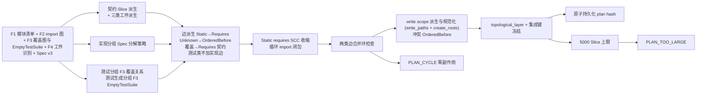
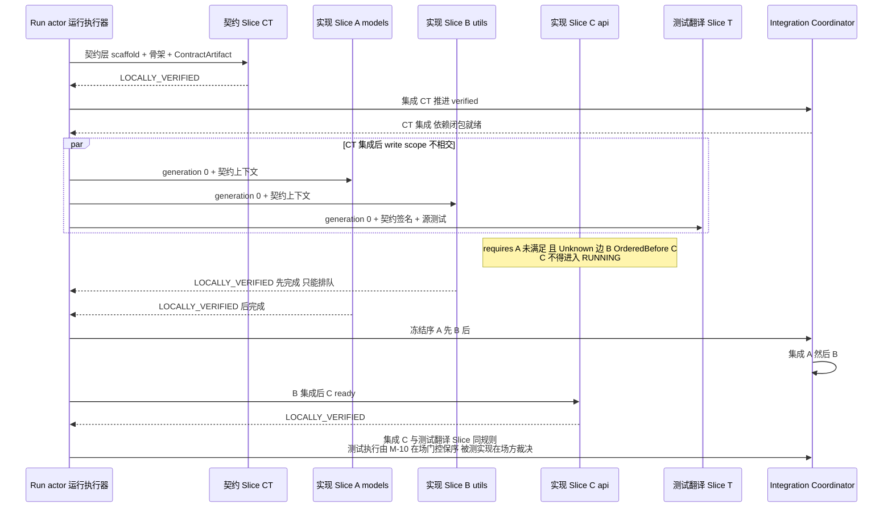
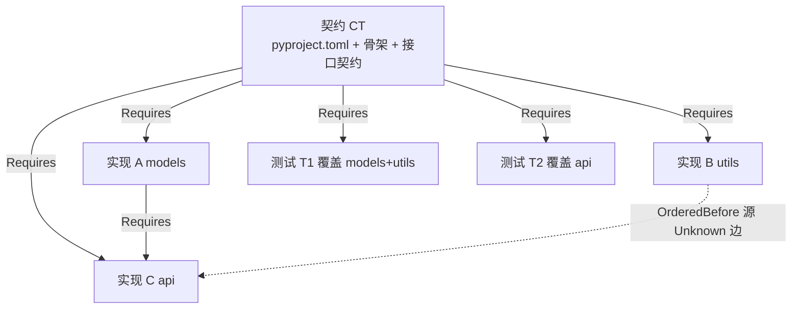

# CodeMigrator 迁移计划生成器：契约先行的 Slice DAG

> 文档状态：V4 当前架构基线。  
> 技术范围：M-06 分析事实（四类分析事实、F3 `EmptyTestSuite` 标注、F4 工件识别、PSF-2 项目索引与 PSF-3 关系图）与 Migration Spec（v3：翻译范围、检查集、分解策略）到冻结 Slice DAG 的确定性规划——四类 Slice 派生（契约/实现/测试翻译/测试生成）、三类工件派生、依赖边派生、write scope 冻结、拓扑层调度语义（依赖闭包就绪即启动）、SCC 收缩与环拒绝、确定性集成键与契约漂移涟漪计算。  
> 契约真相：`MigrationSlice`、`SliceKind`（含 `TestGeneration`）、`ArtifactKind` 三类工件处理策略、`WriteScope`、`PlanEdge`、`DeterministicPlanOrderKey`、集成键三元组、`GENERATED` 标注全链路语义与等价信心分级由 [M-00：设计原则、系统地图与公共契约](CodeMigrator_垂类设计原则与架构哲学.md) 唯一定义；四类分析事实（含 F3 `ModuleCoverage` 状态与 F4 `ArtifactKind` 识别）、import 边可信度模型、PSF-2 项目索引（SymbolBinding/ReferenceSite 与符号级覆盖边）与 PSF-3 关系图由 [M-06：代码分析与 AST 引擎](CodeMigrator_代码分析与AST引擎.md) 唯一定义；本篇拥有 Slice 派生规则（含测试生成派生与三类工件派生）、依赖边派生规则、write scope 派生规则、涟漪计算规则与计划冻结语义。  
> 关联文档：[公共契约](CodeMigrator_垂类设计原则与架构哲学.md)、[Migration Spec](CodeMigrator_Migration_Spec抽象层.md)、[代码分析与 AST 引擎](CodeMigrator_代码分析与AST引擎.md)、[Harness 总体设计](CodeMigrator_Harness总体设计.md)、[候选工作区与工具网关](CodeMigrator_候选工作区与工具网关.md)、[验证引擎](CodeMigrator_验证引擎.md)、[Git 集成](CodeMigrator_工作空间与Git集成.md)、[会话与运行时修正](CodeMigrator_会话与运行时修正编排.md)。

规划器回答三个问题：源项目要翻译成哪些目标产物（契约/实现/测试翻译/测试生成四类 Slice 与三类工件派生）、谁先谁后（依赖边与拓扑层）、以什么顺序汇入唯一 verified 主线（冻结集成键）。输入是**三件冻结工件**：冻结快照上的机械完备候选事实（M-06）、Spec 声明、用户确认后的《项目理解档案》（UnderstandingDossier，语义模块划分与依赖消解判定的最终权威，M-00 信息分层原则）。输出是一张持久化后不可变的计划图：契约 Slice 先产出目标项目骨架与模块接口契约，实现与测试翻译/测试生成 Slice 以契约为对齐基准、在其依赖的契约 Slice 集成后即可并行启动（依赖闭包就绪即启动，不等全仓库契约 Slice 清空），Integration Coordinator 按冻结集成键串行集成。规划派生全程是确定性代码路径——同快照+同 Spec+同已确认档案必得同计划（P-03 口径）；PLAN 阶段的 Reasoning 模型可以读取事实并向会话解释计划，但其输出不回写计划事实——模型不能创建或删除依赖边，不能扩大 write scope，不能改变拓扑层归属与集成顺序；模型智能对规划的影响已经前移并在档案确认门完成。

## 职能边界：Planner 消费什么，产出什么

| 输入 | 来源 | Planner 消费内容 |
|---|---|---|
| F1 模块清单 | M-06 | 文件→`ProjectModuleId` 映射、模块角色（Source/Test）、边界来源（清单/目录/文件）；各 Slice 分组的骨架 |
| F2 import 图 | M-06 | 模块间依赖边及可信度（`Static`/`Unknown`）：Requires 与 OrderedBefore 派生的唯一来源；`External` 边不入模块间边，不参与派生 |
| F3 测试清单与覆盖映射 | M-06 | 测试文件→被测模块集合与模块覆盖状态（`Covered`/`EmptyTestSuite`/`Undetermined`）：测试翻译 Slice 的分组与依赖派生；`EmptyTestSuite`（可判定且无测试关联）的 Source 模块驱动测试生成 Slice 派生，`Undetermined` 不驱动任何测试类 Slice |
| F4 构建清单摘要与工件识别 | M-06 | 依赖/脚本/入口摘要：透传契约层上下文（目标构建文件参考），不参与边派生；工件识别事实（`GeneratedCode`/`DeclarativeConfig`/`ResourceFile` 三类 `ArtifactKind`，含生成代码的源头识别）驱动三类工件派生（见"三类工件派生"节） |
| PSF-2 项目索引 | M-06 | SymbolBinding/ReferenceSite 符号级双向索引与符号级覆盖边（测试用例→被测符号）：测试生成 Slice 的符号级锚点、涟漪计算的符号引用闭包查表基础 |
| PSF-3 关系图 | M-06 | 模块级复合图（import 边/覆盖边/包含边）：Requires 派生（import 边投影即 F2，派生仍以 F2 为唯一来源）、涟漪依赖闭包计算与集成序冻结的图基础 |
| Migration Spec v3 | M-05 | 翻译范围（纳入翻译的模块/目录）、冻结 required checks、分解策略三子字段（目标模块粒度、并行度上限、测试分组策略） |
| 已确认理解档案 | 用户确认冻结（M-16 流程/M-00 契约） | `semantic_modules` 语义模块划分（分组与 write scope 划分的优先依据，覆盖目录约定）；`dependency_resolutions` 中判定为真实依赖/隐式依赖的动态 import 显式生成边；`risk_hotspots` 不参与派生，随 pack 摘录下发 |
| 双端工具链描述符 | Spec 锁定 | 目标路径映射约定、scaffold 与契约文件命名规则、`artifact_rules` 工件分类与映射声明、固定辅助路径声明 |

| 产出 | 直接消费方 |
|---|---|
| 四类 Slice（kind、source_modules、write scope、required checks；测试生成 Slice 产出带全链路 `GENERATED` 标注） | M-03 调度、M-08 候选工作区与工具网关、M-10 三层验证与 P-09 诊断归因 |
| 三类工件派生事实（生成 action 归契约层 Slice、声明式配置入契约 write scope、资源文件复制任务） | M-08 执行侧、M-10 验证 |
| 依赖边（Requires/OrderedBefore + provenance） | M-03 ready 判定、M-15 展示 |
| `topological_layer` 与集成键 | Integration Coordinator（M-03/M-11） |
| 涟漪预览（作废范围/重建范围/预计 Slice 数，基于 PSF-2 符号引用闭包与 PSF-3 依赖闭包） | M-16 修正协议（结构修正 `ImpactPreview` 的事实输入） |
| plan hash 与计划证据（Unknown 边清单、分组与边界依据） | M-02 投影、REPORT |

## 四类 Slice：一张表定义

| SliceKind | 派生输入 | source_modules | 职责与产出 | write scope（概要） | 默认数量 |
|---|---|---|---|---|---|
| Contract（契约） | F1 全部 Source 模块 + F4 + 目标端描述符 | 全部纳入范围的源模块 | 产出目标项目骨架：构建文件（由目标端描述符 scaffold 模板初始化，如 `pyproject.toml`）、目录骨架（包占位文件）、每模块 `ContractArtifact`（目标模块路径、公开签名清单、types_hash 类型桩）；作为其余全部 Slice 的冻结上下文输入，并承接三类工件派生中的生成 action 与声明式配置翻译（见"三类工件派生"节） | 构建文件 + 骨架文件 + 契约文件 + 生成代码目标路径 + 声明式配置目标侧等价物的固定集合 | 通常 1 个；分解策略按模块域划分且集合可分时可多个 |
| Implementation（实现） | F1 Source 模块按 Spec 分解策略分组 | 组内源模块 | 以契约为对齐基准，把组内源模块翻译为目标实现；组内源 import 关系在组内消化 | 组内源模块映射的目标文件路径集合 | 每组 1 个 |
| TestTranslation（测试翻译） | F1 Test 模块按 F3 覆盖关系分组（源有测试，`Covered`） | 组内测试模块 | 把组内测试文件翻译到目标测试框架；依赖其覆盖模块的契约 Slice——测试的硬输入是契约签名+源测试文件（测试测公开接口），"参照已集成实现"是软收益，翻译工作与实现并行 | 组内测试文件映射的目标测试文件路径 | 每组 1 个 |
| TestGeneration（测试生成） | F3 标注 `EmptyTestSuite` 的 Source 模块（可判定且无测试关联），按 Spec 分解策略与实现同规则分组 | 组内无测试覆盖的源模块 | 以源模块代码语义+契约签名为锚点生成目标语言测试——行为锚定源语义而非凭空编写；上下文构成遵循 [M-04](CodeMigrator_Agent_Loop设计.md)（源模块正文+契约签名+生成指引，信息防火墙：不含被测实现目标正文），符号级锚点取自 PSF-2 项目索引（`ambiguous` 引用退回模块级导出摘要）；产出全链路 `GENERATED` 标注，最低质量门槛=每测试文件至少一个非平凡断言（`LOW_QUALITY` 空断言不支撑主证，M-10）；等价信心分级中生成测试主证较移植测试降一档（M-00）；依赖其覆盖模块的契约 Slice | 组内源模块映射的目标测试文件路径（描述符测试目录约定与生成命名规则派生） | 每组 1 个 |

实现分组策略完全由 Spec 分解策略三子字段声明：目标模块粒度默认 `BY_MODULE`（一模块一 Slice），可声明 `BY_DIRECTORY`（同目录多模块合组，可附组内文件数上限，超限的组按 `ProjectModuleId` 字节序确定性拆分）；并行度上限只收窄 M-00 沙箱并发公式、从不放大，由 M-03 调度消费，Planner 不持久化并行度事实；测试分组策略（如 `BY_MODULE`）限定测试翻译 Slice 的分组粒度，F3 覆盖关系仍是其依赖边派生的唯一来源。分组粒度质量纪律：语义分组粒度需与并行度目标匹配——大项目避免过粗分组压低扇出（组内文件数上限防的是过细，粒度下限由本纪律引导）。M-06 降级为文件级边界的模块以文件级 Slice 承接，`ModuleBoundary` 标注进入计划证据。四类 Slice 均继承 Spec 冻结的 required checks 全集（按 CheckId 字节序升序），Planner 不提供按 Slice 裁剪检查的接口；各验证层如何实例化检查模板由 M-10 定义。

测试类 Slice 双轨并行：源有测试（`Covered`）的模块走测试翻译轨道——翻译现有测试文件，产出不带 `GENERATED` 标注；无测试（`EmptyTestSuite`，可判定且无测试关联）的模块走测试生成轨道——以源模块代码语义+契约签名为锚点生成目标语言测试，产出带全链路 `GENERATED` 标注，等价信心分级中生成测试主证降一档（M-00）；`Undetermined`（不可判定）不驱动任何测试类 Slice，与 `EmptyTestSuite` 严格区分。两轨互斥：同一 Source 模块要么被测试翻译 Slice 覆盖（经 F3 测试文件关联），要么派生测试生成 Slice，不重叠、不并存；测试生成 Slice 的分组沿用 Spec 分解策略的目标模块粒度（与实现 Slice 同规则），不新增加组参数。

四类 Slice 与拓扑层的对应是结构性的：契约 Slice 依 Requires 边只能处于低拓扑层，实现与测试翻译/测试生成 Slice 在其依赖闭包内的契约 Slice 集成后即可进入 `RUNNING`。这一归属由 SliceKind 与 Requires 边共同表达，Planner 不单独持久化"波次"字段——原 V4 基线的"契约波/实现波两波"表述退化为拓扑层标注（契约层/实现层），运行期也不存在把 Slice 移入另一层位的接口。

## 三类工件派生：工件不入翻译 Slice，各归其位

工件派生消费 M-06 F4 工件识别事实（`ArtifactKind` 三类分类，含生成代码源头识别）与双端描述符的 `artifact_rules` 声明——工件分类规则由描述符声明，Planner 零内建语言分支，保持"语言差异=数据"不变式（M-00 工件分类公共契约）。识别为工件的文件不进入任何实现/测试 Slice 的 source_modules 与 write scope，按下表各归其位：

| ArtifactKind | 处理策略 | 派生归属 | 执行侧 |
|---|---|---|---|
| GeneratedCode（生成代码，如 `.pb.go`） | 不翻译；目标侧从源头（如 `.proto`）用目标工具链重新生成 | 生成 action 归契约层 Slice：生成命令（grpcio-tools 类）入目标端描述符 scaffold 档，目标生成路径并入契约 Slice 的 write_paths（固定枚举）；`.proto` 源文件不进翻译范围，作为接口事实源被契约层消费（其符号进入契约上下文） | M-08 执行 scaffold 生成命令 |
| DeclarativeConfig（声明式基础设施配置，如 docker-compose/Makefile/config.yaml） | 由契约层 Slice 翻译目标侧等价物：compose 改 Python 镜像、Makefile 改目标构建命令、config 按键值映射 | 归入契约 Slice write scope 派生：目标侧等价物路径并入契约 Slice 的 write_paths；翻译语义=配置项到目标工具链的等价改写，不是代码翻译 | 契约层 Agent 在候选工作区内完成 |
| ResourceFile（资源文件，如 SQL schema/静态资源） | 按描述符 mapping 复制/轻转换（路径重写、字符集/换行符规范化） | 不入任何翻译 Slice 的 write scope；作为复制任务随目标骨架建立（Harness 基线初始化或契约层 scaffold 附属动作，由描述符声明），零模型调用 | M-08 执行侧复制 |

三类工件派生的共同不变式：工件的目标产物路径全部由描述符预先声明或按声明规则派生，是固定枚举；工件处理不产生新的 SliceKind，不新增依赖边（生成 action 与配置翻译随契约 Slice 的既有前驱关系走，复制任务无前驱）；F4 识别为 `External` 依赖的生成源头（如远程拉取）不进入工件派生。工件识别仅按描述符 `artifact_rules` 声明的模式执行（M-06 V-M06-V4-017），Planner 不重新识别、不二次分类。

## 依赖边派生：结构事实到 typed edge

`A requires B` 规范化为 `from=B, to=A`：B 正式集成后 A 才 ready，B 及其传递闭包进入 A 的交付依赖。`OrderedBefore` 只施加顺序屏障：前驱已集成或以独立终态失败结束后，后继才 ready；前驱的候选不进入后继闭包。边的端点只能来自同一冻结规划输入产出的 Slice 集合；自由文本、模型推断或运行期结果都不能成为边，端点缺失或 kind 非法返回 `EDGE_INVALID`。

| 边 | 派生来源 | 规则 | 语义 |
|---|---|---|---|
| 实现→契约 | 结构性 | 每个实现 Slice requires 其源模块归属的契约 Slice 及其 Static 依赖模块归属的契约 Slice——契约前驱收窄为依赖闭包内的契约 Slice（BREAKING：原"冻结计划内全部契约 Slice"的全量屏障废除；单契约 Slice 计划两者等价） | 契约先集成；依赖闭包就绪即启动，不等全仓库契约 Slice 清空 |
| 实现↔实现（Static） | F2 `Static` 边 | 模块 X 字面量 import 模块 Y → 实现(X) requires 实现(Y)（canonical `from=实现(Y), to=实现(X)`），被依赖者先集成；同组内边不派生 Slice 间依赖 | 翻译 X 时可参考已集成的 Y 实现与契约 |
| 实现↔实现（Unknown） | F2 `Unknown` 边 + 已确认理解档案 | **档案消解优先**：已确认档案 `dependency_resolutions` 对该候选边有判定时按判定执行——真实/隐式依赖→显式生成 Requires 边（provenance 标注 dossier），误报→不生成边并记录判定理由入计划证据。档案未覆盖的 Unknown 保持保守化：不派生 Requires（目标不可确定）；from 模块的实现 Slice 与其他全部实现 Slice 之间，若组合 DAG 尚无可达关系，追加 `OrderedBefore`（其他端在前、from 端在后）；已有可达关系则尊重现有方向；边与 `UnknownReason` 进入计划证据 | 语义判定经用户确认入闸，机械盲猜仅剩兜底 |
| 测试→契约 | F3 覆盖图 | 测试翻译/测试生成 Slice requires 其覆盖模块归属的契约 Slice（BREAKING：原 V4 前驱为"覆盖图中全部被测模块的实现 Slice"，已废除——测试的硬输入是契约签名+源测试文件（测试测公开接口），"参照已集成实现"是软收益）；`Uncovered` 测试组对全部契约 Slice 声明依赖 | 翻译工作与实现并行：总时长从"实现+测试翻译"串行变为 max(两者) |
| 测试→实现 | 不加边 | 测试类 Slice 不对被测实现 Slice 声明任何边；集成树上跑测试需要被测实现在场，该保序由集成验证的在场门控承担（M-10 执行侧，V-M10-V4-027：集成层 Test 仅执行覆盖实现已全部集成的测试文件，未就绪者顺延），Planner 不加新边 | 集成序天然后置，验证保序而非边保序 |
| 测试↔测试 | 无结构边 | 独立可并行（write scope 不相交时）；不为分组关系加边 | 并行度由 write scope 与层位自然决定 |
| 写冲突边 | write scope 派生 | 见下节：`write_paths` 相交，或 `create_roots` 与他 Slice 冻结集合相交时按确定性方向追加 `OrderedBefore` | 只能串行 |

Unknown 边的保守化只作用于实现 Slice 之间：依赖方（from 端）排在最后，使任何可能的被依赖模块都先于它集成；若动态目标实际不存在或指向外部包，顺序无害，语义等价仍由翻译后测试裁决。测试侧的信息缺失由 `Uncovered` 的全量依赖规则承担，两类保守化不叠加、不重复。

每条持久化边携带 provenance（`Structural` / `ImportStatic` / `ImportUnknown` / `Coverage` / `WriteScopeConflict`），用于审计、REPORT 与 M-15 展示；provenance 不改变边语义，ready 判定只看 `PlanEdgeKind`。

## 环检测与 SCC：先收缩，后拒绝



顺序不可交换，四条拒绝与收缩规则：

- Static 自环（源模块 import 自身）在收缩前直接返回 `PLAN_CYCLE`。
- Static 边形成的 requires 环（源项目循环 import，X↔Y 互导）表示必须共同验证的闭包：SCC 收缩为一个实现 Slice，继承成员源模块集合与 write scope 并集，集成键按收缩后集合重算；收缩豁免每组文件数上限——结构事实优先于分组参数。
- `OrderedBefore` 不参与收缩：其自环或任意环立即返回 `PLAN_CYCLE`。
- 结构边、Unknown 保守边与写冲突边合并后的最终 DAG 存在有向环时返回 `PLAN_CYCLE`；拒绝时计划表、Slice、边的写入行数均为 0，Run 以 `PlanFailed` 进入 `FAILED`。

规划期失败全部发生在持久化之前：`EDGE_INVALID`、`PLAN_CYCLE`、`PLAN_TOO_LARGE` 与描述符路径非法拒绝均为零副作用，不存在"部分计划先落库、后续补齐"的路径；这也是 V-M07-V4-006 与 V-M07-V4-009 的共同前提。

## write scope 派生：输出路径集合的冻结

write scope 是 Slice 对目标仓库的唯一写权限声明，由 Planner 从分析产物与描述符确定性派生；Spec 与模型都不能提交或覆盖它。每个 Slice 的 write scope 形如 `Out { write_paths, create_roots }`：`write_paths` 是枚举文件集（既有映射路径），授予修改与新建权；`create_roots` 是目录集合，仅授予新建权——新建路径须位于某 create_root 之下，且不得命中任何其他 Slice 的冻结集合（网关对全计划冻结 scope 表可判定）。

| SliceKind | write_paths（枚举文件集） | create_roots（新建权目录） |
|---|---|---|
| Contract | 目标构建文件路径（scaffold 模板声明）+ 目录骨架占位文件（描述符目录约定，如 Python 包 `__init__.py`）+ 每模块契约文件路径（`ContractArtifact` 载体，描述符声明契约扩展名，如 `.pyi` 类型桩）+ 生成代码目标路径（`GeneratedCode` 生成 action 产出，grpcio-tools 类命令入 scaffold 档）+ 声明式配置目标侧等价物路径（`DeclarativeConfig` 翻译产物）；全部由 F1 + F4 + 描述符预先派生，是固定集合——骨架占位文件归契约 Slice 所有，实现 Slice 不得再写 | 空：产出为固定枚举，无需目录级新建权 |
| Implementation | 组内源模块文件经目标端描述符目录约定映射的目标文件路径：源目录→目标包目录、扩展名替换、包名规范化；映射规则唯一来源是目标端描述符，Planner 不内置语言分支 | 组内源模块映射的目标包目录集合 |
| TestTranslation | 组内测试文件经同一映射规则 + 测试目录约定；与实现映射同源，保证路径空间不碰撞 | 目标测试目录集合 |
| TestGeneration | 组内源模块经测试目录约定与描述符生成命名规则派生的目标测试文件路径（如 `test_<module>.py`）；与移植测试文件名空间不碰撞 | 目标测试目录集合 |
| 固定辅助路径 | 描述符为本语言对预先声明的固定路径，并入所属 Slice 的 write_paths；Planner 只能追加声明过的路径，不能发明路径 | — |

`RepositoryExclusive` 变体已废除（D-033）：scaffold 动作归 Harness 基线初始化执行，无 Slice 使用者；不可预先枚举的产出场景由 `create_roots` 新建权覆盖。

四类 Slice 的路径空间由描述符映射规则天然划分：契约 Slice 持有构建文件、骨架占位文件、契约文件（独立扩展名，如 `.pyi`）、生成代码目标路径与声明式配置目标侧等价物，实现 Slice 持有实现文件，测试翻译与测试生成 Slice 持有测试目录下文件（生成测试文件名由描述符生成命名规则派生，与映射出的移植测试文件名不碰撞）；`ResourceFile` 复制产物不入任何 Slice 的 write scope（复制任务随目标骨架建立）。描述符的目录与扩展名约定必须保证这些空间两两不相交，这是描述符发布的硬约束；若某语言对的约定导致空间相交，Planner 不拒绝计划，而是按写冲突规则追加确定性 `OrderedBefore` 退化为串行，并在计划证据中标注待修正。

全部路径规范化为仓库相对路径，去重后按 UTF-8 原始字节升序保存。描述符路径含 glob、绝对路径、`.git` 或目录逃逸时拒绝计划，零副作用。

标识函数 owner 声明：组名规范化函数（语义模块/组标识→目标命名成分的确定性规范化，供目标包名、测试文件名 `<module>` 成分等路径派生与 GENERATED 反查使用）是跨阶段公共契约——唯一实现＋导出正门归本篇所有，消费方（M-08 执行侧、M-10 归因反查、M-15 展示）一律引用，禁止私有复制第二实现（双实现漂移会使同名成分不一致、反查失配）。

| 两个 Slice 的 (write_paths, create_roots) 关系 | Planner 处理 | 运行期并行性 |
|---|---|---|
| write_paths 不相交，且任一 create_roots 与对方任何冻结集合（write_paths 或 create_roots）无交集 | 不因写集合加边 | 若 DAG 前驱满足，可同时 `RUNNING` |
| write_paths 相交，或任一 create_roots 与对方 write_paths / create_roots 相交 | 组合 DAG 已有单向可达关系则沿该方向；否则按双方 `deterministic_plan_order_key` 升序定向追加 `OrderedBefore`（后者为新建权碰撞防护） | 只能串行 |

写冲突边与 Unknown 保守边使用同一 typed edge，provenance 分别标记 `WriteScopeConflict` 与 `ImportUnknown` 供审计（与上方 provenance 枚举的 PascalCase 风格统一），不新增第三种边语义。运行期 write scope 不可扩大：Agent 的 `WriteFile/EditFile` 规范路径须命中本 Slice 的 write_paths，或位于本 Slice 某 create_root 之下且不命中任何其他 Slice 的冻结集合，否则工具网关在落盘前返回 `WRITE_SCOPE_VIOLATION`，文件写入、candidate ref 推进与 checkpoint receipt 均为零；计划不因越界失败动态扩容。

冻结的 Slice→write scope 映射同时是 P-09 诊断归因的查表基础：集成与最终验证的编译器诊断（file:line）按输出路径命中唯一 write scope 即归属 owning Slice，测试失败先按测试文件路径命中测试翻译/测试生成 Slice、再结合覆盖关系判定归属——优先符号级覆盖边（测试用例→被测符号，PSF-2 项目索引），无符号级覆盖条目时降级兼容模块级覆盖图（F3 测试文件→被测模块集合）（归因规则由 M-00 定义、M-10 执行）；Planner 只保证该映射随计划持久化后不变，归因不修改计划事实。

## 拓扑层调度：层位由 DAG 表达，不由状态机表达

| 层 | 成员 | 进入条件 | 收敛条件 |
|---|---|---|---|
| 契约层（低拓扑层） | 全部契约 Slice | DAG 源点（无前驱）；多个契约 Slice write scope 不相交且无相互边时可并行 | 全部契约 Slice 正式集成；任一契约 Slice 终态失败 → 全部实现/测试 Slice 无法 ready，Run 以 `ExecutionFailed` 进入 `FAILED`，不存在部分完成路径 |
| 实现/测试层 | 实现 + 测试翻译 + 测试生成 Slice | 全部 Requires 前驱已集成——依赖闭包就绪即启动：每个实现/测试翻译/测试生成 Slice 在其依赖闭包内的全部契约 Slice 集成后即可进入 `RUNNING`，任一契约 Slice 集成后仅依赖它的 Slice 即可启动，不等全仓库契约 Slice 清空；全部 OrderedBefore 前驱已集成或以独立终态失败结束，且无 write scope 冲突的 active Slice | 依 DAG ready 逐个推进至全部 Slice 终态 |

拓扑层只由 SliceKind 与 Requires 边表达：实现与测试翻译/测试生成 Slice 的 ready 条件天然包含其依赖闭包内的契约 Slice 已集成，契约 Slice 依 Requires 边处于低拓扑层——这是边派生的结果而非额外调度状态，`RunStatus` 与 `SliceAttemptStatus` 均不为层位扩状态。原 V4 基线的契约波全局屏障（实现波启动须待全仓库契约 Slice 清空集成队列）已弱化为依赖闭包就绪：契约 Slice 多个时（分解策略按模块域划分），某契约 Slice 集成后，依赖闭包仅覆盖它的实现/测试 Slice 立即可启动；"契约层/实现层"两波退化为拓扑层标注，不再表达全局屏障语义。



模型与 Agent 没有改变层位归属的接口：EXECUTE 的 Agent 在本 Slice 候选工作区内自由迭代，但 ready 判定、并行许可以及集成顺序全部由冻结 DAG 与集成键决定；完成时间与 worker 返回顺序的变化不能改变 verified commit 序列。

| 调度事实 | owner | 本篇限定 |
|---|---|---|
| DAG ready 判定与 write scope 互斥 | 本篇冻结的 DAG 投影 | 相同计划输入得到相同 eligible 集 |
| 同 Run 并行度与跨 Run 公平轮转 | M-03 runtime scheduler | 只从 ready 且互不冲突的集合领取 |
| 沙箱槽位上限 | M-09 | 沿用固定资源公式 |
| `(ExecutionSubject, CheckId)` active entry | M-03 | 每键一个 active attempt；物理重派只替换本键 attempt |
| 集成顺序 | 本篇冻结集成键，M-03 Coordinator 消费 | 队首重生成期间不得越过队首集成 |

## 冻结与确定性：完成顺序不能改写集成历史

计划持久化时一次性冻结：SliceId、SliceKind、source_modules、write scope、required checks、全部边（含 provenance）、`topological_layer` 与集成键。持久化后这些字段不可变；后续修正只能通过 M-16 的 PlanRevision 创建新 Slice，不能就地改写。

Integration Coordinator 严格按 M-00 集成键消费已局部验证的 Slice：`topological_layer ASC → deterministic_plan_order_key ASC → SliceId ASC`。后续 Slice 即使先完成，也只能停在 `INTEGRATION_QUEUED`；队首 Slice 重生成期间，后续 Slice 可继续候选计算与局部验证，但不得越过队首集成。`topological_layer` 在合并全部边后的最终 DAG 上取最长前驱路径长度：源点为 0，其他节点为 `1 + max(predecessor.layer)`；两类边的前驱都计入。

`deterministic_plan_order_key` 的 canonical 输入：

```
deterministic_plan_order_key = SHA-256(canonical(
    slice_kind,             # SliceKind canonical 序
    source_modules,         # ProjectModuleId 字节序升序去重
    target_paths,           # write_paths 与 create_roots 的规范化路径，UTF-8 字节序升序
    descriptor_digest,      # Spec 锁定的双工具链描述符摘要
    snapshot_oid            # 冻结源快照 commit OID
))
```

SCC 收缩产生的 Slice 以成员并集参与计算，key 仍确定。同一组输入（四类事实 + Spec + 快照 OID）执行两次规划，canonical 化后计划逐字节等价、逐 Slice 的 key 相同；canonical 输入任一分量变化（含 Spec 描述符锁指向的资源摘要变化）必然改变 key。`SliceId` 是 UUIDv7 身份，分配时机敏感，只作为同一冻结计划内的最终集成 tie-break，不承诺不同 Run 对同一输入分配相同 UUID。

plan hash 覆盖快照 OID、Spec hash、全部 Slice canonical 内容、全部边及 provenance、write scope、`topological_layer` 与集成键；任一分量变化即产生新 plan hash。规模边界：冻结 Slice 总数上限 5000，恰为 5000 可原子持久化，5001 返回 `PLAN_TOO_LARGE` 且部分行数为零；系统不自动分区、不写部分计划。

计划证据随 plan hash 一并持久化，至少包含：分组依据（`ModuleBoundary` 标注与拆分记录）、Unknown 边清单（含 `UnknownReason` 与证据位置）、写冲突对清单（含定向依据）、SCC 收缩记录（成员集合）。REPORT 与 M-15 直接消费这些证据解释"为什么这样分组、为什么这两个串行"，不重新推断。

## 计划事实与恢复

| 真相源 | 保存事实 | 崩溃后的恢复 |
|---|---|---|
| plan ledger | Slice、两类边及 provenance、write scope、`topological_layer`、集成键、plan hash、计划证据 | 已提交返回原 receipt；未提交以同一输入整单重建 |
| M-06 分析投影 | F1~F4 四类事实 | 7 天留存；超期后按冻结 commit + 描述符摘要重建，再重派生得到相同计划 |
| Slice projection | `SliceAttemptStatus`、active generation/dispatch | M-03 从 ledger 与 Git refs 重建 |
| Git refs | per-Slice candidate 与唯一 verified | 不从计划文本猜测代码事实 |

计划持久化与对应 `run_events` 由 Run actor 在控制面事务中提交（M-00/M-03）；Planner 不拥有周期续权或轮询恢复职责。取消一旦持久化，pending→ready 迁移、候选工作区创建与新 dispatch 的新增数均为零。

## 贯穿场景：TS→Python 的一次规划

源快照：`src/models/user.ts`、`src/models/order.ts`（模块 models）、`src/utils/format.ts`（模块 utils）、`src/api/client.ts`、`src/api/plugin.ts`（模块 api）、`tests/user.test.ts`、`tests/format.test.ts`、`tests/api.test.ts`。F2 事实：`api→models` 为 Static（client.ts 字面量 import）；`plugin.ts` 内 `await import(pluginPath)` 为 Unknown（DynamicImport，from=api）；models 与 utils 互不依赖。F3 事实：`user.test→{models}`、`format.test→{utils}`、`api.test→{api}`，均 `ImportGraph` 派生；三个源模块均有测试关联（`Covered`），无 `EmptyTestSuite` 模块，本例不派生测试生成 Slice（反设：若 `utils` 无任何测试文件关联被标注 `EmptyTestSuite`，则会为其派生 TestGeneration Slice，产出带 `GENERATED` 标注的目标测试，且不与任何测试翻译 Slice 的 write scope 重叠）。



箭头 X→Y 即 canonical `from=X, to=Y`：Y 依赖 X，X 先集成。

| Slice | kind | source_modules | write scope（目标路径） | topological_layer | 集成序 |
|---|---|---|---|---|---|
| CT | Contract | models, utils, api | `pyproject.toml`、`src/pkg/__init__.py`、`src/pkg/{models,utils,api}/__init__.py`、对应三份 `.pyi` | 0 | 1 |
| A | Implementation | models | `src/pkg/models/user.py`、`src/pkg/models/order.py` | 1 | 2 |
| B | Implementation | utils | `src/pkg/utils/format.py` | 1 | 3 |
| T1 | TestTranslation | user.test, format.test | `tests/test_user.py`、`tests/test_format.py` | 1 | 4 |
| T2 | TestTranslation | api.test | `tests/test_api.py` | 1 | 5 |
| C | Implementation | api | `src/pkg/api/client.py`、`src/pkg/api/plugin.py` | 2 | 6 |

边派生对照：CT→A/B/C 为结构性实现→契约边（单契约 Slice 计划，依赖闭包即全部契约）；CT→T1、CT→T2 为 F3 覆盖派生的测试→契约边——T1 覆盖 models+utils、T2 覆盖 api，覆盖模块归属同一契约 Slice CT；A→C 派生自 `api→models` Static 边（A 先集成，翻译 client.ts 时已集成实现可参考）；B⇢C 为 Unknown 边保守化——api 可能动态依赖任意模块，B 与 C 之间尚无可达关系，故 B 在前；C 与 A 之间已有 A→C 可达，尊重现有方向不再加边。T1、T2 不对 A/B/C 声明任何边——集成树上跑测试需要被测实现在场，由集成验证保序，不加新边；T1 与 T2 无结构边，write scope 不相交，生成期可与 A、B 并行。

执行叙述：契约层中 CT 生成目标骨架与三份 `ContractArtifact`，局部验证（语法 + 契约类型检查模板）通过后集成，verified 从空输出基线推进。CT 集成即依赖闭包就绪：A、B、T1、T2 同时 ready（依赖契约已集成、write scope 不相交）并行翻译，不等全仓库契约 Slice 清空（本例单契约，弱化语义在多契约计划中生效）；C 因 requires A 未满足且 OrderedBefore 前驱 B 未结束而不得启动。B 先完成局部验证只能进入 `INTEGRATION_QUEUED`，Coordinator 按冻结序先集成 A 再 B——完成顺序变化不改变集成序。B 集成后 C ready。T1 覆盖 models+utils，集成时 A、B 已在场，测试执行即可裁决；T2 覆盖 api，其集成（序 5）先于 C（序 6）——Planner 未为此加边，T2 集成后的测试执行需要 C 在场，由 M-10 在场门控（V-M10-V4-027）顺延至 C 集成后的最近一次 Test 检查主体（C 的 prospective）裁决（验证保序而非边保序）。若 C 集成时类型检查发现其对 models 用法与契约签名不一致，诊断 `file:line` 落在 C 的 write scope 内，归属 C 定向重生成。api 的动态 import 若实际指向 utils，B 先集成已保证语义可参照；若指向不存在目标，顺序无害，最终裁决交给翻译后测试。

并行窗口汇总：CT 集成前独占生成；CT 集成后 A、B、T1、T2 并行（依赖闭包就绪即启动，测试翻译与实现并行，总时长从"实现+测试翻译"串行变为 max(两者)）；B 集成后 C ready。任意时刻处于 `RUNNING` 的 Slice 其 write scope 两两不相交，集成序恒为 CT→A→B→T1→T2→C，与各 Slice 的完成先后无关；T2 的测试执行裁决后置到 C 集成之后，由 M-10 在场门控保序（V-M10-V4-027）。

## PlanRevision：替换各 Slice，不改写冻结

会话修正经 [M-16](CodeMigrator_会话与运行时修正编排.md) 分类后才进入 Planner。局部修正创建新的 SliceId 与 `supersedes_slice_id` lineage；结构修正以已确认的 ImpactPreview 生成新 PlanRevision、replacement Slice 与必要的 compensation Slice。四类 Slice 均可被替换：replacement 继承被替换者的 SliceKind 语义（含测试生成的 `GENERATED` 标注义务），write scope 与依赖边按重派生事实冻结；已集成 Slice 永不失效，对其效果的修正只能从最新 verified 产生 compensation Slice。新计划仍遵守 write scope 派生、5000 上限、环拒绝与集成键规则；用户输入不能动态扩大 write scope，也不能让后到 Slice 越过队首集成。

## 契约漂移涟漪计算：符号引用闭包到 Slice 集

契约 Slice 集成后若触发契约漂移修正（契约签名与实现/测试用法不一致，或会话确认契约变更），受影响集合的计算精确到符号级，而非全量下游模块：

- 符号引用闭包：以漂移的契约符号（一个或多个）为锚，经 PSF-2 项目索引的 ReferenceSite（M-06）查"引用该契约符号的模块集"——双向索引直接查表（符号绑定→引用点→引用文件→归属模块），零运行时图解析；引用归属 `ambiguous`（同名多绑定）或 text-fallback 无 PSF-2 条目时降级为模块级闭包并显式标注降级事实。
- 依赖闭包：受影响模块集在 PSF-3 关系图（M-06 模块级复合图：import 边/覆盖边/包含边）上取传递闭包——受影响模块自身及其全部下游依赖模块。
- Slice 映射：闭包内模块经冻结计划的 source_modules→Slice 映射命中受影响 Slice 集；仅落在已集成 Slice 内的部分不失效，进入 compensation 候选；落在未集成 Slice 内的部分进入重建候选。

产出涟漪预览供 [M-16](CodeMigrator_会话与运行时修正编排.md) 修正协议消费，作为结构修正 `ImpactPreview` 的事实输入：作废范围（失效的未集成 Slice 及其 candidate）、重建范围（replacement/compensation 候选）、预计 Slice 数与预计涉及符号清单。涟漪计算是冻结计划与 M-06 投影之上的只读投影，不修改计划事实；修正落地仍走 PlanRevision 全部规则（write scope 派生、环拒绝、集成键、5000 上限）。与旧粒度（契约漂移作废全部下游模块对应的 Slice）的区别：精确到引用符号的模块闭包，未引用漂移符号的下游模块不受影响、不进入作废范围。

## 可验收的结果

- [ ] V-M07-V4-001：实现/测试翻译/测试生成 Slice 在其依赖闭包内的全部契约 Slice 正式集成前不得进入 `RUNNING`；依赖闭包就绪即启动——任一契约 Slice 集成后，依赖闭包仅覆盖该契约 Slice 的 Slice 即可 ready，不等全仓库契约 Slice 清空集成队列（多契约计划逐域验证：某域契约 Slice 集成后，仅依赖该域的实现/测试 Slice 可进入 `RUNNING`，其余域契约 Slice 仍在途不构成启动屏障）。
- [ ] V-M07-V4-002：依赖边与源 import 图一致——F2 每条 Static 模块间边逐一映射为实现 Slice 间 Requires（组内边除外），逐条对照投影无缺漏、无多派生；`External` 边不产生任何 Slice 间边。
- [ ] V-M07-V4-003：任一 `Unknown` 边不出现在 Requires 派生中；其 from 模块的实现 Slice 与无可达关系的其他实现 Slice 之间存在 OrderedBefore，且两者任意时刻不同时 `RUNNING`。
- [ ] V-M07-V4-004：write_paths 相交，或任一 create_roots 与他 Slice 的 write_paths/create_roots 相交的 Slice 对之间必有确定性 OrderedBefore；write_paths 不相交且 create_roots 与任何他 Slice 冻结集合无交集、又无结构前驱冲突的 Slice 可同时 `RUNNING`。
- [ ] V-M07-V4-005：改变各 Slice 完成顺序与 worker 返回顺序 100 次，集成键、集成队列顺序与 verified commit 序列保持不变。
- [ ] V-M07-V4-006：Static 自环、OrderedBefore 环或合并后有向环在持久化前返回 `PLAN_CYCLE`，计划表、Slice、边写入行数为 0。
- [ ] V-M07-V4-007：测试翻译 Slice 的 Requires 前驱恰好是其覆盖模块归属的契约 Slice，不含任何实现 Slice；`Uncovered` 测试组的 Slice requires 全部契约 Slice；覆盖关系变化时边集合同步变化。测试翻译 Slice 与其被测模块的实现 Slice 在 write scope 不相交且无其他边时可同时 `RUNNING`；测试执行裁决由集成验证的在场门控保序（被测实现在场方执行，M-10 / V-M10-V4-027），不由 Requires 边保序。
- [ ] V-M07-V4-008：同一（四类事实 + Spec + 快照 OID）执行两次规划，canonical 化后计划逐字节等价且逐 Slice 的 `deterministic_plan_order_key` 相同；canonical 输入任一分量变化时 key 变化。
- [ ] V-M07-V4-009：计划持久化后 SliceId、边、write scope 与集成键零变化；运行期写冻结集合外路径返回 `WRITE_SCOPE_VIOLATION`，文件写入、candidate ref 推进与 checkpoint receipt 均为 0。
- [ ] V-M07-V4-010：循环 import 的 Static 闭包被 SCC 收缩为单一实现 Slice，继承成员源模块集合与 write scope 并集；不存在把该闭包拆回多个 Slice 的路径。
- [ ] V-M07-V4-011：模型或 Agent 提交的边增删、层位改换或集成序重排请求没有对应接口，计划事实零变化；PLAN 阶段模型输出不回写计划。
- [ ] V-M07-V4-012：F3 标注 `EmptyTestSuite` 的每个 Source 模块恰派生一个测试生成 Slice（分组沿实现分组规则），其 Requires 前驱为该模块归属的契约 Slice；锚点为源模块代码语义+契约签名（上下文=源模块正文+契约签名+生成指引），产出文件、receipt 与 fingerprint 全链路带 `GENERATED` 标注；`Covered` 模块不派生测试生成 Slice（与测试翻译双轨互斥不重叠），`Undetermined` 模块不派生任何测试类 Slice。
- [ ] V-M07-V4-013：三类工件派生——`GeneratedCode` 工件零翻译动作（不入任何实现/测试 Slice 的 source_modules 与 write scope），其生成 action 归契约层 Slice（目标生成路径入契约 Slice write_paths，源文件作为接口事实源被契约层消费）；`DeclarativeConfig` 工件的目标侧等价物路径入契约 Slice write_paths；`ResourceFile` 工件不入任何翻译 Slice write scope，按描述符 mapping 复制/轻转换。工件分类只按描述符 `artifact_rules` 执行，Planner 内建语言分支数为 0。
- [ ] V-M07-V4-014：契约漂移涟漪计算的受影响集合为"引用该漂移契约符号的模块集"（PSF-2 ReferenceSite 查表）在 PSF-3 关系图上的依赖闭包，再经 source_modules→Slice 映射命中——未引用漂移符号的下游模块对应的 Slice 不进入作废范围（区别于全量下游粒度）；涟漪预览含作废范围/重建范围/预计 Slice 数，供 M-16 `ImpactPreview` 消费；涟漪计算本身不修改冻结计划事实。

---

> 设计演进、历史缺陷处置和变更理由见：[文档迭代记录](文档迭代记录.md)。
